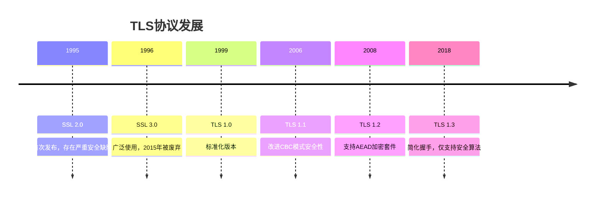
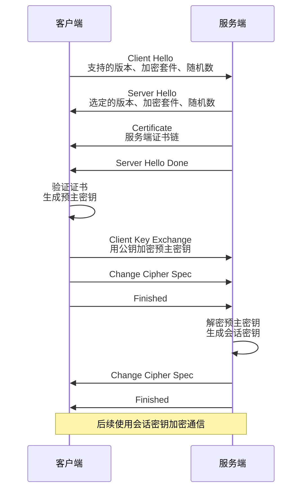
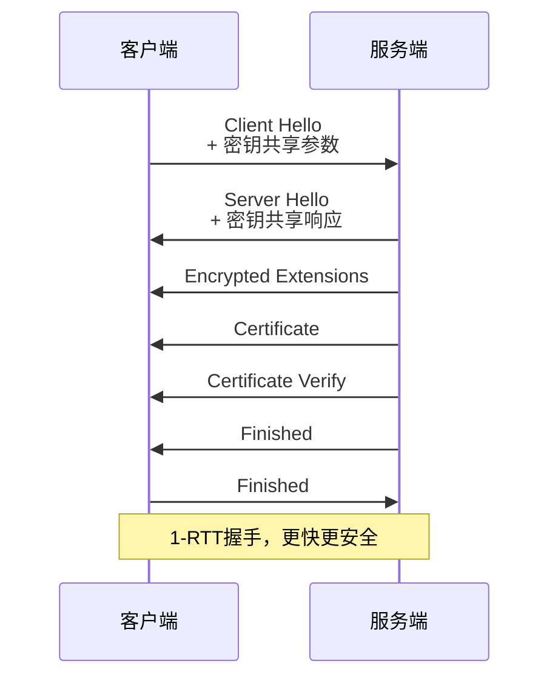
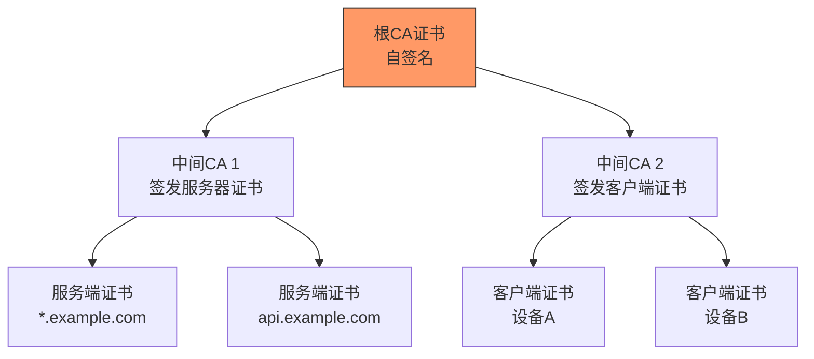
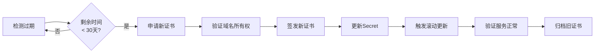

# TLS/SSL 传输安全 - 证书配置

## 概述

TLS（Transport Layer Security）及其前身SSL是保障网络通信安全的基础协议。在分布式系统中，TLS不仅用于客户端与服务端的通信，更是服务间安全通信的基石。正确配置TLS证书是防止中间人攻击、数据窃听的关键。

## TLS协议演进



## TLS握手过程

### TLS 1.2 完整握手



### TLS 1.3 简化握手



## 证书体系

### PKI架构



### 证书类型对比

| 证书类型 | 验证级别 | 适用场景 | 颁发时间 |
|---------|---------|---------|---------|
| DV (域名验证) | 低 | 内部服务、测试环境 | 分钟级 |
| OV (组织验证) | 中 | 企业网站、B2B服务 | 1-3天 |
| EV (扩展验证) | 高 | 金融机构、电商平台 | 1-2周 |
| 通配符证书 | 中 | 多子域名服务 | 1-3天 |

## 证书配置实践

### Nginx TLS配置

```nginx
# /etc/nginx/nginx.conf
server {
    listen 443 ssl http2;
    server_name api.example.com;

    # 证书配置
    ssl_certificate     /etc/ssl/certs/server.crt;
    ssl_certificate_key /etc/ssl/private/server.key;

    # 证书链（包含中间CA）
    ssl_trusted_certificate /etc/ssl/certs/ca-chain.crt;

    # TLS版本限制
    ssl_protocols TLSv1.2 TLSv1.3;

    # 加密套件配置
    ssl_ciphers ECDHE-ECDSA-AES128-GCM-SHA256:ECDHE-RSA-AES128-GCM-SHA256;
    ssl_prefer_server_ciphers on;

    # 会话缓存
    ssl_session_cache shared:SSL:10m;
    ssl_session_timeout 1d;
    ssl_session_tickets off;

    # OCSP Stapling
    ssl_stapling on;
    ssl_stapling_verify on;
    resolver 8.8.8.8 8.8.4.4 valid=300s;
    resolver_timeout 5s;

    # HSTS
    add_header Strict-Transport-Security "max-age=63072000" always;

    location / {
        proxy_pass http://backend;
    }
}

# HTTP重定向到HTTPS
server {
    listen 80;
    server_name api.example.com;
    return 301 https://$server_name$request_uri;
}
```

### Envoy TLS配置

```yaml
# envoy.yaml
static_resources:
  listeners:
  - name: https_listener
    address:
      socket_address:
        address: 0.0.0.0
        port_value: 443
    filter_chains:
    - filters:
      - name: envoy.filters.network.http_connection_manager
        typed_config:
          "@type": type.googleapis.com/envoy.extensions.filters.network.http_connection_manager.v3.HttpConnectionManager
          stat_prefix: ingress_https
          codec_type: AUTO
          route_config:
            name: local_route
            virtual_hosts:
            - name: backend
              domains: ["*"]
              routes:
              - match:
                  prefix: "/"
                route:
                  cluster: backend_service
          http_filters:
          - name: envoy.filters.http.router
            typed_config:
              "@type": type.googleapis.com/envoy.extensions.filters.http.router.v3.Router
      transport_socket:
        name: envoy.transport_sockets.tls
        typed_config:
          "@type": type.googleapis.com/envoy.extensions.transport_sockets.tls.v3.DownstreamTlsContext
          common_tls_context:
            tls_certificate_sds_secret_configs:
            - name: server_cert
              sds_config:
                path: /etc/envoy/certs.yaml
            tls_params:
              tls_minimum_protocol_version: TLSv1_2
              tls_maximum_protocol_version: TLSv1_3
            validation_context:
              trusted_ca:
                filename: /etc/ssl/certs/ca.crt
```

## 证书管理自动化

### Cert-Manager部署

```yaml
# cert-manager配置
apiVersion: cert-manager.io/v1
kind: ClusterIssuer
metadata:
  name: letsencrypt-prod
spec:
  acme:
    server: https://acme-v02.api.letsencrypt.org/directory
    email: admin@example.com
    privateKeySecretRef:
      name: letsencrypt-prod
    solvers:
    - http01:
        ingress:
          class: nginx
---
apiVersion: cert-manager.io/v1
kind: Certificate
metadata:
  name: api-tls
  namespace: production
spec:
  secretName: api-tls-secret
  issuerRef:
    name: letsencrypt-prod
    kind: ClusterIssuer
  dnsNames:
  - api.example.com
  - app.example.com
  renewBefore: 720h  # 30天前自动续期
```

### 证书轮换流程



## 安全配置检查清单

| 检查项 | 推荐配置 | 风险等级 |
|-------|---------|---------|
| TLS版本 | 仅TLS 1.2+ | 高 |
| 弱加密套件 | 禁用RC4、DES、MD5 | 高 |
| 证书有效期 | 不超过397天 | 中 |
| 证书链完整 | 包含中间CA | 高 |
| 主机名验证 | 严格匹配 | 高 |
| HSTS头 | max-age ≥ 1年 | 中 |
| 会话恢复 | 启用ticket + cache | 低 |

## 证书监控告警

```yaml
# Prometheus告警规则
groups:
- name: tls_alerts
  rules:
  - alert: TLSCertificateExpiringSoon
    expr: |
      (ssl_certificate_expiry_seconds - time()) / 86400 < 30
    for: 1h
    labels:
      severity: warning
    annotations:
      summary: "TLS证书即将过期"
      description: "证书{{ $labels.dns_names }}将在{{ $value }}天后过期"

  - alert: TLSCertificateExpired
    expr: |
      ssl_certificate_expiry_seconds - time() < 0
    for: 5m
    labels:
      severity: critical
    annotations:
      summary: "TLS证书已过期"
      description: "证书{{ $labels.dns_names }}已过期"
```

---

*文档版本: v1.0 | 最后更新: 2026-04-03*
