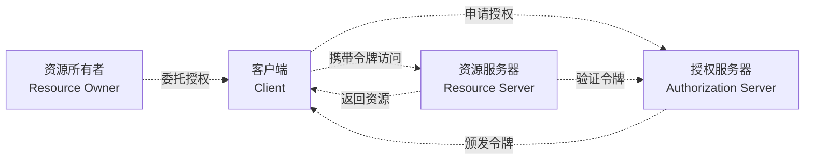
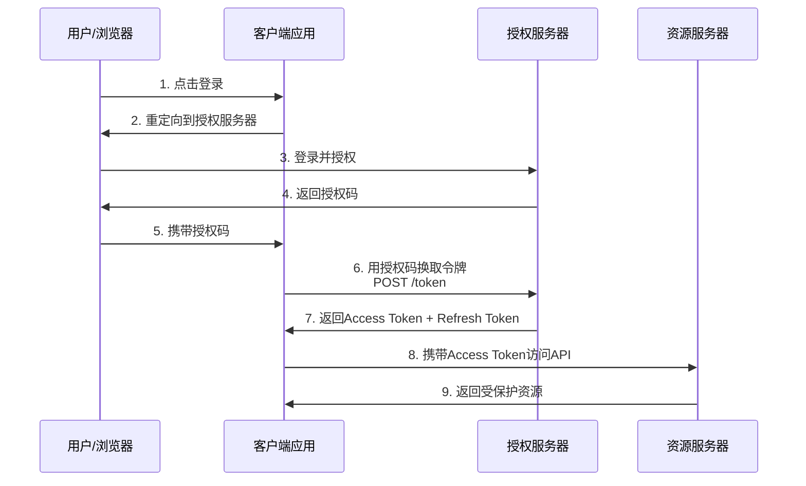
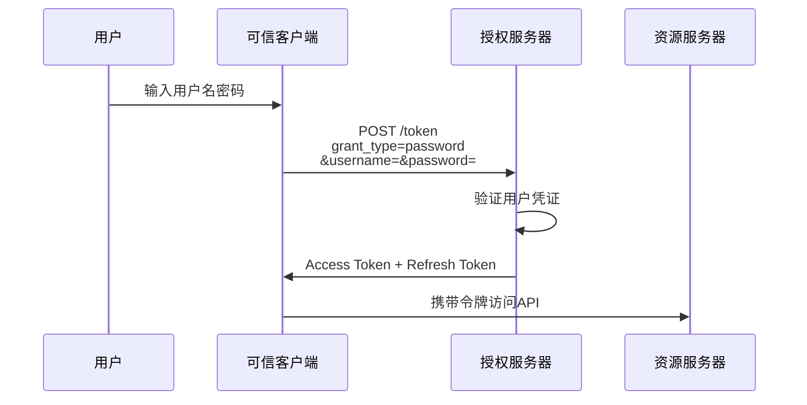
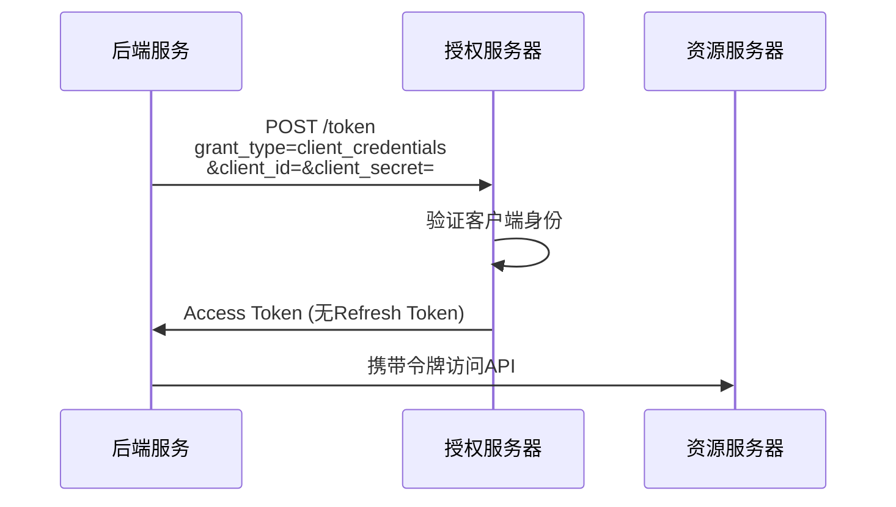
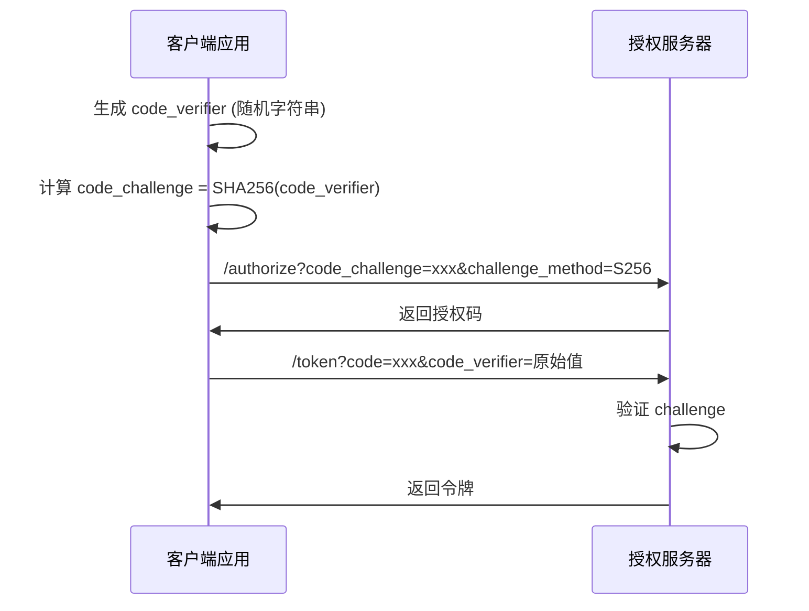
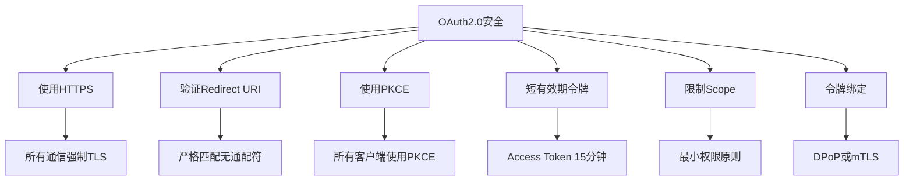

# OAuth 2.0 授权框架 - 四种授权模式

## 概述

OAuth 2.0是行业标准的授权协议，允许第三方应用在不获取用户密码的情况下访问用户资源。在现代分布式系统中，OAuth 2.0是服务间授权和API访问控制的核心机制。

## OAuth 2.0 架构角色



## 四种授权模式

### 1. 授权码模式 (Authorization Code)

最安全、最常用的模式，适用于服务端应用。



**配置示例：**

```yaml
# 授权服务器配置 (Spring Security OAuth2)
spring:
  security:
    oauth2:
      authorizationserver:
        client:
          my-client:
            registration:
              client-id: "web-app-client"
              client-secret: "{bcrypt}$2a$10$..."
              client-authentication-methods:
                - "client_secret_basic"
              authorization-grant-types:
                - "authorization_code"
                - "refresh_token"
              redirect-uris:
                - "https://app.example.com/oauth2/callback"
              scopes:
                - "openid"
                - "profile"
                - "orders:read"
                - "orders:write"
            token:
              access-token-time-to-live: 15m
              refresh-token-time-to-live: 7d
              reuse-refresh-tokens: false
```

### 2. 简化模式 (Implicit)

已废弃，不推荐使用。令牌直接返回给客户端。

```
不推荐用于生产环境
┌─────────┐                                            ┌─────────────┐
│  浏览器  │──(A) 授权请求 ─────────────────────────────▶│ 授权服务器  │
│   应用   │   response_type=token                       │             │
│         │                                            │             │
│         │◀─(B) 重定向 ────────────────────────────────│             │
│         │   access_token=xxx&token_type=Bearer        │             │
│         │                                            │             │
│         │──(C) 携带令牌访问API ──────────────────────▶│  资源服务器  │
└─────────┘                                            └─────────────┘
```

### 3. 密码凭证模式 (Resource Owner Password)

用户直接提供用户名密码给客户端，仅适用于受信任的第一方应用。



**配置示例：**

```python
# Python requests OAuth2 密码模式
import requests

def get_token():
    response = requests.post(
        'https://auth.example.com/oauth/token',
        data={
            'grant_type': 'password',
            'username': 'user@example.com',
            'password': 'user_password',
            'client_id': 'trusted-app',
            'client_secret': 'app_secret',
            'scope': 'read write'
        }
    )
    return response.json()['access_token']
```

### 4. 客户端凭证模式 (Client Credentials)

适用于服务器到服务器的通信，不涉及用户。



**配置示例：**

```bash
# cURL 获取客户端凭证令牌
curl -X POST https://auth.example.com/oauth/token \
  -H "Content-Type: application/x-www-form-urlencoded" \
  -d "grant_type=client_credentials" \
  -d "client_id=service-a" \
  -d "client_secret=service-a-secret" \
  -d "scope=inventory:read inventory:write"
```

## 令牌类型

### 令牌对比

| 特性 | Access Token | Refresh Token |
|-----|--------------|---------------|
| 用途 | 访问受保护资源 | 获取新的Access Token |
| 有效期 | 短（15分钟-1小时） | 长（7天-90天） |
| 存储位置 | 内存/临时存储 | 安全存储（HTTP Only Cookie） |
| 传输频率 | 每次API请求 | 仅过期时 |

### JWT令牌结构

```
┌─────────────────────────────────────────────────────────────────┐
│                         JWT 令牌结构                              │
├─────────────────────────────────────────────────────────────────┤
│  Header                                                          │
│  {                                                               │
│    "alg": "RS256",                                               │
│    "typ": "JWT",                                                 │
│    "kid": "key-id-1"                                             │
│  }                                                               │
│  ─────────────────────────────────────────────────────────────── │
│  Payload                                                         │
│  {                                                               │
│    "iss": "https://auth.example.com",                            │
│    "sub": "user-123",                                            │
│    "aud": "api.example.com",                                     │
│    "exp": 1712345678,                                            │
│    "iat": 1712342078,                                            │
│    "scope": "read write",                                        │
│    "roles": ["user", "premium"]                                  │
│  }                                                               │
│  ─────────────────────────────────────────────────────────────── │
│  Signature                                                       │
│  RSASHA256(                                                      │
│    base64UrlEncode(header) + "." +                               │
│    base64UrlEncode(payload),                                     │
│    private_key                                                   │
│  )                                                               │
└─────────────────────────────────────────────────────────────────┘
```

## PKCE扩展（推荐）

### 授权码+PKCE流程



**配置示例：**

```javascript
// JavaScript PKCE实现
const crypto = require('crypto');

// 生成code_verifier
function generateCodeVerifier() {
    return base64URLEncode(crypto.randomBytes(32));
}

// 生成code_challenge
function generateCodeChallenge(verifier) {
    return base64URLEncode(
        crypto.createHash('sha256').update(verifier).digest()
    );
}

// PKCE授权请求
const codeVerifier = generateCodeVerifier();
const codeChallenge = generateCodeChallenge(codeVerifier);

const authUrl = `https://auth.example.com/oauth/authorize?` +
    `response_type=code&` +
    `client_id=my-app&` +
    `redirect_uri=https://app.example.com/callback&` +
    `code_challenge=${codeChallenge}&` +
    `code_challenge_method=S256&` +
    `scope=read write`;
```

## 安全最佳实践



---

*文档版本: v1.0 | 最后更新: 2026-04-03*
