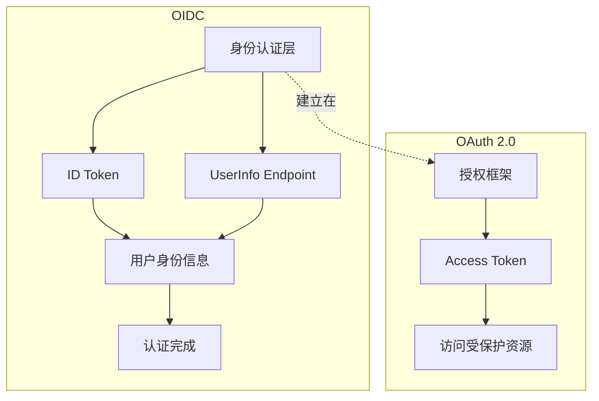
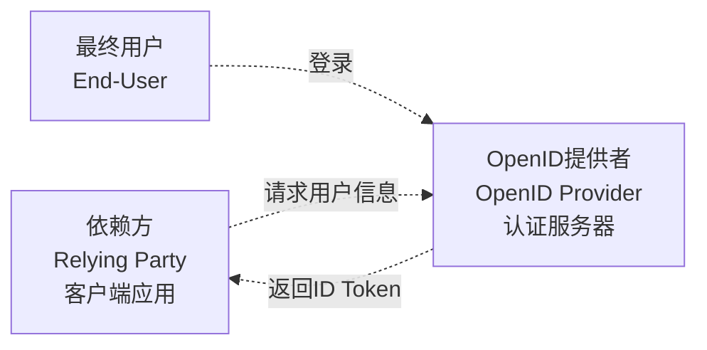
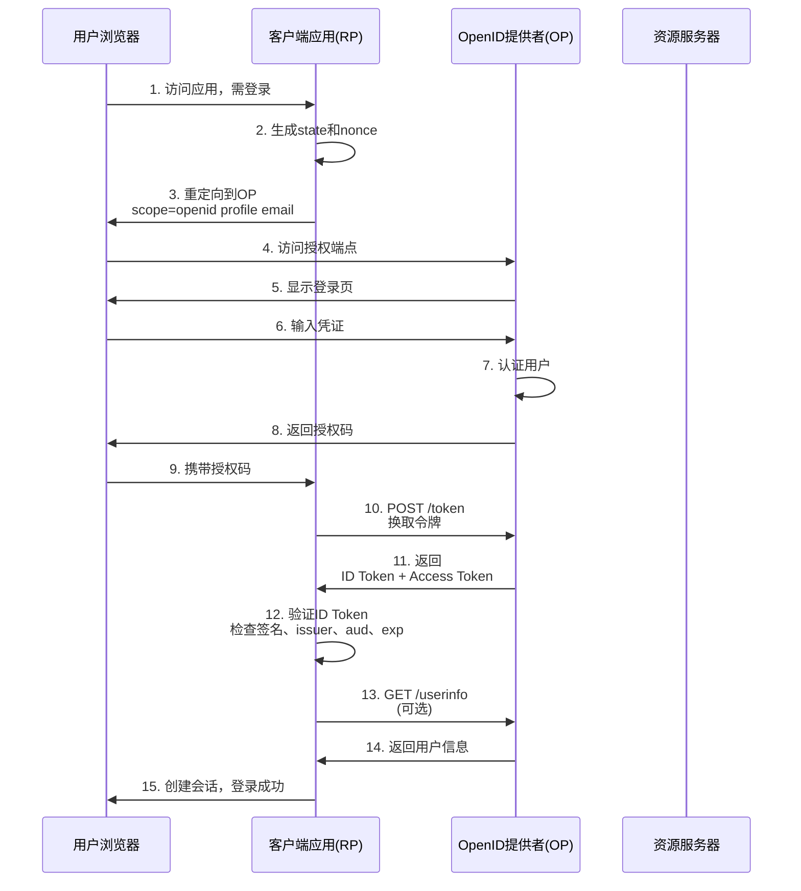
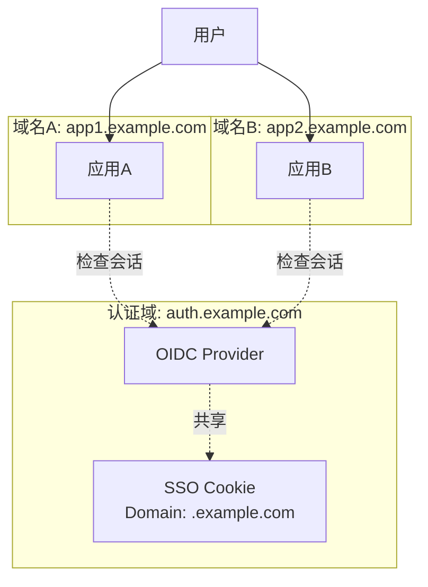

# OIDC 身份认证 - 基于OAuth2的身份层

## 概述

OpenID Connect (OIDC) 是建立在OAuth 2.0协议之上的身份认证层。它解决了OAuth 2.0仅提供授权而不提供身份信息的局限，通过标准化的ID Token返回用户身份信息，成为现代分布式系统的首选认证方案。

## OIDC vs OAuth 2.0



## 核心组件

### OIDC参与者



### ID Token详解

```
┌────────────────────────────────────────────────────────────────────┐
│                        ID Token (JWT格式)                           │
├────────────────────────────────────────────────────────────────────┤
│ Header:                                                             │
│ {                                                                   │
│   "alg": "RS256",                                                   │
│   "kid": "2024-04-key-1",                                           │
│   "typ": "JWT"                                                      │
│ }                                                                   │
├────────────────────────────────────────────────────────────────────┤
│ Payload (Claims):                                                   │
│ {                                                                   │
│   "iss": "https://auth.example.com",      // 签发者                │
│   "sub": "auth0|1234567890",              // 用户唯一标识          │
│   "aud": "my-app-client-id",              // 受众                  │
│   "exp": 1712345678,                      // 过期时间              │
│   "iat": 1712342078,                      // 签发时间              │
│   "auth_time": 1712342000,                // 认证时间              │
│   "nonce": "n-0S6_WzA2Mj",                // 防重放攻击            │
│   "acr": "urn:mace:incommon:iap:silver",  // 认证上下文           │
│   "amr": ["pwd", "otp"],                  // 认证方式              │
│   "name": "张三",                          // 标准Profile Claims  │
│   "email": "zhangsan@example.com",                                │
│   "picture": "https://.../avatar.jpg"                            │
│ }                                                                   │
└────────────────────────────────────────────────────────────────────┘
```

## 认证流程

### 授权码模式 + OIDC



## 标准Scopes和Claims

### Scopes定义

| Scope | 说明 | 包含Claims |
|-------|------|-----------|
| openid | 必需，标识OIDC请求 | sub |
| profile | 基本个人信息 | name, family_name, given_name, picture |
| email | 邮箱信息 | email, email_verified |
| phone | 电话信息 | phone_number, phone_number_verified |
| address | 地址信息 | address (JSON对象) |

### Discovery端点

```json
// GET https://auth.example.com/.well-known/openid-configuration
{
  "issuer": "https://auth.example.com",
  "authorization_endpoint": "https://auth.example.com/oauth2/authorize",
  "token_endpoint": "https://auth.example.com/oauth2/token",
  "userinfo_endpoint": "https://auth.example.com/oauth2/userinfo",
  "jwks_uri": "https://auth.example.com/.well-known/jwks.json",
  "response_types_supported": ["code", "id_token", "token id_token"],
  "subject_types_supported": ["public", "pairwise"],
  "id_token_signing_alg_values_supported": ["RS256", "ES256"],
  "scopes_supported": ["openid", "profile", "email", "phone"],
  "claims_supported": ["sub", "iss", "auth_time", "name", "email"],
  "code_challenge_methods_supported": ["plain", "S256"]
}
```

## 服务端配置

### Spring Security OIDC配置

```yaml
# application.yml
spring:
  security:
    oauth2:
      client:
        registration:
          oidc-provider:
            client-id: "my-app"
            client-secret: "secret"
            client-name: "OIDC Provider"
            provider: "custom-oidc"
            scope:
              - openid
              - profile
              - email
            redirect-uri: "{baseUrl}/login/oauth2/code/{registrationId}"
            client-authentication-method: "client_secret_basic"
            authorization-grant-type: "authorization_code"
        provider:
          custom-oidc:
            issuer-uri: "https://auth.example.com"
            authorization-uri: "https://auth.example.com/oauth2/authorize"
            token-uri: "https://auth.example.com/oauth2/token"
            user-info-uri: "https://auth.example.com/oauth2/userinfo"
            jwk-set-uri: "https://auth.example.com/.well-known/jwks.json"
            user-name-attribute: "sub"
```

### OIDC Provider配置（Auth0/Keycloak风格）

```javascript
// Node.js OIDC Provider配置
const { Provider } = require('oidc-provider');

const configuration = {
  clients: [{
    client_id: 'my-app',
    client_secret: 'client-secret',
    redirect_uris: ['https://app.example.com/callback'],
    response_types: ['code', 'id_token'],
    grant_types: ['authorization_code', 'refresh_token'],
    token_endpoint_auth_method: 'client_secret_post',
    scope: 'openid profile email'
  }],

  claims: {
    openid: ['sub'],
    profile: ['name', 'family_name', 'given_name', 'picture'],
    email: ['email', 'email_verified'],
    custom: ['department', 'employee_id']
  },

  findAccount: async (ctx, id) => ({
    accountId: id,
    claims: async () => ({
      sub: id,
      name: '张三',
      email: 'zhangsan@example.com',
      email_verified: true,
      department: '技术部',
      employee_id: 'EMP001'
    }),
  }),

  interactions: {
    url: (ctx, interaction) => `/interaction/${interaction.uid}`,
  },

  cookies: {
    long: { signed: true, maxAge: 7 * 24 * 60 * 60 * 1000 },
    short: { signed: true },
    keys: ['some secret key', 'and also the old rotated away'],
  },

  jwks: {
    keys: [
      // RSA私钥用于签名ID Token
      {
        kty: 'RSA',
        kid: '2024-key-1',
        use: 'sig',
        n: 'xGOr...',
        e: 'AQAB',
        d: '...',
        p: '...',
        q: '...',
        dp: '...',
        dq: '...',
        qi: '...'
      }
    ]
  }
};

const oidc = new Provider('https://auth.example.com', configuration);
```

## 客户端集成

### React + OIDC客户端

```typescript
// authConfig.ts
export const oidcConfig = {
  authority: 'https://auth.example.com',
  client_id: 'my-spa-app',
  redirect_uri: 'https://app.example.com/callback',
  response_type: 'code',
  scope: 'openid profile email api:read',
  userStore: new WebStorageStateStore({ store: window.localStorage }),
  metadata: {
    issuer: 'https://auth.example.com',
    authorization_endpoint: 'https://auth.example.com/oauth2/authorize',
    token_endpoint: 'https://auth.example.com/oauth2/token',
    userinfo_endpoint: 'https://auth.example.com/oauth2/userinfo',
    end_session_endpoint: 'https://auth.example.com/oauth2/logout',
  }
};

// App.tsx
import { AuthProvider } from 'react-oidc-context';
import { oidcConfig } from './authConfig';

function App() {
  return (
    <AuthProvider {...oidcConfig}>
      <YourApplication />
    </AuthProvider>
  );
}

// ProtectedComponent.tsx
import { useAuth } from 'react-oidc-context';

function ProtectedComponent() {
  const auth = useAuth();

  if (auth.isLoading) return <div>Loading...</div>;
  if (auth.error) return <div>Error: {auth.error.message}</div>;
  if (!auth.isAuthenticated) {
    return <button onClick={() => auth.signinRedirect()}>登录</button>;
  }

  // ID Token内容
  const idTokenClaims = auth.user?.id_token ?
    JSON.parse(atob(auth.user.id_token.split('.')[1])) : null;

  return (
    <div>
      <h1>欢迎, {auth.user?.profile.name}</h1>
      <p>邮箱: {auth.user?.profile.email}</p>
      <p>Subject: {auth.user?.profile.sub}</p>
      <pre>{JSON.stringify(idTokenClaims, null, 2)}</pre>
      <button onClick={() => auth.signoutRedirect()}>退出</button>
    </div>
  );
}
```

## 单点登录 (SSO)

### 跨域SSO架构



### 会话管理端点

```
# 检查会话状态 (IFrame方式)
GET /oauth2/check_session

# 结束会话
GET /oauth2/logout?id_token_hint=xxx&post_logout_redirect_uri=xxx

# 撤销令牌
POST /oauth2/revoke
Content-Type: application/x-www-form-urlencoded

token=refresh_token_xx&token_type_hint=refresh_token
```

## 安全配置检查表

| 检查项 | 说明 | 级别 |
|-------|------|-----|
| 强制HTTPS | 所有OIDC通信使用TLS | 必须 |
| 验证ID Token | 检查签名、iss、aud、exp | 必须 |
| 使用state参数 | 防止CSRF攻击 | 必须 |
| 使用nonce | 防止重放攻击 | 推荐 |
| 短有效期 | ID Token有效期 ≤ 15分钟 | 推荐 |
| 限制Scope | 仅请求必要的scope | 推荐 |

---

*文档版本: v1.0 | 最后更新: 2026-04-03*
