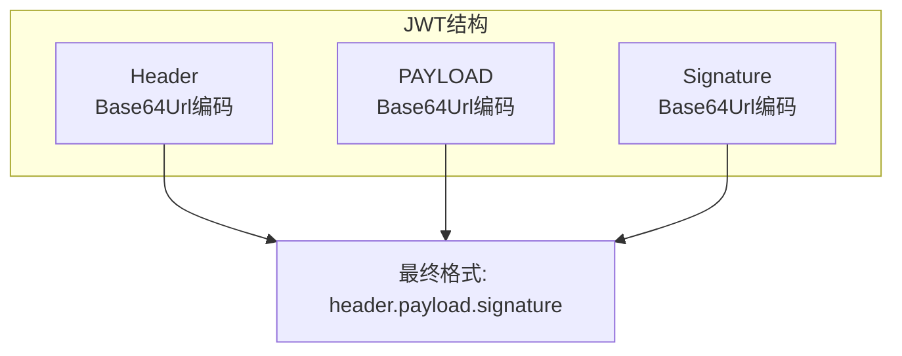
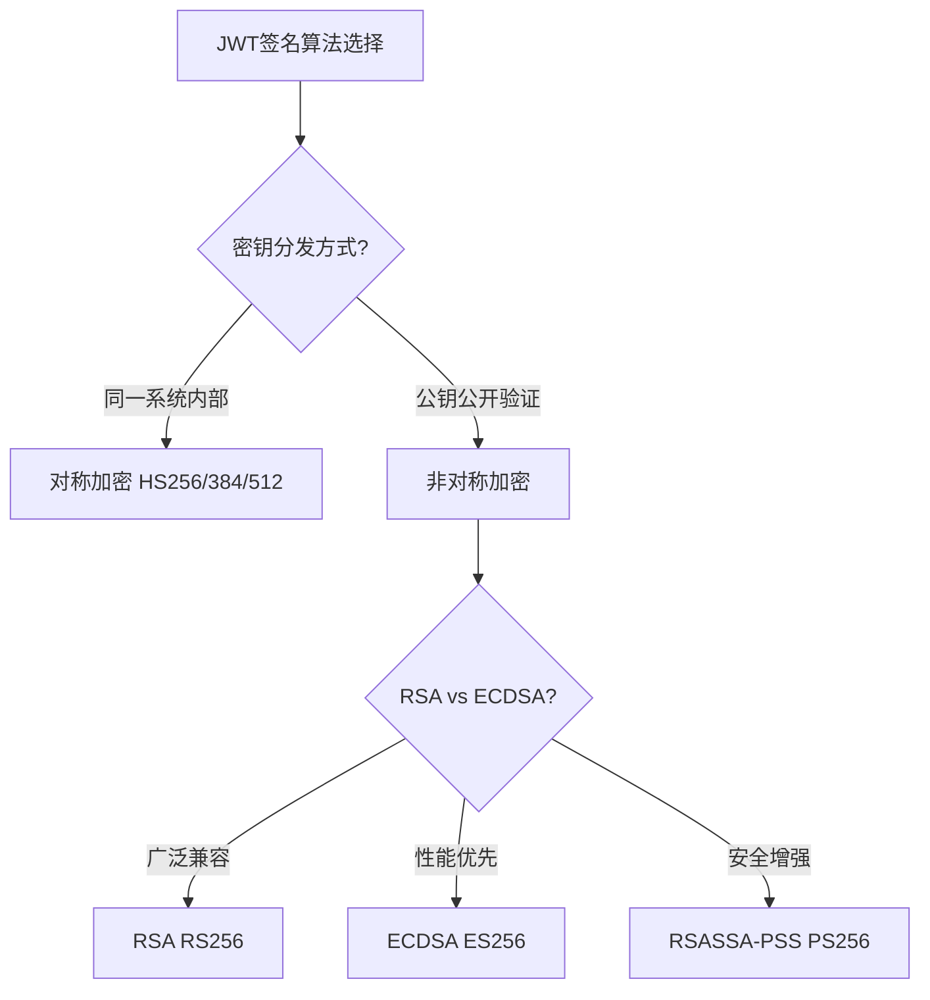
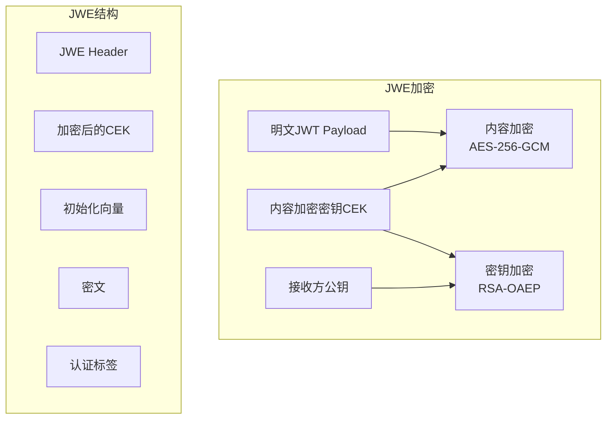
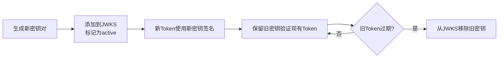
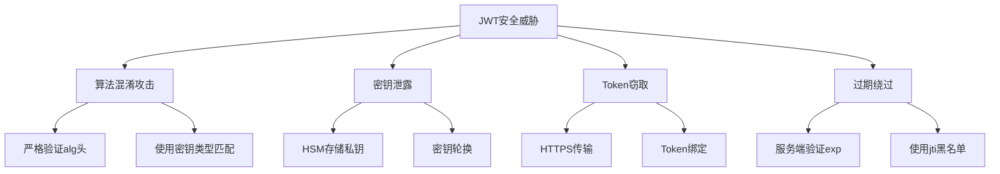

# JWT 令牌安全 - 签名与加密

## 概述

JSON Web Token (JWT) 是分布式系统中广泛使用的令牌格式，用于在安全域间传递声明。JWT本身不包含加密（JWS仅签名），需要正确配置签名算法和密钥管理，以防止令牌伪造和信息泄露。

## JWT结构详解



### 组件说明

```
┌─────────────────────────────────────────────────────────────────┐
│                        JWT 完整结构                               │
├─────────────────────────────────────────────────────────────────┤
│  eyJhbGciOiJSUzI1NiIsInR5cCI6IkpXVCJ9                          │
│  .eyJzdWIiOiIxMjM0NTY3ODkwIiwibmFtZSI                          │
│  6IkpvaG4gRG9lIiwiYWRtaW4iOnRydWV9                            │
│  .SignatureBase64EncodedString                                  │
├─────────────────────────────────────────────────────────────────┤
│  各部分含义:                                                      │
│  • Header: {"alg":"RS256","typ":"JWT"}                          │
│  • Payload: {"sub":"123","name":"John","admin":true}            │
│  • Signature: 使用私钥签名                                        │
└─────────────────────────────────────────────────────────────────┘
```

## 签名算法

### 算法对比

| 算法 | 类型 | 描述 | 适用场景 |
|-----|------|------|---------|
| HS256 | 对称 | HMAC + SHA-256 | 服务端内部使用 |
| HS384 | 对称 | HMAC + SHA-384 | 服务端内部使用 |
| HS512 | 对称 | HMAC + SHA-512 | 服务端内部使用 |
| RS256 | 非对称 | RSA + SHA-256 | 公钥分发场景 |
| RS384 | 非对称 | RSA + SHA-384 | 公钥分发场景 |
| RS512 | 非对称 | RSA + SHA-512 | 公钥分发场景 |
| ES256 | 非对称 | ECDSA + P-256 | 移动端/物联网 |
| ES384 | 非对称 | ECDSA + P-384 | 移动端/物联网 |
| ES512 | 非对称 | ECDSA + P-521 | 移动端/物联网 |
| PS256 | 非对称 | RSASSA-PSS | 高安全场景 |
| none | 无 | 无签名 | 禁用 |

### 算法选择架构



### 密钥配置示例

```python
# Python PyJWT 签名示例
import jwt
from datetime import datetime, timedelta

# ============ 对称密钥 (HS256) ============
SECRET_KEY = "your-256-bit-secret-key-here"

def create_jwt_symmetric(payload: dict) -> str:
    """使用HMAC签名JWT"""
    token = jwt.encode(
        payload={
            **payload,
            "iat": datetime.utcnow(),
            "exp": datetime.utcnow() + timedelta(hours=1),
        },
        key=SECRET_KEY,
        algorithm="HS256",
        headers={"kid": "sym-key-1"}
    )
    return token

def verify_jwt_symmetric(token: str) -> dict:
    """验证HMAC签名JWT"""
    try:
        payload = jwt.decode(
            token,
            key=SECRET_KEY,
            algorithms=["HS256"]
        )
        return payload
    except jwt.ExpiredSignatureError:
        raise ValueError("Token已过期")
    except jwt.InvalidSignatureError:
        raise ValueError("签名无效")

# ============ 非对称密钥 (RS256) ============
from cryptography.hazmat.primitives import serialization
from cryptography.hazmat.primitives.asymmetric import rsa

# 生成RSA密钥对
private_key = rsa.generate_private_key(
    public_exponent=65537,
    key_size=2048
)
public_key = private_key.public_key()

# 序列化私钥
private_pem = private_key.private_bytes(
    encoding=serialization.Encoding.PEM,
    format=serialization.PrivateFormat.PKCS8,
    encryption_algorithm=serialization.NoEncryption()
)

# 序列化公钥
public_pem = public_key.public_bytes(
    encoding=serialization.Encoding.PEM,
    format=serialization.PublicFormat.SubjectPublicKeyInfo
)

def create_jwt_asymmetric(payload: dict) -> str:
    """使用RSA签名JWT"""
    return jwt.encode(
        payload={
            **payload,
            "iat": datetime.utcnow(),
            "exp": datetime.utcnow() + timedelta(minutes=15),
        },
        key=private_pem,
        algorithm="RS256",
        headers={"kid": "rsa-key-1"}
    )

def verify_jwt_asymmetric(token: str) -> dict:
    """使用公钥验证JWT"""
    return jwt.decode(
        token,
        key=public_pem,
        algorithms=["RS256"]
    )
```

## JWE加密

### 加密层次



### JWE配置示例

```python
# Python JWE实现 (使用jose库)
from jose import jwt
from jose.backends import RSAKey
from cryptography.hazmat.primitives import serialization

# 创建JWE令牌（加密JWT）
from jose import jwe

def create_encrypted_jwt(claims: dict, public_key_pem: bytes) -> str:
    """创建加密的JWT (JWE)"""
    # 首先创建签名JWT (JWS)
    signed_jwt = jwt.encode(
        claims,
        private_key,  # 签名用私钥
        algorithm="RS256"
    )

    # 然后加密 (JWE)
    encrypted = jwe.encrypt(
        signed_jwt.encode(),
        public_key_pem,  # 加密用接收方公钥
        algorithm="RSA-OAEP-256",
        encryption="A256GCM"
    )
    return encrypted.decode()

def decrypt_jwe(encrypted_jwt: str, private_key_pem: bytes) -> dict:
    """解密JWE并验证签名"""
    # 解密
    decrypted = jwe.decrypt(
        encrypted_jwt.encode(),
        private_key_pem  # 解密用接收方私钥
    )

    # 验证签名
    claims = jwt.decode(
        decrypted.decode(),
        public_key,  # 验证用发送方公钥
        algorithms=["RS256"]
    )
    return claims
```

## 密钥管理

### JWKS密钥集

```json
// JWKS (JSON Web Key Set) 配置
{
  "keys": [
    {
      "kty": "RSA",
      "kid": "rsa-key-2024-04",
      "use": "sig",
      "alg": "RS256",
      "n": "xGOr_8Uio5Zr-...base64url-encoded-modulus",
      "e": "AQAB"
    },
    {
      "kty": "RSA",
      "kid": "rsa-key-2024-03",
      "use": "sig",
      "alg": "RS256",
      "n": "pWOj-9QnM3xK-...",
      "e": "AQAB"
    },
    {
      "kty": "EC",
      "kid": "ec-key-2024",
      "use": "sig",
      "alg": "ES256",
      "crv": "P-256",
      "x": "MKBCTNIcKUSDii11ySs3526iDZ8AiTo7Tu6KPAqv7D4",
      "y": "4Etl6SRW2YiLUrN5vfvVHuhp7x8PxltmWWlbbM4IFyM"
    }
  ]
}
```

### 密钥轮换流程



## 安全配置检查表

| 检查项 | 要求 | 风险等级 |
|-------|------|---------|
| 禁用none算法 | 必须拒绝alg: none | 严重 |
| 算法白名单 | 只允许特定算法 | 高 |
| 密钥强度 | RSA ≥ 2048位, EC ≥ P-256 | 高 |
| 密钥分离 | 签名密钥 ≠ 加密密钥 | 中 |
| Token有效期 | Access Token ≤ 15分钟 | 高 |
| 密钥轮换 | 定期更换(30-90天) | 中 |

## 常见攻击与防护



---

*文档版本: v1.0 | 最后更新: 2026-04-03*
