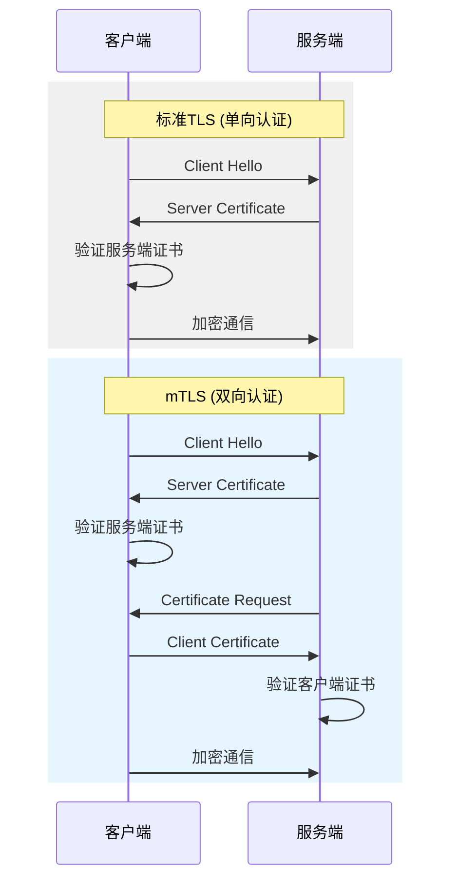
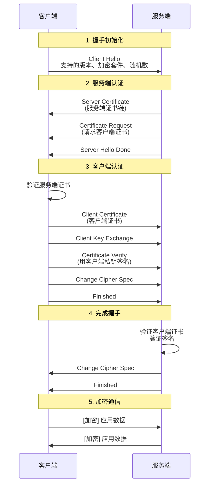
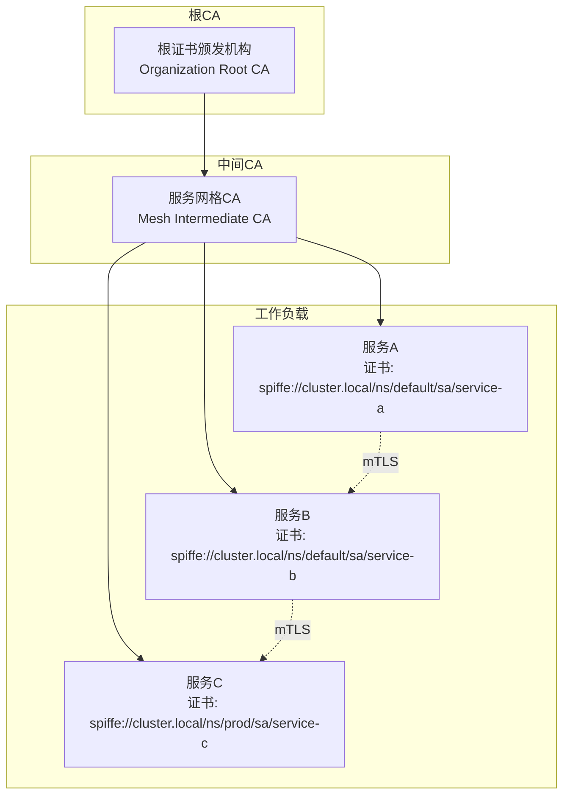

# mTLS 双向认证 - 服务间安全通信

## 概述

mTLS（Mutual TLS）是TLS协议的扩展，要求通信双方互相验证证书。在零信任架构中，mTLS是服务间身份验证的黄金标准，确保只有授权服务可以相互通信，防止服务冒充和中间人攻击。

## TLS vs mTLS



## mTLS握手流程



## 证书架构

### 服务网格mTLS架构



### SPIFFE身份标识

```
┌─────────────────────────────────────────────────────────────────┐
│                      SPIFFE ID 格式                              │
├─────────────────────────────────────────────────────────────────┤
│                                                                 │
│  spiffe://信任域/工作负载标识符                                   │
│                                                                 │
│  示例:                                                           │
│  • spiffe://example.com/ns/production/sa/payment-service        │
│  • spiffe://k8s.cluster.local/ns/shop/sa/order-service          │
│  • spiffe://ec2.aws/account/12345/region/us-west-2/i-abcd1234   │
│                                                                 │
├─────────────────────────────────────────────────────────────────┤
│                      SVID (SPIFFE Verifiable Identity Document) │
├─────────────────────────────────────────────────────────────────┤
│                                                                 │
│  X.509-SVID:                                                    │
│  • Subject Alternative Name: URI = spiffe://...                 │
│  • 用于mTLS身份验证                                              │
│                                                                 │
│  JWT-SVID:                                                      │
│  • sub claim = spiffe://...                                     │
│  • 用于应用层身份传递                                            │
│                                                                 │
└─────────────────────────────────────────────────────────────────┘
```

## 服务网格mTLS配置

### Istio mTLS配置

```yaml
# PeerAuthentication - 配置mTLS模式
apiVersion: security.istio.io/v1beta1
kind: PeerAuthentication
metadata:
  name: default
  namespace: istio-system
spec:
  mtls:
    mode: STRICT  # STRICT/PERMISSIVE/DISABLED
---
# 按命名空间配置
apiVersion: security.istio.io/v1beta1
kind: PeerAuthentication
metadata:
  name: payment-mtls
  namespace: payment
spec:
  mtls:
    mode: STRICT
  selector:
    matchLabels:
      app: payment-service
  portLevelMtls:
    8080:
      mode: PERMISSIVE  # 特定端口允许明文
---
# AuthorizationPolicy - 细粒度访问控制
apiVersion: security.istio.io/v1beta1
kind: AuthorizationPolicy
metadata:
  name: payment-access
  namespace: payment
spec:
  selector:
    matchLabels:
      app: payment-service
  action: ALLOW
  rules:
  - from:
    - source:
        principals:
          - "cluster.local/ns/order/sa/order-service"
          - "cluster.local/ns/user/sa/user-service"
    to:
    - operation:
        methods: ["POST", "GET"]
        paths: ["/api/v1/payments/*"]
  - from:
    - source:
        principals:
          - "cluster.local/ns/admin/sa/admin-service"
    to:
    - operation:
        methods: ["*"]
        paths: ["/api/v1/admin/*"]
```

### Linkerd mTLS配置

```yaml
# Linkerd自动启用mTLS，无需额外配置
# 可通过注解控制特定Pod

apiVersion: apps/v1
kind: Deployment
metadata:
  name: my-service
spec:
  template:
    metadata:
      annotations:
        # 禁用身份（不推荐）
        linkerd.io/inject: disabled

        # 或自定义端口跳过mTLS
        config.linkerd.io/skip-outbound-ports: "3306,6379"
        config.linkerd.io/skip-inbound-ports: "9090"
    spec:
      containers:
      - name: my-service
        image: my-service:v1
---
# ServerAuthorization - 访问控制
apiVersion: policy.linkerd.io/v1beta1
kind: ServerAuthorization
metadata:
  name: payment-grant
  namespace: payment
spec:
  server:
    selector:
      matchLabels:
        app: payment-service
  client:
    meshTLS:
      serviceAccounts:
        - namespace: order
          name: order-service
        - namespace: user
          name: user-service
```

### Envoy mTLS配置

```yaml
# Envoy Sidecar配置
static_resources:
  listeners:
  - name: inbound_listener
    address:
      socket_address:
        address: 0.0.0.0
        port_value: 8443
    filter_chains:
    - transport_socket:
        name: envoy.transport_sockets.tls
        typed_config:
          "@type": type.googleapis.com/envoy.extensions.transport_sockets.tls.v3.DownstreamTlsContext
          common_tls_context:
            tls_certificate_sds_secret_configs:
            - name: spiffe://cluster.local/ns/default/sa/my-service
              sds_config:
                path: /etc/envoy/sds.yaml
            validation_context_sds_secret_config:
              name: spiffe://cluster.local
              sds_config:
                path: /etc/envoy/sds.yaml
          require_client_certificate: true
      filters:
      - name: envoy.filters.network.http_connection_manager
        # ...

  clusters:
  - name: upstream_service
    connect_timeout: 5s
    type: STRICT_DNS
    load_assignment:
      cluster_name: upstream_service
      endpoints:
      - lb_endpoints:
        - endpoint:
            address:
              socket_address:
                address: upstream.default.svc.cluster.local
                port_value: 8443
    transport_socket:
      name: envoy.transport_sockets.tls
      typed_config:
        "@type": type.googleapis.com/envoy.extensions.transport_sockets.tls.v3.UpstreamTlsContext
        common_tls_context:
          tls_certificate_sds_secret_configs:
          - name: spiffe://cluster.local/ns/default/sa/my-service
            sds_config:
              path: /etc/envoy/sds.yaml
          validation_context_sds_secret_config:
            name: spiffe://cluster.local/ns/default/sa/upstream-service
            sds_config:
              path: /etc/envoy/sds.yaml
```

## 证书管理

### cert-manager + SPIRE集成

```yaml
# SPIRE服务器配置
apiVersion: apps/v1
kind: Deployment
metadata:
  name: spire-server
spec:
  template:
    spec:
      containers:
      - name: spire-server
        image: ghcr.io/spiffe/spire-server:latest
        args:
        - -config
        - /run/spire/config/server.conf
        volumeMounts:
        - name: spire-config
          mountPath: /run/spire/config
        - name: spire-data
          mountPath: /run/spire/data
      volumes:
      - name: spire-config
        configMap:
          name: spire-server-config
---
# SPIRE Agent DaemonSet
apiVersion: apps/v1
kind: DaemonSet
metadata:
  name: spire-agent
spec:
  selector:
    matchLabels:
      app: spire-agent
  template:
    spec:
      containers:
      - name: spire-agent
        image: ghcr.io/spiffe/spire-agent:latest
        volumeMounts:
        - name: spire-agent-socket
          mountPath: /run/spire/sockets
        - name: spire-agent-config
          mountPath: /run/spire/config
      volumes:
      - name: spire-agent-socket
        hostPath:
          path: /run/spire/sockets
          type: DirectoryOrCreate
---
# 工作负载注册条目
apiVersion: spire.spiffe.io/v1alpha1
kind: ClusterSPIFFEID
metadata:
  name: payment-service-id
spec:
  spiffeIDTemplate: spiffe://example.org/ns/{{ .PodMeta.Namespace }}/sa/{{ .PodSpec.ServiceAccountName }}
  podSelector:
    matchLabels:
      app: payment-service
  workloadSelectorTemplates:
  - "k8s:ns:payment"
  - "k8s:sa:payment-service"
```

## mTLS调试工具

```bash
# 测试mTLS连接
# 1. 使用openssl测试服务端mTLS
openssl s_client -connect service.example.com:443 \
  -cert client.crt -key client.key \
  -CAfile ca.crt -verify_return_error

# 2. 验证证书链
openssl verify -CAfile ca.crt -untrusted intermediate.crt server.crt

# 3. 检查证书详细信息
openssl x509 -in server.crt -text -noout | grep -A2 "Subject Alternative Name"

# 4. 使用curl测试mTLS
curl -v --cert client.crt --key client.key \
  --cacert ca.crt https://service.example.com/api/health

# 5. 使用grpcurl测试gRPC mTLS
grpcurl -cert client.crt -key client.key \
  -cacert ca.crt service.example.com:443 list
```

## 安全配置检查表

| 检查项 | 要求 | 验证方法 |
|-------|------|---------|
| mTLS强制 | STRICT模式 | istioctl authn tls-check |
| 证书有效期 | ≤ 90天 | openssl x509 -dates |
| 证书链完整 | 包含中间CA | openssl verify |
| SAN验证 | 包含SPIFFE ID | openssl x509 -text |
| 撤销检查 | 启用OCSP/CRL | 配置验证上下文 |

---

*文档版本: v1.0 | 最后更新: 2026-04-03*
