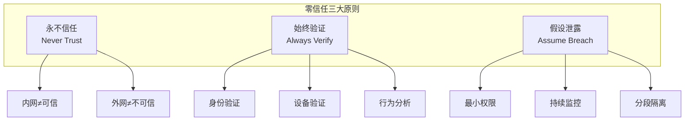
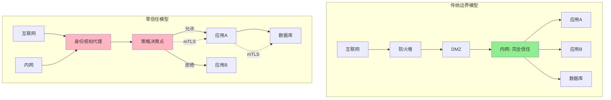
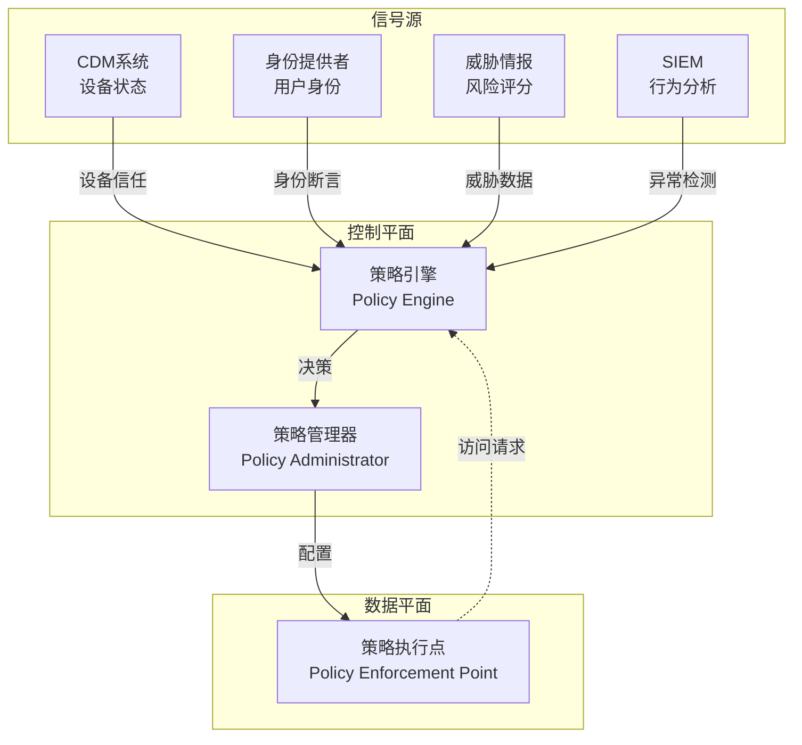
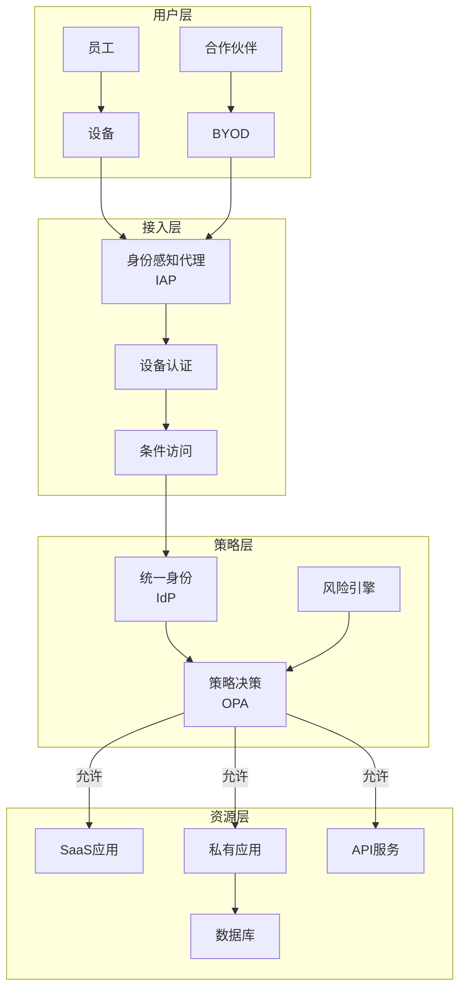
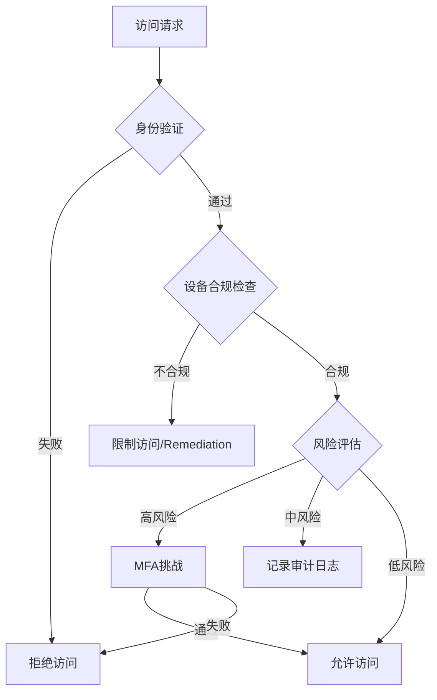
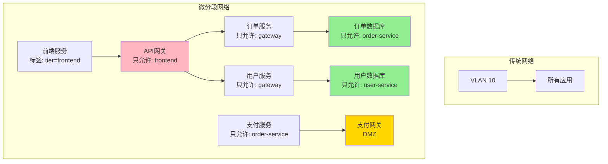
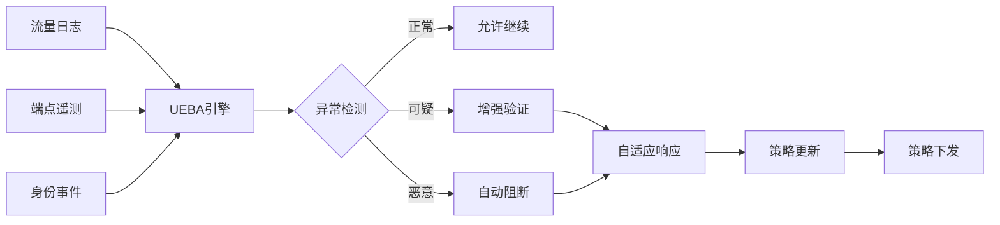

# 零信任架构 - ZTA原则与实现

## 概述

零信任架构（Zero Trust Architecture, ZTA）是一种"从不信任，始终验证"的安全理念。传统边界安全模型假设内网可信，而零信任认为攻击可能来自任何地方，要求对每个访问请求进行严格的身份验证和授权。

## 零信任核心原则



## 传统模型 vs 零信任



## 零信任架构组件

### NIST零信任架构



### 核心组件详解

| 组件 | 功能 | 示例产品 |
|-----|------|---------|
| 策略引擎 | 评估访问请求，做出授权决策 | OPA, AWS IAM |
| 策略管理器 | 执行策略决策，配置执行点 | Istio, Envoy |
| 策略执行点 | 拦截流量，强制执行策略 | API网关, Sidecar |
| 身份目录 | 存储和管理身份信息 | Azure AD, Okta |
| 设备目录 | 设备状态和健康度 | CrowdStrike, Intune |

## 实现架构

### 企业零信任部署



### 微服务零信任实现

```yaml
# Istio + OPA 零信任配置

# 1. 身份验证策略
apiVersion: security.istio.io/v1beta1
kind: RequestAuthentication
metadata:
  name: jwt-auth
  namespace: production
spec:
  selector:
    matchLabels:
      app: order-service
  jwtRules:
  - issuer: "https://auth.example.com"
    jwksUri: "https://auth.example.com/.well-known/jwks.json"
    audiences:
    - "order-service"
    forwardOriginalToken: true
---
# 2. 授权策略
apiVersion: security.istio.io/v1beta1
kind: AuthorizationPolicy
metadata:
  name: order-authz
  namespace: production
spec:
  selector:
    matchLabels:
      app: order-service
  action: ALLOW
  rules:
  - from:
    - source:
        requestPrincipals: ["*"]
    when:
    - key: request.auth.claims[role]
      values: ["admin", "order-manager"]
  - to:
    - operation:
        methods: ["GET"]
        paths: ["/api/v1/orders/*"]
    when:
    - key: request.auth.claims[role]
      values: ["user"]
---
# 3. OPA策略
apiVersion: v1
kind: ConfigMap
metadata:
  name: opa-policy
  namespace: production
data:
  policy.rego: |
    package istio.authz

    import input.attributes.request.http as http_request
    import input.attributes.source as source

    default allow = false

    # 基于设备健康度决策
    allow {
        http_request.method == "POST"
        input.parsed_path[0] == "api"
        data.device_health[device_id].score > 80
    }

    # 基于地理位置决策
    allow {
        http_request.method == "GET"
        geoip_country(source.address.socketAddress.address) in ["CN", "US", "SG"]
    }

    # 基于异常行为决策
    allow {
        not data.threat_intel[source.address.socketAddress.address].malicious
    }
```

## 身份与设备验证

### 条件访问策略



### 设备信任评分

```yaml
# 设备健康度评估
 device_health_scoring:
  dimensions:
    - name: endpoint_security
      weight: 30%
      checks:
        - antivirus_installed: 10_points
        - firewall_enabled: 10_points
        - disk_encryption: 10_points

    - name: patch_compliance
      weight: 25%
      checks:
        - os_up_to_date: 15_points
        - critical_patches_installed: 10_points

    - name: behavioral_risk
      weight: 25%
      checks:
        - no_suspicious_processes: 10_points
        - no_known_bad_ips: 10_points
        - normal_login_patterns: 5_points

    - name: certificate_validity
      weight: 20%
      checks:
        - valid_device_cert: 10_points
        - cert_not_expired: 10_points

  trust_levels:
    high: score >= 80
    medium: 50 <= score < 80
    low: score < 50
```

## 微分段实现

### 网络微分段



### 应用层分段策略

```yaml
# Calico网络策略实现微分段
apiVersion: projectcalico.org/v3
kind: NetworkPolicy
metadata:
  name: payment-service-policy
  namespace: production
spec:
  selector: app == 'payment-service'
  types:
  - Ingress
  - Egress
  ingress:
  # 只允许订单服务访问支付服务的/process端点
  - action: Allow
    protocol: TCP
    source:
      selector: app == 'order-service'
    destination:
      ports:
      - 8080
      selector: app == 'payment-service'
    http:
      methods: ["POST"]
      paths:
      - exact: '/api/v1/payments/process'

  # 拒绝其他所有入站
  - action: Deny

  egress:
  # 只允许访问支付网关
  - action: Allow
    protocol: TCP
    destination:
      selector: app == 'payment-gateway'
      namespaceSelector: name == 'external'
      ports:
      - 443

  # 允许DNS查询
  - action: Allow
    protocol: UDP
    destination:
      ports:
      - 53
```

## 持续监控与响应



---

*文档版本: v1.0 | 最后更新: 2026-04-03*
