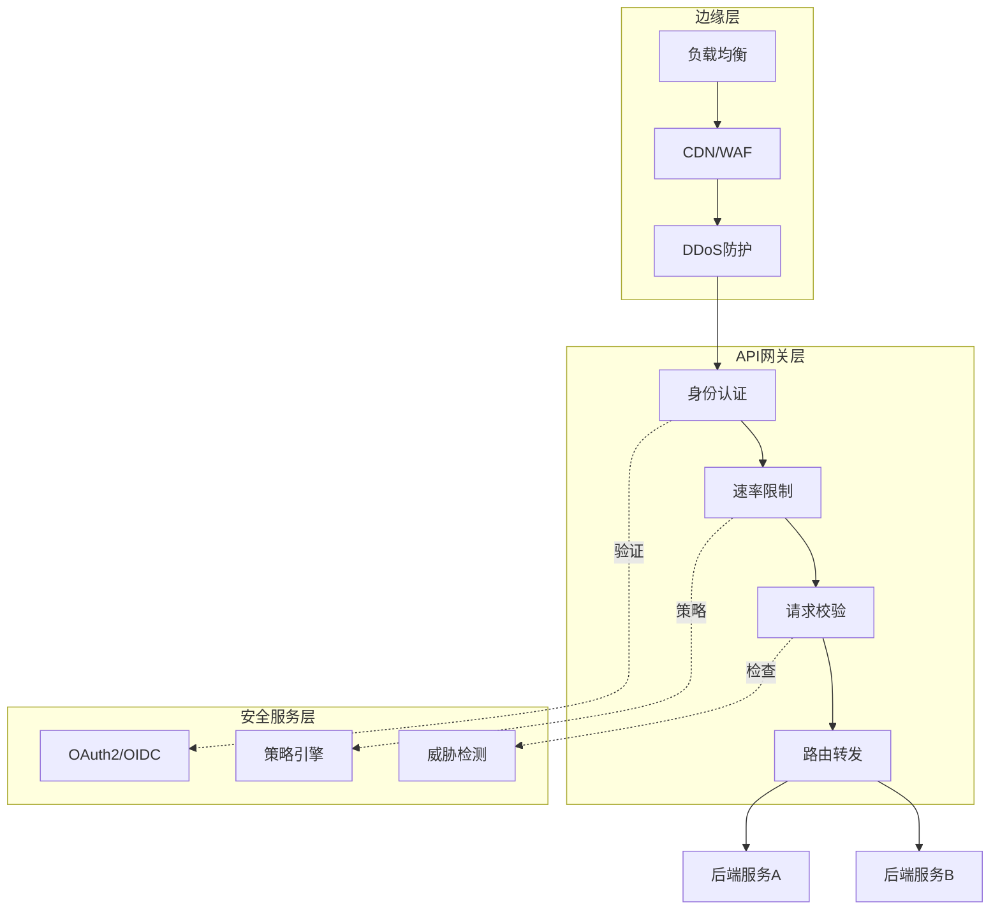
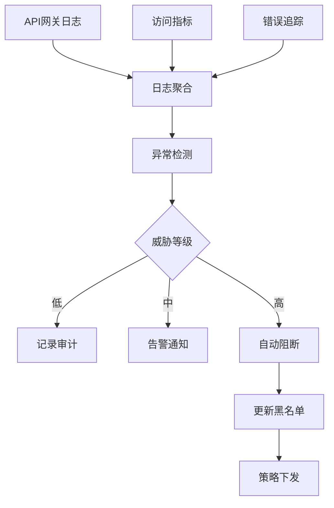

# API网关安全 - 鉴权与防护

## 概述

API网关是分布式系统的流量入口，承担着请求路由、协议转换、安全防护等关键职责。作为系统的边界防护点，API网关需要实现多层次的安全机制，包括身份认证、访问控制、流量管理和威胁防护。

## API网关安全架构



## 认证机制

### 多认证方式支持

```mermaid
graph LR
    A[API请求] --> B{认证方式}
    B -->|Authorization: Bearer| C[JWT验证]
    B -->|X-API-Key| D[API Key验证]
    B -->|Authorization: Basic| E[mTLS]

    C --> F[OAuth2/OIDC]
    D --> G[API Key管理]
    E --> H[证书验证]

    F --> I[授权决策]
    G --> I
    H --> I
```



### Kong网关认证配置

```yaml
# Kong API认证配置
_format_version: "3.0"
services:
- name: order-api
  url: http://order-service:8080
  routes:
  - name: order-routes
    paths:
    - /api/v1/orders

  plugins:
  # JWT认证
  - name: jwt
    config:
      uri_param_names: []
      cookie_names: []
      key_claim_name: iss
      secret_is_base64: false
      claims_to_verify:
      - exp

  # OAuth2集成
  - name: oauth2
    config:
      scopes:
      - read
      - write
      mandatory_scope: true
      token_expiration: 7200
      enable_authorization_code: true

  # 速率限制
  - name: rate-limiting
    config:
      minute: 100
      policy: redis
      redis_host: redis-cluster
      fault_tolerant: true

  # IP限制
  - name: ip-restriction
    config:
      allow:
      - 10.0.0.0/8
      - 172.16.0.0/12

consumers:
- username: mobile-app
  jwt_secrets:
  - algorithm: RS256
    rsa_public_key: |
      -----BEGIN PUBLIC KEY-----
      MIIBIjANBgkqhkiG9w0BAQEFAAOCAQ8AMIIBCgKCAQEA...
      -----END PUBLIC KEY-----
    key: "https://auth.example.com"

- username: partner-service
  keyauth_credentials:
  - key: partner-api-key-12345
```

### Envoy JWT认证

```yaml
# Envoy JWT过滤器配置
http_filters:
- name: envoy.filters.http.jwt_authn
  typed_config:
    "@type": type.googleapis.com/envoy.extensions.filters.http.jwt_authn.v3.JwtAuthentication
    providers:
      auth0:
        issuer: "https://auth.example.com/"
        audiences:
        - "api.example.com"
        remote_jwks:
          http_uri:
            uri: https://auth.example.com/.well-known/jwks.json
            cluster: auth_server
            timeout: 5s
          cache_duration:
            seconds: 300
        # 提取JWT位置
        from_headers:
        - name: authorization
          value_prefix: "Bearer "
        from_params:
        - jwt_token
        forward: true
        payload_in_metadata: jwt_payload

      internal_service:
        issuer: "https://internal.auth/"
        local_jwks:
          inline_string: |
            {
              "keys": [
                {
                  "kty": "RSA",
                  "kid": "internal-key-1",
                  "n": "...",
                  "e": "AQAB"
                }
              ]
            }

    rules:
    # 公开端点
    - match:
        prefix: /api/v1/public
      requires:
        provider_name: auth0

    # 需要特定scope
    - match:
        prefix: /api/v1/admin
      requires:
        provider_and_audiences:
          provider_name: auth0
          audiences:
          - "admin"

    # 内部服务调用
    - match:
        prefix: /api/internal
      requires:
        provider_name: internal_service
```

## 授权策略

### OPA策略集成

```yaml
# Envoy外部授权 + OPA
http_filters:
- name: envoy.filters.http.ext_authz
  typed_config:
    "@type": type.googleapis.com/envoy.extensions.filters.http.ext_authz.v3.ExtAuthz
    grpc_service:
      google_grpc:
        target_uri: opa-envoy:9191
        stat_prefix: opa_auth
      timeout: 0.5s
    transport_api_version: V3
    include_peer_certificate: true

---
# OPA Rego策略
package envoy.authz

import input.attributes.request.http as http_request
import input.attributes.source.address as source_address

default allow = false

# 基于角色的访问控制
allow {
    http_request.method == "GET"
    http_request.path == "/api/v1/orders"
    token.payload.role == "user"
}

allow {
    http_request.method == "POST"
    glob.match("/api/v1/orders/*", [], http_request.path)
    token.payload.role == "admin"
}

# 基于属性的访问控制 (ABAC)
allow {
    http_request.method == "GET"
    glob.match("/api/v1/users/*/orders", [], http_request.path)
    user_id := extract_user_id(http_request.path)
    user_id == token.payload.sub
}

# 基于时间的访问控制
allow {
    http_request.method == "GET"
    [hour, _, _] := time.clock(time.now_ns())
    hour >= 9
    hour < 18
    token.payload.role == "support"
}

# 基于IP的访问控制
allow {
    net.cidr_contains("10.0.0.0/8", source_address.socketAddress.address)
    http_request.path == "/api/internal/health"
}

# 辅助函数
extract_user_id(path) = user_id {
    parts := split(path, "/")
    user_id := parts[4]
}

token := {"payload": payload} {
    [_, encoded] := split(http_request.headers.authorization, " ")
    [payload, _, _] := io.jwt.decode(encoded)
}
```

## 流量管理与防护

### 速率限制配置

```yaml
# Envoy本地速率限制
http_filters:
- name: envoy.filters.http.local_ratelimit
  typed_config:
    "@type": type.googleapis.com/envoy.extensions.filters.http.local_ratelimit.v3.LocalRateLimit
    stat_prefix: http_local_rate_limiter
    token_bucket:
      max_tokens: 100
      tokens_per_fill: 100
      fill_interval: 60s
    filter_enabled:
      runtime_key: local_rate_limit_enabled
      default_value:
        numerator: 100
        denominator: HUNDRED
    filter_enforced:
      runtime_key: local_rate_limit_enforced
      default_value:
        numerator: 100
        denominator: HUNDRED
    response_headers_to_add:
    - append_action: OVERWRITE_IF_EXISTS_OR_ADD
      header:
        key: x-local-rate-limit
        value: 'true'

---
# Redis全局速率限制
rate_limit_service:
  grpc_service:
    envoy_grpc:
      cluster_name: rate_limit_cluster
    timeout: 0.25s

# 速率限制配置 (Ratelimit Service)
domain: api-gateway
descriptors:
  # 按用户限流
  - key: auth.sub
    rate_limit:
      unit: minute
      requests_per_unit: 100

  # 按API端点限流
  - key: path
    value: /api/v1/payments
    rate_limit:
      unit: second
      requests_per_unit: 10

  # 组合限流
  - key: auth.sub
    descriptors:
    - key: path
      rate_limit:
        unit: minute
        requests_per_unit: 20
```

### WAF规则配置

```yaml
# ModSecurity WAF配置
apiVersion: networking.k8s.io/v1
kind: Ingress
metadata:
  name: api-ingress
  annotations:
    nginx.ingress.kubernetes.io/enable-modsecurity: "true"
    nginx.ingress.kubernetes.io/enable-owasp-core-rules: "true"
    nginx.ingress.kubernetes.io/modsecurity-snippet: |
      SecRuleEngine On
      SecRequestBodyAccess On
      SecResponseBodyAccess On
      SecResponseBodyLimit 524288

      # 自定义规则
      SecRule REQUEST_HEADERS:Content-Type "^application/json" \
        "id:1000,phase:1,pass,nolog,ctl:requestBodyProcessor=JSON"

      # SQL注入防护
      SecRule REQUEST_COOKIES|REQUEST_COOKIES_NAMES|REQUEST_FILENAME|ARGS_NAMES|ARGS|XML:/* \
        "@rx (?i:(?:select\s*\*\s*from|union\s*select|insert\s*into|delete\s*from|drop\s*table))" \
        "id:942100,phase:2,deny,status:403,msg:'SQL Injection Attack Detected'"

      # XSS防护
      SecRule REQUEST_COOKIES|REQUEST_COOKIES_NAMES|REQUEST_FILENAME|ARGS_NAMES|ARGS|XML:/* \
        "@rx (?i:(?:<script|javascript:|onload=|onerror=))" \
        "id:941100,phase:2,deny,status:403,msg:'XSS Attack Detected'"

      # 敏感数据检测
      SecRule RESPONSE_BODY "@rx (?i:(?:password|secret|token)\s*[=:]\s*['\"]\w+)" \
        "id:200001,phase:4,deny,status:500,msg:'Sensitive Data Leakage'"
spec:
  rules:
  - host: api.example.com
    http:
      paths:
      - path: /
        pathType: Prefix
        backend:
          service:
            name: api-gateway
            port:
              number: 80
```

## API安全监控



### 安全监控指标

```yaml
# Prometheus告警规则
groups:
- name: api_security
  rules:
  - alert: HighErrorRate
    expr: |
      sum(rate(http_requests_total{status=~"5.."}[5m]))
      / sum(rate(http_requests_total[5m])) > 0.1
    for: 2m
    labels:
      severity: warning
    annotations:
      summary: "API错误率过高"

  - alert: PotentialBruteForce
    expr: |
      sum by (client_ip) (rate(http_requests_total{status="401"}[5m])) > 10
    for: 1m
    labels:
      severity: critical
    annotations:
      summary: "可能的暴力破解攻击"

  - alert: UnusualTrafficPattern
    expr: |
      abs(
        sum(rate(http_requests_total[5m]))
        - avg_over_time(sum(rate(http_requests_total[5m]))[1h:5m])
      ) / stddev_over_time(sum(rate(http_requests_total[5m]))[1h:5m]) > 3
    for: 5m
    labels:
      severity: warning
    annotations:
      summary: "异常流量模式检测"
```

---

*文档版本: v1.0 | 最后更新: 2026-04-03*
