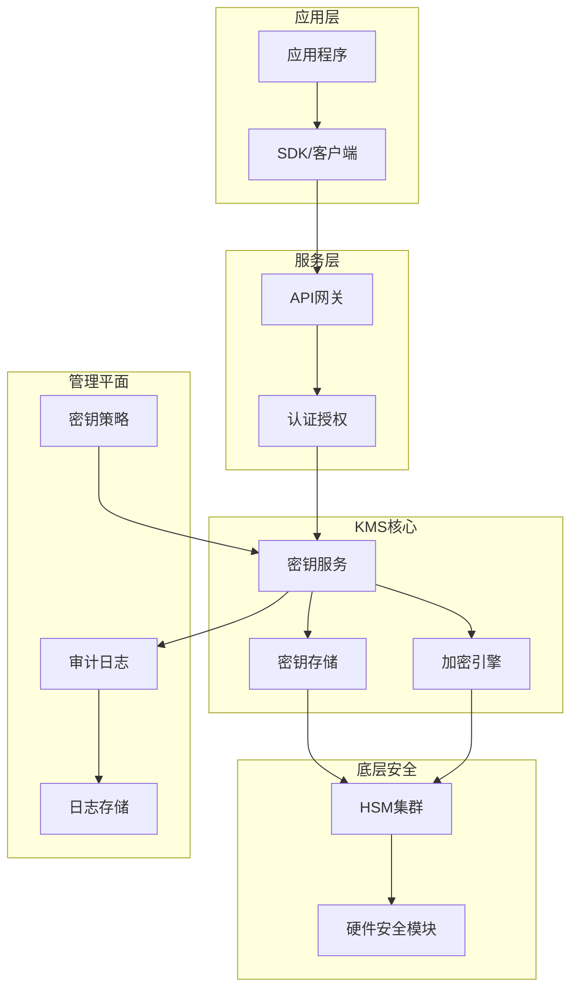
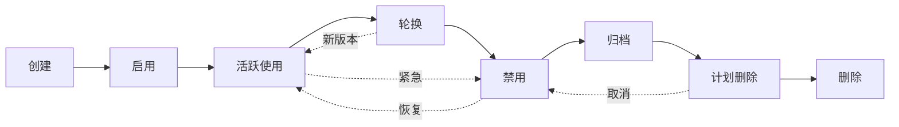
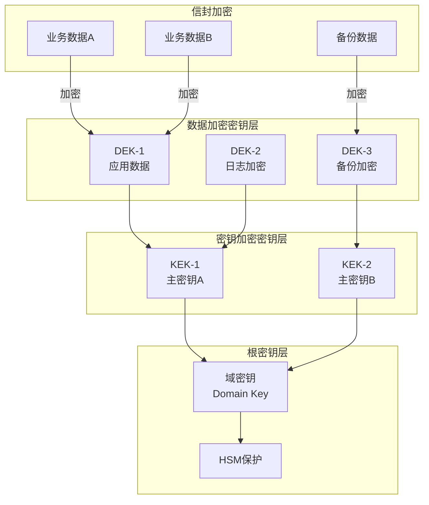
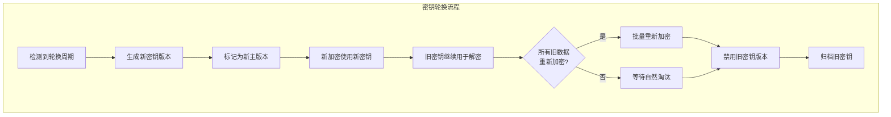

# 密钥管理KMS - 密钥生命周期

## 概述

密钥管理系统（KMS）是分布式安全架构的核心组件，负责密钥的生成、存储、分发、轮换和销毁。有效的密钥管理确保加密操作的安全性，防止密钥泄露导致的系统性风险。

## KMS架构



## 密钥生命周期



### 密钥状态管理

| 状态 | 描述 | 可用操作 |
|-----|------|---------|
| PendingImport | 等待导入密钥材料 | Cancel/Import |
| Enabled | 活跃可用 | Encrypt/Decrypt/Disable/ScheduleDeletion |
| Disabled | 临时禁用 | Enable/ScheduleDeletion |
| PendingDeletion | 等待删除（可取消） | CancelDeletion |
| Deleted | 已删除（可恢复） | - |

## 密钥层级



## 云KMS服务配置

### AWS KMS

```yaml
# Terraform AWS KMS配置
resource "aws_kms_key" "app_master_key" {
  description              = "Application Master Key"
  deletion_window_in_days  = 30
  enable_key_rotation      = true
  multi_region             = true

  policy = jsonencode({
    Version = "2012-10-17"
    Statement = [
      {
        Sid    = "Enable IAM User Permissions"
        Effect = "Allow"
        Principal = {
          AWS = "arn:aws:iam::123456789012:root"
        }
        Action   = "kms:*"
        Resource = "*"
      },
      {
        Sid    = "Allow Application Service"
        Effect = "Allow"
        Principal = {
          AWS = aws_iam_role.app_service.arn
        }
        Action = [
          "kms:Encrypt",
          "kms:Decrypt",
          "kms:GenerateDataKey*",
          "kms:DescribeKey"
        ]
        Resource = "*"
        Condition = {
          StringEquals = {
            "kms:ViaService" = "s3.us-west-2.amazonaws.com"
            "kms:CallerAccount" = "123456789012"
          }
        }
      }
    ]
  })

  tags = {
    Environment = "production"
    Application = "order-service"
  }
}

# 密钥别名
resource "aws_kms_alias" "app_key_alias" {
  name          = "alias/app-master-key"
  target_key_id = aws_kms_key.app_master_key.key_id
}

# 自动轮换配置
resource "aws_kms_key" "auto_rotate_key" {
  description             = "Key with automatic rotation"
  enable_key_rotation     = true
  rotation_period_in_days = 90  # 每90天自动轮换
}
```

### Azure Key Vault

```yaml
# Azure Key Vault配置
resource "azurerm_key_vault" "app_vault" {
  name                = "app-prod-kv"
  location            = "East US"
  resource_group_name = azurerm_resource_group.security.name
  tenant_id           = data.azurerm_client_config.current.tenant_id
  sku_name            = "premium"  # 支持HSM

  soft_delete_retention_days = 90
  purge_protection_enabled   = true

  network_acls {
    default_action             = "Deny"
    bypass                     = "AzureServices"
    ip_rules                   = ["203.0.113.0/24"]
    virtual_network_subnet_ids = [azurerm_subnet.app.id]
  }

  access_policy {
    tenant_id = data.azurerm_client_config.current.tenant_id
    object_id = azurerm_user_assigned_identity.app.principal_id

    key_permissions = [
      "Get", "List", "Encrypt", "Decrypt",
      "WrapKey", "UnwrapKey", "Sign", "Verify"
    ]

    secret_permissions = ["Get", "List"]

    certificate_permissions = ["Get", "List"]
  }
}

# HSM保护的密钥
resource "azurerm_key_vault_key" "hsm_key" {
  name         = "hsm-master-key"
  key_vault_id = azurerm_key_vault.app_vault.id
  key_type     = "RSA-HSM"
  key_size     = 4096

  key_opts = [
    "decrypt",
    "encrypt",
    "sign",
    "unwrapKey",
    "verify",
    "wrapKey",
  ]

  rotation_policy {
    automatic {
      time_before_expiry = "P30D"
    }
    expire_after         = "P90D"
    notify_before_expiry = "P29D"
  }
}
```

### HashiCorp Vault

```hcl
# Vault密钥引擎配置
# 启用Transit引擎
resource "vault_mount" "transit" {
  path        = "transit"
  type        = "transit"
  description = "Transit encryption engine"
}

# 创建加密密钥
resource "vault_transit_secret_backend_key" "app_key" {
  backend          = vault_mount.transit.path
  name             = "app-encryption-key"
  type             = "rsa-4096"
  deletion_allowed = false

  convergent_encryption = false
  derived               = false
  exportable            = false
  allow_plaintext_backup = false

  # 自动轮换
  auto_rotate_period = "720h"  # 30天
}

# 创建AES密钥
resource "vault_transit_secret_backend_key" "data_key" {
  backend = vault_mount.transit.path
  name    = "data-encryption-key"
  type    = "aes256-gcm96"
}

# 策略配置
resource "vault_policy" "app_encryption" {
  name = "app-encryption-policy"

  policy = <<EOT
# 允许加密/解密操作
path "transit/encrypt/app-encryption-key" {
  capabilities = ["create", "update"]
}

path "transit/decrypt/app-encryption-key" {
  capabilities = ["create", "update"]
}

# 允许数据密钥操作
path "transit/datakey/plaintext/data-encryption-key" {
  capabilities = ["create", "update"]
}

path "transit/datakey/wrapped/data-encryption-key" {
  capabilities = ["create", "update"]
}

# 只读访问密钥信息
path "transit/keys/app-encryption-key" {
  capabilities = ["read"]
}
EOT
}

# Kubernetes认证配置
resource "vault_auth_backend" "kubernetes" {
  type = "kubernetes"
}

resource "vault_kubernetes_auth_backend_role" "app_role" {
  backend                          = vault_auth_backend.kubernetes.path
  role_name                        = "order-service"
  bound_service_account_names      = ["order-service"]
  bound_service_account_namespaces = ["production"]
  token_ttl                        = 3600
  token_policies                   = ["app-encryption-policy"]
}
```

## 信封加密实现

```python
# Python信封加密实现
from cryptography.fernet import Fernet
import boto3
import base64

class EnvelopeEncryption:
    def __init__(self, kms_client, key_id):
        self.kms = kms_client
        self.key_id = key_id

    def encrypt(self, plaintext: bytes) -> dict:
        """信封加密：使用DEK加密数据，使用KEK加密DEK"""
        # 1. 生成数据加密密钥(DEK)
        dek = Fernet.generate_key()
        f = Fernet(dek)

        # 2. 使用DEK加密数据
        ciphertext = f.encrypt(plaintext)

        # 3. 使用KMS主密钥(KEK)加密DEK
        response = self.kms.encrypt(
            KeyId=self.key_id,
            Plaintext=dek
        )
        encrypted_dek = base64.b64encode(response['CiphertextBlob']).decode()

        return {
            'ciphertext': base64.b64encode(ciphertext).decode(),
            'encrypted_dek': encrypted_dek,
            'key_id': self.key_id,
            'algorithm': 'AES-256-GCM'
        }

    def decrypt(self, envelope: dict) -> bytes:
        """信封解密"""
        # 1. 使用KEK解密DEK
        encrypted_dek = base64.b64decode(envelope['encrypted_dek'])
        response = self.kms.decrypt(CiphertextBlob=encrypted_dek)
        dek = response['Plaintext']

        # 2. 使用DEK解密数据
        f = Fernet(dek)
        ciphertext = base64.b64decode(envelope['ciphertext'])
        plaintext = f.decrypt(ciphertext)

        return plaintext

# 使用示例
kms_client = boto3.client('kms', region_name='us-west-2')
encryptor = EnvelopeEncryption(kms_client, 'alias/app-master-key')

# 加密
envelope = encryptor.encrypt(b"敏感业务数据")
print(f"Encrypted envelope: {envelope}")

# 解密
decrypted = encryptor.decrypt(envelope)
print(f"Decrypted: {decrypted.decode()}")
```

## 密钥轮换策略



---

*文档版本: v1.0 | 最后更新: 2026-04-03*
