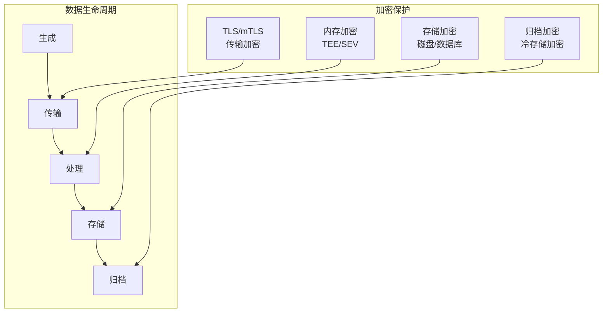
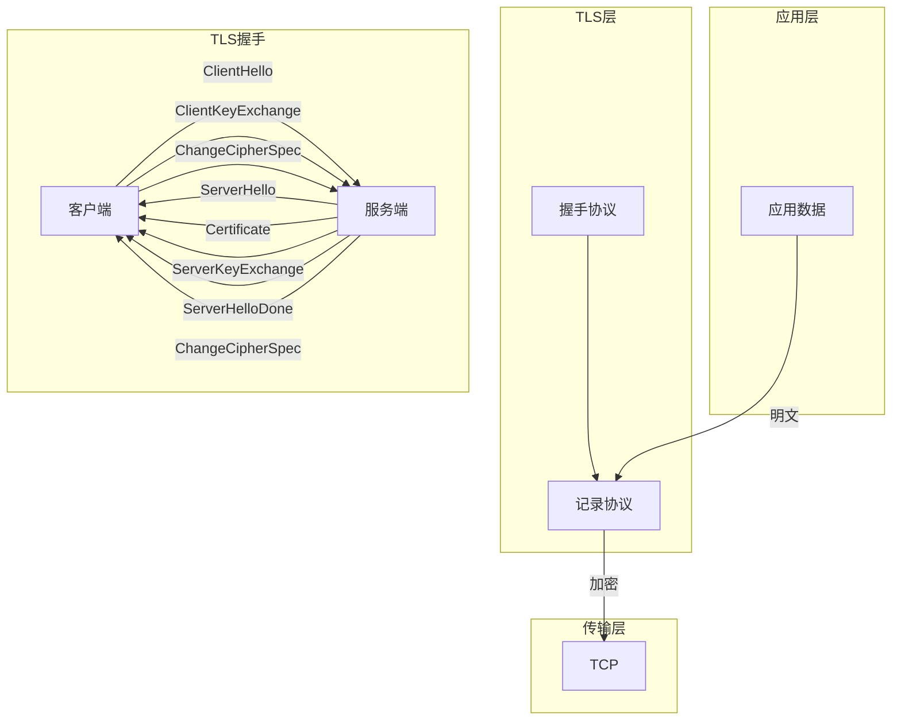
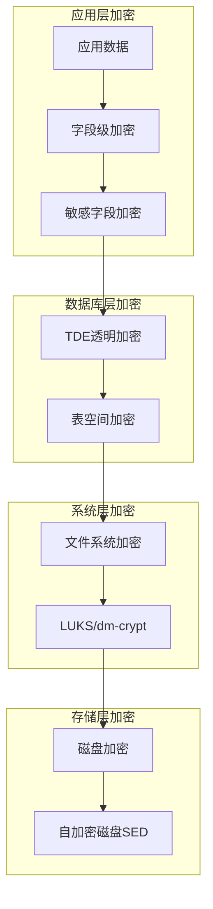

# 数据加密方案 - 传输加密与存储加密

## 概述

数据加密是保护数据机密性的核心技术，分为传输中加密（Data in Transit）和静态数据加密（Data at Rest）。在分布式系统中，数据在多个节点间流动并持久化存储，需要建立端到端的加密保护体系。

## 加密体系架构



## 传输加密

### TLS分层加密



### 传输加密配置

```yaml
# Nginx TLS配置
server {
    listen 443 ssl http2;
    server_name api.example.com;

    # 证书配置
    ssl_certificate     /etc/ssl/certs/server.crt;
    ssl_certificate_key /etc/ssl/private/server.key;

    # TLS版本和密码套件
    ssl_protocols TLSv1.2 TLSv1.3;
    ssl_ciphers ECDHE-ECDSA-AES128-GCM-SHA256:ECDHE-RSA-AES128-GCM-SHA256;
    ssl_prefer_server_ciphers on;

    # 会话复用
    ssl_session_cache shared:SSL:10m;
    ssl_session_timeout 1d;
    ssl_session_tickets off;

    # OCSP Stapling
    ssl_stapling on;
    ssl_stapling_verify on;

    # mTLS配置（服务间通信）
    ssl_client_certificate /etc/ssl/certs/ca.crt;
    ssl_verify_client optional;
    ssl_verify_depth 2;

    location / {
        if ($ssl_client_verify != SUCCESS) {
            return 403;
        }
        proxy_pass http://backend;

        # 传递客户端证书信息
        proxy_set_header X-SSL-Client-S-DN $ssl_client_s_dn;
        proxy_set_header X-SSL-Client-I-DN $ssl_client_i_dn;
        proxy_set_header X-SSL-Client-Serial $ssl_client_serial;
    }
}
```

### gRPC TLS配置

```go
// Go gRPC mTLS配置
package main

import (
    "crypto/tls"
    "crypto/x509"
    "google.golang.org/grpc"
    "google.golang.org/grpc/credentials"
    "io/ioutil"
)

// 创建mTLS凭证
func loadMTLSCredentials() (credentials.TransportCredentials, error) {
    // 加载客户端证书
    certificate, err := tls.LoadX509KeyPair("client.crt", "client.key")
    if err != nil {
        return nil, err
    }

    // 加载CA证书
    caCert, err := ioutil.ReadFile("ca.crt")
    if err != nil {
        return nil, err
    }
    certPool := x509.NewCertPool()
    certPool.AppendCertsFromPEM(caCert)

    // 创建TLS配置
    config := &tls.Config{
        Certificates: []tls.Certificate{certificate},
        RootCAs:      certPool,
        ClientAuth:   tls.RequireAndVerifyClientCert,
        MinVersion:   tls.VersionTLS12,
        CipherSuites: []uint16{
            tls.TLS_ECDHE_RSA_WITH_AES_256_GCM_SHA384,
            tls.TLS_ECDHE_RSA_WITH_AES_128_GCM_SHA256,
        },
    }

    return credentials.NewTLS(config), nil
}

// 创建gRPC连接
func createSecureConnection() (*grpc.ClientConn, error) {
    creds, err := loadMTLSCredentials()
    if err != nil {
        return nil, err
    }

    conn, err := grpc.Dial(
        "api.example.com:443",
        grpc.WithTransportCredentials(creds),
    )
    return conn, err
}
```

## 存储加密

### 分层存储加密



### 数据库加密配置

```sql
-- PostgreSQL TDE配置 (使用pgcrypto)

-- 1. 安装扩展
CREATE EXTENSION IF NOT EXISTS pgcrypto;

-- 2. 创建加密函数
CREATE OR REPLACE FUNCTION encrypt_sensitive(data TEXT, key TEXT)
RETURNS BYTEA AS $$
BEGIN
    RETURN pgp_sym_encrypt(data, key, 'cipher-algo=aes256');
END;
$$ LANGUAGE plpgsql SECURITY DEFINER;

CREATE OR REPLACE FUNCTION decrypt_sensitive(data BYTEA, key TEXT)
RETURNS TEXT AS $$
BEGIN
    RETURN pgp_sym_decrypt(data, key);
END;
$$ LANGUAGE plpgsql SECURITY DEFINER;

-- 3. 创建带加密字段的表
CREATE TABLE customers (
    id SERIAL PRIMARY KEY,
    name VARCHAR(100) NOT NULL,
    email VARCHAR(255) NOT NULL,
    -- 加密存储的敏感字段
    ssn_encrypted BYTEA,
    credit_card_encrypted BYTEA,
    created_at TIMESTAMP DEFAULT CURRENT_TIMESTAMP
);

-- 4. 创建触发器自动加密
CREATE OR REPLACE FUNCTION encrypt_customer_data()
RETURNS TRIGGER AS $$
DECLARE
    encryption_key TEXT := current_setting('app.encryption_key');
BEGIN
    IF NEW.ssn_plain IS NOT NULL THEN
        NEW.ssn_encrypted := encrypt_sensitive(NEW.ssn_plain, encryption_key);
        NEW.ssn_plain := NULL;
    END IF;

    IF NEW.credit_card_plain IS NOT NULL THEN
        NEW.credit_card_encrypted := encrypt_sensitive(NEW.credit_card_plain, encryption_key);
        NEW.credit_card_plain := NULL;
    END IF;

    RETURN NEW;
END;
$$ LANGUAGE plpgsql;

CREATE TRIGGER encrypt_customer_trigger
    BEFORE INSERT OR UPDATE ON customers
    FOR EACH ROW
    EXECUTE FUNCTION encrypt_customer_data();

-- 5. 安全视图（解密访问）
CREATE VIEW customers_secure AS
SELECT
    id,
    name,
    email,
    decrypt_sensitive(ssn_encrypted, current_setting('app.encryption_key')) as ssn,
    '****-****-****-' || RIGHT(decrypt_sensitive(credit_card_encrypted, current_setting('app.encryption_key')), 4) as credit_card_masked,
    created_at
FROM customers;
```

### MySQL TDE配置

```sql
-- MySQL透明数据加密 (InnoDB)

-- 1. 安装keyring插件
INSTALL PLUGIN keyring_file SONAME 'keyring_file.so';

-- 2. 配置加密
SET GLOBAL innodb_file_per_table = ON;

-- 3. 创建加密表空间
CREATE TABLESPACE encrypted_ts
    ADD DATAFILE 'encrypted_ts.ibd'
    ENCRYPTION='Y';

-- 4. 创建加密表
CREATE TABLE sensitive_data (
    id INT PRIMARY KEY AUTO_INCREMENT,
    user_id INT NOT NULL,
    data TEXT,
    created_at TIMESTAMP DEFAULT CURRENT_TIMESTAMP
) TABLESPACE encrypted_ts
ENCRYPTION='Y';

-- 5. 表空间轮换密钥
ALTER TABLESPACE encrypted_ts ENCRYPTION='Y';

-- 6. 审计加密状态
SELECT
    TABLE_NAME,
    TABLESPACE_NAME,
    ENCRYPTION
FROM INFORMATION_SCHEMA.INNODB_TABLESPACES
WHERE ENCRYPTION = 'Y';
```

## 文件系统加密

### LUKS全盘加密

```bash
#!/bin/bash
# LUKS磁盘加密配置脚本

# 1. 创建加密容器
cryptsetup luksFormat --type luks2 /dev/sdb1 \
    --cipher aes-xts-plain64 \
    --key-size 512 \
    --hash sha256 \
    --iter-time 2000

# 2. 打开加密设备
cryptsetup open /dev/sdb1 encrypted_data

# 3. 创建文件系统
mkfs.ext4 /dev/mapper/encrypted_data

# 4. 挂载
mkdir -p /mnt/encrypted_data
mount /dev/mapper/encrypted_data /mnt/encrypted_data

# 5. 配置自动挂载（使用key文件）
echo "encrypted_data UUID=$(blkid -s UUID -o value /dev/sdb1) /root/luks-keyfile luks" >> /etc/crypttab
echo "/dev/mapper/encrypted_data /mnt/encrypted_data ext4 defaults 0 2" >> /etc/fstab
```

### Kubernetes存储加密

```yaml
# K8s静态数据加密配置
apiVersion: apiserver.config.k8s.io/v1
kind: EncryptionConfiguration
resources:
  - resources:
    - secrets
    - configmaps
    - ingresses.extensions
    providers:
    # 首选加密提供者
    - aescbc:
        keys:
        - name: key1
          secret: <base64-encoded-32-byte-key>
    # 备份加密提供者
    - secretbox:
        keys:
        - name: key1
          secret: <base64-encoded-32-byte-key>
    # 不加密（明文存储）- 最后选项
    - identity: {}

---
# etcd加密Secret示例
apiVersion: v1
kind: Secret
metadata:
  name: db-credentials
  namespace: production
type: Opaque
stringData:
  username: dbadmin
  password: SuperSecretPassword123
  connection-string: postgres://dbadmin:password@db:5432/app
```

## 应用层加密

### 字段级加密SDK

```python
# Python字段级加密示例
from cryptography.fernet import Fernet
from cryptography.hazmat.primitives import hashes
from cryptography.hazmat.primitives.kdf.pbkdf2 import PBKDF2
import base64
import json

class FieldEncryption:
    def __init__(self, master_key: str):
        """初始化字段加密器"""
        kdf = PBKDF2(
            algorithm=hashes.SHA256(),
            length=32,
            salt=b'static_salt_change_in_production',
            iterations=100000,
        )
        key = base64.urlsafe_b64encode(kdf.derive(master_key.encode()))
        self.cipher = Fernet(key)
        self.sensitive_fields = {'ssn', 'credit_card', 'password', 'email'}

    def encrypt_record(self, record: dict) -> dict:
        """加密记录中的敏感字段"""
        encrypted = {}
        for key, value in record.items():
            if key in self.sensitive_fields and value is not None:
                encrypted[key] = self._encrypt_value(value)
                encrypted[f"{key}_enc"] = True
            else:
                encrypted[key] = value
        return encrypted

    def decrypt_record(self, record: dict) -> dict:
        """解密记录中的敏感字段"""
        decrypted = {}
        for key, value in record.items():
            if key in self.sensitive_fields and record.get(f"{key}_enc"):
                decrypted[key] = self._decrypt_value(value)
            elif not key.endswith('_enc'):
                decrypted[key] = value
        return decrypted

    def _encrypt_value(self, value: str) -> str:
        """加密单个值"""
        return self.cipher.encrypt(value.encode()).decode()

    def _decrypt_value(self, value: str) -> str:
        """解密单个值"""
        return self.cipher.decrypt(value.encode()).decode()

# 使用示例
encryptor = FieldEncryption("master-key-from-kms")

# 加密记录
record = {
    "user_id": "12345",
    "name": "张三",
    "email": "zhangsan@example.com",
    "ssn": "123-45-6789",
    "credit_card": "4111-1111-1111-1111"
}

encrypted = encryptor.encrypt_record(record)
print(f"Encrypted: {json.dumps(encrypted, indent=2)}")

# 解密记录
decrypted = encryptor.decrypt_record(encrypted)
print(f"Decrypted: {json.dumps(decrypted, indent=2)}")
```

## 加密方案对比

| 层级 | 优点 | 缺点 | 适用场景 |
|-----|------|-----|---------|
| 应用层 | 细粒度控制，端到端 | 开发复杂，性能开销 | 敏感字段 |
| 数据库层 | 透明，性能好 | 权限绕过可访问 | 整库保护 |
| 文件系统层 | 全盘保护 | 运行时可访问 | 物理安全 |
| 存储层 | 硬件加速 | 成本高 | 数据中心 |

---

*文档版本: v1.0 | 最后更新: 2026-04-03*
