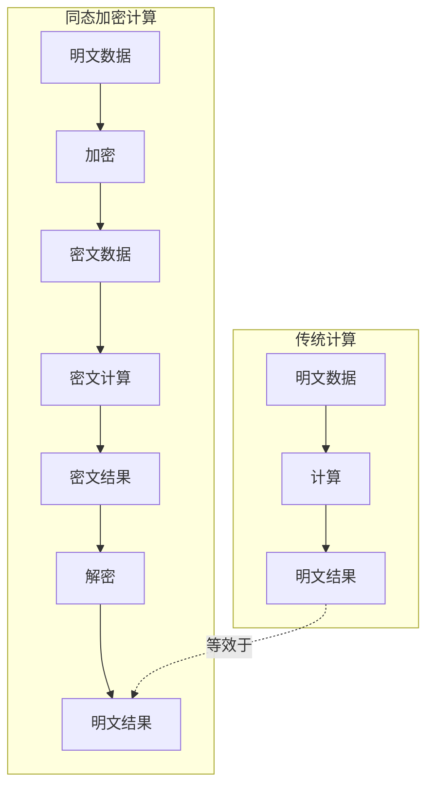
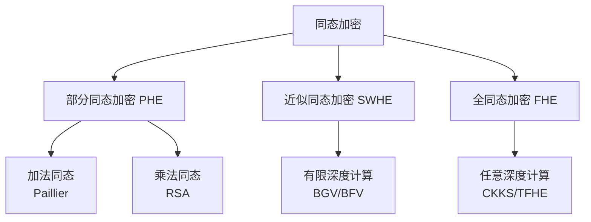
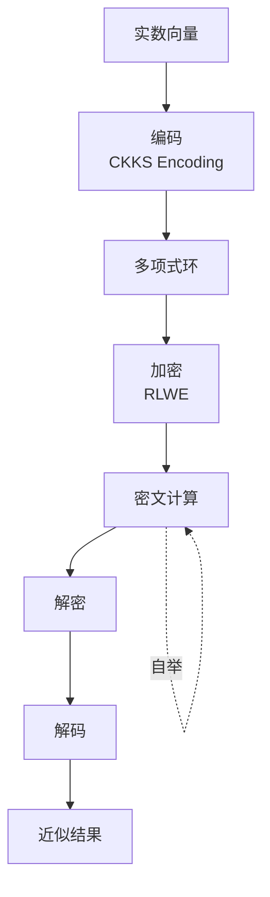
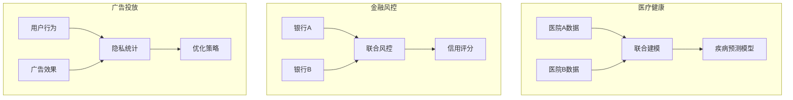

# 同态加密入门 - 隐私计算

## 概述

同态加密（Homomorphic Encryption, HE）是一种革命性的加密技术，允许在密文上直接进行计算，而无需解密。这意味着数据可以在加密状态下被处理，只有结果的所有者才能解密查看，为隐私计算和多方安全计算开辟了新的可能性。

## 同态加密原理



### 同态性质

```
┌─────────────────────────────────────────────────────────────────┐
│                      同态加密数学定义                             │
├─────────────────────────────────────────────────────────────────┤
│                                                                 │
│  设 E 为加密函数，D 为解密函数                                   │
│                                                                 │
│  加法同态:                                                      │
│  E(a) ⊕ E(b) = E(a + b)                                        │
│                                                                 │
│  乘法同态:                                                      │
│  E(a) ⊗ E(b) = E(a × b)                                        │
│                                                                 │
│  全同态:                                                       │
│  同时满足加法同态和乘法同态                                      │
│  支持任意深度计算                                                │
│                                                                 │
│  部分同态:                                                     │
│  仅支持加法或乘法中的一种                                         │
│  或支持有限深度的计算                                            │
│                                                                 │
└─────────────────────────────────────────────────────────────────┘
```

## 同态加密分类



### 算法对比

| 算法 | 类型 | 主要操作 | 应用场景 | 性能 |
|-----|------|---------|---------|------|
| Paillier | PHE | 加法 | 电子投票、隐私统计 | 较快 |
| RSA | PHE | 乘法 | 数字签名 | 快 |
| BGV | SWHE | 加法+有限乘法 | 隐私ML训练 | 中等 |
| BFV | SWHE | 整数运算 | 数据库查询 | 中等 |
| CKKS | FHE | 近似实数运算 | 隐私ML推理 | 较慢 |
| TFHE | FHE | 布尔运算 | 任意计算 | 最慢 |

## Paillier加法同态

### 原理与实现

```python
# Python Paillier同态加密 (使用phe库)
from phe import paillier
import json

class PaillierEncryption:
    def __init__(self):
        """生成Paillier密钥对"""
        self.public_key, self.private_key = paillier.generate_paillier_keypair()
    
    def encrypt(self, plaintext: int) -> paillier.EncryptedNumber:
        """加密整数"""
        return self.public_key.encrypt(plaintext)
    
    def decrypt(self, ciphertext: paillier.EncryptedNumber) -> int:
        """解密"""
        return self.private_key.decrypt(ciphertext)
    
    def add_encrypted(self, a: paillier.EncryptedNumber, b: paillier.EncryptedNumber):
        """密文加法: E(a) + E(b) = E(a + b)"""
        return a + b
    
    def add_plain(self, encrypted: paillier.EncryptedNumber, plain: int):
        """密文+明文: E(a) + b = E(a + b)"""
        return encrypted + plain
    
    def multiply_plain(self, encrypted: paillier.EncryptedNumber, plain: int):
        """密文×明文: E(a) × b = E(a × b)"""
        return encrypted * plain

# 使用示例
def demo_paillier():
    he = PaillierEncryption()
    
    # 两个敏感数据
    salary_alice = 50000
    salary_bob = 60000
    
    # 加密
    enc_alice = he.encrypt(salary_alice)
    enc_bob = he.encrypt(salary_bob)
    
    print(f"Alice工资密文: {enc_alice.ciphertext()}")
    print(f"Bob工资密文: {enc_bob.ciphertext()}")
    
    # 服务器在密文上计算总工资（不知道具体数值）
    enc_total = he.add_encrypted(enc_alice, enc_bob)
    print(f"总工资密文: {enc_total.ciphertext()}")
    
    # 客户端解密结果
    total = he.decrypt(enc_total)
    print(f"总工资明文: {total}")
    
    # 计算平均工资（密文×明文）
    enc_average = he.multiply_plain(enc_total, 1 // 2)
    average = he.decrypt(enc_average)
    print(f"平均工资: {average}")

demo_paillier()
```

## 全同态加密 CKKS

### CKKS方案架构



### CKKS实现示例

```python
# TenSEAL库实现CKKS
import tenseal as ts
import numpy as np

class CKKSEncryption:
    def __init__(self, poly_modulus_degree=8192, coeff_mod_bit_sizes=None):
        """
        初始化CKKS方案
        
        Args:
            poly_modulus_degree: 多项式模次数，决定安全性和性能
            coeff_mod_bit_sizes: 系数模数链，控制计算深度
        """
        if coeff_mod_bit_sizes is None:
            coeff_mod_bit_sizes = [60, 40, 40, 60]
        
        # 创建CKKS上下文
        self.context = ts.context(
            ts.SCHEME_TYPE.CKKS,
            poly_modulus_degree=poly_modulus_degree,
            coeff_mod_bit_sizes=coeff_mod_bit_sizes
        )
        
        # 生成密钥
        self.context.global_scale = 2**40
        self.context.generate_galois_keys()
    
    def encrypt_vector(self, vector: np.ndarray) -> ts.CKKSVector:
        """加密向量"""
        return ts.ckks_vector(self.context, vector)
    
    def decrypt_vector(self, encrypted: ts.CKKSVector) -> np.ndarray:
        """解密向量"""
        return encrypted.decrypt()
    
    def secure_matrix_multiply(self, encrypted_vec: ts.CKKSVector, matrix: np.ndarray):
        """安全矩阵乘法"""
        return encrypted_vec.matmul(matrix)
    
    def secure_polynomial(self, encrypted_vec: ts.CKKSVector, coeffs: list):
        """安全多项式计算"""
        result = encrypted_vec.polyval(coeffs)
        return result

# 隐私机器学习推理示例
def demo_secure_ml():
    ckks = CKKSEncryption()
    
    # 客户端: 加密输入数据
    patient_data = np.array([0.5, 0.3, 0.8, 0.2])  # 医疗特征
    encrypted_input = ckks.encrypt_vector(patient_data)
    print("患者数据已加密")
    
    # 服务器: 在密文上执行模型推理（不知道真实数据）
    # 模拟线性回归模型: y = Wx + b
    model_weights = np.array([
        [0.1, 0.2, 0.3, 0.4],
        [0.5, 0.6, 0.7, 0.8]
    ])
    
    encrypted_result = ckks.secure_matrix_multiply(encrypted_input, model_weights.T)
    print("模型推理完成（密文状态）")
    
    # 客户端: 解密结果
    result = ckks.decrypt_vector(encrypted_result)
    print(f"模型预测结果: {result}")
    
    # 验证正确性
    expected = np.dot(patient_data, model_weights.T)
    print(f"预期结果: {expected}")
    print(f"误差: {np.abs(result - expected)}")

demo_secure_ml()
```

## 隐私计算应用场景



### 安全多方计算场景

```python
# 隐私集合求交 (PSI) 简化示例
import hashlib
from phe import paillier

class PrivateSetIntersection:
    """
    两方隐私集合求交
    两方各自持有集合，在不泄露其他元素的前提下找到交集
    """
    def __init__(self):
        self.public_key, self.private_key = paillier.generate_paillier_keypair()
    
    def hash_item(self, item: str) -> int:
        """哈希元素为大整数"""
        return int(hashlib.sha256(item.encode()).hexdigest(), 16)
    
    def client_prepare(self, client_set: set):
        """客户端加密自己的集合"""
        encrypted_set = []
        for item in client_set:
            hashed = self.hash_item(item)
            enc = self.public_key.encrypt(hashed)
            encrypted_set.append(enc)
        return encrypted_set
    
    def server_compute(self, server_set: set, encrypted_client_set: list):
        """
        服务器计算交集指示器
        实际PSI使用更复杂的协议（如OT扩展）
        """
        results = []
        server_hashes = {self.hash_item(item) for item in server_set}
        
        for enc_item in encrypted_client_set:
            # 简化示例：实际应使用安全协议
            for s_hash in server_hashes:
                # 计算差值的加密
                diff = enc_item + self.public_key.encrypt(-s_hash)
                results.append(diff)
        
        return results
    
    def client_intersect(self, results: list, client_set: set):
        """客户端确定交集"""
        intersection = []
        for i, result in enumerate(results):
            decrypted = self.private_key.decrypt(result)
            if decrypted == 0:  # 差值为0表示相等
                intersection.append(list(client_set)[i])
        return intersection

# PSI示例
def demo_psi():
    psi = PrivateSetIntersection()
    
    # 两方数据
    alice_contacts = {"张三", "李四", "王五", "赵六"}
    bob_contacts = {"李四", "王五", "孙七", "周八"}
    
    print(f"Alice的联系人: {alice_contacts}")
    print(f"Bob的联系人: {bob_contacts}")
    
    # 协议执行
    enc_alice = psi.client_prepare(alice_contacts)
    results = psi.server_compute(bob_contacts, enc_alice)
    intersection = psi.client_intersect(results, alice_contacts)
    
    print(f"共同联系人: {set(intersection)}")

demo_psi()
```

## 性能优化与挑战

| 挑战 | 解决方案 | 效果 |
|-----|---------|------|
| 计算开销大 | 硬件加速 (FPGA/ASIC) | 10-100倍提升 |
| 密文膨胀 | 批处理编码 | 摊薄开销 |
| 噪声增长 | 重缩放/自举 | 维持计算深度 |
| 精度损失 | 精密参数调优 | 控制误差 |

---

*文档版本: v1.0 | 最后更新: 2026-04-03*
