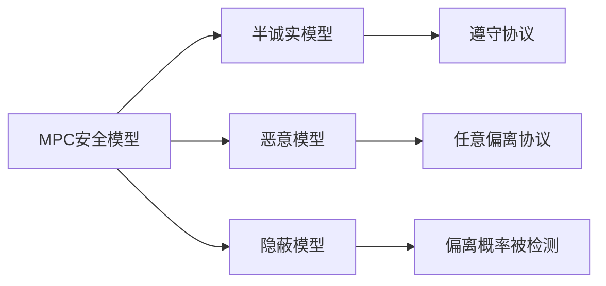
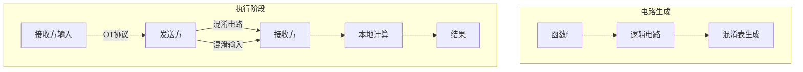
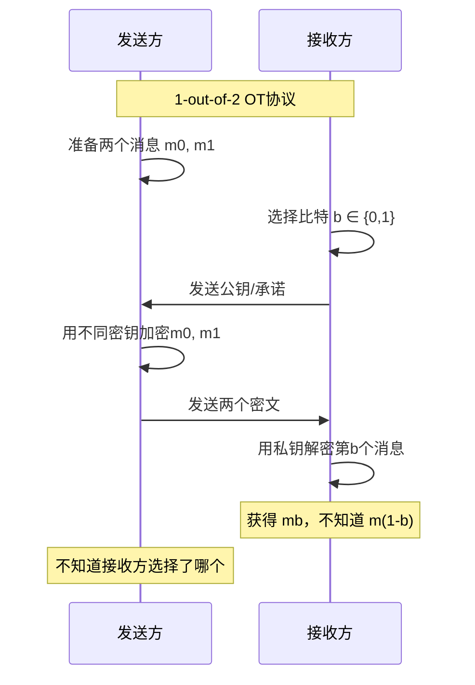
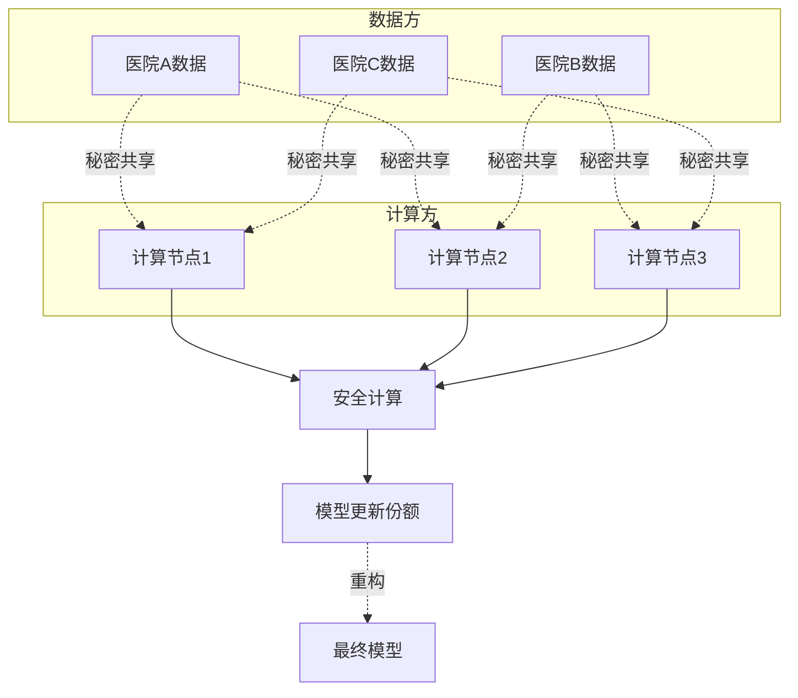

# 安全多方计算 - MPC基础

## 概述

安全多方计算（Secure Multi-Party Computation, MPC）允许多个参与方在不泄露各自私有输入的前提下，共同计算某个函数并获得结果。MPC解决了数据可用不可见的核心问题，是隐私计算领域的重要技术。

## MPC核心概念

```mermaid
graph TB
    subgraph 参与方A
    A1[私有输入 x]
    A2[随机份额]
    end
    
    subgraph 参与方B
    B1[私有输入 y]
    B2[随机份额]
    end
    
    subgraph 参与方C
    C1[私有输入 z]
    C2[随机份额]
    end
    
    A2 --> P[安全计算协议]
    B2 --> P
    C2 --> P
    
    P --> R[计算结果 f(x,y,z)]
```

### 安全模型



## 秘密共享

### Shamir秘密共享

```
┌─────────────────────────────────────────────────────────────────┐
│                    Shamir秘密共享原理                             │
├─────────────────────────────────────────────────────────────────┤
│                                                                 │
│  将秘密 S 分成 n 份，任意 t 份可重构秘密，少于 t 份无信息         │
│                                                                 │
│  多项式构造:                                                     │
│  P(x) = S + a1x + a2x^2 + ... + a(t-1)x^(t-1)                  │
│                                                                 │
│  份额生成: P(1), P(2), ..., P(n)                                 │
│                                                                 │
│  重构秘密: 拉格朗日插值                                          │
│  S = sum(yi * li(0))                                            │
│                                                                 │
└─────────────────────────────────────────────────────────────────┘
```

### 秘密共享实现

```python
# Python Shamir秘密共享实现
import random
from typing import List, Tuple

class ShamirSecretSharing:
    def __init__(self, prime: int = None):
        self.prime = prime or (2**127 - 1)
    
    def share(self, secret: int, threshold: int, num_shares: int) -> List[Tuple[int, int]]:
        poly = [secret] + [random.randint(0, self.prime - 1) 
                          for _ in range(threshold - 1)]
        shares = []
        for i in range(1, num_shares + 1):
            y = sum(c * (i ** j) for j, c in enumerate(poly)) % self.prime
            shares.append((i, y))
        return shares
    
    def reconstruct(self, shares: List[Tuple[int, int]]) -> int:
        secret = 0
        for i, (x_i, y_i) in enumerate(shares):
            num, den = 1, 1
            for j, (x_j, _) in enumerate(shares):
                if i != j:
                    num = (num * (-x_j)) % self.prime
                    den = (den * (x_i - x_j)) % self.prime
            lagrange = num * pow(den, -1, self.prime) % self.prime
            secret = (secret + y_i * lagrange) % self.prime
        return secret

# 使用示例
def demo_shamir():
    sss = ShamirSecretSharing()
    secret = 123456789
    print(f"原始秘密: {secret}")
    
    shares = sss.share(secret, threshold=3, num_shares=5)
    print(f"生成5份份额，门限为3")
    
    # 任意3份可重构
    reconstructed = sss.reconstruct(shares[:3])
    print(f"重构秘密: {reconstructed}")

demo_shamir()
```

## 安全计算协议

### 姚氏混淆电路



### Garbled Circuit示例

```python
# 简化版姚氏混淆电路 - AND门示例
import hashlib
import random
import json

class GarbledCircuit:
    def __init__(self):
        self.wire_labels = {}
        self.garbled_tables = {}
    
    def generate_labels(self, wire_id: str):
        """为线路生成两个随机标签（代表0和1）"""
        label_0 = hashlib.sha256(f"{wire_id}_0_{random.random()}".encode()).hexdigest()[:32]
        label_1 = hashlib.sha256(f"{wire_id}_1_{random.random()}".encode()).hexdigest()[:32]
        self.wire_labels[wire_id] = (label_0, label_1)
        return label_0, label_1
    
    def garble_and_gate(self, in1: str, in2: str, output: str):
        """混淆AND门"""
        labels_in1 = self.wire_labels[in1]
        labels_in2 = self.wire_labels[in2]
        labels_out = self.wire_labels[output]
        
        # 生成混淆表（4行，对应所有输入组合）
        table = []
        for i in range(2):
            for j in range(2):
                # AND运算结果
                result = i & j
                output_label = labels_out[result]
                
                # 使用输入标签加密输出标签
                key = hashlib.sha256(
                    (labels_in1[i] + labels_in2[j]).encode()
                ).digest()
                
                # 加密输出标签（简化版）
                encrypted = bytes(a ^ b for a, b in zip(
                    output_label.encode(), 
                    key[:len(output_label)]
                ))
                table.append({
                    'encrypted': encrypted.hex(),
                    'hash': hashlib.sha256(labels_in1[i] + labels_in2[j]).hexdigest()[:8]
                })
        
        # 打乱表顺序
        random.shuffle(table)
        self.garbled_tables[f"{in1}_{in2}_{output}"] = table
        return table
    
    def evaluate(self, input_labels: dict, gate_id: str) -> str:
        """评估混淆门"""
        table = self.garbled_tables[gate_id]
        
        # 尝试解密每一行
        for entry in table:
            # 简化评估
            pass
        
        return "result_label"

# AND门混淆示例
def demo_garbled_circuit():
    gc = GarbledCircuit()
    
    # 生成线路标签
    gc.generate_labels("in1")
    gc.generate_labels("in2")
    gc.generate_labels("out")
    
    # 混淆AND门
    table = gc.garble_and_gate("in1", "in2", "out")
    print("混淆AND门表格:")
    for i, entry in enumerate(table):
        print(f"  行{i+1}: {entry['hash']}")

demo_garbled_circuit()
```

##  oblivious Transfer



## MPC应用场景

### 隐私保护机器学习



### 安全联邦学习

```python
# 基于秘密共享的安全聚合
import numpy as np

class SecureAggregation:
    def __init__(self, num_parties: int, threshold: int):
        self.n = num_parties
        self.t = threshold
        self.sss = ShamirSecretSharing()
    
    def share_gradient(self, party_id: int, gradient: np.ndarray):
        """将梯度分割成秘密份额"""
        shares = {}
        for val in gradient.flatten():
            val_int = int(val * 10000)  # 缩放为整数
            val_shares = self.sss.share(val_int, self.t, self.n)
            for i, share in enumerate(val_shares):
                if i not in shares:
                    shares[i] = []
                shares[i].append(share[1])
        return shares
    
    def aggregate_shares(self, all_party_shares: list):
        """聚合各方的秘密份额"""
        n_params = len(all_party_shares[0][0])
        aggregated = []
        
        for param_idx in range(n_params):
            param_shares = []
            for party_shares in all_party_shares:
                for i, shares in party_shares.items():
                    param_shares.append((i+1, shares[param_idx]))
            
            # 重构该参数的聚合值
            result = self.sss.reconstruct(param_shares[:self.t])
            aggregated.append(result / 10000)
        
        return np.array(aggregated)

# 联邦学习安全聚合示例
def demo_secure_fl():
    sa = SecureAggregation(num_parties=3, threshold=2)
    
    # 各方本地梯度
    grad_a = np.array([0.1, -0.05, 0.02])
    grad_b = np.array([0.08, -0.03, 0.01])
    grad_c = np.array([0.12, -0.07, 0.03])
    
    print("各方梯度:")
    print(f"  A: {grad_a}")
    print(f"  B: {grad_b}")
    print(f"  C: {grad_c}")
    
    # 分享梯度
    shares_a = sa.share_gradient(0, grad_a)
    shares_b = sa.share_gradient(1, grad_b)
    shares_c = sa.share_gradient(2, grad_c)
    
    # 聚合（无第三方看到明文梯度）
    aggregated = sa.aggregate_shares([shares_a, shares_b, shares_c])
    
    expected = (grad_a + grad_b + grad_c) / 3
    print(f"\n聚合梯度: {aggregated}")
    print(f"预期结果: {expected}")

demo_secure_fl()
```

## MPC协议对比

| 协议类型 | 通信轮数 | 计算开销 | 适用场景 |
|---------|---------|---------|---------|
| 秘密共享 | 低 | 中 | 算术运算 |
| 混淆电路 | 中 | 高 | 布尔运算 |
| GMW | 多轮 | 中 | 混合运算 |
| SPDZ | 常数轮 | 低 | 大规模计算 |

---

*文档版本: v1.0 | 最后更新: 2026-04-03*
