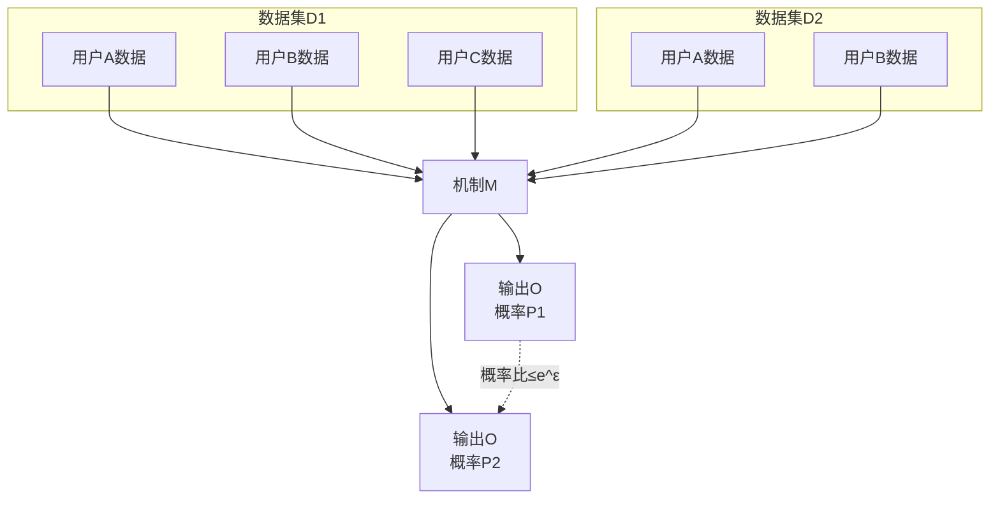
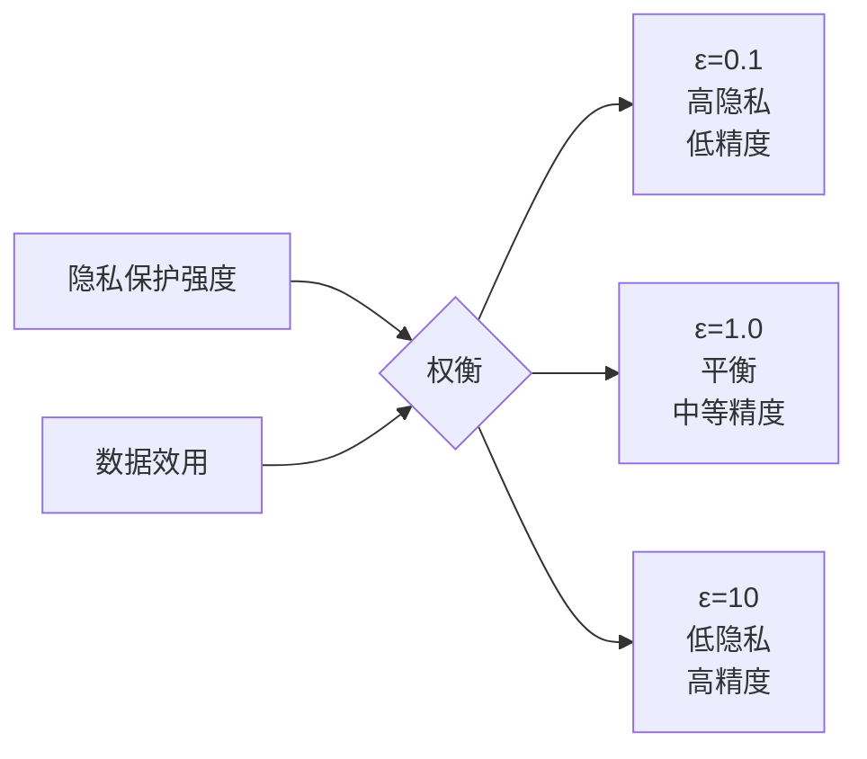

# 差分隐私 - 数据隐私保护

## 概述

差分隐私（Differential Privacy, DP）是一种严格的数学隐私保护框架，通过向查询结果或数据集中添加精心设计的噪声，确保个体数据的存在与否不会显著影响输出结果，从而保护个人隐私。

## 差分隐私原理



### 数学定义

```
┌─────────────────────────────────────────────────────────────────┐
│                     (ε, δ)-差分隐私定义                           │
├─────────────────────────────────────────────────────────────────┤
│                                                                 │
│  对于任意相邻数据集 D 和 D'（相差一条记录），                     │
│  对于所有输出集合 S：                                            │
│                                                                 │
│  Pr[M(D) ∈ S] ≤ e^ε × Pr[M(D') ∈ S] + δ                        │
│                                                                 │
│  其中：                                                          │
│  • ε (epsilon): 隐私预算，越小隐私保护越强                       │
│  • δ (delta): 松弛项，允许小概率违反                            │
│                                                                 │
│  当 δ = 0 时，称为纯差分隐私 (Pure DP)                          │
│  当 δ > 0 时，称为近似差分隐私 (Approximate DP)                 │
│                                                                 │
└─────────────────────────────────────────────────────────────────┘
```

## 噪声机制

### Laplace机制

```mermaid
graph LR
    A[真实结果f(D)] --> B[Laplace噪声]
    B --> C[噪声结果]
    
    subgraph Laplace分布
    D[概率密度] --> E[scale = Δf/ε]
    E --> F[噪声大小]
    end
```

```python
# Python差分隐私实现
import numpy as np
import matplotlib.pyplot as plt

class DifferentialPrivacy:
    def __init__(self, epsilon: float, delta: float = 0.0):
        self.epsilon = epsilon
        self.delta = delta
    
    def laplace_mechanism(self, true_value: float, sensitivity: float) -> float:
        """
        Laplace机制：适用于数值查询
        
        Args:
            true_value: 真实查询结果
            sensitivity: 查询函数的敏感度
        """
        scale = sensitivity / self.epsilon
        noise = np.random.laplace(0, scale)
        return true_value + noise
    
    def gaussian_mechanism(self, true_value: float, sensitivity: float) -> float:
        """
        Gaussian机制：适用于(ε,δ)-差分隐私
        """
        if self.delta == 0:
            raise ValueError("Gaussian机制需要delta > 0")
        
        # 计算标准差
        sigma = sensitivity * np.sqrt(2 * np.log(1.25 / self.delta)) / self.epsilon
        noise = np.random.normal(0, sigma)
        return true_value + noise
    
    def exponential_mechanism(self, options: list, scores: list, sensitivity: float):
        """
        指数机制：适用于非数值输出
        """
        # 计算每个选项的概率
        exp_scores = [np.exp(self.epsilon * s / (2 * sensitivity)) for s in scores]
        probabilities = [s / sum(exp_scores) for s in exp_scores]
        
        # 按概率采样
        return np.random.choice(options, p=probabilities)

# 敏感度计算工具
def compute_l1_sensitivity(query_func, dataset_samples):
    """计算L1敏感度"""
    max_diff = 0
    for i in range(len(dataset_samples)):
        for j in range(i + 1, len(dataset_samples)):
            if sum(a != b for a, b in zip(dataset_samples[i], dataset_samples[j])) == 1:
                diff = abs(query_func(dataset_samples[i]) - query_func(dataset_samples[j]))
                max_diff = max(max_diff, diff)
    return max_diff
```

## 隐私预算管理

```mermaid
graph TB
    subgraph 隐私预算分配
    A[总预算 ε=1.0] --> B[查询1: ε=0.2]
    A --> C[查询2: ε=0.3]
    A --> D[查询3: ε=0.5]
    end
    
    subgraph 组合定理
    E[基础组合] --> F[总隐私损失=Σεi]
    G[高级组合] --> H[总隐私损失=O(sqrt(k))]
    I[矩会计] --> J[更紧的界]
    end
```

### 隐私预算实现

```python
class PrivacyBudget:
    """隐私预算管理器"""
    def __init__(self, total_epsilon: float, total_delta: float = 0):
        self.total_epsilon = total_epsilon
        self.total_delta = total_delta
        self.used_epsilon = 0.0
        self.used_delta = 0.0
        self.query_history = []
    
    def allocate(self, epsilon: float, delta: float = 0, query_name: str = ""):
        """分配隐私预算"""
        if self.used_epsilon + epsilon > self.total_epsilon:
            raise ValueError(f"超出隐私预算: 剩余{self.total_epsilon - self.used_epsilon}, 需要{epsilon}")
        
        if self.used_delta + delta > self.total_delta:
            raise ValueError(f"超出delta预算: 剩余{self.total_delta - self.used_delta}, 需要{delta}")
        
        self.used_epsilon += epsilon
        self.used_delta += delta
        self.query_history.append({
            'query': query_name,
            'epsilon': epsilon,
            'delta': delta,
            'remaining': self.total_epsilon - self.used_epsilon
        })
        
        return True
    
    def get_remaining(self):
        """获取剩余预算"""
        return {
            'epsilon': self.total_epsilon - self.used_epsilon,
            'delta': self.total_delta - self.used_delta
        }
    
    def advanced_composition(self, k: int, epsilon_single: float, delta_single: float):
        """
        高级组合定理计算总隐私损失
        
        对于k个机制，每个(ε, δ)-DP
        整体为(ε', kδ + δ')-DP，其中
        ε' = sqrt(2k*ln(1/δ')) * ε + k*ε*(e^ε - 1)/(e^ε + 1)
        """
        delta_prime = 1e-5  # 通常取小值
        eps_prime = np.sqrt(2 * k * np.log(1 / delta_prime)) * epsilon_single
        eps_prime += k * epsilon_single * (np.exp(epsilon_single) - 1) / (np.exp(epsilon_single) + 1)
        total_delta = k * delta_single + delta_prime
        
        return eps_prime, total_delta
```

## 差分隐私查询

### 数据库查询

```python
class DPQueryEngine:
    """差分隐私查询引擎"""
    def __init__(self, privacy_budget: PrivacyBudget):
        self.budget = privacy_budget
        self.dp = None
    
    def count(self, data: list, condition: callable, epsilon: float) -> int:
        """差分隐私计数查询"""
        if not self.budget.allocate(epsilon, 0, "count"):
            return None
        
        self.dp = DifferentialPrivacy(epsilon)
        true_count = sum(1 for x in data if condition(x))
        
        # 计数查询的敏感度为1（添加/删除一条记录最多改变计数1）
        return int(round(self.dp.laplace_mechanism(true_count, sensitivity=1)))
    
    def sum_query(self, data: list, value_func: callable, epsilon: float, 
                  lower_bound: float, upper_bound: float) -> float:
        """差分隐私求和查询"""
        if not self.budget.allocate(epsilon, 0, "sum"):
            return None
        
        self.dp = DifferentialPrivacy(epsilon)
        
        # 裁剪值到指定范围
        clipped_values = [max(lower_bound, min(upper_bound, value_func(x))) for x in data]
        true_sum = sum(clipped_values)
        
        # 裁剪后的敏感度为 (upper - lower)
        sensitivity = upper_bound - lower_bound
        return self.dp.laplace_mechanism(true_sum, sensitivity)
    
    def mean_query(self, data: list, value_func: callable, epsilon: float,
                   lower_bound: float, upper_bound: float) -> float:
        """差分隐私均值查询（使用组合定理）"""
        eps_count = epsilon / 2
        eps_sum = epsilon / 2
        
        dp_count = self.count(data, lambda x: True, eps_count)
        dp_sum = self.sum_query(data, value_func, eps_sum, lower_bound, upper_bound)
        
        if dp_count <= 0:
            return 0
        return dp_sum / dp_count
    
    def histogram(self, data: list, bins: list, epsilon: float) -> dict:
        """差分隐私直方图"""
        if not self.budget.allocate(epsilon, 0, "histogram"):
            return None
        
        self.dp = DifferentialPrivacy(epsilon)
        
        # 计算每个bin的计数
        hist = {bin_name: 0 for bin_name in bins}
        for x in data:
            for bin_name in bins:
                if bin_name[0] <= x < bin_name[1]:
                    hist[bin_name] += 1
                    break
        
        # 添加噪声（每个bin独立，使用组合定理）
        noisy_hist = {}
        for bin_name, count in hist.items():
            # 使用epsilon / num_bins保证整体隐私
            local_eps = epsilon / len(bins)
            local_dp = DifferentialPrivacy(local_eps)
            noisy_hist[bin_name] = max(0, int(round(
                local_dp.laplace_mechanism(count, sensitivity=1)
            )))
        
        return noisy_hist

# 使用示例
def demo_dp_queries():
    # 模拟员工薪资数据
    salaries = [50000, 60000, 75000, 45000, 80000, 90000, 55000, 65000] * 100
    
    # 初始化隐私预算
    budget = PrivacyBudget(total_epsilon=1.0, total_delta=1e-6)
    engine = DPQueryEngine(budget)
    
    print("=== 差分隐私查询示例 ===")
    print(f"真实总人数: {len(salaries)}")
    
    # 计数查询
    high_earners = engine.count(salaries, lambda x: x > 70000, epsilon=0.2)
    true_high = sum(1 for s in salaries if s > 70000)
    print(f"高薪人数(真实): {true_high}")
    print(f"高薪人数(DP): {high_earners}")
    
    # 求和查询
    total_salary = engine.sum_query(salaries, lambda x: x, epsilon=0.3, 
                                    lower_bound=30000, upper_bound=150000)
    true_total = sum(salaries)
    print(f"\n总薪资(真实): {true_total}")
    print(f"总薪资(DP): {int(total_salary)}")
    
    # 均值查询
    mean_salary = engine.mean_query(salaries, lambda x: x, epsilon=0.4,
                                    lower_bound=30000, upper_bound=150000)
    true_mean = sum(salaries) / len(salaries)
    print(f"\n平均薪资(真实): {true_mean:.2f}")
    print(f"平均薪资(DP): {mean_salary:.2f}")
    
    # 查看剩余预算
    remaining = budget.get_remaining()
    print(f"\n剩余隐私预算: ε={remaining['epsilon']:.2f}")

demo_dp_queries()
```

## 机器学习中的差分隐私

### DP-SGD算法

```python
class DPSGD:
    """差分隐私随机梯度下降"""
    def __init__(self, model, epsilon: float, delta: float, 
                 max_grad_norm: float = 1.0):
        self.model = model
        self.epsilon = epsilon
        self.delta = delta
        self.max_grad_norm = max_grad_norm
        self.noise_multiplier = self._compute_noise_multiplier()
    
    def _compute_noise_multiplier(self):
        """根据隐私预算计算噪声倍数"""
        # 简化计算，实际应使用moments accountant
        return np.sqrt(2 * np.log(1.25 / self.delta)) / self.epsilon
    
    def clip_gradients(self, gradients):
        """梯度裁剪"""
        global_norm = np.sqrt(sum(np.sum(g**2) for g in gradients))
        clip_factor = min(1.0, self.max_grad_norm / (global_norm + 1e-10))
        return [g * clip_factor for g in gradients]
    
    def add_noise(self, gradients, batch_size: int):
        """添加高斯噪声"""
        noise_std = self.noise_multiplier * self.max_grad_norm / batch_size
        return [g + np.random.normal(0, noise_std, g.shape) for g in gradients]
    
    def step(self, gradients, batch_size: int):
        """执行一步DP-SGD更新"""
        # 1. 裁剪梯度
        clipped_grads = self.clip_gradients(gradients)
        
        # 2. 添加噪声
        noisy_grads = self.add_noise(clipped_grads, batch_size)
        
        # 3. 更新模型（简化版）
        learning_rate = 0.01
        for param, grad in zip(self.model.parameters(), noisy_grads):
            param -= learning_rate * grad
        
        return noisy_grads
```

## 隐私-效用权衡



---

*文档版本: v1.0 | 最后更新: 2026-04-03*
