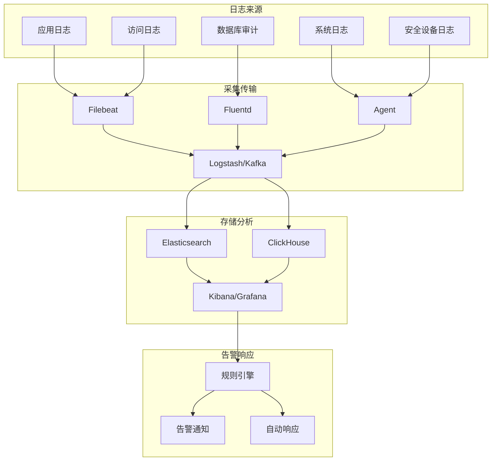

# 审计日志 - 合规与安全审计

## 概述

审计日志是安全体系的关键组成部分，记录系统中的重要操作和安全事件，为事后追溯、合规审查、威胁检测提供依据。在分布式系统中，审计日志需要处理多服务、多节点的日志聚合和分析挑战。

## 审计日志架构



## 审计事件模型

### 标准审计事件结构

```json
{
  "audit": {
    "version": "1.0",
    "event": {
      "id": "evt-550e8400-e29b-41d4-a716-446655440000",
      "type": "authentication",
      "action": "user.login",
      "outcome": "success",
      "severity": "info",
      "timestamp": "2026-04-03T10:30:00.000Z",
      "timezone": "Asia/Shanghai"
    },
    "actor": {
      "id": "user-12345",
      "type": "user",
      "name": "zhangsan",
      "email": "zhangsan@example.com",
      "ip": "203.0.113.45",
      "user_agent": "Mozilla/5.0...",
      "session_id": "sess-abc123"
    },
    "target": {
      "id": "app-order-service",
      "type": "service",
      "resource": "/api/v1/orders",
      "method": "POST"
    },
    "context": {
      "organization": "org-example",
      "environment": "production",
      "region": "cn-north-1",
      "trace_id": "trace-xyz789",
      "span_id": "span-abc123"
    },
    "request": {
      "headers": {
        "content-type": "application/json",
        "x-request-id": "req-123"
      },
      "body_hash": "sha256:abc123...",
      "parameters": {
        "order_id": "ORD-2024-001"
      }
    },
    "response": {
      "status_code": 200,
      "duration_ms": 150,
      "body_hash": "sha256:def456..."
    },
    "risk": {
      "score": 25,
      "factors": ["new_device", "unusual_time"],
      "mfa_used": true
    },
    "compliance": {
      "standards": ["ISO27001", "GDPR", "等保2.0"],
      "retention_days": 2555,
      "classification": "confidential"
    }
  }
}
```

## 日志采集配置

### Filebeat配置

```yaml
# filebeat.yml
filebeat.inputs:
- type: log
  enabled: true
  paths:
    - /var/log/app/*.log
    - /var/log/nginx/access.log
  fields:
    service: order-service
    environment: production
  fields_under_root: true
  multiline.pattern: '^\['
  multiline.negate: true
  multiline.match: after
  
- type: log
  enabled: true
  paths:
    - /var/log/audit/audit.log
  fields:
    log_type: security_audit
  processors:
    - add_host_metadata:
        when.not.contains.tags: forwarded
    - add_cloud_metadata: ~
    - add_docker_metadata: ~
    - add_kubernetes_metadata: ~

output.kafka:
  hosts: ["kafka-1:9092", "kafka-2:9092", "kafka-3:9092"]
  topic: "audit-logs"
  partition.round_robin:
    reachable_only: false
  required_acks: 1
  compression: gzip
  max_message_bytes: 1000000

logging.level: info
logging.to_files: true
logging.files:
  path: /var/log/filebeat
  name: filebeat
  keepfiles: 7
  permissions: 0644
```

### Logstash处理管道

```ruby
# logstash.conf
input {
  kafka {
    bootstrap_servers => "kafka:9092"
    topics => ["audit-logs", "app-logs"]
    group_id => "logstash-processors"
    codec => json
  }
}

filter {
  # 解析时间戳
  date {
    match => [ "timestamp", "ISO8601" ]
    target => "@timestamp"
  }
  
  # 解析用户代理
  useragent {
    source => "user_agent"
    target => "ua"
  }
  
  # 脱敏处理
  if [password] {
    mutate {
      replace => { "password" => "[REDACTED]" }
    }
  }
  if [credit_card] {
    anonymize {
      algorithm => "SHA256"
      fields => ["credit_card"]
      key => "secret_key"
    }
  }
  
  # 计算风险分数
  ruby {
    code => '
      risk_score = 0
      risk_factors = []
      
      # 异常时间检测 (凌晨1-5点)
      hour = event.get("@timestamp").hour
      if hour >= 1 && hour <= 5
        risk_score += 20
        risk_factors << "off_hours"
      end
      
      # 敏感操作检测
      action = event.get("action")
      if action in ["admin.access", "data.export", "permission.grant"]
        risk_score += 30
        risk_factors << "sensitive_action"
      end
      
      # 地理位置异常 (简化检测)
      if event.get("actor.country") != event.get("actor.normal_country")
        risk_score += 25
        risk_factors << "geo_anomaly"
      end
      
      event.set("risk_score", risk_score)
      event.set("risk_factors", risk_factors)
      
      # 设置事件级别
      if risk_score >= 50
        event.set("severity", "high")
      elsif risk_score >= 30
        event.set("severity", "medium")
      else
        event.set("severity", "low")
      end
    '
  }
  
  # 添加合规标签
  mutate {
    add_field => {
      "compliance_standards" => ["ISO27001", "等保2.0"]
      "retention_classification" => "7years"
      "data_classification" => "confidential"
    }
  }
  
  # 删除无用字段
  mutate {
    remove_field => ["@version", "beat", "input", "host"]
  }
}

output {
  # 高优先级安全事件
  if [risk_score] >= 50 {
    elasticsearch {
      hosts => ["https://es-security:9200"]
      index => "security-alerts-%{+YYYY.MM.dd}"
      user => "logstash_writer"
      password => "${LOGSTASH_PWD}"
      ssl => true
      ssl_certificate_verification => true
      cacert => "/etc/logstash/certs/ca.crt"
    }
    
    # 实时告警
    http {
      url => "https://alerting.example.com/api/v1/alerts"
      http_method => "post"
      content_type => "application/json"
      format => "json"
    }
  }
  
  # 常规审计日志
  elasticsearch {
    hosts => ["https://es-audit:9200"]
    index => "audit-logs-%{+YYYY.MM}"
    ilm_enabled => true
    ilm_rollover_alias => "audit-logs"
    ilm_pattern => "{now/d}-000001"
    ilm_policy => "audit-logs-policy"
  }
  
  # 长期归档
  s3 {
    bucket => "audit-logs-archive"
    region => "cn-north-1"
    prefix => "%{+YYYY/MM/dd}/"
    encoding => "gzip"
    time_file => 60
  }
}
```

## 审计策略配置

### 数据库审计规则

```sql
-- PostgreSQL审计配置 (使用pgaudit)

-- 1. 启用审计扩展
CREATE EXTENSION IF NOT EXISTS pgaudit;

-- 2. 配置会话级审计
ALTER SYSTEM SET pgaudit.log = 'write, ddl';
ALTER SYSTEM SET pgaudit.log_catalog = off;
ALTER SYSTEM SET pgaudit.log_parameter = on;
ALTER SYSTEM SET pgaudit.log_statement_once = off;
ALTER SYSTEM SET pgaudit.log_level = log;

-- 3. 特定表审计规则
CREATE TABLE audit_policy (
    id SERIAL PRIMARY KEY,
    table_name VARCHAR(100) NOT NULL,
    operations VARCHAR(50) NOT NULL, -- SELECT, INSERT, UPDATE, DELETE
    condition TEXT, -- 审计条件
    log_level VARCHAR(20) DEFAULT 'info'
);

-- 4. 插入审计策略
INSERT INTO audit_policy (table_name, operations, condition) VALUES
('customers', 'SELECT,UPDATE,DELETE', 'WHERE created_at > NOW() - INTERVAL \'1 year\''),
('orders', 'INSERT,UPDATE', NULL),
('payment_cards', 'SELECT,INSERT,UPDATE,DELETE', NULL);

-- 5. 使用触发器实现行级审计
CREATE TABLE audit_log (
    id BIGSERIAL PRIMARY KEY,
    table_name VARCHAR(100),
    operation VARCHAR(10),
    user_name VARCHAR(100),
    query TEXT,
    old_data JSONB,
    new_data JSONB,
    executed_at TIMESTAMP DEFAULT CURRENT_TIMESTAMP
);

CREATE OR REPLACE FUNCTION audit_trigger_func()
RETURNS TRIGGER AS $$
BEGIN
    IF (TG_OP = 'DELETE') THEN
        INSERT INTO audit_log (table_name, operation, user_name, old_data)
        VALUES (TG_TABLE_NAME, TG_OP, CURRENT_USER, row_to_json(OLD));
        RETURN OLD;
    ELSIF (TG_OP = 'UPDATE') THEN
        INSERT INTO audit_log (table_name, operation, user_name, old_data, new_data)
        VALUES (TG_TABLE_NAME, TG_OP, CURRENT_USER, row_to_json(OLD), row_to_json(NEW));
        RETURN NEW;
    ELSIF (TG_OP = 'INSERT') THEN
        INSERT INTO audit_log (table_name, operation, user_name, new_data)
        VALUES (TG_TABLE_NAME, TG_OP, CURRENT_USER, row_to_json(NEW));
        RETURN NEW;
    END IF;
    RETURN NULL;
END;
$$ LANGUAGE plpgsql;

-- 应用到敏感表
CREATE TRIGGER audit_customers
    AFTER INSERT OR UPDATE OR DELETE ON customers
    FOR EACH ROW EXECUTE FUNCTION audit_trigger_func();
```

## 实时告警规则

```yaml
# Elasticsearch Alert Rules
groups:
- name: security_audit_alerts
  rules:
  # 1. 暴力破解检测
  - alert: PotentialBruteForceAttack
    expr: |
      increase(audit_events_total{outcome="failure", type="authentication"}[5m]) > 10
    for: 2m
    labels:
      severity: critical
      category: authentication
    annotations:
      summary: "可能的暴力破解攻击"
      description: "IP {{ $labels.source_ip }} 在5分钟内失败登录 {{ $value }} 次"
      playbook: "https://wiki.example.com/playbooks/brute-force"

  # 2. 特权账户使用
  - alert: PrivilegedAccountUsage
    expr: |
      audit_events_total{user_role=~"admin|root"}[1h] > 0
    labels:
      severity: warning
      category: access_control
    annotations:
      summary: "特权账户活动"
      description: "检测到特权用户 {{ $labels.user_name }} 的操作"

  # 3. 数据导出检测
  - alert: MassDataExport
    expr: |
      sum by (user) (increase(audit_events_total{action=~"export|download"}[10m])) > 1000
    for: 1m
    labels:
      severity: high
      category: data_exfiltration
    annotations:
      summary: "大规模数据导出"
      description: "用户 {{ $labels.user }} 在过去10分钟内导出大量数据"

  # 4. 异常时间访问
  - alert: OffHoursAccess
    expr: |
      hour() >= 0 < 6 and audit_events_total{environment="production"} > 0
    labels:
      severity: info
      category: anomaly
    annotations:
      summary: "非工作时间访问"

  # 5. 多地登录检测
  - alert: ImpossibleTravel
    expr: |
      count by (user) (count by (user, country) (audit_events_total[1h])) > 2
    for: 5m
    labels:
      severity: high
      category: account_compromise
    annotations:
      summary: "多地登录异常"
      description: "用户 {{ $labels.user }} 在多地同时登录"
```

## 合规报告

```python
# 合规报告生成器
class ComplianceReporter:
    def __init__(self, es_client):
        self.es = es_client
        self.standards = {
            'ISO27001': ['A.12.4', 'A.16.1'],
            '等保2.0': ['安全审计', '集中管控'],
            'GDPR': ['Article 30', 'Article 33']
        }
    
    def generate_access_report(self, start_date, end_date, standard='ISO27001'):
        """生成访问控制审计报告"""
        query = {
            "query": {
                "bool": {
                    "must": [
                        {"range": {"@timestamp": {"gte": start_date, "lte": end_date}}},
                        {"terms": {"event.type": ["authentication", "authorization"]}}
                    ]
                }
            },
            "aggs": {
                "by_user": {
                    "terms": {"field": "actor.name", "size": 100},
                    "aggs": {
                        "by_action": {
                            "terms": {"field": "event.action"}
                        },
                        "failed_logins": {
                            "filter": {"term": {"event.outcome": "failure"}}
                        }
                    }
                },
                "by_resource": {
                    "terms": {"field": "target.resource"},
                    "aggs": {
                        "unique_users": {
                            "cardinality": {"field": "actor.id"}
                        }
                    }
                }
            }
        }
        
        results = self.es.search(index="audit-logs-*", body=query, size=0)
        
        report = {
            'standard': standard,
            'period': f"{start_date} to {end_date}",
            'summary': {
                'total_events': results['hits']['total']['value'],
                'unique_users': len(results['aggregations']['by_user']['buckets']),
                'unique_resources': len(results['aggregations']['by_resource']['buckets'])
            },
            'findings': []
        }
        
        # 检测异常
        for user_bucket in results['aggregations']['by_user']['buckets']:
            failed = user_bucket['failed_logins']['doc_count']
            total = user_bucket['doc_count']
            
            if failed > 5 or (total > 0 and failed / total > 0.3):
                report['findings'].append({
                    'type': 'excessive_failures',
                    'user': user_bucket['key'],
                    'failed_attempts': failed,
                    'recommendation': 'Review account security and consider temporary lockout'
                })
        
        return report
    
    def generate_data_access_report(self, start_date, end_date):
        """生成数据访问审计报告"""
        query = {
            "query": {
                "bool": {
                    "must": [
                        {"range": {"@timestamp": {"gte": start_date, "lte": end_date}}},
                        {"terms": {"event.type": ["data_access", "data_export"]}}
                    ]
                }
            }
        }
        
        # 实现报告逻辑...
        pass
```

---

*文档版本: v1.0 | 最后更新: 2026-04-03*
