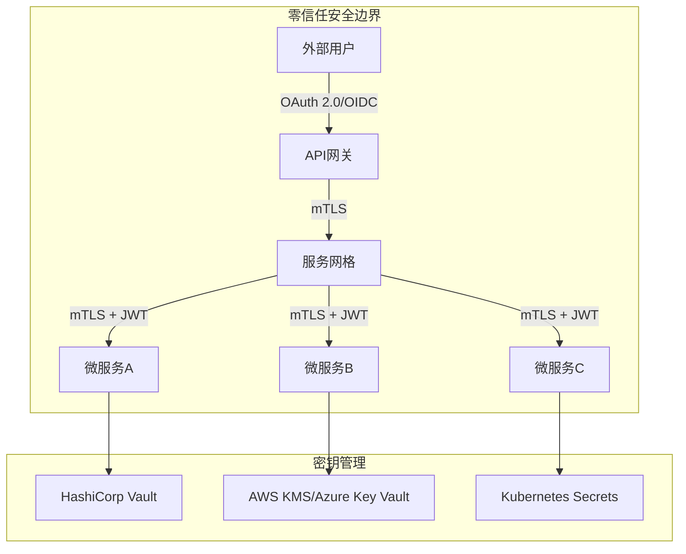

# 分布式安全基础 专题文档

**文档版本**：v1.0
**创建时间**：2026年
**最后更新**：2026年
**状态**：🔄 编写中

---

## 📋 执行摘要

分布式系统安全是保护跨网络通信的多节点系统免受各种威胁的综合体系，涵盖身份认证、加密通信、访问控制和密钥管理等核心机制。

---

## 一、核心概念

### 1.1 定义与原理

分布式系统安全威胁模型（Threat Model）是系统安全设计的基石，通过识别潜在攻击者、攻击向量和资产价值，构建分层防御体系。其核心原则包括：

- **机密性（Confidentiality）**：防止未授权的信息访问
- **完整性（Integrity）**：确保数据不被非法篡改
- **可用性（Availability）**：保障系统服务持续可用
- **不可否认性（Non-repudiation）**：确保操作可追溯

### 1.2 关键特性

- **分层防御**：网络层、传输层、应用层多重保护
- **最小权限**：每个组件仅拥有必要的访问权限
- **安全边界**：明确的服务间信任边界
- **动态安全**：基于上下文的风险评估和访问控制
- **可审计性**：完整的操作日志和审计追踪

### 1.3 适用场景

| 场景 | 适用性 | 说明 |
|------|--------|------|
| 微服务架构 | ⭐⭐⭐⭐⭐ | 服务间通信需要mTLS和细粒度认证 |
| 多云部署 | ⭐⭐⭐⭐⭐ | 跨云边界安全至关重要 |
| 金融系统 | ⭐⭐⭐⭐⭐ | 严格的合规性和数据保护要求 |
| 物联网平台 | ⭐⭐⭐⭐ | 设备认证和数据加密需求 |
| 内部系统 | ⭐⭐⭐ | 基础安全控制即可满足 |

---

## 二、技术细节

### 2.1 安全架构设计



### 2.2 身份认证机制

#### OAuth 2.0 授权流程

**输入**：用户凭证、客户端ID、授权范围
**输出**：访问令牌、刷新令牌

**授权码流程（Authorization Code Flow）**：

1. 客户端向授权服务器请求授权码
2. 用户登录并授权
3. 授权服务器返回授权码
4. 客户端用授权码交换访问令牌
5. 客户端使用访问令牌访问资源

**PKCE扩展（Proof Key for Code Exchange）**：
- 生成code_verifier（随机字符串）
- 计算code_challenge = BASE64URL(SHA256(code_verifier))
- 防止授权码拦截攻击

#### OIDC（OpenID Connect）身份层

在OAuth 2.0之上添加身份验证，核心概念：
- **ID Token**：JWT格式的用户身份信息
- **UserInfo Endpoint**：获取用户详细信息的API
- **Claims**：用户属性（sub, name, email等）

### 2.3 mTLS（双向TLS）

**握手流程**：

1. **ClientHello**：客户端发送支持的加密套件
2. **ServerHello + Certificate**：服务器返回证书
3. **Client Certificate Request**：服务器请求客户端证书
4. **Client Certificate**：客户端发送证书
5. **密钥交换**：双方协商会话密钥
6. **Finished**：握手完成，建立加密通道

**服务网格中的mTLS实现**：
```yaml
# Istio PeerAuthentication示例
apiVersion: security.istio.io/v1beta1
kind: PeerAuthentication
metadata:
  name: default
  namespace: istio-system
spec:
  mtls:
    mode: STRICT  # 强制mTLS
```

### 2.4 零信任架构（Zero Trust）

**核心原则**：

| 原则 | 说明 |
|------|------|
| 永不信任，始终验证 | 无论内外网，每次访问都需认证 |
| 最小权限访问 | 基于细粒度策略的访问控制 |
| 假设 breach | 假设系统已被入侵，持续监控和验证 |

**实现组件**：
- **身份感知代理（IAP）**：统一接入点
- **设备信任评估**：设备健康和合规性检查
- **持续风险评估**：基于行为的动态授权
- **微分段**：网络层面的细粒度隔离

### 2.5 密钥管理

**密钥生命周期管理**：

```
生成 → 分发 → 使用 → 轮换 → 销毁
  ↓      ↓      ↓       ↓       ↓
随机   安全   访问    定期    安全
生成   通道   控制    更新    擦除
```

**密钥分级体系**：

| 密钥类型 | 用途 | 存储位置 |
|----------|------|----------|
| 根密钥（KEK） | 加密其他密钥 | HSM硬件安全模块 |
| 数据加密密钥（DEK） | 加密业务数据 | 密钥管理系统 |
| 传输密钥 | 保护数据传输 | 内存中短暂存在 |

**HashiCorp Vault核心功能**：
- **动态密钥**：按需生成短期凭证
- **密钥轮换**：自动定期更新密钥
- **审计日志**：完整的密钥访问记录
- **多种后端**：支持KMS、PKI、数据库等

---

## 三、系统对比

### 3.1 认证协议对比矩阵

| 维度 | OAuth 2.0 | OIDC | SAML | LDAP |
|------|-----------|------|------|------|
| 协议类型 | 授权框架 | 身份层 | 身份联盟 | 目录服务 |
| 令牌格式 | Bearer Token | JWT | XML断言 | 无 |
| 适用场景 | API授权 | SSO认证 | 企业SSO | 内部目录 |
| 移动端支持 | ⭐⭐⭐⭐⭐ | ⭐⭐⭐⭐⭐ | ⭐⭐ | ⭐⭐ |
| 实现复杂度 | 中等 | 中等 | 复杂 | 简单 |

### 3.2 服务网格安全对比

| 特性 | Istio | Linkerd | Consul Connect |
|------|-------|---------|----------------|
| mTLS默认 | 支持 | 支持 | 支持 |
| 证书管理 | Istiod自动签发 | 自动轮换 | Consul CA |
| 授权策略 | 丰富 | 基础 | 中等 |
| 性能开销 | 中等 | 低 | 中等 |

### 3.3 密钥管理方案对比

| 方案 | 适用场景 | 安全性 | 复杂度 | 成本 |
|------|----------|--------|--------|------|
| HashiCorp Vault | 多云/混合云 | ⭐⭐⭐⭐⭐ | 高 | 中 |
| AWS KMS | AWS环境 | ⭐⭐⭐⭐⭐ | 低 | 按量付费 |
| Azure Key Vault | Azure环境 | ⭐⭐⭐⭐⭐ | 低 | 按量付费 |
| Kubernetes Secrets | K8s内部 | ⭐⭐⭐ | 低 | 免费 |

---

## 四、实践指南

### 4.1 零信任架构部署

```yaml
# Istio AuthorizationPolicy示例
apiVersion: security.istio.io/v1beta1
kind: AuthorizationPolicy
metadata:
  name: service-a-policy
  namespace: production
spec:
  selector:
    matchLabels:
      app: service-a
  action: ALLOW
  rules:
  - from:
    - source:
        principals: ["cluster.local/ns/production/sa/service-b"]
    to:
    - operation:
        methods: ["GET"]
        paths: ["/api/v1/data/*"]
    when:
    - key: request.auth.claims[role]
      values: ["admin", "editor"]
```

### 4.2 最佳实践

1. **强制mTLS**：所有服务间通信启用双向TLS
2. **短生命周期令牌**：访问令牌有效期不超过15分钟
3. **密钥自动轮换**：加密密钥至少每90天轮换一次
4. **零信任网络**：不依赖网络边界，每个请求都验证
5. **安全日志审计**：集中收集和分析安全相关日志
6. **定期安全扫描**：使用SAST/DAST工具检测漏洞

### 4.3 常见问题

**Q1: 如何处理服务到服务的认证？**
A: 推荐使用服务网格（如Istio）自动处理mTLS，或在应用层使用SPIFFE/SPIRE进行工作负载身份认证。

**Q2: OAuth 2.0和OIDC有什么区别？**
A: OAuth 2.0是授权框架，用于获取资源访问权限；OIDC是在OAuth 2.0之上构建的身份验证层，提供用户身份验证功能。

**Q3: 零信任架构会增加多少延迟？**
A: 现代实现（如Istio）的mTLS开销通常在1-3ms，JWT验证约0.5-1ms，总体增加3-5ms延迟，但可通过连接复用和缓存优化。

**Q4: 密钥泄露后如何应急响应？**
A: 立即撤销受影响密钥 → 轮换所有相关密钥 → 审计访问日志 → 评估数据泄露范围 → 通知相关方。

---

## 五、形式化分析

### 5.1 威胁模型 STRIDE

| 威胁类型 | 描述 | 缓解措施 |
|----------|------|----------|
| Spoofing | 身份伪造 | mTLS、强认证 |
| Tampering | 数据篡改 | 数字签名、MAC |
| Repudiation | 否认行为 | 审计日志 |
| Information Disclosure | 信息泄露 | 加密、访问控制 |
| Denial of Service | 拒绝服务 | 限流、熔断 |
| Elevation of Privilege | 权限提升 | RBAC、最小权限 |

### 5.2 安全属性分析

**定理**：在启用mTLS的服务网格中，服务间通信满足机密性和完整性。

**证明概要**：
1. mTLS使用TLS 1.3协议，提供前向保密
2. 证书双向验证确保通信双方身份
3. AES-256-GCM加密保证机密性
4. AEAD模式同时提供完整性保护

---

## 六、与其他主题的关联

### 6.1 上游依赖

- [微服务架构](../05-microservices/微服务设计模式.md)
- [容器安全](../11-security/容器安全.md)
- [网络安全](../11-security/网络安全.md)

### 6.2 下游应用

- [API网关](../05-microservices/API网关.md)
- [服务网格](../05-microservices/服务网格.md)
- [数据安全](../11-security/数据安全.md)

### 6.3 相关概念

| 概念 | 关系 | 说明 |
|------|------|------|
| 加密与隐私保护 | 扩展 | 本主题的加密技术深入 |
| 可观测性 | 依赖 | 安全审计需要日志和追踪 |
| 混沌工程 | 验证 | 安全韧性测试方法 |

---

## 七、参考资源

### 7.1 学术论文

1. [Zero Trust Architecture](https://nvlpubs.nist.gov/nistpubs/SpecialPublications/NIST.SP.800-207.pdf) - NIST, 2020
2. [OAuth 2.0 Threat Model](https://tools.ietf.org/html/rfc6819) - IETF RFC 6819
3. [Mutual TLS Authentication](https://tools.ietf.org/html/rfc8446) - TLS 1.3 RFC 8446

### 7.2 开源项目

1. [Istio](https://istio.io/) - 服务网格安全
2. [HashiCorp Vault](https://www.vaultproject.io/) - 密钥管理
3. [SPIFFE/SPIRE](https://spiffe.io/) - 工作负载身份
4. [Keycloak](https://www.keycloak.org/) - 身份和访问管理

### 7.3 学习资料

1. [Zero Trust Security](https://www.microsoft.com/en-us/security/zero-trust) - Microsoft Zero Trust指南
2. [OAuth 2.0 and OpenID Connect](https://oauth.net/2/) - OAuth.net官方文档
3. [Kubernetes Security](https://kubernetes.io/docs/concepts/security/) - K8s安全最佳实践

### 7.4 相关文档

- [加密与隐私保护](./加密与隐私保护.md)
- [API安全最佳实践](../11-security/API安全.md)

---

**维护者**：项目团队
**最后更新**：2026年
