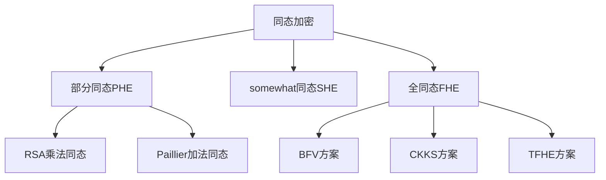

# 加密与隐私保护 专题文档

**文档版本**：v1.0
**创建时间**：2026年
**最后更新**：2026年
**状态**：🔄 编写中

---

## 📋 执行摘要

加密与隐私保护是数据安全的核心技术，涵盖对称/非对称加密、同态加密、安全多方计算、差分隐私和数据脱敏等多种技术，用于保护数据在存储、传输和计算过程中的机密性和隐私性。

---

## 一、核心概念

### 1.1 定义与原理

**加密（Encryption）**：将明文数据转换为密文的过程，只有拥有正确密钥的授权方才能解密恢复原始数据。

**隐私保护（Privacy Protection）**：在数据使用和共享过程中，保护个人敏感信息不被泄露的技术和措施集合。

**核心目标**：
- **机密性**：防止未授权访问
- **完整性**：检测数据篡改
- **隐私性**：保护个人身份信息（PII）
- **可用性**：在保护的同时支持必要的数据分析

### 1.2 关键特性

- **算法强度**：基于数学难题的计算安全性
- **密钥管理**：安全的密钥生成、分发和存储
- **性能平衡**：安全性与计算效率的权衡
- **合规要求**：满足GDPR、CCPA等法规
- **前向安全**：密钥泄露不威胁历史数据

### 1.3 适用场景

| 场景 | 适用性 | 说明 |
|------|--------|------|
| 数据库存储加密 | ⭐⭐⭐⭐⭐ | 保护静态数据 |
| 隐私计算 | ⭐⭐⭐⭐⭐ | 数据可用不可见 |
| 联邦学习 | ⭐⭐⭐⭐⭐ | 多方协作不泄露原始数据 |
| 日志脱敏 | ⭐⭐⭐⭐ | 生产日志去敏感化 |
| 数据共享 | ⭐⭐⭐⭐ | 安全多方计算场景 |

---

## 二、技术细节

### 2.1 对称加密vs非对称加密

#### 对称加密

**原理**：加密和解密使用相同密钥


**主流算法对比**：

| 算法 | 密钥长度 | 模式 | 特点 | 适用场景 |
|------|----------|------|------|----------|
| AES | 128/192/256 | GCM/CBC/CTR | 速度快，安全性高 | 通用加密 |
| ChaCha20 | 256 | Poly1305 | 流加密，抗侧信道 | 移动端/TLS |
| SM4 | 128 | ECB/CBC/CTR | 国密标准 | 国内合规 |

**AES-GCM工作流程**：

1. **密钥扩展**：从主密钥生成轮密钥
2. **CTR模式加密**：生成密钥流
3. **Ghash计算**：认证标签（MAC）
4. **输出**：密文 + 认证标签

**复杂度分析**：
- 时间复杂度：O(n) - 线性扫描数据
- 空间复杂度：O(1) - 固定状态
- 硬件加速：AES-NI指令集可达10GB/s+

#### 非对称加密

**原理**：使用公钥/私钥对，公钥加密、私钥解密

```
公钥加密：C = E(PK, M) = M^e mod n
私钥解密：M = D(SK, C) = C^d mod n
```

**主流算法对比**：

| 算法 | 密钥长度 | 基于问题 | 速度 | 用途 |
|------|----------|----------|------|------|
| RSA | 2048-4096 | 大数分解 | 慢 | 签名、密钥交换 |
| ECC | 256-521 | 椭圆曲线离散对数 | 较快 | 现代首选 |
| SM2 | 256 | 椭圆曲线 | 中等 | 国密标准 |
| Ed25519 | 256 | 椭圆曲线 | 快 | 数字签名 |

**性能对比（加密1KB数据）**：

| 算法 | 操作 | 性能 |
|------|------|------|
| AES-256-GCM | 加密 | ~3 cycles/byte |
| RSA-2048 | 加密 | ~1000x slower than AES |
| ECC-256 | 加密 | ~100x slower than AES |

### 2.2 同态加密（Homomorphic Encryption）

**定义**：允许在密文上直接进行计算，解密后结果与明文计算一致。

**类型分类**：



**BFV（Brakerski-Fan-Vercauteren）方案**：

**参数设置**：
- 多项式次数 n = 4096/8192/16384
- 系数模数 q（大整数）
- 明文模数 t（通常2^16或更大）

**基本操作**：
1. **KeyGen**：生成公私钥对
2. **Encrypt**：明文 → 多项式 → 密文
3. **EvalAdd/EvalMul**：密文加法和乘法
4. **Decrypt**：密文 → 多项式 → 明文

**噪声管理**：
- 每次乘法噪声增长
- 使用"模切换"（Modulus Switching）降低噪声
- 自举（Bootstrapping）刷新密文

**应用场景**：
| 场景 | 方案 | 性能 |
|------|------|------|
| 隐私集合求交 | BFV | 秒级 |
| 安全机器学习 | CKKS | 分钟级 |
| 基因组分析 | TFHE | 分钟级 |

### 2.3 安全多方计算（SMPC）

**定义**：多方在不泄露各自输入的情况下，共同计算一个函数。

**主要范式**：

#### 秘密分享（Secret Sharing）

**Shamir秘密分享**：

将秘密 s 分成 n 份，任意 t 份可恢复，少于 t 份无信息泄露。

```
构造多项式：f(x) = s + a₁x + a₂x² + ... + a_{t-1}x^{t-1}
分发：s_i = f(i), i = 1,2,...,n
恢复：拉格朗日插值
```

**计算特性**：
- 加法：本地相加即可
- 乘法：需要交互和Beaver三元组

#### 混淆电路（Garbled Circuits）

**Yao协议基本流程**：

1. **电路生成**：将函数转换为布尔电路
2. **混淆**：加密真值表
3. **OT传输**：接收方获取输入线标签
4. **求值**：逐门解密计算
5. **输出**：揭示结果

**优化技术**：
- Free-XOR：XOR门零成本
- Row Reduction：每门2条密文
- Half-Gates：每AND门2条密文

#### 秘密分享 vs 混淆电路对比

| 维度 | 秘密分享 | 混淆电路 |
|------|----------|----------|
| 通信轮次 | 多轮 | 常数轮 |
| 计算开销 | 低 | 高 |
| 适合运算 | 算术运算 | 布尔运算/比较 |
| 典型框架 | MP-SPDZ、SCALE-MAMBA | ABY、EMP-toolkit |

### 2.4 差分隐私（Differential Privacy）

**定义**：

一个随机化算法 M 满足 (ε, δ)-差分隐私，如果对于所有相邻数据集 D, D' 和所有输出子集 S：

```
Pr[M(D) ∈ S] ≤ e^ε × Pr[M(D') ∈ S] + δ
```

**核心机制**：

#### Laplace机制

**适用**：数值型查询

```
M(D) = f(D) + Lap(Δf/ε)
```

其中 Δf 是全局敏感度，Lap(λ) 是从Laplace分布采样的噪声。

#### 高斯机制

**适用**：高维数据

```
M(D) = f(D) + N(0, σ²)
```

其中 σ = Δf × √(2ln(1.25/δ))/ε

**隐私预算管理**：

```
组合定理：
- 基本组合：k个ε-DP机制 → kε-DP
- 高级组合：k个ε-DP机制 → O(√k×ε)-DP

隐私损失跟踪：
- 矩会计法（Moments Accountant）
- Rényi差分隐私
```

**深度学习中的DP-SGD**：

1. 计算每个样本梯度
2. 裁剪梯度范数（L2范数≤C）
3. 添加高斯噪声
4. 更新模型参数

### 2.5 数据脱敏

**技术分类**：

| 技术 | 描述 | 适用场景 |
|------|------|----------|
| **掩码** | 身份证：110***********1234 | 显示展示 |
| **替换** | 姓名→随机假名 | 测试环境 |
| **泛化** | 年龄32→30-40年龄段 | 统计分析 |
| **扰乱** | 添加随机噪声 | 数值数据 |
| **令牌化** | 保留格式加密（FPE） | 支付卡号 |
| **K-匿名** | 确保每个组合至少K条记录 | 数据发布 |

**K-匿名性实现**：

```
准标识符（QI）：{邮编, 生日, 性别}

原始数据：
邮编    生日      性别  疾病
100084  1985-05-20 男   糖尿病
100084  1985-05-20 男   流感
100085  1986-03-15 女   癌症

泛化后（K=2）：
邮编      生日       性别  疾病
10008*  1985-**  男   糖尿病
10008*  1985-**  男   流感
10008*  1986-**  女   癌症
```

---

## 三、系统对比

### 3.1 加密方案对比矩阵

| 维度 | 对称加密 | 非对称加密 | 同态加密 | SMPC |
|------|----------|------------|----------|------|
| 密钥管理 | 困难 | 较易 | 中等 | 复杂 |
| 计算开销 | 极低 | 高 | 极高 | 高 |
| 功能限制 | 无 | 无 | 有限运算 | 任意计算 |
| 通信开销 | 无 | 无 | 低 | 高 |
| 成熟度 | 高 | 高 | 中等 | 中等 |

### 3.2 隐私计算框架对比

| 框架 | 技术路线 | 语言 | 性能 | 易用性 |
|------|----------|------|------|--------|
| Microsoft SEAL | BFV/CKKS | C++ | 高 | 中等 |
| IBM HELib | BGV/BFV | C++ | 高 | 低 |
| TFHE | TFHE | C++ | 中等 | 中等 |
| MP-SPDZ | SMPC | Python | 中等 | 高 |
| Cape Privacy | 差分隐私 | Python | 中等 | 高 |

### 3.3 脱敏工具对比

| 工具 | 类型 | 支持数据库 | 特点 |
|------|------|------------|------|
| Apache ShardingSphere | 中间件 | 多数据库 | 透明脱敏 |
| Delphix | 企业级 | Oracle/MySQL | 数据虚拟化 |
| Baffle | 云服务 | 云数据库 | 加密即服务 |
| 自研UDF | 数据库层 | 单一数据库 | 灵活性高 |

---

## 四、实践指南

### 4.1 加密配置示例

```python
# Python加密最佳实践
from cryptography.hazmat.primitives.ciphers.aead import AESGCM
import os

# 生成随机密钥
key = AESGCM.generate_key(bit_length=256)
aesgcm = AESGCM(key)

# 加密（自动处理nonce）
nonce = os.urandom(12)
plaintext = b"sensitive data"
associated_data = b"context info"

ciphertext = aesgcm.encrypt(nonce, plaintext, associated_data)

# 解密
decrypted = aesgcm.decrypt(nonce, ciphertext, associated_data)
```

### 4.2 差分隐私实现

```python
# TensorFlow Privacy示例
import tensorflow_privacy as tfp

optimizer = tfp.DPKerasSGDOptimizer(
    l2_norm_clip=1.0,
    noise_multiplier=1.1,
    num_microbatches=1,
    learning_rate=0.15
)

# 计算隐私预算
compute_dp_sgd_privacy.compute_dp_sgd_privacy(
    n=60000,
    batch_size=256,
    noise_multiplier=1.1,
    epochs=15,
    delta=1e-5
)
```

### 4.3 最佳实践

1. **分层加密**：
   - 数据传输：TLS 1.3
   - 数据存储：AES-256-GCM
   - 密钥加密：RSA-4096或ECC-P256

2. **密钥管理**：
   - 使用HSM保护根密钥
   - 密钥定期轮换（90天周期）
   - 分离职责（多人控制）

3. **隐私设计**：
   - 默认数据最小化收集
   - 敏感数据标记化处理
   - 隐私影响评估（PIA）

4. **合规检查清单**：
   - [ ] 数据分类分级
   - [ ] 加密传输全覆盖
   - [ ] 静态数据加密
   - [ ] 访问日志审计
   - [ ] 数据保留策略

### 4.4 常见问题

**Q1: 同态加密什么时候能在生产使用？**
A: 当前FHE性能比明文慢1000-100000倍，适合计算简单、数据敏感的场景（如隐私集合求交）。复杂ML推理建议使用TEE（可信执行环境）替代。

**Q2: SMPC需要信任的第三方吗？**
A: 不需要。SMPC的安全假设是参与方不串通，无需第三方。但某些协议可使用半诚实第三方提升效率。

**Q3: 如何选择ε值（差分隐私参数）？**
A: 通常ε≤1提供强隐私保护，ε≤10中等保护，ε>10弱保护。需根据数据敏感度和用途权衡。

**Q4: 数据脱敏后还能恢复吗？**
A: 取决于技术：格式保留加密（FPE）可逆；K-匿名、泛化不可逆；令牌化可通过映射表恢复。

---

## 五、形式化分析

### 5.1 安全性证明框架

**IND-CPA（选择明文攻击不可区分）**：

游戏流程：
1. 挑战者生成密钥
2. 攻击者提交m₀, m₁（等长）
3. 挑战者随机选b∈{0,1}，返回Enc(m_b)
4. 攻击者猜测b'

优势：Adv = |Pr[b'=b] - 1/2| 应可忽略

### 5.2 复杂度分析

| 技术 | 计算复杂度 | 通信复杂度 | 内存需求 |
|------|------------|------------|----------|
| AES加密 | O(n) | O(1) | O(1) |
| RSA加密 | O(k³) | O(k) | O(k) |
| BFV乘法 | O(n log n) | O(n log q) | O(n log q) |
| SMPC乘法 | O(1) | O(n) | O(n) |

---

## 六、与其他主题的关联

### 6.1 上游依赖

- [分布式安全基础](./分布式安全基础.md)
- [密码学基础](../11-security/密码学基础.md)
- [数学基础](../01-theory/数学基础.md)

### 6.2 下游应用

- [隐私计算平台](../11-security/隐私计算.md)
- [联邦学习](../09-ai-systems/联邦学习.md)
- [数据安全治理](../11-security/数据治理.md)

### 6.3 相关概念

| 概念 | 关系 | 说明 |
|------|------|------|
| 可信执行环境 | 替代 | TEE提供硬件级隐私保护 |
| 零知识证明 | 相关 | 证明知识而不泄露信息 |
| 区块链 | 应用 | 加密技术保障链上隐私 |

---

## 七、参考资源

### 7.1 学术论文

1. [Fully Homomorphic Encryption without Bootstrapping](https://eprint.iacr.org/2011/277) - Brakerski et al., 2011
2. [Differential Privacy](https://www.microsoft.com/en-us/research/publication/differential-privacy/) - Dwork, 2006
3. [How to Share a Secret](https://web.mit.edu/6.857/OldStuff/Fall03/ref/Shamir-HowToShareASecret.pdf) - Shamir, 1979
4. [The Algorithmic Foundations of Differential Privacy](https://www.cis.upenn.edu/~aaroth/Papers/privacybook.pdf) - Dwork & Roth

### 7.2 开源项目

1. [Microsoft SEAL](https://github.com/microsoft/SEAL) - 同态加密库
2. [TenSEAL](https://github.com/OpenMined/TenSEAL) - Python同态加密
3. [TensorFlow Privacy](https://github.com/tensorflow/privacy) - 差分隐私ML
4. [MP-SPDZ](https://github.com/data61/MP-SPDZ) - SMPC框架
5. [PySyft](https://github.com/OpenMined/PySyft) - 隐私保护ML

### 7.3 学习资料

1. [A Graduate Course in Applied Cryptography](https://toc.cryptobook.us/) - Boneh & Shoup
2. [Homomorphic Encryption Standard](https://homomorphicencryption.org/standard/) - HE标准文档
3. [OpenDP](https://opendp.org/) - 差分隐私开源工具

### 7.4 相关文档

- [分布式安全基础](./分布式安全基础.md)
- [数据安全合规](../11-security/数据合规.md)

---

**维护者**：项目团队
**最后更新**：2026年
