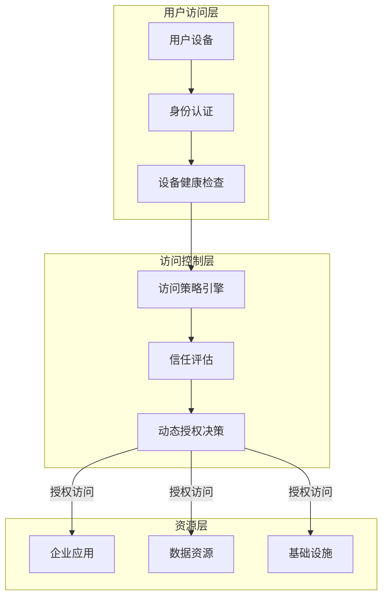

# 零信任架构详解 专题文档

**文档版本**：v1.0
**创建时间**：2026年
**最后更新**：2026年
**状态**：🔄 编写中

---

## 📋 执行摘要

零信任（Zero Trust）是一种"永不信任，始终验证"的安全模型，彻底改变了传统的基于边界的安全理念，通过持续验证和最小权限原则保护现代分布式企业资产。

---

## 一、核心概念

### 1.1 定义与原理

**零信任安全模型**由Forrester Research的John Kindervag于2010年提出，核心思想是：**无论用户或设备位于网络内部还是外部，都不应被自动信任**。

**核心原则**：

1. **永不信任，始终验证**：所有访问请求都必须经过身份验证、授权和加密
2. **最小权限原则**：只授予完成工作所需的最小访问权限
3. **假设已遭入侵**：网络内部和外部都存在威胁
4. **持续验证**：安全状态是动态评估的，不是一次性决策

**传统边界安全 vs 零信任**：

```
传统模式：            零信任模式：
┌─────────────────┐   ┌─────────────────────────────┐
│   外部网络       │   │   任何位置 (内网/外网/云端)  │
│  (不可信)        │   │      ↓ 都需要验证           │
│      ↓          │   │    身份验证 + 设备健康        │
│   防火墙边界      │   │      ↓                      │
│      ↓          │   │    授权决策引擎               │
│   内部网络       │   │      ↓                      │
│  (完全信任)      │   │   最小权限访问资源            │
│   ┌──────┐      │   │   ┌───────────────────┐     │
│   │ 资源  │      │   │   │ 持续监控与评估       │     │
│   └──────┘      │   │   └───────────────────┘     │
└─────────────────┘   └─────────────────────────────┘
```

### 1.2 关键特性

- **身份为中心**：以身份而非网络位置作为访问控制的基础
- **细粒度访问控制**：基于上下文（用户、设备、应用、数据敏感度）的访问决策
- **微分段**：将网络划分为小的安全区域，限制横向移动
- **持续监控**：实时分析用户行为和设备状态
- **自动化响应**：基于风险评分的动态访问调整

### 1.3 适用场景

| 场景 | 适用性 | 说明 |
|------|--------|------|
| 远程办公/混合办公 | ⭐⭐⭐⭐⭐ | 员工从任何地方访问企业资源 |
| 多云环境 | ⭐⭐⭐⭐⭐ | 跨越多个云服务商的复杂基础设施 |
| 供应链协作 | ⭐⭐⭐⭐⭐ | 第三方合作伙伴安全访问 |
| DevSecOps | ⭐⭐⭐⭐ | CI/CD流水线的安全集成 |
| 传统数据中心 | ⭐⭐⭐ | 需要大量改造，投资回报周期长 |

---

## 二、技术细节

### 2.1 BeyondCorp模型

**Google BeyondCorp**是业界首个大规模实施的零信任架构，核心理念：



**BeyondCorp核心组件**：

| 组件 | 功能 | 实现方式 |
|------|------|----------|
| 设备清单数据库 | 跟踪所有企业设备状态 | 设备证书、MDM集成 |
| 用户数据库 | 用户身份和群组信息 | LDAP/Active Directory |
| 访问策略引擎 | 实时访问决策 | 基于规则和ML的风险评估 |
| 访问代理 | 统一接入点 | HTTPS代理、IAP |
| 信任推断器 | 动态信任评分 | 设备状态、行为分析 |

### 2.2 身份感知代理 (IAP)

**身份感知代理（Identity-Aware Proxy）**是零信任架构的关键组件：

```
┌─────────────────────────────────────────────────────────────┐
│                      身份感知代理架构                          │
├─────────────────────────────────────────────────────────────┤
│                                                             │
│   用户请求 → IAP入口 → 身份验证 → 策略评估 → 资源访问          │
│                              ↓                              │
│                        ┌─────────────┐                      │
│                        │  策略引擎    │                      │
│                        │ - 用户身份   │                      │
│                        │ - 设备状态   │                      │
│                        │ - 位置/时间  │                      │
│                        │ - 风险评分   │                      │
│                        └─────────────┘                      │
│                                                             │
└─────────────────────────────────────────────────────────────┘
```

**IAP工作流程**：

1. **请求拦截**：所有访问请求首先经过IAP
2. **身份验证**：验证用户凭据（SSO/MFA）
3. **上下文收集**：收集设备信息、位置、时间等
4. **策略评估**：根据预定义策略评估访问请求
5. **决策执行**：允许、拒绝或要求额外验证

### 2.3 微分段 (Micro-segmentation)

**微分段**将网络划分为细粒度的安全区域：

```
传统分段：                    微分段：
┌─────────────┐              ┌─┬─┬─┬─┬─┐
│   DMZ       │              │W│A│D│B│L│
├─────────────┤              │e│p│a│a│o│
│  应用层      │      →       │b│p│t│c│g│
├─────────────┤              ││││a│k│g│
│  数据库层    │              │S│ │a│e│e│
├─────────────┤              │e│ │b│n│r│
│  管理网络    │              │r│ │a│d│ │
└─────────────┘              │v│ │s│ │ │
                             │e│ │e│ │ │
                             │r│ │ │ │ │
                             └─┴─┴─┴─┴─┘
                             每个工作负载独立分段
```

**微分段技术实现**：

| 技术 | 粒度 | 适用场景 |
|------|------|----------|
| 虚拟防火墙 | VM级别 | 私有云/虚拟机 |
| 容器网络策略 | Pod级别 | Kubernetes环境 |
| 主机防火墙 | 进程级别 | 物理服务器 |
| SDN分段 | 流量级别 | 软件定义网络 |

### 2.4 实施路径

**零信任实施五阶段模型**：

```
阶段1: 识别与可视化          阶段2: 设备安全
┌─────────────────┐         ┌─────────────────┐
│ • 资产清单       │         │ • 设备注册       │
│ • 流量分析       │    →    │ • 端点保护       │
│ • 依赖映射       │         │ • 设备健康检查   │
└─────────────────┘         └─────────────────┘

阶段3: 用户安全              阶段4: 应用与数据
┌─────────────────┐         ┌─────────────────┐
│ • 身份联邦       │    →    │ • 应用分类       │
│ • MFA实施        │         │ • 数据分类       │
│ • 特权访问管理   │         │ • 加密策略       │
└─────────────────┘         └─────────────────┘

阶段5: 自动化与编排
┌─────────────────┐
│ • SOAR集成       │
│ • 持续验证       │
│ • 自适应访问     │
└─────────────────┘
```

**实施关键步骤**：

1. **资产发现与分类**
   - 识别所有用户、设备、应用和数据
   - 建立数据敏感度分类体系

2. **身份基础设施升级**
   - 部署统一身份平台（如Azure AD/Okta）
   - 实施多因素认证（MFA）

3. **访问控制改造**
   - 部署SDP（软件定义边界）或IAP
   - 实施基于角色的访问控制（RBAC）

4. **网络微分段**
   - 使用软件定义网络技术
   - 部署东西向流量监控

5. **监控与分析**
   - SIEM集成
   - UEBA（用户实体行为分析）

---

## 三、系统对比

### 3.1 主流零信任解决方案对比

| 维度 | Google BeyondCorp | Microsoft Zero Trust | Zscaler ZPA | Cloudflare Access |
|------|-------------------|---------------------|-------------|-------------------|
| 部署模式 | 自建/云服务 | 云服务为主 | SaaS | SaaS |
| 身份集成 | Google Identity | Azure AD | 多IdP支持 | 多IdP支持 |
| 设备管理 | Chrome OS优先 | Intune集成 | 第三方MDM | 轻量级代理 |
| 网络代理 | IAP | Azure AD App Proxy | ZPA Connector | Cloudflare Tunnel |
| 数据保护 | DLP基础 | Microsoft Purview | ZIA DLP | Gateway |
| 适用规模 | 大型企业 | 中大型企业 | 各规模 | 中小企业 |

### 3.2 选型决策树

```
零信任架构选型
│
├── 主要云平台?
│   ├── Google Cloud → BeyondCorp
│   ├── Microsoft 365/Azure → Microsoft Zero Trust
│   └── AWS/多云 → 第三方解决方案
│
├── 预算考虑?
│   ├── 高预算 → 完整平台（Zscaler/Netskope）
│   └── 有限预算 → Cloudflare/自建开源方案
│
├── 身份提供商?
│   ├── Azure AD → Microsoft生态
│   ├── Okta → 灵活选择
│   └── Google Workspace → BeyondCorp
│
└── 技术能力?
    ├── 强技术团队 → 自建/开源方案
    └── 有限技术资源 → SaaS解决方案
```

### 3.3 性能基准

| 指标 | 传统VPN | 零信任SDP | 性能提升 |
|------|---------|-----------|----------|
| 首次访问延迟 | 2-5秒 | 0.5-1秒 | 60-75% |
| 并发连接数 | 10K/节点 | 100K+ | 10x+ |
| 横向移动风险 | 高 | 极低 | 90%+ |
| 管理开销 | 高 | 低 | 50%+ |

---

## 四、实践指南

### 4.1 部署配置示例

**OpenZiti（开源零信任网络）配置**：

```yaml
# controller.yml - 零信任控制器配置
identity:
  cert: ctrl.cert
  key: ctrl.key
  ca: ctrl.ca

network:
  name: production-ztn
  
ctrl:
  listener: tls:0.0.0.0:6262
  
mgmt:
  listener: tls:0.0.0.0:10000

# 访问策略定义
policies:
  - name: developer-database-access
    type: service-policy
    service-roles:
      - "#database-services"
    identity-roles:
      - "#developers"
    posture-check-roles:
      - "#corporate-device"
    
# 设备健康检查
posture-checks:
  - name: corporate-device
    type: os
    os:
      - windows
      - macOS
      - linux
    processes:
      - EDR-Agent
      - VPN-Client
```

### 4.2 最佳实践

1. **渐进式实施**
   - 从非关键应用开始试点
   - 逐步扩展至核心业务系统
   - 保留回退机制

2. **用户体验优先**
   - 实施无密码认证（FIDO2/WebAuthn）
   - 减少验证摩擦（风险自适应）
   - 提供清晰的访问状态反馈

3. **数据分类驱动**
   - 根据数据敏感度实施差异化保护
   - 高敏感数据要求更严格的验证
   - 公开信息可放宽访问控制

4. **持续监控与优化**
   - 建立安全基线
   - 定期审查访问策略
   - 基于威胁情报调整规则

5. **供应商锁定避免**
   - 采用开放标准（SAML、OIDC）
   - 设计可迁移架构
   - 保留本地身份源

### 4.3 常见问题

**Q1: 零信任会增加多少延迟？**
A: 现代零信任解决方案的额外延迟通常在10-50ms。通过边缘部署和缓存优化，某些场景甚至比传统VPN更快。关键优化点包括：地理位置就近接入、会话令牌缓存、智能路由。

**Q2: 如何迁移遗留应用？**
A: 遗留应用可通过以下方式集成：
- 应用网关代理（无需改造应用）
- RDP/SSH代理保护管理访问
- 数据库活动监控（DAM）保护数据层

**Q3: 零信任如何与合规要求结合？**
A: 零信任有助于满足多项合规要求：
- GDPR：数据最小访问原则
- HIPAA：强身份验证和审计
- PCI DSS：网络分段要求
- SOC 2：访问控制和监控

---

## 五、形式化分析

### 5.1 信任计算模型

**信任评分公式**：

```
Trust_Score = f(Identity, Device, Behavior, Context)

其中：
- Identity ∈ [0,1] 基于认证强度
- Device ∈ [0,1] 基于设备健康状态
- Behavior ∈ [0,1] 基于异常检测模型
- Context ∈ [0,1] 基于访问场景风险

Access_Decision = {
    Allow    if Trust_Score ≥ Threshold
    StepUp   if Threshold_Low ≤ Trust_Score < Threshold
    Deny     if Trust_Score < Threshold_Low
}
```

### 5.2 安全性分析

**定理**：在零信任架构下，攻击者横向移动的成功概率随网络分段数量呈指数下降。

**证明概要**：
- 设网络有n个微分段
- 每个分段突破概率为p
- 传统网络：P(横向移动) = p
- 零信任网络：P(横向移动) = p^n
- 当n增大时，p^n → 0

---

## 六、与其他主题的关联

### 6.1 上游依赖

- [OAuth2与OIDC](./OAuth2与OIDC.md) - 身份验证协议
- [SAML与LDAP](./SAML与LDAP.md) - 企业身份集成
- [密钥管理KMS](./密钥管理KMS.md) - 身份凭证保护

### 6.2 下游应用

- 微服务安全
- 云原生架构
- DevSecOps实践

### 6.3 相关概念

| 概念 | 关系 | 说明 |
|------|------|------|
| SASE | 融合 | 零信任+SD-WAN+安全服务边缘 |
| SDP | 实现 | 软件定义边界是零信任的网络实现 |
| CASB | 补充 | 云访问安全代理保护SaaS应用 |
| CWPP | 补充 | 云工作负载保护平台保护计算资源 |

---

## 七、参考资源

### 7.1 学术论文

1. [BeyondCorp: A New Approach to Enterprise Security](https://research.google/pubs/pub43231/) - Google, 2014
2. [Zero Trust Architecture](https://csrc.nist.gov/publications/detail/sp/800-207/final) - NIST SP 800-207, 2020
3. [Forrester Wave: Zero Trust eXtended Ecosystem](https://www.forrester.com) - Forrester Research

### 7.2 开源项目

1. [OpenZiti](https://openziti.io/) - 开源零信任网络覆盖
2. [Teleport](https://goteleport.com/) - 零信任访问平台
3. [Cloudflare Zero Trust](https://www.cloudflare.com/zero-trust/) - 免费层可用

### 7.3 学习资料

1. [NIST Zero Trust Architecture](https://csrc.nist.gov/publications/detail/sp/800-207/final) - 官方标准文档
2. [Google Cloud BeyondCorp](https://cloud.google.com/beyondcorp) - 企业实施指南
3. [Microsoft Zero Trust Guidance](https://docs.microsoft.com/security/zero-trust/) - 微软实施框架

### 7.4 相关文档

- [OAuth2与OIDC](./OAuth2与OIDC.md)
- [SAML与LDAP](./SAML与LDAP.md)
- [密钥管理KMS](./密钥管理KMS.md)

---

**维护者**：项目团队
**最后更新**：2026年
