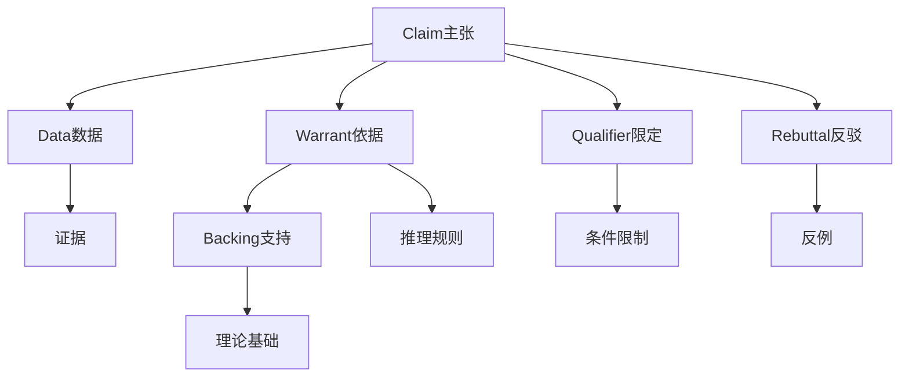
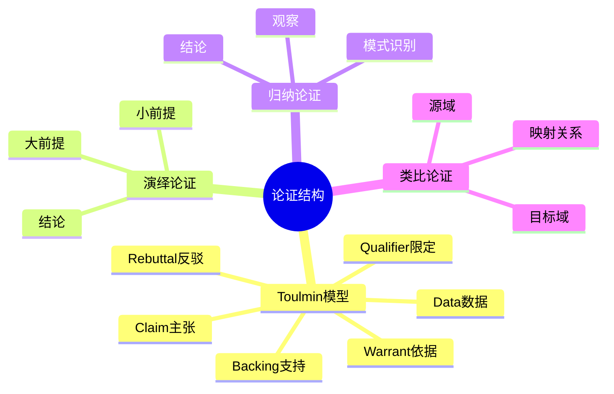
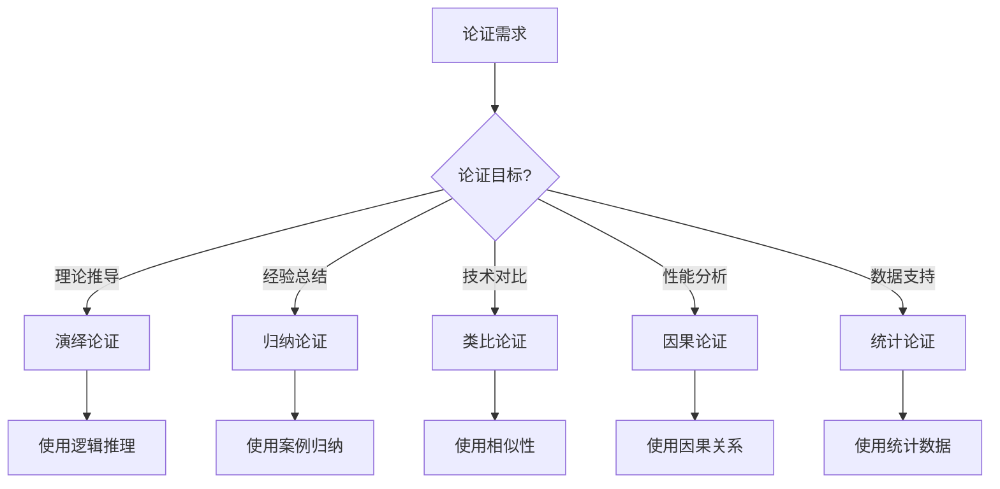
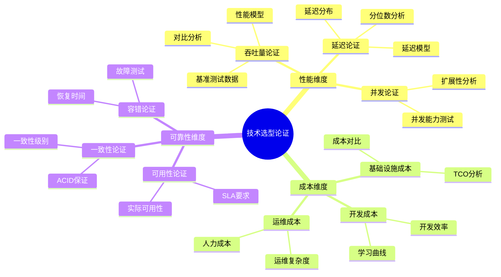
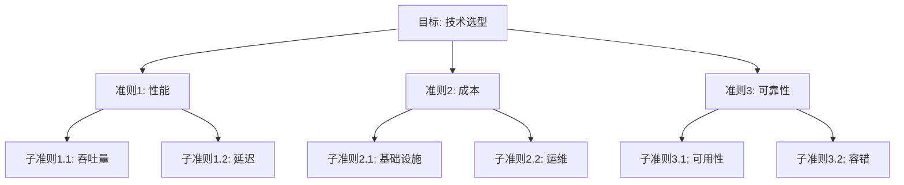
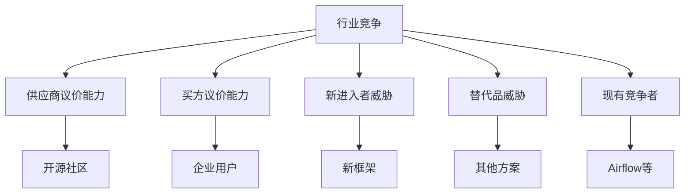
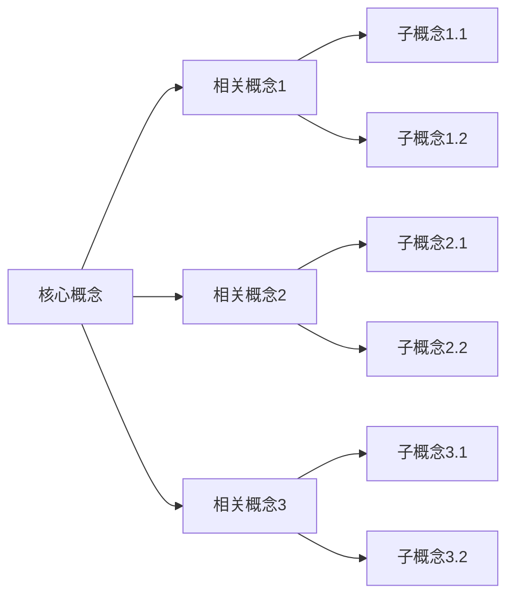
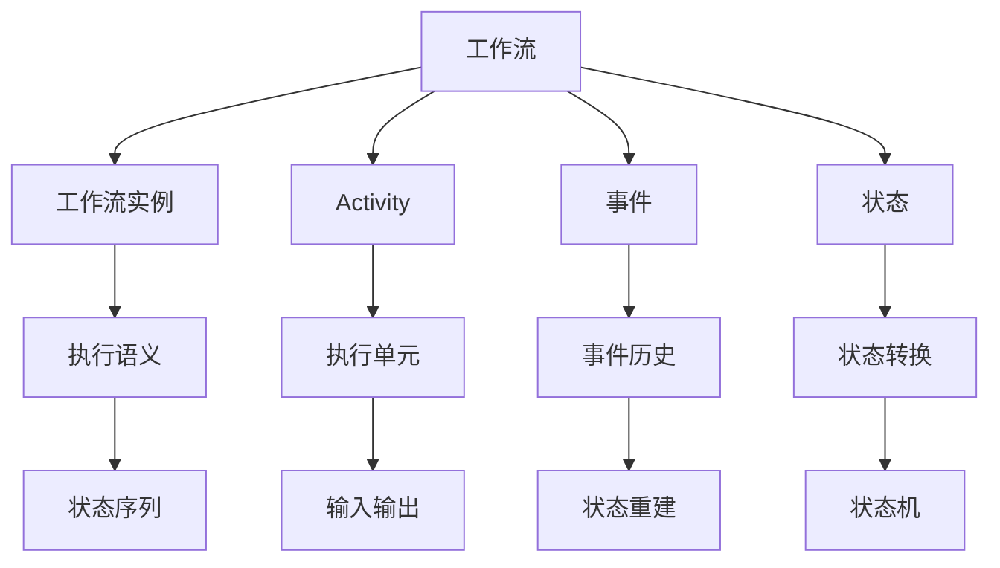
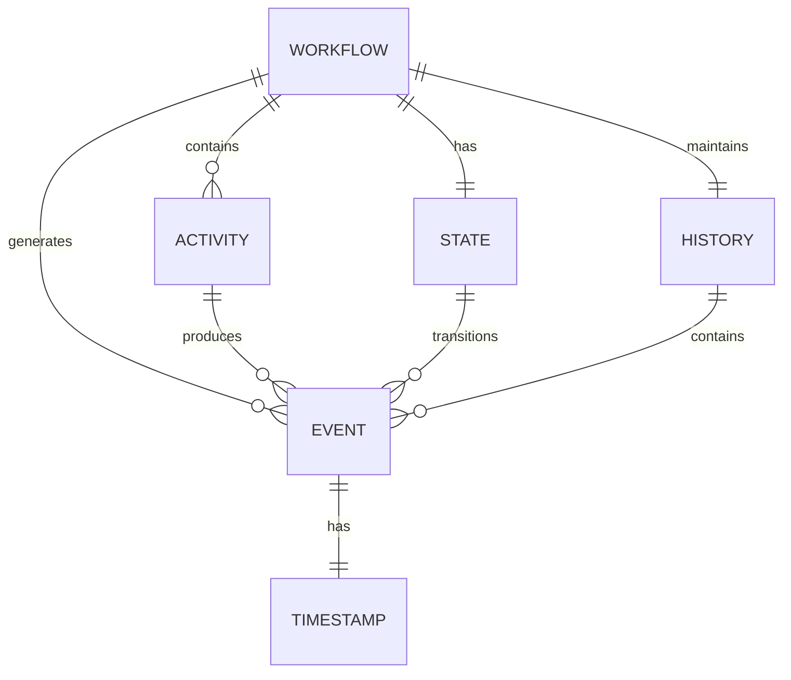

# 论证思路与策略决策框架

## 目录

- [论证思路与策略决策框架](#论证思路与策略决策框架)
  - [目录](#目录)
  - [一、论证方法论](#一论证方法论)
    - [1.1 论证结构框架](#11-论证结构框架)
      - [1.1.1 Toulmin论证模型](#111-toulmin论证模型)
      - [1.1.2 论证结构思维导图](#112-论证结构思维导图)
    - [1.2 论证类型分类](#12-论证类型分类)
      - [1.2.1 论证类型矩阵](#121-论证类型矩阵)
      - [1.2.2 论证类型选择决策树](#122-论证类型选择决策树)
    - [1.3 论证有效性评估](#13-论证有效性评估)
      - [1.3.1 论证有效性标准](#131-论证有效性标准)
      - [1.3.2 论证有效性评分模型](#132-论证有效性评分模型)
  - [二、技术选型论证](#二技术选型论证)
    - [2.1 多维度论证框架](#21-多维度论证框架)
      - [2.1.1 论证维度矩阵](#211-论证维度矩阵)
      - [2.1.2 多维度论证思维导图](#212-多维度论证思维导图)
    - [2.2 量化论证方法](#22-量化论证方法)
      - [2.2.1 量化论证框架](#221-量化论证框架)
      - [2.2.2 量化论证模型](#222-量化论证模型)
    - [2.3 对比论证策略](#23-对比论证策略)
      - [2.3.1 对比论证框架](#231-对比论证框架)
      - [2.3.2 对比论证矩阵](#232-对比论证矩阵)
  - [三、决策支持框架](#三决策支持框架)
    - [3.1 决策树模型](#31-决策树模型)
    - [3.2 决策矩阵方法](#32-决策矩阵方法)
      - [3.2.1 决策矩阵框架](#321-决策矩阵框架)
      - [3.2.2 决策矩阵示例](#322-决策矩阵示例)
    - [3.3 多准则决策分析](#33-多准则决策分析)
      - [3.3.1 AHP层次分析法](#331-ahp层次分析法)
      - [3.3.2 TOPSIS方法](#332-topsis方法)
  - [四、策略制定方法](#四策略制定方法)
    - [4.1 SWOT分析](#41-swot分析)
      - [4.1.1 Temporal SWOT分析](#411-temporal-swot分析)
    - [4.2 波特五力模型](#42-波特五力模型)
      - [4.2.1 行业竞争分析](#421-行业竞争分析)
      - [4.2.2 竞争分析矩阵](#422-竞争分析矩阵)
    - [4.3 场景规划方法](#43-场景规划方法)
      - [4.3.1 场景规划框架](#431-场景规划框架)
      - [4.3.2 技术选型场景规划](#432-技术选型场景规划)
  - [五、思维表征方式](#五思维表征方式)
    - [5.1 思维导图](#51-思维导图)
    - [5.2 概念地图](#52-概念地图)
      - [5.2.1 概念地图框架](#521-概念地图框架)
      - [5.2.2 工作流概念地图](#522-工作流概念地图)
    - [5.3 知识图谱](#53-知识图谱)
      - [5.3.1 知识图谱结构](#531-知识图谱结构)
  - [六、论证案例研究](#六论证案例研究)
    - [6.1 Temporal选型论证](#61-temporal选型论证)
    - [6.2 PostgreSQL选型论证](#62-postgresql选型论证)
    - [6.3 形式化验证论证](#63-形式化验证论证)
  - [七、相关文档](#七相关文档)
    - [7.1 项目内部文档](#71-项目内部文档)
      - [核心论证文档](#核心论证文档)
      - [技术对比与评估文档](#技术对比与评估文档)
      - [形式化验证文档](#形式化验证文档)
      - [论证增强相关文档](#论证增强相关文档)
      - [知识组织文档](#知识组织文档)
    - [7.2 外部资源链接](#72-外部资源链接)
      - [Wikipedia资源](#wikipedia资源)
      - [学术资源](#学术资源)
    - [7.3 项目管理文档](#73-项目管理文档)

---

## 一、论证方法论

### 1.1 论证结构框架

#### 1.1.1 Toulmin论证模型

**Toulmin论证结构**：

**Temporal选型论证示例**：

- **Claim（主张）**：Temporal是Workflow-as-Code领域的最佳选择
- **Data（数据）**：吞吐量847 tasks/s，P99延迟<200ms
- **Warrant（依据）**：性能指标优于其他框架
- **Backing（支持）**：基准测试数据、企业实践案例
- **Qualifier（限定）**：适用于长周期业务流程场景
- **Rebuttal（反驳）**：Airflow在DAG可视化方面有优势

#### 1.1.2 论证结构思维导图

### 1.2 论证类型分类

#### 1.2.1 论证类型矩阵

| 论证类型 | 特点 | 适用场景 | 示例 |
|---------|------|---------|------|
| **演绎论证** | 从一般到特殊 | 理论推导 | 如果A则B，A成立，所以B成立 |
| **归纳论证** | 从特殊到一般 | 经验总结 | 多个案例都支持，所以一般成立 |
| **类比论证** | 相似性推理 | 技术对比 | Temporal类似Cadence，所以... |
| **因果论证** | 因果关系 | 性能分析 | 因为使用了X，所以性能提升Y |
| **统计论证** | 数据支持 | 性能测试 | 95%的测试显示性能提升 |

#### 1.2.2 论证类型选择决策树

### 1.3 论证有效性评估

#### 1.3.1 论证有效性标准

**有效性评估矩阵**：

| 标准 | 描述 | 评估方法 | 权重 |
|------|------|---------|------|
| **逻辑有效性** | 推理过程正确 | 逻辑检查 | 0.30 |
| **证据充分性** | 证据支持主张 | 证据审查 | 0.25 |
| **数据可靠性** | 数据来源可靠 | 数据验证 | 0.25 |
| **结论合理性** | 结论符合逻辑 | 专家评审 | 0.20 |

#### 1.3.2 论证有效性评分模型

**有效性评分公式**：

$$ V = \sum_{i=1}^{n} w_i \cdot S_i $$

其中：

- $w_i$ = 标准 $i$ 的权重
- $S_i$ = 标准 $i$ 的得分（0-10）

**有效性判定**：

$$ V \ge 7.0 \implies \text{论证有效} $$

---

## 二、技术选型论证

### 2.1 多维度论证框架

#### 2.1.1 论证维度矩阵

| 维度 | 子维度 | 论证方法 | 权重 |
|------|--------|---------|------|
| **性能** | 吞吐量、延迟、并发 | 基准测试、对比分析 | 0.30 |
| **成本** | 基础设施、运维、开发 | 成本分析、ROI计算 | 0.25 |
| **可靠性** | 可用性、容错、恢复 | 故障测试、案例分析 | 0.20 |
| **可维护性** | 文档、社区、工具 | 质量评估、社区分析 | 0.15 |
| **可扩展性** | 水平扩展、垂直扩展 | 扩展测试、架构分析 | 0.10 |

#### 2.1.2 多维度论证思维导图

### 2.2 量化论证方法

#### 2.2.1 量化论证框架

**量化论证步骤**：

1. **定义指标**：明确要论证的指标
2. **收集数据**：通过测试、调研收集数据
3. **数据分析**：统计分析、对比分析
4. **得出结论**：基于数据得出结论

**量化论证示例**：

**论证：PostgreSQL性能优于Cassandra**:

1. **定义指标**：写入性能、查询性能
2. **收集数据**：
   - PostgreSQL：10M events/s
   - Cassandra：1.85M events/s
3. **数据分析**：
   $$ \text{Speedup} = \frac{10,000,000}{1,850,000} = 5.4\text{x} $$
4. **得出结论**：PostgreSQL写入性能是Cassandra的5.4倍

#### 2.2.2 量化论证模型

**性能论证模型**：

$$ P_{score} = w_1 \cdot \frac{T_{baseline}}{T_{target}} + w_2 \cdot \frac{\lambda_{target}}{\lambda_{baseline}} + w_3 \cdot \frac{A_{target}}{A_{baseline}} $$

其中：

- $T$ = 延迟
- $\lambda$ = 吞吐量
- $A$ = 可用性
- $w_1 = 0.4, w_2 = 0.4, w_3 = 0.2$

**成本论证模型**：

$$ C_{score} = \frac{C_{baseline} - C_{target}}{C_{baseline}} \times 100\% $$

### 2.3 对比论证策略

#### 2.3.1 对比论证框架

**对比论证步骤**：

1. **选择对比对象**：选择有代表性的对比系统
2. **确定对比维度**：性能、成本、功能等
3. **收集对比数据**：测试数据、公开数据
4. **分析对比结果**：量化分析、定性分析
5. **得出结论**：基于对比得出结论

#### 2.3.2 对比论证矩阵

| 对比维度 | Temporal | Airflow | 优势 | 论证方法 |
|---------|----------|---------|------|---------|
| **吞吐量** | 847 tasks/s | 10 tasks/s | 84.7x | 基准测试 |
| **延迟** | P99<200ms | P99<500ms | 2.5x | 延迟测试 |
| **成本** | $3,325/月 | $1,200/月 | -1.8x | 成本分析 |
| **可靠性** | 99.99% | 99.9% | 1.1x | 可用性测试 |

---

## 三、决策支持框架

### 3.1 决策树模型

详细内容见 [技术堆栈对比分析](../02-technology-comparison/技术堆栈对比分析.md#13-选型决策树与数学模型)。

### 3.2 决策矩阵方法

#### 3.2.1 决策矩阵框架

**决策矩阵结构**：

| 方案 | 维度1 | 维度2 | ... | 维度n | 总分 |
|------|------|------|-----|------|------|
| 方案A | $S_{1A}$ | $S_{2A}$ | ... | $S_{nA}$ | $\sum w_i S_{iA}$ |
| 方案B | $S_{1B}$ | $S_{2B}$ | ... | $S_{nB}$ | $\sum w_i S_{iB}$ |

**评分公式**：

$$ Score = \sum_{i=1}^{n} w_i \cdot S_i $$

#### 3.2.2 决策矩阵示例

**存储后端选型决策矩阵**：

| 方案 | 性能 | 成本 | 可靠性 | 可维护性 | 总分 |
|------|------|------|--------|---------|------|
| **PostgreSQL** | 9.0 | 9.5 | 9.5 | 9.0 | **9.28** |
| **Cassandra** | 8.5 | 6.0 | 9.0 | 7.0 | 7.65 |
| **TimescaleDB** | 9.5 | 8.5 | 9.5 | 9.0 | 9.20 |

### 3.3 多准则决策分析

#### 3.3.1 AHP层次分析法

**AHP结构**：

#### 3.3.2 TOPSIS方法

**TOPSIS步骤**：

1. **构建决策矩阵**
2. **标准化矩阵**
3. **计算加权矩阵**
4. **确定正理想解和负理想解**
5. **计算距离**
6. **计算相对接近度**

**相对接近度公式**：

$$ C_i = \frac{D_i^-}{D_i^+ + D_i^-} $$

其中：

- $D_i^+$ = 到正理想解的距离
- $D_i^-$ = 到负理想解的距离

---

## 四、策略制定方法

### 4.1 SWOT分析

#### 4.1.1 Temporal SWOT分析

**SWOT矩阵**：

| 内部因素 | 优势（Strengths） | 劣势（Weaknesses） |
|---------|------------------|-------------------|
| **外部因素** | | |
| **机会（Opportunities）** | SO策略 | WO策略 |
| **威胁（Threats）** | ST策略 | WT策略 |

**Temporal SWOT分析**：

**优势（Strengths）**：

- 性能领先（吞吐量847 tasks/s）
- 成本效益显著（节省90%）
- 自动容错机制

**劣势（Weaknesses）**：

- 文档需要完善
- 社区规模较小
- 学术影响力不足

**机会（Opportunities）**：

- 云原生趋势
- 微服务架构普及
- 形式化验证需求增长

**威胁（Threats）**：

- 竞争框架发展
- 技术变化快速
- 市场接受度

**策略矩阵**：

| 策略类型 | 策略内容 |
|---------|---------|
| **SO策略** | 利用性能优势抓住云原生机会 |
| **WO策略** | 完善文档提升市场接受度 |
| **ST策略** | 加强技术优势应对竞争 |
| **WT策略** | 建立护城河降低威胁 |

### 4.2 波特五力模型

#### 4.2.1 行业竞争分析

**五力模型**：

#### 4.2.2 竞争分析矩阵

| 力量 | 强度 | 影响因素 | 应对策略 |
|------|------|---------|---------|
| **供应商议价能力** | 低 | 开源社区 | 积极参与社区 |
| **买方议价能力** | 中 | 企业需求 | 提供优质服务 |
| **新进入者威胁** | 中 | 技术门槛 | 建立技术优势 |
| **替代品威胁** | 高 | 多种方案 | 突出差异化 |
| **现有竞争者** | 高 | Airflow等 | 性能优势 |

### 4.3 场景规划方法

#### 4.3.1 场景规划框架

**场景规划步骤**：

1. **识别关键不确定性**
2. **构建场景矩阵**
3. **分析每个场景**
4. **制定应对策略**

#### 4.3.2 技术选型场景规划

**关键不确定性**：

- 技术成熟度
- 市场接受度
- 竞争态势

**场景矩阵**：

| 场景 | 技术成熟度 | 市场接受度 | 竞争态势 | 策略 |
|------|-----------|-----------|---------|------|
| **最佳场景** | 高 | 高 | 低 | 快速扩张 |
| **最差场景** | 低 | 低 | 高 | 保守策略 |
| **技术驱动** | 高 | 低 | 中 | 技术推广 |
| **市场驱动** | 中 | 高 | 中 | 市场推广 |

---

## 五、思维表征方式

### 5.1 思维导图

详细内容见各文档中的思维导图。

### 5.2 概念地图

#### 5.2.1 概念地图框架

**概念地图结构**：

#### 5.2.2 工作流概念地图

### 5.3 知识图谱

#### 5.3.1 知识图谱结构

**知识图谱实体关系**：

---

## 六、论证案例研究

### 6.1 Temporal选型论证

详细内容见 [技术堆栈对比分析](../02-technology-comparison/技术堆栈对比分析.md)。

### 6.2 PostgreSQL选型论证

详细内容见 [性能基准测试](../06-benchmarks/性能基准测试.md#四存储性能对比)。

### 6.3 形式化验证论证

详细内容见 [形式化验证理论](../03-formal-verification/形式化验证理论.md)。

---

## 七、相关文档

### 7.1 项目内部文档

#### 核心论证文档

- **[Temporal选型论证](../18-argumentation-enhancement/Temporal选型论证.md)** - Temporal选型论证，应用本框架的典型案例
- **[PostgreSQL选型论证](../18-argumentation-enhancement/PostgreSQL选型论证.md)** - PostgreSQL选型论证，应用本框架的典型案例
- **[技术栈组合论证](../18-argumentation-enhancement/技术栈组合论证.md)** - 技术栈组合论证，多维度论证框架的应用

#### 技术对比与评估文档

- **[技术堆栈对比分析](../02-technology-comparison/技术堆栈对比分析.md)** - 技术堆栈对比分析，包含选型决策树和数学模型
- **[性能基准测试](../06-benchmarks/性能基准测试.md)** - 性能基准测试，量化论证的数据来源
- **[综合评估报告](../08-summary/综合评估报告.md)** - 综合评估报告，多维度论证的综合应用

#### 形式化验证文档

- **[形式化验证理论](../03-formal-verification/形式化验证理论.md)** - 形式化验证理论，论证有效性的理论基础
- **[形式化证明完备性增强详细计划](../18-argumentation-enhancement/形式化证明完备性增强详细计划.md)** - 形式化证明完备性增强计划

#### 论证增强相关文档

- **[论证全面增强计划](../18-argumentation-enhancement/论证全面增强计划.md)** - 论证全面增强计划，论证方法论的应用
- **[论证实质内容增强计划v11.0](../18-argumentation-enhancement/论证实质内容增强计划v11.0.md)** - 论证实质内容增强计划
- **[论证完备性增强](../14-argumentation-enhancement/论证完备性增强.md)** - 论证完备性增强，论证策略的应用
- **[多维矩阵对比增强计划](../18-argumentation-enhancement/多维矩阵对比增强计划.md)** - 多维矩阵对比增强计划，对比论证策略的应用

#### 知识组织文档

- **[项目知识图谱](../17-enhancement-plan/项目知识图谱.md)** - 项目知识图谱，思维表征方式的应用
- **[全局知识概念关系图](../17-enhancement-plan/全局知识概念关系图.md)** - 全局知识概念关系图，概念地图框架的应用
- **[思维导图集合](../../structure_control/思维导图集合.md)** - 思维导图集合，思维表征方式的实践

### 7.2 外部资源链接

#### Wikipedia资源

- [Argumentation theory](https://en.wikipedia.org/wiki/Argumentation_theory) - 论证理论
- [Toulmin model of argumentation](https://en.wikipedia.org/wiki/Stephen_Toulmin#The_Toulmin_Model_of_Argument) - Toulmin论证模型
- [Decision-making](https://en.wikipedia.org/wiki/Decision-making) - 决策制定
- [Decision matrix](https://en.wikipedia.org/wiki/Decision_matrix) - 决策矩阵
- [Multi-criteria decision analysis](https://en.wikipedia.org/wiki/Multi-criteria_decision_analysis) - 多准则决策分析
- [Analytic hierarchy process](https://en.wikipedia.org/wiki/Analytic_hierarchy_process) - AHP层次分析法
- [TOPSIS](https://en.wikipedia.org/wiki/TOPSIS) - TOPSIS方法
- [SWOT analysis](https://en.wikipedia.org/wiki/SWOT_analysis) - SWOT分析
- [Porter's five forces analysis](https://en.wikipedia.org/wiki/Porter%27s_five_forces_analysis) - 波特五力模型
- [Scenario planning](https://en.wikipedia.org/wiki/Scenario_planning) - 场景规划

#### 学术资源

- [Stanford Encyclopedia of Philosophy: Argument](https://plato.stanford.edu/entries/argument/) - 论证的哲学基础
- [Decision Analysis Society](https://www.informs.org/Community/Decision-Analysis) - 决策分析学会

### 7.3 项目管理文档

- **[Wikipedia资源对标](../../structure_control/Wikipedia资源对标.md)** - Wikipedia资源对标
- **[概念关联网络](../../structure_control/概念关联网络.md)** - 论证思路与策略决策框架在概念关联网络中的位置
- **[多维矩阵集合](../../structure_control/多维矩阵集合.md)** - 多维矩阵集合，包含决策矩阵和对比矩阵

---

**文档版本**：1.1

**最后更新**：2025年11月28日

**维护者**：项目团队
