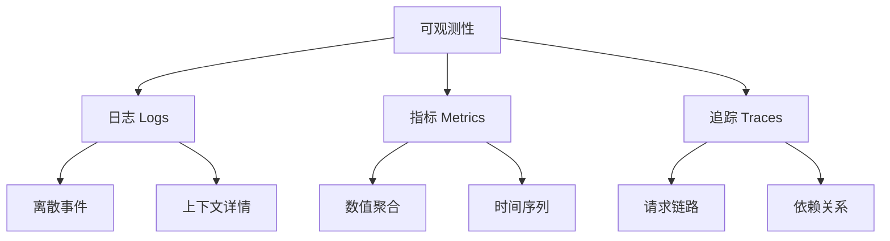
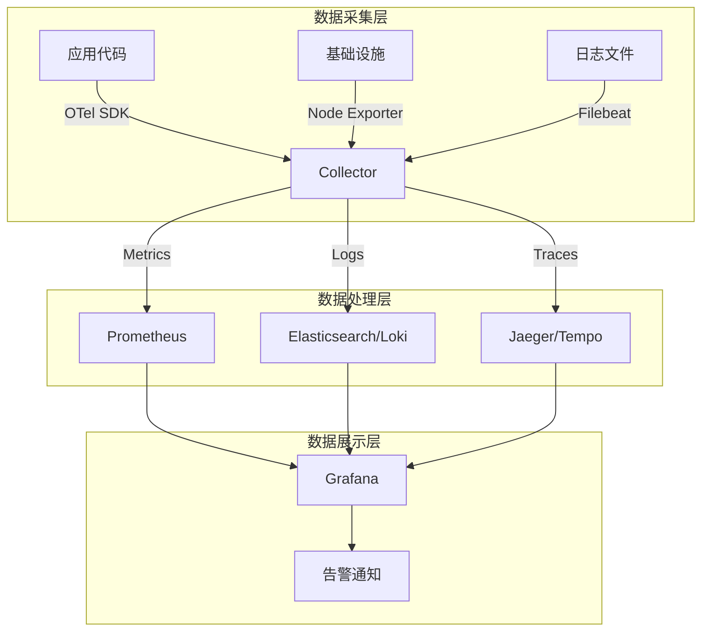
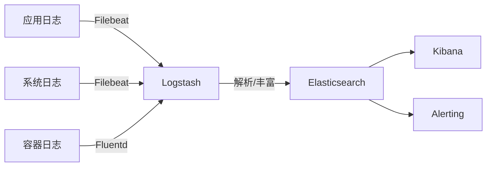
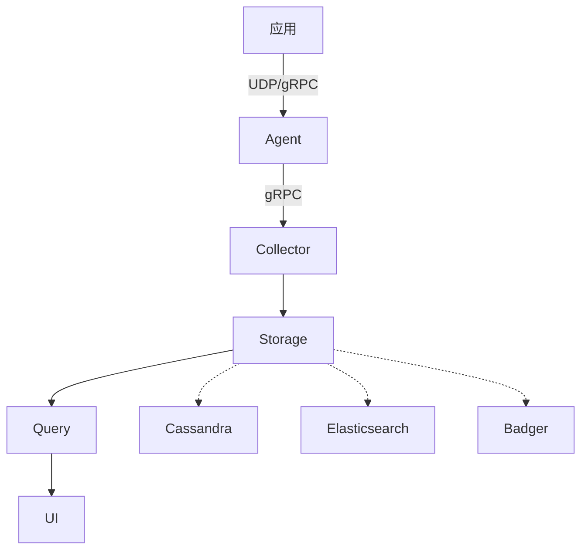

# 分布式可观测性 专题文档

**文档版本**：v1.0
**创建时间**：2026年
**最后更新**：2026年
**状态**：🔄 编写中

---

## 📋 执行摘要

分布式可观测性是通过日志（Logs）、指标（Metrics）和追踪（Traces）三大支柱，结合OpenTelemetry等开放标准，实现对复杂分布式系统内部状态的理解、故障诊断和性能优化的系统性方法。

---

## 一、核心概念

### 1.1 定义与原理

**可观测性（Observability）**：通过系统外部输出推断其内部状态的能力，源自控制理论概念。

**三大支柱（Three Pillars）**：



**核心原理**：
- **因果分析**：从结果反推原因
- **上下文关联**：跨维度数据关联
- **实时洞察**：低延迟数据处理
- **预测能力**：趋势分析和异常检测

### 1.2 关键特性

- **分布式追踪**：跨服务请求链路追踪
- **高基数维度**：丰富的标签和元数据
- **统一数据模型**：OpenTelemetry标准
- **自动关联**：Trace-ID贯穿全链路
- **智能告警**：基于ML的异常检测

### 1.3 适用场景

| 场景 | 适用性 | 说明 |
|------|--------|------|
| 微服务故障排查 | ⭐⭐⭐⭐⭐ | 追踪跨服务调用链 |
| 性能瓶颈定位 | ⭐⭐⭐⭐⭐ | 指标和追踪结合分析 |
| 容量规划 | ⭐⭐⭐⭐ | 历史指标趋势分析 |
| 安全审计 | ⭐⭐⭐⭐ | 全链路访问日志 |
| 业务分析 | ⭐⭐⭐ | 结合业务指标观测 |

---

## 二、技术细节

### 2.1 可观测性架构设计



### 2.2 OpenTelemetry标准

**数据模型**：

#### Trace（追踪）

```
Trace
├── TraceID: 全局唯一标识
├── Span
│   ├── SpanID: 单元标识
│   ├── ParentSpanID: 父单元
│   ├── OperationName: 操作名
│   ├── StartTime/EndTime: 时间戳
│   ├── Attributes: 键值对属性
│   ├── Events: 时间点事件
│   ├── Links: 跨Trace关联
│   └── Status: 成功/错误状态
└── Span...
```

**Span类型**：
- **Root Span**：请求入口
- **Child Span**：内部调用
- **Internal Span**：内部处理
- **Client Span**：对外调用
- **Server Span**：接收请求

#### Metric（指标）

**指标类型**：

| 类型 | 描述 | 示例 |
|------|------|------|
| Counter | 单调递增计数器 | 请求总数 |
| UpDownCounter | 可增减计数器 | 连接数 |
| Gauge | 瞬时值 | 内存使用率 |
| Histogram | 分布统计 | 请求延迟分布 |
| Summary | 分位数统计 | 99分位延迟 |

#### Log（日志）

**结构化日志格式**：
```json
{
  "timestamp": "2026-01-15T10:30:00Z",
  "severity": "ERROR",
  "body": "Database connection failed",
  "trace_id": "4bf92f3577b34da6a3ce929d0e0e4736",
  "span_id": "00f067aa0ba902b7",
  "attributes": {
    "service.name": "payment-service",
    "host.name": "pod-123",
    "db.name": "payments"
  }
}
```

**上下文传播**：

```
W3C Trace Context:
- traceparent: 00-4bf92f3577b34da6a3ce929d0e0e4736-00f067aa0ba902b7-01
  version-trace_id-parent_id-flags
- tracestate: vendor-specific info
```

### 2.3 日志收集（ELK Stack）

**组件架构**：



**Filebeat配置**：
```yaml
filebeat.inputs:
- type: log
  paths:
    - /var/log/app/*.log
  fields:
    service: payment-service
  multiline:
    pattern: '^\['
    negate: true
    match: after

output.elasticsearch:
  hosts: ["http://elasticsearch:9200"]
  index: "app-logs-%{+yyyy.MM.dd}"
```

**索引生命周期管理（ILM）**：

| 阶段 | 动作 | 保留时间 |
|------|------|----------|
| Hot | 可读写 | 0-7天 |
| Warm | 只读，缩小分片 | 7-30天 |
| Cold | 只读，压缩存储 | 30-90天 |
| Delete | 删除 | 90天+ |

**性能优化**：
- 批量写入（Bulk API）
- 索引分片优化
- 字段映射优化（禁用text字段的norms）
- 使用_ignored字段过滤

### 2.4 指标监控（Prometheus + Grafana）

**Prometheus数据模型**：

```
<metric_name>{<label_1>=<value_1>, ...}

示例：
http_requests_total{method="POST", handler="/api/order", status="200"}
```

**PromQL查询语言**：

```promql
# 瞬时向量选择
http_requests_total{job="api-server"}

# 范围向量选择
http_requests_total[5m]

# 聚合操作
sum by (handler) (rate(http_requests_total[5m]))

# 直方图百分位
histogram_quantile(0.99, 
  sum(rate(http_request_duration_seconds_bucket[5m])) by (le)
)

# 告警规则
group:api_errors
  - alert: HighErrorRate
    expr: rate(http_requests_total{status=~"5.."}[5m]) > 0.1
    for: 5m
    annotations:
      summary: "High error rate detected"
```

**指标类型详解**：

| 类型 | 使用方式 | 客户端库实现 |
|------|----------|--------------|
| Counter | Inc() | 单调递增 |
| Gauge | Set()/Inc()/Dec() | 任意值 |
| Histogram | Observe() | _sum, _count, _bucket |
| Summary | Observe() | _sum, _count, φ分位 |

**Grafana可视化**：

```json
{
  "title": "Request Rate",
  "type": "timeseries",
  "targets": [{
    "expr": "sum(rate(http_requests_total[5m])) by (handler)",
    "legendFormat": "{{handler}}"
  }],
  "fieldConfig": {
    "unit": "reqps",
    "min": 0
  }
}
```

### 2.5 分布式追踪（Jaeger, Zipkin）

**Jaeger架构**：



**采样策略**：

| 策略 | 描述 | 适用场景 |
|------|------|----------|
| 固定采样 | 固定比例（如1%） | 均匀流量 |
| 概率采样 | 随机决定 | 简单实现 |
| 速率限制 | 每秒最大采样数 | 流量波动大 |
| 尾部采样 | 延迟/错误采样 | 高基数量 |

**采样配置示例**：
```yaml
# Jaeger配置
sampler:
  type: probabilistic
  param: 0.01  # 1%采样

# 或自适应采样
sampler:
  type: adaptive
  target_samples_per_second: 10
```

**追踪分析维度**：

1. **延迟分析**：识别慢调用
2. **错误分析**：错误传播路径
3. **依赖分析**：服务调用拓扑
4. **瓶颈分析**：高耗时span定位

---

## 三、系统对比

### 3.1 日志系统对比矩阵

| 维度 | ELK Stack | Loki | Splunk | Datadog |
|------|-----------|------|--------|---------|
| 存储成本 | 中 | 低 | 高 | 高 |
| 查询语言 | Lucene | LogQL | SPL | 类SQL |
| 水平扩展 | 优秀 | 优秀 | 良好 | 托管 |
| 学习曲线 | 陡峭 | 平缓 | 中等 | 低 |
| 开源 | 是 | 是 | 否 | 否 |

### 3.2 时序数据库对比

| 特性 | Prometheus | InfluxDB | TimescaleDB | VictoriaMetrics |
|------|------------|----------|-------------|-----------------|
| 数据模型 | 多维标签 | 多维标签 | SQL + 时间 | Prometheus兼容 |
| 存储 | 本地 | 本地/云 | PostgreSQL | 本地/云 |
| 查询语言 | PromQL | Flux/InfluxQL | SQL | MetricsQL |
| 高可用 | 联邦/Thanos | 企业版 | 原生 | 集群版 |
| 资源效率 | 中 | 中 | 高 | 极高 |

### 3.3 追踪系统对比

| 特性 | Jaeger | Zipkin | Tempo | SkyWalking |
|------|--------|--------|-------|------------|
| 后端存储 | ES/Cassandra | ES/MySQL | GCS/S3/Azure | ES/H2/MySQL |
| 查询能力 | 强 | 中等 | 基础 | 强 |
| 服务依赖 | 自动发现 | 支持 | 支持 | 自动发现 |
| APM功能 | 基础 | 无 | 无 | 完整 |
| 云原生 | 优秀 | 良好 | 优秀 | 良好 |

---

## 四、实践指南

### 4.1 OpenTelemetry集成

```python
# Python应用接入示例
from opentelemetry import trace, metrics
from opentelemetry.sdk.trace import TracerProvider
from opentelemetry.sdk.metrics import MeterProvider
from opentelemetry.exporter.otlp.proto.grpc.trace_exporter import OTLPSpanExporter
from opentelemetry.exporter.otlp.proto.grpc.metric_exporter import OTLPMetricExporter
from opentelemetry.sdk.trace.export import BatchSpanProcessor

# 配置Tracer
trace.set_tracer_provider(TracerProvider())
tracer = trace.get_tracer(__name__)

otlp_exporter = OTLPSpanExporter(endpoint="otel-collector:4317")
span_processor = BatchSpanProcessor(otlp_exporter)
trace.get_tracer_provider().add_span_processor(span_processor)

# 业务代码中使用
with tracer.start_as_current_span("process_order") as span:
    span.set_attribute("order.id", order_id)
    span.set_attribute("customer.id", customer_id)
    
    # 记录事件
    span.add_event("payment_processing_started")
    process_payment()
    span.add_event("payment_completed")
```

### 4.2 OpenTelemetry Collector配置

```yaml
# otel-collector-config.yaml
receivers:
  otlp:
    protocols:
      grpc:
        endpoint: 0.0.0.0:4317
      http:
        endpoint: 0.0.0.0:4318

processors:
  batch:
    timeout: 1s
    send_batch_size: 1024
  resource:
    attributes:
      - key: environment
        value: production
        action: upsert

exporters:
  prometheusremotewrite:
    endpoint: http://prometheus:9090/api/v1/write
  otlp/jaeger:
    endpoint: jaeger:4317
    tls:
      insecure: true
  loki:
    endpoint: http://loki:3100/loki/api/v1/push

service:
  pipelines:
    traces:
      receivers: [otlp]
      processors: [batch, resource]
      exporters: [otlp/jaeger]
    metrics:
      receivers: [otlp]
      processors: [batch]
      exporters: [prometheusremotewrite]
    logs:
      receivers: [otlp]
      processors: [batch]
      exporters: [loki]
```

### 4.3 最佳实践

1. **采样策略优化**：
   - 生产环境使用概率采样（1-10%）
   - 错误请求100%采样
   - 关键业务链路提高采样率

2. **资源标签规范**：
   ```
   service.name: 服务名称
   service.version: 版本号
   deployment.environment: 环境
   host.name: 主机名
   k8s.pod.name: Pod名称
   ```

3. **告警规则设计**：
   - 基于SLO的错误预算告警
   - 延迟P99告警阈值设置
   - 避免告警风暴（分组、抑制）

4. **成本控制**：
   - 合理设置数据保留期
   - 使用降采样（Downsampling）
   - 分离冷热数据存储

### 4.4 常见问题

**Q1: 如何减少追踪数据量？**
A: 
- 使用自适应采样
- 过滤健康检查端点
- 设置最大span数限制
- 压缩传输数据

**Q2: 跨服务追踪ID如何传递？**
A: 使用W3C Trace Context标准，通过HTTP头（traceparent/tracestate）或消息队列属性传递。

**Q3: 指标和追踪如何关联？**
A: 使用Exemplar将指标点与具体Trace关联，在Grafana中可直接跳转到对应追踪详情。

**Q4: 如何监控监控本身？**
A: 建立监控可观测性的元监控，包括采集延迟、丢包率、存储使用率等关键指标。

---

## 五、形式化分析

### 5.1 数据完整性分析

**追踪完整性定理**：

在一个分布式追踪系统中，如果每个服务都正确实现上下文传播，则完整请求链路可被重建。

**证明要点**：
1. TraceID全局唯一且贯穿全链路
2. ParentSpanID正确设置保证父子关系
3. Span时间戳确保执行顺序

### 5.2 采样理论

**概率采样无偏性**：

设真实请求延迟分布为F(x)，采样率p，则采样后分布仍为F(x)。

**证明**：
P(X≤x | sampled) = P(X≤x ∩ sampled) / P(sampled)
                 = P(X≤x) × p / p
                 = P(X≤x)

---

## 六、与其他主题的关联

### 6.1 上游依赖

- [分布式系统基础](../01-theory/分布式系统基础.md)
- [微服务架构](../05-microservices/微服务设计模式.md)
- [容器技术](../04-infrastructure/容器技术.md)

### 6.2 下游应用

- [混沌工程](./混沌工程.md)
- [容量规划](../10-performance/容量规划.md)
- [故障诊断](../10-performance/故障诊断.md)

### 6.3 相关概念

| 概念 | 关系 | 说明 |
|------|------|------|
| APM | 扩展 | 应用性能管理，可观测性的产品化 |
| Profiling | 补充 | 代码级性能分析 |
| eBPF | 技术 | 内核级可观测性 |

---

## 七、参考资源

### 7.1 学术论文

1. [Dapper, a Large-Scale Distributed Systems Tracing Infrastructure](https://research.google/pubs/pub36356/) - Google, 2010
2. [OpenTelemetry: A Vigorous Agent for Cloud-native Observability](https://opentelemetry.io/) - CNCF
3. [The RED Method](https://www.weave.works/blog/the-red-method-key-metrics-for-microservices-architecture/) - Weaveworks

### 7.2 开源项目

1. [OpenTelemetry](https://opentelemetry.io/) - 统一可观测性标准
2. [Prometheus](https://prometheus.io/) - 指标监控
3. [Jaeger](https://www.jaegertracing.io/) - 分布式追踪
4. [Grafana](https://grafana.com/) - 可视化平台
5. [Loki](https://grafana.com/loki) - 日志聚合

### 7.3 学习资料

1. [Distributed Systems Observability](https://www.oreilly.com/library/view/distributed-systems-observability/9781492033431/) - Cindy Sridharan
2. [Site Reliability Engineering](https://sre.google/sre-book/table-of-contents/) - Google SRE Book
3. [OpenTelemetry文档](https://opentelemetry.io/docs/) - 官方文档

### 7.4 相关文档

- [混沌工程](./混沌工程.md)
- [性能优化](../10-performance/性能优化.md)
- [服务网格](../05-microservices/服务网格.md)

---

**维护者**：项目团队
**最后更新**：2026年
