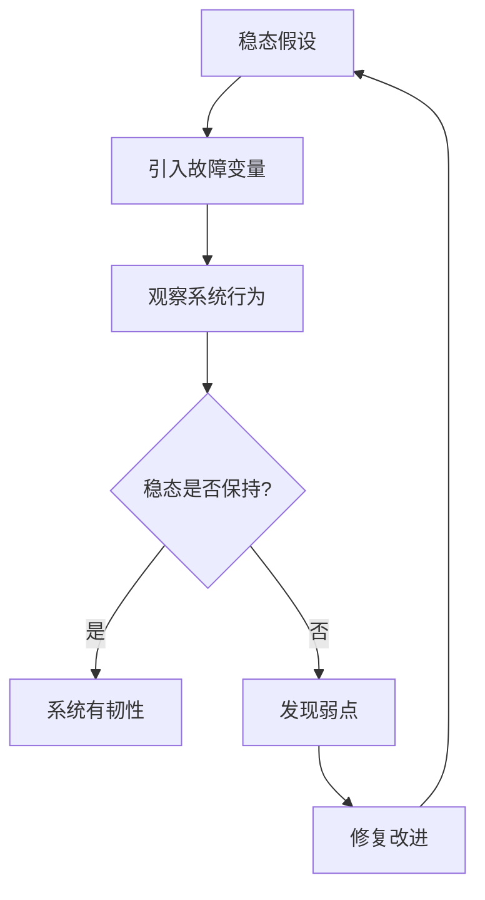
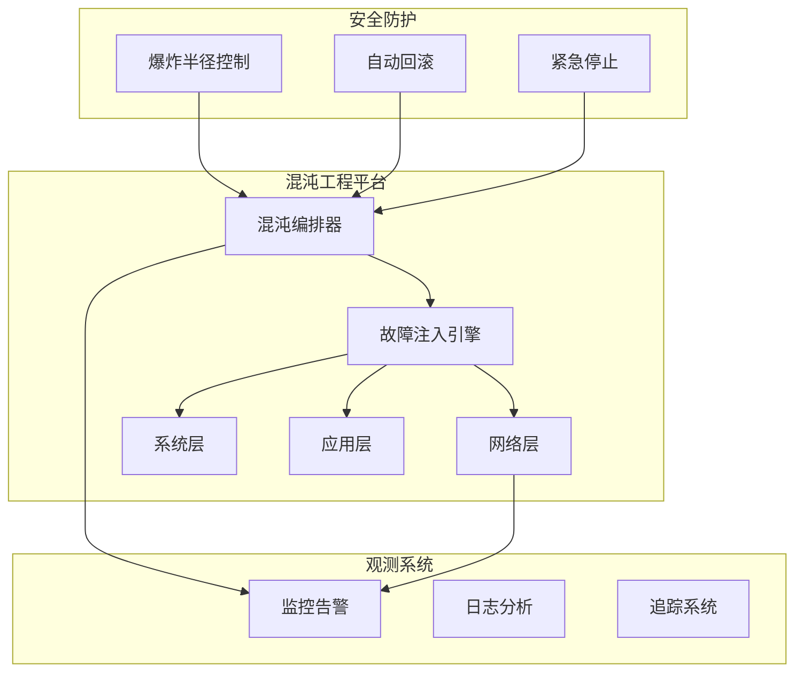
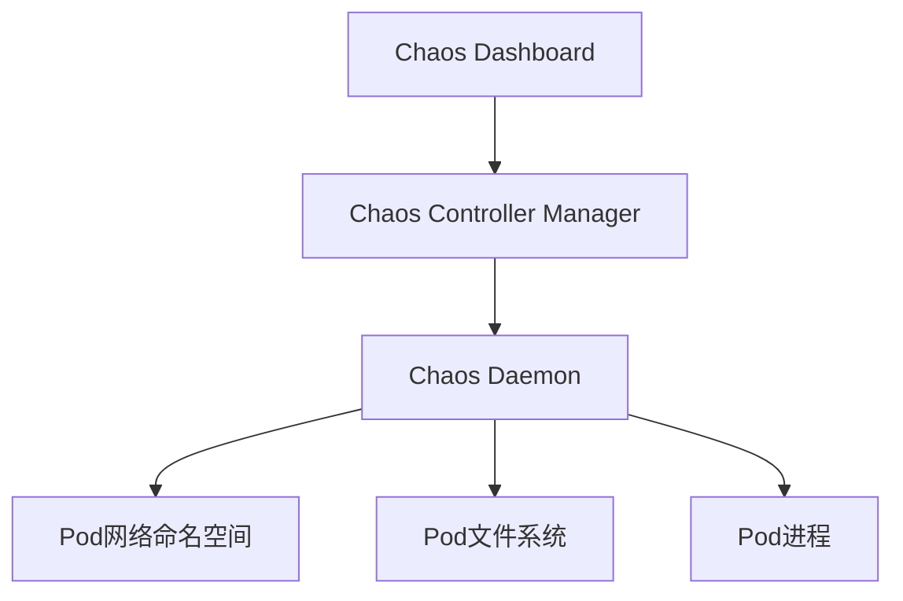
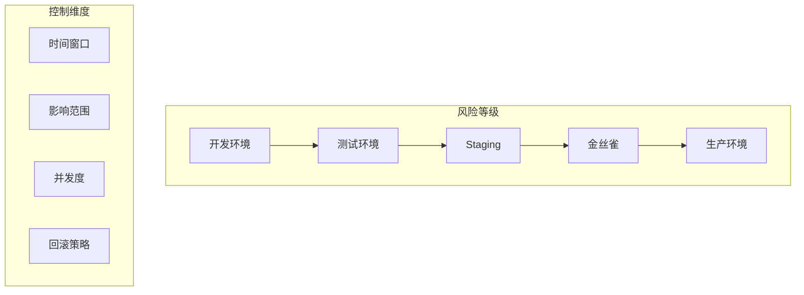

# 混沌工程 专题文档

**文档版本**：v1.0
**创建时间**：2026年
**最后更新**：2026年
**状态**：🔄 编写中

---

## 📋 执行摘要

混沌工程是通过在分布式系统中有控制地引入故障，验证系统在面对异常条件时的韧性行为，从而主动发现并修复潜在弱点的学科。它不是"为了破坏而破坏"，而是基于假设的科学实验方法。

---

## 一、核心概念

### 1.1 定义与原理

**混沌工程（Chaos Engineering）**：在分布式系统上进行实验的学科，目的是建立对系统承受生产环境中湍流条件能力的信心。

**核心原理**：



**五大高级原则**（由Principles of Chaos定义）：

1. **建立稳态假设**：定义系统的正常行为指标
2. **引入真实变量**：模拟真实世界故障事件
3. **生产环境运行**：在真实流量下验证
4. **自动化运行**：持续验证而非一次性
5. **最小化影响范围**：控制爆炸半径

### 1.2 关键特性

- **科学方法**：假设-实验-验证的科学流程
- **可控性**：精确的故障注入和回滚能力
- **可观测性**：完整的监控和度量
- **渐进式**：从小范围到大范围逐步扩展
- **安全性**：自动终止和紧急制动机制

### 1.3 适用场景

| 场景 | 适用性 | 说明 |
|------|--------|------|
| 微服务依赖验证 | ⭐⭐⭐⭐⭐ | 验证服务降级和熔断 |
| 容器编排测试 | ⭐⭐⭐⭐⭐ | K8s Pod故障恢复 |
| 数据库故障演练 | ⭐⭐⭐⭐⭐ | 主从切换、分区容忍 |
| 网络分区测试 | ⭐⭐⭐⭐ | 验证网络韧性 |
| 云服务商故障模拟 | ⭐⭐⭐⭐ | 多可用区设计验证 |
| 批处理系统测试 | ⭐⭐⭐ | 重试和死信队列验证 |

---

## 二、技术细节

### 2.1 混沌工程架构



### 2.2 故障类型分类

#### 基础设施层故障

| 故障类型 | 描述 | 实现方式 |
|----------|------|----------|
| **实例终止** | 随机终止VM/Pod | AWS API / K8s API |
| **磁盘故障** | 磁盘满/只读/高延迟 | 磁盘填充/IO限制 |
| **CPU压力** | CPU资源耗尽 | stress-ng工具 |
| **内存压力** | OOM条件 | 内存分配/泄漏模拟 |
| **时间漂移** | 系统时间跳跃 | 修改系统时钟 |

#### 网络层故障

| 故障类型 | 描述 | 参数控制 |
|----------|------|----------|
| **延迟注入** | 增加网络延迟 | 延迟时间、抖动 |
| **丢包** | 随机丢包 | 丢包率 |
| **分区** | 网络隔离 | 分区节点集 |
| **DNS故障** | DNS解析失败 | 响应类型 |
| **带宽限制** | 限制吞吐量 | 带宽上限 |

#### 应用层故障

| 故障类型 | 描述 | 注入点 |
|----------|------|--------|
| **异常抛出** | 方法返回异常 | 代码拦截 |
| **延迟注入** | 方法执行延迟 | AOP/Agent |
| **返回值篡改** | 修改返回数据 | 代理层 |
| **死锁模拟** | 线程阻塞 | 资源竞争 |

### 2.3 主流故障注入工具

#### Chaos Monkey（Netflix）

**原理**：
```
定时任务
  ↓
随机选择实例（基于概率）
  ↓
调用云API终止实例
  ↓
验证自动恢复
```

**适用场景**：
- AWS Auto Scaling Group测试
- 验证实例级故障恢复
- 简单随机故障注入

#### Chaos Mesh（PingCAP）

**架构设计**：



**实验类型**：

| 类型 | 故障场景 | 实现机制 |
|------|----------|----------|
| **PodChaos** | Pod杀死/容器重启 | K8s API |
| **NetworkChaos** | 网络延迟/丢包/分区 | iptables/tc |
| **IOChaos** | IO延迟/错误 | fuse文件系统 |
| **TimeChaos** | 时间跳跃 | ptrace修改 |
| **StressChaos** | CPU/内存压力 | stress-ng |
| **DNSChaos** | DNS故障 | CoreDNS拦截 |

**实验定义示例**：
```yaml
apiVersion: chaos-mesh.org/v1alpha1
kind: NetworkChaos
metadata:
  name: network-delay
spec:
  action: delay
  mode: one
  selector:
    namespaces:
      - default
    labelSelectors:
      app: web-server
  delay:
    latency: "100ms"
    correlation: "100"
    jitter: "0ms"
  duration: "5m"
  scheduler:
    cron: "@every 30m"
```

#### Litmus（ChaosNative）

**特点**：
- 云原生混沌工程框架
- 丰富的预定义实验
- GitOps集成
- ChaosHub共享实验

**工作流定义**：
```yaml
apiVersion: argoproj.io/v1alpha1
kind: Workflow
metadata:
  name: pod-delete-chaos
spec:
  entrypoint: chaos
  templates:
  - name: chaos
    steps:
    - - name: inject-chaos
        templateRef:
          name: pod-delete
          template: pod-delete
        arguments:
          parameters:
          - name: target-pod
            value: "nginx-app"
          - name: duration
            value: "60s"
    - - name: verify-resilience
        template: verify
```

### 2.4 实验设计方法论

#### 游戏日（Game Day）流程


**各阶段要点**：

| 阶段 | 关键活动 | 输出物 |
|------|----------|--------|
| 计划 | 确定假设、选择故障、定义成功标准 | 实验计划书 |
| 准备 | 检查监控、配置告警、准备回滚 | 检查清单 |
| 执行 | 逐步注入故障、实时监控 | 执行日志 |
| 观察 | 收集指标、记录异常 | 观测报告 |
| 分析 | 对比预期与实际、根因分析 | 分析报告 |
| 改进 | 修复问题、更新运行手册 | 改进项 |

#### 稳态指标定义

**关键指标（基于Google SRE）**：

```
服务水平指标（SLI）：
- 请求延迟：p99 < 200ms
- 错误率： < 0.1%
- 吞吐量： > 1000 RPS
- 可用性： > 99.9%
```

**稳态定义示例**：
```python
steady_state = {
    "http_request_duration_seconds": {
        "p99": lambda x: x < 0.2,  # 200ms
        "p95": lambda x: x < 0.1   # 100ms
    },
    "http_requests_total": {
        "error_rate": lambda x: x < 0.001  # 0.1%
    },
    "system_cpu_usage": {
        "max": lambda x: x < 0.8  # 80%
    }
}
```

### 2.5 安全控制机制

#### 爆炸半径控制



**控制策略**：

| 策略 | 说明 | 实现 |
|------|------|------|
| **时间窗口** | 仅低峰期执行 | cron表达式限制 |
| **百分比限制** | 最大影响实例比例 | 全局配置 |
| **白名单** | 保护关键服务 | 标签选择器排除 |
| **并发控制** | 同时运行实验数 | 信号量/锁 |
| **自动回滚** | 异常自动停止 | 指标阈值触发 |

#### 紧急停止机制

```python
# 紧急停止检查
def abort_check():
    # 监控核心指标
    if error_rate > ABORT_THRESHOLD:
        trigger_abort("Error rate exceeded threshold")
    
    # 业务指标检查
    if checkout_success_rate < MIN_CHECKOUT_RATE:
        trigger_abort("Checkout success rate dropped")
    
    # 人工干预
    if abort_signal_received():
        trigger_abort("Manual abort triggered")
```

---

## 三、系统对比

### 3.1 混沌工程工具对比矩阵

| 维度 | Chaos Monkey | Chaos Mesh | Litmus | Gremlin |
|------|--------------|------------|--------|---------|
| 部署平台 | AWS | K8s | K8s | 多云 |
| 故障类型 | 基础 | 丰富 | 丰富 | 最丰富 |
| 可视化 | 无 | 完整 | 中等 | 完整 |
| 安全控制 | 基础 | 完善 | 完善 | 企业级 |
| 学习曲线 | 低 | 中等 | 中等 | 低 |
| 开源 | 是 | 是 | 是 | 否 |

### 3.2 实验类型覆盖对比

| 故障类型 | Chaos Monkey | Chaos Mesh | Litmus | AWS FIS |
|----------|--------------|------------|--------|---------|
| Pod/VM终止 | ✅ | ✅ | ✅ | ✅ |
| 网络延迟 | ❌ | ✅ | ✅ | ✅ |
| 网络分区 | ❌ | ✅ | ✅ | ✅ |
| IO故障 | ❌ | ✅ | ✅ | ❌ |
| DNS故障 | ❌ | ✅ | ✅ | ❌ |
| 时间跳跃 | ❌ | ✅ | ❌ | ❌ |
| 压力测试 | ❌ | ✅ | ✅ | ❌ |

---

## 四、实践指南

### 4.1 渐进式实施路线图

```
第一阶段：基础验证（1-2个月）
├── 在开发环境随机杀死Pod
├── 验证自动扩缩容
└── 建立基础监控

第二阶段：扩展覆盖（2-3个月）
├── 引入网络延迟
├── 测试数据库故障转移
└── 扩展到Staging环境

第三阶段：生产验证（3-6个月）
├── 金丝雀环境实验
├── 业务高峰时段控制实验
└── 建立自动化游戏日

第四阶段：高级场景（持续）
├── 区域级故障模拟
├── 供应商故障演练
└── 混沌工程流水线集成
```

### 4.2 生产环境实验检查清单

```markdown
## 实验前检查
- [ ] 实验计划已评审
- [ ] 监控面板已准备
- [ ] 告警规则已配置
- [ ] 应急联系人已通知
- [ ] 回滚方案已验证
- [ ] 爆炸半径已确认

## 实验中监控
- [ ] 核心业务指标正常
- [ ] 错误率在可接受范围
- [ ] 用户体验未显著下降
- [ ] 自动恢复机制生效

## 实验后总结
- [ ] 收集所有观测数据
- [ ] 对比稳态假设
- [ ] 记录发现的问题
- [ ] 创建改进任务
- [ ] 更新运行手册
```

### 4.3 最佳实践

1. **从简单开始**：
   - 先在非生产环境验证
   - 从单实例故障开始
   - 逐步增加复杂度

2. **定义明确的稳态**：
   - 量化成功标准
   - 选择代表性指标
   - 考虑用户体验指标

3. **自动化优先**：
   - 实验即代码
   - CI/CD集成
   - 定期自动执行

4. **团队协作**：
   - 跨团队参与游戏日
   - 共享学习成果
   - 建立混沌工程文化

5. **持续改进**：
   - 跟踪修复的弱点
   - 更新实验场景
   - 度量系统韧性提升

### 4.4 常见问题

**Q1: 混沌工程会导致生产事故吗？**
A: 正确实施的混沌工程是安全的。关键措施包括：渐进式实施、爆炸半径控制、自动回滚机制、持续监控。从Netflix的经验看，混沌工程实际上减少了故障恢复时间和事故影响。

**Q2: 如何说服管理层接受生产环境实验？**
A: 
- 展示行业案例（Netflix、Amazon等）
- 从小范围、非关键服务开始
- 量化未发现问题可能造成的损失
- 强调这是主动防御而非冒险

**Q3: 混沌工程和故障注入测试的区别？**
A: 故障注入测试是验证特定场景，混沌工程是探索未知。混沌工程强调：1)生产环境；2)稳态假设；3)自动持续执行；4)最小化爆炸半径。

**Q4: 没有微服务架构能做混沌工程吗？**
A: 可以。混沌工程适用于任何分布式系统，包括：单体应用（进程终止）、数据库（主从切换）、网络设备（分区）等。

---

## 五、形式化分析

### 5.1 系统韧性量化模型

**韧性指数（Resilience Score）**：

```
R = w₁ × M_tr + w₂ × M_tt + w₃ × M_ca + w₄ × M_ar

其中：
- M_tr: 检测时间（Mean Time to Detect）
- M_tt: 定位时间（Mean Time to Triage）
- M_ca: 恢复时间（Mean Time to Recover）
- M_ar: 可用性比率
- w₁, w₂, w₃, w₄: 权重系数
```

**故障传播模型**：

使用故障树分析（FTA）量化级联故障概率：

```
P(系统故障) = 1 - ∏(1 - P(组件i故障 × 影响因子i))
```

### 5.2 实验收益分析

**投资回报模型**：

```
ROI = (避免损失 - 实验成本) / 实验成本 × 100%

避免损失 = Σ(故障概率 × 故障影响 × 修复效果)
```

---

## 六、与其他主题的关联

### 6.1 上游依赖

- [分布式可观测性](./分布式可观测性.md)
- [微服务架构](../05-microservices/微服务设计模式.md)
- [容器编排](../04-infrastructure/Kubernetes.md)

### 6.2 下游应用

- [韧性设计](../05-microservices/韧性设计模式.md)
- [灾难恢复](../11-security/灾难恢复.md)
- [SRE实践](../10-performance/SRE实践.md)

### 6.3 相关概念

| 概念 | 关系 | 说明 |
|------|------|------|
| 故障注入 | 技术 | 混沌工程的具体实现手段 |
| 韧性测试 | 范围 | 包含混沌工程的更广范畴 |
| 游戏日 | 实践 | 混沌工程的组织形式 |

---

## 七、参考资源

### 7.1 学术论文

1. [Chaos Engineering: Building Confidence in System Behavior](https://www.oreilly.com/library/view/chaos-engineering/9781491988794/) - Casey Rosenthal
2. [Fault Injection in Production](https://queue.acm.org/detail.cfm?id=2499552) - ACM Queue
3. [Chaos Monkey Released into the Wild](https://netflixtechblog.com/chaos-monkey-released-into-the-wild-18e897643e2b) - Netflix Tech Blog

### 7.2 开源项目

1. [Chaos Monkey](https://github.com/Netflix/chaosmonkey) - Netflix出品
2. [Chaos Mesh](https://chaos-mesh.org/) - CNCF沙箱项目
3. [Litmus](https://litmuschaos.io/) - CNCF孵化项目
4. [Chaos Blade](https://github.com/chaosblade-io/chaosblade) - 阿里巴巴出品
5. [Toxiproxy](https://github.com/Shopify/toxiproxy) - TCP故障代理

### 7.3 学习资料

1. [Principles of Chaos Engineering](https://principlesofchaos.org/) - 官方网站
2. [Awesome Chaos Engineering](https://github.com/dastergon/awesome-chaos-engineering) - 资源列表
3. [Chaos Engineering Book](https://www.oreilly.com/library/view/chaos-engineering/9781491988794/) - O'Reilly

### 7.4 相关文档

- [分布式可观测性](./分布式可观测性.md)
- [韧性设计模式](../05-microservices/韧性设计模式.md)
- [故障诊断](../10-performance/故障诊断.md)

---

**维护者**：项目团队
**最后更新**：2026年
