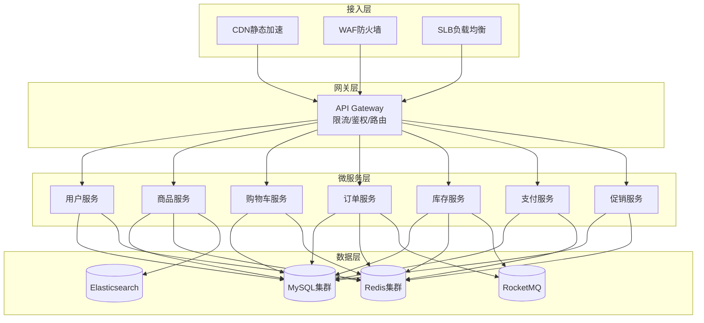
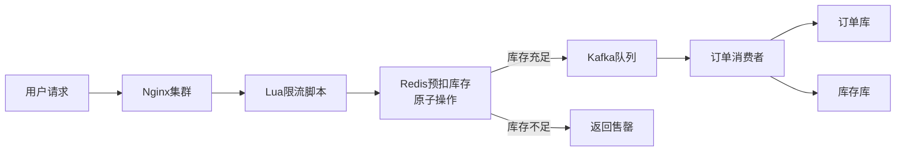

# 电商系统架构案例

## 一、业务背景

电商系统是分布式架构最典型、最复杂的应用场景之一。以某大型电商平台为例，日均活跃用户超过5000万，峰值QPS达到100万，日订单量超过2000万单。核心业务场景包括：商品浏览、购物车、订单创建、支付结算、库存扣减、物流追踪等。

主要挑战：
- **高并发访问**：秒杀活动峰值流量可达平时的100倍以上
- **数据一致性**：库存扣减与订单创建必须保持强一致性
- **服务高可用**：系统可用性要求达到99.99%
- **弹性伸缩**：大促期间需要快速扩容应对流量洪峰

## 二、架构设计

### 2.1 整体架构



### 2.2 秒杀系统架构



## 三、技术选型

| 组件类型 | 技术选型 | 选型理由 |
|---------|---------|---------|
| 服务框架 | Spring Cloud Alibaba | 生态完善，支持Dubbo协议 |
| 网关 | Spring Cloud Gateway | 高性能，支持Reactive编程 |
| 注册中心 | Nacos | 支持服务发现与配置管理 |
| 缓存 | Redis Cluster | 高性能，支持分布式锁 |
| 消息队列 | RocketMQ | 高可靠，支持事务消息 |
| 数据库 | MySQL + ShardingSphere | 成熟稳定，支持分库分表 |
| 搜索引擎 | Elasticsearch | 商品搜索性能优异 |
| 监控 | Prometheus + Grafana | 云原生监控方案 |

## 四、核心流程

### 4.1 秒杀下单流程

```java
@Service
public class SeckillService {
    
    @Autowired
    private StringRedisTemplate redisTemplate;
    
    @Autowired
    private RocketMQTemplate rocketMQTemplate;
    
    /**
     * 秒杀下单核心逻辑
     * 1. 参数校验与防重
     * 2. Redis预扣库存（原子操作）
     * 3. 发送异步下单消息
     * 4. 返回排队中状态
     */
    public SeckillResult doSeckill(Long userId, Long skuId) {
        // 1. 用户限购检查
        String limitKey = "seckill:limit:" + userId + ":" + skuId;
        Boolean hasBought = redisTemplate.opsForValue()
            .setIfAbsent(limitKey, "1", 24, TimeUnit.HOURS);
        if (!hasBought) {
            return SeckillResult.fail("已参与过秒杀");
        }
        
        // 2. Redis预扣库存（Lua脚本保证原子性）
        String stockKey = "seckill:stock:" + skuId;
        Long stock = redisTemplate.execute(
            SECKILL_SCRIPT, 
            Collections.singletonList(stockKey),
            "-1"
        );
        
        if (stock == null || stock < 0) {
            redisTemplate.delete(limitKey); // 回滚限购标记
            return SeckillResult.fail("库存不足");
        }
        
        // 3. 发送异步下单消息
        SeckillMessage message = new SeckillMessage(userId, skuId, stock);
        rocketMQTemplate.asyncSend("seckill-order-topic", message, new SendCallback() {
            @Override
            public void onSuccess(SendResult sendResult) {
                log.info("秒杀消息发送成功: {}", sendResult);
            }
            @Override
            public void onException(Throwable e) {
                log.error("秒杀消息发送失败", e);
                // 消息发送失败，恢复库存
                redisTemplate.opsForValue().increment(stockKey);
            }
        });
        
        return SeckillResult.wait("排队中");
    }
    
    // Lua脚本：原子性扣减库存
    private static final RedisScript<Long> SECKILL_SCRIPT = new DefaultRedisScript<>(
        "local stock = redis.call('get', KEYS[1]);" +
        "if (stock == false or tonumber(stock) <= 0) then return -1; end" +
        "return redis.call('decrby', KEYS[1], ARGV[1]);",
        Long.class
    );
}
```

### 4.2 订单创建流程（Saga事务）

```java
/**
 * 订单创建 Saga 编排器
 * 使用状态机模式管理分布式事务
 */
@Component
public class OrderSagaOrchestrator {
    
    public OrderCreationResult createOrder(CreateOrderRequest request) {
        SagaInstance saga = sagaManager.create("order-creation-saga");
        
        try {
            // Step 1: 创建订单（正向操作）
            Order order = orderService.createOrder(request);
            saga.recordStep("create-order", order.getId());
            
            // Step 2: 扣减库存
            boolean stockResult = stockService.deduct(
                request.getSkuId(), 
                request.getQuantity()
            );
            if (!stockResult) {
                throw new StockInsufficientException("库存不足");
            }
            saga.recordStep("deduct-stock", request.getSkuId());
            
            // Step 3: 使用优惠券
            if (request.getCouponId() != null) {
                couponService.useCoupon(request.getUserId(), request.getCouponId());
                saga.recordStep("use-coupon", request.getCouponId());
            }
            
            // Step 4: 计算运费
            BigDecimal freight = freightService.calculate(request);
            saga.recordStep("calc-freight", freight);
            
            saga.complete();
            return OrderCreationResult.success(order);
            
        } catch (Exception e) {
            // 触发补偿操作
            saga.compensate();
            return OrderCreationResult.fail(e.getMessage());
        }
    }
}
```

### 4.3 库存扣减补偿机制

```java
/**
 * 库存服务补偿操作
 */
@Service
public class StockCompensateService {
    
    @Compensating("deduct-stock")
    public void compensateDeduct(Long skuId, Integer quantity) {
        // 补偿：回滚库存
        stockDao.increase(skuId, quantity);
        log.info("库存扣减补偿完成: skuId={}, quantity={}", skuId, quantity);
    }
    
    /**
     * 基于RocketMQ事务消息的库存扣减
     */
    @RocketMQTransactionListener
    class StockTransactionListener implements RocketMQLocalTransactionListener {
        
        @Override
        public RocketMQLocalTransactionState executeLocalTransaction(Message msg, Object arg) {
            try {
                StockDeductMessage message = JSON.parseObject(msg.getPayload(), StockDeductMessage.class);
                boolean success = stockService.deduct(message.getSkuId(), message.getQuantity());
                return success ? RocketMQLocalTransactionState.COMMIT 
                               : RocketMQLocalTransactionState.ROLLBACK;
            } catch (Exception e) {
                return RocketMQLocalTransactionState.ROLLBACK;
            }
        }
        
        @Override
        public RocketMQLocalTransactionState checkLocalTransaction(Message msg) {
            // 回查本地事务状态
            StockDeductMessage message = JSON.parseObject(msg.getPayload(), StockDeductMessage.class);
            boolean exists = stockRecordDao.exists(message.getTransactionId());
            return exists ? RocketMQLocalTransactionState.COMMIT 
                          : RocketMQLocalTransactionState.ROLLBACK;
        }
    }
}
```

## 五、经验总结

### 5.1 核心设计原则

1. **流量漏斗设计**：从CDN到Nginx到网关到服务，层层限流，保护核心系统
2. **读写分离**：热点数据使用Redis缓存，查询走缓存，写操作异步化
3. **最终一致性**：非核心业务使用消息队列保证最终一致性
4. **柔性事务**：秒杀场景使用TCC或Saga模式，避免长事务阻塞

### 5.2 关键性能优化

| 优化点 | 方案 | 效果 |
|-------|------|------|
| 库存扣减 | Redis原子操作 + 异步落库 | QPS从1000提升至10万 |
| 热点数据 | 本地缓存Caffeine + Redis多级缓存 | 响应时间降低80% |
| 数据库压力 | 分库分表 + 读写分离 | 单库压力降低90% |
| 接口响应 | 异步编排 + 并行查询 | 接口耗时减少60% |

### 5.3 踩坑经验

1. **超卖问题**：必须使用Redis Lua脚本或分布式锁，单纯的`get`+`decr`会导致并发超卖
2. **缓存击穿**：热点商品使用互斥锁或逻辑过期，避免缓存失效瞬间大量请求打到数据库
3. **消息堆积**：秒杀场景Consumer必须支持批量消费和水平扩容
4. **时钟漂移**：分布式事务依赖时间戳时，必须保证各节点时钟同步

---

> **扩展阅读**：
> - [高并发系统设计40问](https://time.geekbang.org/column/intro/100035801)
> - [电商秒杀系统架构实践](https://tech.meituan.com/2019/08/01/seckill-scenario-architecture.html)
