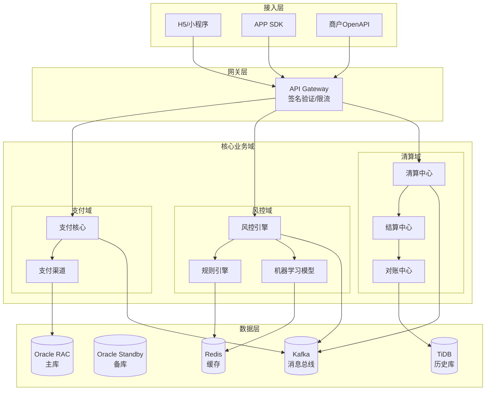
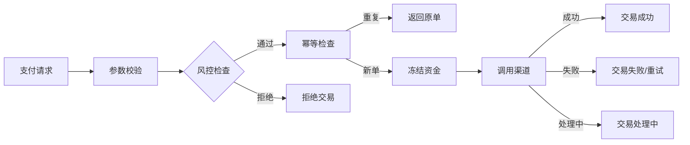
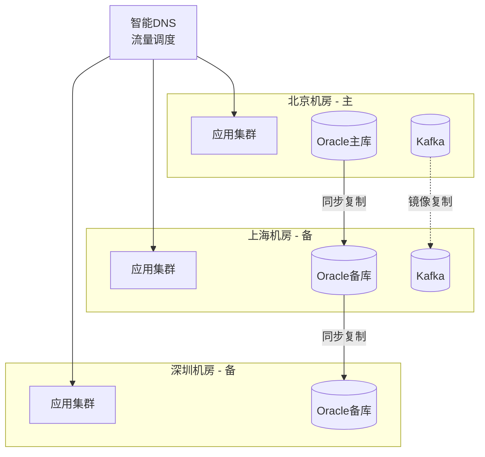

# 金融系统架构案例

## 一、业务背景

金融系统是国家经济命脉的核心基础设施，对系统的**安全性、一致性、可用性**要求极高。以某大型支付平台为例，日均交易笔数超过10亿，交易金额超过1000亿元，系统可用性要求达到99.999%（全年停机不超过5分钟）。

核心业务域：
- **支付域**：快捷支付、扫码支付、代扣代付
- **风控域**：实时反欺诈、信用评估、风险决策
- **清算域**：对账、结算、资金划拨

核心挑战：
- **强一致性要求**：资金操作必须保证ACID特性
- **极低延迟**：支付接口响应时间<100ms
- **监管合规**：满足央行备付金管理、反洗钱等法规要求
- **异地多活**：单机房故障时业务不中断

## 二、架构设计

### 2.1 整体架构



### 2.2 支付核心架构



### 2.3 异地多活架构



## 三、技术选型

| 层级 | 技术选型 | 选型理由 |
|------|---------|---------|
| 核心数据库 | Oracle RAC | 强一致性、金融级可靠性 |
| 分布式缓存 | Redis Cluster + Sentinel | 高可用、自动故障转移 |
| 消息队列 | Apache Kafka | 高吞吐、数据持久化 |
| 服务框架 | Spring Cloud + Dubbo | 成熟稳定、生态丰富 |
| 分布式事务 | Seata AT模式 | 自动补偿、低侵入 |
| 规则引擎 | Drools | 支持复杂风控规则 |
| 流计算 | Flink | 实时风控计算 |
| 监控告警 | Prometheus + Alertmanager | 云原生、自动发现 |

## 四、核心流程

### 4.1 支付交易流程（TCC事务）

```java
/**
 * 支付服务 - TCC模式实现
 * Try-Confirm-Cancel 三段式提交
 */
@Service
public class PaymentService {
    
    @Autowired
    private AccountService accountService;
    
    @Autowired
    private PaymentChannelService channelService;
    
    /**
     * 第一阶段：Try - 资源预留
     * 1. 检查账户余额
     * 2. 冻结支付金额
     * 3. 创建预支付订单
     */
    @Transactional
    public TryResult tryPayment(PaymentRequest request) {
        // 1. 幂等检查
        PaymentOrder existOrder = orderDao.getByIdempotencyKey(
            request.getIdempotencyKey()
        );
        if (existOrder != null) {
            return TryResult.success(existOrder.getTradeNo());
        }
        
        // 2. 检查余额并冻结
        FreezeResult freezeResult = accountService.freeze(
            request.getUserId(),
            request.getAmount()
        );
        if (!freezeResult.isSuccess()) {
            return TryResult.fail("余额不足");
        }
        
        // 3. 创建预支付订单
        PaymentOrder order = PaymentOrder.builder()
            .tradeNo(generateTradeNo())
            .userId(request.getUserId())
            .amount(request.getAmount())
            .status(OrderStatus.TRY)
            .freezeId(freezeResult.getFreezeId())
            .build();
        orderDao.insert(order);
        
        return TryResult.success(order.getTradeNo());
    }
    
    /**
     * 第二阶段：Confirm - 确认执行
     * 1. 调用支付渠道
     * 2. 扣减冻结金额
     * 3. 更新订单状态为成功
     */
    @Transactional
    public ConfirmResult confirmPayment(String tradeNo) {
        PaymentOrder order = orderDao.getByTradeNo(tradeNo);
        if (order.getStatus() != OrderStatus.TRY) {
            return ConfirmResult.fail("订单状态异常");
        }
        
        // 1. 调用支付渠道
        ChannelResult channelResult = channelService.pay(order);
        if (!channelResult.isSuccess()) {
            // 渠道失败，触发Cancel
            throw new PaymentException("渠道调用失败");
        }
        
        // 2. 确认扣减（解冻并扣款）
        accountService.confirmFreeze(order.getFreezeId());
        
        // 3. 更新订单状态
        orderDao.updateStatus(tradeNo, OrderStatus.SUCCESS);
        
        // 4. 发送支付成功消息
        eventPublisher.publish(new PaymentSuccessEvent(order));
        
        return ConfirmResult.success();
    }
    
    /**
     * 第二阶段：Cancel - 取消回滚
     * 1. 解冻金额
     * 2. 更新订单状态为取消
     */
    @Transactional
    public CancelResult cancelPayment(String tradeNo, String reason) {
        PaymentOrder order = orderDao.getByTradeNo(tradeNo);
        if (order.getStatus() == OrderStatus.SUCCESS) {
            return CancelResult.fail("订单已成功，无法取消");
        }
        
        // 1. 解冻金额
        accountService.cancelFreeze(order.getFreezeId());
        
        // 2. 更新订单状态
        orderDao.updateStatus(tradeNo, OrderStatus.CANCELLED);
        
        // 3. 记录取消原因
        orderDao.updateCancelReason(tradeNo, reason);
        
        return CancelResult.success();
    }
}
```

### 4.2 实时风控引擎

```java
/**
 * 实时风控引擎 - 基于Flink CEP
 */
@Component
public class RealtimeRiskEngine {
    
    @Autowired
    private RuleRepository ruleRepository;
    
    /**
     * Flink CEP 复杂事件处理
     * 检测异常交易模式
     */
    public Pattern<Transaction, ?> createFraudPattern() {
        // 模式1：短时间内多笔交易（盗刷检测）
        Pattern<Transaction, ?> highFrequencyPattern = Pattern
            .<Transaction>begin("first")
            .where(evt -> evt.getAmount() > 100)
            .next("second")
            .where(evt -> evt.getAmount() > 100)
            .next("third")
            .where(evt -> evt.getAmount() > 100)
            .within(Time.seconds(60)); // 60秒内3笔交易
        
        // 模式2：异地登录后快速交易
        Pattern<Transaction, ?> locationChangePattern = Pattern
            .<Transaction>begin("login")
            .where(evt -> evt.getEventType() == EventType.LOGIN)
            .next("transaction")
            .where(evt -> evt.getEventType() == EventType.PAYMENT)
            .where(new SimpleCondition<Transaction>() {
                @Override
                public boolean filter(Transaction txn) {
                    // 检查地理位置变化
                    return txn.isLocationChanged();
                }
            })
            .within(Time.minutes(5));
        
        return highFrequencyPattern;
    }
    
    /**
     * 规则引擎执行
     */
    public RiskResult evaluateRisk(Transaction transaction) {
        KieSession kieSession = kieContainer.newKieSession();
        
        // 插入事实
        kieSession.insert(transaction);
        kieSession.insert(new UserProfile(transaction.getUserId()));
        kieSession.insert(new DeviceInfo(transaction.getDeviceId()));
        
        // 执行规则
        int firedRules = kieSession.fireAllRules();
        
        // 获取结果
        RiskResult result = new RiskResult();
        kieSession.setGlobal("result", result);
        kieSession.dispose();
        
        return result;
    }
}

/**
 * Drools 风控规则示例
 */
// risk_rules.drl
rule "High Amount Transaction"
    when
        $txn : Transaction(amount > 50000)
    then
        $txn.addRiskTag("HIGH_AMOUNT");
        $txn.addRiskScore(30);
end

rule "New Device Transaction"
    when
        $txn : Transaction(deviceTrustScore < 30)
    then
        $txn.addRiskTag("NEW_DEVICE");
        $txn.addRiskScore(40);
        $txn.requireVerification(true);
end

rule "Night Transaction"
    when
        $txn : Transaction(hour >= 1 && hour <= 5)
    then
        $txn.addRiskTag("NIGHT_TXN");
        $txn.addRiskScore(20);
end
```

### 4.3 对账与结算系统

```java
/**
 * 对账服务 - 日终批处理
 */
@Service
public class ReconciliationService {
    
    /**
     * 三方对账流程
     * 1. 下载渠道对账单
     * 2. 解析对账单
     * 3. 与内部订单匹配
     * 4. 生成差异报告
     */
    @Scheduled(cron = "0 30 2 * * ?") // 每日凌晨2:30执行
    public void dailyReconciliation() {
        LocalDate billDate = LocalDate.now().minusDays(1);
        
        // 获取所有渠道
        List<PaymentChannel> channels = channelService.getAllChannels();
        
        for (PaymentChannel channel : channels) {
            try {
                reconcileChannel(channel, billDate);
            } catch (Exception e) {
                log.error("渠道对账失败: channel={}, date={}", 
                    channel.getCode(), billDate, e);
                alertService.sendAlert("对账失败", channel.getCode());
            }
        }
    }
    
    private void reconcileChannel(PaymentChannel channel, LocalDate date) {
        // 1. 下载对账单
        ChannelBill channelBill = channel.downloadBill(date);
        
        // 2. 获取内部订单
        List<PaymentOrder> internalOrders = orderDao
            .getByChannelAndDate(channel.getCode(), date);
        
        // 3. 使用MapReduce进行匹配
        Map<String, PaymentOrder> orderMap = internalOrders.stream()
            .collect(Collectors.toMap(PaymentOrder::getChannelOrderNo, o -> o));
        
        List<ReconcileDiff> differences = new ArrayList<>();
        
        // 检查渠道有、内部无的差异
        for (ChannelBillItem item : channelBill.getItems()) {
            PaymentOrder order = orderMap.get(item.getOrderNo());
            if (order == null) {
                differences.add(ReconcileDiff.builder()
                    .type(DiffType.CHANNEL_HAS_INTERNAL_NOT)
                    .channelOrderNo(item.getOrderNo())
                    .channelAmount(item.getAmount())
                    .build());
            } else if (!order.getAmount().equals(item.getAmount())) {
                differences.add(ReconcileDiff.builder()
                    .type(DiffType.AMOUNT_MISMATCH)
                    .channelOrderNo(item.getOrderNo())
                    .channelAmount(item.getAmount())
                    .internalAmount(order.getAmount())
                    .build());
            }
        }
        
        // 4. 保存对账结果
        ReconcileResult result = ReconcileResult.builder()
            .channelCode(channel.getCode())
            .billDate(date)
            .channelCount(channelBill.getItems().size())
            .internalCount(internalOrders.size())
            .diffCount(differences.size())
            .differences(differences)
            .build();
        
        reconcileResultDao.save(result);
        
        // 5. 差异处理
        if (!differences.isEmpty()) {
            diffHandler.handleDifferences(differences);
        }
    }
}
```

## 五、经验总结

### 5.1 金融系统核心原则

| 原则 | 说明 | 实践 |
|------|------|------|
| **资金安全** | 一分钱不能差 | 多重对账、异常监控 |
| **幂等设计** | 同一请求多次执行结果一致 | 全局唯一流水号 |
| **最终一致性** | 允许短暂不一致，必须最终一致 | 消息队列+补偿机制 |
| **熔断降级** | 故障时保护核心功能 | Hystrix熔断策略 |

### 5.2 关键技术决策

1. **数据库选型**：核心账务使用Oracle RAC保证强一致；历史数据使用TiDB水平扩展
2. **事务策略**：支付核心使用TCC模式；非核心场景使用Saga模式
3. **高可用设计**：三地五中心部署，RPO=0，RTO<30秒
4. **监控体系**：业务监控+系统监控+资金监控三位一体

### 5.3 监管合规要点

- **备付金管理**：客户资金100%集中存管
- **反洗钱**：大额交易实时上报，可疑交易识别率>95%
- **数据安全**：敏感字段加密存储，操作日志留痕6年
- **等保要求**：系统通过等保三级认证

---

> **扩展阅读**：
> - [支付宝技术架构演进](https://tech.antfin.com/)
> - [分布式事务实践](https://seata.io/zh-cn/docs/overview/what-is-seata.html)
