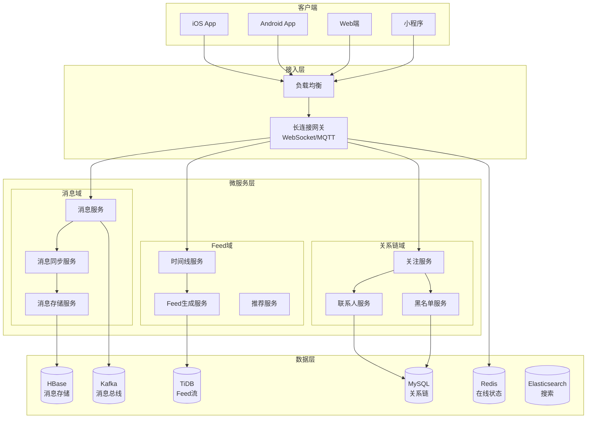
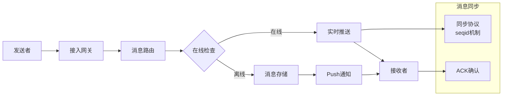
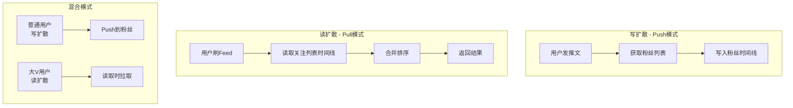

# 社交系统架构案例

## 一、业务背景

社交系统是典型的**读多写多**场景，以某头部社交平台为例，日活跃用户超过2亿，日均消息发送量超过500亿条，Feed流日均刷新次数超过1000亿次。

核心业务场景：
- **即时消息**：单聊、群聊、消息已读、撤回
- **Feed流**：关注流、推荐流、时间线
- **关系链**：关注/粉丝、好友关系、黑名单

技术挑战：
- **消息实时性**：端到端延迟<100ms
- **海量关系链**：大V粉丝数千万，扩散计算复杂
- **冷热数据分离**：历史消息冷存储成本优化
- **多端同步**：消息在多设备间实时同步

## 二、架构设计

### 2.1 整体架构



### 2.2 消息系统架构



### 2.3 Feed流架构



## 三、技术选型

| 组件 | 技术选型 | 选型理由 |
|------|---------|---------|
| 长连接 | Netty + WebSocket | 高性能NIO框架 |
| 消息存储 | HBase + SSD | 高吞吐随机写 |
| 关系链 | TiDB | 支持海量数据水平扩展 |
| 缓存 | Redis Cluster | 在线状态、未读数实时 |
| 消息队列 | Kafka | 高吞吐消息分发 |
| 协议 | Protobuf | 高效序列化，省流量 |
| 推送 | 自建推送网关 | 控制到达率 |

## 四、核心流程

### 4.1 消息收发流程

```java
/**
 * 消息服务核心实现
 */
@Service
public class MessageService {
    
    @Autowired
    private MessageStorage messageStorage;
    
    @Autowired
    private UserSessionManager sessionManager;
    
    @Autowired
    private KafkaTemplate<String, MessageEvent> kafkaTemplate;
    
    /**
     * 发送消息
     */
    public SendResult sendMessage(Message message) {
        // 1. 生成全局唯一消息ID
        String msgId = generateMsgId(message.getSenderId());
        message.setMsgId(msgId);
        message.setSeqId(generateSeqId(message.getConversationId()));
        message.setTimestamp(System.currentTimeMillis());
        
        // 2. 消息存储（异步）
        CompletableFuture<Void> storeFuture = CompletableFuture.runAsync(() -> {
            messageStorage.store(message);
        });
        
        // 3. 更新会话信息
        updateConversation(message);
        
        // 4. 检查接收者在线状态
        List<UserSession> sessions = sessionManager.getSessions(message.getReceiverId());
        
        if (!sessions.isEmpty()) {
            // 4.1 在线推送
            for (UserSession session : sessions) {
                pushToSession(session, message);
            }
        } else {
            // 4.2 离线处理：增加未读数，发送Push通知
            incrementUnreadCount(message.getReceiverId(), message.getConversationId());
            sendPushNotification(message);
        }
        
        // 5. 发送消息事件（用于离线分析、消息同步等）
        kafkaTemplate.send("message-events", new MessageEvent(message));
        
        // 6. 等待存储完成
        try {
            storeFuture.get(100, TimeUnit.MILLISECONDS);
        } catch (Exception e) {
            log.warn("消息存储延迟: msgId={}", msgId);
        }
        
        return SendResult.success(msgId, message.getSeqId());
    }
    
    /**
     * 消息同步 - 基于SeqId的增量同步
     */
    public SyncResult syncMessages(Long userId, Long lastSeqId, int limit) {
        // 1. 获取用户的所有会话
        List<Conversation> conversations = getUserConversations(userId);
        
        // 2. 拉取每个会话的新消息
        List<Message> messages = new ArrayList<>();
        for (Conversation conv : conversations) {
            List<Message> convMessages = messageStorage.getMessages(
                conv.getConversationId(),
                conv.getLastReadSeqId(),
                limit
            );
            messages.addAll(convMessages);
        }
        
        // 3. 按SeqId排序
        messages.sort(Comparator.comparing(Message::getSeqId));
        
        // 4. 截取limit条
        if (messages.size() > limit) {
            messages = messages.subList(0, limit);
        }
        
        // 5. 获取最新的SeqId
        long newLastSeqId = messages.isEmpty() ? lastSeqId : 
            messages.get(messages.size() - 1).getSeqId();
        
        return SyncResult.builder()
            .messages(messages)
            .lastSeqId(newLastSeqId)
            .hasMore(messages.size() == limit)
            .build();
    }
    
    /**
     * 消息撤回
     */
    public RecallResult recallMessage(Long userId, String msgId) {
        Message message = messageStorage.getById(msgId);
        
        // 1. 权限检查
        if (!message.getSenderId().equals(userId)) {
            return RecallResult.fail("无权撤回他人消息");
        }
        
        // 2. 时间检查（2分钟内可撤回）
        if (System.currentTimeMillis() - message.getTimestamp() > 120000) {
            return RecallResult.fail("超过撤回时间限制");
        }
        
        // 3. 标记撤回
        messageStorage.markRecalled(msgId);
        
        // 4. 推送撤回指令
        RecallCommand command = new RecallCommand(msgId, message.getConversationId());
        List<UserSession> sessions = sessionManager.getSessions(message.getReceiverId());
        for (UserSession session : sessions) {
            session.sendCommand(command);
        }
        
        return RecallResult.success();
    }
}
```

### 4.2 Feed流生成与读取

```java
/**
 * Feed流服务 - 推拉结合模式
 */
@Service
public class FeedService {
    
    @Autowired
    private FollowService followService;
    
    @Autowired
    private TimelineStorage timelineStorage;
    
    @Autowired
    private PostService postService;
    
    // 大V阈值：粉丝数超过此值使用读扩散
    private static final int BIG_V_THRESHOLD = 100000;
    
    /**
     * 发推文 - 写扩散逻辑
     */
    public PostResult post(Post post) {
        // 1. 保存推文
        postService.save(post);
        
        // 2. 获取粉丝列表
        List<Long> followers = followService.getFollowers(post.getUserId());
        
        // 3. 判断是否为"大V"
        if (followers.size() < BIG_V_THRESHOLD) {
            // 普通用户：写扩散（Push模式）
            TimelineItem item = TimelineItem.fromPost(post);
            for (Long followerId : followers) {
                timelineStorage.push(followerId, item);
            }
        }
        // 大V：不推送到粉丝时间线，读取时再拉取
        
        return PostResult.success(post.getId());
    }
    
    /**
     * 获取Feed流 - 推拉结合
     */
    public FeedResult getFeed(Long userId, Long lastId, int limit) {
        // 1. 获取关注列表
        List<Follow> followings = followService.getFollowings(userId);
        
        // 2. 分离普通用户和大V
        List<Long> normalUsers = new ArrayList<>();
        List<Long> bigVs = new ArrayList<>();
        
        for (Follow follow : followings) {
            if (follow.getFollowerCount() < BIG_V_THRESHOLD) {
                normalUsers.add(follow.getTargetId());
            } else {
                bigVs.add(follow.getTargetId());
            }
        }
        
        // 3. 从自己的时间线获取普通用户的推文（Push）
        List<TimelineItem> timelineItems = timelineStorage.pull(
            userId, lastId, limit
        );
        
        // 4. 实时拉取大V的推文（Pull）
        List<Post> bigVPosts = postService.getRecentPosts(bigVs, limit);
        
        // 5. 合并并排序
        List<FeedItem> feedItems = mergeAndSort(timelineItems, bigVPosts);
        
        // 6. 截断并返回
        if (feedItems.size() > limit) {
            feedItems = feedItems.subList(0, limit);
        }
        
        return FeedResult.builder()
            .items(feedItems)
            .lastId(feedItems.isEmpty() ? lastId : 
                feedItems.get(feedItems.size() - 1).getId())
            .hasMore(feedItems.size() == limit)
            .build();
    }
    
    /**
     * 时间线合并排序
     */
    private List<FeedItem> mergeAndSort(
        List<TimelineItem> timelineItems, 
        List<Post> bigVPosts
    ) {
        List<FeedItem> result = new ArrayList<>();
        
        // 转换时间线项
        for (TimelineItem item : timelineItems) {
            result.add(FeedItem.fromTimeline(item));
        }
        
        // 转换大V推文
        for (Post post : bigVPosts) {
            result.add(FeedItem.fromPost(post));
        }
        
        // 按时间倒序排序
        result.sort((a, b) -> Long.compare(b.getTimestamp(), a.getTimestamp()));
        
        return result;
    }
}
```

### 4.3 关系链存储与查询

```java
/**
 * 关系链服务 - 基于图数据库的优化存储
 */
@Service
public class FollowService {
    
    @Autowired
    private FollowRepository followRepository;
    
    @Autowired
    private RedisTemplate<String, Long> redisTemplate;
    
    @Autowired
    private KafkaTemplate<String, FollowEvent> kafkaTemplate;
    
    /**
     * 关注用户
     */
    @Transactional
    public FollowResult follow(Long userId, Long targetId) {
        // 1. 检查是否已关注
        if (followRepository.exists(userId, targetId)) {
            return FollowResult.fail("已关注该用户");
        }
        
        // 2. 检查黑名单
        if (isBlocked(targetId, userId)) {
            return FollowResult.fail("无法关注该用户");
        }
        
        // 3. 创建关注关系
        Follow follow = Follow.builder()
            .userId(userId)
            .targetId(targetId)
            .createdAt(System.currentTimeMillis())
            .build();
        
        followRepository.save(follow);
        
        // 4. 更新缓存
        String followingKey = "following:" + userId;
        String followerKey = "followers:" + targetId;
        
        redisTemplate.opsForZSet().add(followingKey, targetId, 
            System.currentTimeMillis());
        redisTemplate.opsForZSet().add(followerKey, userId, 
            System.currentTimeMillis());
        
        // 5. 更新计数
        redisTemplate.opsForHash().increment("user:stats", 
            userId + ":following", 1);
        redisTemplate.opsForHash().increment("user:stats", 
            targetId + ":followers", 1);
        
        // 6. 发送关注事件
        kafkaTemplate.send("follow-events", new FollowEvent(userId, targetId));
        
        return FollowResult.success();
    }
    
    /**
     * 获取粉丝列表 - 分页查询
     */
    public List<Long> getFollowers(Long userId, Long cursor, int limit) {
        String key = "followers:" + userId;
        
        // 1. 尝试从缓存获取
        Set<Long> followers = redisTemplate.opsForZSet()
            .reverseRangeByScore(key, 0, cursor == null ? 
                Double.MAX_VALUE : cursor, 0, limit);
        
        if (followers != null && followers.size() == limit) {
            return new ArrayList<>(followers);
        }
        
        // 2. 缓存未命中，从数据库查询
        List<Follow> dbFollowers = followRepository.findFollowers(
            userId, cursor, limit);
        
        // 3. 回填缓存
        for (Follow follow : dbFollowers) {
            redisTemplate.opsForZSet().add(key, follow.getUserId(),
                follow.getCreatedAt());
        }
        
        return dbFollowers.stream()
            .map(Follow::getUserId)
            .collect(Collectors.toList());
    }
    
    /**
     * 获取共同关注
     */
    public List<Long> getCommonFollowings(Long userId1, Long userId2, int limit) {
        String key1 = "following:" + userId1;
        String key2 = "following:" + userId2;
        
        // 使用Redis ZSet交集计算共同关注
        String tempKey = "common:temp:" + UUID.randomUUID();
        redisTemplate.opsForZSet().intersectAndStore(key1, key2, tempKey);
        
        Set<Long> common = redisTemplate.opsForZSet()
            .reverseRange(tempKey, 0, limit - 1);
        
        redisTemplate.delete(tempKey);
        
        return new ArrayList<>(common);
    }
}
```

## 五、经验总结

### 5.1 核心设计经验

| 场景 | 方案 | 效果 |
|------|------|------|
| 消息存储 | HBase按时间分片 | 单机存储10TB+ |
| 在线状态 | Redis bitmap | 内存占用降低90% |
| Feed流 | 推拉结合 | 大V发推文响应<50ms |
| 消息同步 | SeqId机制 | 多端同步一致性 |

### 5.2 性能优化策略

1. **消息存储优化**：
   - 热数据（7天内）存SSD，冷数据存SAS
   - 消息按会话ID哈希分片

2. **Feed流优化**：
   - 普通用户写扩散，大V读扩散
   - 预加载用户下次刷新内容

3. **关系链优化**：
   - Redis ZSet存储关系链，支持分页
   - 异步更新数据库，保证最终一致

### 5.3 常见问题与解决方案

| 问题 | 原因 | 解决方案 |
|------|------|---------|
| 消息丢失 | 网络抖动 | 客户端ACK机制+服务端重试 |
| 消息乱序 | 并发发送 | 全局SeqId保证顺序 |
| 未读数不准确 | 并发更新 | Redis原子操作+定时校准 |
| 大V发推文慢 | 粉丝太多 | 读写分离的推拉结合模式 |

---

> **扩展阅读**：
> - [微信消息系统架构](https://www.infoq.cn/article/weixin-architecture)
> - [微博Feed流架构演进](https://www.weibo.com/)
