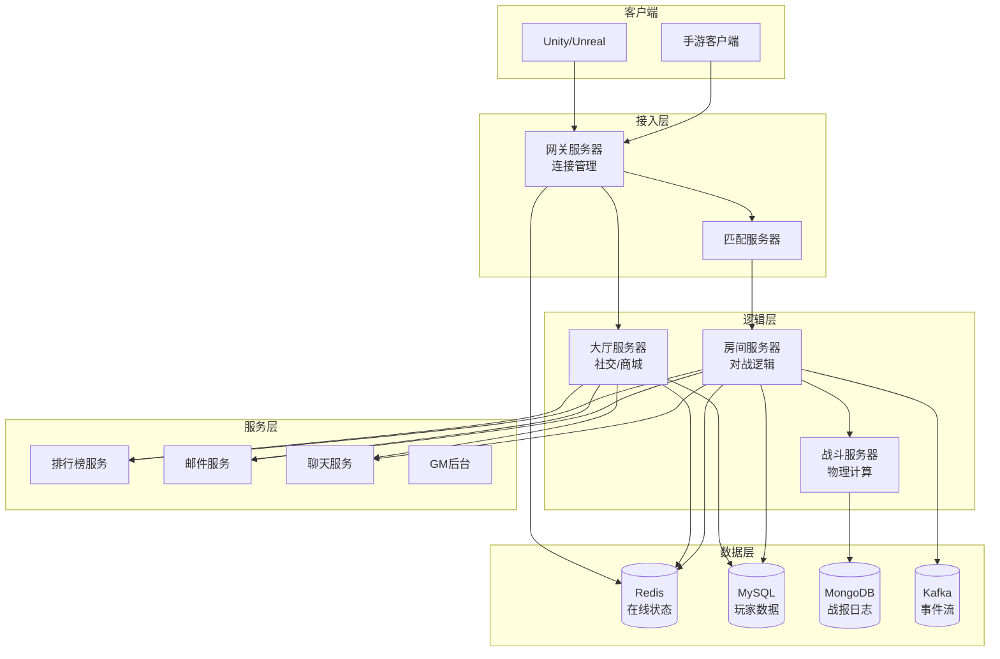
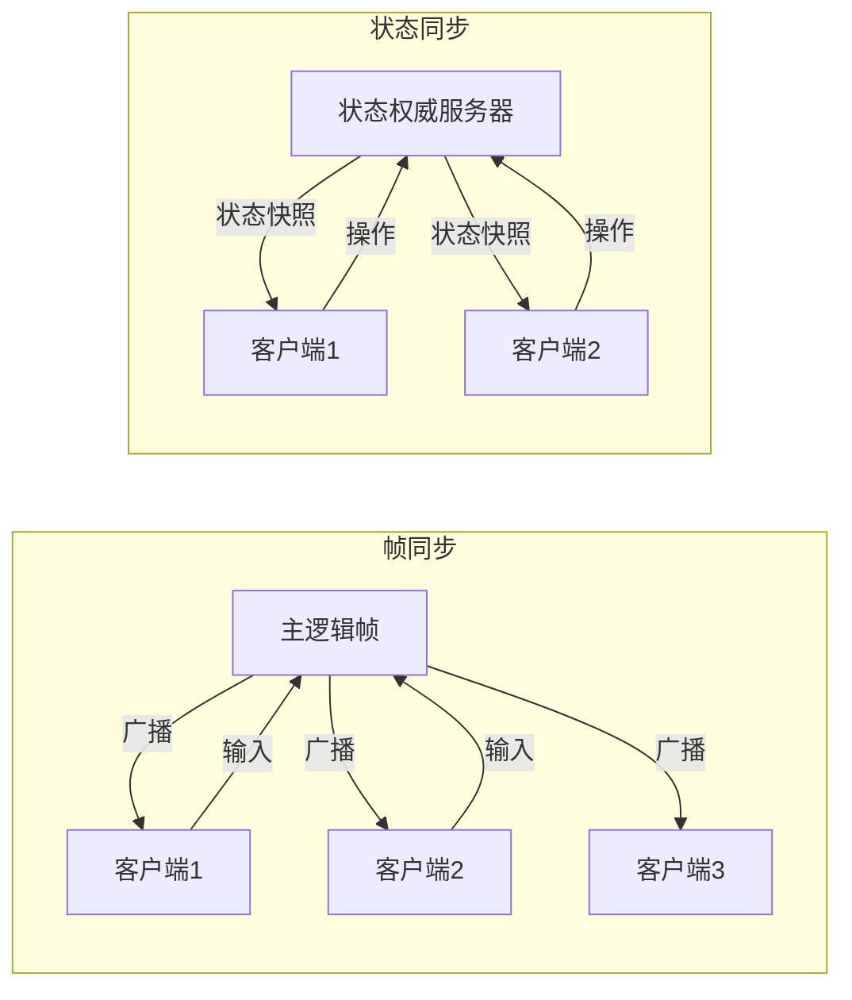
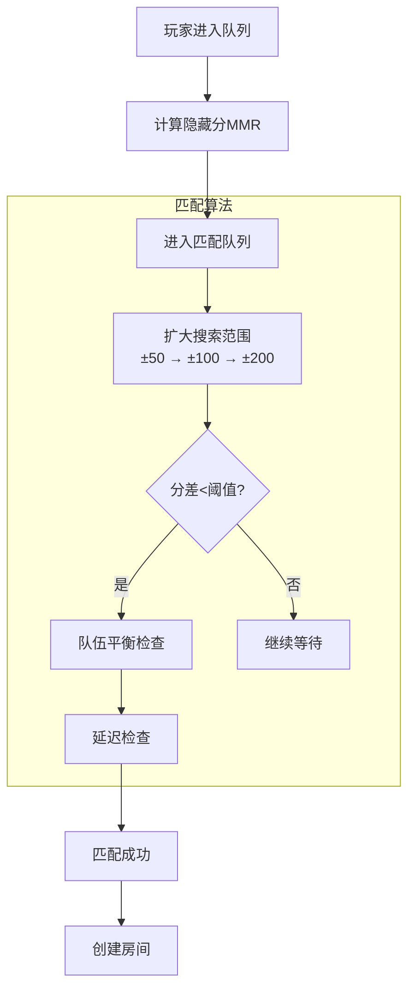

# 游戏系统架构案例

## 一、业务背景

游戏系统是分布式系统中**实时性要求最高**的场景之一。以某大型多人在线游戏为例，单服同时在线玩家超过1万人，全球同服架构下需要支持跨地域低延迟交互。

核心场景：

- **实时对战**：MOBA、FPS等竞技游戏，要求延迟<50ms
- **匹配系统**：基于技能等级(ELO)的智能匹配
- **状态同步**：玩家位置、技能释放等实时同步
- **排行榜**：全球/好友排行榜实时更新

技术挑战：

- **极低延迟**：帧率60fps下，每帧处理时间<16ms
- **状态一致性**：所有客户端看到一致的游戏世界
- **反作弊**：服务端权威验证，防止外挂
- **断线重连**：网络抖动时无缝恢复

## 二、架构设计

### 2.1 整体架构



### 2.2 战斗服务器架构



### 2.3 匹配系统架构



## 三、技术选型

| 组件 | 技术选型 | 选型理由 |
|------|---------|---------|
| 网络协议 | UDP + KCP | 低延迟，比TCP快30% |
| 通信框架 | Netty | 高性能NIO |
| 序列化 | Protobuf | 高效、跨语言 |
| 物理引擎 | Box2D/PhysX | 服务端权威计算 |
| 数据库 | MySQL + TiDB | 玩家数据+海量日志 |
| 缓存 | Redis Cluster | 在线状态、排行榜 |
| 消息队列 | Kafka | 事件流处理 |

## 四、核心流程

### 4.1 帧同步实现

```java
/**
 * 帧同步管理器 - 确定性回放
 */
@Component
public class FrameSyncManager {

    // 帧率：每秒20帧，每帧50ms
    private static final int FRAME_RATE = 20;
    private static final int FRAME_INTERVAL_MS = 1000 / FRAME_RATE;

    // 帧缓冲区
    private Map<Integer, GameFrame> frameBuffer = new ConcurrentHashMap<>();

    // 当前逻辑帧号
    private AtomicInteger currentFrame = new AtomicInteger(0);

    // 玩家输入队列
    private Map<Long, BlockingQueue<PlayerInput>> inputQueues = new ConcurrentHashMap<>();

    /**
     * 开始帧同步循环
     */
    public void startSyncLoop(Room room) {
        ScheduledExecutorService executor = Executors.newSingleThreadScheduledExecutor();

        executor.scheduleAtFixedRate(() -> {
            try {
                int frameId = currentFrame.incrementAndGet();

                // 1. 收集所有玩家输入
                Map<Long, PlayerInput> inputs = collectInputs(frameId);

                // 2. 创建游戏帧
                GameFrame frame = GameFrame.builder()
                    .frameId(frameId)
                    .timestamp(System.currentTimeMillis())
                    .inputs(inputs)
                    .build();

                // 3. 存储帧（用于断线重连回放）
                frameBuffer.put(frameId, frame);

                // 4. 广播给所有客户端
                broadcastFrame(room, frame);

                // 5. 清理过期帧（保留最近10秒）
                cleanupOldFrames(frameId);

            } catch (Exception e) {
                log.error("帧同步处理异常", e);
            }
        }, 0, FRAME_INTERVAL_MS, TimeUnit.MILLISECONDS);
    }

    /**
     * 收集玩家输入
     */
    private Map<Long, PlayerInput> collectInputs(int frameId) {
        Map<Long, PlayerInput> inputs = new HashMap<>();

        for (Map.Entry<Long, BlockingQueue<PlayerInput>> entry : inputQueues.entrySet()) {
            Long playerId = entry.getKey();
            BlockingQueue<PlayerInput> queue = entry.getValue();

            // 非阻塞获取该玩家输入
            PlayerInput input = queue.poll();
            if (input != null) {
                inputs.put(playerId, input);
            } else {
                // 没有输入则使用上一帧的输入（或空输入）
                inputs.put(playerId, PlayerInput.empty(playerId));
            }
        }

        return inputs;
    }

    /**
     * 广播游戏帧
     */
    private void broadcastFrame(Room room, GameFrame frame) {
        FrameBroadcastMsg msg = FrameBroadcastMsg.builder()
            .frameId(frame.getFrameId())
            .inputs(frame.getInputs())
            .timestamp(frame.getTimestamp())
            .build();

        // UDP广播
        for (Player player : room.getPlayers()) {
            udpServer.send(player.getSessionId(), msg);
        }
    }

    /**
     * 断线重连 - 发送缺失的帧
     */
    public void handleReconnect(Player player, int lastFrameId) {
        int current = currentFrame.get();

        // 发送从lastFrameId到current的所有帧
        for (int i = lastFrameId + 1; i <= current; i++) {
            GameFrame frame = frameBuffer.get(i);
            if (frame != null) {
                sendFrameToPlayer(player, frame);
            }
        }
    }
}
```

### 4.2 状态同步与预测

```java
/**
 * 状态同步服务 - 服务端权威
 */
@Service
public class StateSyncService {

    @Autowired
    private PhysicsEngine physicsEngine;

    // 服务端权威状态
    private WorldState serverAuthoritativeState;

    // 玩家最后确认状态
    private Map<Long, Integer> lastConfirmedSeq = new ConcurrentHashMap<>();

    /**
     * 处理客户端输入
     */
    public void handleClientInput(Long playerId, ClientInput input) {
        // 1. 校验输入合法性
        if (!validateInput(input)) {
            log.warn("非法输入: playerId={}, input={}", playerId, input);
            return;
        }

        // 2. 应用输入到服务端状态
        applyInput(serverAuthoritativeState, playerId, input);

        // 3. 物理模拟
        physicsEngine.step(serverAuthoritativeState);

        // 4. 记录确认号
        lastConfirmedSeq.put(playerId, input.getSequenceNumber());
    }

    /**
     * 广播状态快照
     */
    @Scheduled(fixedRate = 50) // 20fps
    public void broadcastStateSnapshot() {
        // 1. 序列化状态（只发送变化的部分）
        StateDelta delta = calculateStateDelta();

        // 2. 压缩
        byte[] compressed = compress(delta);

        // 3. 广播
        StateSnapshotMsg msg = StateSnapshotMsg.builder()
            .sequenceNumber(generateSequenceNumber())
            .timestamp(System.currentTimeMillis())
            .compressedState(compressed)
            .confirmedSeqs(new HashMap<>(lastConfirmedSeq))
            .build();

        broadcast(msg);
    }

    /**
     * 客户端预测校验
     */
    public void reconcileClientState(Long playerId, ClientState clientState) {
        // 获取服务端对应状态
        EntityState serverState = serverAuthoritativeState.getEntity(clientState.getEntityId());

        // 计算差异
        float positionDiff = serverState.getPosition().distanceTo(clientState.getPosition());

        // 差异过大则纠正
        if (positionDiff > 0.5f) {
            sendCorrection(playerId, serverState);
        }
    }

    /**
     * 发送状态纠正
     */
    private void sendCorrection(Long playerId, EntityState correctState) {
        CorrectionMsg correction = CorrectionMsg.builder()
            .entityId(correctState.getId())
            .position(correctState.getPosition())
            .velocity(correctState.getVelocity())
            .timestamp(System.currentTimeMillis())
            .build();

        sendToPlayer(playerId, correction);
    }
}

/**
 * 客户端预测补偿
 */
public class ClientPrediction {

    // 客户端本地状态
    private WorldState predictedState;

    // 待确认的输入队列
    private List<ClientInput> pendingInputs = new ArrayList<>();

    /**
     * 本地预测
     */
    public void predictInput(ClientInput input) {
        // 1. 保存输入
        pendingInputs.add(input);

        // 2. 应用到本地状态
        applyInput(predictedState, input);

        // 3. 渲染
        render(predictedState);
    }

    /**
     * 收到服务端纠正
     */
    public void onServerCorrection(StateSnapshot snapshot) {
        // 1. 回滚到服务端状态
        predictedState = snapshot.getState();

        // 2. 重放所有未确认的输入
        int lastConfirmed = snapshot.getConfirmedSeqs().get(playerId);
        for (ClientInput input : pendingInputs) {
            if (input.getSequenceNumber() > lastConfirmed) {
                applyInput(predictedState, input);
            }
        }

        // 3. 清理已确认输入
        pendingInputs.removeIf(i -> i.getSequenceNumber() <= lastConfirmed);
    }
}
```

### 4.3 智能匹配系统

```java
/**
 * 智能匹配服务 - 基于ELO算法
 */
@Service
public class MatchmakingService {

    @Autowired
    private RedisTemplate<String, String> redisTemplate;

    @Autowired
    private PlayerRatingService ratingService;

    // 匹配队列
    private static final String MATCH_QUEUE_KEY = "match:queue";

    // 匹配参数
    private static final int INITIAL_RANGE = 50;
    private static final int MAX_RANGE = 400;
    private static final int RANGE_INCREMENT = 25;
    private static final int MAX_WAIT_TIME = 60000; // 60秒

    /**
     * 玩家加入匹配队列
     */
    public void joinQueue(Long playerId, GameMode mode) {
        // 1. 获取玩家MMR
        int mmr = ratingService.getPlayerMMR(playerId, mode);

        // 2. 创建匹配请求
        MatchRequest request = MatchRequest.builder()
            .playerId(playerId)
            .mmr(mmr)
            .mode(mode)
            .joinTime(System.currentTimeMillis())
            .searchRange(INITIAL_RANGE)
            .latencyRegions(getPlayerLatencyRegions(playerId))
            .build();

        // 3. 加入队列
        redisTemplate.opsForZSet().add(
            getQueueKey(mode),
            JSON.toJSONString(request),
            mmr
        );

        // 4. 触发匹配尝试
        tryMatch(mode);
    }

    /**
     * 匹配算法
     */
    @Scheduled(fixedRate = 1000) // 每秒执行
    public void tryMatch(GameMode mode) {
        String queueKey = getQueueKey(mode);

        // 1. 获取队列中所有玩家
        Set<String> requests = redisTemplate.opsForZSet()
            .range(queueKey, 0, -1);

        if (requests == null || requests.size() < mode.getTeamSize() * 2) {
            return; // 玩家不足
        }

        List<MatchRequest> playerList = requests.stream()
            .map(r -> JSON.parseObject(r, MatchRequest.class))
            .sorted(Comparator.comparing(MatchRequest::getJoinTime))
            .collect(Collectors.toList());

        // 2. 尝试匹配
        Set<Long> matchedPlayers = new HashSet<>();

        for (MatchRequest p1 : playerList) {
            if (matchedPlayers.contains(p1.getPlayerId())) continue;

            // 扩大搜索范围
            long waitTime = System.currentTimeMillis() - p1.getJoinTime();
            int searchRange = Math.min(
                INITIAL_RANGE + (int)(waitTime / 5000) * RANGE_INCREMENT,
                MAX_RANGE
            );

            // 查找匹配玩家
            List<MatchRequest> candidates = findCandidates(
                playerList, p1, searchRange, mode.getTeamSize() - 1
            );

            if (candidates.size() >= mode.getTeamSize() * 2 - 1) {
                // 匹配成功，创建房间
                List<MatchRequest> team1 = new ArrayList<>();
                List<MatchRequest> team2 = new ArrayList<>();

                team1.add(p1);
                team1.addAll(candidates.subList(0, mode.getTeamSize() - 1));
                team2.addAll(candidates.subList(mode.getTeamSize() - 1,
                    mode.getTeamSize() * 2 - 1));

                createMatchRoom(team1, team2, mode);

                // 标记已匹配
                matchedPlayers.add(p1.getPlayerId());
                team1.forEach(p -> matchedPlayers.add(p.getPlayerId()));
                team2.forEach(p -> matchedPlayers.add(p.getPlayerId()));
            }
        }

        // 3. 移除已匹配玩家
        for (Long playerId : matchedPlayers) {
            redisTemplate.opsForZSet().remove(queueKey,
                getRequestByPlayerId(playerList, playerId));
        }
    }

    /**
     * 查找候选玩家
     */
    private List<MatchRequest> findCandidates(
        List<MatchRequest> allPlayers,
        MatchRequest target,
        int range,
        int count
    ) {
        return allPlayers.stream()
            .filter(p -> !p.getPlayerId().equals(target.getPlayerId()))
            .filter(p -> Math.abs(p.getMmr() - target.getMmr()) <= range)
            .filter(p -> hasCommonRegion(p.getLatencyRegions(),
                target.getLatencyRegions()))
            .limit(count)
            .collect(Collectors.toList());
    }

    /**
     * ELO评分更新
     */
    public void updateRatings(MatchResult result) {
        List<Long> winners = result.getWinners();
        List<Long> losers = result.getLosers();

        // 计算平均MMR
        int winnerAvgMMR = winners.stream()
            .mapToInt(ratingService::getMMR)
            .sum() / winners.size();
        int loserAvgMMR = losers.stream()
            .mapToInt(ratingService::getMMR)
            .sum() / losers.size();

        // 计算预期胜率
        double winnerExpected = 1.0 / (1.0 + Math.pow(10,
            (loserAvgMMR - winnerAvgMMR) / 400.0));
        double loserExpected = 1.0 - winnerExpected;

        // K因子
        int K = 32;

        // 更新胜者
        for (Long playerId : winners) {
            int currentMMR = ratingService.getMMR(playerId);
            int newMMR = (int)(currentMMR + K * (1 - winnerExpected));
            ratingService.updateMMR(playerId, newMMR);
        }

        // 更新败者
        for (Long playerId : losers) {
            int currentMMR = ratingService.getMMR(playerId);
            int newMMR = (int)(currentMMR + K * (0 - loserExpected));
            ratingService.updateMMR(playerId, newMMR);
        }
    }
}
```

## 五、经验总结

### 5.1 同步方案对比

| 方案 | 优点 | 缺点 | 适用场景 |
|------|------|------|---------|
| 帧同步 | 流量小，确定性回放 | 延迟敏感，反作弊难 | MOBA、RTS |
| 状态同步 | 反作弊强，容错好 | 流量大，计算量大 | FPS、MMO |
| 混合同步 | 兼顾两者优点 | 实现复杂 | 开放世界 |

### 5.2 延迟优化策略

| 技术 | 效果 | 实现 |
|------|------|------|
| UDP + KCP | 延迟降低30% | 可靠UDP协议 |
| 客户端预测 | 消除输入延迟 | 本地先行计算 |
| 服务端回滚 | 减少纠正频率 | 延迟补偿 |
| 区域部署 | 物理延迟<50ms | 全球多地域 |

### 5.3 反作弊措施

1. **服务端权威**：所有关键计算在服务端执行
2. **输入校验**：检查移动速度、技能CD等合理性
3. **行为分析**：检测异常操作模式（如自瞄）
4. **录像回放**：保留对局数据用于人工审核

---

> **扩展阅读**：
>
> - [游戏同步技术](https://www.skywind.me/blog/archives/131)
> - [王者荣耀技术架构](https://tech.qq.com/)
