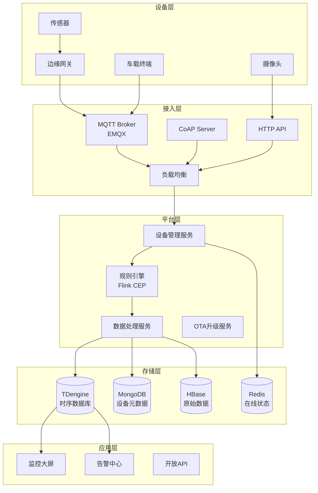
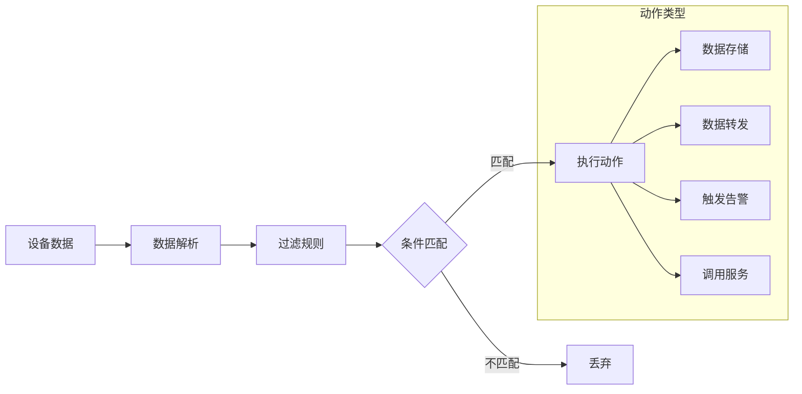
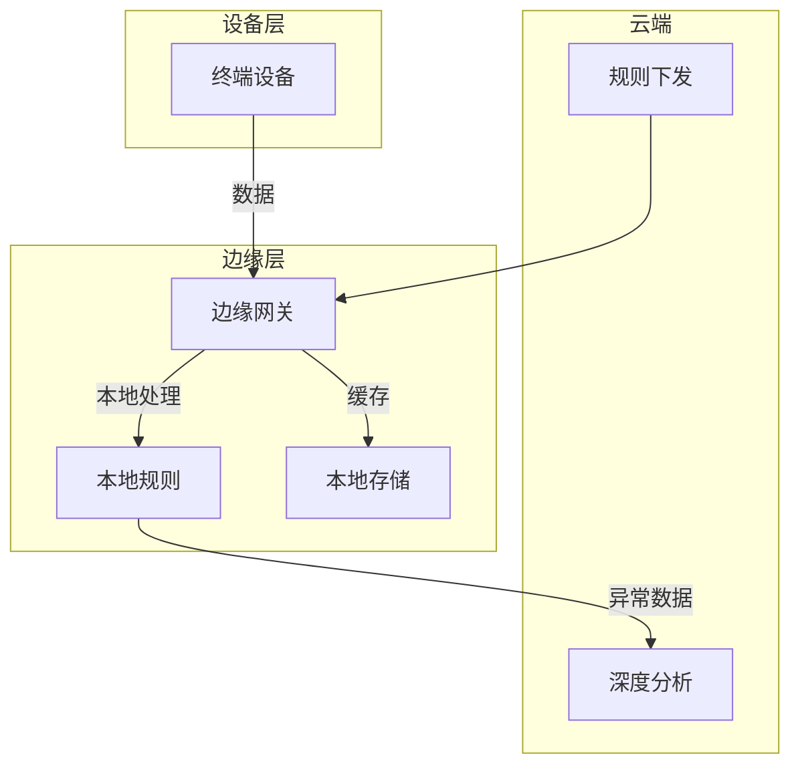

# 物联网平台架构案例

## 一、业务背景

物联网(IoT)平台连接海量物理设备，实现数据采集、远程控制与智能分析。以某大型智慧城市物联网平台为例，接入设备超过5000万台，日数据上报量超过1000亿条，涵盖智能家居、工业监控、车联网等多元场景。

核心业务域：

- **设备管理**：注册、认证、生命周期管理、OTA升级
- **规则引擎**：数据流转、告警触发、自动化响应
- **数据采集**：高并发传感器数据接入、时序存储

技术挑战：

- **海量连接**：单节点支持百万级长连接
- **协议多样**：MQTT、CoAP、HTTP、私有协议
- **数据时序性**：按时间序列高效写入与查询
- **边缘计算**：降低云端压力，实现低延迟响应

## 二、架构设计

### 2.1 整体架构



### 2.2 规则引擎架构



### 2.3 边缘计算架构



## 三、技术选型

| 组件 | 技术选型 | 选型理由 |
|------|---------|---------|
| MQTT Broker | EMQX | 单机百万连接 |
| 时序数据库 | TDengine | 10倍性能提升 |
| 流处理 | Apache Flink | 实时计算 |
| 消息队列 | Kafka | 高吞吐数据管道 |
| 设备元数据 | MongoDB | 灵活Schema |
| 缓存 | Redis Cluster | 在线状态 |
| 协议 | MQTT 5.0/CoAP | 物联网标准 |

## 四、核心流程

### 4.1 设备接入认证

```java
/**
 * 设备接入认证服务
 */
@Service
public class DeviceAuthService {

    @Autowired
    private DeviceRegistry deviceRegistry;

    @Autowired
    private RedisTemplate<String, String> redisTemplate;

    /**
     * 一机一密认证
     */
    public AuthResult authenticateOneDeviceOneSecret(
        String deviceId,
        String password
    ) {
        // 1. 查询设备信息
        DeviceInfo device = deviceRegistry.getDevice(deviceId);
        if (device == null) {
            return AuthResult.fail("设备未注册");
        }

        // 2. 验证密码
        String hashedPassword = hashPassword(password, device.getSalt());
        if (!hashedPassword.equals(device.getPassword())) {
            log.warn("设备认证失败: deviceId={}", deviceId);
            return AuthResult.fail("认证失败");
        }

        // 3. 检查设备状态
        if (device.getStatus() == DeviceStatus.DISABLED) {
            return AuthResult.fail("设备已禁用");
        }

        // 4. 生成Token
        String token = JWT.create()
            .withSubject(deviceId)
            .withClaim("productKey", device.getProductKey())
            .withExpiresAt(new Date(System.currentTimeMillis() + 86400000))
            .sign(Algorithm.HMAC256(device.getSecret()));

        // 5. 记录在线状态
        redisTemplate.opsForHash().put("device:online", deviceId,
            String.valueOf(System.currentTimeMillis()));

        return AuthResult.success(token);
    }

    /**
     * 一型一密认证 + 动态注册
     */
    public AuthResult authenticateOneProductOneSecret(
        String productKey,
        String deviceName,
        String sign
    ) {
        // 1. 验证产品签名
        ProductInfo product = productService.getProduct(productKey);
        String expectedSign = sign(deviceName, product.getSecret());
        if (!expectedSign.equals(sign)) {
            return AuthResult.fail("签名验证失败");
        }

        // 2. 动态创建设备
        String deviceId = productKey + "." + deviceName;
        DeviceInfo device = deviceRegistry.getDevice(deviceId);

        if (device == null) {
            // 自动注册
            device = DeviceInfo.builder()
                .deviceId(deviceId)
                .productKey(productKey)
                .deviceName(deviceName)
                .status(DeviceStatus.ACTIVE)
                .secret(generateSecret())
                .createTime(System.currentTimeMillis())
                .build();
            deviceRegistry.register(device);
        }

        // 3. 生成Token
        String token = generateToken(device);

        return AuthResult.success(token);
    }
}
```

### 4.2 规则引擎实现

```java
/**
 * 规则引擎 - 基于Flink CEP
 */
@Component
public class IoTRuleEngine {

    @Autowired
    private StreamExecutionEnvironment env;

    /**
     * 创建数据流转规则
     */
    public void createRule(RuleDefinition rule) {
        DataStream<DeviceData> dataStream = env
            .addSource(new KafkaSource<>())
            .map(new DataParser())
            .filter(data -> data.getProductKey().equals(rule.getProductKey()));

        // 应用规则条件
        SingleOutputStreamOperator<DeviceData> filtered = dataStream
            .filter(new RuleConditionFilter(rule.getConditions()));

        // 规则动作
        for (RuleAction action : rule.getActions()) {
            switch (action.getType()) {
                case STORE:
                    filtered.addSink(new TDengineSink(action.getConfig()));
                    break;
                case FORWARD:
                    filtered.addSink(new MqttForwardSink(action.getConfig()));
                    break;
                case ALERT:
                    filtered.addSink(new AlertSink(action.getConfig()));
                    break;
                case WEBHOOK:
                    filtered.addSink(new WebhookSink(action.getConfig()));
                    break;
            }
        }
    }

    /**
     * 复杂事件处理 - 设备异常检测
     */
    public void detectAnomaly() {
        Pattern<DeviceData, ?> pattern = Pattern
            .<DeviceData>begin("high_temp")
            .where(evt -> evt.getTemperature() > 80)
            .next("higher_temp")
            .where(evt -> evt.getTemperature() > 90)
            .within(Time.seconds(60));

        PatternStream<DeviceData> patternStream = CEP.pattern(
            dataStream.keyBy(DeviceData::getDeviceId),
            pattern
        );

        patternStream
            .process(new PatternProcessFunction<>() {
                @Override
                public void processMatch(
                    Map<String, List<DeviceData>> match,
                    Context ctx,
                    Collector<AlertEvent> out
                ) {
                    DeviceData first = match.get("high_temp").get(0);
                    DeviceData second = match.get("higher_temp").get(0);

                    out.collect(AlertEvent.builder()
                        .deviceId(first.getDeviceId())
                        .type(AlertType.TEMPERATURE_SPIKE)
                        .message(String.format(
                            "设备%s温度异常：%.1f°C -> %.1f°C",
                            first.getDeviceId(),
                            first.getTemperature(),
                            second.getTemperature()
                        ))
                        .timestamp(System.currentTimeMillis())
                        .build());
                }
            })
            .addSink(new AlertSink());
    }
}

/**
 * 规则条件过滤器
 */
public class RuleConditionFilter implements FilterFunction<DeviceData> {

    private List<Condition> conditions;

    @Override
    public boolean filter(DeviceData data) {
        for (Condition condition : conditions) {
            if (!evaluateCondition(data, condition)) {
                return false;
            }
        }
        return true;
    }

    private boolean evaluateCondition(DeviceData data, Condition condition) {
        Object value = getFieldValue(data, condition.getField());

        switch (condition.getOperator()) {
            case EQ:
                return value.equals(condition.getValue());
            case GT:
                return ((Number) value).doubleValue() >
                    ((Number) condition.getValue()).doubleValue();
            case LT:
                return ((Number) value).doubleValue() <
                    ((Number) condition.getValue()).doubleValue();
            case CONTAINS:
                return ((String) value).contains((String) condition.getValue());
            default:
                return false;
        }
    }
}
```

### 4.3 时序数据存储

```java
/**
 * 时序数据存储服务 - TDengine
 */
@Service
public class TimeSeriesService {

    @Autowired
    private JdbcTemplate tdengineTemplate;

    /**
     * 批量写入时序数据
     */
    public void batchInsert(List<DeviceData> dataList) {
        // TDengine SQL使用超级表概念
        String sql = "INSERT INTO device_data USING device_data_tags " +
            "TAGS (?, ?) VALUES (?, ?, ?, ?, ?)";

        List<Object[]> batchArgs = dataList.stream()
            .map(data -> new Object[]{
                data.getDeviceId(),      // 子表名
                data.getProductKey(),    // TAG
                data.getDeviceId(),      // TAG
                data.getTimestamp(),     // 时间戳
                data.getTemperature(),   // 字段
                data.getHumidity(),      // 字段
                data.getStatus()         // 字段
            })
            .collect(Collectors.toList());

        tdengineTemplate.batchUpdate(sql, batchArgs);
    }

    /**
     * 聚合查询 - 按小时统计平均温度
     */
    public List<AggregationResult> queryHourlyAvgTemp(
        String deviceId,
        long startTime,
        long endTime
    ) {
        String sql = "SELECT _irowts, AVG(temperature) as avg_temp " +
            "FROM device_data " +
            "WHERE device_id = ? AND ts >= ? AND ts <= ? " +
            "INTERVAL(1h)";

        return tdengineTemplate.query(sql, (rs, rowNum) ->
            AggregationResult.builder()
                .timestamp(rs.getTimestamp("_irowts").getTime())
                .value(rs.getDouble("avg_temp"))
                .build(),
            deviceId, new Timestamp(startTime), new Timestamp(endTime)
        );
    }

    /**
     * 降采样查询 - 展示趋势图
     */
    public List<DataPoint> queryDownsampled(
        String deviceId,
        String metric,
        long startTime,
        long endTime,
        String interval
    ) {
        // 根据时间范围自动选择降采样间隔
        String sql = String.format(
            "SELECT _irowts, %s(%s) as value " +
            "FROM device_data " +
            "WHERE device_id = ? AND ts >= ? AND ts <= ? " +
            "INTERVAL(%s)",
            getAggregationFunc(metric), metric, interval
        );

        return tdengineTemplate.query(sql, (rs, rowNum) ->
            DataPoint.builder()
                .timestamp(rs.getTimestamp("_irowts").getTime())
                .value(rs.getDouble("value"))
                .build(),
            deviceId, new Timestamp(startTime), new Timestamp(endTime)
        );
    }
}
```

## 五、经验总结

### 5.1 核心设计经验

| 场景 | 方案 | 效果 |
|------|------|------|
| 海量连接 | EMQX Broker集群 | 单节点100万连接 |
| 时序存储 | TDengine超级表 | 10倍写入性能 |
| 数据降采样 | 自动聚合查询 | 查询效率提升100倍 |
| 边缘计算 | 本地预处理 | 云端流量降低70% |

### 5.2 性能优化策略

1. **连接优化**：
   - 使用MQTT 5.0共享订阅
   - 设备心跳间隔动态调整

2. **存储优化**：
   - 冷热数据分离
   - 按设备ID分片

3. **计算优化**：
   - 边缘预处理
   - 规则预编译

### 5.3 安全最佳实践

| 层面 | 措施 | 说明 |
|------|------|------|
| 传输安全 | TLS 1.3 | 全链路加密 |
| 设备认证 | X.509证书 | 双向认证 |
| 访问控制 | RBAC | 细粒度权限 |
| 数据安全 | 字段级加密 | 敏感数据保护 |

---

> **扩展阅读**：
>
> - [EMQX企业版文档](https://www.emqx.io/)
> - [TDengine时序数据库](https://www.taosdata.com/)
