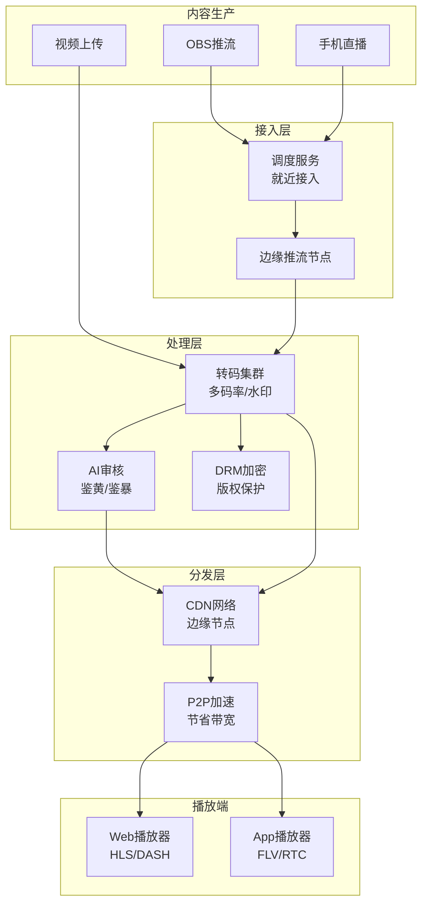
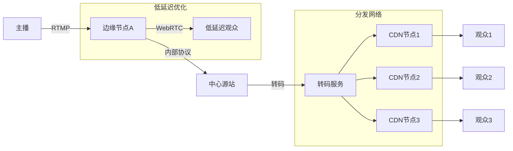
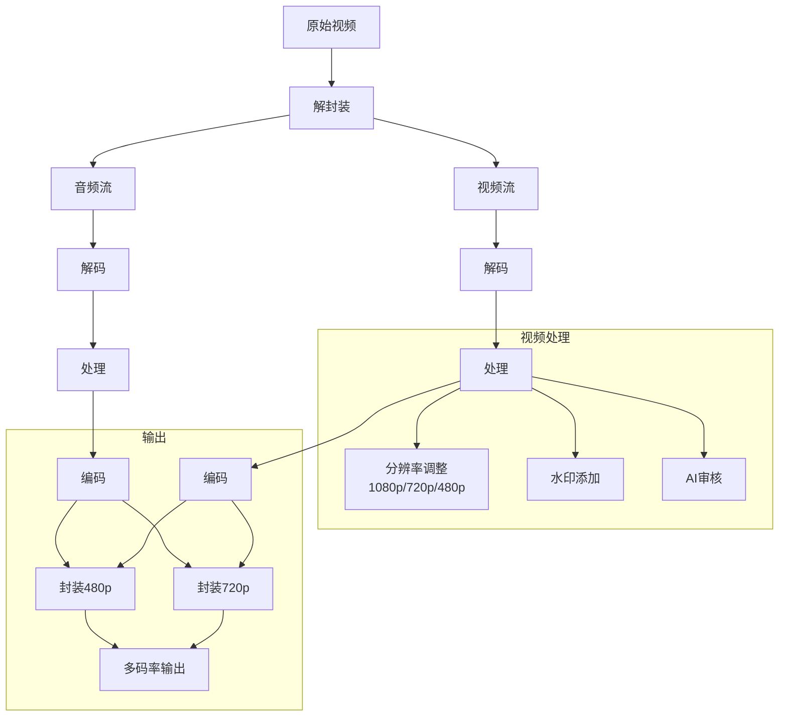

# 视频流媒体架构案例

## 一、业务背景

视频流媒体平台是带宽消耗最大的互联网应用之一。以某大型视频平台为例，日活用户超过1亿，日均播放量超过50亿次，峰值带宽超过50Tbps，涵盖直播、点播、短视频等多种业务形态。

核心业务场景：

- **直播**：推流、转码、分发、连麦互动
- **点播**：上传、转码多码率、存储分发
- **短视频**：快速上传、即时播放、推荐分发

技术挑战：

- **海量带宽**：峰值50Tbps+，成本敏感
- **首帧延迟**：直播延迟<3秒，互动直播<500ms
- **多终端适配**：码率自适应，弱网优化
- **内容安全**：AI审核、版权保护

## 二、架构设计

### 2.1 整体架构



### 2.2 直播系统架构



### 2.3 转码与处理流水线



## 三、技术选型

| 组件 | 技术选型 | 选型理由 |
|------|---------|---------|
| 推流协议 | RTMP/SRT | 低延迟、稳定 |
| 播放协议 | HLS/DASH/FLV | 多终端兼容 |
| 转码 | FFmpeg集群 | 成熟、功能丰富 |
| CDN | 自建+商业 | 成本控制 |
| 存储 | 对象存储 | 海量视频存储 |
| 编解码 | H.264/H.265/AV1 | 码率优化 |
| 低延迟 | WebRTC | 毫秒级延迟 |

## 四、核心流程

### 4.1 直播推流与分发

```java
/**
 * 直播流管理服务
 */
@Service
public class LiveStreamService {

    @Autowired
    private StreamManager streamManager;

    @Autowired
    private CDNService cdnService;

    /**
     * 创建直播流
     */
    public StreamCreateResult createStream(CreateStreamRequest request) {
        String streamId = generateStreamId();
        String streamKey = generateStreamKey();

        // 1. 分配边缘推流节点
        EdgeNode edgeNode = selectOptimalEdgeNode(request.getLocation());

        // 2. 创建流配置
        StreamConfig config = StreamConfig.builder()
            .streamId(streamId)
            .streamKey(streamKey)
            .pushUrl(buildPushUrl(edgeNode, streamKey))
            .transcodeProfiles(Arrays.asList(
                TranscodeProfile.builder()
                    .name("720p")
                    .width(1280)
                    .height(720)
                    .videoBitrate(2000000)
                    .audioBitrate(128000)
                    .build(),
                TranscodeProfile.builder()
                    .name("480p")
                    .width(854)
                    .height(480)
                    .videoBitrate(900000)
                    .audioBitrate(96000)
                    .build()
            ))
            .build();

        // 3. 注册流信息
        streamManager.registerStream(config);

        // 4. 预分配CDN资源
        List<String> playUrls = cdnService.allocatePlayUrls(streamId, config.getTranscodeProfiles());

        return StreamCreateResult.builder()
            .streamId(streamId)
            .pushUrl(config.getPushUrl())
            .playUrls(playUrls)
            .expireTime(System.currentTimeMillis() + 3600000) // 1小时有效
            .build();
    }

    /**
     * 获取最优播放地址
     */
    public PlayUrlResult getPlayUrl(String streamId, PlayRequest request) {
        // 1. 根据用户位置选择CDN节点
        CDNNode node = cdnService.selectOptimalNode(request.getUserIp());

        // 2. 根据网络状况选择码率
        String quality = selectQuality(request.getNetworkType(), request.getScreenWidth());

        // 3. 生成播放地址
        String playUrl = buildPlayUrl(node, streamId, quality, request.getProtocol());

        // 4. 返回多码率自适应列表（HLS Master Playlist）
        if ("hls".equals(request.getProtocol())) {
            return generateMasterPlaylist(streamId, node);
        }

        return PlayUrlResult.builder()
            .url(playUrl)
            .quality(quality)
            .protocol(request.getProtocol())
            .expires(System.currentTimeMillis() + 300000) // 5分钟过期
            .build();
    }

    /**
     * 连麦申请处理
     */
    public AnchorJoinResult handleAnchorJoin(String streamId, AnchorJoinRequest request) {
        // 1. 验证权限
        if (!verifyAnchorPermission(streamId, request.getUserId())) {
            return AnchorJoinResult.fail("无连麦权限");
        }

        // 2. 创建RTC房间
        String roomId = rtcService.createRoom(streamId);

        // 3. 生成RTC token
        String token = rtcService.generateToken(roomId, request.getUserId(),
            Role.PUBLISHER);

        // 4. 通知主播
        notifyHost(streamId, request);

        return AnchorJoinResult.builder()
            .roomId(roomId)
            .token(token)
            .rtcServers(rtcService.getServers())
            .build();
    }
}
```

### 4.2 转码服务实现

```java
/**
 * 分布式转码服务
 */
@Service
public class TranscodeService {

    @Autowired
    private FFmpegJobManager jobManager;

    @Autowired
    private ObjectStorageService ossService;

    /**
     * 提交转码任务
     */
    public TranscodeJob submitJob(TranscodeRequest request) {
        String jobId = generateJobId();

        // 1. 分析视频信息
        MediaInfo mediaInfo = analyzeMedia(request.getInputUrl());

        // 2. 创建转码任务
        TranscodeJob job = TranscodeJob.builder()
            .jobId(jobId)
            .inputUrl(request.getInputUrl())
            .outputs(request.getOutputs())
            .status(JobStatus.PENDING)
            .createTime(System.currentTimeMillis())
            .build();

        // 3. 提交到转码队列
        jobManager.submitJob(job);

        // 4. 异步处理
        processTranscodeAsync(job, mediaInfo);

        return job;
    }

    @Async
    public void processTranscodeAsync(TranscodeJob job, MediaInfo mediaInfo) {
        try {
            jobManager.updateStatus(job.getJobId(), JobStatus.RUNNING);

            for (OutputConfig output : job.getOutputs()) {
                // 构建FFmpeg命令
                FFmpegCommand command = buildFFmpegCommand(
                    job.getInputUrl(),
                    output,
                    mediaInfo
                );

                // 执行转码
                TranscodeResult result = executeFFmpeg(command);

                // 上传输出文件
                String outputUrl = ossService.upload(result.getOutputFile());
                output.setOutputUrl(outputUrl);
            }

            jobManager.updateStatus(job.getJobId(), JobStatus.COMPLETED);

        } catch (Exception e) {
            log.error("转码失败: jobId={}", job.getJobId(), e);
            jobManager.updateStatus(job.getJobId(), JobStatus.FAILED);
            jobManager.updateError(job.getJobId(), e.getMessage());
        }
    }

    /**
     * 构建FFmpeg命令
     */
    private FFmpegCommand buildFFmpegCommand(
        String inputUrl,
        OutputConfig output,
        MediaInfo mediaInfo
    ) {
        FFmpegCommandBuilder builder = FFmpegCommand.builder()
            .input(inputUrl)
            .videoCodec(selectVideoCodec(output.getCodec()))
            .videoBitrate(output.getVideoBitrate())
            .resolution(output.getWidth(), output.getHeight())
            .fps(output.getFps());

        // 添加水印
        if (output.getWatermark() != null) {
            builder.watermark(output.getWatermark());
        }

        // 视频增强
        if (output.isEnhance()) {
            builder.filter("unsharp", "5:5:1.0:5:5:0.0"); // 锐化
        }

        // 音频配置
        builder.audioCodec("aac")
            .audioBitrate(output.getAudioBitrate())
            .audioSampleRate(48000);

        // HLS分段
        if ("hls".equals(output.getFormat())) {
            builder.segmentDuration(2) // 2秒一个切片
                .hlsPlaylistType("vod")
                .hlsFlags("independent_segments");
        }

        return builder.build();
    }
}
```

### 4.3 码率自适应算法

```java
/**
 * 自适应码率(ABR)控制器
 */
@Component
public class AdaptiveBitrateController {

    /**
     * 基于缓冲区和网速的码率选择
     */
    public QualityLevel selectQualityLevel(PlaybackContext context) {
        // 获取当前网络状态
        NetworkStats networkStats = context.getNetworkStats();
        double downloadBandwidth = networkStats.getDownloadBandwidth(); // bps
        double bufferHealth = context.getBufferHealth(); // 秒

        // 可用码率选项
        List<QualityLevel> levels = context.getAvailableLevels();

        // 根据带宽选择
        QualityLevel bandwidthBased = null;
        for (QualityLevel level : levels) {
            if (level.getBitrate() * 1.5 < downloadBandwidth) {
                bandwidthBased = level;
            }
        }

        // 根据缓冲区调整
        if (bufferHealth < 2.0) {
            // 缓冲区低，降级
            return getLowerLevel(levels, bandwidthBased);
        } else if (bufferHealth > 10.0) {
            // 缓冲区充足，尝试升级
            return getHigherLevel(levels, bandwidthBased);
        }

        return bandwidthBased != null ? bandwidthBased : levels.get(0);
    }

    /**
     * 快速启动策略
     */
    public QualityLevel selectForStartup(PlaybackContext context) {
        // 启动时选择中等码率，快速起播
        List<QualityLevel> levels = context.getAvailableLevels();
        return levels.get(Math.min(1, levels.size() - 1));
    }

    /**
     * 切换码率平滑处理
     */
    public boolean shouldSwitchQuality(
        QualityLevel current,
        QualityLevel target,
        PlaybackContext context
    ) {
        // 避免频繁切换
        if (context.getLastSwitchTime() > 0 &&
            System.currentTimeMillis() - context.getLastSwitchTime() < 10000) {
            return false;
        }

        // 升级需要更保守
        if (target.getBitrate() > current.getBitrate()) {
            return context.getBufferHealth() > 15.0 &&
                context.getNetworkStats().getDownloadBandwidth() >
                    target.getBitrate() * 2;
        }

        // 降级可以激进
        return context.getBufferHealth() < 5.0;
    }
}
```

## 五、经验总结

### 5.1 核心优化策略

| 优化点 | 方案 | 效果 |
|--------|------|------|
| 首帧时间 | GOP对齐、预加载 | 从3s降至1s |
| 带宽成本 | P2P+H.265 | 节省40%带宽 |
| 卡顿率 | 智能预加载 | 降低60% |
| 延迟优化 | WebRTC+边缘节点 | 从5s降至500ms |

### 5.2 成本控制经验

1. **转码成本**：
   - 热门内容预转码
   - 冷内容按需转码
   - H.265节省50%码率

2. **带宽成本**：
   - P2P技术节省30%
   - 码率自适应降低浪费
   - 边缘缓存减少回源

### 5.3 质量保障

| 指标 | 目标 | 监控 |
|------|------|------|
| 首帧时间 | <1.5s | 实时 |
| 卡顿率 | <1% | 分钟级 |
| 错误率 | <0.1% | 实时 |
| 画质 | 无压缩失真 | 抽样 |

---

> **扩展阅读**：
>
> - [FFmpeg官方文档](https://ffmpeg.org/documentation.html)
> - [HLS协议规范](https://datatracker.ietf.org/doc/html/rfc8216)
