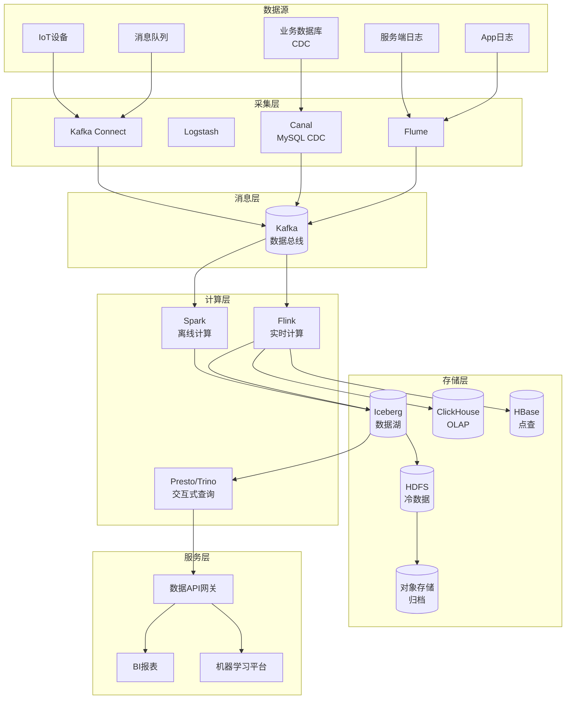
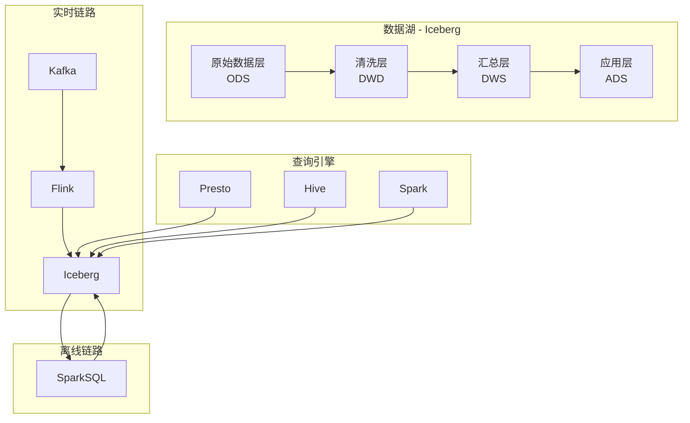
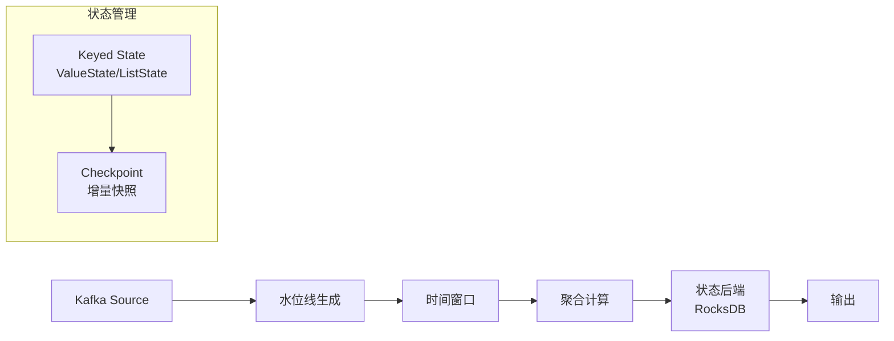

# 大数据平台架构案例

## 一、业务背景

大数据平台是企业数字化转型的核心基础设施。以某大型电商平台为例，日处理数据量超过50PB，实时计算峰值超过10亿条/秒，支撑数据驱动决策、个性化推荐、风控反欺诈等业务场景。

核心能力域：

- **数据采集**：日志、数据库、消息队列多源接入
- **数据存储**：湖仓一体、冷热分层
- **实时计算**：流处理、实时分析
- **离线计算**：批处理、数据仓库
- **数据服务**：数据API、即席查询

技术挑战：

- **海量数据**：日均50PB+，年增长率100%
- **实时性要求**：从T+1到秒级延迟
- **成本优化**：存储和计算成本控制
- **数据治理**：数据质量、血缘、安全

## 二、架构设计

### 2.1 整体架构



### 2.2 湖仓一体架构



### 2.3 实时计算架构



## 三、技术选型

| 层级 | 技术选型 | 选型理由 |
|------|---------|---------|
| 采集 | Flume + Canal | 成熟稳定，社区活跃 |
| 消息队列 | Kafka | 高吞吐、持久化 |
| 实时计算 | Flink | 真正的流处理 |
| 离线计算 | Spark | 生态丰富 |
| 数据湖 | Iceberg | 开放标准、高性能 |
| OLAP | ClickHouse | 列式存储、极速查询 |
| 调度 | Airflow/DolphinScheduler | 可视化编排 |
| 治理 | Atlas + Griffin | 元数据+质量 |

## 四、核心流程

### 4.1 数据采集与CDC

```java
/**
 * MySQL CDC采集服务 - 基于Debezium
 */
@Component
public class MySQLCDCService {

    @Autowired
    private KafkaTemplate<String, String> kafkaTemplate;

    /**
     * 启动CDC采集
     */
    public void startCDC(String database, List<String> tables) {
        Configuration config = Configuration.create()
            .with("name", "mysql-cdc-" + database)
            .with("connector.class", "io.debezium.connector.mysql.MySqlConnector")
            .with("database.hostname", mysqlConfig.getHost())
            .with("database.port", mysqlConfig.getPort())
            .with("database.user", mysqlConfig.getUser())
            .with("database.password", mysqlConfig.getPassword())
            .with("database.server.id", generateServerId())
            .with("database.server.name", "mysql-" + database)
            .with("database.include.list", database)
            .with("table.include.list", String.join(",", tables))
            .with("snapshot.mode", "initial")
            .with("tombstones.on.delete", false)
            .with("decimal.handling.mode", "string")
            .build();

        DebeziumEngine<ChangeEvent<String, String>> engine = DebeziumEngine
            .create(Json.class)
            .using(config.asProperties())
            .notifying(this::handleChangeEvent)
            .build();

        ExecutorService executor = Executors.newSingleThreadExecutor();
        executor.execute(engine);
    }

    /**
     * 处理变更事件
     */
    private void handleChangeEvent(ChangeEvent<String, String> event) {
        String key = event.key();
        String value = event.value();

        try {
            JsonNode changeEvent = objectMapper.readTree(value);
            JsonNode payload = changeEvent.get("payload");

            String op = payload.get("op").asText(); // c=create, u=update, d=delete
            String table = payload.get("source").get("table").asText();
            long tsMs = payload.get("ts_ms").asLong();

            CDCRecord record = CDCRecord.builder()
                .database(payload.get("source").get("db").asText())
                .table(table)
                .operation(op)
                .before(parseRowData(payload.get("before")))
                .after(parseRowData(payload.get("after")))
                .timestamp(tsMs)
                .build();

            // 发送到Kafka
            String topic = "cdc." + record.getDatabase() + "." + table;
            kafkaTemplate.send(topic, key, objectMapper.writeValueAsString(record));

        } catch (Exception e) {
            log.error("处理CDC事件失败: {}", value, e);
        }
    }
}

/**
 * CDC记录结构
 */
@Data
@Builder
public class CDCRecord {
    private String database;
    private String table;
    private String operation; // CREATE, UPDATE, DELETE
    private Map<String, Object> before;
    private Map<String, Object> after;
    private long timestamp;
}
```

### 4.2 Flink实时ETL

```java
/**
 * Flink实时数据清洗与转换
 */
public class RealtimeETLJob {

    public static void main(String[] args) throws Exception {
        StreamExecutionEnvironment env =
            StreamExecutionEnvironment.getExecutionEnvironment();
        env.setParallelism(4);

        // 启用Checkpoint
        env.enableCheckpointing(60000);
        env.getCheckpointConfig().setCheckpointingMode(
            CheckpointingMode.EXACTLY_ONCE);
        env.getCheckpointConfig().setMinPauseBetweenCheckpoints(30000);
        env.setStateBackend(new RocksDBStateBackend("hdfs://checkpoint"));

        // Kafka Source
        KafkaSource<String> source = KafkaSource.<String>builder()
            .setBootstrapServers("kafka:9092")
            .setTopics("user_behavior")
            .setGroupId("flink-etl")
            .setStartingOffsets(OffsetsInitializer.latest())
            .setValueOnlyDeserializer(new SimpleStringSchema())
            .build();

        DataStream<UserBehavior> stream = env
            .fromSource(source, WatermarkStrategy.noWatermarks(), "Kafka Source")
            .map(new JSONMapper<>())
            .filter(new DataValidationFilter())
            .assignTimestampsAndWatermarks(
                WatermarkStrategy.<UserBehavior>forBoundedOutOfOrderness(
                    Duration.ofSeconds(5))
                    .withTimestampAssigner((event, timestamp) ->
                        event.getEventTime())
            );

        // 实时聚合：按品类统计PV/UV
        SingleOutputStreamOperator<CategoryStats> stats = stream
            .keyBy(UserBehavior::getCategoryId)
            .window(TumblingEventTimeWindows.of(Time.minutes(1)))
            .aggregate(new CategoryAggregateFunction());

        // 写入Iceberg
        FlinkSink.forRowData()
            .tableLoader(TableLoader.fromHadoopTable("hdfs://iceberg/warehouse"))
            .equalityFieldColumns(Arrays.asList("category_id", "window_start"))
            .upsert(true)
            .append();

        // 写入ClickHouse用于实时查询
        stats.addSink(new ClickHouseSink<>());

        env.execute("Realtime ETL Job");
    }

    /**
     * 品类聚合函数
     */
    public static class CategoryAggregateFunction implements
        AggregateFunction<UserBehavior, CategoryAccumulator, CategoryStats> {

        @Override
        public CategoryAccumulator createAccumulator() {
            return new CategoryAccumulator();
        }

        @Override
        public CategoryAccumulator add(UserBehavior value, CategoryAccumulator acc) {
            acc.setCategoryId(value.getCategoryId());
            acc.setPvCount(acc.getPvCount() + 1);
            acc.getUvSet().add(value.getUserId());
            return acc;
        }

        @Override
        public CategoryStats getResult(CategoryAccumulator acc) {
            return CategoryStats.builder()
                .categoryId(acc.getCategoryId())
                .pvCount(acc.getPvCount())
                .uvCount(acc.getUvSet().size())
                .build();
        }

        @Override
        public CategoryAccumulator merge(CategoryAccumulator a, CategoryAccumulator b) {
            a.setPvCount(a.getPvCount() + b.getPvCount());
            a.getUvSet().addAll(b.getUvSet());
            return a;
        }
    }
}
```

### 4.3 数据质量监控

```java
/**
 * 数据质量检查服务
 */
@Service
public class DataQualityService {

    @Autowired
    private GriffinService griffinService;

    @Autowired
    private AlertService alertService;

    /**
     * 定义质量规则
     */
    public void defineQualityRules(String tableName) {
        List<QualityRule> rules = Arrays.asList(
            // 完整性规则
            QualityRule.builder()
                .name("completeness_check")
                .type(RuleType.COMPLETENESS)
                .column("user_id")
                .operator(Operator.NOT_NULL)
                .threshold(0.99) // 99%非空
                .build(),

            // 唯一性规则
            QualityRule.builder()
                .name("uniqueness_check")
                .type(RuleType.UNIQUENESS)
                .column("order_id")
                .threshold(1.0) // 100%唯一
                .build(),

            // 有效性规则
            QualityRule.builder()
                .name("validity_check")
                .type(RuleType.VALIDITY)
                .column("amount")
                .operator(Operator.GREATER_THAN)
                .value("0")
                .threshold(0.95)
                .build(),

            // 及时性规则
            QualityRule.builder()
                .name("timeliness_check")
                .type(RuleType.TIMELINESS)
                .column("event_time")
                .operator(Operator.WITHIN)
                .value("24h") // 24小时内
                .threshold(0.98)
                .build(),

            // 一致性规则
            QualityRule.builder()
                .name("consistency_check")
                .type(RuleType.CONSISTENCY)
                .expression("payment_amount = product_price * quantity + shipping_fee")
                .threshold(0.99)
                .build()
        );

        griffinService.createMeasure(tableName, rules);
    }

    /**
     * 执行质量检查
     */
    public QualityReport runQualityCheck(String tableName, String partition) {
        MeasureResult result = griffinService.runMeasure(tableName, partition);

        QualityReport report = QualityReport.builder()
            .tableName(tableName)
            .partition(partition)
            .checkTime(System.currentTimeMillis())
            .results(result.getRuleResults())
            .overallScore(calculateScore(result))
            .build();

        // 异常告警
        for (RuleResult ruleResult : result.getRuleResults()) {
            if (ruleResult.getPassRate() < ruleResult.getThreshold()) {
                alertService.sendAlert(
                    "数据质量异常",
                    String.format("表%s规则%s通过率%.2f%%, 低于阈值%.2f%%",
                        tableName,
                        ruleResult.getRuleName(),
                        ruleResult.getPassRate() * 100,
                        ruleResult.getThreshold() * 100)
                );
            }
        }

        // 保存报告
        saveReport(report);

        return report;
    }

    /**
     * 数据血缘追踪
     */
    public DataLineage getDataLineage(String tableName) {
        // 查询Atlas元数据
        Entity entity = atlasService.getEntity(tableName);

        DataLineage lineage = new DataLineage();
        lineage.setTableName(tableName);

        // 向上追溯：数据源
        lineage.setSources(atlasService.getUpstream(entity));

        // 向下追溯：数据去向
        lineage.setDestinations(atlasService.getDownstream(entity));

        // 转换逻辑
        lineage.setTransformations(atlasService.getTransformations(entity));

        return lineage;
    }
}
```

## 五、经验总结

### 5.1 架构演进经验

| 阶段 | 架构 | 特点 |
|------|------|------|
| 1.0 | MySQL + BI | 单机瓶颈 |
| 2.0 | Hadoop + Hive | 离线批处理 |
| 3.0 | Lambda架构 | 离线+实时双链路 |
| 4.0 | 湖仓一体 | 统一存储、统一计算 |

### 5.2 成本控制策略

| 策略 | 实现 | 效果 |
|------|------|------|
| 冷热分离 | 3天内热数据SSD，30天内温数据HDD，归档OSS | 存储成本降低70% |
| 计算资源 | 按需弹性、Spot实例 | 计算成本降低50% |
| 数据压缩 | Parquet + Zstd | 存储减少60% |
| 数据治理 | 清理僵尸表、生命周期管理 | 减少30%无效存储 |

### 5.3 数据治理体系

1. **元数据管理**：数据字典、血缘关系、影响分析
2. **数据质量**：规则定义、质量监控、异常告警
3. **数据安全**：分级分类、脱敏加密、权限控制
4. **数据生命周期**：创建、使用、归档、销毁

---

> **扩展阅读**：
>
> - [Flink官方文档](https://nightlies.apache.org/flink/flink-docs-stable/)
> - [Apache Iceberg](https://iceberg.apache.org/)
