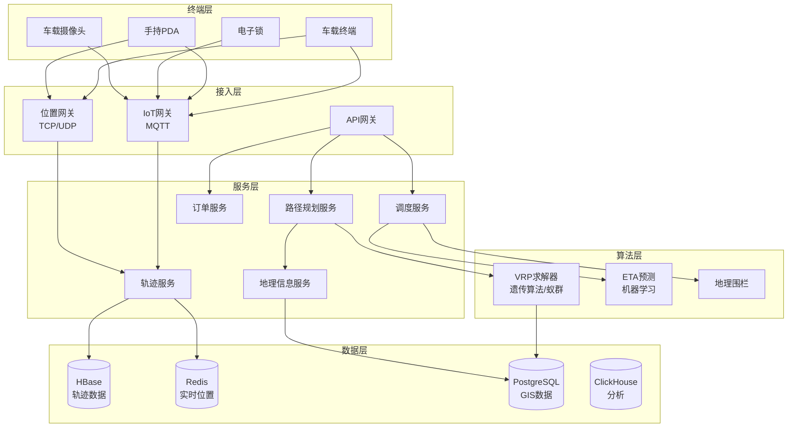
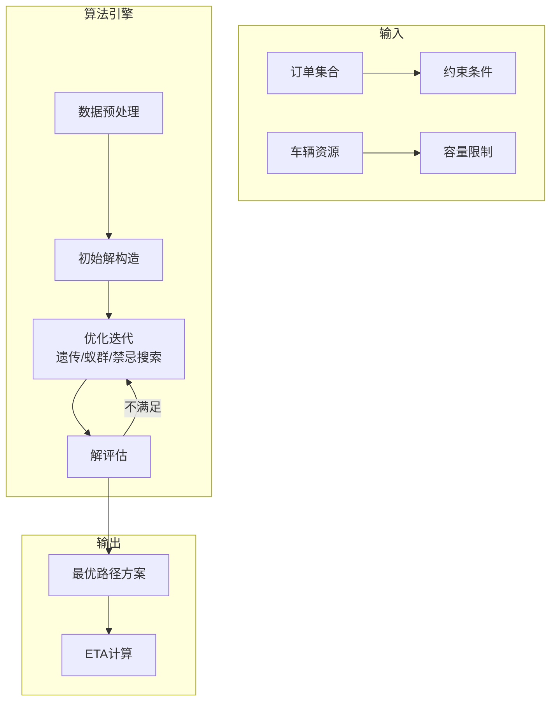
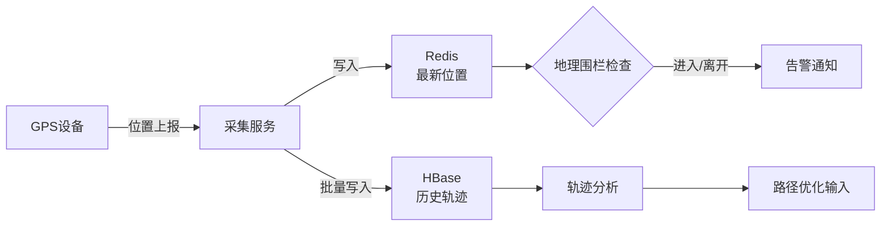

# 物流系统架构案例

## 一、业务背景

物流系统是电商经济的基础设施，以某头部物流企业为例，日均订单超过5000万单，覆盖超过3000个区县，车辆调度超过100万辆，配送员超过300万人。

核心业务域：

- **路径规划**：智能排线、车辆路径优化(VRP)
- **实时追踪**：车辆/包裹位置实时追踪
- **仓储管理**：库存管理、智能分拣
- **运力调度**：车辆、人员、资源动态调配

技术挑战：

- **算法复杂度**：路径规划NP难问题，需近似算法
- **实时性要求**：轨迹秒级更新，调度分钟级响应
- **海量终端**：百万级车辆/人员设备接入
- **预测准确性**：时效预估误差<30分钟

## 二、架构设计

### 2.1 整体架构



### 2.2 路径规划架构



### 2.3 实时追踪架构



## 三、技术选型

| 组件 | 技术选型 | 选型理由 |
|------|---------|---------|
| 轨迹存储 | HBase + GeoMesa | 时空数据高效存储 |
| 实时位置 | Redis Geo | 地理空间查询 |
| GIS数据库 | PostgreSQL + PostGIS | 专业地理信息 |
| 路径算法 | OR-Tools + 自研 | Google开源优化库 |
| 消息队列 | Kafka | 轨迹数据流 |
| 计算引擎 | Flink | 实时地理围栏 |
| 地图服务 | 高德/百度 + 自建 | 混合策略 |

## 四、核心流程

### 4.1 车辆路径规划(VRP)

```java
/**
 * 车辆路径规划服务
 */
@Service
public class RoutePlanningService {

    @Autowired
    private ORToolsVRPSolver orToolsSolver;

    @Autowired
    private DistanceMatrixService distanceService;

    /**
     * 智能排线 - 带时间窗和容量约束的VRP
     */
    public RoutePlan optimizeRoutes(RouteOptimizationRequest request) {
        // 1. 构建距离矩阵
        List<Location> allPoints = new ArrayList<>();
        allPoints.add(request.getDepot()); // 配送中心
        allPoints.addAll(request.getOrders().stream()
            .map(Order::getDeliveryLocation)
            .collect(Collectors.toList()));

        DistanceMatrix distanceMatrix = distanceService.calculateMatrix(allPoints);

        // 2. 构建VRP模型
        VRPModel model = VRPModel.builder()
            .depotIndex(0)
            .vehicleCount(request.getVehicles().size())
            .vehicleCapacities(request.getVehicles().stream()
                .mapToLong(Vehicle::getCapacity)
                .toArray())
            .demands(request.getOrders().stream()
                .mapToLong(Order::getWeight)
                .toArray())
            .timeWindows(buildTimeWindows(request.getOrders()))
            .serviceTimes(buildServiceTimes(request.getOrders()))
            .distanceMatrix(distanceMatrix)
            .build();

        // 3. 求解
        VRPSolution solution = orToolsSolver.solve(model,
            new VRPSolverConfig()
                .withStrategy(SearchStrategy.GUIDED_LOCAL_SEARCH)
                .withTimeLimitSeconds(300) // 5分钟
        );

        // 4. 后处理：ETA计算、负载均衡优化
        List<Route> routes = postProcess(solution, request);

        return RoutePlan.builder()
            .routes(routes)
            .totalDistance(solution.getTotalDistance())
            .totalTime(solution.getTotalTime())
            .vehicleUtilization(calculateUtilization(routes))
            .build();
    }

    /**
     * 大规模问题分区分治
     */
    public RoutePlan optimizeLargeScale(LargeScaleRequest request) {
        // 1. 使用聚类算法分区
        List<Cluster> clusters = kMeansClustering(
            request.getOrders(),
            request.getVehicles().size() / 10
        );

        // 2. 每个聚类并行求解
        List<CompletableFuture<RoutePlan>> futures = clusters.stream()
            .map(cluster -> CompletableFuture.supplyAsync(() ->
                optimizeRoutes(new RouteOptimizationRequest(
                    request.getDepot(),
                    cluster.getOrders(),
                    allocateVehicles(request.getVehicles(), cluster)
                ))))
            .collect(Collectors.toList());

        // 3. 合并结果
        List<RoutePlan> subPlans = futures.stream()
            .map(CompletableFuture::join)
            .collect(Collectors.toList());

        return mergeRoutePlans(subPlans);
    }

    /**
     * 动态重调度
     */
    public RoutePlan reschedule(RoutePlan currentPlan, List<Event> events) {
        // 处理突发事件：新增订单、车辆故障、交通堵塞
        List<Route> affectedRoutes = identifyAffectedRoutes(currentPlan, events);

        // 提取未完成的订单
        List<Order> pendingOrders = affectedRoutes.stream()
            .flatMap(r -> r.getPendingOrders().stream())
            .collect(Collectors.toList());

        // 对受影响部分重新规划
        List<Vehicle> availableVehicles = getAvailableVehicles(affectedRoutes);

        RoutePlan newSubPlan = optimizeRoutes(new RouteOptimizationRequest(
            currentPlan.getDepot(),
            pendingOrders,
            availableVehicles
        ));

        // 合并未受影响的路线
        return mergeWithUnaffected(currentPlan, affectedRoutes, newSubPlan);
    }
}

/**
 * OR-Tools VRP求解器封装
 */
@Component
public class ORToolsVRPSolver {

    public VRPSolution solve(VRPModel model, VRPSolverConfig config) {
        // 加载OR-Tools原生库
        Loader.loadNativeLibraries();

        // 创建路由模型
        RoutingIndexManager manager = new RoutingIndexManager(
            model.getDistanceMatrix().getSize(),
            model.getVehicleCount(),
            model.getDepotIndex()
        );

        RoutingModel routing = new RoutingModel(manager);

        // 设置距离回调
        final int transitCallbackIndex = routing.registerTransitCallback(
            (fromIndex, toIndex) -> {
                int fromNode = manager.indexToNode(fromIndex);
                int toNode = manager.indexToNode(toIndex);
                return model.getDistanceMatrix().getDistance(fromNode, toNode);
            }
        );

        routing.setArcCostEvaluatorOfAllVehicles(transitCallbackIndex);

        // 添加容量约束
        routing.addDimensionWithVehicleCapacity(
            demandCallbackIndex,
            0, // null capacity slack
            model.getVehicleCapacities(),
            true, // start cumul to zero
            "Capacity"
        );

        // 添加时间窗约束
        routing.addDimension(
            timeCallbackIndex,
            86400, // 允许等待
            86400, // 最大时间
            false, // 不从0开始累积
            "Time"
        );

        // 设置搜索策略
        RoutingSearchParameters searchParameters =
            main.defaultRoutingSearchParameters()
                .toBuilder()
                .setFirstSolutionStrategy(
                    FirstSolutionStrategy.Value.PATH_CHEAPEST_ARC)
                .setLocalSearchMetaheuristic(
                    LocalSearchMetaheuristic.Value.GUIDED_LOCAL_SEARCH)
                .setTimeLimit(Duration.newBuilder().setSeconds(config.getTimeLimitSeconds()))
                .build();

        // 求解
        Assignment solution = routing.solveWithParameters(searchParameters);

        return extractSolution(solution, routing, manager, model);
    }
}
```

### 4.2 实时轨迹追踪

```java
/**
 * 实时轨迹服务
 */
@Service
public class RealtimeTrackingService {

    @Autowired
    private StringRedisTemplate redisTemplate;

    @Autowired
    private HBaseTemplate hbaseTemplate;

    @Autowired
    private GeoFenceService geoFenceService;

    @Autowired
    private KafkaTemplate<String, PositionReport> kafkaTemplate;

    /**
     * 处理位置上报
     */
    public void handlePositionReport(PositionReport report) {
        // 1. 数据校验
        if (!validatePosition(report)) {
            log.warn("无效位置数据: {}", report);
            return;
        }

        String vehicleId = report.getVehicleId();

        // 2. 更新Redis实时位置（Geo结构）
        String geoKey = "vehicle:position:" + report.getRegionCode();
        redisTemplate.opsForGeo().add(geoKey,
            new Point(report.getLongitude(), report.getLatitude()),
            vehicleId);

        // 3. 检查地理围栏
        checkGeoFences(vehicleId, report);

        // 4. 计算行驶里程
        updateMileage(vehicleId, report);

        // 5. 异步写入HBase历史轨迹
        kafkaTemplate.send("position-reports", vehicleId, report);

        // 6. 更新车辆状态
        updateVehicleStatus(vehicleId, report);
    }

    /**
     * 查询附近车辆
     */
    public List<VehicleNearby> findNearbyVehicles(double lat, double lng, double radiusKm) {
        String geoKey = "vehicle:position:" + getRegionCode(lat, lng);

        // GeoRadius查询
        GeoResults<RedisGeoCommands.GeoLocation<String>> results =
            redisTemplate.opsForGeo().radius(geoKey,
                new Circle(new Point(lng, lat), new Distance(radiusKm, Metrics.KILOMETERS)),
                RedisGeoCommands.GeoRadiusCommandArgs.newGeoRadiusArgs()
                    .includeDistance()
                    .sortAscending()
                    .limit(50)
            );

        if (results == null) {
            return Collections.emptyList();
        }

        return results.getContent().stream()
            .map(geo -> VehicleNearby.builder()
                .vehicleId(geo.getContent().getName())
                .distance(geo.getDistance().getValue())
                .build())
            .collect(Collectors.toList());
    }

    /**
     * 查询车辆轨迹
     */
    public List<PositionReport> queryTrajectory(String vehicleId,
                                                long startTime,
                                                long endTime) {
        // HBase Scan查询
        String tableName = "vehicle_trajectory";
        String rowKeyPrefix = vehicleId + "_";

        Scan scan = new Scan()
            .withStartRow(Bytes.toBytes(rowKeyPrefix + startTime))
            .withStopRow(Bytes.toBytes(rowKeyPrefix + endTime))
            .addColumn("position".getBytes(), "data".getBytes());

        return hbaseTemplate.find(tableName, scan, (result, rowNum) -> {
            byte[] data = result.getValue("position".getBytes(), "data".getBytes());
            return JSON.parseObject(data, PositionReport.class);
        });
    }

    /**
     * 地理围栏检查
     */
    private void checkGeoFences(String vehicleId, PositionReport report) {
        // 查询车辆关联的围栏
        Set<String> fences = getVehicleFences(vehicleId);

        Point currentPoint = new Point(report.getLongitude(), report.getLatitude());

        for (String fenceId : fences) {
            GeoFence fence = geoFenceService.getFence(fenceId);
            boolean inside = isPointInFence(currentPoint, fence);
            boolean wasInside = wasInsideFence(vehicleId, fenceId);

            if (inside && !wasInside) {
                // 进入围栏
                triggerEvent(vehicleId, fenceId, GeoEventType.ENTER, report);
            } else if (!inside && wasInside) {
                // 离开围栏
                triggerEvent(vehicleId, fenceId, GeoEventType.EXIT, report);
            }

            // 更新状态
            updateFenceStatus(vehicleId, fenceId, inside);
        }
    }

    /**
     * 批量轨迹写入HBase
     */
    @KafkaListener(topics = "position-reports")
    public void batchWriteToHBase(List<ConsumerRecord<String, PositionReport>> records) {
        List<Put> puts = records.stream()
            .map(record -> {
                PositionReport report = record.value();
                String rowKey = String.format("%s_%013d",
                    report.getVehicleId(), report.getTimestamp());

                Put put = new Put(Bytes.toBytes(rowKey));
                put.addColumn("position".getBytes(), "data".getBytes(),
                    JSON.toJSONBytes(report));
                put.addColumn("position".getBytes(), "lat".getBytes(),
                    Bytes.toBytes(report.getLatitude()));
                put.addColumn("position".getBytes(), "lng".getBytes(),
                    Bytes.toBytes(report.getLongitude()));

                return put;
            })
            .collect(Collectors.toList());

        hbaseTemplate.execute("vehicle_trajectory", table -> {
            table.put(puts);
            return null;
        });
    }
}
```

### 4.3 ETA预测模型

```java
/**
 * ETA预测服务 - 基于机器学习和实时交通
 */
@Service
public class ETAPredictionService {

    @Autowired
    private MLModelService mlModelService;

    @Autowired
    private TrafficDataService trafficService;

    @Autowired
    private HistoricalRouteService historicalService;

    /**
     * 预测到达时间
     */
    public ETAResult predictETA(ETARequest request) {
        // 1. 获取实时交通状况
        TrafficCondition traffic = trafficService.getRealTimeTraffic(
            request.getRoute());

        // 2. 构建特征向量
        ETAFeatureVector features = buildFeatureVector(request, traffic);

        // 3. ML模型预测
        double baseETA = mlModelService.predict(features);

        // 4. 添加不确定性区间
        double uncertainty = calculateUncertainty(request, traffic);

        // 5. 实时校正
        double correctedETA = applyRealTimeCorrection(
            request.getTrackingId(), baseETA);

        return ETAResult.builder()
            .estimatedArrivalTime(System.currentTimeMillis() + (long)(correctedETA * 60000))
            .confidenceInterval(new double[]{
                correctedETA - uncertainty,
                correctedETA + uncertainty
            })
            .confidenceLevel(0.95)
            .factors(explainFactors(features))
            .build();
    }

    /**
     * 构建特征向量
     */
    private ETAFeatureVector buildFeatureVector(ETARequest request,
                                                 TrafficCondition traffic) {
        return ETAFeatureVector.builder()
            // 距离特征
            .totalDistance(request.getTotalDistance())
            .highwayDistance(request.getHighwayDistance())
            .urbanDistance(request.getUrbanDistance())

            // 时间特征
            .hourOfDay(LocalDateTime.now().getHour())
            .dayOfWeek(LocalDateTime.now().getDayOfWeek().getValue())
            .isHoliday(isHoliday())

            // 交通特征
            .averageSpeed(traffic.getAverageSpeed())
            .congestionIndex(traffic.getCongestionIndex())
            .incidentCount(traffic.getIncidentCount())

            // 历史特征
            .historicalAvgTime(historicalService.getAverageTime(
                request.getRoute(), LocalDateTime.now()))
            .similarRouteTimes(historicalService.getSimilarRouteTimes(request))

            // 车辆特征
            .vehicleType(request.getVehicleType())
            .vehicleLoad(request.getCurrentLoad())
            .driverExperience(request.getDriverExperience())

            // 天气特征
            .weatherCondition(getCurrentWeather())
            .visibility(getVisibility())
            .build();
    }

    /**
     * 实时校正
     */
    private double applyRealTimeCorrection(String trackingId, double baseETA) {
        // 获取实际行驶数据
        ActualProgress progress = getActualProgress(trackingId);

        if (progress == null || progress.getElapsedDistance() < 1000) {
            return baseETA; // 数据不足，使用预测值
        }

        // 计算实际与预测的速度比
        double actualSpeed = progress.getElapsedDistance() / progress.getElapsedTime();
        double expectedSpeed = progress.getPredictedDistance() / progress.getPredictedTime();
        double ratio = actualSpeed / expectedSpeed;

        // 融合预测和实际：加权平均
        double remainingETA = baseETA * (1 - progress.getProgressRatio());
        double correctedRemainingETA = remainingETA / ratio;

        // 学习率衰减：越接近终点，实际数据权重越高
        double alpha = 0.3 + 0.5 * progress.getProgressRatio();

        return progress.getElapsedTime() +
            (1 - alpha) * remainingETA + alpha * correctedRemainingETA;
    }

    /**
     * 批量ETA更新 - 每5分钟刷新
     */
    @Scheduled(fixedRate = 300000)
    public void batchUpdateETAs() {
        // 获取所有在途订单
        List<InTransitOrder> orders = getInTransitOrders();

        // 并行计算ETA
        List<ETAResult> results = orders.parallelStream()
            .map(order -> predictETA(buildETARequest(order)))
            .collect(Collectors.toList());

        // 批量更新
        batchUpdateResults(results);

        // 推送通知给异常订单
        notifyAbnormalETAs(results);
    }
}
```

## 五、经验总结

### 5.1 核心优化策略

| 场景 | 方案 | 效果 |
|------|------|------|
| 大规模VRP | 聚类+并行+融合 | 5000单求解<10分钟 |
| 实时追踪 | Redis Geo + HBase | 百万终端秒级更新 |
| ETA预测 | GBDT + 实时校正 | 误差<15分钟 |
| 地理围栏 | 空间索引 + 缓存 | 检查<10ms |

### 5.2 算法选型经验

| 问题规模 | 推荐算法 | 说明 |
|----------|---------|------|
| <100单 | 精确算法(CP-SAT) | 最优解 |
| 100-1000单 | 启发式(LNS) | 快速高质量 |
| >1000单 | 元启发式(遗传) | 可扩展 |
| 动态调度 | 滚动优化 | 实时响应 |

### 5.3 数据一致性保障

1. **轨迹数据**：Kafka Exactly-Once + HBase幂等写入
2. **调度状态**：Redis分布式锁 + 数据库事务
3. **ETA计算**：版本号控制，防止覆盖更新

---

> **扩展阅读**：
>
> - [Google OR-Tools](https://developers.google.com/optimization)
> - [物流路径规划实践](https://tech.meituan.com/)
