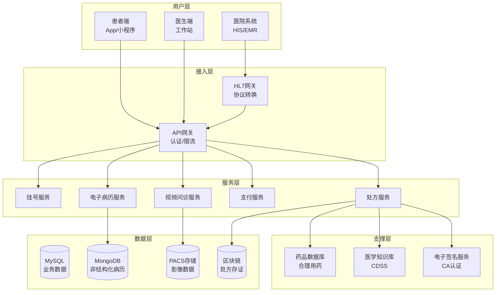
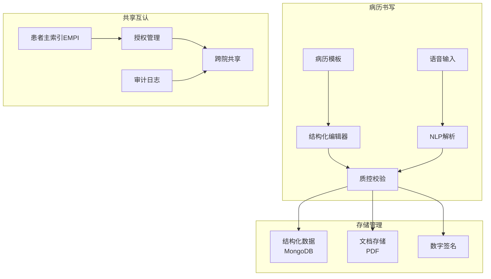
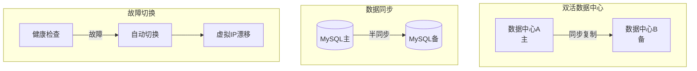

# 医疗系统架构案例

## 一、业务背景

医疗信息系统直接关系患者生命安全，对数据准确性、系统稳定性、隐私保护有极高要求。以某大型互联网医疗平台为例，服务超过10万家医疗机构，日接诊量超过100万人次，电子病历数据超过10亿份。

核心业务域：

- **预约挂号**：号源管理、排队叫号、医生排班
- **电子病历**：病历书写、结构化管理、共享互认
- **处方管理**：电子处方、合理用药、医保对接
- **远程医疗**：视频问诊、影像传输、会诊协作

技术挑战：

- **数据安全**：患者隐私保护、等保三级要求
- **高可用性**：7×24小时不间断服务
- **数据互通**：HL7/FHIR标准、医院异构系统对接
- **合规要求**：电子签名、数据留痕、审计追踪

## 二、架构设计

### 2.1 整体架构



### 2.2 电子病历架构



### 2.3 高可用架构



## 三、技术选型

| 组件 | 技术选型 | 选型理由 |
|------|---------|---------|
| 核心业务库 | MySQL + MGR | 强一致、高可用 |
| 文档存储 | MongoDB | 病历结构灵活 |
| 消息队列 | RabbitMQ | 可靠传输 |
| 缓存 | Redis Sentinel | 会话、号源 |
| 搜索 | Elasticsearch | 病历检索 |
| 视频 | WebRTC + SRS | 低延迟问诊 |
| 区块链 | Hyperledger Fabric | 处方存证 |

## 四、核心流程

### 4.1 挂号预约系统

```java
/**
 * 预约挂号服务 - 高并发号源管理
 */
@Service
public class RegistrationService {

    @Autowired
    private StringRedisTemplate redisTemplate;

    @Autowired
    private RegistrationRepository registrationRepository;

    @Autowired
    private DistributedLock lock;

    /**
     * 号源初始化 - 每日凌晨加载
     */
    @Scheduled(cron = "0 0 0 * * ?")
    public void initSchedule() {
        LocalDate targetDate = LocalDate.now().plusDays(8); // 提前8天放号

        List<DoctorSchedule> schedules = scheduleRepository
            .findByScheduleDate(targetDate);

        for (DoctorSchedule schedule : schedules) {
            String key = buildScheduleKey(schedule);

            // 使用Redis Bitmap存储号源
            redisTemplate.opsForValue().set(key + ":total",
                String.valueOf(schedule.getTotalSlots()));
            redisTemplate.opsForValue().set(key + ":remaining",
                String.valueOf(schedule.getTotalSlots()));

            // 初始化时间段位图
            for (TimeSlot slot : schedule.getTimeSlots()) {
                String slotKey = key + ":" + slot.getStartTime();
                redisTemplate.opsForValue().set(slotKey + ":total",
                    String.valueOf(slot.getCapacity()));
                redisTemplate.opsForValue().set(slotKey + ":remaining",
                    String.valueOf(slot.getCapacity()));
            }
        }
    }

    /**
     * 预约挂号线程安全实现
     */
    public RegistrationResult bookAppointment(BookRequest request) {
        String scheduleKey = buildScheduleKey(request);
        String lockKey = "lock:reg:" + scheduleKey;

        // 1. 获取分布式锁
        boolean locked = lock.tryLock(lockKey, 10, TimeUnit.SECONDS);
        if (!locked) {
            return RegistrationResult.fail("系统繁忙，请重试");
        }

        try {
            // 2. 检查患者是否已预约
            String patientKey = "patient:" + request.getPatientId() + ":appointments";
            Boolean hasAppointment = redisTemplate.opsForSet()
                .isMember(patientKey, scheduleKey);
            if (Boolean.TRUE.equals(hasAppointment)) {
                return RegistrationResult.fail("您已预约该时段");
            }

            // 3. 检查剩余号源
            String remainingKey = scheduleKey + ":remaining";
            Long remaining = redisTemplate.opsForValue()
                .decrement(remainingKey);

            if (remaining == null || remaining < 0) {
                // 回滚
                redisTemplate.opsForValue().increment(remainingKey);
                return RegistrationResult.fail("号源已售罄");
            }

            // 4. 创建预约记录
            Registration reg = Registration.builder()
                .registrationId(generateRegId())
                .patientId(request.getPatientId())
                .doctorId(request.getDoctorId())
                .scheduleDate(request.getDate())
                .timeSlot(request.getTimeSlot())
                .status(RegistrationStatus.CONFIRMED)
                .createTime(LocalDateTime.now())
                .build();

            registrationRepository.save(reg);

            // 5. 记录患者预约
            redisTemplate.opsForSet().add(patientKey, scheduleKey);
            redisTemplate.expire(patientKey, 30, TimeUnit.DAYS);

            // 6. 发送通知
            sendNotification(reg);

            return RegistrationResult.success(reg.getRegistrationId());

        } finally {
            lock.unlock(lockKey);
        }
    }

    /**
     * 取消预约
     */
    @Transactional
    public CancelResult cancelAppointment(String registrationId, String reason) {
        Registration reg = registrationRepository.findById(registrationId)
            .orElseThrow(() -> new NotFoundException("预约记录不存在"));

        // 检查取消时间（就诊前2小时可取消）
        LocalDateTime appointmentTime = LocalDateTime.of(
            reg.getScheduleDate(), reg.getTimeSlot().getStartTime());
        if (LocalDateTime.now().plusHours(2).isAfter(appointmentTime)) {
            return CancelResult.fail("就诊前2小时内不可取消");
        }

        // 更新状态
        reg.setStatus(RegistrationStatus.CANCELLED);
        reg.setCancelReason(reason);
        reg.setCancelTime(LocalDateTime.now());
        registrationRepository.save(reg);

        // 释放号源
        String scheduleKey = buildScheduleKey(reg);
        redisTemplate.opsForValue().increment(scheduleKey + ":remaining");

        // 移除患者记录
        String patientKey = "patient:" + reg.getPatientId() + ":appointments";
        redisTemplate.opsForSet().remove(patientKey, scheduleKey);

        // 异步通知医生端
        eventPublisher.publish(new AppointmentCancelledEvent(reg));

        return CancelResult.success();
    }
}
```

### 4.2 电子病历系统

```java
/**
 * 电子病历服务 - 结构化存储与质控
 */
@Service
public class EMRService {

    @Autowired
    private MongoTemplate mongoTemplate;

    @Autowired
    private DigitalSignatureService signatureService;

    @Autowired
    private QualityControlService qcService;

    /**
     * 创建结构化病历
     */
    public EMRDocument createEMR(EMRCreateRequest request) {
        // 1. 获取患者主索引
        String mpiId = empiService.getOrCreateMPI(
            request.getPatientName(),
            request.getIdCard(),
            request.getPhone()
        );

        // 2. 构建结构化病历
        EMRDocument document = EMRDocument.builder()
            .documentId(generateDocId())
            .mpiId(mpiId)
            .visitId(request.getVisitId())
            .templateId(request.getTemplateId())
            .sections(parseSections(request.getContent()))
            .creatorId(request.getDoctorId())
            .creatorName(request.getDoctorName())
            .deptId(request.getDeptId())
            .createTime(LocalDateTime.now())
            .status(DocumentStatus.DRAFT)
            .build();

        // 3. 质控检查
        QCResult qcResult = qcService.check(document);
        document.setQcResult(qcResult);

        if (!qcResult.isPassed()) {
            document.setDefects(qcResult.getDefects());
        }

        // 4. 保存到MongoDB
        mongoTemplate.save(document, "emr_documents");

        return document;
    }

    /**
     * 病历提交与签名
     */
    public SubmitResult submitEMR(String documentId, String doctorId) {
        EMRDocument document = mongoTemplate.findById(documentId, EMRDocument.class);

        // 1. 最终质控
        QCResult qcResult = qcService.finalCheck(document);
        if (!qcResult.isPassed()) {
            return SubmitResult.fail("质控未通过：" + qcResult.getDefects());
        }

        // 2. 电子签名
        String signData = serializeForSign(document);
        DigitalSignature signature = signatureService.sign(
            doctorId,
            signData,
            SignatureType.DOCTOR_SIGNATURE
        );

        document.setSignature(signature);
        document.setStatus(DocumentStatus.SIGNED);
        document.setSubmitTime(LocalDateTime.now());

        // 3. 更新保存
        mongoTemplate.save(document);

        // 4. 同步到临床数据中心
        cdrService.syncToCDR(document);

        // 5. 记录审计日志
        auditService.log(AuditAction.EMR_SUBMIT, documentId, doctorId);

        return SubmitResult.success();
    }

    /**
     * 病历共享查询 - 患者授权验证
     */
    public EMRDocument getSharedEMR(String documentId, String requesterId,
                                     String patientToken) {
        // 1. 验证患者授权
        Consent consent = consentService.verifyToken(patientToken);
        if (consent == null || consent.isExpired()) {
            throw new UnauthorizedException("授权已过期或无效");
        }

        // 2. 验证请求者在授权范围内
        if (!consent.getAuthorizedProviders().contains(requesterId)) {
            throw new UnauthorizedException("不在授权范围内");
        }

        // 3. 查询病历
        EMRDocument document = mongoTemplate.findById(documentId, EMRDocument.class);

        // 4. 记录访问日志
        auditService.logAccess(AccessLog.builder()
            .documentId(documentId)
            .requesterId(requesterId)
            .requesterType(RequesterType.EXTERNAL)
            .accessTime(LocalDateTime.now())
            .consentId(consent.getId())
            .purpose(consent.getPurpose())
            .build());

        // 5. 脱敏处理（根据授权级别）
        return desensitize(document, consent.getAccessLevel());
    }

    /**
     * NLP病历解析
     */
    public StructuredData parseNLP(String rawText) {
        // 调用NLP服务提取结构化信息
        NLPRawResult nlpResult = nlpService.parse(rawText);

        return StructuredData.builder()
            .chiefComplaint(extractChiefComplaint(nlpResult))
            .presentIllness(extractPresentIllness(nlpResult))
            .pastHistory(extractPastHistory(nlpResult))
            .diagnoses(extractDiagnoses(nlpResult))
            .medications(extractMedications(nlpResult))
            .confidence(nlpResult.getConfidence())
            .build();
    }
}
```

### 4.3 处方管理与流转

```java
/**
 * 电子处方服务 - 合理用药审核
 */
@Service
public class PrescriptionService {

    @Autowired
    private DrugDatabase drugDb;

    @Autowired
    private CDSSService cdssService;

    @Autowired
    private BlockchainService blockchainService;

    /**
     * 处方创建与审核
     */
    public PrescriptionResult createPrescription(PrescriptionRequest request) {
        // 1. 构建处方
        Prescription rx = Prescription.builder()
            .rxId(generateRxId())
            .patientId(request.getPatientId())
            .diagnosis(request.getDiagnosis())
            .items(request.getItems().stream()
                .map(this::buildRxItem)
                .collect(Collectors.toList()))
            .doctorId(request.getDoctorId())
            .createTime(LocalDateTime.now())
            .build();

        // 2. 合理用药审核（前置审方）
        ReviewResult review = cdssService.review(rx);

        if (review.hasErrors()) {
            return PrescriptionResult.fail("审方未通过", review.getAlerts());
        }

        if (review.hasWarnings()) {
            rx.setWarnings(review.getAlerts());
        }

        // 3. 医生双签名（针对特殊药品）
        if (containsControlledDrug(rx)) {
            rx.setRequiresSupervisorSign(true);
        }

        // 4. 保存处方
        prescriptionRepository.save(rx);

        // 5. 区块链存证
        String txHash = blockchainService.storeRxEvidence(rx);
        rx.setBlockchainTxHash(txHash);

        return PrescriptionResult.success(rx.getRxId());
    }

    /**
     * 处方审核规则检查
     */
    private ReviewResult performReview(Prescription rx) {
        List<Alert> alerts = new ArrayList<>();

        // 获取患者用药历史
        List<Medication> patientHistory = getPatientMedicationHistory(rx.getPatientId());

        for (RxItem item : rx.getItems()) {
            Drug drug = drugDb.getDrug(item.getDrugId());

            // 1. 禁忌症检查
            List<Contraindication> contras = drugDb.checkContraindications(
                drug, rx.getDiagnosisCodes());
            if (!contras.isEmpty()) {
                alerts.add(Alert.error("禁忌症", contras));
            }

            // 2. 药物相互作用
            for (Medication hist : patientHistory) {
                Interaction interaction = drugDb.checkInteraction(
                    drug.getDrugId(), hist.getDrugId());
                if (interaction != null && interaction.isSevere()) {
                    alerts.add(Alert.error("药物相互作用", interaction));
                }
            }

            // 3. 重复用药
            if (patientHistory.stream().anyMatch(h ->
                h.getDrugId().equals(drug.getDrugId()))) {
                alerts.add(Alert.warning("重复用药", drug.getName()));
            }

            // 4. 剂量范围检查
            if (item.getDosage() > drug.getMaxDailyDose()) {
                alerts.add(Alert.error("超剂量", item));
            }

            // 5. 特殊人群检查
            Patient patient = patientService.getById(rx.getPatientId());
            if (patient.isPregnant() && drug.isContraindicatedInPregnancy()) {
                alerts.add(Alert.error("孕妇禁忌", drug.getName()));
            }
            if (patient.getAge() < 18 && !drug.isPediatricSafe()) {
                alerts.add(Alert.warning("儿童慎用", drug.getName()));
            }
        }

        return new ReviewResult(alerts);
    }

    /**
     * 处方流转到外配药房
     */
    public TransferResult transferToPharmacy(String rxId, String pharmacyId) {
        Prescription rx = prescriptionRepository.findById(rxId)
            .orElseThrow(() -> new NotFoundException("处方不存在"));

        // 1. 验证处方状态
        if (rx.getStatus() != PrescriptionStatus.SIGNED) {
            return TransferResult.fail("处方未审核或已失效");
        }

        // 2. 验证药房资质
        Pharmacy pharmacy = pharmacyService.getById(pharmacyId);
        if (!pharmacy.canDispense(rx)) {
            return TransferResult.fail("该药房无法配此处方");
        }

        // 3. 生成流转单
        RxTransfer transfer = RxTransfer.builder()
            .transferId(generateTransferId())
            .rxId(rxId)
            .pharmacyId(pharmacyId)
            .status(TransferStatus.PENDING)
            .createTime(LocalDateTime.now())
            .expireTime(LocalDateTime.now().plusHours(24)) // 24小时有效
            .build();

        transferRepository.save(transfer);

        // 4. 加密传输到处方
        String encryptedRx = encryptForPharmacy(rx, pharmacy.getPublicKey());
        pharmacyService.receiveRx(pharmacyId, encryptedRx);

        // 5. 更新处方状态
        rx.setStatus(PrescriptionStatus.TRANSFERRED);
        prescriptionRepository.save(rx);

        return TransferResult.success(transfer.getTransferId());
    }
}
```

## 五、经验总结

### 5.1 医疗数据安全

| 措施 | 实现 | 合规要求 |
|------|------|---------|
| 数据加密 | AES-256 + 国密SM4 | 等保三级 |
| 访问控制 | RBAC + 患者授权 | 《个人信息保护法》 |
| 审计追踪 | 全量操作日志 | 《电子病历应用管理规范》 |
| 数据脱敏 | 动态脱敏引擎 | 《数据安全法》 |

### 5.2 高可用设计

1. **同城双活**：RPO=0，RTO<60秒
2. **数据库高可用**：MySQL MGR，自动故障转移
3. **限流降级**：号源查询优先，挂号可降级
4. **灾备演练**：季度切换演练

### 5.3 互联互通标准

| 标准 | 用途 | 实现 |
|------|------|------|
| HL7 FHIR | 数据交换 | 资源映射 |
| IHE | 影像共享 | XDS.b协议 |
| 电子病历评级 | 系统建设 | 4级/5级/6级标准 |

---

> **扩展阅读**：
>
> - [HL7 FHIR标准](https://www.hl7.org/fhir/)
> - [电子病历系统应用水平分级评价](http://www.nhc.gov.cn/)
