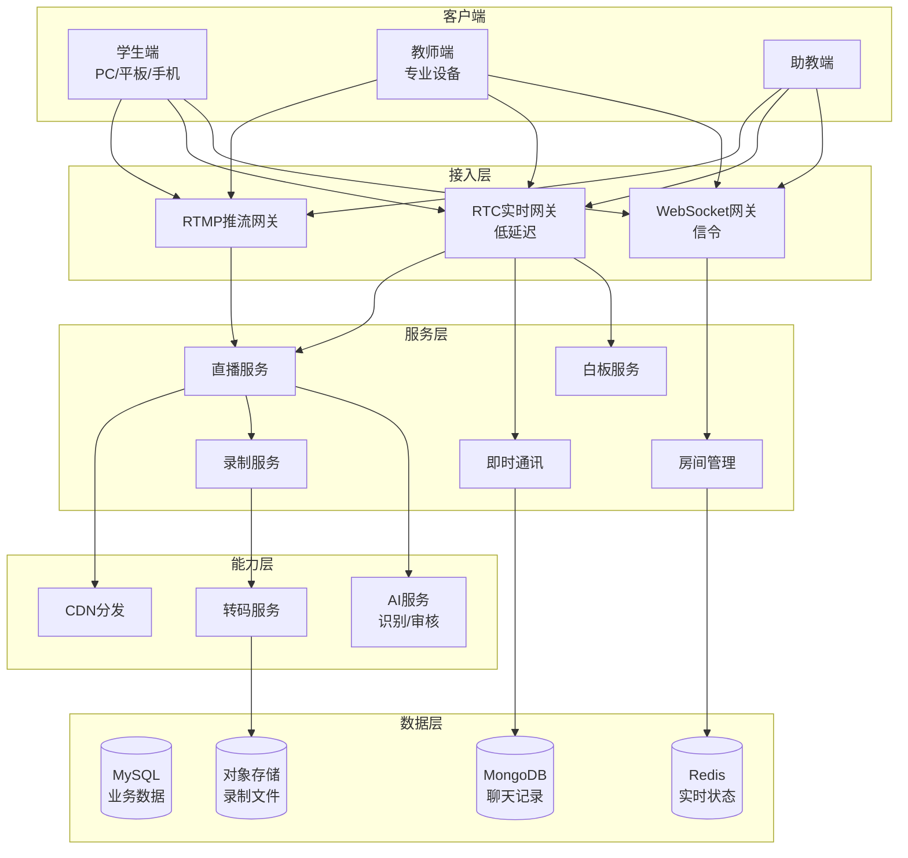
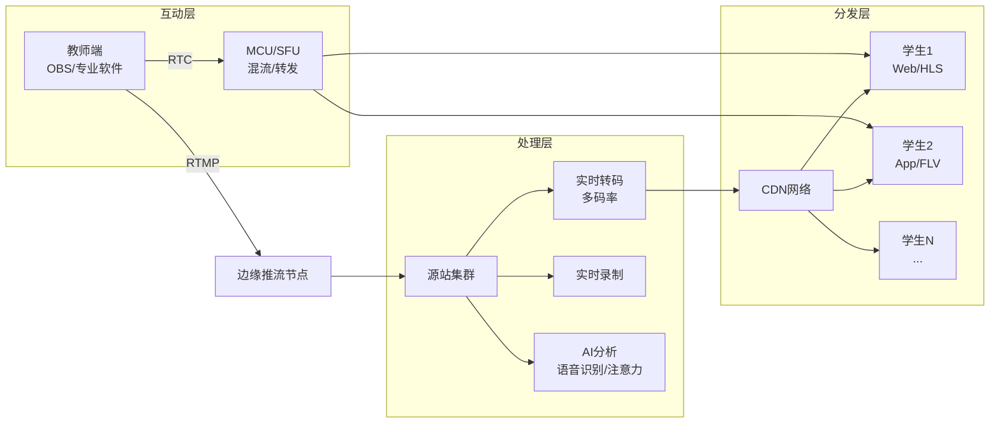
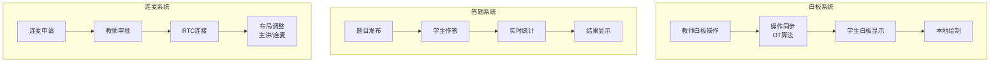

# 在线教育架构案例

## 一、业务背景

在线教育是教育数字化的核心载体，以某头部在线教育平台为例，日活用户超过1000万，同时在售课程超过10万门，直播课程日均超过5万场，覆盖K12、职业教育、语言学习等多个领域。

核心业务场景：

- **直播课堂**：大班课、小班课、1对1教学
- **互动教学**：白板、连麦、答题器、红包雨
- **录播点播**：课程录制、智能剪辑、倍速播放
- **学习系统**：进度追踪、作业批改、智能推荐

技术挑战：

- **高并发直播**：单课堂支持10万人同时在线
- **低延迟互动**：师生互动延迟<300ms
- **内容安全**：AI内容审核、版权保护
- **学习效果**：注意力分析、学习数据挖掘

## 二、架构设计

### 2.1 整体架构



### 2.2 直播课堂架构



### 2.3 互动教学组件



## 三、技术选型

| 组件 | 技术选型 | 选型理由 |
|------|---------|---------|
| 推流协议 | RTMP/SRT | 稳定、低延迟 |
| 实时通信 | WebRTC | 浏览器原生支持 |
| 媒体服务器 | SRS/Mediasoup | 开源、高性能 |
| 白板 | OT.js + Canvas | 协同编辑算法 |
| 信令 | WebSocket + Protobuf | 高效传输 |
| 消息队列 | Kafka | 削峰、异步 |
| 录制 | FFmpeg + MP4 | 标准格式 |

## 四、核心流程

### 4.1 直播课堂管理

```java
/**
 * 直播课堂服务
 */
@Service
public class LiveClassService {

    @Autowired
    private RoomManager roomManager;

    @Autowired
    private MediaServerService mediaService;

    @Autowired
    private RedisTemplate<String, Object> redisTemplate;

    /**
     * 创建直播课堂
     */
    public LiveRoom createLiveRoom(CreateRoomRequest request) {
        // 1. 生成房间信息
        String roomId = generateRoomId();

        // 2. 分配媒体服务器
        MediaServer server = mediaService.allocateServer(
            request.getExpectedAudience(),
            request.getRoomType()
        );

        // 3. 创建房间配置
        LiveRoom room = LiveRoom.builder()
            .roomId(roomId)
            .courseId(request.getCourseId())
            .teacherId(request.getTeacherId())
            .title(request.getTitle())
            .scheduledStartTime(request.getStartTime())
            .expectedDuration(request.getDuration())
            .maxAudience(request.getMaxAudience())
            .roomType(request.getRoomType()) // LARGE_CLASS/SMALL_CLASS/ONE_ON_ONE
            .mediaServer(server)
            .streamKey(generateStreamKey())
            .status(RoomStatus.CREATED)
            .build();

        // 4. 初始化房间状态
        roomManager.createRoom(room);

        // 5. 生成推流/播放地址
        room.setPushUrl(buildPushUrl(server, room.getStreamKey()));
        room.setPlayUrls(buildPlayUrls(roomId, server));

        return room;
    }

    /**
     * 学生进入直播间
     */
    public JoinResult joinRoom(String roomId, Long userId, JoinRequest request) {
        LiveRoom room = roomManager.getRoom(roomId);

        // 1. 检查房间状态
        if (room.getStatus() != RoomStatus.LIVE &&
            room.getStatus() != RoomStatus.PREVIEW) {
            return JoinResult.fail("房间未开启");
        }

        // 2. 检查人数限制
        long currentAudience = roomManager.getAudienceCount(roomId);
        if (currentAudience >= room.getMaxAudience()) {
            return JoinResult.fail("房间已满");
        }

        // 3. 检查课程权限
        if (!checkCourseAccess(userId, room.getCourseId())) {
            return JoinResult.fail("无课程权限");
        }

        // 4. 加入房间
        RoomMember member = RoomMember.builder()
            .userId(userId)
            .nickname(request.getNickname())
            .role(request.isAssistant() ? Role.ASSISTANT : Role.STUDENT)
            .joinTime(System.currentTimeMillis())
            .build();

        roomManager.addMember(roomId, member);

        // 5. 记录学习时长起点
        redisTemplate.opsForValue().set(
            "study:start:" + roomId + ":" + userId,
            System.currentTimeMillis(),
            room.getExpectedDuration() + 3600, TimeUnit.SECONDS
        );

        // 6. 获取最佳播放地址
        PlayConfig playConfig = getOptimalPlayConfig(userId, room);

        // 7. 发送进入通知
        notifyRoom(roomId, new MemberJoinEvent(member));

        return JoinResult.builder()
            .roomId(roomId)
            .memberId(member.getMemberId())
            .playConfig(playConfig)
            .imToken(generateIMToken(roomId, userId))
            .whiteboardToken(generateWBToken(roomId, userId))
            .build();
    }

    /**
     * 学生申请连麦
     */
    public MicApplyResult applyForMic(String roomId, Long userId, MicApplyRequest request) {
        LiveRoom room = roomManager.getRoom(roomId);

        // 1. 检查是否允许连麦
        if (!room.isMicEnabled()) {
            return MicApplyResult.fail("当前不允许连麦");
        }

        // 2. 检查当前连麦人数
        int currentMicCount = roomManager.getMicCount(roomId);
        if (currentMicCount >= room.getMaxMicCount()) {
            return MicApplyResult.fail("连麦人数已满");
        }

        // 3. 创建申请
        MicApplication application = MicApplication.builder()
            .applyId(generateApplyId())
            .roomId(roomId)
            .userId(userId)
            .reason(request.getReason())
            .applyTime(System.currentTimeMillis())
            .status(ApplyStatus.PENDING)
            .build();

        roomManager.addMicApplication(roomId, application);

        // 4. 通知教师
        notifyTeacher(room.getTeacherId(), new MicApplyNotification(application));

        return MicApplyResult.success(application.getApplyId());
    }

    /**
     * 教师审批连麦
     */
    public MicHandleResult handleMicApply(String roomId, String applyId,
                                          boolean approve, Long teacherId) {
        MicApplication application = roomManager.getMicApplication(roomId, applyId);

        if (approve) {
            // 生成RTC token
            String rtcToken = mediaService.generateRtcToken(
                roomId,
                application.getUserId(),
                RtcRole.PUBLISHER
            );

            application.setStatus(ApplyStatus.APPROVED);
            application.setRtcToken(rtcToken);

            // 通知学生
            notifyUser(application.getUserId(),
                new MicApprovedEvent(roomId, rtcToken));

            // 更新房间布局
            roomManager.updateLayout(roomId, LayoutMode.TEACHER_STUDENT);
        } else {
            application.setStatus(ApplyStatus.REJECTED);
            notifyUser(application.getUserId(),
                new MicRejectedEvent(roomId, "教师拒绝了连麦申请"));
        }

        return MicHandleResult.success();
    }

    /**
     * 发布互动题目
     */
    public QuizResult publishQuiz(String roomId, Long teacherId, Quiz quiz) {
        // 1. 保存题目
        quiz.setQuizId(generateQuizId());
        quiz.setRoomId(roomId);
        quiz.setPublishTime(System.currentTimeMillis());
        quiz.setStatus(QuizStatus.PUBLISHED);

        quizRepository.save(quiz);

        // 2. 广播题目到房间
        broadcastToRoom(roomId, new QuizPublishedEvent(quiz));

        // 3. 启动答题计时
        if (quiz.getTimeLimit() > 0) {
            scheduleQuizClose(roomId, quiz.getQuizId(), quiz.getTimeLimit());
        }

        return QuizResult.success(quiz.getQuizId());
    }

    /**
     * 提交答案
     */
    public AnswerResult submitAnswer(String roomId, String quizId,
                                      Long userId, List<Integer> answers) {
        // 1. 检查答题时间
        Quiz quiz = quizRepository.findById(quizId).orElseThrow();
        if (quiz.getStatus() != QuizStatus.PUBLISHED) {
            return AnswerResult.fail("答题已结束");
        }

        // 2. 记录答案
        AnswerRecord record = AnswerRecord.builder()
            .recordId(generateRecordId())
            .quizId(quizId)
            .userId(userId)
            .answers(answers)
            .submitTime(System.currentTimeMillis())
            .build();

        // 3. 实时统计
        boolean correct = checkAnswer(quiz, answers);
        record.setCorrect(correct);
        answerRepository.save(record);

        // 4. 更新实时统计
        updateQuizStats(quizId, correct);

        return AnswerResult.success(correct);
    }
}
```

### 4.2 白板协同编辑

```java
/**
 * 协同白板服务 - 基于OT算法
 */
@Service
public class WhiteboardService {

    @Autowired
    private WhiteboardRepository wbRepository;

    @Autowired
    private RedisTemplate<String, Operation> redisTemplate;

    /**
     * 应用白板操作
     */
    public void applyOperation(String roomId, String userId, Operation op) {
        String docId = "wb:" + roomId;

        // 1. 获取文档当前版本
        Long currentVersion = getCurrentVersion(docId);

        // 2. 转换操作（OT算法核心）
        List<Operation> concurrentOps = getConcurrentOperations(docId, op.getVersion());
        Operation transformedOp = op;
        for (Operation concurrent : concurrentOps) {
            transformedOp = transform(transformedOp, concurrent);
        }

        // 3. 应用操作
        applyTransformedOp(docId, transformedOp);

        // 4. 更新版本
        long newVersion = incrementVersion(docId);
        transformedOp.setVersion(newVersion);

        // 5. 存储操作历史
        saveOperation(docId, transformedOp);

        // 6. 广播给其他客户端
        broadcastToOthers(roomId, userId, transformedOp);
    }

    /**
     * OT转换 - 处理并发操作冲突
     */
    private Operation transform(Operation op1, Operation op2) {
        // 插入 vs 插入
        if (op1.getType() == OpType.INSERT && op2.getType() == OpType.INSERT) {
            if (op1.getPosition() > op2.getPosition()) {
                op1.setPosition(op1.getPosition() + op2.getContent().length());
            }
        }
        // 插入 vs 删除
        else if (op1.getType() == OpType.INSERT && op2.getType() == OpType.DELETE) {
            if (op1.getPosition() > op2.getPosition()) {
                op1.setPosition(op1.getPosition() - op2.getLength());
            }
        }
        // 删除 vs 插入
        else if (op1.getType() == OpType.DELETE && op2.getType() == OpType.INSERT) {
            if (op1.getPosition() >= op2.getPosition()) {
                op1.setPosition(op1.getPosition() + op2.getContent().length());
            }
        }
        // 删除 vs 删除
        else if (op1.getType() == OpType.DELETE && op2.getType() == OpType.DELETE) {
            if (op1.getPosition() > op2.getPosition()) {
                op1.setPosition(op1.getPosition() - op2.getLength());
            }
        }

        return op1;
    }

    /**
     * 获取白板快照
     */
    public WhiteboardSnapshot getSnapshot(String roomId, Long version) {
        String docId = "wb:" + roomId;

        // 1. 获取基础快照
        WhiteboardSnapshot baseSnapshot = wbRepository.getLatestSnapshot(docId);

        if (baseSnapshot == null) {
            baseSnapshot = WhiteboardSnapshot.empty(docId);
        }

        // 2. 获取增量操作
        List<Operation> operations = getOperationsAfter(docId, baseSnapshot.getVersion());

        // 3. 应用操作到快照
        SnapshotBuilder builder = new SnapshotBuilder(baseSnapshot);
        for (Operation op : operations) {
            if (version == null || op.getVersion() <= version) {
                builder.apply(op);
            }
        }

        return builder.build();
    }

    /**
     * 光标位置同步（非关键操作，允许丢失）
     */
    public void syncCursor(String roomId, String userId, CursorPosition cursor) {
        // 使用UDP或低可靠信道
        String channel = "cursor:" + roomId;
        redisTemplate.convertAndSend(channel,
            new CursorSyncEvent(userId, cursor));
    }
}
```

### 4.3 AI课堂分析

```java
/**
 * AI课堂分析服务
 */
@Service
public class AIClassroomService {

    @Autowired
    private SpeechRecognitionService asrService;

    @Autowired
    private FaceAnalysisService faceService;

    @Autowired
    private ContentModerationService moderationService;

    /**
     * 实时语音转写
     */
    public void processAudioStream(String roomId, InputStream audioStream) {
        asrService.recognizeStream(audioStream, new ASRCallback() {
            @Override
            public void onResult(String text, boolean isFinal) {
                // 保存转写结果
                Transcript transcript = Transcript.builder()
                    .roomId(roomId)
                    .text(text)
                    .timestamp(System.currentTimeMillis())
                    .isFinal(isFinal)
                    .build();

                transcriptRepository.save(transcript);

                // 实时字幕推送
                broadcastSubtitle(roomId, text);

                // 内容审核
                if (isFinal) {
                    moderationService.checkAsync(text, result -> {
                        if (result.isViolation()) {
                            alertModerator(roomId, text, result);
                        }
                    });
                }
            }
        });
    }

    /**
     * 学生注意力分析
     */
    public AttentionReport analyzeAttention(String roomId, String userId,
                                            byte[] videoFrame) {
        // 1. 人脸检测
        List<FaceDetection> faces = faceService.detectFaces(videoFrame);

        if (faces.isEmpty()) {
            return AttentionReport.builder()
                .userId(userId)
                .attentionLevel(AttentionLevel.ABSENT)
                .confidence(1.0)
                .build();
        }

        FaceDetection mainFace = faces.get(0);

        // 2. 视线方向检测
        GazeDirection gaze = faceService.detectGaze(videoFrame, mainFace);

        // 3. 头部姿态
        HeadPose pose = faceService.detectHeadPose(videoFrame, mainFace);

        // 4. 表情分析
        Expression expression = faceService.analyzeExpression(videoFrame, mainFace);

        // 5. 综合判断注意力等级
        AttentionLevel level = calculateAttentionLevel(gaze, pose, expression);

        return AttentionReport.builder()
            .userId(userId)
            .roomId(roomId)
            .timestamp(System.currentTimeMillis())
            .attentionLevel(level)
            .gazeDirection(gaze)
            .headPose(pose)
            .expression(expression)
            .confidence(mainFace.getConfidence())
            .build();
    }

    private AttentionLevel calculateAttentionLevel(GazeDirection gaze,
                                                    HeadPose pose,
                                                    Expression expression) {
        // 视线在屏幕范围内
        boolean lookingAtScreen = gaze.getPitch() > -30 && gaze.getPitch() < 30 &&
            gaze.getYaw() > -45 && gaze.getYaw() < 45;

        // 头部姿态正常
        boolean normalPose = Math.abs(pose.getPitch()) < 30 &&
            Math.abs(pose.getYaw()) < 45;

        // 表情活跃
        boolean activeExpression = expression != Expression.SLEEPY &&
            expression != Expression.NEUTRAL;

        if (lookingAtScreen && normalPose) {
            return activeExpression ? AttentionLevel.HIGH : AttentionLevel.MEDIUM;
        } else if (lookingAtScreen || normalPose) {
            return AttentionLevel.LOW;
        } else {
            return AttentionLevel.ABSENT;
        }
    }
}
```

## 五、经验总结

### 5.1 直播质量保障

| 指标 | 目标 | 优化手段 |
|------|------|---------|
| 首帧时间 | <1s | GOP缓存、就近接入 |
| 卡顿率 | <1% | 智能码率、缓冲策略 |
| 延迟 | <3s | CDN优化、协议选择 |
| 互动延迟 | <300ms | WebRTC、边缘节点 |

### 5.2 成本优化策略

1. **带宽成本**：
   - 直播P2P节省30%
   - H.265编码节省50%码率
   - 智能断线检测，减少无效流量

2. **存储成本**：
   - 热课程SSD，冷课程归档
   - AI智能剪辑，只存精华片段

### 5.3 安全与合规

| 场景 | 措施 | 工具 |
|------|------|------|
| 内容审核 | AI+人工 | 阿里云绿网 |
| 版权保护 | DRM加密 | 自研DRM |
| 数据安全 | 加密传输存储 | TLS1.3 |
| 实名认证 | 人脸识别 | 活体检测 |

---

> **扩展阅读**：
>
> - [WebRTC官方文档](https://webrtc.org/)
> - [SRS流媒体服务器](https://ossrs.net/)
