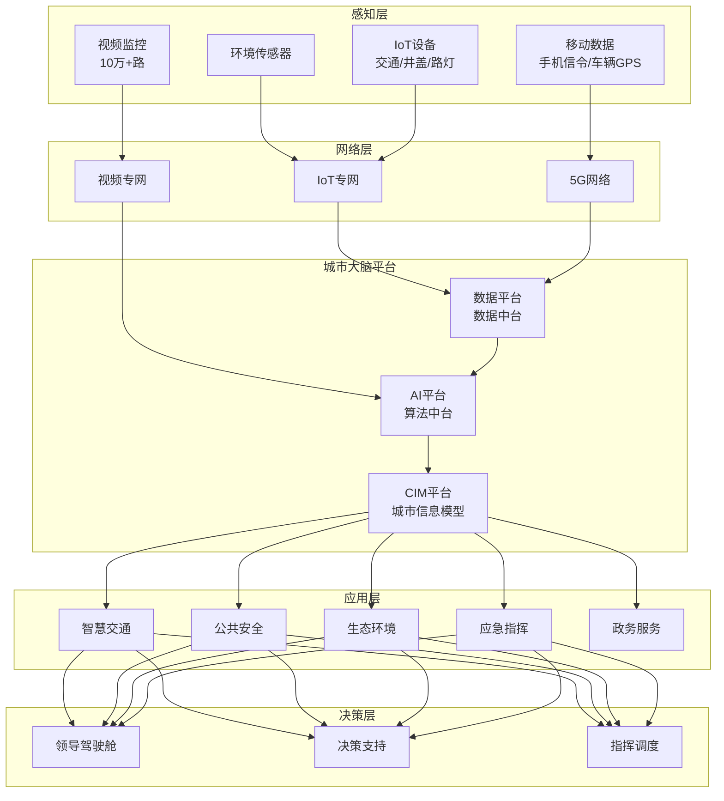
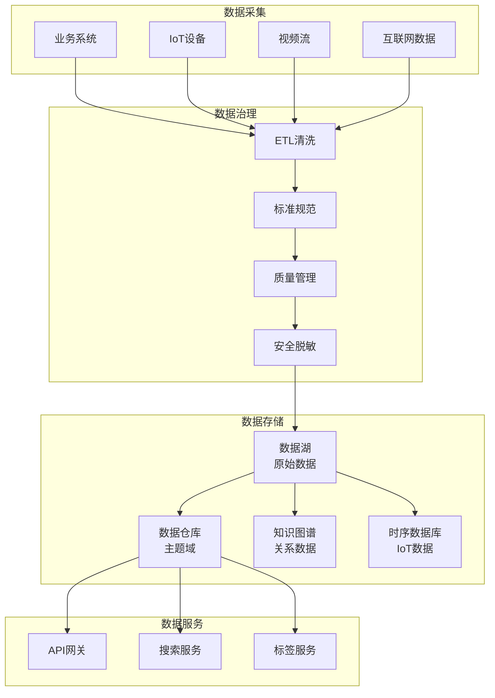
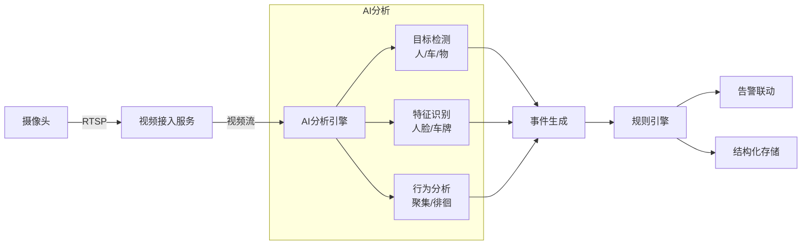

# 智慧城市架构案例

## 一、业务背景

智慧城市是城市数字化转型的重要方向，以某超大城市为例，管理人口超过2000万，日均城市运行数据超过10PB，涉及交通、环保、安防、应急等多个城市治理领域。

核心业务域：

- **城市大脑**：城市运行态势感知、决策支持
- **智慧交通**：信号优化、拥堵预测、公交优先
- **公共安全**：视频监控、事件检测、应急指挥
- **城市治理**：网格化管理、市民服务、政务协同

技术挑战：

- **多源异构数据**：视频、IoT、政务系统数据融合
- **实时决策**：交通信号秒级响应
- **海量视频**：10万+路视频实时分析
- **跨部门协同**：打破数据孤岛

## 二、架构设计

### 2.1 整体架构



### 2.2 城市大脑数据架构



### 2.3 视频分析架构



## 三、技术选型

| 组件 | 技术选型 | 选型理由 |
|------|---------|---------|
| 流计算 | Flink | 复杂事件处理 |
| 视频分析 | TensorRT + 自研 | GPU加速 |
| 时序数据库 | TDengine | 海量IoT数据 |
| 图数据库 | Neo4j | 关系分析 |
| 数据湖 | Iceberg | 开放标准 |
| 容器平台 | Kubernetes | 弹性调度 |
| 地图引擎 | 自研 + 高德 | 城市级渲染 |

## 四、核心流程

### 4.1 交通信号优化

```java
/**
 * 自适应信号控制服务
 */
@Service
public class TrafficSignalService {

    @Autowired
    private TrafficFlowDetector flowDetector;

    @Autowired
    private SignalOptimizer optimizer;

    @Autowired
    private SignalController signalController;

    /**
     * 实时信号优化 - 每5分钟执行
     */
    @Scheduled(fixedRate = 300000)
    public void optimizeSignals() {
        // 1. 获取所有路口
        List<Intersection> intersections = intersectionRepository.findAll();

        for (Intersection intersection : intersections) {
            try {
                optimizeIntersection(intersection);
            } catch (Exception e) {
                log.error("路口优化失败: {}", intersection.getId(), e);
            }
        }
    }

    private void optimizeIntersection(Intersection intersection) {
        // 1. 获取实时流量数据
        TrafficFlow flow = flowDetector.getCurrentFlow(intersection.getId());

        // 2. 预测未来5分钟流量
        TrafficPrediction prediction = predictFlow(intersection, flow);

        // 3. 计算最优配时方案
        SignalTiming optimalTiming = optimizer.calculate(
            intersection,
            flow,
            prediction,
            OptimizationGoal.MIN_DELAY // 最小化延误
        );

        // 4. 评估优化效果
        double improvement = evaluateImprovement(
            intersection.getCurrentTiming(),
            optimalTiming,
            flow
        );

        // 5. 应用新方案（改善>15%才切换）
        if (improvement > 0.15) {
            signalController.applyTiming(intersection.getId(), optimalTiming);

            // 记录调整
            recordAdjustment(intersection, optimalTiming, improvement);
        }
    }

    /**
     * 区域协调控制 - 绿波带
     */
    public void coordinateCorridor(String corridorId) {
        List<Intersection> corridor = getCorridorIntersections(corridorId);

        // 1. 获取 corridor 总流量
        CorridorFlow flow = getCorridorFlow(corridor);

        // 2. 计算绿波带参数
        GreenWaveParams params = calculateGreenWave(corridor, flow);

        // 3. 为每个路口计算相位差
        double cycleLength = params.getCycleLength();
        double speed = params.getDesignSpeed();

        for (int i = 0; i < corridor.size(); i++) {
            Intersection intersection = corridor.get(i);

            // 计算与第一个路口的距离
            double distance = intersection.getDistanceFromStart();

            // 计算相位差（秒）
            double offset = (distance / speed) % cycleLength;

            // 应用协调控制
            SignalTiming timing = SignalTiming.builder()
                .cycleLength((int)cycleLength)
                .offset((int)offset)
                .splits(params.getSplitsFor(intersection))
                .build();

            signalController.applyTiming(intersection.getId(), timing);
        }
    }

    /**
     * 公交优先控制
     */
    public void busPriority(String intersectionId, String busId) {
        // 1. 获取公交车位置
        BusLocation bus = busService.getLocation(busId);

        // 2. 计算到达路口时间
        double distance = calculateDistance(bus, intersectionId);
        double arrivalTime = distance / bus.getCurrentSpeed();

        // 3. 如果即将到达且是红灯，插入优先相位
        if (arrivalTime < 30) { // 30秒内到达
            SignalStatus currentStatus = signalController.getStatus(intersectionId);

            if (currentStatus.getCurrentPhase() != Phase.BUS) {
                // 检查是否可以提前切换
                if (canTerminateEarly(currentStatus)) {
                    signalController.insertPriorityPhase(intersectionId, Phase.BUS, 15);
                }
            }
        }
    }
}
```

### 4.2 视频智能分析

```java
/**
 * 视频AI分析服务
 */
@Service
public class VideoAnalyticsService {

    @Autowired
    private VideoStreamManager streamManager;

    @Autowired
    private ObjectDetector objectDetector;

    @Autowired
    private EventGenerator eventGenerator;

    /**
     * 启动视频分析任务
     */
    public void startAnalysis(String cameraId, AnalysisConfig config) {
        // 1. 获取视频流
        VideoStream stream = streamManager.getStream(cameraId);

        // 2. 创建分析管道
        AnalysisPipeline pipeline = AnalysisPipeline.builder()
            .cameraId(cameraId)
            .detectors(buildDetectors(config))
            .callback(this::onDetectionResult)
            .build();

        // 3. 启动分析
        streamManager.startAnalysis(cameraId, pipeline);
    }

    /**
     * 检测回调处理
     */
    private void onDetectionResult(String cameraId, FrameResult result) {
        // 1. 检测目标
        List<DetectedObject> objects = result.getObjects();

        // 2. 轨迹跟踪
        updateTracks(cameraId, objects);

        // 3. 行为分析
        List<BehaviorEvent> events = analyzeBehaviors(cameraId, objects);

        // 4. 生成告警
        for (BehaviorEvent event : events) {
            if (event.getSeverity() >= config.getAlertThreshold()) {
                generateAlert(cameraId, event);
            }
        }

        // 5. 存储结构化数据
        storeStructuredData(cameraId, result);
    }

    /**
     * 人群聚集检测
     */
    public CrowdEvent detectCrowdGathering(String cameraId, List<DetectedObject> objects) {
        // 过滤人形目标
        List<DetectedObject> persons = objects.stream()
            .filter(o -> o.getClassId() == ObjectClass.PERSON)
            .collect(Collectors.toList());

        if (persons.size() < 10) {
            return null; // 人数不足
        }

        // DBSCAN聚类分析
        List<Cluster> clusters = dbscanCluster(persons, 2.0, 5);

        for (Cluster cluster : clusters) {
            if (cluster.getPoints().size() >= 10) {
                // 计算聚集持续时间
                String zoneId = getZoneId(cameraId, cluster.getCenter());
                GatheringRecord record = getOrCreateGatheringRecord(zoneId);
                record.addObservation(persons.size());

                if (record.getDuration() > 300) { // 持续5分钟
                    return CrowdEvent.builder()
                        .cameraId(cameraId)
                        .location(cluster.getCenter())
                        .peopleCount(cluster.getPoints().size())
                        .duration(record.getDuration())
                        .severity(calculateSeverity(cluster))
                        .build();
                }
            }
        }

        return null;
    }

    /**
     * 异常行为检测
     */
    public List<BehaviorEvent> detectAnomalousBehaviors(String cameraId,
                                                         Track track) {
        List<BehaviorEvent> events = new ArrayList<>();

        // 1. 徘徊检测
        if (isLoitering(track)) {
            events.add(BehaviorEvent.builder()
                .type(BehaviorType.LOITERING)
                .trackId(track.getId())
                .location(track.getCurrentPosition())
                .confidence(0.85)
                .build());
        }

        // 2. 奔跑检测
        if (isRunning(track)) {
            events.add(BehaviorEvent.builder()
                .type(BehaviorType.RUNNING)
                .trackId(track.getId())
                .location(track.getCurrentPosition())
                .velocity(track.getVelocity())
                .build());
        }

        // 3. 越界检测
        if (isBoundaryViolation(track)) {
            events.add(BehaviorEvent.builder()
                .type(BehaviorType.BOUNDARY_VIOLATION)
                .trackId(track.getId())
                .location(track.getCurrentPosition())
                .build());
        }

        // 4. 打架检测（多人交互）
        if (isFighting(track)) {
            events.add(BehaviorEvent.builder()
                .type(BehaviorType.FIGHTING)
                .trackId(track.getId())
                .severity(10)
                .build());
        }

        return events;
    }

    private boolean isLoitering(Track track) {
        // 在较小区域内长时间停留
        double area = calculateBoundingArea(track.getHistory());
        long duration = track.getDuration();

        return area < 10.0 && duration > 300; // 10平米内停留5分钟
    }
}
```

### 4.3 应急指挥调度

```java
/**
 * 应急指挥服务
 */
@Service
public class EmergencyCommandService {

    @Autowired
    private EventCorrelationService correlationService;

    @Autowired
    private ResourceDispatchService dispatchService;

    @Autowired
    private CIMService cimService;

    /**
     * 应急响应启动
     */
    public EmergencyResponse startEmergencyResponse(EmergencyEvent event) {
        // 1. 事件定级
        EmergencyLevel level = assessEmergencyLevel(event);

        // 2. 创建应急响应
        EmergencyResponse response = EmergencyResponse.builder()
            .responseId(generateResponseId())
            .eventId(event.getId())
            .level(level)
            .startTime(System.currentTimeMillis())
            .commander(assignCommander(level))
            .status(ResponseStatus.ACTIVE)
            .build();

        // 3. 关联相关事件
        List<EmergencyEvent> relatedEvents = correlationService
            .findRelatedEvents(event);
        response.setRelatedEvents(relatedEvents);

        // 4. 启动资源调度
        ResourcePlan plan = dispatchService.createResourcePlan(event, level);
        response.setResourcePlan(plan);

        // 5. 启动联动机制
        activateCoordinationMechanism(response);

        // 6. 通知相关部门
        notifyDepartments(response);

        return responseRepository.save(response);
    }

    /**
     * 智能资源调度
     */
    public DispatchPlan optimizeDispatch(String incidentLocation,
                                         EmergencyType type,
                                         ResourceRequirements requirements) {
        // 1. 获取可用资源
        List<Resource> availableResources = resourceService
            .findAvailableResources(type, incidentLocation, 50); // 50km范围

        // 2. 计算到达时间
        for (Resource resource : availableResources) {
            double eta = calculateETA(resource.getLocation(), incidentLocation);
            resource.setEstimatedArrival(eta);
        }

        // 3. 多目标优化
        DispatchOptimizer optimizer = new DispatchOptimizer();
        optimizer.setObjectives(
            Objective.MIN_RESPONSE_TIME,
            Objective.MIN_RESOURCE_COST,
            Objective.BALANCE_WORKLOAD
        );

        optimizer.setConstraints(
            new Constraint<>(r -> r.getEstimatedArrival() < requirements.getMaxResponseTime()),
            new Constraint<>(r -> r.getCapability() >= requirements.getMinCapability())
        );

        DispatchPlan plan = optimizer.optimize(availableResources, requirements);

        // 4. 路径规划
        for (DispatchAssignment assignment : plan.getAssignments()) {
            Route route = routingService.findOptimalRoute(
                assignment.getResource().getLocation(),
                incidentLocation,
                RoutePreference.FASTEST
            );
            assignment.setRoute(route);
        }

        return plan;
    }

    /**
     * CIM场景还原
     */
    public CIMScene buildCIMScene(String incidentLocation, double radius) {
        // 1. 获取地形数据
        TerrainData terrain = cimService.getTerrain(incidentLocation, radius);

        // 2. 获取建筑信息
        List<Building> buildings = cimService.getBuildings(incidentLocation, radius);

        // 3. 获取地下管网
        List<UtilityNetwork> utilities = cimService.getUtilityNetworks(
            incidentLocation, radius);

        // 4. 获取人口分布
        PopulationDistribution population = cimService
            .getPopulationDistribution(incidentLocation, radius);

        // 5. 获取实时监控
        List<VideoStream> videos = videoService.getNearbyCameras(
            incidentLocation, radius);

        return CIMScene.builder()
            .center(incidentLocation)
            .radius(radius)
            .terrain(terrain)
            .buildings(buildings)
            .utilities(utilities)
            .population(population)
            .videoStreams(videos)
            .build();
    }
}
```

## 五、经验总结

### 5.1 城市数据治理

| 挑战 | 解决方案 | 效果 |
|------|---------|------|
| 数据孤岛 | 数据中台 + API网关 | 50+系统互联互通 |
| 数据质量 | 数据血缘 + 质量监控 | 准确率提升至98% |
| 数据安全 | 分级分类 + 脱敏 | 通过等保三级 |

### 5.2 AI模型优化

1. **模型压缩**：量化+剪枝，边缘部署
2. **联邦学习**：跨域数据不泄露
3. **持续学习**：在线更新，适应新场景

### 5.3 运营体系

| 层级 | 职能 | 响应时间 |
|------|------|---------|
| 一线 | 自动处置 | 秒级 |
| 二线 | 人工研判 | 分钟级 |
| 三线 | 部门联动 | 小时级 |
| 指挥 | 领导决策 | 按需 |

---

> **扩展阅读**：
>
> - [城市大脑白皮书](https://www.alibabacloud.com/)
> - [智慧城市技术架构](https://www.ccsa.org.cn/)
