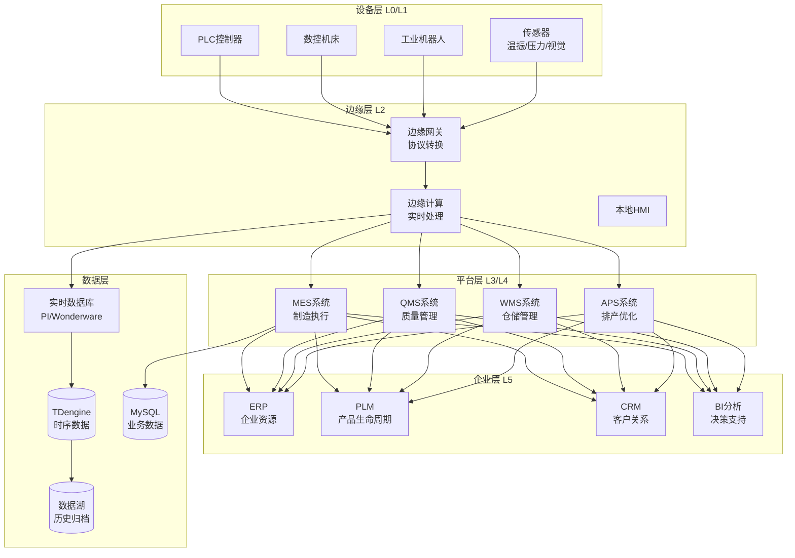
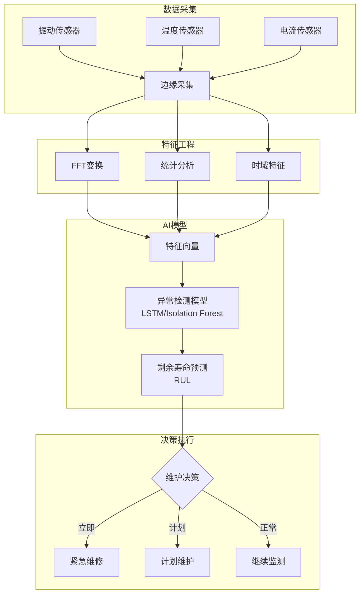
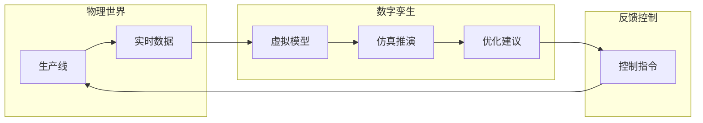

# 智能制造架构案例

## 一、业务背景

智能制造是工业4.0的核心，以某汽车制造企业为例，拥有10+生产基地，连接设备超过50万台，日均生产数据超过500GB，涵盖生产执行、质量管控、设备维护、供应链协同等多个领域。

核心业务域：

- **MES系统**：生产调度、工单管理、物料追踪
- **质量管控**：SPC统计、缺陷检测、追溯系统
- **预测性维护**：设备监控、故障预测、维护调度
- **数字孪生**：产线仿真、虚拟调试、优化决策

技术挑战：

- **实时性要求**：生产线控制延迟<10ms
- **数据异构**：PLC、SCADA、ERP多系统对接
- **高可靠**：生产线可用性要求99.99%
- **柔性生产**：快速换线、批量定制

## 二、架构设计

### 2.1 整体架构



### 2.2 预测性维护架构



### 2.3 数字孪生架构



## 三、技术选型

| 组件 | 技术选型 | 选型理由 |
|------|---------|---------|
| 边缘网关 | Kepware/自研 | 多协议支持 |
| 时序数据库 | TDengine | 工业场景优化 |
| 实时数据库 | OSIsoft PI | 行业标准 |
| MES | 自研/Siemens | 业务定制 |
| 消息队列 | Kafka | 高可靠传输 |
| AI框架 | TensorRT | 边缘推理 |
| 数字孪生 | Unity/Unreal | 3D可视化 |

## 四、核心流程

### 4.1 设备数据采集

```java
/**
 * 工业数据采集服务
 */
@Service
public class IndustrialDataCollector {

    @Autowired
    private OPCUAService opcuaService;

    @Autowired
    private ModbusService modbusService;

    @Autowired
    private KafkaTemplate<String, DeviceData> kafkaTemplate;

    /**
     * 启动设备数据采集
     */
    public void startCollection(String deviceId, CollectionConfig config) {
        DeviceProfile profile = deviceRegistry.getProfile(deviceId);

        switch (profile.getProtocol()) {
            case OPC_UA:
                startOPCUACollection(deviceId, config);
                break;
            case MODBUS_TCP:
                startModbusCollection(deviceId, config);
                break;
            case SIEMENS_S7:
                startS7Collection(deviceId, config);
                break;
            case MQTT:
                startMQTTCollection(deviceId, config);
                break;
            default:
                throw new UnsupportedProtocolException(profile.getProtocol());
        }
    }

    /**
     * OPC UA 数据采集
     */
    private void startOPCUACollection(String deviceId, CollectionConfig config) {
        OpcUaClient client = opcuaService.connect(deviceId);

        // 订阅数据点
        for (DataPoint point : config.getDataPoints()) {
            client.subscribe(
                point.getNodeId(),
                config.getSamplingInterval(),
                (value) -> {
                    DeviceData data = DeviceData.builder()
                        .deviceId(deviceId)
                        .pointId(point.getId())
                        .pointName(point.getName())
                        .value(value.getValue())
                        .timestamp(System.currentTimeMillis())
                        .quality(value.getStatusCode().isGood() ? "GOOD" : "BAD")
                        .build();

                    // 发送到Kafka
                    kafkaTemplate.send("device-data", deviceId, data);
                }
            );
        }
    }

    /**
     * 批量数据写入时序数据库
     */
    @KafkaListener(topics = "device-data", batch = "true")
    public void batchStoreToTSDB(List<ConsumerRecord<String, DeviceData>> records) {
        List<DeviceData> dataList = records.stream()
            .map(ConsumerRecord::value)
            .collect(Collectors.toList());

        // 按设备分组批量写入
        Map<String, List<DeviceData>> grouped = dataList.stream()
            .collect(Collectors.groupingBy(DeviceData::getDeviceId));

        for (Map.Entry<String, List<DeviceData>> entry : grouped.entrySet()) {
            String deviceId = entry.getKey();
            List<DeviceData> deviceData = entry.getValue();

            // 构建TDengine SQL
            StringBuilder sql = new StringBuilder("INSERT INTO ");
            sql.append(deviceId).append(" VALUES ");

            for (DeviceData data : deviceData) {
                sql.append(String.format("(%d, '%s', %f, '%s'),",
                    data.getTimestamp(),
                    data.getPointId(),
                    data.getValue(),
                    data.getQuality()
                ));
            }

            sql.setLength(sql.length() - 1); // 移除最后一个逗号

            tdengineTemplate.execute(sql.toString());
        }
    }
}
```

### 4.2 预测性维护系统

```java
/**
 * 预测性维护服务
 */
@Service
public class PredictiveMaintenanceService {

    @Autowired
    private FeatureEngineeringService featureService;

    @Autowired
    private MLModelService modelService;

    @Autowired
    private MaintenanceScheduler scheduler;

    /**
     * 设备健康评估 - 每小时执行
     */
    @Scheduled(cron = "0 0 * * * ?")
    public void assessEquipmentHealth() {
        List<Equipment> equipments = equipmentRepository.findAll();

        for (Equipment equipment : equipments) {
            try {
                HealthAssessment assessment = assessEquipment(equipment);

                // 保存评估结果
                saveAssessment(assessment);

                // 根据健康度触发相应动作
                handleHealthStatus(equipment, assessment);

            } catch (Exception e) {
                log.error("设备健康评估失败: {}", equipment.getId(), e);
            }
        }
    }

    /**
     * 单设备健康评估
     */
    public HealthAssessment assessEquipment(Equipment equipment) {
        String deviceId = equipment.getId();

        // 1. 获取最近24小时数据
        List<DeviceData> recentData = getRecentData(deviceId, Duration.ofHours(24));

        // 2. 特征提取
        FeatureVector features = featureService.extractFeatures(recentData);

        // 3. 异常检测
        double anomalyScore = modelService.predictAnomaly(features);
        boolean isAnomaly = anomalyScore > equipment.getAnomalyThreshold();

        // 4. 故障类型诊断（如果是异常）
        String faultType = null;
        double faultConfidence = 0;
        if (isAnomaly) {
            FaultDiagnosisResult diagnosis = modelService.diagnoseFault(features);
            faultType = diagnosis.getFaultType();
            faultConfidence = diagnosis.getConfidence();
        }

        // 5. RUL预测
        int rulDays = modelService.predictRUL(features, equipment.getType());

        // 6. 综合健康度评分
        int healthScore = calculateHealthScore(
            anomalyScore,
            rulDays,
            equipment.getAge(),
            equipment.getMaintenanceHistory()
        );

        return HealthAssessment.builder()
            .equipmentId(deviceId)
            .timestamp(System.currentTimeMillis())
            .healthScore(healthScore)
            .anomalyScore(anomalyScore)
            .isAnomaly(isAnomaly)
            .faultType(faultType)
            .faultConfidence(faultConfidence)
            .estimatedRUL(rulDays)
            .recommendation(generateRecommendation(healthScore, rulDays))
            .build();
    }

    /**
     * 处理健康状态
     */
    private void handleHealthStatus(Equipment equipment, HealthAssessment assessment) {
        int score = assessment.getHealthScore();

        if (score < 30) {
            // 紧急：立即停机检修
            triggerEmergencyMaintenance(equipment, assessment);
        } else if (score < 60) {
            // 警告：计划近期维护
            schedulePlannedMaintenance(equipment, assessment, 3);
        } else if (score < 80) {
            // 关注：计划常规维护
            schedulePlannedMaintenance(equipment, assessment, 14);
        }
        // 正常：继续监测
    }

    /**
     * 振动信号特征提取
     */
    public FeatureVector extractVibrationFeatures(List<VibrationData> data) {
        double[] signal = data.stream()
            .mapToDouble(VibrationData::getAcceleration)
            .toArray();

        FeatureVector features = new FeatureVector();

        // 时域特征
        features.setRms(calculateRMS(signal)); // 均方根
        features.setPeak(calculatePeak(signal)); // 峰值
        features.setCrestFactor(features.getPeak() / features.getRms()); // 峰值因子
        features.setKurtosis(calculateKurtosis(signal)); // 峭度

        // 频域特征（FFT）
        Complex[] fft = FFT.fft(signal);
        features.setDominantFreq(findDominantFrequency(fft));
        features.setSpectralEntropy(calculateSpectralEntropy(fft));

        // 时频特征（小波变换）
        WaveletCoefficients wavelet = WaveletTransform.dwt(signal);
        features.setWaveletEnergy(calculateWaveletEnergy(wavelet));

        return features;
    }
}

/**
 * 维护调度优化
 */
@Service
public class MaintenanceScheduler {

    /**
     * 优化维护计划
     */
    public MaintenancePlan optimizeSchedule(List<MaintenanceTask> tasks) {
        // 1. 构建约束条件
        List<Constraint> constraints = Arrays.asList(
            // 工程师工时约束
            new ResourceConstraint("engineer_hours", 160), // 每人每月160小时
            // 备件库存约束
            new InventoryConstraint(),
            // 设备优先级约束
            new PriorityConstraint(),
            // 停机窗口约束
            new DowntimeWindowConstraint()
        );

        // 2. 构建优化目标
        List<Objective> objectives = Arrays.asList(
            Objective.MINIMIZE_DOWNTIME,
            Objective.MINIMIZE_COST,
            Objective.BALANCE_WORKLOAD
        );

        // 3. 使用遗传算法求解
        GeneticOptimizer optimizer = new GeneticOptimizer(constraints, objectives);
        MaintenancePlan plan = optimizer.optimize(tasks);

        // 4. 冲突检测与调整
        resolveConflicts(plan);

        return plan;
    }
}
```

### 4.3 数字孪生仿真

```java
/**
 * 数字孪生服务
 */
@Service
public class DigitalTwinService {

    @Autowired
    private ModelRepository modelRepository;

    @Autowired
    private SimulationEngine simulationEngine;

    /**
     * 创建产线数字孪生模型
     */
    public DigitalTwin createProductionLineTwin(String lineId) {
        ProductionLine line = lineRepository.findById(lineId);

        // 1. 构建几何模型
        GeometryModel geometry = buildGeometryModel(line);

        // 2. 构建逻辑模型
        LogicModel logic = buildLogicModel(line);

        // 3. 绑定实时数据接口
        DataBinding binding = createDataBinding(line);

        DigitalTwin twin = DigitalTwin.builder()
            .twinId("twin:" + lineId)
            .physicalId(lineId)
            .geometryModel(geometry)
            .logicModel(logic)
            .dataBinding(binding)
            .syncInterval(100) // 100ms同步
            .build();

        modelRepository.save(twin);

        // 4. 启动实时同步
        startRealtimeSync(twin);

        return twin;
    }

    /**
     * 仿真推演 - 产能优化
     */
    public SimulationResult simulateProduction(String twinId,
                                                SimulationScenario scenario) {
        DigitalTwin twin = modelRepository.findById(twinId);

        // 1. 加载模型到仿真引擎
        simulationEngine.loadModel(twin.getLogicModel());

        // 2. 设置仿真参数
        simulationEngine.setParameters(scenario.getParameters());

        // 3. 设置初始状态
        simulationEngine.setInitialState(getCurrentState(twin.getPhysicalId()));

        // 4. 运行仿真
        SimulationResult result = simulationEngine.run(scenario.getDuration());

        // 5. 分析结果
        return analyzeResult(result);
    }

    /**
     * 虚拟调试 - 验证新工艺
     */
    public ValidationResult virtualCommissioning(String twinId,
                                                  NewProcess process) {
        DigitalTwin twin = modelRepository.findById(twinId);

        // 1. 在数字孪生上部署新工艺
        deployProcessToTwin(twin, process);

        // 2. 运行验证测试
        List<TestCase> testCases = generateTestCases(process);

        List<TestResult> results = new ArrayList<>();
        for (TestCase testCase : testCases) {
            TestResult result = runTest(twin, testCase);
            results.add(result);
        }

        // 3. 评估可行性
        boolean isFeasible = results.stream().allMatch(TestResult::isPassed);

        // 4. 预测影响
        ImpactAnalysis impact = analyzeImpact(twin, process);

        return ValidationResult.builder()
            .feasible(isFeasible)
            .testResults(results)
            .impactAnalysis(impact)
            .recommendations(generateRecommendations(results, impact))
            .build();
    }

    /**
     * 实时状态同步
     */
    @Scheduled(fixedRate = 100)
    public void syncPhysicalToDigital() {
        List<DigitalTwin> activeTwins = modelRepository.findActive();

        for (DigitalTwin twin : activeTwins) {
            try {
                // 获取物理实体状态
                PhysicalState physicalState = getPhysicalState(twin.getPhysicalId());

                // 更新数字孪生
                updateDigitalState(twin, physicalState);

            } catch (Exception e) {
                log.error("状态同步失败: {}", twin.getTwinId(), e);
            }
        }
    }
}
```

## 五、经验总结

### 5.1 工业数据特点

| 特点 | 说明 | 技术方案 |
|------|------|---------|
| 高频率 | 毫秒级采样 | 边缘预处理 |
| 大容量 | PB级历史 | 分层存储 |
| 强关联 | 设备-工艺-质量 | 知识图谱 |
| 实时性 | 控制延迟<10ms | 边缘计算 |

### 5.2 实施路径

1. **设备联网**：协议转换、数据采集
2. **数据集成**：统一平台、打破孤岛
3. **应用开发**：MES/QMS/预测性维护
4. **智能优化**：AI算法、数字孪生

### 5.3 安全考虑

| 层级 | 措施 | 标准 |
|------|------|------|
| 网络隔离 | 工业防火墙 | IEC 62443 |
| 数据安全 | 加密传输 | TLS1.3 |
| 访问控制 | 零信任架构 | NIST |

---

> **扩展阅读**：
>
> - [工业4.0参考架构](https://www.plattform-i40.de/)
> - [数字孪生白皮书](https://www.mckinsey.com/)
