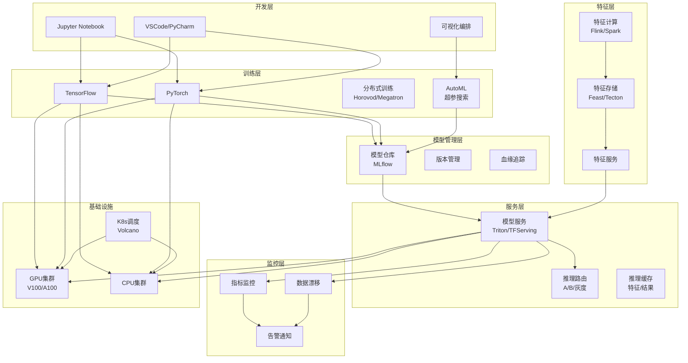
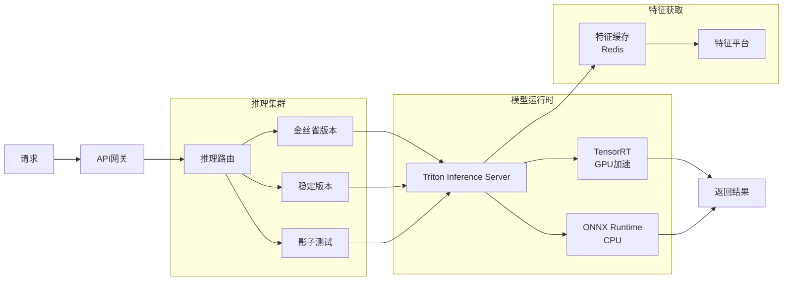
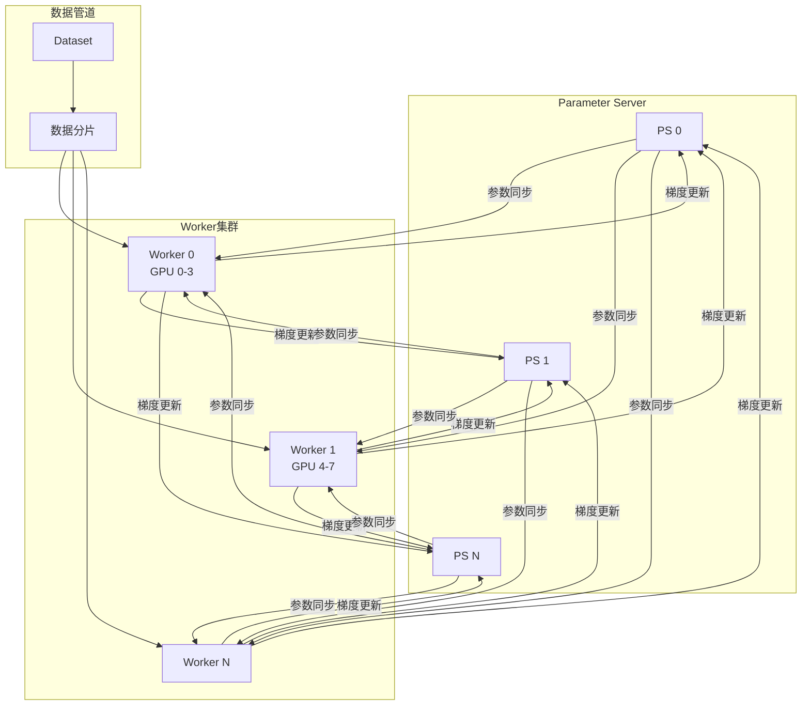

# AI平台架构案例

## 一、业务背景

AI平台是支撑企业智能化转型的核心基础设施，以某大型互联网公司为例，日均模型调用超过1000亿次，在线服务模型超过10万个，覆盖推荐、搜索、广告、NLP、CV等多个AI应用场景。

核心业务域：

- **MLOps**：模型开发、训练、部署全流程管理
- **模型服务**：在线推理、弹性伸缩、A/B测试
- **特征平台**：特征工程、特征存储、特征共享
- **模型治理**：模型版本、血缘追踪、效果监控

技术挑战：

- **超大规模**：10万+模型同时在线服务
- **极致性能**：推理延迟P99<10ms
- **异构算力**：CPU/GPU/NPU混合调度
- **快速迭代**：日级模型更新、分钟级上线

## 二、架构设计

### 2.1 整体架构



### 2.2 模型服务架构



### 2.3 分布式训练架构



## 三、技术选型

| 组件 | 技术选型 | 选型理由 |
|------|---------|---------|
| 训练框架 | PyTorch + DeepSpeed | 灵活、分布式支持好 |
| 模型服务 | Triton Inference Server | 多框架、高性能 |
| 特征平台 | Feast | 开源、与K8s集成 |
| 工作流 | Kubeflow/MLflow | 完整MLOps能力 |
| 调度 | Volcano on K8s | AI负载感知 |
| 加速 | TensorRT/ONNX | 推理加速 |
| 存储 | Ceph/MinIO | 模型存储 |

## 四、核心流程

### 4.1 模型训练Pipeline

```python
# MLflow + Kubeflow Pipeline 示例
import mlflow
import mlflow.tensorflow
from kfp import dsl
from kfp.components import create_component_from_func

# 1. 数据预处理组件
@create_component_from_func
def preprocess_op(input_path: str, output_path: str) -> str:
    """数据清洗与特征工程"""
    import pandas as pd
    from sklearn.preprocessing import StandardScaler

    # 加载数据
    df = pd.read_csv(input_path)

    # 数据清洗
    df = df.dropna()
    df = df.drop_duplicates()

    # 特征工程
    scaler = StandardScaler()
    df['feature_scaled'] = scaler.fit_transform(df[['feature']])

    # 保存
    df.to_parquet(output_path)
    return output_path

# 2. 训练组件
@create_component_from_func
def train_op(data_path: str, model_path: str, epochs: int) -> str:
    """模型训练"""
    import tensorflow as tf
    import mlflow

    mlflow.set_tracking_uri("http://mlflow-server:5000")
    mlflow.tensorflow.autolog()

    with mlflow.start_run():
        # 加载数据
        df = pd.read_parquet(data_path)
        X, y = df.drop('target', axis=1), df['target']

        # 构建模型
        model = tf.keras.Sequential([
            tf.keras.layers.Dense(128, activation='relu'),
            tf.keras.layers.Dropout(0.2),
            tf.keras.layers.Dense(64, activation='relu'),
            tf.keras.layers.Dense(1, activation='sigmoid')
        ])

        model.compile(optimizer='adam',
                     loss='binary_crossentropy',
                     metrics=['accuracy', tf.keras.metrics.AUC()])

        # 训练
        history = model.fit(X, y, epochs=epochs, validation_split=0.2,
                          batch_size=256)

        # 保存模型
        model.save(model_path)

        # 记录指标
        mlflow.log_metric("final_accuracy", history.history['accuracy'][-1])
        mlflow.log_metric("final_auc", history.history['auc'][-1])

    return model_path

# 3. 评估组件
@create_component_from_func
def evaluate_op(model_path: str, test_data_path: str) -> dict:
    """模型评估"""
    import tensorflow as tf
    from sklearn.metrics import roc_auc_score, precision_recall_curve

    model = tf.keras.models.load_model(model_path)
    df = pd.read_parquet(test_data_path)
    X_test, y_test = df.drop('target', axis=1), df['target']

    y_pred = model.predict(X_test)
    auc = roc_auc_score(y_test, y_pred)

    return {
        "auc": float(auc),
        "model_path": model_path,
        "passed": auc > 0.75
    }

# 4. 定义Pipeline
@dsl.pipeline(
    name='Model Training Pipeline',
    description='端到端模型训练流程'
)
def training_pipeline(
    input_data: str = 's3://data/train.csv',
    epochs: int = 10,
    threshold: float = 0.75
):
    # 数据预处理
    preprocess_task = preprocess_op(
        input_path=input_data,
        output_path='s3://processed/data.parquet'
    )

    # 训练
    train_task = train_op(
        data_path=preprocess_task.output,
        model_path='s3://models/my-model',
        epochs=epochs
    )

    # 评估
    evaluate_task = evaluate_op(
        model_path=train_task.output,
        test_data_path='s3://data/test.parquet'
    )

    # 条件部署
    with dsl.Condition(evaluate_task.outputs["passed"] == "True"):
        deploy_op = deploy_model_op(
            model_path=train_task.output,
            model_name='recommendation-model'
        )

# 编译运行
from kfp.compiler import Compiler
Compiler().compile(training_pipeline, 'training_pipeline.yaml')
```

### 4.2 高性能模型服务

```python
# Triton Inference Server 模型部署配置
# config.pbtxt
"""
name: "recommendation_model"
platform: "tensorflow_savedmodel"
max_batch_size: 128
input [
  {
    name: "user_id"
    data_type: TYPE_INT64
    dims: [1]
  },
  {
    name: "item_id"
    data_type: TYPE_INT64
    dims: [1]
  },
  {
    name: "context_features"
    data_type: TYPE_FP32
    dims: [50]
  }
]
output [
  {
    name: "score"
    data_type: TYPE_FP32
    dims: [1]
  }
]
instance_group [
  {
    count: 4
    kind: KIND_GPU
    gpus: [0, 1]
  }
]
dynamic_batching {
  preferred_batch_size: [32, 64]
  max_queue_delay_microseconds: 100
}
optimization {
  execution_accelerators {
    gpu_execution_accelerator: [
      {
        name: "tensorrt"
        parameters { key: "precision_mode" value: "FP16" }
        parameters { key: "max_workspace_size_bytes" value: "2147483648" }
      }
    ]
  }
}
"""

# Python客户端调用示例
import tritonclient.http as httpclient
import numpy as np
from tritonclient.utils import InferenceServerException

class ModelClient:
    def __init__(self, url: str = "localhost:8000"):
        self.client = httpclient.InferenceServerClient(url=url)
        self.model_name = "recommendation_model"

    def predict(self, user_ids: list, item_ids: list,
                context_features: np.ndarray) -> np.ndarray:
        """批量推理"""
        # 构建输入
        inputs = [
            httpclient.InferInput("user_id",
                [len(user_ids), 1], "INT64"),
            httpclient.InferInput("item_id",
                [len(item_ids), 1], "INT64"),
            httpclient.InferInput("context_features",
                context_features.shape, "FP32")
        ]

        inputs[0].set_data_from_numpy(
            np.array(user_ids, dtype=np.int64).reshape(-1, 1))
        inputs[1].set_data_from_numpy(
            np.array(item_ids, dtype=np.int64).reshape(-1, 1))
        inputs[2].set_data_from_numpy(
            context_features.astype(np.float32))

        # 输出
        outputs = [httpclient.InferRequestedOutput("score")]

        # 调用
        response = self.client.infer(
            self.model_name,
            inputs,
            outputs=outputs
        )

        return response.as_numpy("score")

    def ensemble_predict(self, user_id: int, candidates: list) -> list:
        """召回+精排两阶段推理"""
        # 第一阶段：召回模型
        recall_scores = self.recall_predict(user_id, candidates)
        top_k = np.argsort(recall_scores)[-100:]  # Top 100

        # 第二阶段：精排模型
        rerank_items = [candidates[i] for i in top_k]
        final_scores = self.predict([user_id]*100, rerank_items,
                                    self.get_context_features(user_id))

        # 排序返回
        sorted_indices = np.argsort(final_scores.flatten())[::-1]
        return [rerank_items[i] for i in sorted_indices[:10]]
```

### 4.3 特征平台实现

```java
/**
 * 特征平台服务 - 在线/离线一致性
 */
@Service
public class FeaturePlatformService {

    @Autowired
    private OnlineStore onlineStore; // Redis

    @Autowired
    private OfflineStore offlineStore; // Hive/S3

    @Autowired
    private FeatureComputationService computationService;

    /**
     * 获取在线特征 - 低延迟
     */
    public FeatureVector getOnlineFeatures(String entityId,
                                           List<FeatureReference> features) {
        FeatureVector result = new FeatureVector();

        // 1. 尝试从在线存储获取
        List<FeatureReference> missingFeatures = new ArrayList<>();

        for (FeatureReference feature : features) {
            String key = buildFeatureKey(entityId, feature);
            String value = onlineStore.get(key);

            if (value != null) {
                result.put(feature.getName(), deserialize(value));
            } else {
                missingFeatures.add(feature);
            }
        }

        // 2. 缺失特征实时计算
        if (!missingFeatures.isEmpty()) {
            Map<String, Object> computed = computationService.compute(
                entityId, missingFeatures);

            // 回填在线存储
            for (Map.Entry<String, Object> entry : computed.entrySet()) {
                String key = buildFeatureKey(entityId,
                    findFeatureRef(missingFeatures, entry.getKey()));
                onlineStore.setex(key, 3600, serialize(entry.getValue()));
                result.put(entry.getKey(), entry.getValue());
            }
        }

        return result;
    }

    /**
     * 批量获取特征 - 高吞吐
     */
    public Map<String, FeatureVector> batchGetFeatures(
        List<String> entityIds,
        List<FeatureReference> features
    ) {
        // 使用Pipeline批量获取
        Map<String, FeatureVector> results = new HashMap<>();

        // 构建所有key
        List<String> allKeys = new ArrayList<>();
        Map<String, String> keyToEntity = new HashMap<>();

        for (String entityId : entityIds) {
            for (FeatureReference feature : features) {
                String key = buildFeatureKey(entityId, feature);
                allKeys.add(key);
                keyToEntity.put(key, entityId);
            }
        }

        // 批量获取
        List<String> values = onlineStore.mget(allKeys);

        // 组装结果
        for (int i = 0; i < allKeys.size(); i++) {
            String key = allKeys.get(i);
            String value = values.get(i);
            String entityId = keyToEntity.get(key);

            if (!results.containsKey(entityId)) {
                results.put(entityId, new FeatureVector());
            }

            FeatureReference feature = getFeatureFromKey(key);
            if (value != null) {
                results.get(entityId).put(feature.getName(), deserialize(value));
            }
        }

        return results;
    }

    /**
     * 特征回填 - 保证离线/在线一致性
     */
    @Scheduled(cron = "0 0 * * * ?") // 每小时
    public void backfillFeatures() {
        // 1. 从离线仓库读取最新特征
        List<FeatureRow> offlineFeatures = offlineStore
            .getLatestFeatures(DateUtil.lastHour());

        // 2. 批量写入在线存储
        Map<String, String> keyValues = offlineFeatures.stream()
            .collect(Collectors.toMap(
                row -> buildFeatureKey(row.getEntityId(), row.getFeature()),
                row -> serialize(row.getValue())
            ));

        // Pipeline批量写入
        onlineStore.mset(keyValues);

        log.info("特征回填完成: {} 条", offlineFeatures.size());
    }

    /**
     * 流式特征计算 - Flink
     */
    public void streamFeatureComputation(FeatureDefinition feature) {
        StreamExecutionEnvironment env =
            StreamExecutionEnvironment.getExecutionEnvironment();

        // Kafka源
        KafkaSource<Event> source = KafkaSource.<Event>builder()
            .setBootstrapServers("kafka:9092")
            .setTopics(feature.getSourceTopic())
            .setGroupId("feature-compute-" + feature.getName())
            .setStartingOffsets(OffsetsInitializer.latest())
            .build();

        // 计算逻辑
        env.fromSource(source, WatermarkStrategy.noWatermarks(), "Events")
            .keyBy(Event::getUserId)
            .window(TumblingEventTimeWindows.of(
                Time.minutes(feature.getWindowMinutes())))
            .aggregate(new FeatureAggregateFunction(feature))
            .addSink(new FeatureSink(feature));

        env.execute("Feature Computation: " + feature.getName());
    }
}
```

### 4.4 模型监控与告警

```python
# 模型监控服务
from evidently import ColumnMapping
from evidently.report import Report
from evidently.metric_preset import DataDriftPreset, TargetDriftPreset
import pandas as pd

class ModelMonitor:
    def __init__(self, model_name: str):
        self.model_name = model_name
        self.reference_data = None

    def set_reference_data(self, df: pd.DataFrame):
        """设置基线数据"""
        self.reference_data = df

    def check_data_drift(self, current_data: pd.DataFrame) -> dict:
        """检测数据漂移"""
        column_mapping = ColumnMapping()

        drift_report = Report(metrics=[DataDriftPreset()])
        drift_report.run(
            reference_data=self.reference_data,
            current_data=current_data,
            column_mapping=column_mapping
        )

        result = drift_report.as_dict()

        # 判断是否发生漂移
        drift_detected = result['metrics'][0]['result']['dataset_drift']
        drift_share = result['metrics'][0]['result']['share_of_drifted_columns']

        return {
            'drift_detected': drift_detected,
            'drift_share': drift_share,
            'details': result
        }

    def check_performance_degradation(self,
                                       predictions: pd.Series,
                                       actuals: pd.Series) -> dict:
        """检测性能退化"""
        from sklearn.metrics import roc_auc_score, log_loss

        current_auc = roc_auc_score(actuals, predictions)
        baseline_auc = 0.85  # 基线AUC

        degradation = (baseline_auc - current_auc) / baseline_auc

        return {
            'current_auc': current_auc,
            'baseline_auc': baseline_auc,
            'degradation': degradation,
            'alert': degradation > 0.05  # 下降超过5%告警
        }

    def monitor_latency(self, latencies: list) -> dict:
        """监控推理延迟"""
        p50 = np.percentile(latencies, 50)
        p99 = np.percentile(latencies, 99)

        return {
            'p50_ms': p50,
            'p99_ms': p99,
            'alert': p99 > 100  # P99超过100ms告警
        }

    def generate_alert(self, check_type: str, severity: str, message: str):
        """生成告警"""
        alert = {
            'model_name': self.model_name,
            'timestamp': datetime.now().isoformat(),
            'type': check_type,
            'severity': severity,
            'message': message
        }

        # 发送到告警系统
        send_alert(alert)

    def auto_rollback(self, model_version: str):
        """自动回滚到上一个版本"""
        # 调用部署系统回滚
        rollback_model(self.model_name, model_version)
```

## 五、经验总结

### 5.1 MLOps成熟度模型

| 等级 | 特征 | 自动化程度 |
|------|------|-----------|
| L1 | 手工管理 | 0% |
| L2 | 半自动化 | 30% |
| L3 | 自动化CI/CD | 70% |
| L4 | 全自动MLOps | 90%+ |

### 5.2 推理优化策略

| 技术 | 效果 | 适用场景 |
|------|------|---------|
| 模型量化 | 4x加速 | 移动端 |
| TensorRT | 5-10x加速 | GPU服务器 |
| 批处理 | 吞吐提升 | 高并发 |
| 缓存 | 延迟降低90% | 热点数据 |

### 5.3 成本优化

1. **训练成本**：
   - Spot实例节省70%
   - 自动超参搜索
   - 模型蒸馏压缩

2. **推理成本**：
   - 自动扩缩容
   - 冷热模型分离
   - 多租户共享

---

> **扩展阅读**：
>
> - [Kubeflow文档](https://www.kubeflow.org/)
> - [Triton Inference Server](https://developer.nvidia.com/triton-inference-server)
