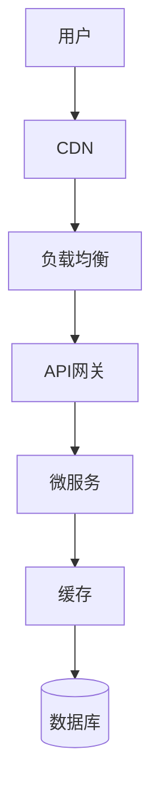
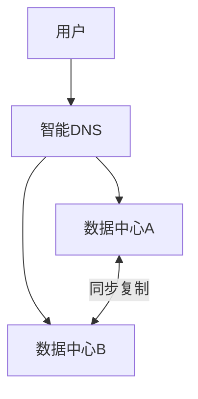

# 分布式系统架构设计指南

## 一、设计原则

### 1.1 CAP理论

| 特性 | 说明 | 常见系统 |
|------|------|---------|
| **CP** | 一致+分区容错 | ZooKeeper、HBase、etcd |
| **AP** | 可用+分区容错 | Cassandra、Eureka、DNS |

**关键理解：**

- 网络分区(P)不可避免，实际是在C和A之间选择
- 金融系统选CP，社交系统选AP

### 1.2 BASE理论

- **Basically Available**：基本可用（允许降级）
- **Soft state**：软状态（允许中间状态）
- **Eventually consistent**：最终一致（不追求实时）

## 二、架构设计流程

```
需求分析 → 容量评估 → 架构设计 → 原型验证 → 优化迭代
```

### 2.1 容量评估公式

```java
// 峰值QPS = 日PV × 80% ÷ 4小时 ÷ 3600秒 × 峰值系数
int peakQPS = (int)(dailyPV * 0.8 / 4 / 3600 * peakRatio);

// 存储容量 = 日增量 × 保留天数 × 副本数 × 1.3
long storage = dailyIncreaseGB * retentionDays * replicaFactor * 1.3;

// 服务器数 = 总QPS / 单机QPS × 1.5
int servers = (int)Math.ceil(totalQPS / qpsPerServer * 1.5);
```

### 2.2 分层架构



## 三、技术选型指南

### 3.1 存储选型

| 场景 | 推荐方案 | 备选方案 |
|------|---------|---------|
| 关系型数据 | MySQL/PostgreSQL | TiDB/OceanBase |
| 缓存 | Redis Cluster | Memcached |
| 文档存储 | MongoDB | Elasticsearch |
| 时序数据 | TDengine | InfluxDB |
| 图数据 | Neo4j | Dgraph |

### 3.2 服务治理组件

| 组件 | 推荐 | 说明 |
|------|------|------|
| 注册中心 | Nacos | 服务发现+配置 |
| API网关 | Spring Gateway | 高性能路由 |
| 限流熔断 | Sentinel | 阿里开源 |
| 配置中心 | Nacos/Apollo | 动态配置 |
| 监控 | Prometheus+Grafana | 云原生标准 |

## 四、高可用设计

### 4.1 可用性等级

| 等级 | 可用性 | 年停机时间 | 实现方式 |
|------|--------|-----------|---------|
| 3个9 | 99.9% | 8.76小时 | 主从+自动切换 |
| 4个9 | 99.99% | 52.6分钟 | 同城多活 |
| 5个9 | 99.999% | 5.26分钟 | 异地多活 |

### 4.2 容灾架构



## 五、性能优化策略

### 5.1 分层优化

| 层级 | 优化手段 | 效果 |
|------|---------|------|
| 客户端 | 缓存、合并请求 | 50%+ |
| CDN | 静态资源分发 | 80%+ |
| 网关 | 连接池、压缩 | 30%+ |
| 服务 | 缓存、异步 | 100%+ |
| 数据库 | 索引、分片 | 1000%+ |

### 5.2 缓存设计

```java
@Component
public class CacheStrategy {
    // 多级缓存
    private Cache<String, Object> localCache = Caffeine.newBuilder()
        .maximumSize(10000)
        .expireAfterWrite(10, TimeUnit.MINUTES)
        .build();

    public Object getWithMultiLevel(String key) {
        // L1: 本地缓存
        Object value = localCache.getIfPresent(key);
        if (value != null) return value;

        // L2: Redis
        value = redisTemplate.opsForValue().get(key);
        if (value != null) {
            localCache.put(key, value);
            return value;
        }

        // L3: 数据库
        value = loadFromDB(key);
        if (value != null) {
            redisTemplate.opsForValue().set(key, value, 1, TimeUnit.HOURS);
            localCache.put(key, value);
        }
        return value;
    }
}
```

## 六、安全性设计

### 6.1 分层安全

| 层级 | 措施 |
|------|------|
| 网络层 | WAF、DDoS防护、VPC |
| 应用层 | 认证鉴权、参数校验 |
| 数据层 | 加密存储、脱敏展示 |
| 运维层 | 最小权限、审计日志 |

### 6.2 零信任架构

- 永不信任，始终验证
- 最小权限原则
- 持续安全监控

## 七、可观测性设计

### 7.1 三大支柱

| 支柱 | 工具 | 用途 |
|------|------|------|
| Metrics | Prometheus | 指标监控 |
| Logging | ELK/Loki | 日志分析 |
| Tracing | Jaeger | 链路追踪 |

### 7.2 黄金指标

- **延迟(Latency)**：请求处理时间
- **流量(Traffic)**：请求量
- **错误(Errors)**：错误率
- **饱和度(Saturation)**：资源利用率

## 八、设计checklist

### 8.1 架构评审清单

- [ ] 是否满足功能需求
- [ ] 是否考虑非功能需求（性能、可用性、安全）
- [ ] 是否做过容量评估
- [ ] 是否有降级方案
- [ ] 是否有监控告警
- [ ] 是否有容灾方案
- [ ] 是否考虑扩展性
- [ ] 是否考虑成本

### 8.2 常见误区

1. **过度设计**：为不存在的问题设计复杂方案
2. **忽视运维**：只考虑开发不考虑运维
3. **忽视安全**：安全是事后补的
4. **单点故障**：没有考虑故障转移
5. **数据不一致**：分布式事务处理不当

## 九、总结

分布式系统设计核心原则：

1. **简单优先**：简单的方案更容易理解和维护
2. **逐步演进**：从单体到微服务逐步拆分
3. **自动化**：CI/CD、自动化测试、自动化运维
4. **可观测**：日志、监控、链路追踪三位一体
5. **容错设计**：假设任何组件都可能故障
