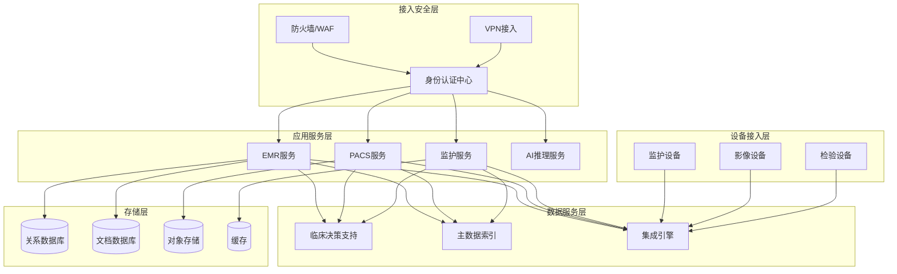
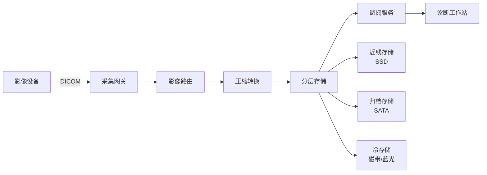
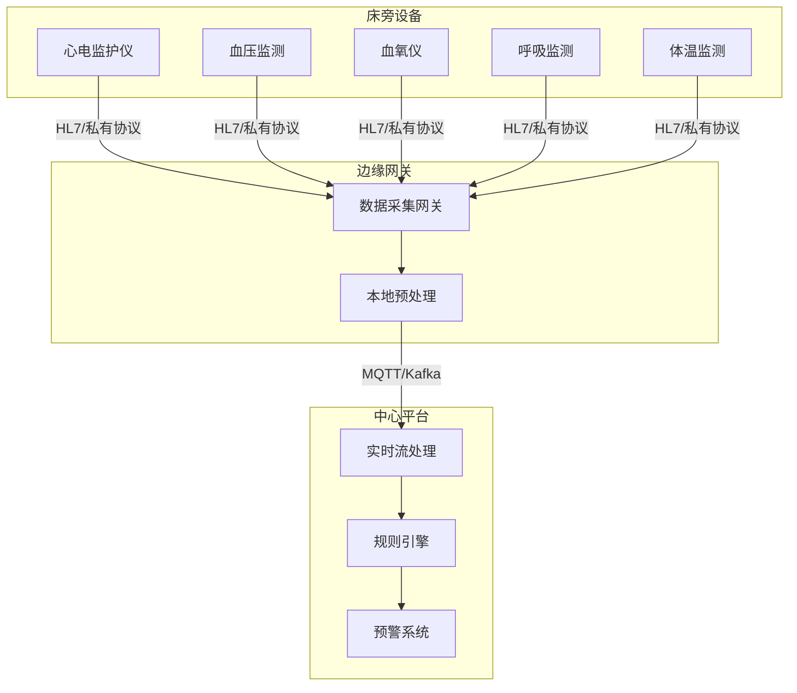

# 医疗系统架构案例

**文档版本**：v1.0
**创建时间**：2026年
**最后更新**：2026年
**状态**：✅ 已完成

---

## 📋 执行摘要

医疗系统架构通过分布式技术实现电子病历的高效管理、医学影像的安全存储（PACS）、患者实时监护以及符合HIPAA等法规的数据隐私保护，支撑现代医疗数字化转型。

---

## 一、核心概念

### 1.1 定义与原理

医疗系统架构是指支撑医疗服务全流程的分布式技术体系，核心包括：

- **电子病历系统（EMR/EHR）**：患者健康信息的数字化存储与管理
- **影像归档与通信系统（PACS）**：医学影像的采集、存储、传输与展示
- **临床监护系统**：实时采集与分析患者生命体征数据
- **医疗数据安全体系**：满足HIPAA/GDPR等法规的隐私保护机制

核心原理：
- **数据完整性**：保证医疗记录不可篡改、可追溯
- **高可用性**：7×24小时不间断服务，系统可用性≥99.99%
- **数据隔离**：多租户架构下患者数据严格隔离
- **合规性**：满足医疗行业法规与标准要求

### 1.2 关键特性

| 特性 | 描述 |
|------|------|
| **数据持久性** | 医疗数据保存15-30年，数据可靠性≥99.9999999% |
| **实时响应** | 急诊场景响应时间 < 100ms |
| **数据安全** | 端到端加密、访问审计、脱敏处理 |
| **互操作性** | 支持HL7/FHIR标准，系统间互联互通 |
| **灾备能力** | RPO < 1分钟，RTO < 15分钟 |

### 1.3 适用场景

| 场景 | 适用性 | 说明 |
|------|--------|------|
| 三甲医院核心系统 | ⭐⭐⭐⭐⭐ | HIS/EMR/PACS一体化 |
| 区域医疗平台 | ⭐⭐⭐⭐ | 跨机构数据共享与协同 |
| 互联网医院 | ⭐⭐⭐⭐⭐ | 在线诊疗、处方流转 |
| 远程医疗 | ⭐⭐⭐⭐ | 实时音视频、影像传输 |
| 医疗AI应用 | ⭐⭐⭐⭐ | AI辅助诊断、影像分析 |

---

## 二、技术细节

### 2.1 架构设计



### 2.2 核心模块详解

#### 2.2.1 电子病历（EMR）

**功能描述**：患者就诊全流程信息的数字化记录与管理

**数据模型**：
```
患者信息
├── 基本信息（人口统计学）
├── 就诊记录
│   ├── 门诊记录
│   ├── 住院记录
│   └── 急诊记录
├── 诊断信息
│   ├── 主要诊断（ICD-10编码）
│   └── 次要诊断
├── 医嘱信息
│   ├── 长期医嘱
│   └── 临时医嘱
├── 检查检验
│   ├── 检验报告
│   └── 检查报告
└── 病历文书
    ├── 入院记录
    ├── 病程记录
    ├── 手术记录
    └── 出院记录
```

**分布式存储策略**：

| 数据类型 | 存储方案 | 说明 |
|----------|----------|------|
| 结构化数据 | MySQL/PostgreSQL | 患者基本信息、诊断、医嘱 |
| 半结构化数据 | MongoDB | 病历文书、临床路径 |
| 时序数据 | InfluxDB/TDengine | 生命体征监测数据 |
| 文档附件 | 对象存储 | PDF报告、扫描件 |

**数据一致性保障**：
- **写入确认**：同步复制至至少2个副本
- **变更追踪**：所有修改记录审计日志
- **版本控制**：病历文书支持版本回溯
- **冲突解决**：基于时间戳的最后写入优先

#### 2.2.2 影像存储（PACS）

**功能描述**：医学影像的采集、归档、传输与调阅

**系统架构**：


**DICOM标准支持**：
| 功能 | 标准 | 说明 |
|------|------|------|
| 影像传输 | DICOM C-STORE | 影像上传与存储 |
| 查询检索 | DICOM C-FIND | 影像查询服务 |
| 调阅传输 | DICOM C-MOVE/GET | 影像调阅下载 |
| 工作列表 | DICOM Modality Worklist | 检查预约同步 |

**存储容量规划**：
- **CT影像**：单部位约250MB，年增量50TB+
- **MRI影像**：单部位约500MB，年增量30TB+
- **DR影像**：单张约15MB，年增量20TB+
- **存储策略**：
  - 热数据（7天）：SSD，秒级响应
  - 温数据（1年）：SATA磁盘，分钟级响应
  - 冷数据（10年）：磁带/蓝光，小时级响应

**影像压缩算法**：
| 算法 | 压缩比 | 适用场景 |
|------|--------|----------|
| JPEG 2000无损 | 2:1 | 要求无损的场景 |
| JPEG 2000有损 | 10:1 | 一般诊断场景 |
| RLE | 1.5:1 | 快速压缩/解压 |
| 分片压缩 | 自适应 | 大文件并行处理 |

#### 2.2.3 实时监护

**功能描述**：ICU/CCU等场景下患者生命体征的连续监测与预警

**数据采集架构**：


**数据频率与存储**：
| 数据类型 | 采样频率 | 存储策略 |
|----------|----------|----------|
| 心电波形 | 250Hz | 原始波形存储24小时，后转存压缩 |
| 心率 | 1Hz | 全量存储 |
| 血压 | 5分钟/事件触发 | 全量存储 |
| 血氧 | 1Hz | 全量存储 |
| 呼吸 | 1Hz | 全量存储 |

**实时预警算法**：
- **阈值预警**：超出正常范围立即告警
- **趋势预警**：基于滑动窗口的趋势分析
- **多参数融合**：综合多指标异常评分
- **AI预警**：深度学习异常模式识别

#### 2.2.4 数据隐私（HIPAA合规）

**HIPAA安全规则要求**：

| 规则类别 | 技术要求 | 管理要求 |
|----------|----------|----------|
| 访问控制 | 唯一用户标识、自动注销、加密 | 授权管理、最小权限 |
| 审计控制 | 日志记录所有数据访问 | 定期审计审查 |
| 完整性 | 数据校验、防篡改 | 变更管理流程 |
| 传输安全 | TLS加密传输 | 安全通信协议 |
| 设备安全 | 终端设备加密 | 设备管理政策 |

**数据脱敏策略**：
```
脱敏级别：
├── 生产环境
│   └── 全明文（严格访问控制）
├── 测试环境
│   └── 假名化（可逆映射）
├── 分析环境
│   └── 部分脱敏（保留统计特征）
└── 公开数据
    └── 完全匿名化（k-匿名/l-多样性）
```

**脱敏规则示例**：
| 字段 | 脱敏方式 | 示例 |
|------|----------|------|
| 姓名 | 替换 | 张三 → 张** |
| 身份证号 | 掩码 | 110101********1234 |
| 手机号 | 掩码 | 138****8888 |
| 地址 | 模糊化 | 北京市海淀区**街道 |
| 诊断 | 泛化 | 具体癌症 → 恶性肿瘤 |

**数据分级保护**：
| 数据级别 | 定义 | 保护措施 |
|----------|------|----------|
| 绝密 | 重大传染病患者信息 | 国密SM4加密、双人控制 |
| 机密 | 普通患者诊疗信息 | AES-256加密、审计日志 |
| 秘密 | 运营管理数据 | 访问控制、日志记录 |
| 内部 | 公开统计信息 | 基础访问控制 |

---

## 三、系统对比

### 3.1 医疗云平台对比

| 维度 | 阿里云医疗 | 腾讯云医疗 | 华为云医疗 |
|------|------------|------------|------------|
| PACS方案 | 云PACS一体机 | 医学影像云 | 医疗影像云 |
| 合规认证 | 等保三级/HIPAA | 等保三级 | 等保三级 |
| AI能力 | ET医疗大脑 | 腾讯觅影 | 华为云EI |
| 集成能力 | 丰富API/SDK | HL7/FHIR标准 | 标准化接口 |
| 私有化部署 | 支持 | 支持 | 支持 |

### 3.2 开源医疗系统对比

| 系统 | 功能覆盖 | 技术栈 | 社区活跃度 |
|------|----------|--------|------------|
| OpenEMR | 门诊/住院/收费 | PHP/MySQL | ⭐⭐⭐⭐ |
| OpenMRS | 病历管理 | Java/MySQL | ⭐⭐⭐⭐⭐ |
| Orthanc | PACS | C++ | ⭐⭐⭐⭐ |
| DCM4CHE | PACS | Java | ⭐⭐⭐⭐ |
| GNU Health | 医院管理 | Python/PostgreSQL | ⭐⭐⭐ |

### 3.3 存储方案对比

| 方案 | 成本/TB/年 | 访问延迟 | 适用数据 |
|------|------------|----------|----------|
| 全闪存 | ¥50,000 | <1ms | 热数据、核心业务 |
| 混合存储 | ¥15,000 | 5-10ms | 温数据、PACS近线 |
| 对象存储 | ¥5,000 | 50-100ms | 冷数据、归档影像 |
| 磁带库 | ¥1,000 | 分钟级 | 长期归档、合规保存 |

---

## 四、实践指南

### 4.1 部署配置

```yaml
# Kubernetes医疗系统部署
apiVersion: apps/v1
kind: StatefulSet
metadata:
  name: emr-database
spec:
  serviceName: emr-db
  replicas: 3
  template:
    spec:
      containers:
      - name: postgres
        image: postgres:14-alpine
        env:
        - name: POSTGRES_DB
          value: "emr_production"
        - name: POSTGRES_SSL_MODE
          value: "require"
        volumeMounts:
        - name: data
          mountPath: /var/lib/postgresql/data
        - name: encryption
          mountPath: /etc/ssl/certs
      volumes:
      - name: data
        persistentVolumeClaim:
          claimName: emr-data-pvc
      securityContext:
        runAsNonRoot: true
        fsGroup: 999
```

### 4.2 最佳实践

1. **数据备份策略**
   - 实时备份：同步复制至异地灾备中心
   - 定时备份：每日全量+每小时增量
   - 归档备份：每月快照长期保存
   - 恢复演练：每季度进行一次DR演练

2. **访问控制设计**
   - 基于角色的访问控制（RBAC）
   - 基于属性的访问控制（ABAC）细粒度授权
   - 医护人员工号+双因素认证
   - 紧急情况下 Break-Glass 机制

3. **系统集成规范**
   - 采用HL7 v2/v3消息标准
   - FHIR API实现资源互操作
   - IHE集成框架规范流程
   - 统一患者主索引（EMPI）

4. **安全监控体系**
   - 实时异常访问检测
   - 数据泄露预防（DLP）
   - 终端行为分析（UEBA）
   - 安全信息和事件管理（SIEM）

### 4.3 常见问题

**Q1: 如何保证跨区域医疗数据同步的一致性？**
A: 采用分布式数据库（如TiDB）或多主复制架构，结合向量时钟/逻辑时钟解决冲突，关键数据采用Paxos/Raft共识算法。

**Q2: 医疗影像调阅速度慢如何优化？**
A: 实施影像预加载、渐进式传输、边缘缓存、智能压缩（JPEG 2000）、CDN加速等策略。

**Q3: 如何满足医疗数据不出院的要求？**
A: 采用私有化部署或混合云架构，敏感数据本地存储，非敏感业务上云，通过专线/VPN保证安全连接。

**Q4: 老旧设备如何接入现代PACS系统？**
A: 部署DICOM网关进行协议转换，支持Modality Worklist，实现设备级的互操作性。

---

## 五、与其他主题的关联

### 5.1 上游依赖

- [分布式一致性](../01-fundamental/分布式一致性.md) - 数据一致性保障
- [数据加密与安全](../03-advanced/数据加密与安全.md) - 数据安全保护
- [消息队列](../02-intermediate/消息队列.md) - 异步消息处理

### 5.2 下游应用

- [大数据平台架构案例](./大数据平台架构案例.md) - 医疗大数据分析
- [AI平台架构案例](./AI平台架构案例.md) - 医疗AI应用
- [物联网平台架构案例](./物联网平台架构案例.md) - 医疗设备接入

### 5.3 相关概念

| 概念 | 关系 | 说明 |
|------|------|------|
| 互联互通 | 扩展 | 区域医疗信息平台建设 |
| 智慧医院 | 应用 | 医疗系统的智能化升级 |
| 互联网医疗 | 创新 | 线上线下融合的医疗服务 |

---

## 六、参考资源

### 6.1 行业标准

1. [HL7 FHIR R4](https://www.hl7.org/fhir/) - 快速医疗互操作资源标准
2. [DICOM PS3](https://www.dicomstandard.org/) - 医学数字成像与通信标准
3. [IHE Profiles](https://www.ihe.net/) - 医疗信息集成规范

### 6.2 法规要求

1. [HIPAA Security Rule](https://www.hhs.gov/hipaa/) - 美国医疗信息隐私安全规则
2. [等保2.0](http://www.cac.gov.cn/) - 中国网络安全等级保护
3. [GDPR](https://gdpr.eu/) - 欧盟通用数据保护条例

### 6.3 开源项目

1. [OpenEMR](https://www.open-emr.org/) - 开源电子病历系统
2. [Orthanc](https://www.orthanc-server.com/) - 轻量级DICOM服务器
3. [HAPI FHIR](https://hapifhir.io/) - Java FHIR库

### 6.4 相关文档

- [分布式数据库](../02-intermediate/分布式数据库.md)
- [安全认证与授权](../02-intermediate/安全认证与授权.md)

---

**维护者**：项目团队
**最后更新**：2026年
