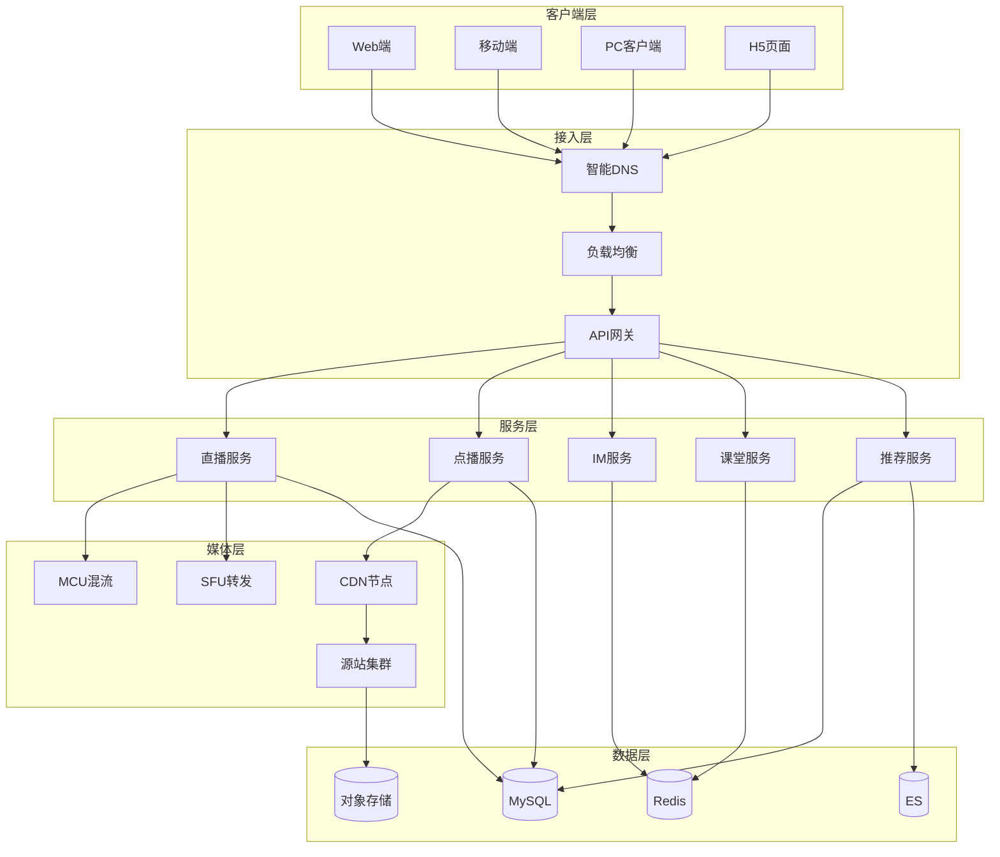
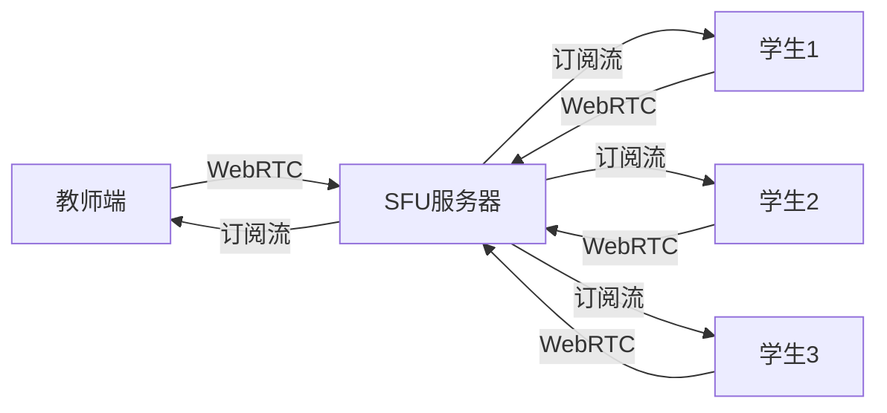
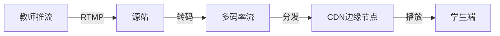
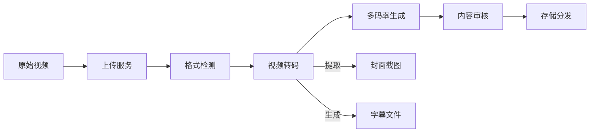
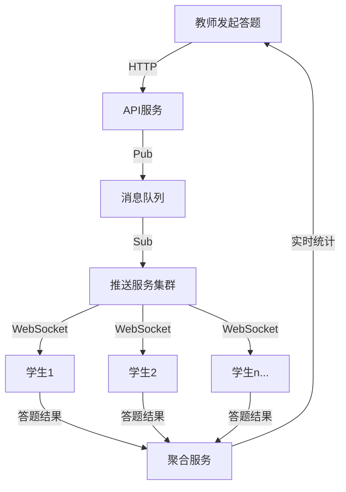
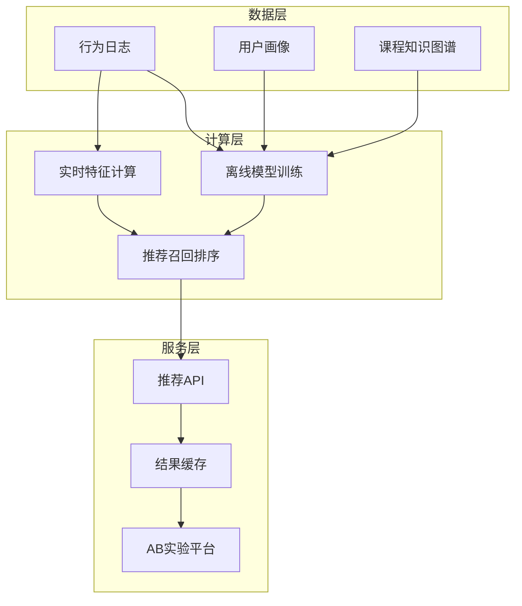

# 在线教育架构案例

**文档版本**：v1.0
**创建时间**：2026年
**最后更新**：2026年
**状态**：✅ 已完成

---

## 📋 执行摘要

在线教育架构通过分布式计算技术实现直播课堂的实时互动、录播内容的高效分发、课堂互动的即时反馈以及个性化学习路径的智能推荐，支撑大规模在线教育的稳定运行。

---

## 一、核心概念

### 1.1 定义与原理

在线教育架构是指支撑互联网教育业务全流程的分布式技术体系，涵盖：

- **实时音视频通信（RTC）**：低延迟直播与互动课堂
- **内容分发网络（CDN）**：录播视频的快速稳定传输
- **实时互动系统**：课堂答题、弹幕、白板等互动功能
- **推荐系统**：基于学习行为的个性化内容推荐

核心原理：
- **就近接入**：用户连接最近的边缘节点降低延迟
- **分层分发**：核心-边缘-终端三级架构
- **自适应码率**：根据网络状况动态调整视频质量
- **数据驱动**：学习行为数据分析驱动教学优化

### 1.2 关键特性

| 特性 | 描述 |
|------|------|
| **低延迟** | 教师-学生端到端延迟 < 400ms（RTC）/< 3s（直播） |
| **高并发** | 支持百万级学生同时在线 |
| **弱网适应** | 20%丢包率下仍可流畅观看 |
| **多端协同** | Web/iOS/Android/PC统一体验 |
| **实时互动** | 万人课堂支持秒级答题统计 |

### 1.3 适用场景

| 场景 | 适用性 | 说明 |
|------|--------|------|
| K12在线直播课 | ⭐⭐⭐⭐⭐ | 大班课、小班课、1对1 |
| 职业教育 | ⭐⭐⭐⭐⭐ | 录播为主、直播答疑 |
| 企业培训 | ⭐⭐⭐⭐ | 内部课程、考核系统 |
|  MOOC平台 | ⭐⭐⭐⭐ | 大规模开放在线课程 |
| 语言学习 | ⭐⭐⭐⭐⭐ | 口语练习、AI对话 |

---

## 二、技术细节

### 2.1 架构设计



### 2.2 核心模块详解

#### 2.2.1 直播课堂（RTC）

**功能描述**：提供超低延迟的实时音视频通信能力

**技术选型对比**：

| 方案 | 延迟 | 带宽 | 适用场景 |
|------|------|------|----------|
| WebRTC | < 400ms | 对等 | 小班课、1对1 |
| RTMP | 1-3s | 服务器转发 | 大班直播 |
| HLS | 5-10s | CDN分发 | 大规模直播 |
| DASH | 3-8s | CDN分发 | 大规模直播 |
| SRT | < 500ms | 服务器转发 | 专业直播 |

**小班课架构（WebRTC）**：


**大班直播架构**：


**流媒体协议栈**：
```
信令层：WebSocket / SIP / XMPP
传输层：UDP (RTP/RTCP) / TCP / QUIC
编解码：H.264 / H.265 / VP8 / VP9 / AV1
音频：AAC / Opus
封装：FLV / MP4 / WebM / DASH / HLS
```

**弱网优化策略**：
| 策略 | 说明 |
|------|------|
| 前向纠错（FEC） | 增加冗余包对抗丢包 |
| 自动重传（ARQ） | NACK机制请求重传 |
| 动态码率 | 根据带宽调整编码参数 |
| 分层编码（SVC） | 核心层+增强层分层传输 |
| 智能路由 | 实时选择最优传输路径 |

#### 2.2.2 录播存储

**功能描述**：录播视频的上传、转码、存储与分发

**视频处理流程**：


**转码参数配置**：
| 清晰度 | 分辨率 | 码率 | 编码格式 |
|--------|--------|------|----------|
| 流畅 | 640x360 | 400kbps | H.264 |
| 标清 | 854x480 | 800kbps | H.264 |
| 高清 | 1280x720 | 1500kbps | H.264/HEVC |
| 超清 | 1920x1080 | 3000kbps | H.264/HEVC |
| 4K | 3840x2160 | 8000kbps | HEVC/AV1 |

**存储策略**：
```
热数据（7天内）：SSD + CDN
温数据（30天内）：SATA磁盘
冷数据（1年内）：对象存储
归档数据（永久）：低频访问存储
```

**播放体验优化**：
- **预加载**：提前缓冲后续片段
- **P2P加速**：学生间共享带宽
- **本地缓存**：客户端缓存已观看内容
- **自适应码率**：根据网络选择最佳清晰度

#### 2.2.3 互动答题

**功能描述**：课堂实时互动，包括答题、投票、弹幕、白板

**万人答题架构**：


**数据流设计**：
| 阶段 | 数据量 | 处理方式 | 延迟要求 |
|------|--------|----------|----------|
| 题目下发 | 1→100万 | 广播推送 | < 1s |
| 答题提交 | 100万→1 | 并发写入 | 支持10万TPS |
| 结果统计 | 100万 | 实时聚合 | < 3s |
| 展示更新 | 1→100万 | 增量推送 | < 500ms |

**并发控制策略**：
- **答题窗口期**：限定答题时间（如30秒）
- **流量削峰**：答题请求先入队列，逐步处理
- **本地预处理**：客户端先缓存，批量上报
- **近似统计**：大规模场景使用HyperLogLog等算法

**白板同步方案**：
| 方案 | 原理 | 带宽 | 精度 |
|------|------|------|------|
| 操作同步 | 同步绘制指令 | 低 | 高 |
| 图像同步 | 同步画面帧 | 高 | 中 |
| 混合方案 | 关键帧+操作增量 | 中 | 高 |

#### 2.2.4 学习路径推荐

**功能描述**：基于学习者画像和行为数据，推荐个性化学习内容和路径

**推荐系统架构**：


**召回策略**：
| 策略 | 说明 | 适用场景 |
|------|------|----------|
| 协同过滤 | 相似用户/物品的推荐 | 用户行为丰富的场景 |
| 内容匹配 | 基于课程标签相似度 | 新用户冷启动 |
| 知识图谱 | 基于学习路径图推荐 | 系统性学习 |
| 热门推荐 | 全局热度排序 | 探索发现 |
| 专家规则 | 教育专家设定路径 | 标准化课程 |

**排序模型演进**：
```
V1: 规则排序（点击率、完课率加权）
V2: 逻辑回归 + 人工特征
V3: GBDT/FFM 自动特征交叉
V4: Wide&Deep / DeepFM 深度学习
V5: 强化学习（多目标优化）
```

**学习效果评估**：
- **即时反馈**：课后测验正确率
- **短期效果**：周测/月考成绩提升
- **长期效果**：知识点掌握度变化
- **留存指标**：完课率、续费率

---

## 三、系统对比

### 3.1 主流教育平台对比

| 维度 | 猿辅导 | 作业帮 | 学而思网校 | Coursera |
|------|--------|--------|------------|----------|
| 并发能力 | 500万+ | 300万+ | 200万+ | 100万+ |
| 延迟水平 | < 300ms | < 500ms | < 500ms | < 3s |
| 互动形式 | 多人连麦+答题 | 弹幕+答题 | 白板+答题 | 论坛+测验 |
| AI应用 | 表情识别 | 专注度分析 | 智能批改 | 自动评分 |
| 全球化 | 国内为主 | 国内为主 | 国内为主 | 全球覆盖 |

### 3.2 RTC厂商对比

| 厂商 | 延迟 | 抗弱网 | 成本 | 特色功能 |
|------|------|--------|------|----------|
| 声网Agora | < 400ms | 优秀 | 中 | AI降噪、3D音频 |
| 腾讯云TRTC | < 400ms | 优秀 | 中 | 微信生态集成 |
| 阿里云RTC | < 500ms | 良好 | 低 | 与CDN深度整合 |
| 网易云信 | < 500ms | 良好 | 低 | IM+RTC一体 |
| AWS KVS | < 1s | 良好 | 高 | 全球基础设施 |

### 3.3 视频编码对比

| 编码 | 压缩效率 | 解码性能 | 兼容性 | 适用场景 |
|------|----------|----------|--------|----------|
| H.264 | 基准 | 优秀 | 极好 | 通用场景 |
| H.265/HEVC | 节省50% | 良好 | 良好 | 高画质需求 |
| VP9 | 节省40% | 良好 | 中等 | Web端 |
| AV1 | 节省50% | 一般 | 较差 | 未来趋势 |

---

## 四、实践指南

### 4.1 部署配置

```yaml
# 直播服务K8s配置
apiVersion: apps/v1
kind: Deployment
metadata:
  name: live-streaming-service
spec:
  replicas: 20
  template:
    spec:
      containers:
      - name: live-server
        image: edu/live-server:v3.2
        ports:
        - containerPort: 1935  # RTMP
        - containerPort: 8080  # HTTP-FLV
        - containerPort: 8443  # WebRTC
        resources:
          requests:
            memory: "8Gi"
            cpu: "4"
          limits:
            memory: "16Gi"
            cpu: "8"
        env:
        - name: MAX_CONCURRENT_STREAMS
          value: "10000"
        - name: ENABLE_QUIC
          value: "true"
```

### 4.2 最佳实践

1. **直播质量保障**
   - 多线路推流备份
   - 实时监控卡顿率、首帧时间
   - 智能调度，故障自动切换
   - 预直播测试环境

2. **成本优化**
   - 闲时自动缩容
   - P2P减少CDN带宽成本
   - 智能转码，按需生成码率
   - 冷热数据分层存储

3. **安全防护**
   - 防盗链：Referer + Token校验
   - 防录屏：水印、DRM加密
   - 内容审核：AI+人工审核
   - DDoS防护：流量清洗

4. **数据监控**
   - 实时监控：在线人数、卡顿率、延迟
   - 业务指标：完课率、互动率、满意度
   - 用户体验：首帧时间、加载成功率
   - 成本指标：带宽成本、存储成本

### 4.3 常见问题

**Q1: 万人直播出现卡顿怎么办？**
A: 检查CDN带宽是否充足、推流码率是否过高、客户端解码性能是否足够。考虑降低教师端推流码率或启用多码率自适应。

**Q2: 如何降低跨国直播延迟？**
A: 部署海外边缘节点、使用全球加速网络、启用QUIC协议、就近接入原则。

**Q3: 学生端卡顿如何诊断？**
A: 采集客户端性能数据：CPU/内存占用、网络类型、丢包率、解码帧率，建立诊断模型定位问题。

**Q4: 推荐系统冷启动如何解决？**
A: 采用热门推荐+内容相似度+新用户引导问卷+群体推荐混合策略，快速积累用户行为数据。

---

## 五、与其他主题的关联

### 5.1 上游依赖

- [流媒体协议](../02-intermediate/流媒体协议.md) - 音视频传输基础
- [消息队列](../02-intermediate/消息队列.md) - 实时消息推送
- [推荐系统](../03-advanced/推荐系统.md) - 个性化推荐算法

### 5.2 下游应用

- [AI平台架构案例](./AI平台架构案例.md) - AI教学助手
- [大数据平台架构案例](./大数据平台架构案例.md) - 学习行为分析
- [视频流媒体架构案例](./视频流媒体架构案例.md) - 视频技术深化

### 5.3 相关概念

| 概念 | 关系 | 说明 |
|------|------|------|
| EdTech | 扩展 | 教育科技领域 |
| 知识图谱 | 应用 | 课程内容结构化 |
| 自适应学习 | 创新 | 根据学习情况动态调整 |

---

## 六、参考资源

### 6.1 技术标准

1. [WebRTC标准](https://webrtc.org/) - 浏览器实时通信标准
2. [HLS协议](https://developer.apple.com/streaming/) - Apple流媒体协议
3. [DASH标准](https://mpeg.chiariglione.org/standards/mpeg-dash) - MPEG动态自适应流

### 6.2 开源项目

1. [Mediasoup](https://mediasoup.org/) - 高性能WebRTC SFU
2. [SRS](https://github.com/ossrs/srs) - 开源流媒体服务器
3. [FFmpeg](https://ffmpeg.org/) - 多媒体处理框架
4. [Jitsi](https://jitsi.org/) - 开源视频会议

### 6.3 学习资源

1. [《视频直播技术详解》](https://example.com) - 直播技术全景
2. [WebRTC权威指南](https://example.com) - WebRTC技术深入
3. [推荐系统实践](https://example.com) - 推荐算法应用

### 6.4 相关文档

- [CDN与边缘计算](../03-advanced/CDN与边缘计算.md)
- [实时计算](../03-advanced/实时计算.md)

---

**维护者**：项目团队
**最后更新**：2026年
