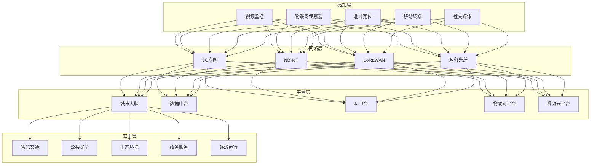
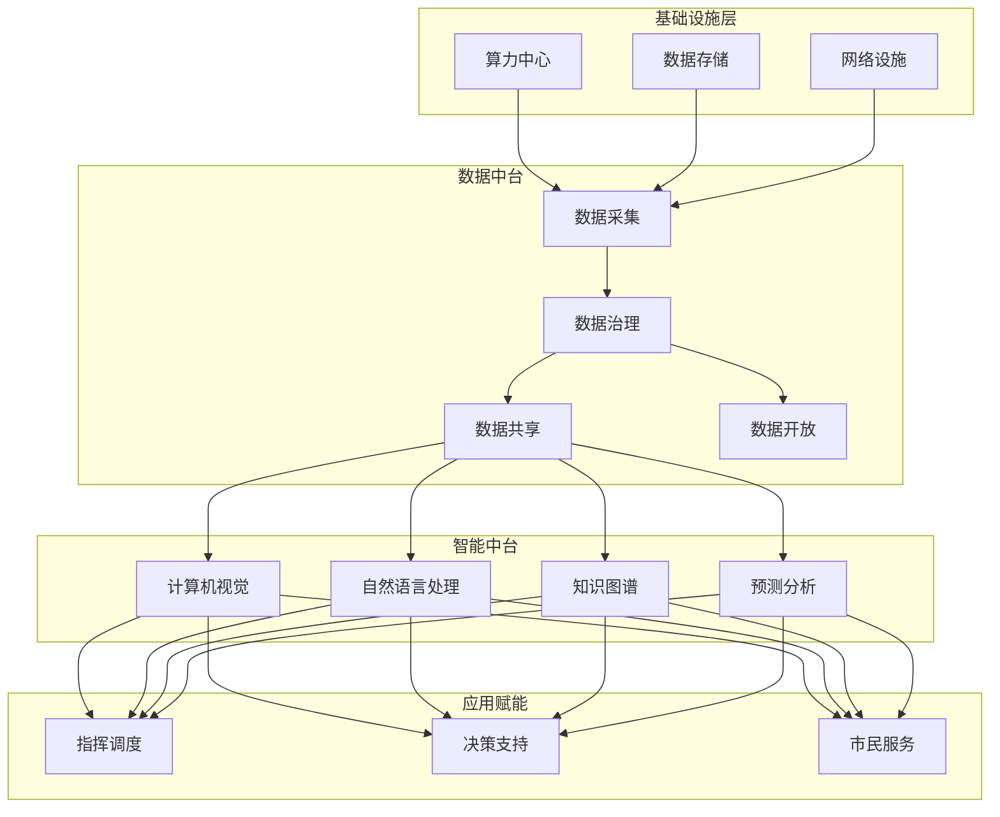
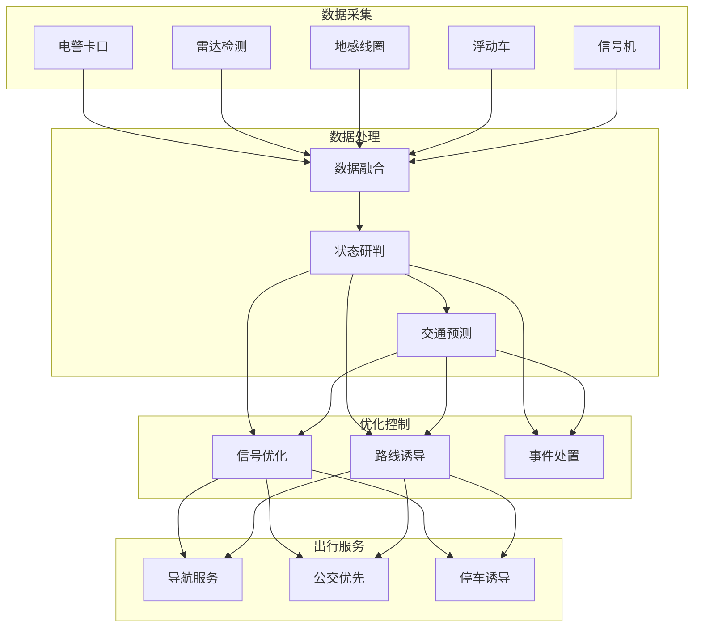
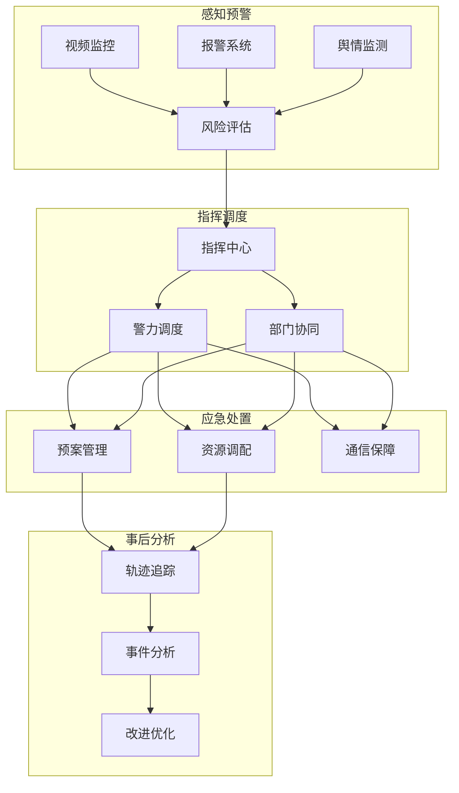
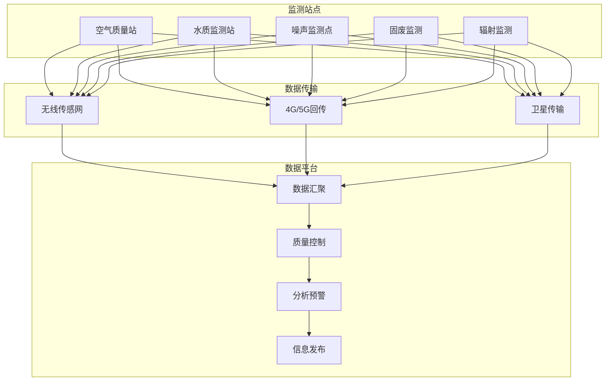

# 智慧城市架构案例

**文档版本**：v1.0
**创建时间**：2026年
**最后更新**：2026年
**状态**：✅ 已完成

---

## 📋 执行摘要

智慧城市架构通过城市大脑实现城市级数据汇聚与智能决策，利用交通优化系统缓解城市拥堵，依托公共安全体系保障市民安全，借助环境监测网络守护城市生态，支撑城市治理的数字化、智能化转型。

---

## 一、核心概念

### 1.1 定义与原理

智慧城市架构是指运用物联网、大数据、人工智能等技术，对城市运行核心系统进行感测、分析、整合和响应的技术体系，核心包括：

- **城市大脑**：城市级数据汇聚、计算与决策中枢
- **交通优化**：基于实时数据的智能交通管理与优化
- **公共安全**：视频监控、应急指挥、风险评估一体化体系
- **环境监测**：空气、水质、噪声等多维度环境感知网络

核心原理：
- **全域感知**：城市要素的全面数字化感知
- **数据融合**：多源异构数据的关联分析与挖掘
- **智能决策**：AI驱动的城市运行优化决策
- **协同联动**：跨部门、跨系统的业务协同

### 1.2 关键特性

| 特性 | 描述 |
|------|------|
| **海量接入** | 支持千万级物联网设备接入 |
| **实时处理** | 视频/传感器数据秒级分析响应 |
| **多维融合** | 人、车、路、环境多维度数据融合 |
| **安全可控** | 等保三级+，关键系统国产化 |
| **开放共享** | 数据开放平台，赋能创新应用 |

### 1.3 适用场景

| 场景 | 适用性 | 说明 |
|------|--------|------|
| 特大城市治理 | ⭐⭐⭐⭐⭐ | 人口>1000万，治理复杂度最高 |
| 省会城市建设 | ⭐⭐⭐⭐⭐ | 区域中心，示范效应强 |
| 地级市升级 | ⭐⭐⭐⭐ | 性价比高，快速见效 |
| 新区建设 | ⭐⭐⭐⭐⭐ | 一张白纸，顶层设计 |
| 县域治理 | ⭐⭐⭐ | 基础版配置，重点场景 |

---

## 二、技术细节

### 2.1 架构设计



### 2.2 核心模块详解

#### 2.2.1 城市大脑

**功能描述**：城市数据汇聚、智能分析与决策支持中枢

**架构层次**：


**数据资源目录**：
| 数据域 | 数据来源 | 数据量级 | 更新频率 |
|--------|----------|----------|----------|
| 人口数据 | 公安/卫健 | 千万级 | 日 |
| 法人数据 | 市场监管 | 百万级 | 日 |
| 空间地理 | 自然资源 | TB级 | 月 |
| 交通数据 | 交警/公交 | 亿级/日 | 实时 |
| 环境数据 | 环保监测 | 千万级/日 | 小时 |
| 视频数据 | 公安/城管 | PB级 | 实时 |

**智能算法能力**：
| 能力 | 算法 | 应用场景 |
|------|------|----------|
| 目标检测 | YOLO/Faster R-CNN | 人员/车辆识别 |
| 行为分析 | LSTM/Transformer | 异常行为检测 |
| 知识推理 | 图神经网络 | 事件关联分析 |
| 预测模型 | 时序预测/XGBoost | 流量/趋势预测 |
| 自然语言 | BERT/GPT | 市民诉求分析 |

#### 2.2.2 交通优化

**功能描述**：基于实时数据的交通态势感知与优化调控

**系统架构**：


**信号优化算法**：
| 算法 | 原理 | 适用场景 |
|------|------|----------|
| 定时控制 | 预设配时方案 | 流量稳定路口 |
| 感应控制 | 检测器触发 | 流量波动大 |
| 自适应控制 | 实时优化 | 复杂路网 |
| 绿波协调 | 干线协调 | 主干道 |
| 区域协调 | 多路口协同 | 区域路网 |

**交通流量预测**：
```
输入特征：
├── 历史流量（7天、30天周期）
├── 实时流量（前30分钟）
├── 天气数据（降雨、温度）
├── 事件数据（施工、事故）
└── 日期特征（工作日/节假日）

模型：
├── 短期（5分钟）：LSTM/GRU
├── 中期（1小时）：Seq2Seq+Attention
└── 长期（1天）：Prophet+XGBoost
```

**出行即服务（MaaS）**：
| 服务 | 内容 | 数据源 |
|------|------|--------|
| 实时路况 | 拥堵指数、通行时间 | 多源检测器融合 |
| 智能导航 | 动态路线规划 | 实时路况+预测 |
| 公交优先 | 绿灯延长、红灯早断 | 公交定位+信号控制 |
| 停车诱导 | 空余车位、路径引导 | 停车场检测 |

#### 2.2.3 公共安全

**功能描述**：城市安全风险感知、预警与应急处置

**防控体系架构**：


**视频AI分析能力**：
| 能力 | 功能 | 准确率 |
|------|------|--------|
| 人脸识别 | 重点人员布控 | >99% |
| 车辆识别 | 车牌/车型/颜色 | >98% |
| 行为分析 | 打架/摔倒/聚集 | >90% |
| 轨迹追踪 | 跨摄像头追踪 | >85% |
| 人群密度 | 拥挤度估算 | >95% |

**应急指挥体系**：
```
响应等级：
├── IV级（一般）：部门级响应
├── III级（较大）：分管领导指挥
├── II级（重大）：主要领导指挥
└── I级（特别重大）：应急指挥部统一指挥

指挥流程：
接警 → 研判 → 决策 → 调度 → 处置 → 评估
```

#### 2.2.4 环境监测

**功能描述**：城市生态环境的全要素监测与治理

**监测网络架构**：


**监测指标体系**：
| 环境要素 | 指标 | 监测频率 |
|----------|------|----------|
| 空气质量 | PM2.5/PM10/O3/NO2/SO2/CO | 小时 |
| 水环境 | COD/氨氮/总磷/溶解氧 | 4小时 |
| 噪声 | 等效声级 | 分钟 |
| 污染源 | 烟气/废水排放浓度 | 实时 |
| 生态 | 绿化覆盖率/生物多样性 | 季度 |

**污染溯源算法**：
```
溯源方法：
├── 受体模型：化学质量平衡（CMB）
├── 扩散模型：高斯烟羽模型
├── 数值模拟：WRF-CMAQ/CAMx
└── 机器学习：随机森林/神经网络

数据输入：
├── 监测数据：多站点浓度
├── 气象数据：风向/风速/温度
├── 排放清单：污染源分布
└── 卫星遥感：PM2.5/TVOC
```

---

## 三、系统对比

### 3.1 城市大脑平台对比

| 维度 | 阿里城市大脑 | 华为城市智能体 | 腾讯WeCity | 百度ACE |
|------|--------------|----------------|------------|---------|
| 数据能力 | 强 | 强 | 中 | 中 |
| AI能力 | 强 | 强 | 中 | 强 |
| 交通优化 | 强 | 强 | 中 | 强 |
| 政务服务 | 中 | 强 | 强 | 弱 |
| 生态建设 | 强 | 强 | 强 | 中 |

### 3.2 交通信号系统对比

| 厂商 | 产品 | 优势 | 部署案例 |
|------|------|------|----------|
| 海信网络 | HiCON | 本土化强 | 全国100+城市 |
| 西门子 | SCOOT | 算法先进 | 北京/上海 |
| 千方科技 | 交通大脑 | 集成度高 | 杭州/深圳 |
| 易华录 | 信号控制 | 性价比高 | 二三线城市 |

### 3.3 视频分析平台对比

| 厂商 | 识别准确率 | 并发能力 | 特色功能 |
|------|------------|----------|----------|
| 海康威视 | 高 | 强 | 端边云协同 |
| 大华股份 | 高 | 强 | 行业场景丰富 |
| 商汤科技 | 很高 | 中 | 算法领先 |
| 旷视科技 | 很高 | 中 | 城市级应用 |

---

## 四、实践指南

### 4.1 部署架构

```yaml
# 城市大脑Kubernetes部署
apiVersion: apps/v1
kind: Deployment
metadata:
  name: city-brain-core
  namespace: smart-city
spec:
  replicas: 5
  template:
    spec:
      containers:
      - name: brain-core
        image: city/brain-core:v3.0
        resources:
          requests:
            memory: "32Gi"
            cpu: "16"
          limits:
            memory: "64Gi"
            cpu: "32"
        env:
        - name: DATA_CENTER_ID
          value: "DC01"
        - name: COMPUTE_MODE
          value: "distributed"
        - name: AI_ACCELERATOR
          value: "GPU"
        volumeMounts:
        - name: data-volume
          mountPath: /data
        - name: model-volume
          mountPath: /models
      nodeSelector:
        node-type: compute-intensive
      tolerations:
      - key: "dedicated"
        operator: "Equal"
        value: "city-brain"
        effect: "NoSchedule"
```

### 4.2 最佳实践

1. **数据治理**
   - 建立统一数据标准与规范
   - 构建人口/法人/空间基础库
   - 数据分类分级安全管理
   - 数据质量监控与评估

2. **安全建设**
   - 关键系统国产化替代
   - 视频专网与政务网隔离
   - 数据加密存储与传输
   - 访问行为全程审计

3. **协同机制**
   - 建立跨部门数据共享机制
   - 明确数据权属与责任
   - 建设统一指挥调度中心
   - 制定应急预案与演练

4. **运营模式**
   - 政府主导+企业建设运营
   - 数据资产化运营探索
   - 应用生态培育与扶持
   - 持续迭代优化机制

### 4.3 常见问题

**Q1: 如何解决数据孤岛问题？**
A: 建立统一数据中台，制定数据共享清单，通过法律/行政手段打破部门壁垒，技术层面采用API网关+数据交换平台。

**Q2: 海量视频数据如何存储与检索？**
A: 采用分布式存储（对象存储+分布式文件系统），视频结构化提取关键信息，基于特征值快速检索，冷数据归档至低频存储。

**Q3: 如何保证实时分析的准确性？**
A: 多源数据交叉验证，AI+人工复核模式，持续算法优化与模型迭代，边缘计算降低传输延迟。

**Q4: 市民隐私如何保护？**
A: 数据脱敏处理，最小必要原则采集，访问权限严格控制，人脸识别等敏感应用需明示告知。

---

## 五、与其他主题的关联

### 5.1 上游依赖

- [物联网平台架构案例](./物联网平台架构案例.md) - 城市感知设备接入
- [大数据平台架构案例](./大数据平台架构案例.md) - 城市数据治理
- [AI平台架构案例](./AI平台架构案例.md) - 智能算法能力

### 5.2 下游应用

- [视频流媒体架构案例](./视频流媒体架构案例.md) - 视频云能力
- [交通优化](#222-交通优化) - 智能交通管理

### 5.3 相关概念

| 概念 | 关系 | 说明 |
|------|------|------|
| 数字政府 | 扩展 | 政务服务数字化 |
| 数字孪生城市 | 应用 | 城市级数字孪生 |
| 一网统管 | 实践 | 城市治理新模式 |

---

## 六、参考资源

### 6.1 政策标准

1. [国家智慧城市标准体系](http://www.sac.gov.cn/) - 国家标准委发布
2. [新型智慧城市评价指标](http://www.miit.gov.cn/) - 工信部发布
3. [智慧城市 顶层设计指南](https://www.gb688.cn/) - GB/T 36333-2018

### 6.2 开源项目

1. [CityJSON](https://www.cityjson.org/) - 城市数据交换格式
2. [3D Tiles](https://github.com/CesiumGS/3d-tiles) - 3D地理数据规范
3. [OpenStreetMap](https://www.openstreetmap.org/) - 开源地图数据

### 6.3 案例参考

1. [杭州城市大脑](https://www.hzcitybrain.com/) - 城市交通治理标杆
2. [上海一网统管](http://www.shanghai.gov.cn/) - 城市运行管理典范
3. [深圳智慧城市](http://www.sz.gov.cn/) - 数字政府建设样板

### 6.4 相关文档

- [分布式大数据处理](../03-advanced/分布式大数据处理.md)
- [实时计算](../03-advanced/实时计算.md)
- [知识图谱](../03-advanced/知识图谱.md)

---

**维护者**：项目团队
**最后更新**：2026年
