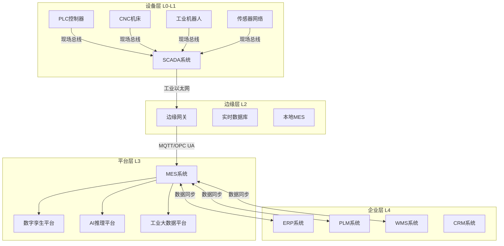
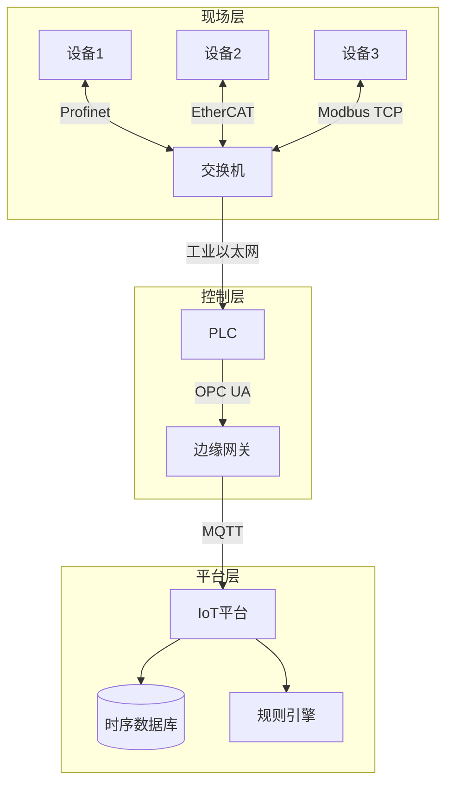
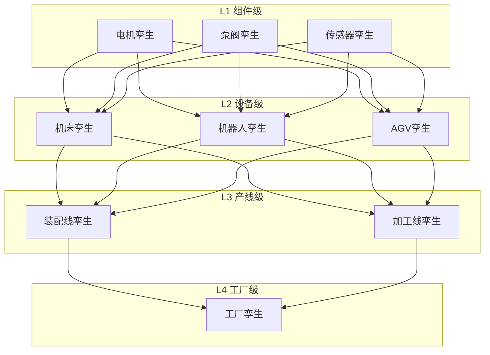
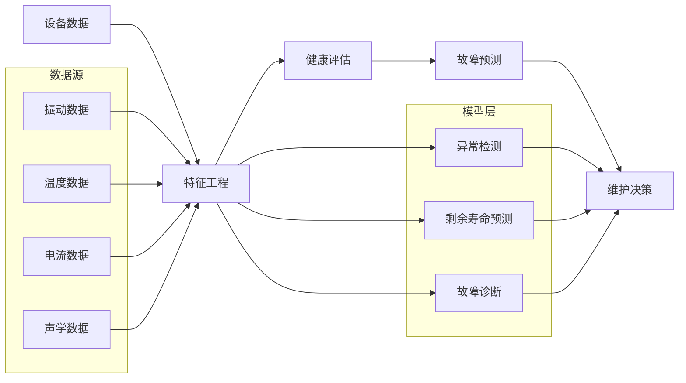
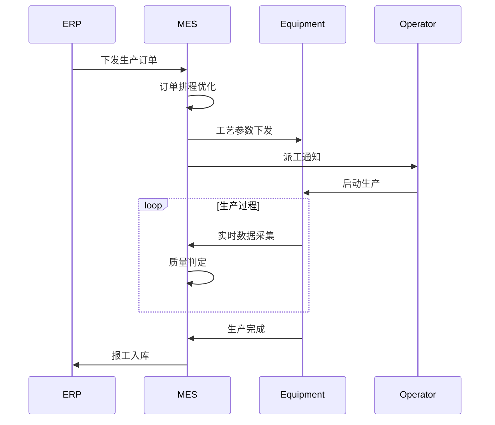

# 智能制造架构案例

**文档版本**：v1.0
**创建时间**：2026年
**最后更新**：2026年
**状态**：✅ 已完成

---

## 📋 执行摘要

智能制造架构通过工业物联网（IIoT）实现设备互联，借助数字孪生技术构建虚拟工厂，运用预测性维护降低设备故障，依托MES系统实现生产过程的精细化管理，支撑制造业的数字化转型。

---

## 一、核心概念

### 1.1 定义与原理

智能制造架构是指支撑智能工厂运行的分布式技术体系，核心包括：

- **工业物联网（IIoT）**：生产设备、传感器、控制器的全面互联
- **数字孪生（Digital Twin）**：物理实体的虚拟映射与实时同步
- **预测性维护（PdM）**：基于数据分析的设备故障预测
- **制造执行系统（MES）**：生产过程的执行管理与优化

核心原理：
- **OT与IT融合**：运营技术与信息技术的深度集成
- **数据驱动决策**：实时数据支撑生产决策优化
- **闭环控制**：计划-执行-监控-优化的持续迭代
- **柔性制造**：快速响应市场需求变化

### 1.2 关键特性

| 特性 | 描述 |
|------|------|
| **实时性** | 生产数据采集频率毫秒级，控制响应<10ms |
| **可靠性** | 系统可用性≥99.9%，关键系统≥99.99% |
| **安全性** | 工控安全隔离，符合等保2.0要求 |
| **可扩展** | 支持产线快速重构、设备即插即用 |
| **互操作** | 支持OPC UA、MQTT等工业标准协议 |

### 1.3 适用场景

| 场景 | 适用性 | 说明 |
|------|--------|------|
| 汽车整车制造 | ⭐⭐⭐⭐⭐ | 复杂装配、质量追溯、柔性产线 |
| 电子组装 | ⭐⭐⭐⭐⭐ | 精密控制、AOI检测、快速换线 |
| 钢铁冶金 | ⭐⭐⭐⭐ | 高温环境、连续生产、能耗优化 |
| 化工制药 | ⭐⭐⭐⭐⭐ | 批次控制、合规追溯、配方管理 |
| 食品生产 | ⭐⭐⭐⭐ | 批次追溯、洁净控制、柔性生产 |

---

## 二、技术细节

### 2.1 架构设计



### 2.2 核心模块详解

#### 2.2.1 工业物联网（IIoT）

**功能描述**：实现工厂设备的全面连接与数据采集

**网络架构**：


**工业协议对比**：

| 协议 | 适用场景 | 传输速率 | 实时性 | 拓扑结构 |
|------|----------|----------|--------|----------|
| Profinet | 工厂自动化 | 100Mbps-1Gbps | 硬实时 | 线型/星型 |
| EtherCAT | 运动控制 | 100Mbps | 硬实时 | 线型/树型 |
| Modbus TCP | 简单设备 | 100Mbps | 软实时 | 总线型 |
| OPC UA | 跨平台互联 | 灵活 | 软实时 | 星型 |
| MQTT | 物联网采集 | 灵活 | 非实时 | 发布订阅 |

**边缘计算架构**：
```
边缘节点部署：
├── 数据采集：多协议适配（Modbus/OPC UA/私有协议）
├── 数据预处理：滤波、压缩、格式转换
├── 本地决策：毫秒级控制响应
├── 边缘AI：本地推理，减少云端依赖
└── 安全隔离：OT/IT网络边界防护
```

**数据采集策略**：
| 数据类型 | 采集频率 | 存储策略 | 用途 |
|----------|----------|----------|------|
| 设备状态 | 1s | 7天热存储 | 实时监控 |
| 生产计数 | 每次触发 | 永久存储 | 产量统计 |
| 工艺参数 | 100ms | 1月热存储 | 质量追溯 |
| 告警事件 | 实时 | 永久存储 | 故障分析 |
| 能耗数据 | 15min | 3年存储 | 能效分析 |

#### 2.2.2 数字孪生

**功能描述**：构建物理工厂的虚拟映射，实现全生命周期管理

**数字孪生层次**：


**核心技术要素**：
| 要素 | 技术 | 说明 |
|------|------|------|
| 几何建模 | CAD/BIM | 物理实体的3D模型 |
| 物理建模 | 仿真引擎 | 物理规律模拟（力学/热学/流体） |
| 数据映射 | 实时同步 | 物理→虚拟的数据映射 |
| 行为建模 | 状态机/Agent | 实体行为逻辑建模 |
| 可视化 | WebGL/UE/Unity | 3D可视化展示 |

**应用场景**：

| 场景 | 价值 | 技术实现 |
|------|------|----------|
| 虚拟调试 | 缩短产线调试周期50%+ | PLC代码虚拟验证 |
| 工艺优化 | 减少试制成本 | 仿真优化工艺参数 |
| 培训仿真 | 零风险操作培训 | VR/AR沉浸式训练 |
| 远程运维 | 专家远程诊断 | 虚实叠加指导 |

**数据同步机制**：
```
同步模式：
├── 实时同步：关键状态毫秒级同步
├── 准实时同步：一般数据秒级同步
├── 批量同步：历史数据定时同步
└── 事件触发：异常/告警即时同步
```

#### 2.2.3 预测性维护

**功能描述**：基于设备数据预测故障，实现主动维护

**系统架构**：


**预测模型对比**：

| 方法 | 适用场景 | 优势 | 局限 |
|------|----------|------|------|
| 基于阈值 | 简单参数监控 | 简单直观 | 误报率高 |
| 统计模型 | 稳定工况 | 可解释性强 | 复杂工况效果差 |
| 机器学习 | 多因子分析 | 精度高 | 需要大量数据 |
| 深度学习 | 复杂非线性 | 自动特征提取 | 黑盒模型 |
| 物理模型 | 机理明确 | 可解释、可外推 | 建模成本高 |

**故障预测指标体系**：
| 指标 | 定义 | 预警级别 |
|------|------|----------|
| 健康指数（HI） | 0-100分设备健康评分 | <70黄警，<50红警 |
| 剩余寿命（RUL） | 预计剩余可用时间 | <7天预警 |
| 故障概率 | 特定时间段故障可能性 | >30%预警 |
| 异常分数 | 偏离正常模式程度 | >3σ预警 |

**维护策略决策**：
```
决策逻辑：
├── 故障概率高 + 影响大 → 立即停机检修
├── 故障概率中 + 有备件 → 计划维护
├── 故障概率低 + 可监控 → 继续观察
└── 多设备关联故障 → 系统级维护计划
```

#### 2.2.4 MES系统

**功能描述**：制造执行管理，连接计划层与设备层

**功能架构**：
```
MES功能模块：
├── 生产调度
│   ├── 订单排程
│   ├── 资源分配
│   └── 动态调整
├── 生产执行
│   ├── 工单下达
│   ├── 工艺指导
│   └── 数据采集
├── 质量管理
│   ├── 来料检验
│   ├── 过程检验
│   └── 成品检验
├── 物料管理
│   ├── 物料追踪
│   ├── 线边库管理
│   └── 物料拉动
├── 设备管理
│   ├── 设备台账
│   ├── 维保计划
│   └── OEE分析
└── 追溯分析
    ├── 批次追溯
    ├── 谱系追踪
    └── 报表分析
```

**核心流程**：


**与其他系统集成**：
| 系统 | 集成内容 | 数据流向 |
|------|----------|----------|
| ERP | 订单、物料主数据 | 双向 |
| PLM | 工艺路线、BOM | PLM→MES |
| WMS | 物料出入库 | 双向 |
| SCADA | 设备状态、产量 | SCADA→MES |
| QMS | 检验标准、不合格品 | 双向 |

---

## 三、系统对比

### 3.1 工业云平台对比

| 维度 | 西门子MindSphere | 施耐德EcoStruxure | 华为FusionPlant | 阿里云ET工业 |
|------|-------------------|-------------------|-----------------|--------------|
| 部署方式 | 公有云/私有化 | 混合云 | 公有云/边缘 | 公有云 |
| 连接能力 | 强（西门子生态） | 强（施耐德生态） | 中 | 中 |
| 数字孪生 | 强 | 中 | 中 | 弱 |
| AI能力 | 中 | 中 | 强 | 强 |
| 行业方案 | 汽车/电子 | 能源/楼宇 | 电子/钢铁 | 通用 |

### 3.2 MES厂商对比

| 厂商 | 定位 | 优势行业 | 技术特点 |
|------|------|----------|----------|
| 西门子Opcenter | 高端 | 汽车/航空 | 与PLM深度集成 |
| 达索DELMIA | 高端 | 航空/汽车 | 3D制造仿真 |
| 宝信iPlat | 中端 | 钢铁/冶金 | 国产化适配 |
| 黑湖智造 | SaaS MES | 离散制造 | 快速部署 |
| 摩尔元数 | 中端 | 电子/食品 | 低代码配置 |

### 3.3 边缘计算方案对比

| 方案 | 算力 | 延迟 | 成本 | 适用场景 |
|------|------|------|------|----------|
| 工控机+软件 | 中 | <10ms | 中 | 通用边缘计算 |
| 专用边缘网关 | 低 | <5ms | 低 | 简单数据采集 |
| GPU边缘服务器 | 高 | <20ms | 高 | AI推理 |
| FPGA方案 | 高 | <1ms | 高 | 高速信号处理 |

---

## 四、实践指南

### 4.1 部署配置

```yaml
# 边缘网关Docker Compose配置
version: '3.8'
services:
  edge-gateway:
    image: industrial/edge-gateway:v2.1
    container_name: edge-gw
    restart: always
    network_mode: host
    volumes:
      - ./config:/app/config
      - ./data:/app/data
    environment:
      - DEVICE_ID=EDGE001
      - OPC_UA_ENDPOINT=opc.tcp://192.168.1.100:4840
      - MQTT_BROKER=tcp://cloud.mqtt.server:1883
      - DATA_SAMPLING_RATE=1000
    devices:
      - /dev/ttyUSB0:/dev/ttyUSB0
    privileged: true
    logging:
      driver: "json-file"
      options:
        max-size: "100m"
        max-file: "5"
```

### 4.2 最佳实践

1. **网络架构设计**
   - OT网络与IT网络物理隔离
   - 部署工业防火墙做边界防护
   - 核心生产网使用冗余环网
   - 无线网仅用于非关键场景

2. **数据治理**
   - 统一数据模型与编码规范
   - 建立主数据管理体系
   - 数据质量监控与清洗
   - 数据安全分级分类

3. **系统集成**
   - 优先采用标准协议（OPC UA/MQTT）
   - 建立企业服务总线（ESB）
   - API网关统一管理接口
   - 数据总线解耦系统间依赖

4. **安全保障**
   - 工控系统白名单防护
   - 关键设备物理隔离
   - 定期安全评估与渗透测试
   - 建立应急响应预案

### 4.3 常见问题

**Q1: 老旧设备如何实现数据采集？**
A: 可通过协议转换网关（如将串口转为以太网）、外接传感器+边缘网关、或更换智能网关模块等方式实现。

**Q2: 如何保证生产数据实时性？**
A: 关键数据采用实时数据库（如PI、eDNA），控制指令通过现场总线直接下发，边缘计算在本地处理实时决策。

**Q3: 数字孪生建设从何处入手？**
A: 建议从单台关键设备开始，验证技术可行性，再扩展到产线，最终构建工厂级孪生。优先选择高价值、高故障率的设备。

**Q4: 预测性维护模型如何训练？**
A: 收集设备历史运行数据和故障记录，标注故障样本，采用迁移学习应对数据不足问题，模型上线后持续迭代优化。

---

## 五、与其他主题的关联

### 5.1 上游依赖

- [物联网平台架构案例](./物联网平台架构案例.md) - 设备连接与数据采集
- [大数据平台架构案例](./大数据平台架构案例.md) - 工业数据分析
- [AI平台架构案例](./AI平台架构案例.md) - AI模型训练与推理

### 5.2 下游应用

- [预测性维护](#223-预测性维护) - 设备健康管理
- [数字孪生](#222-数字孪生) - 虚拟工厂建设

### 5.3 相关概念

| 概念 | 关系 | 说明 |
|------|------|------|
| 工业4.0 | 战略框架 | 智能制造的顶层设计 |
| 工业互联网 | 基础设施 | 智能制造的网络基础 |
| 精益生产 | 方法论 | 智能制造的管理基础 |

---

## 六、参考资源

### 6.1 行业标准

1. [ISA-95](https://www.isa.org/) - 企业控制系统集成标准
2. [IEC 62264](https://webstore.iec.ch/) - 企业控制系统集成国际标准
3. [OPC UA](https://opcfoundation.org/) - 统一架构工业互操作标准

### 6.2 开源项目

1. [Eclipse Milo](https://github.com/eclipse/milo) - Java OPC UA实现
2. [Node-RED](https://nodered.org/) - 工业物联网可视化编程
3. [ThingsBoard](https://thingsboard.io/) - 开源IoT平台

### 6.3 参考架构

1. [RAMI 4.0](https://www.plattform-i40.de/) - 德国工业4.0参考架构
2. [中国智能制造参考架构](http://www.miit.gov.cn/) - 中国智能制造体系指南
3. [NIST智能制造](https://www.nist.gov/) - 美国智能制造标准框架

### 6.4 相关文档

- [分布式实时计算](../03-advanced/分布式实时计算.md)
- [时序数据库](../03-advanced/时序数据库.md)
- [数据安全与隐私](../03-advanced/数据加密与安全.md)

---

**维护者**：项目团队
**最后更新**：2026年
