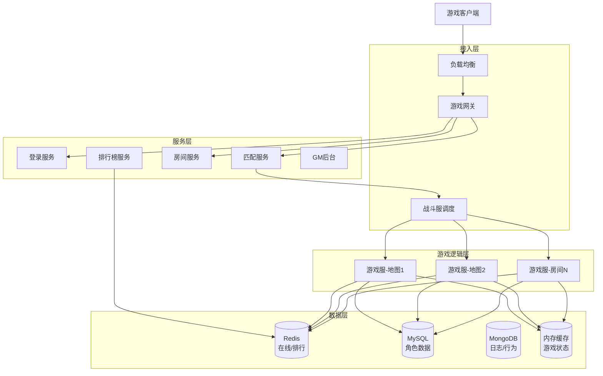

# 游戏系统架构案例专题文档

**文档版本**：v1.0
**创建时间**：2026年
**最后更新**：2026年
**状态**：✅ 已完成

---

## 📋 执行摘要

游戏系统架构关注低延迟、高并发、状态同步和公平性，核心挑战在于游戏服务器管理、玩家匹配、实时通信和排行榜系统。

---

## 一、核心概念

### 1.1 定义与原理

游戏系统是一种需要极低延迟和高实时性的分布式系统，其核心原理包括：

- **状态同步**：客户端预测 + 服务端校验的同步模式
- **帧同步 vs 状态同步**：不同游戏类型的同步方案选择
- **房间模型**：游戏逻辑在独立的游戏房间/地图进程中执行
- **分区分服**：玩家按地域或注册时间分配到不同服务器

### 1.2 关键特性

- **低延迟**：游戏响应延迟 < 50ms
- **高吞吐**：支持万人同服
- **强一致性**：游戏状态必须一致，不能出现分歧
- **容错性**：断线重连，状态恢复
- **反作弊**：服务端权威验证

### 1.3 适用场景

| 场景 | 适用性 | 说明 |
|------|--------|------|
| MOBA游戏 | ⭐⭐⭐⭐⭐ | 英雄联盟、王者荣耀 |
| FPS游戏 | ⭐⭐⭐⭐⭐ | CS:GO、Valorant |
| MMORPG | ⭐⭐⭐⭐ | 魔兽世界、原神 |
| 棋牌游戏 | ⭐⭐⭐⭐ | 斗地主、麻将 |
| 休闲游戏 | ⭐⭐⭐ | 消消乐、跑酷 |

---

## 二、技术细节

### 2.1 架构设计



### 2.2 核心模块详解

#### 2.2.1 游戏服务器（房间/地图）

**服务器类型**：
| 类型 | 功能 | 部署方式 |
|------|------|----------|
| 登录服 | 账号验证、服列表 | 多实例无状态 |
| 游戏服 | 游戏逻辑执行 | 有状态，单地图单进程 |
| 战斗服 | PVP/PVE战斗 | 独立进程，动态扩缩容 |
| 场景服 | MMORPG大地图 | 分线/分区域部署 |

**房间模型设计**：
```
房间生命周期：
创建 → 匹配填充 → 游戏开始 → 进行中 → 结束结算 → 销毁

房间属性：
- roomId: 房间唯一标识
- gameMode: 游戏模式（排位/匹配/自定义）
- maxPlayers: 最大人数
- status: 等待/游戏中/结算
- players: 玩家列表（座位/阵营）
- gameState: 当前游戏状态机
```

**分区分服策略**：
```
┌─────────────────────────────────────────┐
│              全球服架构                  │
├─────────────────────────────────────────┤
│  大区A（亚洲）   大区B（欧洲）  大区C（美洲）│
│  ├─ 服1        ├─ 服1       ├─ 服1     │
│  ├─ 服2        ├─ 服2       ├─ 服2     │
│  └─ 服N        └─ 服N       └─ 服N     │
└─────────────────────────────────────────┘

跨服对战：
- 匹配时跨大区匹配
- 战斗服就近部署
- 数据最终同步回本服
```

#### 2.2.2 匹配系统

**匹配算法原理**：
```
ELO评分系统：
R' = R + K × (S - E)
其中：
R' = 新评分
R  = 当前评分
K  = 系数（通常16-32）
S  = 实际结果（胜=1，平=0.5，负=0）
E  = 预期胜率 = 1 / (1 + 10^((Rb-Ra)/400))
```

**匹配流程**：
```
玩家进入匹配队列
    ↓
根据ELO评分放入对应区间桶
    ↓
等待匹配（最大等待时间T）
    ↓
匹配条件检查：
  ├─ 人数是否满足？
  ├─ 评分差距 < 阈值？
  └─ 网络延迟是否合适？
    ↓
找到匹配 → 创建房间 → 通知玩家
```

**匹配池设计**：
```python
# 匹配池数据结构
class MatchPool:
    buckets = {
        # ELO区间 → 玩家队列
        (0, 1000): deque(),
        (1000, 1200): deque(),
        (1200, 1400): deque(),
        (1400, 1600): deque(),
        (1600, 9999): deque()
    }
    
    def join(self, player):
        # 根据ELO放入对应桶
        for range, queue in self.buckets.items():
            if range[0] <= player.elo < range[1]:
                queue.append({
                    'player': player,
                    'joinTime': now(),
                    'requirements': player.preferences
                })
                
    def match(self):
        # 优先从高分段开始匹配
        for range in sorted(self.buckets.keys(), reverse=True):
            if len(self.buckets[range]) >= required_players:
                return self._create_match(range)
```

**匹配优化策略**：
1. **扩展匹配**：等待时间增加时扩大ELO阈值
2. **位置优先**：优先匹配网络延迟相近的玩家
3. **预组队处理**：组队玩家优先匹配其他组队
4. **AI填充**：长时间匹配不到时填充机器人

#### 2.2.3 排行榜（Redis Sorted Set）

**Sorted Set实现**：
```redis
# 全局排行榜
ZADD leaderboard:global score member
ZADD leaderboard:global 2500 "player:10001"
ZADD leaderboard:global 2300 "player:10002"

# 查询前100名
ZREVRANGE leaderboard:global 0 99 WITHSCORES

# 查询玩家排名
ZREVRANK leaderboard:global "player:10001"

# 查询玩家附近排名（前后10名）
ZREVRANGEBYSCORE leaderboard:global +inf -inf WITHSCORES LIMIT rank-10 21
```

**排行榜类型**：
| 类型 | Key设计 | 更新频率 |
|------|---------|----------|
| 实时榜 | rank:realtime:{type} | 即时更新 |
| 日榜 | rank:daily:{date}:{type} | 每小时 |
| 周榜 | rank:weekly:{week}:{type} | 每日 |
| 月榜 | rank:monthly:{month}:{type} | 每日 |
| 赛季榜 | rank:season:{season}:{type} | 每小时 |

**排行榜分区**：
```
全局榜 → 所有玩家
├── 好友榜 → 好友列表内排名
├── 区服榜 → 当前服务器排名
└── 分段榜 → 青铜/白银/黄金...

分片存储：
每10万用户一个分片
rank:shard:{shardId}
查询时合并结果
```

**定时结算**：
```python
# 每日结算
@schedule(cron="0 0 * * *")
def daily_settlement():
    # 1. 备份昨日榜单
    redis.rename("rank:daily:today", f"rank:daily:{yesterday}")
    
    # 2. 发放奖励
    top_100 = redis.zrevrange("rank:daily:today", 0, 99)
    for rank, player_id in enumerate(top_100):
        reward = get_daily_reward(rank)
        mail_service.send(player_id, reward)
    
    # 3. 清空今日榜（可选）
    redis.delete("rank:daily:today")
```

#### 2.2.4 实时通信

**状态同步方案对比**：

| 方案 | 原理 | 优点 | 缺点 | 适用游戏 |
|------|------|------|------|----------|
| 帧同步 | 同步输入，客户端计算 | 流量小，精度高 | 依赖客户端 | RTS、MOBA |
| 状态同步 | 同步状态，服务端权威 | 安全，易反作弊 | 流量大 | FPS、MMO |
| 混合同步 | 关键状态+输入同步 | 平衡 | 复杂 | 大部分游戏 |

**帧同步实现**：
```
服务端（房间服）：
┌─────────────────────────────┐
│  收集所有玩家输入（100ms帧）  │
│  → 广播给所有客户端          │
└─────────────────────────────┘

客户端：
┌─────────────────────────────┐
│  接收帧数据 → 本地模拟计算   │
│  → 渲染显示                  │
└─────────────────────────────┘

关键：
- 确定性计算（浮点数一致性）
- 输入延迟（Input Delay）
- 回滚预测（Rollback）
```

**状态同步实现**：
```
服务端（游戏服）：
┌─────────────────────────────┐
│  权威游戏世界模拟            │
│  → 计算所有对象状态          │
│  → 定期广播状态快照（20Hz）  │
└─────────────────────────────┘

客户端：
┌─────────────────────────────┐
│  接收状态快照                │
│  → 插值平滑显示              │
│  → 预测本地玩家操作          │
└─────────────────────────────┘

关键：
- 增量同步（Delta Compression）
- 兴趣管理（AOI）
- 客户端预测 + 服务端校正
```

**AOI（Area of Interest）算法**：
```
九宫格算法：
┌───┬───┬───┐
│ 1 │ 2 │ 3 │
├───┼───┼───┤
│ 4 │ 5 │ 6 │  ← 玩家在5号格，只需同步1-9格内对象
├───┼───┼───┤
│ 7 │ 8 │ 9 │
└───┴───┴───┘

十字链表算法：
- X轴链表 + Y轴链表
- 快速查找视野范围内对象
- 适合大地图MMO
```

### 2.3 实现机制

#### 断线重连机制
```
1. 心跳检测：客户端每5秒发送心跳
2. 超时判定：服务端10秒未收到心跳标记离线
3. 状态保存：玩家状态定期写入Redis
4. 重连恢复：客户端重新连接后拉取状态
5. 快速重连：断线30秒内可回到原游戏
```

#### 反作弊系统
```
┌─────────────┐    ┌─────────────┐    ┌─────────────┐
│   客户端     │    │   服务端     │    │   反作弊中心 │
│  行为上报    │ → │  数据校验    │ → │  模型检测    │
└─────────────┘    └─────────────┘    └─────────────┘
                                              ↓
                                       ┌─────────────┐
                                       │  封禁系统    │
                                       └─────────────┘

校验内容：
- 移动速度校验
- 伤害数值校验
- 技能冷却校验
- 视野范围校验
```

---

## 三、系统对比

### 3.1 游戏类型架构对比

| 维度 | MOBA | FPS | MMORPG | 棋牌 |
|------|------|-----|--------|------|
| 同步方式 | 帧同步 | 状态同步 | 状态同步 | 状态同步 |
| 延迟要求 | <50ms | <30ms | <100ms | <200ms |
| 并发规模 | 10v10 | 50vs50 | 万人同服 | 单桌4-8人 |
| 状态复杂度 | 中等 | 高 | 极高 | 低 |
| 反作弊难度 | 高 | 极高 | 中等 | 高 |

### 3.2 同步方案决策树

```
游戏类型分析
├── 实时对抗？
│   ├── 是 → 延迟要求 < 50ms？
│   │   ├── 是 → 帧同步（MOBA、RTS）
│   │   └── 否 → 状态同步（MMO、ARPG）
│   └── 否 → 回合制同步（棋牌、回合RPG）
└── 是否强调公平？
    ├── 是 → 帧同步 + 输入校验
    └── 否 → 状态同步 + 客户端预测
```

### 3.3 性能基准

| 指标 | 目标值 | 说明 |
|------|--------|------|
| 战斗服延迟 | P99 < 30ms | 同地区 |
| 匹配等待 | P90 < 30s | 高峰时段 |
| 同时在线 | 单服1万+ | MMORPG |
| 排行榜查询 | P99 < 10ms | Top 100 |
| 断线重连 | < 3s | 状态恢复 |

---

## 四、实践指南

### 4.1 部署配置

```yaml
# 游戏服配置
game-server:
  network:
    protocol: udp           # 游戏数据优先UDP
    port-range: 10000-20000
    tick-rate: 30           # 每秒30帧
    
  room:
    max-rooms: 1000         # 单服最大房间数
    max-players-per-room: 10
    idle-timeout: 300s      # 空闲房间超时
    
  matchmaking:
    queue-timeout: 120s     # 匹配超时
    elo-expand-rate: 100    # 每秒扩大ELO范围
    skill-priority: 0.7     # 技能匹配权重
    latency-priority: 0.3   # 延迟匹配权重
    
  redis:
    cluster: true
    nodes: ["redis-1:6379", "redis-2:6379"]
    
  anti-cheat:
    enabled: true
    check-interval: 1s
    ban-threshold: 0.95     # 作弊置信度阈值
```

### 4.2 最佳实践

1. **服务器无状态化**
   - 网关层完全无状态
   - 游戏服状态持久化到Redis
   - 支持快速重启和迁移

2. **网络优化**
   - 使用UDP减少延迟
   - 数据包压缩（KCP协议）
   - 丢包重传策略

3. **水平扩展**
   - 按地图/房间分片
   - 战斗服动态扩缩容
   - 匹配服务独立扩展

4. **容灾设计**
   - 游戏服主备部署
   - 状态定期checkpoint
   - 多机房部署

### 4.3 常见问题

**Q1: 帧同步浮点数不一致怎么办？**
A:
- 使用定点数（Fixed Point）替代浮点数
- 统一数学库（如 deterministic Math）
- 关键计算服务端校验

**Q2: 如何处理外挂和作弊？**
A:
- 服务端权威验证所有关键操作
- 行为分析检测异常模式
- 客户端代码混淆 + 签名校验

**Q3: 游戏服内存占用过高？**
A:
- AOI算法减少同步对象
- 对象池复用避免GC
- 分区分线减少单服压力

---

## 五、形式化分析

### 5.1 一致性模型

**游戏状态一致性要求**：
- **强一致性**：游戏世界状态所有客户端必须一致
- **因果一致性**：操作顺序必须符合因果关系
- **最终一致性**：排行榜等非关键数据允许延迟

### 5.2 复杂度分析

| 操作 | 时间复杂度 | 空间复杂度 |
|------|-----------|-----------|
| 匹配查找 | O(log n) | O(n) |
| 排行榜查询 | O(log n + k) | O(n) |
| AOI对象查找 | O(1) | O(n) |
| 状态同步 | O(m) | O(m) m=视野内对象数 |

---

## 六、与其他主题的关联

### 6.1 上游依赖

- [分布式缓存](../07-middleware/Redis缓存策略.md)
- [实时通信协议](../04-network/websocket协议详解.md)
- [负载均衡](../04-network/负载均衡.md)

### 6.2 下游应用

- [社交系统架构案例](./社交系统架构案例.md)
- [物联网平台架构案例](./物联网平台架构案例.md)

### 6.3 相关概念

| 概念 | 关系 | 说明 |
|------|------|------|
| 状态同步 | 核心技术 | 游戏系统基石 |
| 一致性哈希 | 负载均衡 | 玩家路由 |
| 限流算法 | 保护措施 | 防止过载 |

---

## 七、参考资源

### 7.1 学术论文

1. [1500 Archers on a 28.8: Network Programming in Age of Empires and Beyond](https://www.gamedeveloper.com/programming/1500-archers-on-a-28-8-network-programming-in-age-of-empires-and-beyond) - Ensemble Studios
2. [The Tech of Planetary Annihilation: ChronoCam](https://blog.forrestthewoods.com/the-tech-of-planetary-annihilation-chronocam-292e3d6b169a) - Uber Entertainment

### 7.2 开源项目

1. [Pomelo](https://github.com/NetEase/pomelo) - 网易开源游戏服务器框架
2. [KBEngine](https://github.com/kbengine/kbengine) - MMO游戏服务端引擎
3. [Colyseus](https://github.com/colyseus/colyseus) - 多人游戏状态同步框架

### 7.3 学习资料

1. [游戏服务器架构](https://www.skywind.me/blog/archives/2433) - 林伟（云风）
2. [帧同步与状态同步](https://zhuanlan.zhihu.com/p/259218926) - 知乎专栏
3. [王者荣耀技术架构](https://www.infoq.cn/article/kgnrzeisxfpvruf43n4j) - InfoQ

### 7.4 相关文档

- [Redis缓存策略](../07-middleware/Redis缓存策略.md)
- [WebSocket协议](../04-network/websocket协议详解.md)
- [分布式一致性](../06-distributed-systems/分布式一致性协议.md)

---

**维护者**：项目团队
**最后更新**：2026年
