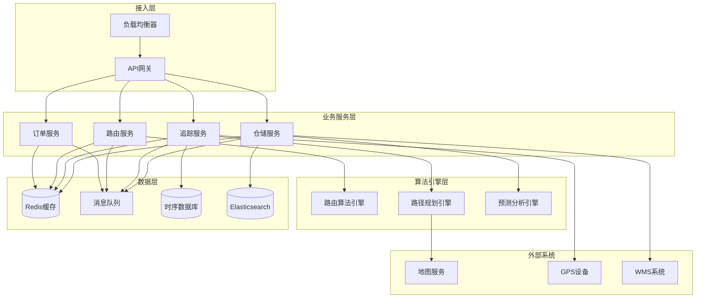
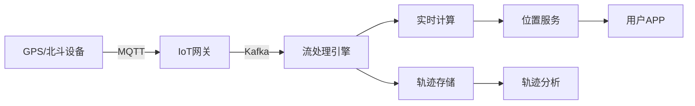

# 物流系统架构案例

**文档版本**：v1.0
**创建时间**：2026年
**最后更新**：2026年
**状态**：✅ 已完成

---

## 📋 执行摘要

物流系统架构通过分布式计算技术实现订单的智能路由、路径的动态规划、货物的实时追踪以及仓储的高效管理，支撑现代供应链体系的数字化转型。

---

## 一、核心概念

### 1.1 定义与原理

物流系统架构是指支撑物流业务全流程的分布式技术体系，涵盖订单管理、运输调度、仓储管理、末端配送等核心环节。其核心原理包括：

- **分布式订单处理**：通过分片与复制机制实现高并发订单处理
- **智能路由算法**：基于运筹学优化算法实现订单与运力最优匹配
- **实时数据流处理**：利用流计算技术实现物流状态实时更新
- **库存优化策略**：基于预测模型实现库存的动态平衡

### 1.2 关键特性

| 特性 | 描述 |
|------|------|
| **高并发处理** | 支持每秒百万级订单创建与查询 |
| **实时性** | 物流状态更新延迟 < 500ms |
| **地理分布式** | 支持跨区域、跨国界的物流协同 |
| **弹性伸缩** | 根据业务峰谷自动扩缩容 |
| **高可用性** | 系统可用性达99.99%，故障自动切换 |

### 1.3 适用场景

| 场景 | 适用性 | 说明 |
|------|--------|------|
| 电商物流 | ⭐⭐⭐⭐⭐ | 高并发、时效性强、覆盖末端配送 |
| 冷链物流 | ⭐⭐⭐⭐⭐ | 温控监控、全程追溯、合规要求 |
| 跨境物流 | ⭐⭐⭐⭐ | 多语言、多币种、海关对接 |
| 同城配送 | ⭐⭐⭐⭐⭐ | 即时性、路径优化、动态调度 |
| 大宗货运 | ⭐⭐⭐ | 周期长、节点少、成本敏感 |

---

## 二、技术细节

### 2.1 架构设计



### 2.2 核心模块详解

#### 2.2.1 订单路由

**功能描述**：将订单智能分配给最优承运方或配送站点

**架构设计**：
```
订单路由流程：
订单创建 → 规则引擎 → 运力评估 → 智能匹配 → 任务分配
                ↓           ↓           ↓
            业务规则    实时运力    评分排序
```

**关键技术**：
- **规则引擎**：Drools/EasyRules实现动态路由规则
- **分布式锁**：Redis RedLock防止订单重复分配
- **评分算法**：多因子综合评分（距离、成本、时效、服务质量）

**路由决策因子**：
| 因子 | 权重 | 说明 |
|------|------|------|
| 地理距离 | 25% | 取货点与配送点距离 |
| 运力负载 | 20% | 当前承运方订单饱和度 |
| 历史时效 | 20% | 历史配送准时率 |
| 成本因素 | 15% | 配送成本估算 |
| 服务评级 | 10% | 承运方服务质量评分 |
| 特殊要求 | 10% | 冷链、保价等特殊需求 |

#### 2.2.2 路径规划

**功能描述**：为配送车辆计算最优配送路线

**算法选择**：

| 场景 | 算法 | 复杂度 | 适用规模 |
|------|------|--------|----------|
| 单点配送 | Dijkstra | O(V²) | 中小规模 |
| 多点配送 | VRP变体 | NP-hard | 大规模 |
| 实时调度 | 蚁群/遗传算法 | O(n²) | 动态场景 |
| 全局优化 | 列生成算法 | 多项式 | 超大规模 |

**VRP问题建模**：
```
目标函数：min Σ(c_ij × x_ij)
约束条件：
1. 每辆车载重限制：Σq_i ≤ Q
2. 时间窗约束：a_i ≤ t_i ≤ b_i
3. 车辆数限制：Σy_k ≤ K
4. 流量守恒：入度 = 出度
```

**实时路径调整策略**：
- **增量更新**：新订单插入现有路线（节约算法）
- **动态重排**：基于实时交通重新规划（A*算法）
- **分区优化**：将大规模问题分解为多个TSP子问题

#### 2.2.3 实时追踪

**功能描述**：提供货物全程可视化追踪

**技术架构**：


**数据处理流程**：
1. **数据采集**：GPS设备每秒上报位置（经纬度、时间、速度）
2. **边缘预处理**：IoT网关过滤异常点、压缩数据
3. **流式计算**：Flink/Spark实时计算ETA、异常检测
4. **轨迹纠偏**：地图匹配算法修正GPS漂移
5. **存储策略**：热数据Redis、温数据ES、冷数据OSS

**轨迹优化存储**：
- **道格拉斯-普克算法**：轨迹压缩，保留关键点
- **GeoHash编码**：空间索引，支持范围查询
- **时序分区**：按时间分片存储，便于历史查询

#### 2.2.4 仓储管理

**功能描述**：实现库存精细化管理与智能仓储作业

**系统架构**：
```
┌─────────────────────────────────────────┐
│           WMS仓储管理系统                │
├──────────┬──────────┬──────────────────┤
│ 入库管理  │ 库存管理  │    出库管理        │
│ ·预约    │ ·盘点    │ ·波次拣货         │
│ ·质检    │ ·移库    │ ·复核打包         │
│ ·上架    │ ·预警    │ ·装车发运         │
└──────────┴──────────┴──────────────────┘
           ↓
    ┌──────┴──────┐
    │  智能设备层  │
    │ AGV/机械臂/分拣线│
    └─────────────┘
```

**智能补货算法**：
- **安全库存计算**：SS = Z × σ_LT × √L
- **再订货点**：ROP = D × L + SS
- **ABC分类管理**：按价值分层管理库存

**库位优化策略**：
| 策略 | 描述 | 适用场景 |
|------|------|----------|
| 随机存储 | 货物随机分配到空闲库位 | 通用型仓库 |
| 分类存储 | 按SKU特性分区存储 | 多品类仓库 |
| 热度存储 | 高频SKU靠近出口 | 电商仓库 |
| 关联存储 | 常一起购买的SKU邻近 | 零售仓库 |

---

## 三、系统对比

### 3.1 物流平台对比

| 维度 | 顺丰科技 | 京东物流 |菜鸟网络 |
|------|----------|----------|----------|
| 订单处理 | 日均千万级 | 日均亿级 | 日均数亿级 |
| 路由算法 | 自研智能分单 | 智能调度中枢 | 多级分单体系 |
| 路径规划 | 实时动态规划 | 智能排线系统 | 众包+自营混合 |
| 追踪精度 | 分钟级更新 | 秒级更新 | 秒级更新 |
| 仓储模式 | 自营+加盟 | 自营为主 | 平台化协同 |

### 3.2 技术选型对比

| 组件 | 开源方案 | 商业方案 | 自研方案 |
|------|----------|----------|----------|
| 订单系统 | MySQL+ShardingSphere | Oracle Exadata | 分布式订单中心 |
| 消息队列 | Apache Kafka | 阿里云RocketMQ | 自研消息中间件 |
| 缓存 | Redis Cluster | 阿里云Tair | 自研缓存平台 |
| 搜索引擎 | Elasticsearch | 阿里云OpenSearch | 自研物流搜索引擎 |
| 流计算 | Apache Flink | 阿里云Flink | 自研流计算平台 |

### 3.3 性能基准

| 指标 | 基准值 | 优化目标 |
|------|--------|----------|
| 订单创建TPS | 100,000 | 500,000 |
| 轨迹查询QPS | 500,000 | 1,000,000 |
| 路径计算延迟 | 200ms | 50ms |
| 位置更新延迟 | 1s | 500ms |
| 仓储作业效率 | 100件/人/时 | 300件/人/时 |

---

## 四、实践指南

### 4.1 部署架构

```yaml
# 物流系统K8s部署配置
apiVersion: apps/v1
kind: Deployment
metadata:
  name: logistics-order-service
spec:
  replicas: 10
  template:
    spec:
      containers:
      - name: order-service
        image: logistics/order-service:v2.1
        resources:
          requests:
            memory: "4Gi"
            cpu: "2"
          limits:
            memory: "8Gi"
            cpu: "4"
        env:
        - name: REDIS_CLUSTER
          value: "redis-cluster:6379"
        - name: KAFKA_BROKERS
          value: "kafka-1:9092,kafka-2:9092"
        - name: ROUTING_ENGINE_URL
          value: "http://routing-engine:8080"
```

### 4.2 最佳实践

1. **订单幂等性设计**
   - 使用分布式ID生成器（雪花算法）
   - 订单创建接口支持幂等键
   - 数据库唯一索引防重

2. **热点数据治理**
   - 大促前预加载热点SKU
   - 本地缓存+分布式缓存二级架构
   - 缓存穿透/击穿/雪崩防护

3. **轨迹数据归档**
   - 30天内热数据存SSD
   - 1年内温数据存HDD
   - 历史数据归档至对象存储

4. **容灾设计**
   - 多活架构，数据中心双活
   - 单元化部署，故障隔离
   - 数据实时同步，RPO≈0

### 4.3 常见问题

**Q1: 如何防止订单超卖？**
A: 采用预扣库存+分布式锁+异步核销机制，Redis原子操作保证库存扣减一致性。

**Q2: 大促期间如何保证系统稳定性？**
A: 实施全链路压测、限流降级、弹性扩容、预热缓存等措施。

**Q3: GPS漂移问题如何解决？**
A: 使用地图匹配算法（隐马尔可夫模型）将GPS点映射到道路网络。

**Q4: 如何降低路径规划计算成本？**
A: 采用启发式算法、预计算常用路线、缓存历史规划结果。

---

## 五、与其他主题的关联

### 5.1 上游依赖

- [分布式事务](../03-advanced/分布式事务.md) - 订单与库存一致性
- [消息队列](../02-intermediate/消息队列.md) - 异步事件处理
- [缓存策略](../02-intermediate/缓存策略.md) - 热点数据加速

### 5.2 下游应用

- [大数据平台架构案例](./大数据平台架构案例.md) - 物流数据分析
- [物联网平台架构案例](./物联网平台架构案例.md) - IoT设备接入
- [电商系统架构案例](./电商系统架构案例.md) - 电商物流协同

### 5.3 相关概念

| 概念 | 关系 | 说明 |
|------|------|------|
| 供应链 | 扩展 | 物流是供应链的核心环节 |
| GIS | 依赖 | 地理信息系统支撑位置服务 |
| 运筹学 | 基础 | 优化算法的数学基础 |

---

## 六、参考资源

### 6.1 学术论文

1. [The Vehicle Routing Problem: State of the Art](https://example.com/vrp) - Toth & Vigo, 2014
2. [Real-time Fleet Management](https://example.com/fleet) - MIT, 2019

### 6.2 开源项目

1. [GraphHopper](https://github.com/graphhopper/graphhopper) - 开源路径规划引擎
2. [Jsprit](https://github.com/graphhopper/jsprit) - Java车辆路径问题求解器
3. [OpenWMS](https://github.com/openwms) - 开源仓储管理系统

### 6.3 行业标准

1. [GB/T 22263-2008](http://www.gb688.cn/) - 物流公共信息平台应用开发指南
2. [ISO 28000](https://www.iso.org/) - 供应链安全管理体系

### 6.4 相关文档

- [分布式一致性](../01-fundamental/分布式一致性.md)
- [微服务架构](../02-intermediate/微服务架构.md)

---

**维护者**：项目团队
**最后更新**：2026年
