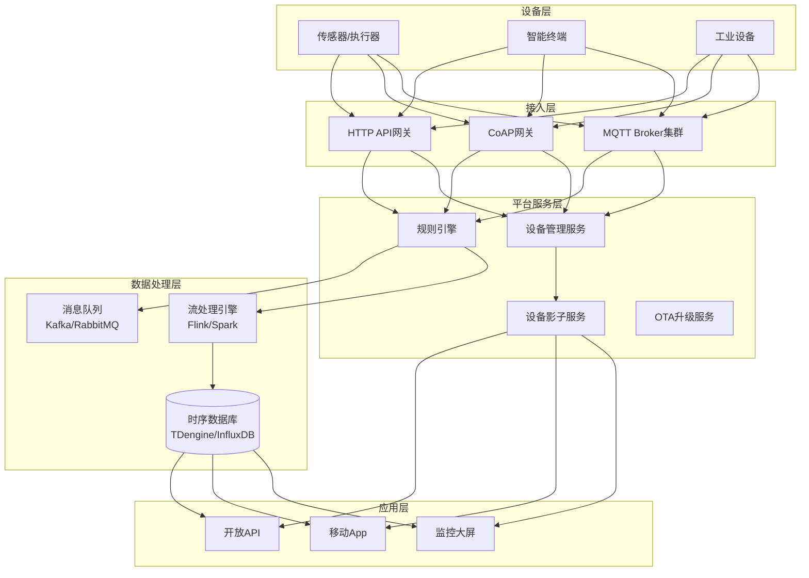
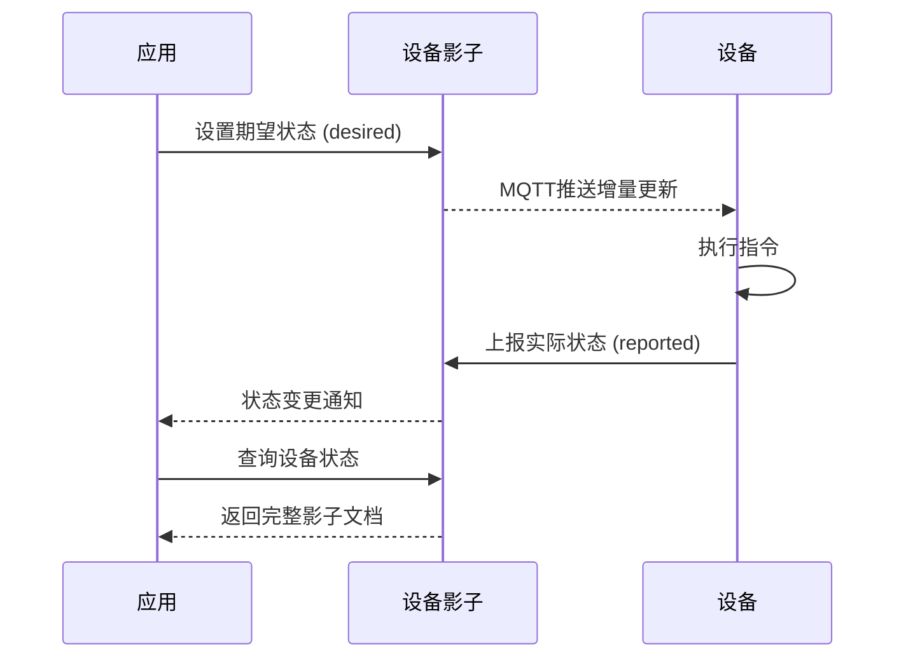

# 物联网平台架构案例专题文档

**文档版本**：v1.0
**创建时间**：2026年
**最后更新**：2026年
**状态**：✅ 已完成

---

## 📋 执行摘要

物联网平台架构关注海量设备接入、高并发消息处理、实时数据分析和设备管理，核心挑战在于设备接入协议、规则引擎、时序数据存储和设备影子。

---

## 一、核心概念

### 1.1 定义与原理

物联网平台是连接物理设备与云端应用的中间层系统，其核心原理包括：

- **设备接入**：支持多种协议（MQTT/CoAP/HTTP）的设备连接
- **消息路由**：基于规则引擎的数据流转和处理
- **数字孪生**：设备影子（Device Shadow）实现设备状态云端镜像
- **时序数据**：按时间顺序采集的传感器数据高效存储和查询

### 1.2 关键特性

- **海量连接**：支持百万级设备并发接入
- **低功耗**：支持电池供电设备长连接
- **弱网适应**：适应不稳定网络环境
- **实时处理**：毫秒级数据处理和告警
- **安全可靠**：设备认证、传输加密

### 1.3 适用场景

| 场景 | 适用性 | 说明 |
|------|--------|------|
| 智能家居 | ⭐⭐⭐⭐⭐ | 家电联网、语音控制 |
| 工业物联网 | ⭐⭐⭐⭐⭐ | 设备监控、预测维护 |
| 车联网 | ⭐⭐⭐⭐ | 车辆定位、远程控制 |
| 智慧城市 | ⭐⭐⭐⭐ | 路灯、环境监测 |
| 农业物联网 | ⭐⭐⭐ | 大棚监控、灌溉控制 |

---

## 二、技术细节

### 2.1 架构设计



### 2.2 核心模块详解

#### 2.2.1 设备接入（MQTT）

**MQTT协议优势**：
- **轻量级**：头部仅2字节，适合低带宽
- **发布订阅**：解耦设备和应用
- **QoS等级**：支持三种消息可靠性等级
- **遗嘱消息**：设备异常断线通知

**QoS等级对比**：
| QoS | 名称 | 特点 | 适用场景 |
|-----|------|------|----------|
| 0 | 最多一次 | 不确认，可能丢失 | 高频 telemetry |
| 1 | 至少一次 | 确认，可能重复 | 关键指令 |
| 2 | 恰好一次 | 四次握手，不丢不重 | 支付/控制类 |

**主题设计规范**：
```
系统主题：$sys/{productKey}/{deviceName}/
├── /thing/event/property/post     # 属性上报
├── /thing/service/property/set    # 属性设置
├── /thing/event/{identifier}/post # 事件上报
├── /thing/service/{identifier}    # 服务调用
├── /ota/device/upgrade            # OTA升级
└── /shadow/get                    # 获取设备影子

用户自定义：/{productKey}/{deviceName}/user/{topic}
```

**设备认证方式**：
```
1. 一机一密（Device Secret）
   - 每个设备唯一三元组：ProductKey + DeviceName + DeviceSecret
   - 适合安全性要求高的场景

2. 一型一密（Product Secret）
   - 同产品类型共用ProductSecret
   - 设备动态注册获取DeviceSecret
   - 适合批量生产场景

3. X.509证书认证
   - 设备证书 + 私钥
   - 最高安全级别
   - 适合工业场景

4. JWT Token认证
   - 短期有效令牌
   - 适合临时接入
```

**Broker集群架构**：
```
┌─────────────────────────────────────┐
│         MQTT Broker 集群             │
│  ┌─────────┐      ┌─────────┐       │
│  │ Node-1  │←────→│ Node-2  │       │
│  │  (Master)│      │ (Slave) │       │
│  └────┬────┘      └────┬────┘       │
│       └────────────────┘              │
│            集群内数据同步              │
└─────────────────────────────────────┘
         ↑
    ┌────┴────┐
  设备A     设备B

负载均衡策略：
- 按ClientID哈希分配到固定节点
- 支持会话保持（Sticky Session）
```

#### 2.2.2 规则引擎

**规则引擎原理**：
```
数据流：
设备消息 → Topic匹配 → 条件过滤 → 数据处理 → 动作执行

规则结构：
{
  "ruleName": "温度告警规则",
  "topic": "/productA/+/telemetry",
  "condition": "temperature > 80",
  "actions": [
    {"type": "notification", "target": "sms://admin"},
    {"type": "forward", "target": "kafka://alerts"},
    {"type": "store", "target": "influxdb"}
  ]
}
```

**规则处理流程**：
```
┌──────────┐    ┌──────────┐    ┌──────────┐    ┌──────────┐
│ 消息接收  │ → │ SQL解析   │ → │ 条件判断  │ → │ 动作路由  │
│ MQTT消息  │    │ 提取字段  │    │ 匹配规则  │    │ 执行动作  │
└──────────┘    └──────────┘    └──────────┘    └──────────┘
                                                       ↓
                                              ┌────────────────┐
                                              │ 转发/存储/告警  │
                                              └────────────────┘
```

**SQL-like规则语法**：
```sql
-- 提取设备温度数据并过滤
SELECT 
    deviceName() as device_name,
    timestamp() as ts,
    payload.temperature as temp,
    payload.humidity as humidity
FROM "/sys/+/+/thing/event/property/post"
WHERE 
    temp > 80 AND humidity < 30

-- 数据转换后转发
SELECT 
    concat(deviceName(), '_', timestamp()) as msg_id,
    payload.*,
    'alert' as level
FROM "/alerts/#"
```

**常见动作类型**：
| 动作类型 | 说明 | 示例 |
|----------|------|------|
| 数据流转 | 转发到其他Topic | 转发到分析服务 |
| 存储 | 保存到时序数据库 | InfluxDB、TDengine |
| 通知 | 发送告警通知 | 短信、邮件、钉钉 |
| 函数计算 | 触发Serverless函数 | 数据清洗、格式转换 |
| 设备控制 | 下发指令到设备 | 关闭异常设备 |

#### 2.2.3 时序数据存储

**时序数据特点**：
- 按时间顺序写入，极少更新删除
- 数据量大，高频写入（每秒万级）
- 查询多为时间范围查询
- 需要降采样和聚合

**存储方案对比**：
| 数据库 | 写入性能 | 查询性能 | 压缩比 | 扩展性 | 适用场景 |
|--------|----------|----------|--------|--------|----------|
| InfluxDB | ⭐⭐⭐⭐⭐ | ⭐⭐⭐⭐ | ⭐⭐⭐⭐ | ⭐⭐⭐ | 中小规模 |
| TDengine | ⭐⭐⭐⭐⭐ | ⭐⭐⭐⭐⭐ | ⭐⭐⭐⭐⭐ | ⭐⭐⭐⭐ | 大规模IoT |
| TimescaleDB | ⭐⭐⭐⭐ | ⭐⭐⭐⭐ | ⭐⭐⭐ | ⭐⭐⭐ | PG生态 |
| ClickHouse | ⭐⭐⭐⭐ | ⭐⭐⭐⭐⭐ | ⭐⭐⭐⭐⭐ | ⭐⭐⭐⭐⭐ | 分析型查询 |

**TDengine超级表设计**：
```sql
-- 创建设备类型超级表
CREATE STABLE meters (
    ts TIMESTAMP,
    current FLOAT,
    voltage INT,
    phase FLOAT
) TAGS (
    location BINARY(64),
    groupId INT
);

-- 为每个设备创建子表
CREATE TABLE d1001 USING meters TAGS ('California.SanFrancisco', 2);
CREATE TABLE d1002 USING meters TAGS ('California.LosAngeles', 3);

-- 写入数据（自动路由到对应子表）
INSERT INTO d1001 VALUES (NOW, 10.3, 219, 0.31);

-- 聚合查询
SELECT AVG(current), MAX(voltage) FROM meters 
WHERE ts > NOW - 1h 
GROUP BY groupId;
```

**数据生命周期管理**：
```
数据分级存储：
┌─────────────────────────────────────────────┐
│  热数据（最近7天）→ 内存/SSD                │
│  温数据（7-30天）→ SSD                      │
│  冷数据（30-90天）→ HDD                     │
│  归档（>90天）→ 对象存储（S3/OSS）          │
└─────────────────────────────────────────────┘

自动降采样：
- 原始数据（1秒精度）保留1天
- 1分钟聚合保留7天
- 1小时聚合保留30天
- 1天聚合永久保留
```

#### 2.2.4 设备影子

**设备影子原理**：
```
┌─────────────┐         ┌─────────────┐         ┌─────────────┐
│   设备端     │ ←────→ │   设备影子   │ ←────→ │   应用端     │
│  (Device)   │  MQTT   │  (Shadow)   │   API   │  (Application)│
└─────────────┘         └─────────────┘         └─────────────┘
                              ↓
                        ┌─────────────┐
                        │  持久化存储  │
                        │  (Redis/DB) │
                        └─────────────┘

影子文档结构：
{
  "state": {
    "desired": {    // 期望状态（应用设置）
      "temperature": 25,
      "power": "on"
    },
    "reported": {   // 上报状态（设备实际）
      "temperature": 26,
      "power": "on",
      "humidity": 60
    }
  },
  "metadata": {...},
  "version": 12,
  "timestamp": 1699123456
}
```

**设备影子使用场景**：

1. **离线设备控制**：
   ```
   应用下发指令 → 设备影子记录desired状态
                           ↓
   设备上线 ← 影子同步desired → 设备执行 → 更新reported
   ```

2. **状态同步**：
   ```
   设备周期性上报状态 → 更新reported
   应用查询设备状态 → 读取reported（无需唤醒设备）
   ```

3. **版本冲突解决**：
   ```
   设备上报时携带version
   服务端检查version是否匹配
   不匹配则拒绝，设备重新获取最新影子
   ```

**影子数据流**：


### 2.3 实现机制

#### 设备生命周期管理
```
生命周期状态：
未激活 → 在线 → 离线 → 禁用 → 删除
   ↑      ↑      ↑
   │      │      └─ 心跳超时
   │      └─ 首次连接成功
   └─ 注册完成

状态转换：
- 注册：创建设备三元组
- 激活：首次连接成功
- 在线：心跳正常
- 离线：心跳超时（默认300s）
- 禁用：人工禁用，拒绝连接
- 删除：清理所有数据
```

#### OTA升级流程
```
┌─────────┐    ┌─────────┐    ┌─────────┐
│  云平台  │    │  设备端  │    │  CDN    │
└────┬────┘    └────┬────┘    └────┬────┘
     │              │              │
     │  推送升级通知  │              │
     │─────────────→│              │
     │              │              │
     │  下载固件包   │              │
     │              │─────────────→│
     │              │←─────────────│
     │              │              │
     │  上报下载进度  │              │
     │←─────────────│              │
     │              │              │
     │  上报升级结果  │              │
     │←─────────────│              │
```

---

## 三、系统对比

### 3.1 物联网平台对比

| 维度 | AWS IoT | Azure IoT Hub | 阿里云IoT | 自建平台 |
|------|---------|---------------|-----------|----------|
| MQTT支持 | ⭐⭐⭐⭐⭐ | ⭐⭐⭐⭐ | ⭐⭐⭐⭐⭐ | 取决于实现 |
| 规则引擎 | ⭐⭐⭐⭐⭐ | ⭐⭐⭐⭐ | ⭐⭐⭐⭐ | 需自研 |
| 设备影子 | ⭐⭐⭐⭐⭐ | ⭐⭐⭐⭐ | ⭐⭐⭐⭐ | 需自研 |
| 成本 | 高 | 高 | 中 | 可控 |
| 定制化 | 低 | 低 | 中 | 高 |

### 3.2 时序数据库选型决策树

```
数据规模
├── 设备数 < 10万？
│   ├── 是 → 查询需求复杂？
│   │   ├── 是 → TimescaleDB（SQL兼容）
│   │   └── 否 → InfluxDB
│   └── 否 → 写入压力 > 100万点/秒？
│       ├── 是 → TDengine / IoTDB
│       └── 否 → ClickHouse（分析需求强）
└── 云原生部署？
    ├── 是 → VictoriaMetrics / Thanos
    └── 否 → 继续容量判断
```

### 3.3 性能基准

| 指标 | 目标值 | 说明 |
|------|--------|------|
| 设备并发 | 100万/集群 | MQTT长连接 |
| 消息吞吐 | 1000万/秒 | QoS0消息 |
| 规则延迟 | P99 < 50ms | 端到端处理 |
| 时序写入 | 100万点/秒 | 单节点TDengine |
| 查询响应 | P99 < 100ms | 最近1小时数据 |

---

## 四、实践指南

### 4.1 部署配置

```yaml
# MQTT Broker配置（EMQX示例）
mqtt:
  broker:
    nodes: 3                    # 集群节点数
    max_connections: 1000000    # 单节点最大连接
    
  listeners:
    tcp:
      port: 1883
      acceptors: 16
    ssl:
      port: 8883
      certfile: /etc/ssl/cert.pem
      keyfile: /etc/ssl/key.pem
      
  zones:
    internal:
      idle_timeout: 300s
      max_packet_size: 1MB
      
# 规则引擎配置
rule_engine:
  rules:
    - name: temperature_alert
      sql: |
        SELECT 
          payload.temperature as temp,
          deviceName() as device
        FROM "sys/+/+/thing/event/property/post"
        WHERE temp > 80
      actions:
        - type: webhook
          url: http://alert-service:8080/alert
        - type: kafka
          topic: iot-alerts
          
# 时序数据库配置（TDengine）
tdengine:
  replica: 3
  tables_per_vnode: 1000
  duration: 1d              # 数据文件时长
  keep: 90d                 # 数据保留时长
```

### 4.2 最佳实践

1. **主题设计**
   - 避免过深层级（建议 < 5层）
   - 合理使用通配符 + 和 #
   - 敏感数据使用独立Topic

2. **消息大小控制**
   - 单条消息 < 256KB
   - 批量上报减少网络开销
   - 关键数据单独Topic

3. **设备认证**
   - 生产环境使用X.509证书
   - 定期轮换密钥
   - 禁用失窃设备证书

4. **数据压缩**
   - Payload使用Protobuf/MsgPack
   - 启用MQTT 5.0的压缩扩展
   - 批量上报聚合数据

### 4.3 常见问题

**Q1: 设备频繁掉线重连？**
A:
- 调整心跳间隔（keepalive）
- 检查网络质量
- 优化Broker连接数限制
- 使用MQTT 5.0的会话恢复

**Q2: 时序数据查询慢？**
A:
- 建立合适的标签索引
- 使用预聚合降采样
- 冷热数据分离
- 限制单次查询时间范围

**Q3: 如何保证消息不丢失？**
A:
- 关键消息使用QoS 1/2
- 开启消息持久化
- 设备本地缓存未确认消息
- 实现消息重传机制

---

## 五、形式化分析

### 5.1 消息可靠性模型

**系统模型**：
- 设备集合 D = {d₁, d₂, ..., dₙ}
- 消息集合 M = {m₁, m₂, ...}
- 时间戳 T = {t₁, t₂, ...}

**可靠性保证**：
1. **至多一次（QoS 0）**：Fire and Forget
2. **至少一次（QoS 1）**：ID去重 + 确认机制
3. **恰好一次（QoS 2）**：四步握手 + 幂等去重

### 5.2 复杂度分析

| 操作 | 时间复杂度 | 空间复杂度 |
|------|-----------|-----------|
| 设备接入 | O(1) | O(1) |
| 消息路由 | O(k) | O(1) k=匹配规则数 |
| 时序查询 | O(log n) | O(m) m=返回点数 |
| 影子更新 | O(1) | O(s) s=影子大小 |

---

## 六、与其他主题的关联

### 6.1 上游依赖

- [MQTT协议](../04-network/mqtt协议.md)
- [消息队列](../07-middleware/消息队列.md)
- [流处理引擎](../08-bigdata/流处理引擎.md)

### 6.2 下游应用

- [边缘计算](./边缘计算架构案例.md)
- [智慧城市案例](./智慧城市架构案例.md)

### 6.3 相关概念

| 概念 | 关系 | 说明 |
|------|------|------|
| 数字孪生 | 扩展应用 | 设备影子的进阶形态 |
| 流处理 | 数据处理 | 实时规则引擎基础 |
| 边缘计算 | 部署模式 | IoT数据预处理 |

---

## 七、参考资源

### 7.1 学术论文

1. [MQTT Specification Version 5.0](https://docs.oasis-open.org/mqtt/mqtt/v5.0/mqtt-v5.0.html) - OASIS Standard
2. [Time Series Database Design](https://www.vldb.org/pvldb/vol8/p1816-tattebury.pdf) - VLDB 2015

### 7.2 开源项目

1. [EMQX](https://github.com/emqx/emqx) - 高可用MQTT Broker
2. [ThingsBoard](https://github.com/thingsboard/thingsboard) - 开源物联网平台
3. [Node-RED](https://github.com/node-red/node-red) - 可视化规则引擎
4. [TDengine](https://github.com/taosdata/TDengine) - 时序数据库

### 7.3 学习资料

1. [MQTT协议详解](https://www.hivemq.com/mqtt-essentials/) - HiveMQ官方教程
2. [阿里云IoT平台架构](https://www.infoq.cn/article/aliyun-iot-architecture) - InfoQ
3. [物联网架构模式](https://aws.amazon.com/iot/solutions/iot-architecture/) - AWS白皮书

### 7.4 相关文档

- [MQTT协议详解](../04-network/mqtt协议.md)
- [消息队列选型](../07-middleware/消息队列.md)
- [时序数据库](../08-bigdata/时序数据库.md)

---

**维护者**：项目团队
**最后更新**：2026年
