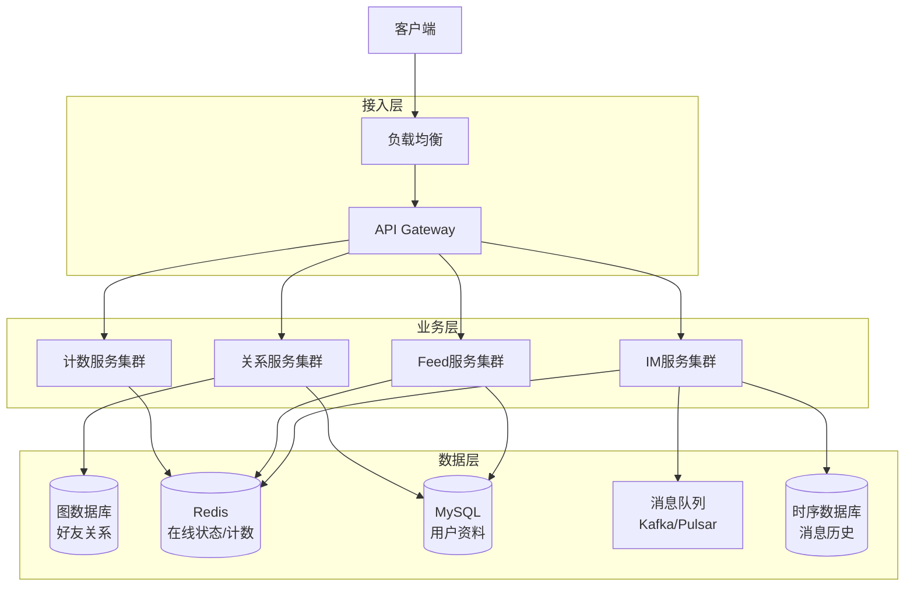

# 社交系统架构案例专题文档

**文档版本**：v1.0
**创建时间**：2026年
**最后更新**：2026年
**状态**：✅ 已完成

---

## 📋 执行摘要

社交系统架构关注高并发、实时性、数据一致性和用户体验，核心挑战在于好友关系管理、消息实时投递、Feed流构建和互动计数。

---

## 一、核心概念

### 1.1 定义与原理

社交系统是一种支持用户连接、内容分享和实时互动的分布式系统。其核心原理包括：

- **图模型建模**：用户和关系天然适合图结构
- **消息投递模型**：单聊、群聊、广播的消息分发策略
- **推拉结合**：平衡实时性与系统负载的消息分发方式
- **最终一致性**：社交数据允许短暂不一致，优先保证可用性

### 1.2 关键特性

- **高并发**：支持百万级在线用户同时互动
- **实时性**：消息投递延迟 < 100ms
- **可扩展性**：用户增长时线性扩展
- **可靠性**：消息必达，不丢失
- **数据一致性**：最终一致性保证

### 1.3 适用场景

| 场景 | 适用性 | 说明 |
|------|--------|------|
| 即时通讯(IM) | ⭐⭐⭐⭐⭐ | 微信、WhatsApp类应用 |
| 社交网络 | ⭐⭐⭐⭐⭐ | Facebook、微博类平台 |
| 社区论坛 | ⭐⭐⭐⭐ | 豆瓣、知乎类社区 |
| 直播平台 | ⭐⭐⭐⭐ | 弹幕、礼物互动 |

---

## 二、技术细节

### 2.1 架构设计



### 2.2 核心模块详解

#### 2.2.1 好友关系（图数据库）

**数据模型**：
- 节点：用户（User）
- 边：关系（FRIEND、FOLLOW、BLOCK）
- 属性：关系建立时间、亲密度、互动频率

**推荐技术栈**：
| 数据库 | 适用场景 | 优势 |
|--------|----------|------|
| Neo4j | 复杂关系查询 | 原生图存储，Cypher查询 |
| JanusGraph | 超大规模 | 分布式，支持百亿节点 |
| Dgraph | 高性能查询 | 水平扩展，低延迟 |
| RedisGraph | 简单关系 | 内存存储，毫秒响应 |

**二度好友推荐算法**：
```cypher
// Neo4j Cypher 示例
MATCH (user:User {id: $userId})-[:FRIEND]->(friend:User)-[:FRIEND]->(fof:User)
WHERE NOT (user)-[:FRIEND]->(fof) AND fof.id <> $userId
WITH fof, count(friend) as mutualCount
RETURN fof.id, fof.name, mutualCount
ORDER BY mutualCount DESC
LIMIT 10
```

#### 2.2.2 消息系统（IM）

**架构模式**：
- **长连接**：WebSocket/TCP维持在线状态
- **消息投递**：至少一次投递 + 客户端去重
- **消息同步**：增量同步 + 消息ID序列

**消息投递流程**：
```
用户A发送消息
    ↓
IM网关接收 → 消息ID生成（雪花算法）
    ↓
消息存储（写扩散/读扩散）
    ↓
推送服务检测用户B在线状态
    ↓
在线 → WebSocket推送
离线 → 推送通知（APNs/FCM）
    ↓
客户端ACK确认
```

**写扩散 vs 读扩散**：
| 方案 | 优点 | 缺点 | 适用 |
|------|------|------|------|
| 写扩散 | 读性能高，实现简单 | 写放大，存储多 | 小群聊 |
| 读扩散 | 存储少，写轻量 | 读复杂，聚合慢 | 大群/Feed |

#### 2.2.3 动态 Feed（推拉结合）

**推拉结合策略**：
- **推模式（Push）**：
  - 适用：粉丝数少的普通用户
  - 优点：读取快，实时性好
  - 缺点：大V推送成本高

- **拉模式（Pull）**：
  - 适用：粉丝数多的大V用户
  - 优点：无推送成本
  - 缺点：读取需要聚合，延迟高

**混合策略实现**：
```
粉丝数阈值 = 10,000
IF 用户粉丝数 < 阈值:
    采用推模式 → 发布时写入所有粉丝Feed流
ELSE:
    采用拉模式 → 读取时实时聚合大V内容
```

**Feed流存储设计**：
```
Redis Sorted Set
Key: feed:user:{userId}
Score: 发布时间戳
Member: 内容ID

存储容量：每人保存最近1000条
淘汰策略：FIFO，保留最新
```

#### 2.2.4 点赞评论（计数）

**计数架构**：
```
┌─────────────┐    ┌─────────────┐    ┌─────────────┐
│   应用层     │ → │   计数服务   │ → │   Redis     │
│  点赞/评论   │    │  聚合/写入   │    │  热数据缓存  │
└─────────────┘    └─────────────┘    └─────────────┘
                           ↓
                    ┌─────────────┐
                    │  消息队列    │
                    │   Kafka     │
                    └─────────────┘
                           ↓
                    ┌─────────────┐
                    │   MySQL     │
                    │  持久化存储  │
                    └─────────────┘
```

**计数优化策略**：
1. **缓存优先**：Redis计数，异步落库
2. **批量写入**：合并短时间内的计数操作
3. **读写分离**：读从缓存，写异步持久化
4. **防刷机制**：限制单个用户操作频率

### 2.3 实现机制

#### 消息ID设计（雪花算法变体）
```
64位消息ID结构：
| 1位符号 | 41位时间戳 | 12位序列号 | 10位机器ID |
|--------|-----------|-----------|-----------|
  0        时间差      每毫秒4096    1024节点
```

#### 在线状态管理
```
Redis Hash 存储用户在线状态
Key: user:status
Field: {userId}
Value: {lastHeartbeat: timestamp, serverId: id, device: mobile}
TTL: 5分钟（心跳续期）
```

---

## 三、系统对比

### 3.1 主流IM系统对比

| 维度 | WhatsApp | 微信 | Telegram |
|------|----------|------|----------|
| 架构 | 去中心化E2E | 中心化 | 混合云 |
| 消息存储 | 客户端为主 | 服务端7天 | 云端 |
| 群聊上限 | 1024 | 500 | 200,000 |
| 文件大小 | 2GB | 1GB | 2GB |
| 加密方式 | Signal协议 | 自有协议 | MTProto |

### 3.2 数据库选型决策树

```
好友关系查询
├── 需要复杂图算法（推荐、最短路径）？
│   ├── 是 → Neo4j / Dgraph
│   └── 否 → 继续判断
├── 数据量 > 10亿？
│   ├── 是 → JanusGraph / Dgraph
│   └── 否 → 继续判断
├── 延迟要求 < 5ms？
│   ├── 是 → RedisGraph
│   └── 否 → Neo4j / MySQL + 应用层处理
```

### 3.3 性能基准

| 指标 | 目标值 | 说明 |
|------|--------|------|
| 消息投递延迟 | P99 < 100ms | 同城网络 |
| 单聊并发 | 100万/秒 | 单集群 |
| 群聊规模 | 2000人 | 普通群 |
| Feed刷新 | P99 < 200ms | 拉取最新20条 |
| 好友查询 | P99 < 50ms | 二度好友推荐 |

---

## 四、实践指南

### 4.1 部署配置

```yaml
# IM服务配置示例
im-server:
  websocket:
    port: 8080
    max-connections: 100000
    heartbeat-interval: 30s
    
  message:
    storage-type: hybrid  # write/read spread
    max-group-size: 2000
    history-retention: 7d
    
  redis:
    cluster:
      nodes: ["redis-1:6379", "redis-2:6379", "redis-3:6379"]
    pools:
      status: 10          # 在线状态连接池
      message: 50         # 消息缓存连接池
      
  kafka:
    brokers: ["kafka-1:9092"]
    topics:
      message: im-messages
      notification: im-notifications
```

### 4.2 最佳实践

1. **消息必达保证**
   - 客户端发送消息 → 服务端ACK → 客户端确认
   - 消息ID去重，防止重复投递
   - 失败消息进入重试队列

2. **水平扩展策略**
   - 按用户ID分片，保证同一会话在同一节点
   - 网关层无状态，可任意扩展
   - 读多写少场景优先扩展读节点

3. **热点数据处理**
   - 大V消息采用拉模式
   - 热点内容多级缓存
   - 限流保护核心服务

4. **数据归档策略**
   - 热数据：Redis（最近7天）
   - 温数据：MySQL（最近90天）
   - 冷数据：对象存储（历史归档）

### 4.3 常见问题

**Q1: 群聊消息如何优化？**
A: 
- 小群（<200人）：写扩散，每人存一份
- 大群（>200人）：读扩散，只存一份，在线推送+离线拉取
- 超大群（>1000人）：限制消息频率，合并通知

**Q2: 如何防止消息丢失？**
A:
- 客户端本地队列，失败重试
- 服务端消息落库后再ACK
- 多副本存储，异地容灾

**Q3: Feed流卡顿如何优化？**
A:
- 预加载机制，下拉时提前加载
- 分页加载，单次返回20条
- 图片懒加载，优先显示文字

---

## 五、形式化分析

### 5.1 消息投递一致性模型

**系统模型**：
- 进程集合 P = {Sender, Receiver, Server}
- 消息集合 M = {m₁, m₂, ...}
- 状态 S: P × M → {sent, delivered, read}

**正确性条件**：
1. **有效性**：发送的消息最终会被投递
2. **无重复**：每条消息最多投递一次
3. **因果序**：如果 m₁ 因果先于 m₂，则 m₁ 先投递

### 5.2 复杂度分析

| 操作 | 时间复杂度 | 空间复杂度 |
|------|-----------|-----------|
| 发送消息 | O(1) | O(n) n=接收者数 |
| 拉取Feed | O(k log n) | O(k) k=拉取条数 |
| 好友推荐 | O(d²) | O(d) d=平均度数 |
| 消息搜索 | O(log n) | O(1) |

---

## 六、与其他主题的关联

### 6.1 上游依赖

- [分布式缓存](../07-middleware/Redis缓存策略.md)
- [消息队列](../07-middleware/消息队列.md)
- [分布式ID生成](../06-distributed-systems/分布式ID生成.md)

### 6.2 下游应用

- [电商系统架构案例](./电商系统架构案例.md)
- [直播系统架构](./视频流媒体架构案例.md)

### 6.3 相关概念

| 概念 | 关系 | 说明 |
|------|------|------|
| CAP定理 | 理论基础 | 社交系统优先AP |
| 最终一致性 | 实践应用 | 允许短暂不一致 |
| 读写分离 | 架构模式 | 读多写少场景优化 |

---

## 七、参考资源

### 7.1 学术论文

1. [The Log: What every software engineer should know about real-time data's unifying abstraction](https://engineering.linkedin.com/distributed-systems/log-what-every-software-engineer-should-know-about-real-time-datas-unifying) - LinkedIn Engineering
2. [Dynamo: Amazon's Highly Available Key-value Store](https://www.allthingsdistributed.com/files/amazon-dynamo-sosp2007.pdf) - Amazon SOSP 2007

### 7.2 开源项目

1. [OpenIM](https://github.com/OpenIMSDK/Open-IM-Server) - 开源即时通讯服务器
2. [Telegram Server](https://github.com/tdlib/telegram-bot-api) - Telegram Bot API
3. [Rocket.Chat](https://github.com/RocketChat/Rocket.Chat) - 开源团队通讯平台

### 7.3 学习资料

1. [微信技术架构演进](https://www.infoq.cn/article/weixin-architecture-evolution) - InfoQ中文站
2. [Feed流系统设计](https://time.geekbang.org/column/article/14466) - 极客时间
3. [大规模IM系统架构](https://www.jianshu.com/p/pxssa1) - 简书

### 7.4 相关文档

- [Redis缓存策略](../07-middleware/Redis缓存策略.md)
- [分布式消息队列](../07-middleware/消息队列.md)
- [WebSocket协议](../04-network/websocket协议详解.md)

---

**维护者**：项目团队
**最后更新**：2026年
