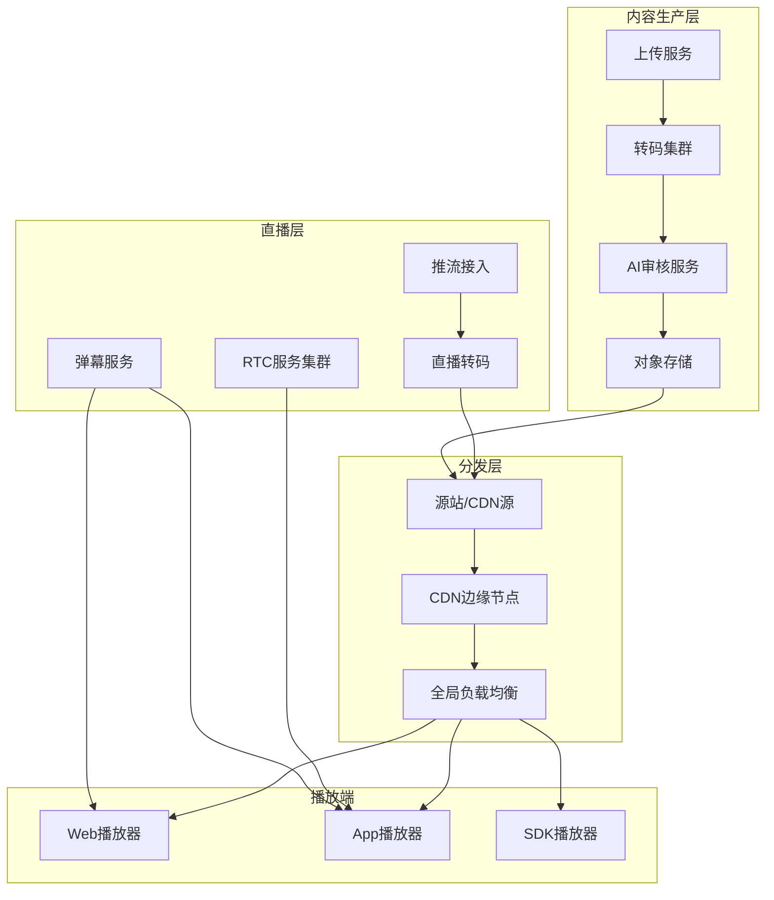

# 视频流媒体架构案例专题文档

**文档版本**：v1.0
**创建时间**：2026年
**最后更新**：2026年
**状态**：✅ 已完成

---

## 📋 执行摘要

视频流媒体架构关注高带宽、低延迟、高可用性和用户体验，核心挑战在于视频上传转码、CDN分发、弹幕实时通信和直播RTC架构。

---

## 一、核心概念

### 1.1 定义与原理

视频流媒体系统是一种处理音视频采集、编码、传输、播放的分布式系统，其核心原理包括：

- **转码压缩**：将原始视频转码为多码率格式（H.264/H.265/AV1）
- **自适应码率**：根据网络状况动态调整视频清晰度
- **流媒体协议**：HLS/DASH/RTMP/WebRTC等传输协议
- **边缘分发**：通过CDN节点就近服务用户

### 1.2 关键特性

- **高带宽**：单视频流可达10Mbps+
- **低延迟**：直播延迟 < 3s，RTC < 500ms
- **高可用**：99.99%服务可用性
- **自适应**：根据网络自动调整码率
- **海量并发**：支持百万级同时观看

### 1.3 适用场景

| 场景 | 适用性 | 说明 |
|------|--------|------|
| 短视频平台 | ⭐⭐⭐⭐⭐ | 抖音、快手 |
| 长视频平台 | ⭐⭐⭐⭐⭐ | 爱奇艺、Netflix |
| 直播平台 | ⭐⭐⭐⭐⭐ | 虎牙、Twitch |
| 视频会议 | ⭐⭐⭐⭐ | Zoom、腾讯会议 |
| 在线教育 | ⭐⭐⭐⭐ | 直播课堂 |

---

## 二、技术细节

### 2.1 架构设计



### 2.2 核心模块详解

#### 2.2.1 视频上传与转码

**上传流程**：
```
客户端分片上传
    ↓
┌─────────────────────────────────────┐
│ 1. 初始化上传 → 获取uploadId        │
│ 2. 分片上传   → 并行上传分片         │
│ 3. 分片合并   → 服务端合并文件       │
│ 4. 触发转码   → 发送转码任务         │
└─────────────────────────────────────┘
    ↓
对象存储（原始文件）
    ↓
转码服务集群
```

**转码参数设计**：
| 清晰度 | 分辨率 | 码率 | 编码格式 | 适用场景 |
|--------|--------|------|----------|----------|
| 240P | 426x240 | 200Kbps | H.264 | 极速省流 |
| 480P | 854x480 | 800Kbps | H.264 | 流畅 |
| 720P | 1280x720 | 1500Kbps | H.264/H.265 | 高清 |
| 1080P | 1920x1080 | 3000Kbps | H.264/H.265 | 全高清 |
| 4K | 3840x2160 | 8000Kbps | H.265/AV1 | 超高清 |

**转码任务调度**：
```
┌─────────────────────────────────────────────┐
│              转码任务调度器                   │
├─────────────────────────────────────────────┤
│  任务队列（Priority Queue）                   │
│  ┌─────┐ ┌─────┐ ┌─────┐ ┌─────┐           │
│  │VIP  │ │普通 │ │低保 │ │后台 │           │
│  │高优 │ │优先级│ │优先级│ │任务 │           │
│  └─────┘ └─────┘ └─────┘ └─────┘           │
└─────────────────────────────────────────────┘
         ↓
┌─────────────────────────────────────────────┐
│  转码工作节点（动态扩缩容）                    │
│  ┌─────────┐ ┌─────────┐ ┌─────────┐       │
│  │GPU节点1 │ │GPU节点2 │ │CPU节点N │       │
│  │H.265   │ │AV1     │ │H.264   │       │
│  └─────────┘ └─────────┘ └─────────┘       │
└─────────────────────────────────────────────┘
```

**转码优化策略**：
1. **极速转码**：关键帧对齐，快速生成低清预览
2. **智能转码**：分析内容复杂度，动态调整编码参数
3. **分布式转码**：大文件切片并行转码后合并
4. **码率控制**：CRF/VBR/CQP多种模式选择

#### 2.2.2 CDN分发

**CDN架构层次**：
```
┌─────────────────────────────────────────────────────┐
│                    全局负载均衡                       │
│              DNS/HTTP-DNS/Anycast                   │
└─────────────────────────────────────────────────────┘
                          ↓
┌─────────────────────────────────────────────────────┐
│                   CDN边缘节点（L1）                   │
│  ┌──────┐ ┌──────┐ ┌──────┐ ┌──────┐               │
│  │ 北京  │ │ 上海  │ │ 广州  │ │ 成都  │  ...        │
│  └──────┘ └──────┘ └──────┘ └──────┘               │
└─────────────────────────────────────────────────────┘
                          ↓
┌─────────────────────────────────────────────────────┐
│                   CDN区域节点（L2）                   │
│  ┌──────────┐ ┌──────────┐ ┌──────────┐            │
│  │ 华北中心  │ │ 华东中心  │ │ 华南中心  │            │
│  └──────────┘ └──────────┘ └──────────┘            │
└─────────────────────────────────────────────────────┘
                          ↓
┌─────────────────────────────────────────────────────┐
│                   源站/对象存储                       │
│              OSS/S3 + 源站服务器                     │
└─────────────────────────────────────────────────────┘
```

**缓存策略**：
```
缓存层级：
- L1边缘节点：热点内容，TTL 1-7天
- L2区域节点：长尾内容，TTL 30天
- 源站：全量内容，永久存储

缓存预热：
- 新视频上线主动推送到边缘
- 热门榜单内容预加载
-  scheduled 任务批量预热

缓存淘汰：
- LRU策略
- 容量阈值自动清理
- 手动刷新接口
```

**流媒体协议对比**：
| 协议 | 延迟 | 优点 | 缺点 | 适用场景 |
|------|------|------|------|----------|
| HLS | 10-30s | 兼容性好，支持自适应 | 延迟高 | 点播、直播 |
| DASH | 10-30s | 标准化，灵活 | 兼容性一般 | 点播 |
| RTMP | 3-5s | 延迟低，成熟 | 需Flash插件 | 直播推流 |
| FLV | 3-5s | 延迟低，浏览器友好 | 私有协议 | 直播播放 |
| WebRTC | <500ms | 超低延迟 | 复杂度高 | 连麦、会议 |

**自适应码率（ABR）算法**：
```javascript
// 播放器端码率选择逻辑
class ABRController {
  selectBitrate() {
    const bandwidth = this.getEstimatedBandwidth();
    const bufferLevel = this.getBufferLevel();
    
    // 基于带宽和缓冲区选择
    if (bufferLevel < 10) {
      // 缓冲区不足，降级
      return this.getBitrateBelow(bandwidth * 0.8);
    } else if (bufferLevel > 30) {
      // 缓冲区充足，可升级
      return this.getBitrateBelow(bandwidth * 1.2);
    }
    
    return this.currentBitrate;
  }
  
  // 带宽估计（基于下载速度）
  estimateBandwidth(downloadTime, bytesDownloaded) {
    return bytesDownloaded * 8 / downloadTime;
  }
}
```

#### 2.2.3 弹幕系统

**弹幕架构**：
```
┌─────────────────────────────────────────────────────┐
│                    弹幕服务集群                        │
├─────────────────────────────────────────────────────┤
│  接入层                                              │
│  ┌─────────┐ ┌─────────┐ ┌─────────┐               │
│  │Gateway-1│ │Gateway-2│ │Gateway-N│               │
│  │ WebSocket│ │ WebSocket│ │ WebSocket│              │
│  └────┬────┘ └────┬────┘ └────┬────┘               │
│       └──────────┬──────────┘                        │
│                  ↓                                   │
│  业务层：弹幕过滤、合并、调度                           │
│                  ↓                                   │
│  数据层：Redis（热弹幕）→ Kafka → MySQL（历史）        │
└─────────────────────────────────────────────────────┘
```

**弹幕流设计**：
```
弹幕类型：
- 实时弹幕：正在观看的用户发送（WebSocket实时推送）
- 历史弹幕：加载视频时拉取（按时间段索引）
- 智能弹幕：AI生成的热门弹幕、表情弹幕

弹幕密度控制：
- 时间分片：每秒显示弹幕数限制
- 位置分布：滚动/顶部/底部/高级弹幕分层
- 合并相似：相同内容合并显示计数

弹幕存储：
Key: danmaku:video:{videoId}:{timestamp_bucket}
Value: Sorted Set (time_offset → danmaku_json)
```

**弹幕推送策略**：
```
拉取模式（点播）：
客户端请求 → 按时间点检索弹幕 → 批量返回

推送模式（直播）：
用户发送 → 弹幕服务 → 广播到同房间所有用户

混合模式：
- 直播用推送保证实时性
- 大房间用分区推送减少压力
- 异常时降级为拉取
```

#### 2.2.4 直播架构（RTC）

**直播架构对比**：
```
传统直播（CDN模式）：
主播 → RTMP推流 → CDN → 观众（HLS/FLV播放）
延迟：3-30秒

低延迟直播（LL-HLS/LL-DASH）：
主播 → RTMP推流 → 边缘节点 → 观众
延迟：1-3秒

实时直播（WebRTC）：
主播 → SFU → 观众
延迟：<500ms
```

**WebRTC架构**：
```
┌─────────────────────────────────────────────────────┐
│                   WebRTC通信架构                      │
├─────────────────────────────────────────────────────┤
│                                                     │
│    主播A            SFU服务器           观众B        │
│   ┌─────┐          ┌───────┐         ┌─────┐       │
│   │Push │←──RTP──→│ Select│←──RTP──→│Pull │       │
│   │Stream│         │Forward│         │Stream│       │
│   └─────┘          └───┬───┘         └─────┘       │
│                        │                            │
│                    ┌───┴───┐                        │
│                    │观众C  │                        │
│                    │Pull   │                        │
│                    └───────┘                        │
│                                                     │
│  辅助服务：                                          │
│  - Signaling Server（信令服务，WebSocket）           │
│  - TURN/STUN Server（NAT穿透）                       │
│  - MCU（混流服务，可选）                              │
└─────────────────────────────────────────────────────┘
```

**SFU（Selective Forwarding Unit）**：
```
SFU功能：
1. 接收各端媒体流
2. 根据订阅关系选择性转发
3. 支持Simulcast（多码率同时上传）
4. 支持SVC（可伸缩视频编码）

媒体路由策略：
- 单播：一对一转发
- 组播：一对多转发
- 选择性转发：根据带宽选择合适码率
```

**直播连麦实现**：
```
连麦流程：
1. 主播A发起连麦邀请
2. 主播B接受邀请
3. 双方通过Signaling交换SDP
4. ICE建立P2P或Relay连接
5. SFU合并两路流为一路
6. CDN分发合并后的流给观众

混流方案：
- 客户端混流：主播端合成后推流（CPU压力大）
- 服务端混流：MCU/SFU合成（延迟增加）
- 观众端混流：观众端合并（流量消耗大）
```

### 2.3 实现机制

#### 视频指纹与去重
```
┌─────────────────────────────────────────────────────┐
│                   视频指纹系统                        │
├─────────────────────────────────────────────────────┤
│                                                     │
│  视频上传 → 抽帧 → 特征提取 → 指纹生成 → 相似度匹配   │
│                                                     │
│  特征提取方法：                                       │
│  - 感知哈希（pHash）：64位指纹，适合整片匹配          │
│  - 局部特征（SIFT/SURF）：适合片段匹配                │
│  - 深度学习（Embedding）：语义相似匹配                │
│                                                     │
│  匹配策略：                                           │
│  - 汉明距离 < 阈值 → 相似视频                        │
│  - 向量相似度 → 语义相似                             │
└─────────────────────────────────────────────────────┘
```

#### DRM版权保护
```
主流DRM方案：
┌──────────┬──────────────┬────────────┐
│   DRM    │   支持平台   │   加密格式  │
├──────────┼──────────────┼────────────┤
│ Widevine │ Android/Web  │ CENC       │
│ FairPlay │ iOS/macOS    │ SAMPLE-AES │
│ PlayReady│ Windows/Xbox │ PIFF       │
│ 中国DRM  │ 全平台       │ 国密标准   │
└──────────┴──────────────┴────────────┘

加密流程：
1. 内容密钥（CEK）生成
2. 视频分片加密（AES-128-CBC/CTR）
3. 许可证服务器管理密钥
4. 播放器请求许可证解密
```

---

## 三、系统对比

### 3.1 流媒体平台对比

| 维度 | YouTube | Netflix | Twitch | 抖音 |
|------|---------|---------|--------|------|
| 内容类型 | UGC/PUGC | OGC | 直播 | UGC |
| 编码格式 | VP9/AV1 | AV1/H.265 | H.264 | H.265/AV1 |
| 传输协议 | DASH/HLS | DASH | HLS | 私有协议 |
| CDN策略 | Google Global | Open Connect | AWS CloudFront | 自建+第三方 |
| 推荐算法 | 深度学习 | 协同过滤 | 实时排序 | 推荐引擎 |

### 3.2 协议选型决策树

```
业务场景
├── 直播？
│   ├── 是 → 延迟要求 < 1s？
│   │   ├── 是 → WebRTC（连麦、会议）
│   │   └── 否 → 延迟要求 < 5s？
│   │       ├── 是 → RTMP/FLV/LL-HLS
│   │       └── 否 → HLS/DASH
│   └── 否 → 点播
│       ├── 需要DRM？
│       │   ├── 是 → DASH（Widevine）/HLS（FairPlay）
│       │   └── 否 → HLS（兼容性最好）
└── 互动需求？
    ├── 是 → WebRTC
    └── 否 → HLS/DASH
```

### 3.3 性能基准

| 指标 | 目标值 | 说明 |
|------|--------|------|
| 首帧时间 | < 1s | 点击到播放 |
| 卡顿率 | < 1% | 播放过程卡顿占比 |
| 直播延迟 | < 3s | 普通直播 |
| RTC延迟 | < 500ms | 连麦延迟 |
| 转码速度 | > 10x | 转码倍速（1小时视频<6分钟） |
| 并发观看 | 100万+ | 单直播间 |

---

## 四、实践指南

### 4.1 部署配置

```yaml
# 转码服务配置
transcode:
  cluster:
    gpu_nodes: 10           # GPU转码节点
    cpu_nodes: 20           # CPU转码节点
    
  templates:
    - name: 1080p
      resolution: 1920x1080
      bitrate: 3000k
      codec: libx264
      preset: fast
      
    - name: 720p
      resolution: 1280x720
      bitrate: 1500k
      codec: libx264
      preset: fast
      
    - name: 480p
      resolution: 854x480
      bitrate: 800k
      codec: libx264
      preset: fast

# CDN配置
cdn:
  origin:
    domain: video-origin.example.com
    protocol: https
    
  caching:
    video_ttl: 30d          # 视频缓存30天
    manifest_ttl: 2s        # 播放列表2秒
    
  https:
    cert: /etc/ssl/cdn.crt
    key: /etc/ssl/cdn.key

# 直播配置
live:
  ingest:
    protocol: rtmp
    port: 1935
    
  playback:
    protocols: [flv, hls, webrtc]
    
  rtc:
    sfu_nodes: 5
    turn_servers:
      - url: turn:turn.example.com:3478
        username: user
        credential: pass
```

### 4.2 最佳实践

1. **转码优化**
   - 根据内容类型选择编码参数
   - 使用CRF模式平衡质量和文件大小
   - 关键帧间隔统一，方便切片

2. **CDN优化**
   - 开启HTTP/2或HTTP/3
   - 启用Brotli/Gzip压缩文本内容
   - 配置合理的Cache-Control

3. **播放器优化**
   - 预加载策略：预加载3-5秒内容
   - 缓冲区管理：动态调整缓冲区大小
   - 降级策略：网络差时自动降码率

4. **监控告警**
   - 实时监控卡顿率、错误率
   - CDN带宽和命中率监控
   - 转码队列长度监控

### 4.3 常见问题

**Q1: 视频播放卡顿？**
A:
- 检查码率是否超出带宽
- 优化CDN节点调度
- 调整播放器缓冲区策略
- 开启自适应码率

**Q2: 直播延迟过高？**
A:
- 使用低延迟协议（LL-HLS/FLV）
- 减少GOP大小
- 优化CDN缓存策略
- 考虑WebRTC方案

**Q3: 转码队列积压？**
A:
- 动态扩容转码节点
- 优化转码参数减少耗时
- 优先处理VIP内容
- 非高峰时段处理后台任务

---

## 五、形式化分析

### 5.1 流媒体传输模型

**系统模型**：
- 内容集合 C = {c₁, c₂, ...}
- 用户集合 U = {u₁, u₂, ...}
- 边缘节点集合 E = {e₁, e₂, ...}

**优化目标**：
1. **最小化延迟**：min Σ delay(uᵢ, eⱼ)
2. **最大化命中率**：max Σ hit_rate(eⱼ)
3. **负载均衡**：Var(load(eⱼ)) → 0

### 5.2 复杂度分析

| 操作 | 时间复杂度 | 空间复杂度 |
|------|-----------|-----------|
| 视频上传 | O(n) | O(1) n=文件大小 |
| 转码任务 | O(n) | O(n) |
| CDN调度 | O(1) | O(m) m=节点数 |
| 弹幕检索 | O(log k) | O(1) k=弹幕数 |

---

## 六、与其他主题的关联

### 6.1 上游依赖

- [对象存储](../07-middleware/对象存储.md)
- [CDN原理](../04-network/cdn原理.md)
- [负载均衡](../04-network/负载均衡.md)

### 6.2 下游应用

- [社交系统架构案例](./社交系统架构案例.md)
- [直播电商案例](./电商系统架构案例.md)

### 6.3 相关概念

| 概念 | 关系 | 说明 |
|------|------|------|
| WebRTC | 核心技术 | 实时通信基础 |
| 对象存储 | 存储层 | 视频文件存储 |
| 边缘计算 | 部署模式 | CDN边缘处理 |

---

## 七、参考资源

### 7.1 学术论文

1. [ABR Algorithms for Streaming Video](https://doi.org/10.1145/3098822.3098846) - ACM SIGCOMM 2017
2. [DASH Industry Forum Guidelines](https://dashif.org/guidelines/) - DASH-IF

### 7.2 开源项目

1. [FFmpeg](https://github.com/FFmpeg/FFmpeg) - 音视频处理工具
2. [SRS](https://github.com/ossrs/srs) - 开源流媒体服务器
3. [Pion WebRTC](https://github.com/pion/webrtc) - Go语言WebRTC实现
4. [Video.js](https://github.com/videojs/video.js) - 开源视频播放器

### 7.3 学习资料

1. [FFmpeg教程](https://ffmpeg.org/documentation.html) - 官方文档
2. [WebRTC入门](https://webrtc.org/getting-started/overview) - WebRTC官方
3. [流媒体技术详解](https://www.xueyinonline.com/detail/222970967.html) - 学银在线

### 7.4 相关文档

- [CDN原理](../04-network/cdn原理.md)
- [WebSocket协议](../04-network/websocket协议详解.md)
- [对象存储](../07-middleware/对象存储.md)

---

**维护者**：项目团队
**最后更新**：2026年
