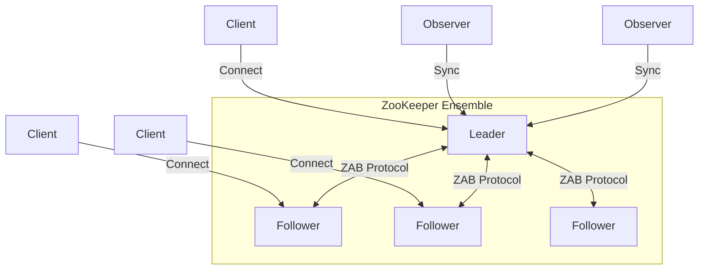

# ZooKeeper 深度分析专题文档

**文档版本**：v1.0
**创建时间**：2026年
**最后更新**：2026年
**状态**：✅ 已完成

---

## 📋 执行摘要

ZooKeeper是一个开源的分布式协调服务，基于ZAB协议提供高可用、强一致性的分布式数据管理能力，是分布式系统基础设施的核心组件。

---

## 一、核心概念

### 1.1 定义与原理

ZooKeeper是一个为分布式应用提供一致性服务的软件，它封装了复杂的分布式一致性协议（ZAB），为应用提供简单易用的接口，包括数据发布/订阅、负载均衡、命名服务、分布式协调/通知、集群管理、Master选举、分布式锁和分布式队列等功能。

**核心设计目标**：

- **简单性**：提供类似文件系统的数据模型
- **可复制性**：通过数据复制实现高可用
- **有序性**：所有更新操作都有全局顺序
- **快速性**：读操作可在内存中完成

### 1.2 关键特性

- **顺序一致性**：客户端的更新按发送顺序应用
- **原子性**：更新操作要么全部成功，要么全部失败
- **单一系统映像**：无论连接哪个服务器，看到的数据一致
- **可靠性**：更新一旦成功，数据就会被持久化
- **及时性**：保证客户端在有限时间内看到系统视图

### 1.3 适用场景

| 场景 | 适用性 | 说明 |
|------|--------|------|
| 配置中心 | ⭐⭐⭐⭐⭐ | 集中管理配置，支持动态推送 |
| 命名服务 | ⭐⭐⭐⭐⭐ | 分布式ID生成、服务命名 |
| 分布式锁 | ⭐⭐⭐⭐⭐ | 基于临时顺序节点实现 |
| 集群管理 | ⭐⭐⭐⭐ | Master选举、节点上下线感知 |
| 元数据存储 | ⭐⭐⭐ | 小规模元数据管理 |

---

## 二、技术细节

### 2.1 架构设计



**角色说明**：

- **Leader**：处理所有写请求，协调广播协议
- **Follower**：处理读请求，参与Leader选举和提案投票
- **Observer**：只处理读请求，不参与投票，用于扩展读性能

### 2.2 ZAB协议（ZooKeeper Atomic Broadcast）

ZAB是ZooKeeper的核心协议，保证分布式事务的顺序一致性。

#### 协议阶段

**阶段一：崩溃恢复（Crash Recovery）**

当Leader崩溃或网络分区时，进入崩溃恢复模式：

1. **选举阶段**：使用Fast Leader Election算法选举新Leader
2. **发现阶段（Discovery）**：
   - Leader收集Follower的epoch和zxid
   - 确定新的epoch（最大epoch+1）
   - 同步数据差异
3. **同步阶段（Synchronization）**：
   - Leader发送NEWLEADER消息
   - Follower确认并同步数据
   - 达到多数确认后，进入消息广播阶段

**阶段二：消息广播（Message Broadcast）**

正常运行时使用两阶段提交：

**输入**：客户端写请求
**输出**：已提交的更新
**步骤**：

1. **请求阶段**：
   - Leader接收客户端写请求
   - Leader生成提案（Proposal），分配zxid
   - Leader发送PROPOSAL给所有Follower

2. **确认阶段**：
   - Follower写入本地事务日志（WAL）
   - Follower发送ACK给Leader
   - Leader收到多数ACK后，发送COMMIT

3. **提交阶段**：
   - Follower收到COMMIT后应用更新
   - Leader向客户端返回成功响应

**zxid结构**：

- 64位整数，高32位是epoch，低32位是计数器
- 格式：epoch.counter（如：0x00000001.00000100）

#### 复杂度分析

- **时间复杂度**：O(n) 每次广播需要与多数节点通信
- **空间复杂度**：O(log n) 基于磁盘的事务日志
- **消息复杂度**：O(n) 每个提案需要2n条消息（Proposal+ACK+COMMIT）

### 2.3 数据模型

#### ZNode（数据节点）

ZooKeeper的数据模型是层次化的命名空间，类似文件系统：

```
/
├── app1
│   ├── config
│   │   ├── database
│   │   └── cache
│   └── nodes
│       ├── node-0000000001
│       └── node-0000000002
├── app2
│   └── leader
└── zookeeper
    └── quota
```

**ZNode类型**：

| 类型 | 特性 | 用途 |
|------|------|------|
| 持久节点（Persistent） | 客户端断开后仍存在 | 配置存储、元数据 |
| 临时节点（Ephemeral） | 会话结束时自动删除 | 服务发现、锁 |
| 持久顺序节点（Persistent_Sequential） | 持久+自动编号 | 队列、命名 |
| 临时顺序节点（Ephemeral_Sequential） | 临时+自动编号 | 分布式锁、Leader选举 |
| 容器节点（Container） | 最后子节点删除时删除 | 协调服务 |
| TTL节点（Persistent with TTL） | 超时未修改则删除 | 缓存、会话 |

#### Watcher（监视器）

Watcher是ZooKeeper的事件通知机制：

**事件类型**：

- **NodeCreated**：节点创建
- **NodeDeleted**：节点删除
- **NodeDataChanged**：数据变更
- **NodeChildrenChanged**：子节点列表变更
- **DataWatchRemoved**：数据监视被移除
- **ChildWatchRemoved**：子节点监视被移除

**Watcher特性**：

- **一次性触发**：触发后需要重新注册
- **有序送达**：事件按发生顺序送达
- **轻量级**：只通知事件类型，不传递数据

**使用模式**：

```
客户端注册Watcher → 事件触发 → 客户端处理 → 重新注册Watcher
```

### 2.4 应用场景实现

#### 配置中心

```
/app/config/database
    └── data: {"url":"jdbc:mysql://...","password":"***"}

客户端监听/app/config，配置变更时自动推送
```

#### 命名服务

```
/app/service/payment/providers/
    ├── provider-0000000001 (临时节点)
    └── provider-0000000002 (临时节点)

客户端获取子节点列表，实现服务发现
```

#### 分布式锁（基于临时顺序节点）

```
/lock/resource_a/
    ├── lock-0000000001 (客户端A，最小序号，获得锁)
    ├── lock-0000000002 (客户端B，监听前一个节点)
    └── lock-0000000003 (客户端C，监听前一个节点)

算法：
1. 创建临时顺序节点 /lock/resource_a/lock-
2. 获取所有子节点，按序号排序
3. 如果自己序号最小，获得锁
4. 否则监听前一个节点，等待释放
5. 处理完成后删除自己的节点
```

---

## 三、系统对比

### 3.1 ZooKeeper vs etcd 对比矩阵

| 维度 | ZooKeeper | etcd |
|------|-----------|------|
| **开发语言** | Java | Go |
| **一致性协议** | ZAB | Raft |
| **数据模型** | 层次化ZNode | 扁平键值对 |
| **API** | ZAB原生API、Curator | gRPC/HTTP REST |
| **Watch机制** | 一次性触发 | 可流式持续监听 |
| **事务支持** | 支持多操作事务 | 支持多键事务 |
| **性能** | 写约10K TPS | 写约20K TPS |
| **资源占用** | 较高（JVM） | 较低 |
| **生态集成** | Hadoop、Kafka | Kubernetes、CoreDNS |
| **运维复杂度** | 较高 | 较低 |

### 3.2 选型决策树

```
需求分析
├── 已有Java生态（Hadoop/Kafka）？
│   ├── 是 → ZooKeeper
│   └── 否 → 继续判断
├── Kubernetes原生？
│   ├── 是 → etcd
│   └── 否 → 继续判断
├── 需要复杂协调原语（锁、队列、选举）？
│   ├── 是 → ZooKeeper（Curator封装完善）
│   └── 否 → 继续判断
├── 高性能要求？
│   ├── 是 → etcd
│   └── 否 → ZooKeeper
└── 运维资源有限？
    ├── 是 → etcd
    └── 否 → ZooKeeper
```

### 3.3 性能基准

| 指标 | ZooKeeper 3.8 | etcd 3.5 |
|------|---------------|----------|
| 写吞吐量 | ~10K TPS | ~20K TPS |
| 读吞吐量 | ~100K TPS | ~100K TPS |
| 写延迟（P99） | ~10ms | ~5ms |
| 读延迟（P99） | ~1ms | ~1ms |
| 节点数 | 3-5-7 | 3-5-7 |

---

## 四、实践指南

### 4.1 部署配置

```yaml
# zoo.cfg
# 基本配置
tickTime=2000
dataDir=/var/lib/zookeeper
dataLogDir=/var/log/zookeeper
clientPort=2181

# 集群配置
initLimit=5
syncLimit=2
server.1=zoo1:2888:3888
server.2=zoo2:2888:3888
server.3=zoo3:2888:3888

# JVM配置
jvm.heap.size=4G
jvm.gc=G1GC
```

### 4.2 最佳实践

1. **节点数选择**：始终使用奇数个节点（3、5、7），避免偶数节点导致的选举问题

2. **独立磁盘**：事务日志和数据目录使用独立磁盘，提升写性能

3. **会话超时设置**：
   - 会话超时 = 2 × tickTime 到 20 × tickTime
   - 网络不稳定环境适当增加

4. **Watch使用原则**：
   - 避免在Watcher回调中执行耗时操作
   - 重新注册Watcher时使用exist检查节点是否存在

5. **数据大小限制**：
   - 单个节点数据不超过1MB
   - 子节点数不超过10K

### 4.3 常见问题

**Q1: 集群脑裂如何处理？**
A: ZAB协议要求多数派（N/2+1）才能提交事务，天然防止脑裂。网络分区后，少数派自动变为只读状态。

**Q2: 会话过期后临时节点未删除？**
A: 检查服务器时间和客户端时间是否同步，时间漂移可能导致会话管理异常。

**Q3: 选举期间服务不可用？**
Q: 这是ZAB协议的正常行为，Leader选举期间集群暂停写服务，读服务可能不可用（取决于配置）。

---

## 五、形式化分析

### 5.1 安全性保证

**定理**：ZAB协议保证线性一致性（Linearizability）

**证明要点**：

1. 所有写操作经过Leader串行化
2. Follower按相同顺序应用事务
3. 读操作返回最近已提交的值或等待同步

### 5.2 活性保证

**定理**：在多数派存活的情况下，系统最终能选出Leader并处理请求

**条件**：

- 网络分区不超过(N-1)/2个节点
- 消息最终可达
- 节点不会永久崩溃

---

## 六、与其他主题的关联

### 6.1 上游依赖

- [分布式一致性](../分布式系统/分布式一致性.md)
- [分布式事务](../分布式系统/分布式事务.md)

### 6.2 下游应用

- [Kafka消息队列](../消息队列/Kafka深度解析.md)
- [Hadoop生态系统](../大数据/Hadoop生态.md)
- [服务注册发现](./服务注册发现.md)

### 6.3 相关概念

| 概念 | 关系 | 说明 |
|------|------|------|
| etcd | 对比 | 同为分布式协调服务，不同实现 |
| Consul | 对比 | 提供服务发现+健康检查 |
| Chubby | 前身 | Google的分布式锁服务，ZK设计参考 |

---

## 七、参考资源

### 7.1 学术论文

1. [ZooKeeper: Wait-free coordination for Internet-scale systems](https://www.usenix.org/legacy/event/atc10/tech/full_papers/Hunt.pdf) - Yahoo Research, 2010
2. [A simple totally ordered broadcast protocol](https://www.datadoghq.com/pdf/zab.totally-ordered-broadcast-protocol.2008.pdf) - Benjamin Reed, 2008

### 7.2 开源项目

1. [Apache ZooKeeper](https://zookeeper.apache.org/) - 官方项目
2. [Curator](https://curator.apache.org/) - Netflix开发的ZK客户端框架
3. [zkui](https://github.com/DeemOpen/zkui) - ZooKeeper Web UI

### 7.3 学习资料

1. 《ZooKeeper分布式过程协同技术详解》 - Flavio Junqueira, 2016
2. [ZooKeeper官方文档](https://zookeeper.apache.org/doc/current/)
3. [ZAB协议详解](https://zookeeper.apache.org/doc/r3.8.0/zookeeperInternals.html)

### 7.4 相关文档

- [etcd详解](./etcd详解.md)
- [服务注册发现](./服务注册发现.md)

---

**维护者**：项目团队
**最后更新**：2026年
