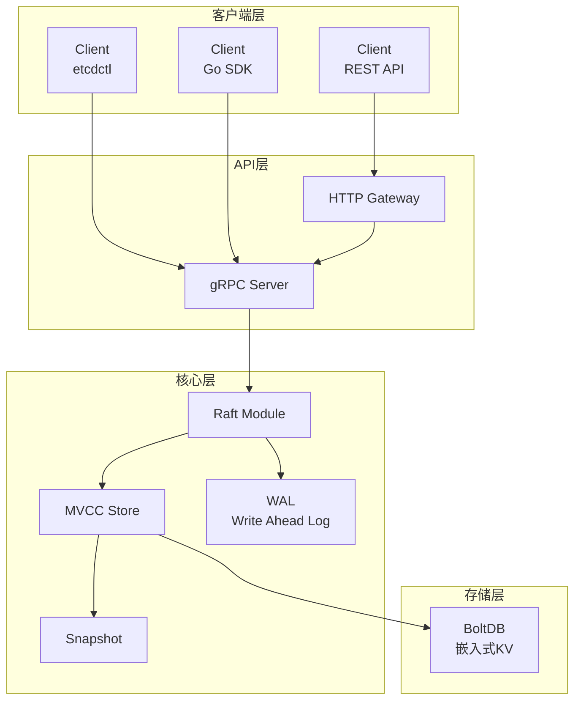

# etcd 详解专题文档

**文档版本**：v1.0
**创建时间**：2026年
**最后更新**：2026年
**状态**：✅ 已完成

---

## 📋 执行摘要

etcd是一个高可用、强一致性的分布式键值存储系统，采用Raft共识算法实现数据复制，是Kubernetes的核心组件，为分布式系统提供可靠的配置存储和服务发现能力。

---

## 一、核心概念

### 1.1 定义与原理

etcd（源自/etc分布式化）是一个开源的分布式键值存储，设计用于：

- **配置管理**：存储分布式系统的配置信息
- **服务发现**：注册和发现服务实例
- **分布式协调**：Leader选举、分布式锁
- **元数据存储**：存储集群元数据和状态

**核心设计原则**：

- **简单**：定义良好、面向用户的API（gRPC+REST）
- **安全**：支持TLS和可选的客户端证书认证
- **快速**：基准测试10,000+ 写入/秒
- **可靠**：使用Raft算法实现分布式一致性

### 1.2 关键特性

- **Raft共识**：内置的分布式一致性算法
- **Watch机制**：监听键值变化，支持范围监听和流式传输
- **租约（Lease）**：带TTL的键值，用于服务注册和心跳
- **事务**：多键原子操作（compare-and-swap）
- **多版本并发控制（MVCC）**：保留历史版本，支持时间旅行查询
- **快照**：定期生成数据快照，支持快速恢复

### 1.3 适用场景

| 场景 | 适用性 | 说明 |
|------|--------|------|
| Kubernetes配置存储 | ⭐⭐⭐⭐⭐ | Kubernetes的核心依赖 |
| 服务发现 | ⭐⭐⭐⭐⭐ | 配合DNS或负载均衡 |
| 分布式锁 | ⭐⭐⭐⭐⭐ | 基于租约实现 |
| 配置中心 | ⭐⭐⭐⭐ | 动态配置推送 |
| 元数据存储 | ⭐⭐⭐⭐ | 小数据量高可靠场景 |

---

## 二、技术细节

### 2.1 架构设计



**组件说明**：

- **Raft Module**：处理共识协议，Leader选举和日志复制
- **WAL**：预写日志，保证数据持久性
- **MVCC Store**：多版本并发控制存储
- **BoltDB**：底层键值存储引擎（v3使用，v3.5+可选其他后端）
- **Snapshot**：定期快照，用于快速恢复和日志压缩

### 2.2 Raft实现

#### Raft核心概念

**角色状态机**：

```
         启动
          │
          ▼
    ┌──────────┐
    │ Follower │◄─────────────┐
    └────┬─────┘              │
         │ 选举超时            │
         ▼                    │
    ┌──────────┐   获得多数   │
    │ Candidate│─────────────►│
    └────┬─────┘              │
         │ 赢得选举            │
         ▼                    │
    ┌──────────┐   发现更高   │
    │  Leader  │──任期Leader──┘
    └──────────┘
```

**任期（Term）**：

- 单调递增的整数，标识Leader任期
- 每次选举时Term增加
- 节点比较Term，较小者更新为较大值

#### 日志复制流程

**输入**：客户端写请求（Put/Delete）
**输出**：已提交的键值更新
**步骤**：

1. **请求接收**：
   - Leader接收客户端请求
   - 生成日志条目（包含Term和Index）
   - 追加到本地日志

2. **日志广播**：
   - Leader发送AppendEntries RPC给所有Follower
   - 包含日志条目和前一条日志的Index/Term（用于一致性检查）

3. **日志确认**：
   - Follower检查前一条日志是否匹配
   - 匹配则追加新日志，返回成功
   - 不匹配则拒绝，Leader回退并重新发送

4. **提交确认**：
   - Leader收到多数Follower确认
   - 将日志标记为已提交（committed）
   - 应用到状态机，返回客户端

5. **Follower应用**：
   - Follower收到Leader提交的确认
   - 应用到本地状态机

#### 安全性保证

**选举限制**：

- 只有包含全部已提交日志的节点才能当选Leader
- RequestVote RPC包含最后日志的Index和Term
- 投票者比较日志，拒绝日志不完整的候选者

**提交规则**：

- 当前任期的日志需要多数派确认才能提交
- 旧任期日志通过"Log Matching Property"间接提交

#### 复杂度分析

- **时间复杂度**：O(n) 每次写入需要与多数节点通信
- **空间复杂度**：O(d) d为日志深度，定期快照压缩
- **消息复杂度**：O(n) 每个日志条目需要2n条消息（AppendEntries+Ack）

### 2.3 数据模型

#### 键值存储

**键（Key）**：

- 扁平命名空间，使用字节字符串
- 支持按范围查询（key1, key5）获取[key1, key5)的所有键

**值（Value）**：

- 任意字节数组
- 默认最大1.5MB（可配置）

**版本控制**：

```
Key: /config/database
├── create_revision: 100    # 创建时的全局修订号
├── mod_revision: 150       # 最后修改的修订号
├── version: 5              # 该键的修改次数
├── value: {...}            # 当前值
└── lease: 12345            # 关联的租约ID
```

**修订号（Revision）**：

- 全局单调递增的64位整数
- 每次写操作（Put/Delete/Txn）增加
- 支持历史版本查询和watch

#### Watch机制

**特性对比（vs ZooKeeper）**：

| 特性 | etcd | ZooKeeper |
|------|------|-----------|
| 触发模式 | 流式持续监听 | 一次性触发 |
| 事件类型 | 创建/修改/删除 | 创建/修改/删除/子节点变化 |
| 范围监听 | 支持前缀/范围监听 | 只支持单节点或子节点 |
| 历史事件 | 可获取指定revision之后的事件 | 只能获取最新状态 |

**Watch使用模式**：

```go
// 监听单个键
watchChan := client.Watch(ctx, "/config/database")

// 监听前缀（所有以/service/开头的键）
watchChan := client.Watch(ctx, "/service/", clientv3.WithPrefix())

// 从历史版本开始监听
watchChan := client.Watch(ctx, "/key", clientv3.WithRev(100))
```

#### 租约（Lease）

**概念**：具有TTL（生存时间）的对象，可以绑定到键上

**应用场景**：

- **服务注册**：服务启动时创建租约并绑定，宕机时自动过期
- **分布式锁**：锁超时自动释放，防止死锁
- **心跳检测**：客户端定期续约，服务端检测存活

**工作机制**：

```
1. 客户端创建Lease（TTL=10s）→ 获得LeaseID
2. 客户端Put键值，指定LeaseID
3. 客户端每<10s发送KeepAlive请求
4. 服务端维护最小堆，定期检测过期Lease
5. Lease过期时，自动删除绑定的所有键
```

### 2.4 Kubernetes中的应用

#### 存储内容

```
/registry/
├── configmaps/           # ConfigMap配置
├── deployments/          # Deployment状态
├── endpoints/            # 服务Endpoints
├── events/               # 集群事件
├── namespaces/           # 命名空间
├── nodes/                # 节点信息
├── pods/                 # Pod状态
├── secrets/              # Secret加密数据
├── services/             # 服务定义
└── ...                   # 其他资源
```

#### 关键机制

**API Server作为唯一入口**：

```
kubectl → API Server → etcd
         ↑              ↑
    认证/授权/校验    数据持久化
```

**Watch驱动的控制器模式**：

```
Controller ──Watch──► etcd
    │                    │
    └───更新资源状态◄────┘
```

- Deployment Controller监听Deployment变化
- ReplicaSet Controller创建/删除Pod
- Scheduler监听未绑定节点的Pod，分配节点
- Kubelet监听分配到本节点的Pod，执行容器操作

**性能优化实践**：

| 优化项 | 说明 |
|--------|------|
| 事件压缩 | 大量Event可能导致etcd负载高，需定期清理 |
| 分页查询 | List操作使用分页，避免大对象传输 |
| 资源限制 | 设置etcd的存储配额（quota） |
| 碎片整理 | 定期执行defrag释放空间 |
| 网络优化 | API Server与etcd同机房部署 |

---

## 三、性能优化

### 3.1 写入优化

**批处理（Batching）**：

- 使用事务（Txn）批量写入多个键
- 减少Raft共识的开销

**异步写入**：

- 配置合理的`--snapshot-count`（默认100,000）
- 调整`--heartbeat-interval`和`--election-timeout`

**硬件优化**：

- SSD磁盘，低延迟高IOPS
- 足够的内存（缓存索引和数据）
- 10GbE网络，低延迟

### 3.2 读取优化

**缓存层**：

- API Server启用Watch缓存
- 使用索引加速范围查询

**分页查询**：

```go
// 分页获取大量键值
resp, err := client.Get(ctx, "/prefix", clientv3.WithPrefix(),
    clientv3.WithLimit(1000))
// 使用resp.Header.Revision继续下一页
```

### 3.3 存储优化

**压缩（Compaction）**：

```bash
# 手动压缩到指定revision
etcdctl compaction 10000

# 自动压缩（推荐）
etcd --auto-compaction-mode=periodic --auto-compaction-retention=1h
```

**碎片整理（Defragmentation）**：

```bash
# 释放已删除键占用的空间
etcdctl defrag
```

**配额管理**：

```bash
# 设置存储配额（默认2GB）
etcd --quota-backend-bytes=8589934592  # 8GB
```

### 3.4 性能基准

| 场景 | 3节点集群 | 5节点集群 |
|------|-----------|-----------|
| 写吞吐量 | ~20K TPS | ~15K TPS |
| 读吞吐量 | ~100K TPS | ~80K TPS |
| 写延迟P99 | ~5ms | ~8ms |
| 读延迟P99 | ~1ms | ~1ms |

---

## 四、实践指南

### 4.1 部署配置

```yaml
# etcd.conf.yml
name: etcd-node-1
data-dir: /var/lib/etcd
wal-dir: /var/lib/etcd/wal

# 集群配置
initial-cluster: etcd-1=https://10.0.0.1:2380,etcd-2=https://10.0.0.2:2380,etcd-3=https://10.0.0.3:2380
initial-cluster-token: etcd-cluster-1
initial-cluster-state: new

# 监听地址
listen-peer-urls: https://0.0.0.0:2380
listen-client-urls: https://0.0.0.0:2379

# 通告地址
advertise-client-urls: https://10.0.0.1:2379
initial-advertise-peer-urls: https://10.0.0.1:2380

# 安全
cert-file: /etc/etcd/server.crt
key-file: /etc/etcd/server.key
trusted-ca-file: /etc/etcd/ca.crt
client-cert-auth: true
peer-client-cert-auth: true

# 性能
snapshot-count: 100000
heartbeat-interval: 100
election-timeout: 1000
quota-backend-bytes: 8589934592
auto-compaction-mode: periodic
auto-compaction-retention: 1h
```

### 4.2 最佳实践

1. **集群规模**：生产环境使用3或5节点，避免偶数节点

2. **备份策略**：
   - 定期快照：`etcdctl snapshot save backup.db`
   - 增量备份：保留WAL文件

3. **监控指标**：
   - `etcd_server_has_leader`：是否有Leader
   - `etcd_server_leader_changes_seen_total`：Leader切换次数
   - `etcd_disk_wal_fsync_duration_seconds`：fsync延迟
   - `etcd_network_peer_round_trip_time_seconds`：网络RTT

4. **灾难恢复**：

   ```bash
   # 从快照恢复
   etcdctl snapshot restore backup.db \
     --name etcd-1 \
     --initial-cluster etcd-1=https://10.0.0.1:2380,... \
     --initial-advertise-peer-urls https://10.0.0.1:2380
   ```

### 4.3 常见问题

**Q1: 集群失去Leader，服务不可用？**
A: 检查网络连通性、磁盘I/O性能、节点时间同步。半数以上节点故障会导致服务中断。

**Q2: etcd存储空间满？**
A: 执行压缩和碎片整理，增加配额，检查是否有无限增长的键（如未清理的事件）。

**Q3: Watch连接断开？**
A: etcd会保持Watch历史，客户端可以通过指定revision恢复监听。

---

## 五、形式化分析

### 5.1 Raft正确性

**安全性（Safety）**：

- 最多一个Leader在一个Term内
- 已提交的日志不会丢失
- 所有节点按相同顺序应用日志

**活性（Liveness）**：

- 在半数以上节点存活、网络最终可达的情况下，最终能选出Leader
- 系统最终能处理客户端请求

### 5.2 etcd特性保证

**线性一致性（Linearizable Read）**：

- 读请求经过Raft确认当前任期
- 或从Leader读取并确认是Leader

**串行化快照隔离（Serializable）**：

- 支持从本地读取（可能读到旧数据）
- 提高读性能，牺牲一致性

---

## 六、与其他主题的关联

### 6.1 上游依赖

- [Raft共识算法](../分布式系统/一致性算法.md)
- [分布式一致性](../分布式系统/分布式一致性.md)

### 6.2 下游应用

- [Kubernetes](../容器编排/Kubernetes核心概念.md)
- [服务注册发现](./服务注册发现.md)

### 6.3 相关概念

| 概念 | 关系 | 说明 |
|------|------|------|
| ZooKeeper | 对比 | 同为分布式协调服务 |
| Consul | 对比 | 提供服务发现+健康检查+KV |
| Redis | 对比 | 内存KV，不支持强一致性 |

---

## 七、参考资源

### 7.1 学术论文

1. [In Search of an Understandable Consensus Algorithm](https://raft.github.io/raft.pdf) - Diego Ongaro, John Ousterhout, 2014
2. [etcd: A Distributed Key Value Store](https://coreos.com/etcd/) - CoreOS Documentation

### 7.2 开源项目

1. [etcd](https://github.com/etcd-io/etcd) - 官方项目
2. [etcd-operator](https://github.com/coreos/etcd-operator) - Kubernetes Operator
3. [zetcd](https://github.com/etcd-io/zetcd) - ZooKeeper API over etcd

### 7.3 学习资料

1. [Raft可视化演示](http://thesecretlivesofdata.com/raft/)
2. [etcd官方文档](https://etcd.io/docs/)
3. [Kubernetes etcd指南](https://kubernetes.io/docs/tasks/administer-cluster/configure-upgrade-etcd/)

### 7.4 相关文档

- [ZooKeeper深度分析](./ZooKeeper深度分析.md)
- [服务注册发现](./服务注册发现.md)

---

**维护者**：项目团队
**最后更新**：2026年
