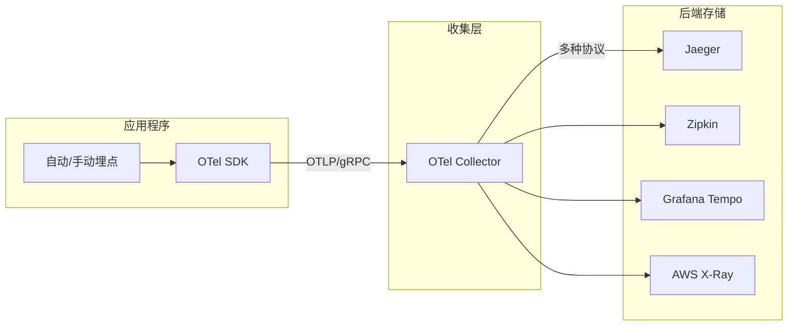
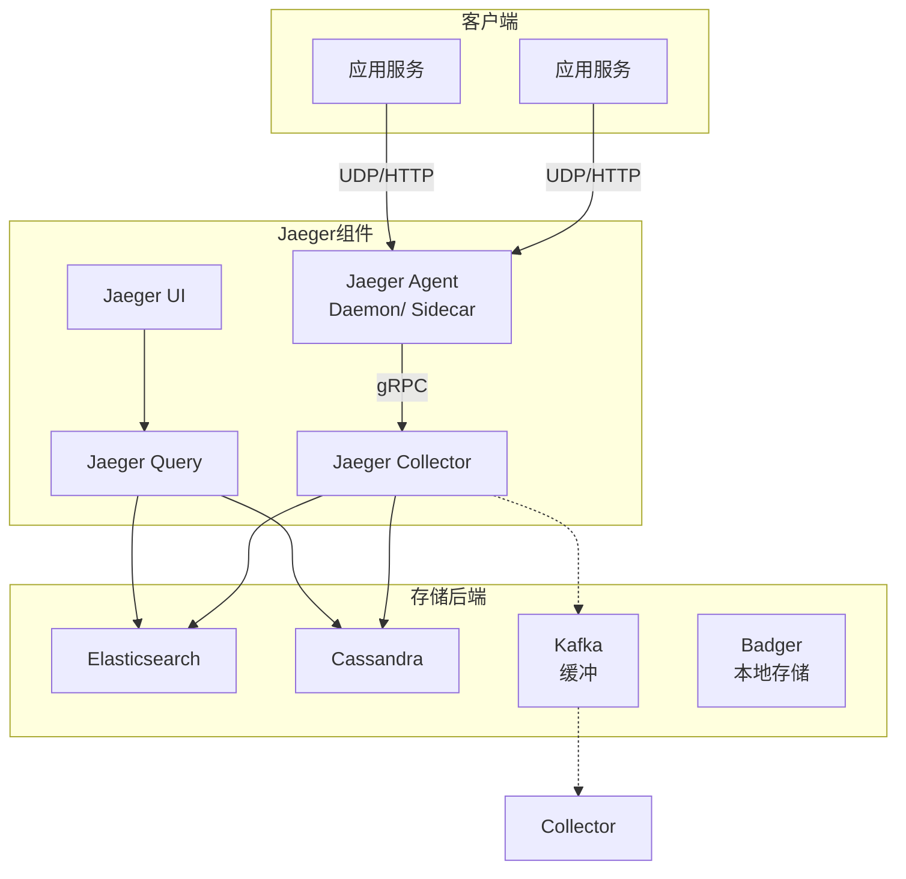
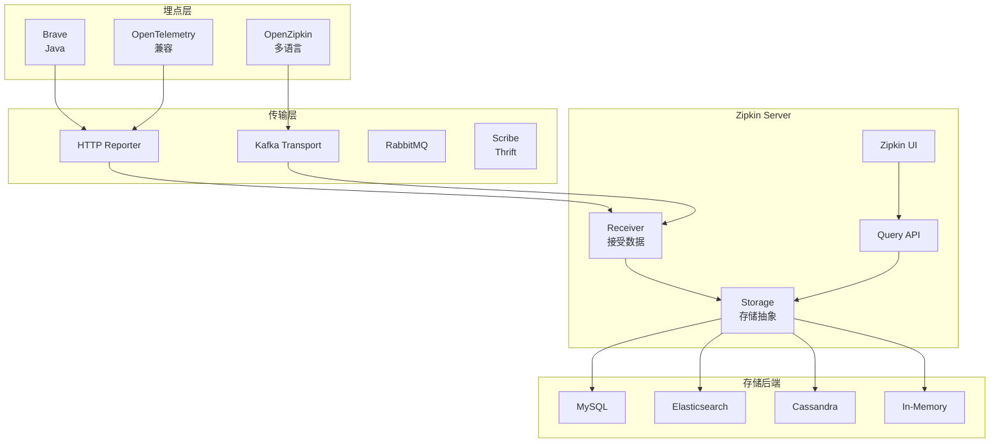
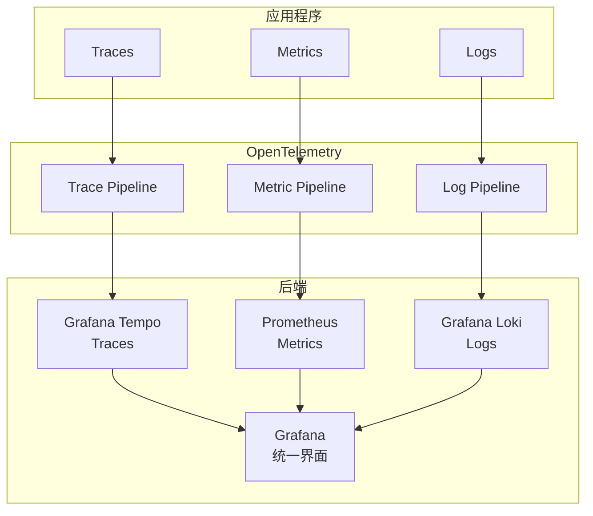

# 分布式链路追踪专题文档

**文档版本**：v1.0
**创建时间**：2026年
**最后更新**：2026年
**状态**：✅ 已完成

---

## 📋 执行摘要

分布式链路追踪是微服务架构中不可或缺的可观测性工具，通过追踪请求在分布式系统中的完整调用链，帮助开发者理解系统行为、定位性能瓶颈和故障根因。OpenTelemetry作为统一标准，正在整合Jaeger、Zipkin等多种实现。

---

## 一、核心概念

### 1.1 定义与原理

**分布式链路追踪（Distributed Tracing）** 是一种用于监控和分析分布式系统中请求流经多个服务的完整路径的技术。

**基本原理**：
- 为每个请求生成唯一的**Trace ID**
- 在请求经过的每个服务/组件中创建**Span**
- Span之间通过**Parent Span ID**建立因果关系
- 收集并可视化完整的调用链

**核心数据结构**：
```
Trace（追踪）
├── Trace ID: 唯一标识整个请求链
└── Spans（跨度）
    ├── Span ID: 唯一标识单个操作
    ├── Parent Span ID: 父操作标识
    ├── Operation Name: 操作名称
    ├── Start/End Time: 起止时间戳
    ├── Tags: 键值对属性
    ├── Logs: 时间戳事件
    └── References: 其他关系（如FollowsFrom）
```

### 1.2 关键特性

- **端到端可见性**：展示请求从入口到所有下游服务的完整路径
- **延迟分析**：精确测量每个服务和操作的耗时
- **依赖映射**：自动发现服务之间的调用关系
- **上下文传播**：跨服务边界传递追踪上下文
- **与日志/指标关联**：统一的观测数据关联

### 1.3 适用场景

| 场景 | 适用性 | 说明 |
|------|--------|------|
| 性能瓶颈定位 | ⭐⭐⭐⭐⭐ | 识别慢服务和慢操作 |
| 故障根因分析 | ⭐⭐⭐⭐⭐ | 快速定位错误来源 |
| 服务依赖分析 | ⭐⭐⭐⭐ | 生成服务拓扑图 |
| 容量规划 | ⭐⭐⭐ | 了解调用模式和频率 |
| 业务分析 | ⭐⭐ | 追踪业务流程执行情况 |

---

## 二、OpenTelemetry标准

### 2.1 OpenTelemetry概述

**OpenTelemetry（OTel）** 是CNCF项目，旨在成为遥测数据（Traces、Metrics、Logs）的统一标准：

- **前身**：合并了OpenTracing和OpenCensus
- **目标**：提供供应商无关的API、SDK和工具
- **数据格式**：OTLP（OpenTelemetry Protocol）

### 2.2 架构组件



### 2.3 核心概念

#### Traces（追踪）

```python
# OpenTelemetry Python示例
from opentelemetry import trace
from opentelemetry.sdk.trace import TracerProvider

# 设置Provider
trace.set_tracer_provider(TracerProvider())
tracer = trace.get_tracer(__name__)

# 创建Span
with tracer.start_as_current_span("process_order") as span:
    span.set_attribute("order.id", "12345")
    span.set_attribute("order.amount", 100.0)
    
    # 嵌套Span
    with tracer.start_as_current_span("validate_payment"):
        # 支付验证逻辑
        pass
    
    with tracer.start_as_current_span("update_inventory"):
        # 库存更新逻辑
        pass
```

#### Context Propagation（上下文传播）

**W3C Trace Context标准**：
```
HTTP Header: traceparent
Value: 00-4bf92f3577b34da6a3ce929d0e0e4736-00f067aa0ba902b7-01
       │  └─Trace ID──────────┘ └──Span ID──┘ │└Flags
       └Version                              │
                                             └Sampled
```

**传播方式**：
| 协议 | Header名称 | 说明 |
|------|-----------|------|
| HTTP | traceparent/tracestate | W3C标准 |
| gRPC | grpc-trace-bin | 二进制格式 |
| Kafka | traceparent | 消息属性 |
| Messaging | traceparent | AMQP/MQTT属性 |

### 2.4 自动埋点

OpenTelemetry提供多种语言的自动埋点：

| 语言 | 自动埋点支持 |
|------|-------------|
| Java | Java Agent，零代码侵入 |
| Python | instrumentation包 |
| Go | 需要少量代码修改 |
| Node.js | @opentelemetry/auto-instrumentations-node |
| .NET | OpenTelemetry.AutoInstrumentation |

**Java Agent示例**：
```bash
java -javaagent:opentelemetry-javaagent.jar \
     -Dotel.service.name=order-service \
     -Dotel.traces.exporter=otlp \
     -Dotel.exporter.otlp.endpoint=http://otel-collector:4317 \
     -jar order-service.jar
```

---

## 三、Jaeger架构

### 3.1 系统架构



**组件说明**：
- **Agent**：本地守护进程，接收UDP数据，批量转发
- **Collector**：接收追踪数据，验证、处理、存储
- **Query**：提供API查询追踪数据
- **UI**：可视化界面，展示追踪详情和服务依赖

### 3.2 数据模型

```thrift
struct Span {
  1: required i64 traceIdLow
  2: required i64 traceIdHigh
  3: required i64 spanId
  4: optional i64 parentSpanId
  5: required string operationName
  6: required list<SpanRef> references
  7: required i32 flags
  8: required i64 startTime
  9: required i64 duration
  10: required list<Tag> tags
  11: required list<Log> logs
  12: optional Process process
}
```

### 3.3 部署模式

| 模式 | 架构 | 适用场景 |
|------|------|----------|
| All-in-One | 单进程，内存存储 | 开发测试 |
| Production | 分离组件+持久存储 | 生产环境 |
| Streaming | Kafka缓冲 | 高吞吐场景 |
| Operator | Kubernetes原生 | K8s集群 |

---

## 四、Zipkin架构

### 4.1 系统架构



### 4.2 Zipkin vs Jaeger 对比

| 维度 | Zipkin | Jaeger |
|------|--------|--------|
| 开发方 | Twitter → OpenZipkin | Uber → CNCF |
| 诞生时间 | 2012 | 2016 |
| 存储选项 | ES, MySQL, Cassandra, 内存 | ES, Cassandra, Kafka, Badger |
| UI功能 | 基础追踪查看 | 高级依赖分析、对比视图 |
| 自适应采样 | 不支持 | 支持 |
| OpenTelemetry | 兼容 | 原生支持 |
| 性能 | 稳定 | 更优化的存储和查询 |

### 4.3 数据格式

**V2 JSON格式**：
```json
[
  {
    "traceId": "4d1e00c0db9010db86154a4ba6e06d27",
    "parentId": "86154a4ba6e06d27",
    "id": "4d1e00c0db9010db",
    "name": "get",
    "timestamp": 1472470996199000,
    "duration": 207000,
    "kind": "CLIENT",
    "localEndpoint": {
      "serviceName": "frontend",
      "ipv4": "127.0.0.1"
    },
    "tags": {
      "http.method": "GET",
      "http.path": "/api"
    }
  }
]
```

---

## 五、采样策略

### 5.1 采样必要性

**问题**：完整追踪所有请求会产生海量数据
- 一个请求产生数十到数百个Spans
- 100K QPS系统每天产生数十亿Spans
- 存储和查询成本极高

**目标**：以最小的数据量保留最有价值的信息

### 5.2 采样类型

#### 头部采样（Head-Based Sampling）

在请求入口处决定是否采样，后续服务遵循该决策。

**实现方式**：
```python
# 固定比率采样 - 采样1%的请求
sampler = TraceIdRatioBased(0.01)

# 父级采样 - 跟随父Span的采样决策
sampler = ParentBased(root=TraceIdRatioBased(0.01))
```

**特点**：
- 实现简单
- 要么完整记录整个Trace，要么完全不记录
- 可能遗漏重要的长尾请求

#### 尾部采样（Tail-Based Sampling）

收集完整Trace后再决定是否保留。

**策略类型**：
| 策略 | 说明 | 适用场景 |
|------|------|----------|
| 延迟采样 | 保留耗时超过阈值的Trace | 性能分析 |
| 错误采样 | 保留包含错误的Trace | 故障排查 |
| 特定操作 | 保留特定API/操作的Trace | 关键路径监控 |
| 组合策略 | 多条件组合 | 综合场景 |

**实现难点**：
- 需要缓存未完成的Trace（内存压力）
- 实现复杂度高

#### 自适应采样（Adaptive Sampling）

根据系统负载和流量动态调整采样率。

**Jaeger实现**：
- 监控各服务的操作频率
- 为高频低价值操作降低采样率
- 为低频高价值操作提高采样率

### 5.3 采样策略对比

| 策略 | 实现复杂度 | 数据完整性 | 存储成本 | 适用场景 |
|------|-----------|-----------|----------|----------|
| 固定比率 | 低 | 部分 | 可控 | 通用场景 |
| 头部采样 | 低 | 完整/无 | 低 | 均匀负载 |
| 尾部采样 | 高 | 可选择 | 高（临时） | 错误/慢请求分析 |
| 自适应采样 | 中 | 优化后 | 优化 | 大规模生产 |

---

## 六、与指标、日志关联

### 6.1 三大支柱整合

```
┌─────────────┐    ┌─────────────┐    ┌─────────────┐
│   Metrics   │◄──►│   Traces    │◄──►│    Logs     │
│   (指标)     │    │   (追踪)     │    │   (日志)     │
└─────────────┘    └─────────────┘    └─────────────┘
       │                  │                  │
       └──────────────────┼──────────────────┘
                          ▼
                   ┌─────────────┐
                   │  Correlation │
                   │   IDs       │
                   │ - Trace ID  │
                   │ - Span ID   │
                   │ - timestamp │
                   └─────────────┘
```

### 6.2 关联机制

#### Trace与Metrics关联

**Exemplars（示例）**：
- 在指标中嵌入Trace ID示例
- 从异常指标直接跳转到对应Trace

```promql
# Prometheus Exemplar示例
histogram_quantile(0.99, 
  rate(http_request_duration_seconds_bucket[5m])
)
# 点击数据点可查看对应Trace
```

#### Trace与Logs关联

**日志注入Trace ID**：
```python
# Python logging集成
import logging
from opentelemetry import trace

# 日志格式包含trace_id和span_id
formatter = logging.Formatter(
    '%(asctime)s - %(name)s - %(levelname)s - '
    '[trace_id=%(otelTraceID)s span_id=%(otelSpanID)s] - %(message)s'
)

# 搜索日志时可通过Trace ID关联
# trace_id=4bf92f3577b34da6a3ce929d0e0e4736
```

### 6.3 OpenTelemetry整合方案



---

## 七、实践指南

### 7.1 部署配置

**OpenTelemetry Collector配置**：
```yaml
# otel-collector-config.yaml
receivers:
  otlp:
    protocols:
      grpc:
        endpoint: 0.0.0.0:4317
      http:
        endpoint: 0.0.0.0:4318

processors:
  batch:
    timeout: 1s
    send_batch_size: 1024
  
  resource:
    attributes:
      - key: environment
        value: production
        action: upsert

exporters:
  jaeger:
    endpoint: jaeger-collector:14250
    tls:
      insecure: true
  
  prometheus:
    endpoint: 0.0.0.0:8889
    
  logging:
    loglevel: debug

service:
  pipelines:
    traces:
      receivers: [otlp]
      processors: [batch, resource]
      exporters: [jaeger, logging]
    metrics:
      receivers: [otlp]
      processors: [batch]
      exporters: [prometheus]
```

### 7.2 最佳实践

1. **命名规范**：
   - Span名称使用`{服务名}.{操作}`格式
   - 属性名使用小写+下划线

2. **采样策略**：
   - 生产环境使用1-10%头部采样
   - 关键路径使用尾部采样保留错误和慢请求

3. **上下文传播**：
   - 确保所有服务都支持W3C Trace Context
   - 检查消息队列、定时任务等异步场景的传播

4. **性能考虑**：
   - 使用批量发送（Batch Span Processor）
   - 配置合适的队列大小和超时
   - 避免在Span中记录大对象

5. **安全**：
   - 敏感信息（密码、Token）不要放入Tags
   - 使用TLS传输追踪数据

### 7.3 常见问题

**Q1: Trace数据丢失？**
A: 检查采样配置、网络连通性、Collector资源限制。

**Q2: 上下文传播失败？**
A: 确认所有中间件都支持传播协议，检查Header是否正确传递。

**Q3: UI中Trace不完整？**
A: 可能是时钟不同步导致，也可能是部分服务未正确上报。

---

## 八、与其他主题的关联

### 8.1 上游依赖

- [微服务架构](../架构设计/微服务架构.md)
- [可观测性](../运维与监控/可观测性.md)

### 8.2 下游应用

- [服务网格](./服务网格.md)
- [APM系统](../运维与监控/APM.md)

### 8.3 相关概念

| 概念 | 关系 | 说明 |
|------|------|------|
| Metrics | 互补 | 聚合统计 vs 单次请求详情 |
| Logs | 互补 | 结构化事件 vs 请求路径 |
| Profiling | 扩展 | 代码级性能分析 |

---

## 九、参考资源

### 9.1 官方文档

1. [OpenTelemetry官方文档](https://opentelemetry.io/docs/)
2. [Jaeger官方文档](https://www.jaegertracing.io/docs/)
3. [Zipkin官方文档](https://zipkin.io/pages/documentation.html)
4. [W3C Trace Context](https://www.w3.org/TR/trace-context/)

### 9.2 开源项目

1. [OpenTelemetry](https://github.com/open-telemetry)
2. [Jaeger](https://github.com/jaegertracing/jaeger)
3. [Zipkin](https://github.com/openzipkin/zipkin)
4. [Grafana Tempo](https://github.com/grafana/tempo)

### 9.3 学习资料

1. [Distributed Tracing in Practice](https://www.oreilly.com/library/view/distributed-tracing-in/9781492056621/) - O'Reilly
2. [Mastering Distributed Tracing](https://www.packtpub.com/product/mastering-distributed-tracing/9781788628464)
3. [Google Dapper论文](https://research.google/pubs/pub36356/)

### 9.4 相关文档

- [服务注册发现](./服务注册发现.md)
- [ZooKeeper深度分析](./ZooKeeper深度分析.md)
- [etcd详解](./etcd详解.md)

---

**维护者**：项目团队
**最后更新**：2026年
