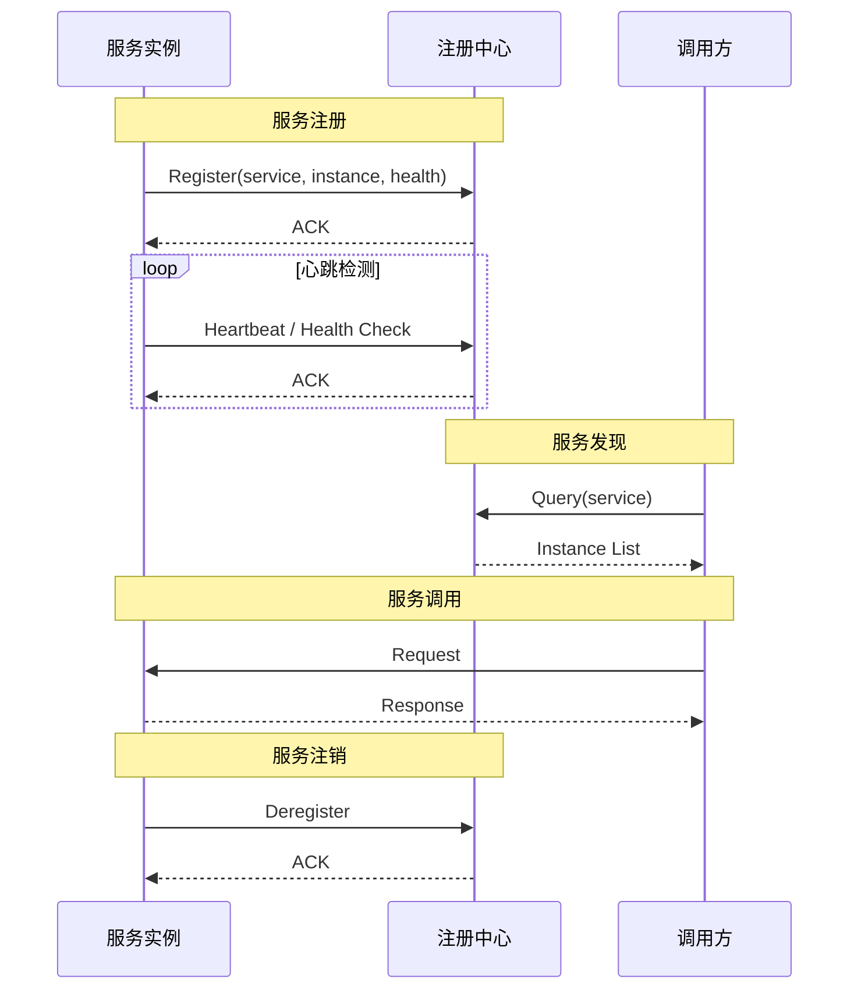
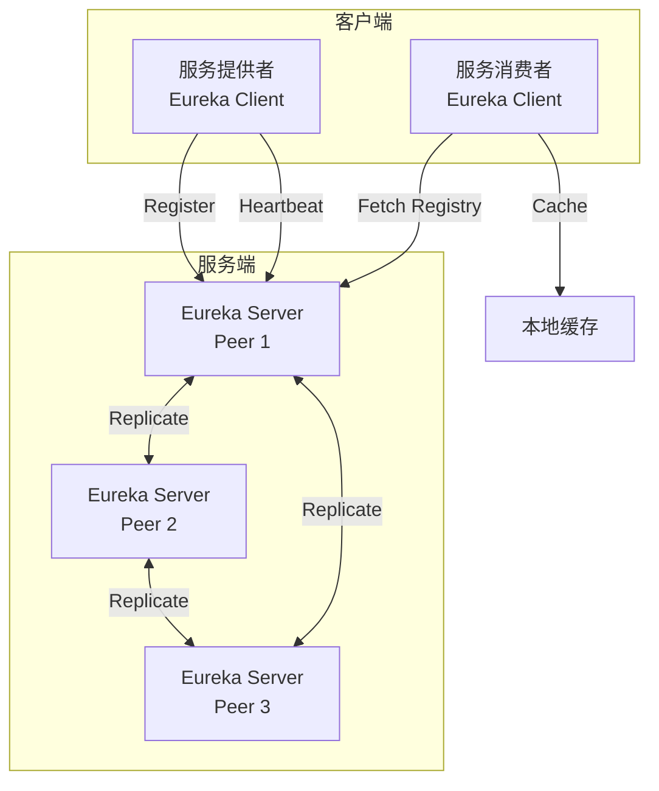
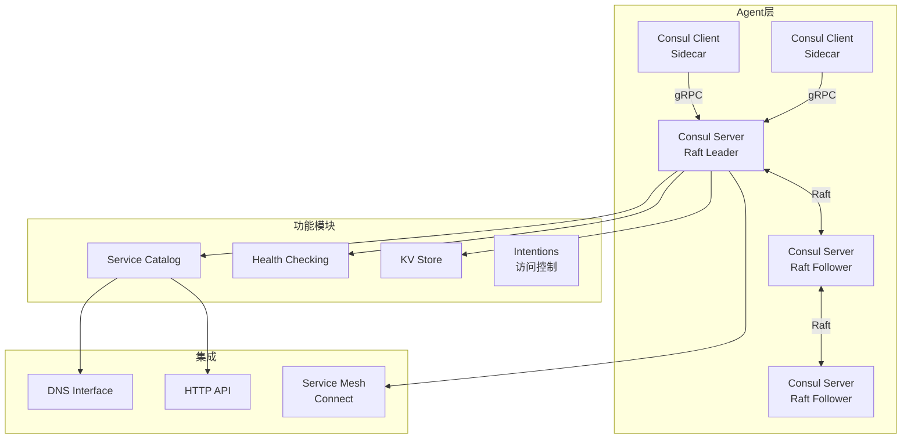
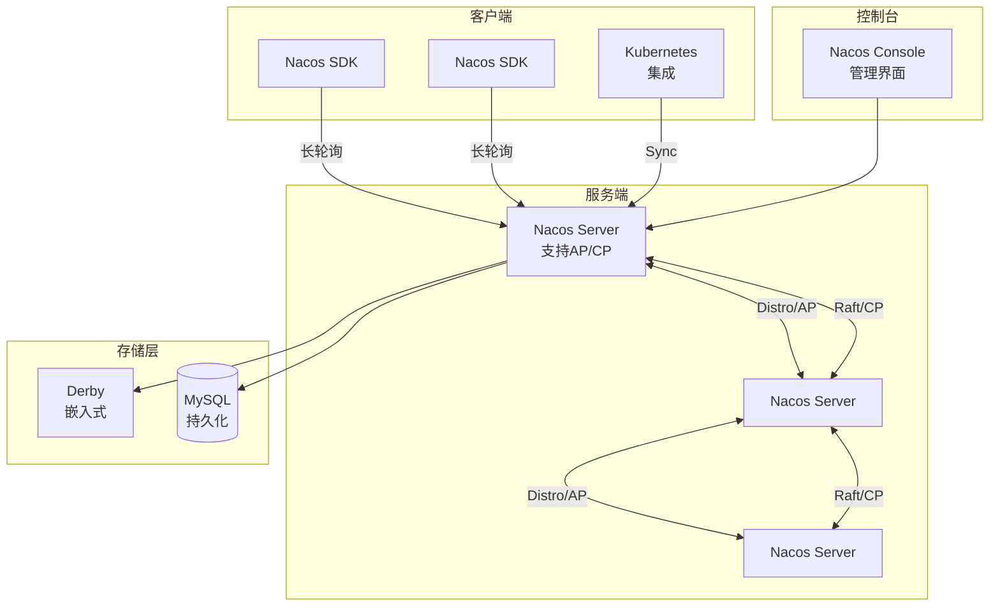
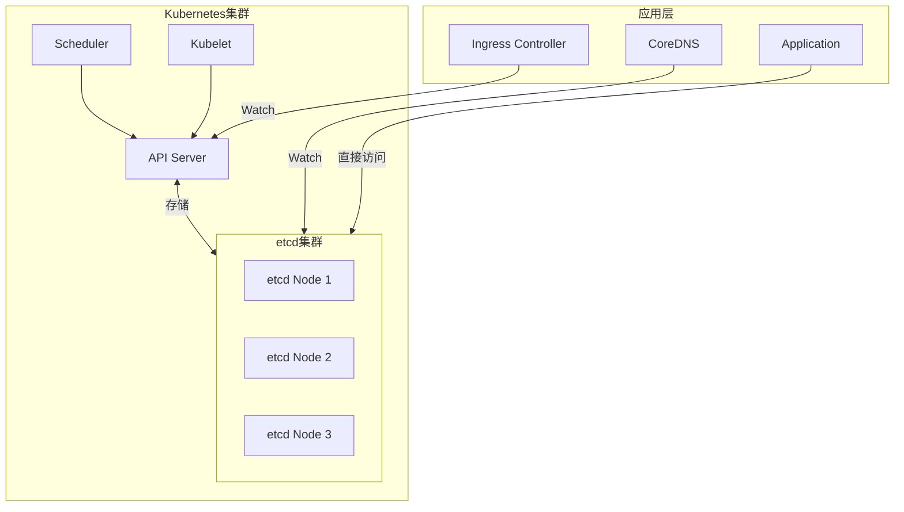

# 服务注册发现专题文档

**文档版本**：v1.0
**创建时间**：2026年
**最后更新**：2026年
**状态**：✅ 已完成

---

## 📋 执行摘要

服务注册发现是微服务架构的核心基础设施，解决动态环境下服务实例的定位和通信问题。通过服务注册、健康检查、服务发现三个核心机制，实现服务间的松耦合和自动化运维。

---

## 一、核心概念

### 1.1 定义与原理

**服务注册发现（Service Discovery）** 是一种在分布式系统中自动定位服务实例的机制。

**核心问题**：

- 服务实例动态扩缩容，IP和端口不断变化
- 需要一种机制让调用方找到可用的服务实例
- 需要检测故障实例并自动剔除

**两种模式**：

| 模式 | 说明 | 代表 |
|------|------|------|
| **客户端发现** | 客户端直接查询注册中心，选择实例 | Eureka, etcd |
| **服务端发现** | 通过负载均衡器转发，LB查询注册中心 | Consul + Fabio, Kubernetes Service |

### 1.2 核心机制



### 1.3 适用场景

| 场景 | 适用性 | 说明 |
|------|--------|------|
| 微服务架构 | ⭐⭐⭐⭐⭐ | 服务间动态发现和调用 |
| 容器编排 | ⭐⭐⭐⭐⭐ | Pod动态IP管理 |
| 多环境部署 | ⭐⭐⭐⭐ | 开发/测试/生产环境隔离 |
| 灰度发布 | ⭐⭐⭐⭐ | 基于元数据路由 |
| 故障转移 | ⭐⭐⭐⭐⭐ | 自动剔除故障实例 |

---

## 二、Eureka

### 2.1 架构设计



### 2.2 核心特性

**自我保护模式**：

- 当网络分区导致大量心跳丢失时，Eureka不会立即剔除服务
- 防止因网络抖动导致服务雪崩
- 配置：`eureka.server.enable-self-preservation=true`

**客户端缓存**：

- 客户端本地缓存注册表
- 即使注册中心不可用，仍能基于缓存调用
- 每30秒刷新一次

**AP设计**：

- 优先保证可用性（Availability）
- 网络分区时，各节点独立运行
- 最终一致性，可能读到过期数据

### 2.3 数据模型

```java
// 服务实例信息
{
    "instanceId": "host:service:port",
    "app": "ORDER-SERVICE",
    "ipAddr": "192.168.1.100",
    "status": "UP",
    "port": {"$": 8080, "@enabled": true},
    "healthCheckUrl": "http://192.168.1.100:8080/health",
    "metadata": {
        "version": "v1.0",
        "region": "beijing"
    },
    "leaseInfo": {
        "renewalIntervalInSecs": 30,
        "durationInSecs": 90
    }
}
```

---

## 三、Consul

### 3.1 架构设计



### 3.2 核心特性

**多数据中心**：

- 原生支持WAN gossip协议
- 跨数据中心服务发现
- 数据中心间最终一致

**健康检查**：

| 检查类型 | 说明 |
|----------|------|
| Script check | 执行脚本检查 |
| HTTP check | HTTP端点健康检查 |
| TCP check | TCP连接检查 |
| gRPC check | gRPC健康检查 |
| TTL check | 客户端心跳模式 |

**服务网格（Consul Connect）**：

- 内置mTLS支持
- 服务间自动加密通信
- 基于Intentions的访问控制

**DNS支持**：

```
# 通过DNS查询服务
order-service.service.consul. IN A 10.0.0.1
order-service.service.consul. IN A 10.0.0.2

# 带Tag的DNS查询
v1.order-service.service.consul. IN A 10.0.0.1
```

### 3.3 一致性模型

**CP设计**：

- 基于Raft协议保证强一致性
- 服务注册需要Leader确认
- 牺牲部分可用性换取一致性

---

## 四、Nacos

### 4.1 架构设计



### 4.2 核心特性

**双重一致性模型**：

| 模式 | 协议 | 适用场景 |
|------|------|----------|
| AP模式 | Distro协议 | 服务注册、临时实例 |
| CP模式 | Raft协议 | 配置管理、持久实例 |

**配置中心集成**：

- 统一的服务发现和配置管理
- 动态配置推送
- 配置版本历史和回滚

**负载均衡**：

- 内置权重、随机、轮询等策略
- 支持自定义负载均衡扩展

**多语言支持**：

- Java, Go, Python, Node.js, C#
- Spring Cloud, Dubbo, Kubernetes原生集成

---

## 五、etcd

### 5.1 在服务发现中的应用



### 5.2 实现模式

**基于租约的服务注册**：

```
1. 服务启动时创建Lease（TTL=10s）
2. 写入键值：/services/order/192.168.1.100:8080
   绑定Lease ID
3. 定期KeepAlive维持Lease
4. 服务宕机，Lease过期自动删除键值
5. Watch监听者收到删除事件
```

**键值设计**：

```
/registry/services/endpoints/default/order-service
{
    "subsets": [
        {
            "addresses": [
                {"ip": "10.244.1.10", "targetRef": {...}},
                {"ip": "10.244.1.11", "targetRef": {...}}
            ],
            "ports": [{"port": 8080, "protocol": "TCP"}]
        }
    ]
}
```

---

## 六、对比与选型

### 6.1 全面对比矩阵

| 维度 | Eureka | Consul | Nacos | etcd |
|------|--------|--------|-------|------|
| **一致性模型** | AP | CP（Raft） | AP/CP可选 | CP（Raft） |
| **健康检查** | 客户端心跳 | 多种方式 | 客户端心跳 | 租约TTL |
| **多数据中心** | 不支持 | 支持 | 支持 | 不支持 |
| **配置中心** | 不支持 | 支持（KV） | 原生支持 | 支持（KV） |
| **负载均衡** | 客户端Ribbon | 客户端/服务端 | 内置支持 | 无 |
| **服务网格** | 不支持 | 支持（Connect） | 支持 | 不支持 |
| **DNS支持** | 不支持 | 原生支持 | 不支持 | 需CoreDNS |
| **多语言SDK** | Java为主 | 全平台 | Java/Go/Python等 | 全平台 |
| **性能** | 中等 | 中等 | 高 | 高 |
| **运维复杂度** | 低 | 中 | 低 | 低 |

### 6.2 详细特性对比

#### 一致性模型

```
Eureka (AP)
├── 优先保证可用性
├── 网络分区时独立运行
├── 可能读到过期数据
└── 适合注册中心场景

Consul/etcd (CP)
├── 优先保证一致性
├── 网络分区时停止写服务
├── 始终读到最新数据
└── 适合配置管理场景

Nacos (AP/CP)
├── 服务注册用AP（Distro）
├── 配置管理用CP（Raft）
└── 灵活适应不同场景
```

#### 健康检查对比

| 方案 | 检查方式 | 优点 | 缺点 |
|------|----------|------|------|
| Eureka | 客户端心跳 | 简单，无侵入 | 需要客户端保活 |
| Consul | 服务端主动检查 | 准确，支持多种协议 | 服务端资源消耗 |
| Nacos | 客户端心跳+服务端检查 | 双重保障 | 配置复杂 |
| etcd | 租约TTL | 简单可靠 | 租约管理开销 |

### 6.3 选型决策树

```
技术选型
├── 纯Spring Cloud生态？
│   ├── 是 → Eureka（简单）或 Nacos（功能全）
│   └── 否 → 继续判断
├── Kubernetes原生？
│   ├── 是 → etcd + CoreDNS（内置方案）
│   └── 否 → 继续判断
├── 需要服务网格？
│   ├── 是 → Consul Connect 或 Istio+etcd
│   └── 否 → 继续判断
├── 需要统一配置中心？
│   ├── 是 → Nacos 或 Consul
│   └── 否 → 继续判断
├── 多语言环境？
│   ├── 是 → Consul 或 etcd
│   └── 否 → 继续判断
├── 强一致性要求？
│   ├── 是 → Consul 或 etcd
│   └── 否 → Eureka 或 Nacos(AP)
└── 运维资源有限？
    ├── 是 → etcd（运维简单）
    └── 否 → Consul 或 Nacos
```

### 6.4 场景推荐

| 场景 | 推荐方案 | 理由 |
|------|----------|------|
| Spring Cloud微服务 | Nacos | 功能全面，阿里生态 |
| Kubernetes原生 | etcd + CoreDNS | 内置方案，零额外依赖 |
| 多语言混合 | Consul | 全平台支持，功能丰富 |
| 超大规模（10万+实例） | etcd | 性能最优 |
| 传统企业Java | Eureka | 简单稳定，Spring原生 |
| 需要服务网格 | Consul | 内置Connect |
| 云原生全套 | Nacos | 配置+注册+服务治理 |

---

## 七、实践指南

### 7.1 高可用部署

**Eureka集群配置**：

```yaml
# application.yml
eureka:
  client:
    service-url:
      defaultZone: http://peer1:8761/eureka,http://peer2:8762/eureka
  server:
    enable-self-preservation: true
    eviction-interval-timer-in-ms: 60000
```

**Consul集群配置**：

```bash
# 启动Server节点
consul agent -server -bootstrap-expect=3 \
  -data-dir=/var/consul \
  -bind=10.0.0.1 \
  -retry-join="provider=aws tag_key=..."
```

**Nacos集群配置**：

```properties
# cluster.conf
10.0.0.1:8848
10.0.0.2:8848
10.0.0.3:8848
```

### 7.2 最佳实践

1. **服务注册**：
   - 服务启动时注册，就绪后标记为UP
   - 优雅关闭时主动注销
   - 设置合理的健康检查间隔

2. **客户端负载均衡**：
   - 本地缓存服务列表
   - 配置刷新间隔（推荐5-30秒）
   - 实现重试和熔断机制

3. **安全**：
   - 启用ACL/TLS
   - 服务间认证
   - 敏感配置加密

4. **监控**：
   - 注册中心健康状态
   - 服务上下线频率
   - 查询QPS和延迟

### 7.3 常见问题

**Q1: 服务注册不上？**
A: 检查网络连通性、注册中心地址配置、服务健康检查通过情况。

**Q2: 服务已下线但还在注册中心？**
A: 检查心跳是否正常、自我保护模式是否触发、租约是否过期。

**Q3: 多实例负载不均？**
   A: 检查负载均衡策略、实例权重配置、客户端缓存刷新频率。

---

## 八、与其他主题的关联

### 8.1 上游依赖

- [ZooKeeper深度分析](./ZooKeeper深度分析.md)
- [etcd详解](./etcd详解.md)
- [微服务架构](../架构设计/微服务架构.md)

### 8.2 下游应用

- [负载均衡](../网络与通信/负载均衡.md)
- [服务网格](./服务网格.md)
- [熔断降级](../可靠性工程/熔断降级.md)

### 8.3 相关概念

| 概念 | 关系 | 说明 |
|------|------|------|
| DNS | 替代/互补 | 传统服务发现方式 |
| 负载均衡 | 下游 | 发现后的流量分发 |
| 服务网格 | 演进 | Sidecar代理的服务发现 |

---

## 九、参考资源

### 9.1 官方文档

1. [Netflix Eureka](https://github.com/Netflix/eureka)
2. [HashiCorp Consul](https://www.consul.io/docs)
3. [Nacos](https://nacos.io/zh-cn/docs/what-is-nacos.html)
4. [etcd](https://etcd.io/docs/)

### 9.2 开源项目

1. [Spring Cloud Netflix](https://github.com/spring-cloud/spring-cloud-netflix)
2. [Spring Cloud Consul](https://github.com/spring-cloud/spring-cloud-consul)
3. [Nacos](https://github.com/alibaba/nacos)
4. [CoreDNS](https://github.com/coredns/coredns)

### 9.3 学习资料

1. [Building Microservices](https://samnewman.io/books/building_microservices/) - Sam Newman
2. [微服务设计](https://book.douban.com/subject/26772677/) - Sam Newman
3. [Kubernetes权威指南](https://book.douban.com/subject/35458487/)

### 9.4 相关文档

- [分布式链路追踪](./分布式链路追踪.md)
- [ZooKeeper深度分析](./ZooKeeper深度分析.md)
- [etcd详解](./etcd详解.md)

---

**维护者**：项目团队
**最后更新**：2026年
