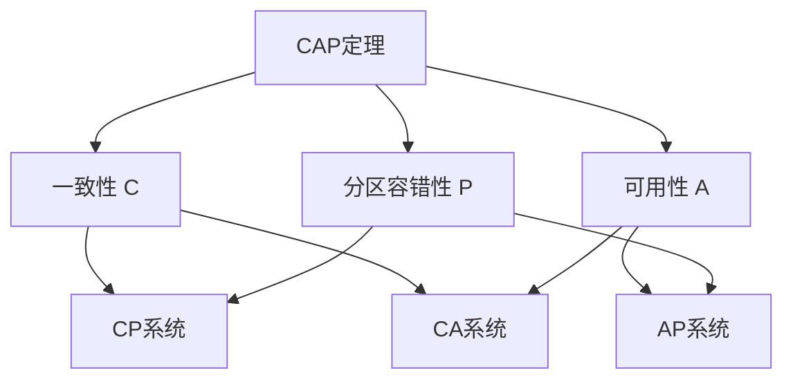
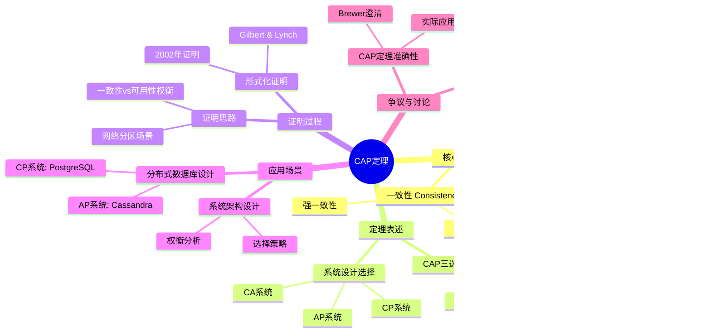
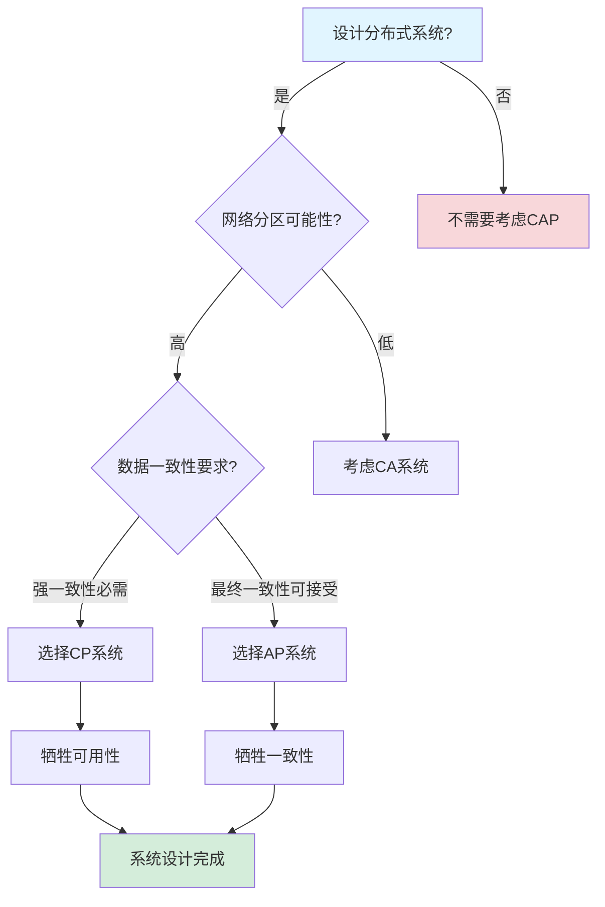
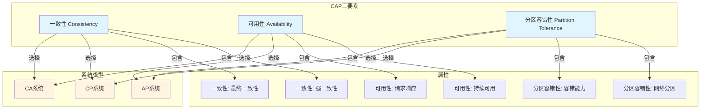
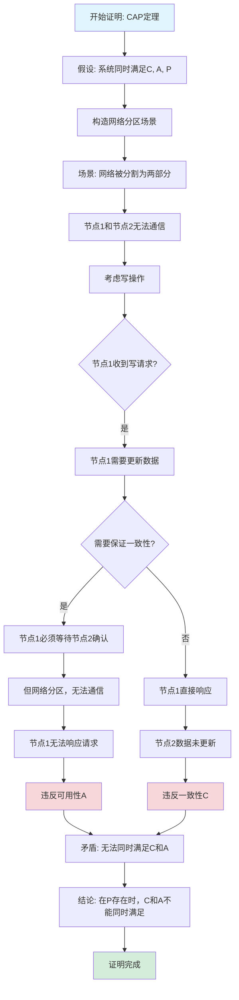

# CAP定理专题文档

## 目录

- [CAP定理专题文档](#cap定理专题文档)
  - [目录](#目录)
  - [一、概述](#一概述)
    - [1.1 CAP定理简介](#11-cap定理简介)
    - [1.2 核心思想](#12-核心思想)
    - [1.3 应用领域](#13-应用领域)
    - [1.4 在本项目中的应用](#14-在本项目中的应用)
  - [二、历史背景](#二历史背景)
    - [2.1 发展历史](#21-发展历史)
    - [2.2 重要人物](#22-重要人物)
    - [2.3 重要里程碑](#23-重要里程碑)
  - [三、核心概念](#三核心概念)
    - [3.1 基本概念](#31-基本概念)
      - [概念1：一致性（Consistency）](#概念1一致性consistency)
      - [概念2：可用性（Availability）](#概念2可用性availability)
      - [概念3：分区容错性（Partition Tolerance）](#概念3分区容错性partition-tolerance)
    - [3.2 概念关系](#32-概念关系)
  - [四、形式化定义](#四形式化定义)
    - [4.1 数学定义](#41-数学定义)
      - [定义1：分布式系统](#定义1分布式系统)
    - [4.2 定理表述](#42-定理表述)
      - [定理1：CAP定理](#定理1cap定理)
    - [4.3 证明过程](#43-证明过程)
      - [证明：CAP定理](#证明cap定理)
  - [五、性质与定理](#五性质与定理)
    - [5.1 基本性质](#51-基本性质)
      - [性质1：三选二约束](#性质1三选二约束)
      - [性质2：P通常是必需的](#性质2p通常是必需的)
    - [5.2 重要定理](#52-重要定理)
      - [定理1：CAP定理的严格性](#定理1cap定理的严格性)
  - [六、应用与讨论](#六应用与讨论)
    - [6.1 系统设计选择](#61-系统设计选择)
      - [选择1：CP系统（一致性+分区容错性）](#选择1cp系统一致性分区容错性)
      - [选择2：AP系统（可用性+分区容错性）](#选择2ap系统可用性分区容错性)
      - [选择3：CA系统（一致性+可用性）](#选择3ca系统一致性可用性)
    - [6.2 争议与讨论](#62-争议与讨论)
      - [争议1：CAP定理的准确性](#争议1cap定理的准确性)
      - [争议2：CAP定理的适用性](#争议2cap定理的适用性)
  - [七、应用场景](#七应用场景)
    - [7.1 适用场景](#71-适用场景)
      - [场景1：分布式数据库设计](#场景1分布式数据库设计)
      - [场景2：系统架构设计](#场景2系统架构设计)
    - [7.2 不适用场景](#72-不适用场景)
      - [场景1：单机系统](#场景1单机系统)
      - [场景2：同步网络](#场景2同步网络)
  - [八、实践案例](#八实践案例)
    - [8.1 工业界案例](#81-工业界案例)
      - [案例1：PostgreSQL（CP系统）](#案例1postgresqlcp系统)
      - [案例2：Cassandra（AP系统）](#案例2cassandraap系统)
    - [8.2 学术界案例](#82-学术界案例)
      - [案例1：CAP定理的形式化证明](#案例1cap定理的形式化证明)
  - [九、学习资源](#九学习资源)
    - [9.1 推荐阅读](#91-推荐阅读)
      - [经典著作](#经典著作)
      - [原始论文](#原始论文)
    - [9.2 学习路径](#92-学习路径)
      - [入门路径（1周）](#入门路径1周)
  - [十、参考文献](#十参考文献)
    - [10.1 经典文献](#101-经典文献)
      - [原始论文](#原始论文-1)
      - [原始演讲](#原始演讲)
    - [10.2 在线资源](#102-在线资源)
      - [Wikipedia](#wikipedia)
      - [经典著作](#经典著作-1)
  - [十一、思维表征](#十一思维表征)
    - [11.1 知识体系思维导图](#111-知识体系思维导图)
    - [11.2 多维知识对比矩阵](#112-多维知识对比矩阵)
      - [矩阵1：CAP系统选择对比矩阵](#矩阵1cap系统选择对比矩阵)
      - [矩阵2：CAP定理 vs 其他理论对比矩阵](#矩阵2cap定理-vs-其他理论对比矩阵)
    - [11.3 论证决策树](#113-论证决策树)
      - [决策树1：系统设计选择决策树（CP vs AP）](#决策树1系统设计选择决策树cp-vs-ap)
    - [11.4 概念属性关系图](#114-概念属性关系图)
    - [11.5 形式化证明流程图](#115-形式化证明流程图)
      - [证明流程图1：CAP定理证明步骤](#证明流程图1cap定理证明步骤)

---

## 一、概述

### 1.1 CAP定理简介

**CAP定理（CAP Theorem）** 是分布式系统理论中的一个重要定理，由Eric Brewer在2000年提出，由Seth Gilbert和Nancy Lynch在2002年形式化证明。它指出，在分布式系统中，一致性（Consistency）、可用性（Availability）和分区容错性（Partition tolerance）三个性质不能同时满足。

**来源**：基于Wikipedia [CAP Theorem](https://en.wikipedia.org/wiki/CAP_theorem) 和 Brewer的原始演讲以及Gilbert & Lynch的证明

**核心特点**：

1. **三选二**：在C、A、P中最多只能同时满足两个
2. **分区容错性必需**：在实际分布式系统中，P通常是必需的
3. **设计指导**：为分布式系统设计提供重要指导

### 1.2 核心思想

**核心思想1：三个性质**:

CAP定理涉及三个性质：

- **C（Consistency）**：一致性，所有节点同时看到相同的数据
- **A（Availability）**：可用性，系统持续可用，每个请求都能得到响应
- **P（Partition tolerance）**：分区容错性，系统在网络分区时仍能继续工作

**核心思想2：三选二约束**:

在分布式系统中，最多只能同时满足三个性质中的两个：

- **CA系统**：一致性和可用性，但不能容忍网络分区（如传统数据库）
- **CP系统**：一致性和分区容错性，但可能不可用（如分布式数据库）
- **AP系统**：可用性和分区容错性，但可能不一致（如最终一致性系统）

**核心思想3：实际选择**:

在实际分布式系统中：

- **P通常是必需的**：网络分区是不可避免的
- **因此实际选择是C和A之间的权衡**：选择CP或AP

### 1.3 应用领域

**应用领域1：分布式数据库**:

- 数据库设计
- 复制策略
- 一致性选择

**应用领域2：分布式系统**:

- 系统架构设计
- 一致性模型选择
- 可用性设计

**应用领域3：云计算**:

- 云服务设计
- 数据存储选择
- 服务可用性

### 1.4 在本项目中的应用

**在本项目中的应用**：

1. **Temporal的CAP选择**：Temporal选择CP（一致性+分区容错性）
2. **存储后端选择**：PostgreSQL提供强一致性（CP）
3. **系统设计指导**：指导系统架构设计

**相关文档链接**：

- [论证完备性增强](../14-argumentation-enhancement/论证完备性增强.md#13-cap定理与temporal)
- [技术堆栈对比](../02-technology-comparison/技术堆栈对比分析.md)

---

## 二、历史背景

### 2.1 发展历史

**2000年**：CAP定理提出

- **演讲**："Towards Robust Distributed Systems" by Eric Brewer
- **会议**：ACM Symposium on Principles of Distributed Computing (PODC)
- **贡献**：提出了CAP定理的直觉表述

**2002年**：CAP定理形式化证明

- **论文**："Brewer's Conjecture and the Feasibility of Consistent, Available, Partition-Tolerant Web Services" by Seth Gilbert and Nancy Lynch
- **期刊**：ACM SIGACT News
- **贡献**：形式化证明了CAP定理

**2010年代**：CAP定理讨论

- **争议**：关于CAP定理的准确性和适用性的讨论
- **澄清**：Brewer澄清了CAP定理的含义和应用

**来源**：Wikipedia [CAP Theorem](https://en.wikipedia.org/wiki/CAP_theorem) 和相关论文

### 2.2 重要人物

**Eric Brewer（1964-）**:

- **身份**：CAP定理的提出者
- **背景**：美国计算机科学家，Google副总裁
- **贡献**：
  - 提出CAP定理
  - 在分布式系统领域做出重要贡献

**来源**：Wikipedia [Eric Brewer](https://en.wikipedia.org/wiki/Eric_Brewer_(computer_scientist))

**Seth Gilbert & Nancy Lynch**:

- **身份**：CAP定理的形式化证明者
- **背景**：美国计算机科学家，MIT教授
- **贡献**：
  - 形式化证明了CAP定理
  - 在分布式系统理论方面做出重要贡献

**来源**：Wikipedia和相关论文

### 2.3 重要里程碑

| 时间 | 里程碑 | 影响 |
|------|--------|------|
| **2000** | CAP定理提出 | 建立分布式系统设计指导 |
| **2002** | 形式化证明 | 提供理论基础 |
| **2010** | 讨论和澄清 | 明确应用范围 |

---

## 三、核心概念

### 3.1 基本概念

#### 概念1：一致性（Consistency）

**定义**：一致性是指所有节点同时看到相同的数据。

**形式化定义**：

对于分布式系统中的任意两个节点 $N_1$ 和 $N_2$，如果它们都读取同一个数据项 $x$，则它们应该看到相同的值：

$$ \forall N_1, N_2, x: \text{Read}(N_1, x) = \text{Read}(N_2, x) $$

**来源**：Gilbert & Lynch, "Brewer's Conjecture" (2002)

#### 概念2：可用性（Availability）

**定义**：可用性是指系统持续可用，每个请求都能得到响应。

**形式化定义**：

对于系统中的任意节点 $N$ 和任意请求 $r$，系统必须在有限时间内响应：

$$ \forall N, r: \exists t < \infty: \text{Response}(N, r, t) \neq \bot $$

**来源**：Gilbert & Lynch, "Brewer's Conjecture" (2002)

#### 概念3：分区容错性（Partition Tolerance）

**定义**：分区容错性是指系统在网络分区时仍能继续工作。

**形式化定义**：

即使网络被分割成多个部分，系统仍能继续工作：

$$ \text{Partition}(Network) \implies \text{SystemContinues}() $$

**来源**：Gilbert & Lynch, "Brewer's Conjecture" (2002)

### 3.2 概念关系

**概念关系图**：

---

## 四、形式化定义

### 4.1 数学定义

#### 定义1：分布式系统

**定义**：分布式系统是一个三元组 $DS = (N, R, S)$，其中：

- $N$ 是节点集合
- $R$ 是请求集合
- $S$ 是系统状态

**来源**：Gilbert & Lynch, "Brewer's Conjecture" (2002)

### 4.2 定理表述

#### 定理1：CAP定理

**表述**：在分布式系统中，一致性（C）、可用性（A）和分区容错性（P）三个性质不能同时满足。

**形式化表述**：

$$ \neg (C \land A \land P) $$

即，不存在同时满足C、A、P的分布式系统。

**来源**：Gilbert & Lynch, "Brewer's Conjecture" (2002)

### 4.3 证明过程

#### 证明：CAP定理

**证明思路**：

1. **假设**：假设存在同时满足C、A、P的系统
2. **构造网络分区**：将网络分割成两个部分
3. **推导矛盾**：
   - 由于P，系统必须继续工作
   - 由于A，两个分区都必须响应请求
   - 由于网络分区，两个分区无法通信
   - 因此，两个分区可能返回不同的值，违反C
4. **结论**：矛盾，因此不存在同时满足C、A、P的系统

**详细证明**：

设系统有两个节点 $N_1$ 和 $N_2$，数据项 $x$ 的初始值为 $v_0$。

**步骤1**：网络分区

将网络分割，使得 $N_1$ 和 $N_2$ 无法通信。

**步骤2**：写操作

在 $N_1$ 上执行写操作 $W(x, v_1)$。由于A，$N_1$ 必须响应（假设成功）。

**步骤3**：读操作

在 $N_2$ 上执行读操作 $R(x)$。由于A，$N_2$ 必须响应。

**步骤4**：一致性检查

- 如果 $N_2$ 返回 $v_0$（旧值），则违反C（因为 $N_1$ 已经更新为 $v_1$）
- 如果 $N_2$ 返回 $v_1$（新值），则违反P（因为网络分区，$N_2$ 无法知道 $N_1$ 的更新）

**结论**：无论 $N_2$ 返回什么值，都会违反C、A、P中的至少一个。因此，不存在同时满足C、A、P的系统。□

**来源**：Gilbert & Lynch, "Brewer's Conjecture" (2002)

---

## 五、性质与定理

### 5.1 基本性质

#### 性质1：三选二约束

**表述**：在C、A、P中，最多只能同时满足两个。

**形式化表述**：

$$ \neg (C \land A \land P) \land (C \land A) \land (C \land P) \land (A \land P) $$

**来源**：CAP定理

#### 性质2：P通常是必需的

**表述**：在实际分布式系统中，P通常是必需的。

**原因**：

- 网络分区是不可避免的
- 系统必须能够容忍网络故障
- 因此，实际选择是C和A之间的权衡

**来源**：Brewer的后续讨论

### 5.2 重要定理

#### 定理1：CAP定理的严格性

**表述**：CAP定理在异步网络模型下是严格的。

**证明**：由Gilbert & Lynch的证明可得。

**来源**：Gilbert & Lynch, "Brewer's Conjecture" (2002)

---

## 六、应用与讨论

### 6.1 系统设计选择

#### 选择1：CP系统（一致性+分区容错性）

**特点**：

- 保证强一致性
- 容忍网络分区
- 在网络分区时可能不可用

**示例**：

- **PostgreSQL**：强一致性，在网络分区时可能不可用
- **MongoDB（强一致性模式）**：强一致性，在网络分区时可能不可用

**适用场景**：

- 金融系统
- 支付系统
- 需要强一致性的系统

#### 选择2：AP系统（可用性+分区容错性）

**特点**：

- 保证高可用性
- 容忍网络分区
- 可能提供最终一致性

**示例**：

- **Cassandra**：高可用性，最终一致性
- **DynamoDB**：高可用性，最终一致性

**适用场景**：

- 社交网络
- 内容分发
- 可以容忍暂时不一致的系统

#### 选择3：CA系统（一致性+可用性）

**特点**：

- 保证强一致性
- 保证高可用性
- 不能容忍网络分区

**示例**：

- **传统单机数据库**：强一致性，高可用性，但不能容忍网络分区

**适用场景**：

- 单机系统
- 局域网系统
- 不需要分布式的情况

### 6.2 争议与讨论

#### 争议1：CAP定理的准确性

**讨论**：

- 有人认为CAP定理过于简化
- 有人认为CAP定理的表述不够准确
- Brewer在后续讨论中澄清了CAP定理的含义

**来源**：相关讨论和Brewer的澄清

#### 争议2：CAP定理的适用性

**讨论**：

- CAP定理适用于异步网络模型
- 在同步网络模型下，可能可以同时满足C、A、P
- 实际系统的选择更复杂

**来源**：相关讨论

---

## 七、应用场景

### 7.1 适用场景

#### 场景1：分布式数据库设计

**描述**：使用CAP定理指导分布式数据库的设计。

**优势**：

- 明确设计选择
- 理解系统权衡
- 指导架构设计

**示例**：PostgreSQL（CP）、Cassandra（AP）

#### 场景2：系统架构设计

**描述**：使用CAP定理指导系统架构设计。

**优势**：

- 理解系统约束
- 做出合理选择
- 平衡系统需求

**示例**：微服务架构、分布式系统设计

### 7.2 不适用场景

#### 场景1：单机系统

**描述**：CAP定理不适用于单机系统。

**原因**：

- 单机系统不存在网络分区
- 可以同时满足C和A

#### 场景2：同步网络

**描述**：CAP定理在同步网络模型下可能不适用。

**原因**：

- 同步网络可以避免某些问题
- 可能可以同时满足C、A、P

---

## 八、实践案例

### 8.1 工业界案例

#### 案例1：PostgreSQL（CP系统）

**背景**：PostgreSQL选择CP（一致性+分区容错性）。

**特点**：

- 强一致性（ACID事务）
- 分区容错性（主从复制）
- 在网络分区时可能不可用

**效果**：

- 保证了数据一致性
- 适合金融、支付等场景
- 在网络分区时需要处理可用性问题

**来源**：PostgreSQL文档

#### 案例2：Cassandra（AP系统）

**背景**：Cassandra选择AP（可用性+分区容错性）。

**特点**：

- 高可用性
- 分区容错性
- 最终一致性

**效果**：

- 保证了高可用性
- 适合大规模分布式系统
- 需要处理一致性问题

**来源**：Cassandra文档

### 8.2 学术界案例

#### 案例1：CAP定理的形式化证明

**背景**：Gilbert & Lynch形式化证明了CAP定理。

**贡献**：

- 提供了严格的理论基础
- 明确了CAP定理的适用范围
- 推动了分布式系统理论发展

**来源**：Gilbert & Lynch, "Brewer's Conjecture" (2002)

---

## 九、学习资源

### 9.1 推荐阅读

#### 经典著作

1. **"Designing Data-Intensive Applications"**
   - 作者：Martin Kleppmann
   - 出版社：O'Reilly Media
   - 出版年份：2017
   - **推荐理由**：包含CAP定理的详细讲解

#### 原始论文

1. **"Brewer's Conjecture and the Feasibility of Consistent, Available, Partition-Tolerant Web Services"**
   - 作者：Seth Gilbert, Nancy Lynch
   - 期刊：ACM SIGACT News
   - 年份：2002
   - **推荐理由**：CAP定理的形式化证明

### 9.2 学习路径

#### 入门路径（1周）

1. **Day 1-2**：
   - 阅读CAP定理的原始论文
   - 理解三个性质的含义
   - 理解三选二约束

2. **Day 3-5**：
   - 学习不同系统的CAP选择
   - 理解实际应用场景
   - 完成实际案例分析

---

## 十、参考文献

### 10.1 经典文献

#### 原始论文

1. **Gilbert, S., & Lynch, N. (2002). "Brewer's Conjecture and the Feasibility of Consistent, Available, Partition-Tolerant Web Services"**
   - 期刊：ACM SIGACT News
   - **重要性**：CAP定理的形式化证明

#### 原始演讲

1. **Brewer, E. (2000). "Towards Robust Distributed Systems"**
   - 会议：ACM Symposium on Principles of Distributed Computing (PODC)
   - **重要性**：CAP定理的原始提出

### 10.2 在线资源

#### Wikipedia

- [CAP Theorem](https://en.wikipedia.org/wiki/CAP_theorem)
- [Eric Brewer](https://en.wikipedia.org/wiki/Eric_Brewer_(computer_scientist))

#### 经典著作

- **"Designing Data-Intensive Applications"** by Martin Kleppmann (2017)

---

## 十一、思维表征

### 11.1 知识体系思维导图

**CAP定理知识体系思维导图**：

### 11.2 多维知识对比矩阵

#### 矩阵1：CAP系统选择对比矩阵

| 系统类型 | 一致性 | 可用性 | 分区容错性 | 适用场景 | 典型系统 |
|---------|--------|--------|-----------|---------|---------|
| **CP系统** | ✅ | ❌ | ✅ | 金融系统、关键数据 | PostgreSQL, MongoDB |
| **AP系统** | ❌ | ✅ | ✅ | 社交网络、内容分发 | Cassandra, DynamoDB |
| **CA系统** | ✅ | ✅ | ❌ | 单机系统、局域网 | 传统数据库 |

#### 矩阵2：CAP定理 vs 其他理论对比矩阵

| 理论 | 关注点 | 适用场景 | 形式化程度 | 工业应用 |
|------|--------|---------|-----------|---------|
| **CAP定理** | 一致性、可用性、分区容错性 | 分布式系统设计 | ⭐⭐⭐⭐ | ⭐⭐⭐⭐⭐ |
| **ACID** | 事务特性 | 数据库事务 | ⭐⭐⭐⭐⭐ | ⭐⭐⭐⭐⭐ |
| **BASE** | 最终一致性 | 大规模分布式系统 | ⭐⭐⭐ | ⭐⭐⭐⭐ |

### 11.3 论证决策树

#### 决策树1：系统设计选择决策树（CP vs AP）

### 11.4 概念属性关系图

**CAP定理核心概念属性关系图**：

### 11.5 形式化证明流程图

#### 证明流程图1：CAP定理证明步骤

---

**思维表征说明**：

- **思维导图**：全面展示CAP定理的知识体系结构
- **对比矩阵**：从多个维度对比不同系统类型和理论
- **决策树**：提供清晰的决策路径，帮助选择合适的系统设计
- **关系图**：详细展示概念、属性、关系之间的网络
- **证明流程图**：可视化CAP定理的证明步骤和逻辑

**来源**：基于CAP定理理论、Brewer的演讲和Gilbert & Lynch的证明

**文档版本**：1.0

**创建时间**：2024年

**维护者**：项目团队

**最后更新**：2024年

**对标资源**：

- ✅ Wikipedia: [CAP Theorem](https://en.wikipedia.org/wiki/CAP_theorem)
- ✅ 经典著作: "Designing Data-Intensive Applications" by Kleppmann (2017)
- ✅ 原始论文: "Brewer's Conjecture" by Gilbert & Lynch (2002)
- ✅ 原始演讲: "Towards Robust Distributed Systems" by Brewer (2000)
