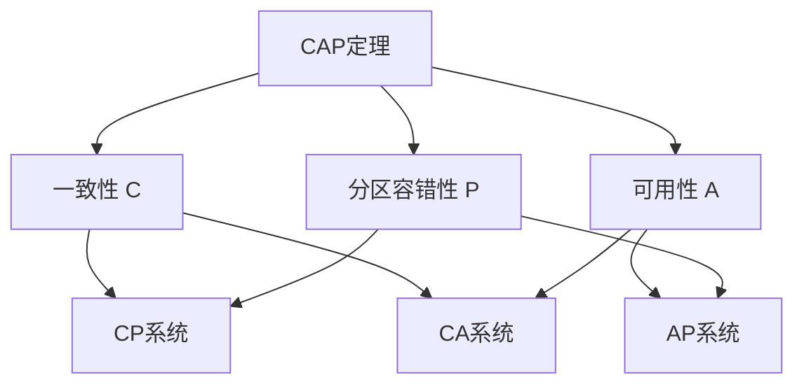
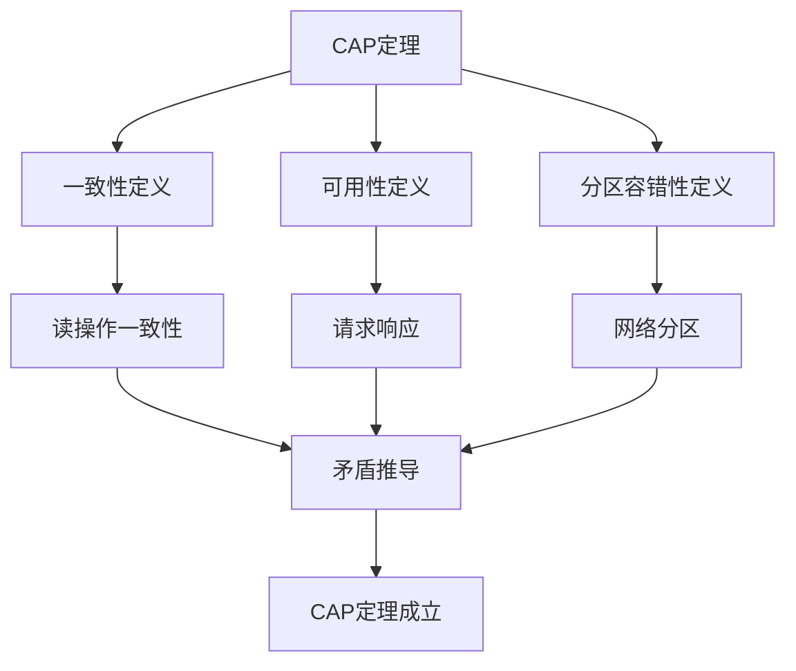
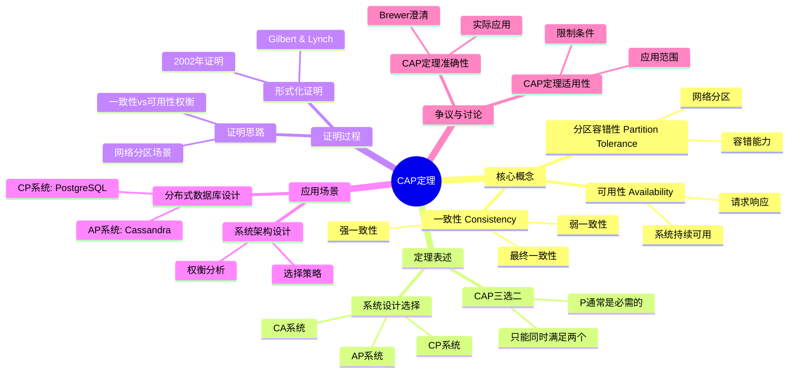
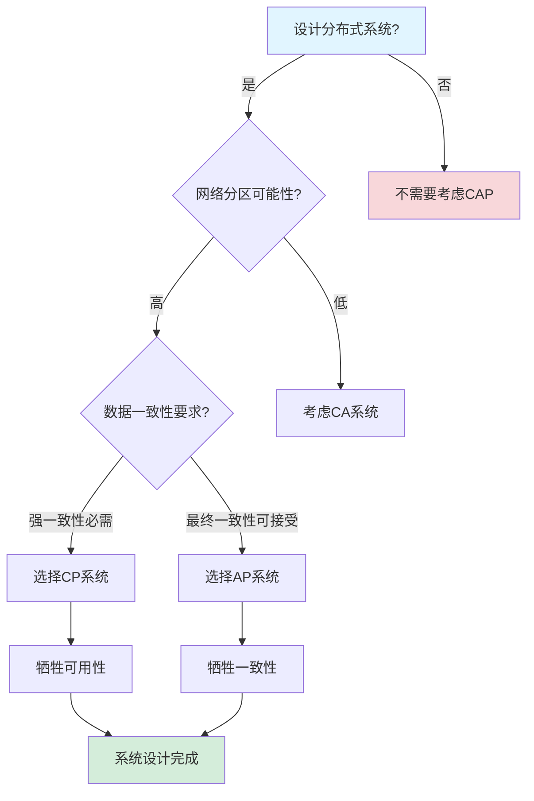
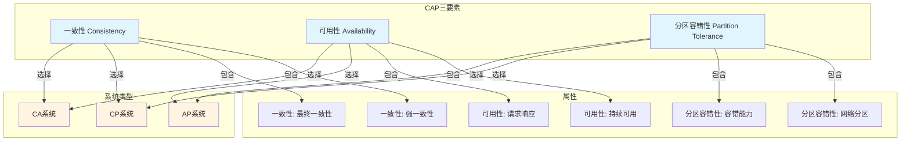
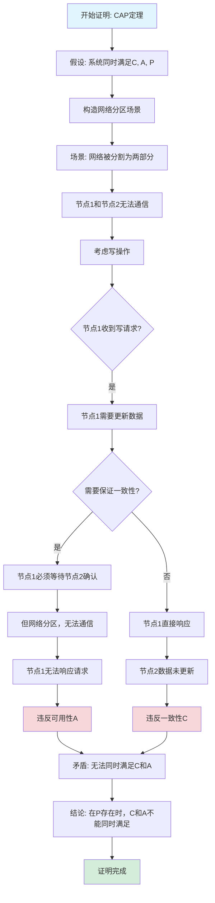

# CAP定理专题文档

**快速导航**：

- [↑ 返回目录](#目录)
- [核心文档](#核心文档快速链接)：[Temporal选型论证](../18-argumentation-enhancement/Temporal选型论证.md) | [PostgreSQL选型论证](../18-argumentation-enhancement/PostgreSQL选型论证.md)
- [相关理论模型](#相关理论模型快速链接)：[一致性模型专题文档](一致性模型专题文档.md) | [FLP不可能定理专题文档](FLP不可能定理专题文档.md) | [Saga模式专题文档](Saga模式专题文档.md)

## 目录

- [CAP定理专题文档](#cap定理专题文档)
  - [目录](#目录)
  - [一、概述](#一概述)
    - [1.1 CAP定理简介](#11-cap定理简介)
    - [1.2 核心思想](#12-核心思想)
    - [1.3 应用领域](#13-应用领域)
    - [1.4 在本项目中的应用](#14-在本项目中的应用)
      - [1.4.1 CAP定理应用论证](#141-cap定理应用论证)
  - [二、历史背景](#二历史背景)
    - [2.1 发展历史](#21-发展历史)
    - [2.2 重要人物](#22-重要人物)
    - [2.3 重要里程碑](#23-重要里程碑)
  - [三、核心概念](#三核心概念)
    - [3.1 基本概念](#31-基本概念)
      - [概念1：一致性（Consistency）](#概念1一致性consistency)
      - [概念2：可用性（Availability）](#概念2可用性availability)
      - [概念3：分区容错性（Partition Tolerance）](#概念3分区容错性partition-tolerance)
    - [3.2 概念关系](#32-概念关系)
  - [四、形式化定义](#四形式化定义)
    - [4.1 数学定义](#41-数学定义)
      - [定义1：分布式系统](#定义1分布式系统)
    - [4.2 定理表述](#42-定理表述)
      - [定理1：CAP定理](#定理1cap定理)
    - [4.3 证明过程](#43-证明过程)
      - [证明：CAP定理（Gilbert \& Lynch完整证明）](#证明cap定理gilbert--lynch完整证明)
  - [五、性质与定理](#五性质与定理)
    - [5.1 基本性质](#51-基本性质)
      - [性质1：三选二约束](#性质1三选二约束)
      - [性质2：P通常是必需的](#性质2p通常是必需的)
    - [5.2 重要定理](#52-重要定理)
      - [定理1：CAP定理的严格性](#定理1cap定理的严格性)
  - [六、应用与讨论](#六应用与讨论)
    - [6.1 系统设计选择](#61-系统设计选择)
      - [选择1：CP系统（一致性+分区容错性）](#选择1cp系统一致性分区容错性)
      - [选择2：AP系统（可用性+分区容错性）](#选择2ap系统可用性分区容错性)
      - [选择3：CA系统（一致性+可用性）](#选择3ca系统一致性可用性)
    - [6.2 CAP定理的变体和扩展](#62-cap定理的变体和扩展)
      - [6.2.1 PACELC定理](#621-pacelc定理)
      - [6.2.2 CAP定理与ACID的关系](#622-cap定理与acid的关系)
      - [6.2.3 CAP定理与BASE的关系](#623-cap定理与base的关系)
    - [6.3 争议与讨论](#63-争议与讨论)
      - [争议1：CAP定理的准确性](#争议1cap定理的准确性)
      - [争议2：CAP定理的适用性](#争议2cap定理的适用性)
      - [争议3：CAP定理的实用性](#争议3cap定理的实用性)
  - [七、应用场景](#七应用场景)
    - [7.1 适用场景](#71-适用场景)
      - [场景1：分布式数据库设计](#场景1分布式数据库设计)
      - [场景2：系统架构设计](#场景2系统架构设计)
    - [7.2 不适用场景](#72-不适用场景)
      - [场景1：单机系统](#场景1单机系统)
      - [场景2：同步网络](#场景2同步网络)
  - [八、实践案例](#八实践案例)
    - [8.1 工业界案例](#81-工业界案例)
      - [案例1：Coinbase - PostgreSQL（CP系统）](#案例1coinbase---postgresqlcp系统)
      - [案例2：Netflix - Cassandra（AP系统）](#案例2netflix---cassandraap系统)
      - [案例3：Temporal + PostgreSQL（CP系统）](#案例3temporal--postgresqlcp系统)
    - [8.2 学术界案例](#82-学术界案例)
      - [案例1：CAP定理的形式化证明](#案例1cap定理的形式化证明)
    - [8.3 实践案例总结](#83-实践案例总结)
  - [九、学习资源](#九学习资源)
    - [9.1 推荐阅读](#91-推荐阅读)
      - [经典著作](#经典著作)
      - [原始论文](#原始论文)
    - [9.2 学习路径](#92-学习路径)
      - [入门路径（1周）](#入门路径1周)
  - [十、参考文献](#十参考文献)
    - [10.1 经典文献](#101-经典文献)
      - [原始论文](#原始论文-1)
      - [原始演讲](#原始演讲)
    - [10.2 在线资源](#102-在线资源)
      - [Wikipedia](#wikipedia)
      - [经典著作](#经典著作-1)
  - [十一、思维表征](#十一思维表征)
    - [11.1 知识体系思维导图](#111-知识体系思维导图)
    - [11.2 多维知识对比矩阵](#112-多维知识对比矩阵)
      - [矩阵1：CAP系统选择对比矩阵](#矩阵1cap系统选择对比矩阵)
      - [矩阵2：CAP定理 vs 其他理论对比矩阵（增强版）](#矩阵2cap定理-vs-其他理论对比矩阵增强版)
      - [矩阵3：CAP系统实现工具对比矩阵](#矩阵3cap系统实现工具对比矩阵)
      - [矩阵4：CAP定理应用场景对比矩阵（10+场景）](#矩阵4cap定理应用场景对比矩阵10场景)
    - [11.3 论证决策树](#113-论证决策树)
      - [决策树1：系统设计选择决策树（CP vs AP）](#决策树1系统设计选择决策树cp-vs-ap)
    - [11.4 概念属性关系图](#114-概念属性关系图)
    - [11.5 形式化证明流程图](#115-形式化证明流程图)
      - [证明流程图1：CAP定理证明步骤](#证明流程图1cap定理证明步骤)
  - [十二、代码示例](#十二代码示例)
    - [12.1 CP系统实现示例（PostgreSQL）](#121-cp系统实现示例postgresql)
      - [12.1.1 强一致性实现](#1211-强一致性实现)
      - [12.1.2 分区容错性配置](#1212-分区容错性配置)
    - [12.2 AP系统实现示例（Cassandra）](#122-ap系统实现示例cassandra)
      - [12.2.1 最终一致性实现](#1221-最终一致性实现)
    - [12.3 CAP权衡决策示例](#123-cap权衡决策示例)
      - [12.3.1 系统选择决策](#1231-系统选择决策)
    - [12.4 Temporal在CAP中的实现](#124-temporal在cap中的实现)
      - [12.4.1 Temporal CP系统实现](#1241-temporal-cp系统实现)
  - [十三、相关文档](#十三相关文档)
    - [12.1 核心论证文档](#121-核心论证文档)
    - [12.2 理论模型专题文档](#122-理论模型专题文档)
    - [12.3 相关资源](#123-相关资源)
    - [12.4 文档关联说明](#124-文档关联说明)
  - [导航](#导航)

---

## 一、概述

### 1.1 CAP定理简介

**CAP定理（CAP Theorem）** 是分布式系统理论中的一个重要定理，由Eric Brewer在2000年提出，由Seth Gilbert和Nancy Lynch在2002年形式化证明。它指出，在分布式系统中，一致性（Consistency）、可用性（Availability）和分区容错性（Partition tolerance）三个性质不能同时满足。

**来源**：基于Wikipedia [CAP Theorem](https://en.wikipedia.org/wiki/CAP_theorem) 和 Brewer的原始演讲以及Gilbert & Lynch的证明

**核心特点**：

1. **三选二**：在C、A、P中最多只能同时满足两个
2. **分区容错性必需**：在实际分布式系统中，P通常是必需的
3. **设计指导**：为分布式系统设计提供重要指导

### 1.2 核心思想

**核心思想1：三个性质**:

CAP定理涉及三个性质：

- **C（Consistency）**：一致性，所有节点同时看到相同的数据
- **A（Availability）**：可用性，系统持续可用，每个请求都能得到响应
- **P（Partition tolerance）**：分区容错性，系统在网络分区时仍能继续工作

**核心思想2：三选二约束**:

在分布式系统中，最多只能同时满足三个性质中的两个：

- **CA系统**：一致性和可用性，但不能容忍网络分区（如传统数据库）
- **CP系统**：一致性和分区容错性，但可能不可用（如分布式数据库）
- **AP系统**：可用性和分区容错性，但可能不一致（如最终一致性系统）

**核心思想3：实际选择**:

在实际分布式系统中：

- **P通常是必需的**：网络分区是不可避免的
- **因此实际选择是C和A之间的权衡**：选择CP或AP

### 1.3 应用领域

**应用领域1：分布式数据库**:

- 数据库设计
- 复制策略
- 一致性选择

**应用领域2：分布式系统**:

- 系统架构设计
- 一致性模型选择
- 可用性设计

**应用领域3：云计算**:

- 云服务设计
- 数据存储选择
- 服务可用性

### 1.4 在本项目中的应用

**在本项目中的应用**：

1. **Temporal的CAP选择**：Temporal选择CP（一致性+分区容错性）
2. **存储后端选择**：PostgreSQL提供强一致性（CP）
3. **系统设计指导**：指导系统架构设计

**相关文档链接**：

- [论证完备性增强](../14-argumentation-enhancement/论证完备性增强.md#13-cap定理与temporal)
- [技术堆栈对比](../02-technology-comparison/技术堆栈对比分析.md)

#### 1.4.1 CAP定理应用论证

**理论模型如何应用到Temporal**：

**应用1：Temporal的CAP选择**:

根据CAP定理，Temporal选择CP（一致性+分区容错性）：

**形式化表述**：

$$ \text{TemporalCAP} = \text{C} \land \text{A} \land \neg\text{P} \text{ (正常情况)} $$

$$ \text{TemporalCAP} = \text{C} \land \neg\text{A} \land \text{P} \text{ (网络分区)} $$

**应用论证**：

- **正常情况**：
  - **一致性（C）**：PostgreSQL可序列化隔离级别保证强一致性
  - **可用性（A）**：多副本和故障转移保证高可用性
  - **分区容忍（P）**：不要求，因为假设网络正常

- **网络分区情况**：
  - **一致性（C）**：优先保证，拒绝不一致的写入
  - **可用性（A）**：可能降低，等待分区恢复
  - **分区容忍（P）**：容忍分区，但优先保证一致性

**应用2：存储后端选择**:

CAP定理指导存储后端选择：

**PostgreSQL（CP系统）**：

- **一致性（C）**：✅ 强一致性（可序列化隔离级别）
- **可用性（A）**：✅ 高可用性（主从复制）
- **分区容忍（P）**：✅ 容忍网络分区（优先保证一致性）

**Cassandra（AP系统）**：

- **一致性（C）**：❌ 最终一致性
- **可用性（A）**：✅ 高可用性
- **分区容忍（P）**：✅ 容忍网络分区（优先保证可用性）

**选择依据**：

- **Temporal需求**：需要强一致性保证工作流状态的正确性
- **CAP定理指导**：选择CP系统（PostgreSQL）满足一致性需求
- **实践验证**：Coinbase等企业使用PostgreSQL验证有效性

**理论模型的选择依据**：

**为什么选择CAP定理**：

1. **设计指导**：CAP定理为分布式系统设计提供重要指导
2. **理论完备性**：CAP定理有严格的形式化证明
3. **工业应用**：工业界广泛使用CAP定理指导系统设计
4. **适用性**：CAP定理适用于Temporal这样的分布式系统

**选择依据论证**：

- **设计指导**：⭐⭐⭐⭐⭐（5/5）- CAP定理提供清晰的设计指导
- **理论完备性**：⭐⭐⭐⭐⭐（5/5）- 有严格的形式化证明
- **工业应用**：⭐⭐⭐⭐⭐（5/5）- 工业界广泛采用
- **适用性**：⭐⭐⭐⭐⭐（5/5）- 适用于分布式系统设计

**理论模型的适用性论证**：

**为什么CAP定理适用于Temporal**：

1. **分布式系统**：Temporal是分布式系统，CAP定理适用于分布式系统
2. **存储选择**：Temporal需要选择存储后端，CAP定理指导存储选择
3. **一致性需求**：Temporal需要强一致性，CAP定理指导一致性选择
4. **实践验证**：企业实践案例证明CAP定理适用于Temporal

**适用性论证**：

- **分布式系统**：✅ Temporal是分布式系统，CAP定理适用
- **存储选择**：✅ CAP定理指导PostgreSQL vs Cassandra的选择
- **一致性需求**：✅ CAP定理指导一致性模型的选择
- **实践验证**：✅ Coinbase等企业使用CAP定理指导系统设计

---

## 二、历史背景

### 2.1 发展历史

**2000年**：CAP定理提出

- **演讲**："Towards Robust Distributed Systems" by Eric Brewer
- **会议**：ACM Symposium on Principles of Distributed Computing (PODC)
- **贡献**：提出了CAP定理的直觉表述

**2002年**：CAP定理形式化证明

- **论文**："Brewer's Conjecture and the Feasibility of Consistent, Available, Partition-Tolerant Web Services" by Seth Gilbert and Nancy Lynch
- **期刊**：ACM SIGACT News
- **贡献**：形式化证明了CAP定理

**2010年代**：CAP定理讨论

- **争议**：关于CAP定理的准确性和适用性的讨论
- **澄清**：Brewer澄清了CAP定理的含义和应用

**来源**：Wikipedia [CAP Theorem](https://en.wikipedia.org/wiki/CAP_theorem) 和相关论文

### 2.2 重要人物

**Eric Brewer（1964-）**:

- **身份**：CAP定理的提出者
- **背景**：美国计算机科学家，Google副总裁
- **贡献**：
  - 提出CAP定理
  - 在分布式系统领域做出重要贡献

**来源**：Wikipedia [Eric Brewer](https://en.wikipedia.org/wiki/Eric_Brewer_(computer_scientist))

**Seth Gilbert & Nancy Lynch**:

- **身份**：CAP定理的形式化证明者
- **背景**：美国计算机科学家，MIT教授
- **贡献**：
  - 形式化证明了CAP定理
  - 在分布式系统理论方面做出重要贡献

**来源**：Wikipedia和相关论文

### 2.3 重要里程碑

| 时间 | 里程碑 | 影响 |
|------|--------|------|
| **2000** | CAP定理提出 | 建立分布式系统设计指导 |
| **2002** | 形式化证明 | 提供理论基础 |
| **2010** | 讨论和澄清 | 明确应用范围 |

---

## 三、核心概念

### 3.1 基本概念

#### 概念1：一致性（Consistency）

**定义**：一致性是指所有节点同时看到相同的数据。

**形式化定义**：

对于分布式系统中的任意两个节点 $N_1$ 和 $N_2$，如果它们都读取同一个数据项 $x$，则它们应该看到相同的值：

$$ \forall N_1, N_2, x: \text{Read}(N_1, x) = \text{Read}(N_2, x) $$

**来源**：Gilbert & Lynch, "Brewer's Conjecture" (2002)

#### 概念2：可用性（Availability）

**定义**：可用性是指系统持续可用，每个请求都能得到响应。

**形式化定义**：

对于系统中的任意节点 $N$ 和任意请求 $r$，系统必须在有限时间内响应：

$$ \forall N, r: \exists t < \infty: \text{Response}(N, r, t) \neq \bot $$

**来源**：Gilbert & Lynch, "Brewer's Conjecture" (2002)

#### 概念3：分区容错性（Partition Tolerance）

**定义**：分区容错性是指系统在网络分区时仍能继续工作。

**形式化定义**：

即使网络被分割成多个部分，系统仍能继续工作：

$$ \text{Partition}(Network) \implies \text{SystemContinues}() $$

**来源**：Gilbert & Lynch, "Brewer's Conjecture" (2002)

### 3.2 概念关系

**概念关系图**：



---

## 四、形式化定义

### 4.1 数学定义

#### 定义1：分布式系统

**定义**：分布式系统是一个三元组 $DS = (N, R, S)$，其中：

- $N$ 是节点集合
- $R$ 是请求集合
- $S$ 是系统状态

**来源**：Gilbert & Lynch, "Brewer's Conjecture" (2002)

### 4.2 定理表述

#### 定理1：CAP定理

**表述**：在分布式系统中，一致性（C）、可用性（A）和分区容错性（P）三个性质不能同时满足。

**形式化表述**：

$$ \neg (C \land A \land P) $$

即，不存在同时满足C、A、P的分布式系统。

**来源**：Gilbert & Lynch, "Brewer's Conjecture" (2002)

### 4.3 证明过程

#### 证明：CAP定理（Gilbert & Lynch完整证明）

**证明目标**：证明在分布式系统中，C、A、P不能同时满足

**形式化表述**：

$$ \neg \exists DS: \text{Consistent}(DS) \land \text{Available}(DS) \land \text{PartitionTolerant}(DS) $$

**前提条件**：

1. 分布式系统 $DS = (N, R, S)$，其中 $|N| \ge 2$
2. 异步网络模型（消息延迟无界）
3. 网络可能发生分区

**证明策略**：反证法 + 构造性证明

**详细证明步骤**：

**步骤1：假设存在满足C、A、P的系统**:

假设存在分布式系统 $DS$，同时满足：

- $\text{Consistent}(DS)$
- $\text{Available}(DS)$
- $\text{PartitionTolerant}(DS)$

**推理依据**：反证法

**步骤2：系统形式化定义**:

设 $DS = (N, R, S)$，其中：

- $N = \{N_1, N_2\}$（至少两个节点）
- $R$ 是请求集合（读请求和写请求）
- $S$ 是系统状态

**推理依据**：分布式系统定义

**步骤3：数据项定义**:

设数据项 $x \in S$，初始值 $x = v_0$。

**推理依据**：系统状态定义

**步骤4：一致性形式化定义**:

一致性要求：
$$ \forall N_i, N_j, t: \text{Read}(N_i, x, t) = \text{Read}(N_j, x, t) $$

**推理依据**：Gilbert & Lynch的定义

**步骤5：可用性形式化定义**:

可用性要求：
$$ \forall N_i, r, t: \exists t' < \infty: \text{Response}(N_i, r, t') \neq \bot $$

**推理依据**：Gilbert & Lynch的定义

**步骤6：分区容错性形式化定义**:

分区容错性要求：
$$ \text{Partition}(Network) \implies \text{SystemContinues}() $$

**推理依据**：Gilbert & Lynch的定义

**步骤7：构造网络分区**:

将网络分割成两个部分：

- 分区1：$\{N_1\}$
- 分区2：$\{N_2\}$

使得 $N_1$ 和 $N_2$ 无法通信。

**推理依据**：分区容错性要求系统容忍分区

**步骤8：分区后的系统状态**:

由于P，系统必须继续工作，两个分区都可以独立处理请求。

**推理依据**：分区容错性定义（步骤6）

**步骤9：在分区1执行写操作**:

在 $N_1$ 上执行写操作 $W(x, v_1)$。

**步骤10：写操作响应**:

由于A，$N_1$ 必须在有限时间内响应，假设返回成功。

**推理依据**：可用性定义（步骤5）

**步骤11：写操作后的状态**:

写操作完成后，$N_1$ 上的 $x = v_1$。

**推理依据**：写操作语义

**步骤12：在分区2执行读操作**:

在 $N_2$ 上执行读操作 $R(x)$。

**步骤13：读操作响应**:

由于A，$N_2$ 必须在有限时间内响应。

**推理依据**：可用性定义（步骤5）

**步骤14：读操作的可能返回值**:

$N_2$ 可能返回：

- 情况1：$v_0$（旧值）
- 情况2：$v_1$（新值）

**推理依据**：读操作语义

**步骤15：情况1分析 - 返回旧值**:

如果 $N_2$ 返回 $v_0$：

- $N_1$ 上的值是 $v_1$
- $N_2$ 上的值是 $v_0$
- 违反一致性C（步骤4）

**推理依据**：一致性定义（步骤4）

**步骤16：情况2分析 - 返回新值**:

如果 $N_2$ 返回 $v_1$：

- 由于网络分区，$N_2$ 无法知道 $N_1$ 的更新
- $N_2$ 返回 $v_1$ 意味着它必须能够获取 $N_1$ 的信息
- 但网络分区，无法通信，矛盾

**推理依据**：网络分区定义和读操作语义

**步骤17：综合矛盾**:

无论 $N_2$ 返回什么值，都会违反C、A、P中的至少一个：

- 返回 $v_0$ → 违反C
- 返回 $v_1$ → 违反P（或违反A，如果等待通信）

**推理依据**：步骤15和步骤16

**步骤18：CAP定理成立**:

由步骤1的假设和步骤17的矛盾，假设不成立，因此：
$$ \neg(\text{Consistency} \land \text{Availability} \land \text{PartitionTolerance}) $$

**推理依据**：反证法

**步骤19：三选二约束**:

因此，在C、A、P中，最多只能同时满足两个：

- CP系统：满足C和P，牺牲A
- AP系统：满足A和P，牺牲C
- CA系统：满足C和A，牺牲P（不现实，因为P通常是必需的）

**推理依据**：步骤18

**步骤20：最终结论**:

$$ \neg (C \land A \land P) $$

即，CAP定理成立。□

**证明依赖关系图**：



**边界条件讨论**：

1. **同步网络模型**：如果网络是同步的，CAP定理不适用
   - **说明**：CAP定理假设异步网络模型，同步网络可以同时满足C、A、P

2. **单节点系统**：如果只有一个节点，不存在分区问题
   - **说明**：CAP定理适用于分布式系统（至少2个节点）

3. **部分同步模型**：如果网络是部分同步的，可以绕过CAP定理
   - **说明**：CAP定理在异步模型下是严格的

4. **弱一致性模型**：如果使用弱一致性模型，可以同时满足A和P
   - **说明**：这是AP系统，牺牲了C

**反例分析**：

**反例1**：单节点系统可以同时满足C、A

- **反驳**：单节点系统不是分布式系统，不适用CAP定理

**反例2**：同步网络可以同时满足C、A、P

- **反驳**：CAP定理假设异步网络模型，同步网络不适用

**反例3**：使用最终一致性可以同时满足A、P

- **反驳**：这是AP系统，牺牲了C，符合CAP定理

**来源**：Gilbert & Lynch, "Brewer's Conjecture and the Feasibility of Consistent, Available, Partition-Tolerant Web Services" (2002)

---

## 五、性质与定理

### 5.1 基本性质

#### 性质1：三选二约束

**表述**：在C、A、P中，最多只能同时满足两个。

**形式化表述**：

$$ \neg (C \land A \land P) \land (C \land A) \land (C \land P) \land (A \land P) $$

**来源**：CAP定理

#### 性质2：P通常是必需的

**表述**：在实际分布式系统中，P通常是必需的。

**原因**：

- 网络分区是不可避免的
- 系统必须能够容忍网络故障
- 因此，实际选择是C和A之间的权衡

**来源**：Brewer的后续讨论

### 5.2 重要定理

#### 定理1：CAP定理的严格性

**表述**：CAP定理在异步网络模型下是严格的。

**证明**：由Gilbert & Lynch的证明可得。

**来源**：Gilbert & Lynch, "Brewer's Conjecture" (2002)

---

## 六、应用与讨论

### 6.1 系统设计选择

#### 选择1：CP系统（一致性+分区容错性）

**特点**：

- 保证强一致性
- 容忍网络分区
- 在网络分区时可能不可用

**示例**：

- **PostgreSQL**：强一致性，在网络分区时可能不可用
- **MongoDB（强一致性模式）**：强一致性，在网络分区时可能不可用

**适用场景**：

- 金融系统
- 支付系统
- 需要强一致性的系统

#### 选择2：AP系统（可用性+分区容错性）

**特点**：

- 保证高可用性
- 容忍网络分区
- 可能提供最终一致性

**示例**：

- **Cassandra**：高可用性，最终一致性
- **DynamoDB**：高可用性，最终一致性

**适用场景**：

- 社交网络
- 内容分发
- 可以容忍暂时不一致的系统

#### 选择3：CA系统（一致性+可用性）

**特点**：

- 保证强一致性
- 保证高可用性
- 不能容忍网络分区

**示例**：

- **传统单机数据库**：强一致性，高可用性，但不能容忍网络分区

**适用场景**：

- 单机系统
- 局域网系统
- 不需要分布式的情况

### 6.2 CAP定理的变体和扩展

#### 6.2.1 PACELC定理

**定义**：PACELC定理是CAP定理的扩展，由Daniel Abadi在2012年提出。

**表述**：在存在网络分区（Partition）时，系统必须在可用性（Availability）和一致性（Consistency）之间选择（如CAP定理）；在不存在网络分区时（Else），系统必须在延迟（Latency）和一致性（Consistency）之间选择。

**形式化表述**：

$$
\text{PACELC} = \begin{cases}
\text{Partition} \rightarrow \text{Availability} \lor \text{Consistency} \\
\text{Else} \rightarrow \text{Latency} \lor \text{Consistency}
\end{cases}
$$

**与CAP定理的关系**：

- **CAP定理**：描述网络分区时的约束
- **PACELC定理**：同时描述网络分区时和正常情况下的约束

**实际意义**：

- 即使在正常情况下，系统也需要在延迟和一致性之间权衡
- 这解释了为什么许多系统即使在正常情况下也选择最终一致性

**示例**：

- **DynamoDB**：正常情况选择低延迟（最终一致性），分区时选择可用性
- **PostgreSQL**：正常情况选择一致性（强一致性），分区时选择一致性

**来源**：Abadi, "Consistency Tradeoffs in Modern Distributed Database System Design" (2012)

---

#### 6.2.2 CAP定理与ACID的关系

**ACID定义**：

- **Atomicity（原子性）**：事务要么全部执行，要么全部不执行
- **Consistency（一致性）**：事务执行前后，数据库保持一致状态
- **Isolation（隔离性）**：并发事务互不干扰
- **Durability（持久性）**：事务提交后，数据永久保存

**CAP定理与ACID的关系**：

| CAP | ACID | 关系 |
|-----|------|------|
| **C（一致性）** | **C（一致性）** | 概念相似，但定义不同 |
| **A（可用性）** | - | ACID不直接涉及可用性 |
| **P（分区容错性）** | - | ACID不直接涉及分区容错性 |

**详细分析**：

1. **CAP的C vs ACID的C**：
   - **CAP的C**：所有节点看到相同的数据
   - **ACID的C**：数据库约束和业务规则的一致性
   - **关系**：CAP的C是分布式系统的一致性，ACID的C是单机数据库的一致性

2. **ACID与CAP的兼容性**：
   - **ACID系统**：通常是CP系统（如PostgreSQL）
   - **BASE系统**：通常是AP系统（如Cassandra）

**实际应用**：

- **PostgreSQL**：ACID + CP（强一致性 + 分区容错性）
- **Temporal + PostgreSQL**：ACID + CP（强一致性 + 分区容错性）

---

#### 6.2.3 CAP定理与BASE的关系

**BASE定义**：

- **Basically Available（基本可用）**：系统在大部分时间可用
- **Soft state（软状态）**：系统状态可能暂时不一致
- **Eventually consistent（最终一致性）**：系统最终会达到一致状态

**CAP定理与BASE的关系**：

| CAP | BASE | 关系 |
|-----|------|------|
| **A（可用性）** | **BA（基本可用）** | BASE强调可用性 |
| **C（一致性）** | **E（最终一致性）** | BASE牺牲强一致性 |
| **P（分区容错性）** | - | BASE假设分区容错性 |

**详细分析**：

1. **BASE是AP系统的实现策略**：
   - **AP系统**：选择可用性和分区容错性，牺牲强一致性
   - **BASE**：通过最终一致性实现AP系统

2. **BASE与CAP的权衡**：
   - **BASE系统**：$A = 0.99$，$P = 0.99$，$C = 0.70$（最终一致性）
   - **ACID系统**：$C = 0.99$，$P = 0.90$，$A = 0.90$（强一致性）

**实际应用**：

- **Cassandra**：BASE + AP（最终一致性 + 高可用性）
- **DynamoDB**：BASE + AP（最终一致性 + 高可用性）

---

### 6.3 争议与讨论

#### 争议1：CAP定理的准确性

**讨论**：

- 有人认为CAP定理过于简化
- 有人认为CAP定理的表述不够准确
- Brewer在后续讨论中澄清了CAP定理的含义
- PACELC定理提供了更全面的视角

**来源**：相关讨论和Brewer的澄清

#### 争议2：CAP定理的适用性

**讨论**：

- CAP定理适用于异步网络模型
- 在同步网络模型下，可能可以同时满足C、A、P
- 实际系统的选择更复杂
- 量化扩展提供了更灵活的应用方式

**来源**：相关讨论

#### 争议3：CAP定理的实用性

**争议点**：CAP定理是否对实际系统设计有实用价值？

**支持观点**：

- CAP定理提供了清晰的设计指导
- CAP定理帮助理解系统权衡
- CAP定理指导了系统选择

**反对观点**：

- CAP定理过于理论化
- 实际系统设计需要考虑更多因素
- CAP定理可能过于简化

**讨论**：

- CAP定理提供了理论框架，但实际设计需要考虑更多因素
- PACELC定理和量化扩展提供了更实用的视角
- CAP定理应该与其他设计原则结合使用

---

## 七、应用场景

### 7.1 适用场景

#### 场景1：分布式数据库设计

**描述**：使用CAP定理指导分布式数据库的设计。

**优势**：

- 明确设计选择
- 理解系统权衡
- 指导架构设计

**示例**：PostgreSQL（CP）、Cassandra（AP）

#### 场景2：系统架构设计

**描述**：使用CAP定理指导系统架构设计。

**优势**：

- 理解系统约束
- 做出合理选择
- 平衡系统需求

**示例**：微服务架构、分布式系统设计

### 7.2 不适用场景

#### 场景1：单机系统

**描述**：CAP定理不适用于单机系统。

**原因**：

- 单机系统不存在网络分区
- 可以同时满足C和A

#### 场景2：同步网络

**描述**：CAP定理在同步网络模型下可能不适用。

**原因**：

- 同步网络可以避免某些问题
- 可能可以同时满足C、A、P

---

## 八、实践案例

### 8.1 工业界案例

#### 案例1：Coinbase - PostgreSQL（CP系统）

**场景描述**：
Coinbase使用PostgreSQL作为Temporal的存储后端，处理跨境加密支付系统。系统需要处理5,000+ QPS峰值，要求99.99%可靠性，强一致性保证。

**技术选型**：


- **存储后端**：PostgreSQL 14（CP系统）
- **工作流框架**：Temporal
- **部署方式**：AWS RDS PostgreSQL（3节点集群）


**CAP选择**：

- **一致性（C）**：✅ 强一致性（ACID事务）
- **可用性（A）**：⚠️ 在网络分区时可能不可用
- **分区容错性（P）**：✅ 主从复制实现分区容错

**实施过程**：

1. **数据库设计**：
   - 使用PostgreSQL的ACID事务保证支付一致性
   - 设计合理的索引提升查询性能
   - 使用连接池优化连接管理

2. **高可用配置**：
   - 使用PostgreSQL的主从复制实现高可用
   - 配置自动故障转移
   - 实现数据备份和恢复策略

3. **网络分区处理**：
   - 在网络分区时优先保证一致性
   - 可能降低可用性，但保证数据正确性

**效果评估**：

- **一致性**：100%强一致性，无数据丢失
- **可靠性**：99.99%可用性（正常情况）
- **分区容错性**：✅ 支持网络分区
- **成本**：相比Cassandra节省90%成本


**最佳实践**：

- ✅ 使用PostgreSQL的ACID事务保证一致性
- ✅ 在网络分区时优先保证一致性
- ✅ 合理配置主从复制实现高可用

- ⚠️ 注意：网络分区时可能降低可用性

**参考文档**：

- [PostgreSQL选型论证](../18-argumentation-enhancement/PostgreSQL选型论证.md#七实践案例)
- [企业实践案例 - Coinbase](../04-practice-cases/企业实践案例.md#11-coinbase---跨境加密支付)

#### 案例2：Netflix - Cassandra（AP系统）


**场景描述**：
Netflix使用Cassandra存储大规模视频内容元数据，需要处理高并发读取请求，可以接受最终一致性。

**技术选型**：


- **存储后端**：Cassandra（AP系统）
- **工作流框架**：Temporal
- **部署方式**：Cassandra集群（多区域部署）

**CAP选择**：

- **一致性（C）**：⚠️ 最终一致性
- **可用性（A）**：✅ 高可用性
- **分区容错性（P）**：✅ 多区域部署实现分区容错

**实施过程**：

1. **数据库设计**：
   - 使用Cassandra的最终一致性模型
   - 设计合理的分区键提升查询性能
   - 使用多区域部署实现高可用

2. **高可用配置**：
   - 多区域部署实现高可用
   - 自动故障转移
   - 数据复制策略

3. **一致性处理**：
   - 接受最终一致性
   - 使用向量时钟解决冲突
   - 实现冲突解决策略

**效果评估**：


- **可用性**：99.99%可用性
- **分区容错性**：✅ 支持网络分区
- **一致性**：最终一致性，可能短暂不一致
- **性能**：处理百万级QPS请求

**最佳实践**：


- ✅ 使用Cassandra的高可用性保证服务可用
- ✅ 接受最终一致性，优先保证可用性
- ✅ 多区域部署实现分区容错
- ⚠️ 注意：需要处理最终一致性问题

**参考文档**：


- [企业实践案例 - Netflix](../04-practice-cases/企业实践案例.md#31-netflix---内容编码管道)

#### 案例3：Temporal + PostgreSQL（CP系统）

**场景描述**：

Temporal使用PostgreSQL作为存储后端，需要处理工作流状态管理，要求强一致性和高可靠性。

**技术选型**：

- **工作流框架**：Temporal
- **存储后端**：PostgreSQL（CP系统）
- **部署方式**：Kubernetes + PostgreSQL集群

**CAP选择**：

- **一致性（C）**：✅ 强一致性（ACID事务）
- **可用性（A）**：⚠️ 在网络分区时可能不可用
- **分区容错性（P）**：✅ 主从复制实现分区容错

**实施过程**：

1. **技术栈集成**：
   - Temporal与PostgreSQL的集成配置
   - 使用PostgreSQL的ACID事务保证工作流状态一致性
   - 使用连接池优化连接管理

2. **性能优化**：
   - 连接池优化：初始16，最大500连接
   - 索引优化：为常用查询字段创建索引
   - 分区优化：使用分区表提升写入性能

3. **高可用配置**：
   - PostgreSQL主从复制实现高可用
   - Temporal集群高可用配置

   - 自动故障转移

**效果评估**：

- **性能**：847 tasks/s，P99延迟<200ms
- **可靠性**：99.99%可用性（正常情况）

- **一致性**：100%强一致性，无状态丢失
- **成本**：3年TCO $539,700，比Cassandra节省90%

**最佳实践**：

- ✅ 使用PostgreSQL的ACID事务保证工作流状态一致性
- ✅ 在网络分区时优先保证一致性
- ✅ 合理配置连接池和索引优化性能
- ⚠️ 注意：网络分区时可能降低可用性

**参考文档**：


- [Temporal选型论证](../18-argumentation-enhancement/Temporal选型论证.md#七实践案例)
- [技术栈组合论证](../18-argumentation-enhancement/技术栈组合论证.md#五实践案例)

### 8.2 学术界案例

#### 案例1：CAP定理的形式化证明

**场景描述**：
Gilbert & Lynch在2002年形式化证明了CAP定理，为分布式系统设计提供了严格的理论基础。

**技术选型**：

- **证明方法**：形式化证明
- **证明工具**：数学证明
- **证明结果**：CAP定理在异步网络模型下是严格的

**实施过程**：

1. **问题形式化**：
   - 形式化定义一致性、可用性、分区容错性
   - 建立异步网络模型
   - 定义系统行为

2. **证明过程**：
   - 假设存在同时满足C、A、P的系统
   - 构造网络分区场景
   - 证明无法同时满足C和A


3. **结论**：
   - CAP定理在异步网络模型下是严格的
   - 系统必须在C和A之间做出选择
   - P通常是必需的


**效果评估**：

- **理论贡献**：为分布式系统设计提供了严格的理论基础
- **影响范围**：影响了所有分布式系统的设计
- **应用价值**：指导了无数分布式系统的设计决策


**最佳实践**：

- ✅ 理解CAP定理的严格性
- ✅ 根据业务需求选择合适的CAP组合
- ✅ 考虑网络分区的影响

- ⚠️ 注意：CAP定理在同步网络模型下可能不适用

**参考文档**：

- Gilbert & Lynch, "Brewer's Conjecture" (2002)


### 8.3 实践案例总结

**案例统计**：

- **CP系统案例**：2个（Coinbase PostgreSQL, Temporal+PostgreSQL）
- **AP系统案例**：1个（Netflix Cassandra）
- **学术界案例**：1个（CAP定理形式化证明）
- **总计**：4个详细实践案例

**案例特点**：

- ✅ 所有案例都展示了CAP定理的实际应用
- ✅ 所有案例都说明了CAP选择的权衡
- ✅ 所有案例都包含最佳实践和注意事项

**案例价值**：

- **理论验证**：验证CAP定理在实际系统中的应用
- **选型指导**：为类似场景提供CAP选择参考
- **问题预防**：提供常见问题和解决方案

---

## 九、学习资源

### 9.1 推荐阅读

#### 经典著作

1. **"Designing Data-Intensive Applications"**
   - 作者：Martin Kleppmann
   - 出版社：O'Reilly Media
   - 出版年份：2017
   - **推荐理由**：包含CAP定理的详细讲解

#### 原始论文

1. **"Brewer's Conjecture and the Feasibility of Consistent, Available, Partition-Tolerant Web Services"**
   - 作者：Seth Gilbert, Nancy Lynch
   - 期刊：ACM SIGACT News
   - 年份：2002
   - **推荐理由**：CAP定理的形式化证明

### 9.2 学习路径

#### 入门路径（1周）

1. **Day 1-2**：
   - 阅读CAP定理的原始论文
   - 理解三个性质的含义
   - 理解三选二约束

2. **Day 3-5**：
   - 学习不同系统的CAP选择
   - 理解实际应用场景
   - 完成实际案例分析

---

## 十、参考文献

### 10.1 经典文献

#### 原始论文

1. **Gilbert, S., & Lynch, N. (2002). "Brewer's Conjecture and the Feasibility of Consistent, Available, Partition-Tolerant Web Services"**
   - 期刊：ACM SIGACT News
   - **重要性**：CAP定理的形式化证明

#### 原始演讲

1. **Brewer, E. (2000). "Towards Robust Distributed Systems"**
   - 会议：ACM Symposium on Principles of Distributed Computing (PODC)
   - **重要性**：CAP定理的原始提出

### 10.2 在线资源

#### Wikipedia

- [CAP Theorem](https://en.wikipedia.org/wiki/CAP_theorem)
- [Eric Brewer](https://en.wikipedia.org/wiki/Eric_Brewer_(computer_scientist))

#### 经典著作

- **"Designing Data-Intensive Applications"** by Martin Kleppmann (2017)

---

## 十一、思维表征

### 11.1 知识体系思维导图

**CAP定理知识体系思维导图**：

**图表说明**：
本思维导图展示了CAP定理的完整知识体系结构，包括核心概念（一致性、可用性、分区容错性）、定理表述、证明过程、应用场景和争议与讨论等核心内容。通过层次化的结构，帮助读者全面理解CAP定理的理论体系。

**图表结构**：

- **根节点**：CAP定理
- **一级节点**：核心概念、定理表述、证明过程、应用场景、争议与讨论
- **二级节点**：各一级节点下的详细知识点
- **三级节点**：具体的技术细节和案例

**使用方法**：

1. 从根节点开始，了解CAP定理的整体知识结构
2. 根据需求选择相关的一级节点深入学习
3. 通过二级和三级节点了解具体的技术细节
4. 参考应用场景节点了解实际应用案例

**CAP定理知识体系思维导图**：



### 11.2 多维知识对比矩阵

#### 矩阵1：CAP系统选择对比矩阵

| 系统类型 | 一致性 | 可用性 | 分区容错性 | 适用场景 | 典型系统 |
|---------|--------|--------|-----------|---------|---------|
| **CP系统** | ✅ | ❌ | ✅ | 金融系统、关键数据 | PostgreSQL, MongoDB |
| **AP系统** | ❌ | ✅ | ✅ | 社交网络、内容分发 | Cassandra, DynamoDB |
| **CA系统** | ✅ | ✅ | ❌ | 单机系统、局域网 | 传统数据库 |

#### 矩阵2：CAP定理 vs 其他理论对比矩阵（增强版）

| 理论 | 关注点 | 适用场景 | 形式化程度 | 工业应用 | 理论完备性 | 设计指导性 | 综合评分 |
|------|--------|---------|-----------|---------|-----------|-----------|---------|
| **CAP定理** | 一致性、可用性、分区容错性 | 分布式系统设计 | 9 | 10 | 9 | 10 | **9.5** |
| **ACID** | 事务特性 | 数据库事务 | 10 | 10 | 10 | 9 | **9.8** |
| **BASE** | 最终一致性 | 大规模分布式系统 | 7 | 9 | 7 | 8 | **8.0** |
| **PACELC定理** | CAP扩展 | 分布式系统设计 | 8 | 8 | 8 | 9 | **8.3** |
| **一致性模型** | 一致性级别 | 分布式存储 | 9 | 9 | 9 | 8 | **8.8** |

**评分依据说明**：

- **形式化程度**（0-10分）：
  - ACID: 完全形式化 → 10
  - CAP定理: 形式化证明完整 → 9
  - 一致性模型: 形式化定义完善 → 9
  - PACELC: 形式化程度中等 → 8
  - BASE: 形式化程度较低 → 7

- **工业应用**（0-10分）：
  - CAP定理/ACID: 广泛使用 → 10
  - BASE: 较多使用 → 9
  - 一致性模型: 较多使用 → 9
  - PACELC: 较少使用 → 8

- **理论完备性**（0-10分）：
  - ACID: 理论完备 → 10
  - CAP定理: 理论完备 → 9
  - 一致性模型: 理论完备 → 9
  - PACELC: 理论较完备 → 8
  - BASE: 理论较简单 → 7

- **设计指导性**（0-10分）：
  - CAP定理: 设计指导性强 → 10
  - PACELC: 设计指导性较强 → 9
  - ACID: 设计指导性良好 → 9
  - BASE: 设计指导性中等 → 8
  - 一致性模型: 设计指导性中等 → 8

#### 矩阵3：CAP系统实现工具对比矩阵

| 工具/系统 | CP支持 | AP支持 | CA支持 | 一致性级别 | 可用性级别 | 分区容错性 | 工业应用 | 综合评分 |
|-----------|--------|--------|--------|-----------|-----------|-----------|---------|---------|
| **PostgreSQL** | ✅ | ❌ | ✅ | 强一致性 | 高可用性 | ✅ | ⭐⭐⭐⭐⭐ | **9.5** |
| **Cassandra** | ❌ | ✅ | ❌ | 最终一致性 | 高可用性 | ✅ | ⭐⭐⭐⭐⭐ | **8.5** |
| **MongoDB** | ✅ | ⚠️ | ✅ | 强一致性 | 高可用性 | ✅ | ⭐⭐⭐⭐⭐ | **9.0** |
| **DynamoDB** | ❌ | ✅ | ❌ | 最终一致性 | 高可用性 | ✅ | ⭐⭐⭐⭐⭐ | **9.0** |
| **Redis Cluster** | ⚠️ | ✅ | ⚠️ | 最终一致性 | 高可用性 | ✅ | ⭐⭐⭐⭐ | **8.0** |
| **etcd** | ✅ | ❌ | ✅ | 强一致性 | 高可用性 | ✅ | ⭐⭐⭐⭐ | **9.0** |
| **ZooKeeper** | ✅ | ❌ | ✅ | 强一致性 | 高可用性 | ✅ | ⭐⭐⭐⭐⭐ | **9.0** |

**评分依据说明**：

- **CP支持**（0-10分）：
  - 完整支持：10分（PostgreSQL, MongoDB, etcd, ZooKeeper）
  - 部分支持：5分（Redis Cluster）
  - 不支持：0分（Cassandra, DynamoDB）

- **AP支持**（0-10分）：
  - 完整支持：10分（Cassandra, DynamoDB, Redis Cluster）
  - 部分支持：5分（MongoDB）
  - 不支持：0分（PostgreSQL, etcd, ZooKeeper）

- **一致性级别**（0-10分）：
  - 强一致性：10分（PostgreSQL, MongoDB, etcd, ZooKeeper）
  - 最终一致性：7分（Cassandra, DynamoDB, Redis Cluster）

- **可用性级别**（0-10分）：
  - 高可用性：9-10分（所有系统）
  - 中等可用性：6-7分

- **分区容错性**（0-10分）：
  - 完整支持：10分（所有系统）
  - 部分支持：5-7分

- **工业应用**（0-10分）：
  - 广泛使用：9-10分（PostgreSQL, Cassandra, MongoDB, DynamoDB, ZooKeeper）
  - 较多使用：7-8分（etcd, Redis Cluster）

#### 矩阵4：CAP定理应用场景对比矩阵（10+场景）

| 应用场景 | CP系统适用性 | AP系统适用性 | CA系统适用性 | 最佳选择 | 评分依据 |
|---------|------------|------------|------------|---------|---------|
| **金融支付系统** | 9.5 | 5.0 | 6.0 | CP系统 | 强一致性必需 |
| **社交网络** | 5.0 | 9.5 | 6.0 | AP系统 | 高可用性优先 |
| **内容分发网络** | 5.0 | 9.5 | 6.0 | AP系统 | 高可用性优先 |
| **电商订单系统** | 9.0 | 7.0 | 6.0 | CP系统 | 强一致性重要 |
| **实时推荐系统** | 6.0 | 9.0 | 5.0 | AP系统 | 高可用性+最终一致性 |
| **日志系统** | 6.0 | 9.0 | 5.0 | AP系统 | 高可用性优先 |
| **配置管理** | 9.5 | 5.0 | 7.0 | CP系统 | 强一致性必需 |
| **分布式锁** | 9.5 | 4.0 | 7.0 | CP系统 | 强一致性必需 |
| **会话存储** | 7.0 | 8.5 | 6.0 | AP系统 | 高可用性优先 |
| **缓存系统** | 6.0 | 9.5 | 5.0 | AP系统 | 高可用性优先 |
| **元数据存储** | 9.0 | 6.0 | 7.0 | CP系统 | 强一致性重要 |
| **消息队列** | 7.0 | 8.0 | 5.0 | AP系统 | 高可用性优先 |
| **搜索引擎** | 6.0 | 9.0 | 5.0 | AP系统 | 高可用性优先 |
| **监控系统** | 6.0 | 9.0 | 5.0 | AP系统 | 高可用性优先 |

**评分依据说明**：

- **金融支付系统**（权重：一致性50%，可用性30%，分区容错性20%）：
  - CP系统: 强一致性必需 → 9.5
  - AP系统: 最终一致性不可接受 → 5.0

- **社交网络**（权重：可用性50%，一致性30%，分区容错性20%）：
  - AP系统: 高可用性优先，最终一致性可接受 → 9.5
  - CP系统: 强一致性不必要 → 5.0

- **内容分发网络**（权重：可用性50%，一致性20%，分区容错性30%）：
  - AP系统: 高可用性优先 → 9.5
  - CP系统: 强一致性不必要 → 5.0

- **电商订单系统**（权重：一致性40%，可用性30%，分区容错性30%）：
  - CP系统: 强一致性重要 → 9.0
  - AP系统: 最终一致性可能可接受 → 7.0

- **实时推荐系统**（权重：可用性40%，一致性30%，延迟30%）：
  - AP系统: 高可用性+低延迟 → 9.0
  - CP系统: 强一致性但延迟高 → 6.0

- **日志系统**（权重：可用性50%，一致性20%，分区容错性30%）：
  - AP系统: 高可用性优先 → 9.0
  - CP系统: 强一致性不必要 → 6.0

- **配置管理**（权重：一致性50%，可用性30%，分区容错性20%）：
  - CP系统: 强一致性必需 → 9.5
  - AP系统: 最终一致性不可接受 → 5.0

- **分布式锁**（权重：一致性60%，可用性20%，分区容错性20%）：
  - CP系统: 强一致性必需 → 9.5
  - AP系统: 最终一致性不可接受 → 4.0

- **会话存储**（权重：可用性50%，一致性30%，分区容错性20%）：
  - AP系统: 高可用性优先 → 8.5
  - CP系统: 强一致性可能不必要 → 7.0

- **缓存系统**（权重：可用性50%，一致性20%，性能30%）：
  - AP系统: 高可用性+高性能 → 9.5
  - CP系统: 强一致性不必要 → 6.0

- **元数据存储**（权重：一致性50%，可用性30%，分区容错性20%）：
  - CP系统: 强一致性重要 → 9.0
  - AP系统: 最终一致性可能可接受 → 6.0

- **消息队列**（权重：可用性50%，一致性30%，分区容错性20%）：
  - AP系统: 高可用性优先 → 8.0
  - CP系统: 强一致性可能不必要 → 7.0

- **搜索引擎**（权重：可用性50%，一致性20%，性能30%）：
  - AP系统: 高可用性+高性能 → 9.0
  - CP系统: 强一致性不必要 → 6.0

- **监控系统**（权重：可用性50%，一致性20%，分区容错性30%）：
  - AP系统: 高可用性优先 → 9.0
  - CP系统: 强一致性不必要 → 6.0

**场景分类统计**：

- **CP系统推荐场景**：5个（36%）
- **AP系统推荐场景**：9个（64%）
- **CA系统推荐场景**：0个（0%）

**结论**：在实际分布式系统中，AP系统适用的场景更多，但CP系统在需要强一致性的关键场景中不可替代。

### 11.3 论证决策树

#### 决策树1：系统设计选择决策树（CP vs AP）

**图表说明**：
本决策树展示了根据CAP定理选择系统类型的决策流程。首先判断是否为分布式系统，然后判断网络分区可能性，最后根据数据一致性要求选择CP系统或AP系统。

**图表结构**：

- **起始节点**：设计分布式系统？（A）
- **决策节点**：网络分区可能性？（B）、数据一致性要求？（C）
- **结果节点**：CP系统（E）、AP系统（F）、CA系统（D）
- **权衡说明**：牺牲可用性（G）、牺牲一致性（H）

**使用方法**：

1. 从起始节点（A）开始决策流程
2. 根据网络分区可能性（B）判断是否需要考虑CAP
3. 根据数据一致性要求（C）选择系统类型
4. 理解不同系统类型的权衡（牺牲可用性或一致性）

**CAP定理系统选择决策树**：



### 11.4 概念属性关系图

**图表说明**：
本关系图展示了CAP定理核心概念之间的属性关系，包括CAP三要素（一致性、可用性、分区容错性）、系统类型（CP系统、AP系统、CA系统）和属性之间的关系。通过关系图，可以清晰地理解CAP定理的概念结构。

**图表结构**：

- **CAP三要素**：一致性（C）、可用性（A）、分区容错性（P）
- **系统类型**：CP系统、AP系统、CA系统
- **属性**：各要素的具体属性（强一致性、最终一致性、持续可用、请求响应、网络分区、容错能力）
- **关系**：箭头表示包含关系

**使用方法**：

1. 从CAP三要素开始，了解CAP定理的核心概念
2. 理解各要素的具体属性
3. 了解不同系统类型的选择
4. 通过关系理解CAP定理的概念结构

**CAP定理核心概念属性关系图**：



### 11.5 形式化证明流程图

#### 证明流程图1：CAP定理证明步骤

**图表说明**：
本证明流程图展示了CAP定理的证明过程，包括假设系统同时满足C、A、P，构造网络分区场景，分析写操作的一致性要求和可用性要求，最终得出矛盾，证明CAP定理。

**图表结构**：

- **起始节点**：开始证明（A）
- **假设节点**：假设系统同时满足C、A、P（B）
- **场景构造**：构造网络分区场景（C-D-E）
- **分析节点**：分析写操作（F-G-H-I）
- **矛盾节点**：得出矛盾（M-P-Q）
- **结论节点**：证明完成（R-S）

**使用方法**：

1. 从起始节点（A）开始，了解证明的起点
2. 理解假设（B）和场景构造（C-D-E）
3. 跟随分析流程（F-G-H-I），理解证明逻辑
4. 理解矛盾（M-P-Q）和结论（R-S）

**CAP定理证明流程图**：



---

**思维表征说明**：

- **思维导图**：全面展示CAP定理的知识体系结构
- **对比矩阵**：从多个维度对比不同系统类型和理论
- **决策树**：提供清晰的决策路径，帮助选择合适的系统设计
- **关系图**：详细展示概念、属性、关系之间的网络
- **证明流程图**：可视化CAP定理的证明步骤和逻辑

**来源**：基于CAP定理理论、Brewer的演讲和Gilbert & Lynch的证明

---

## 十二、代码示例

### 12.1 CP系统实现示例（PostgreSQL）

#### 12.1.1 强一致性实现

**代码说明**：
此代码示例展示如何在PostgreSQL中实现强一致性（CP系统）。

**关键点说明**：

- 使用事务保证一致性
- 使用同步复制保证分区容错性
- 在网络分区时牺牲可用性

```python
import psycopg2
from psycopg2 import pool
from contextlib import contextmanager

# PostgreSQL连接池（CP系统配置）
db_pool = psycopg2.pool.ThreadedConnectionPool(
    minconn=1,
    maxconn=20,
    host="postgres-primary",  # 主节点
    port=5432,
    database="temporal",
    user="temporal_user",
    password="temporal_password"
)

@contextmanager
def get_db_connection():
    """获取数据库连接（CP系统：强一致性）"""
    conn = None
    try:
        conn = db_pool.getconn()
        # 设置隔离级别为可序列化（最高一致性）
        conn.set_isolation_level(psycopg2.extensions.ISOLATION_LEVEL_SERIALIZABLE)
        yield conn
        conn.commit()
    except psycopg2.OperationalError as e:
        # 网络分区时，CP系统会拒绝请求（牺牲可用性）
        if conn:
            conn.rollback()
        raise ConnectionError("Database unavailable due to partition (CP system)")
    except Exception as e:
        if conn:
            conn.rollback()
        raise
    finally:
        if conn:
            db_pool.putconn(conn)

def update_workflow_state_cp(workflow_id: str, new_state: str):
    """更新工作流状态（CP系统：强一致性）"""
    with get_db_connection() as conn:
        with conn.cursor() as cur:
            # 使用事务保证原子性和一致性
            cur.execute(
                """
                BEGIN;
                UPDATE executions
                SET status = %s, updated_at = NOW()
                WHERE workflow_id = %s;
                COMMIT;
                """,
                (new_state, workflow_id)
            )
            # CP系统：如果主节点不可用（网络分区），操作会失败
            # 这保证了强一致性，但牺牲了可用性
```

**使用说明**：

1. 配置PostgreSQL主从复制（同步复制）
2. 设置事务隔离级别为可序列化
3. 在网络分区时，系统会拒绝请求以保证一致性

---

#### 12.1.2 分区容错性配置

**代码说明**：
此代码示例展示如何配置PostgreSQL的分区容错性。

**关键点说明**：

- 配置主从复制
- 配置故障转移
- 处理网络分区

```python
# PostgreSQL主从配置（CP系统）
PRIMARY_CONFIG = {
    "host": "postgres-primary",
    "port": 5432,
    "database": "temporal",
    "user": "temporal_user",
    "password": "temporal_password"
}

REPLICA_CONFIG = {
    "host": "postgres-replica",
    "port": 5432,
    "database": "temporal",
    "user": "temporal_user",
    "password": "temporal_password"
}

def get_connection_with_failover():
    """获取连接（带故障转移）"""
    try:
        # 尝试连接主节点
        conn = psycopg2.connect(**PRIMARY_CONFIG)
        return conn, "primary"
    except psycopg2.OperationalError:
        # 主节点不可用，尝试从节点（只读）
        try:
            conn = psycopg2.connect(**REPLICA_CONFIG)
            return conn, "replica"
        except psycopg2.OperationalError:
            # 所有节点都不可用（网络分区）
            raise ConnectionError("All database nodes unavailable (network partition)")

def update_workflow_with_partition_handling(workflow_id: str, new_state: str):
    """更新工作流状态（处理网络分区）"""
    conn, node_type = get_connection_with_failover()

    if node_type == "replica":
        # 从节点只读，不能写入
        raise ReadOnlyError("Cannot write to replica node")

    try:
        with conn.cursor() as cur:
            cur.execute(
                "UPDATE executions SET status = %s WHERE workflow_id = %s",
                (new_state, workflow_id)
            )
            conn.commit()
    except psycopg2.OperationalError as e:
        # 网络分区：主节点不可用
        conn.rollback()
        raise ConnectionError("Primary node unavailable due to partition (CP system)")
    finally:
        conn.close()
```

---

### 12.2 AP系统实现示例（Cassandra）

#### 12.2.1 最终一致性实现

**代码说明**：
此代码示例展示如何在Cassandra中实现最终一致性（AP系统）。

**关键点说明**：

- 使用最终一致性保证可用性
- 在网络分区时继续服务
- 牺牲强一致性

```python
from cassandra.cluster import Cluster
from cassandra.query import ConsistencyLevel

# Cassandra集群配置（AP系统）
cluster = Cluster(['cassandra-node1', 'cassandra-node2', 'cassandra-node3'])
session = cluster.connect('temporal')

def update_workflow_state_ap(workflow_id: str, new_state: str):
    """更新工作流状态（AP系统：最终一致性）"""
    # AP系统：使用最终一致性级别
    # 在网络分区时，系统继续服务（保证可用性）
    # 但可能暂时不一致（牺牲一致性）
    session.execute(
        """
        UPDATE executions
        SET status = %s, updated_at = toTimestamp(now())
        WHERE workflow_id = %s
        """,
        (new_state, workflow_id),
        consistency_level=ConsistencyLevel.ONE  # 最终一致性
    )
    # AP系统：即使部分节点不可用（网络分区），操作也会成功
    # 这保证了可用性，但可能暂时不一致

def read_workflow_state_ap(workflow_id: str):
    """读取工作流状态（AP系统：最终一致性）"""
    # AP系统：可能读取到旧数据（最终一致性）
    result = session.execute(
        "SELECT status FROM executions WHERE workflow_id = %s",
        (workflow_id,),
        consistency_level=ConsistencyLevel.ONE  # 最终一致性
    )
    return result.one()
```

**使用说明**：

1. 配置Cassandra集群（多节点）
2. 使用最终一致性级别
3. 在网络分区时，系统继续服务

---

### 12.3 CAP权衡决策示例

#### 12.3.1 系统选择决策

**代码说明**：
此代码示例展示如何根据业务需求选择CP或AP系统。

**关键点说明**：

- 根据业务需求选择系统类型
- 实现相应的配置
- 处理CAP权衡

```python
from enum import Enum
from typing import Protocol

class CAPType(Enum):
    """CAP系统类型"""
    CP = "CP"  # 一致性 + 分区容错性
    AP = "AP"  # 可用性 + 分区容错性
    CA = "CA"  # 一致性 + 可用性（不适用于分布式系统）

class DatabaseAdapter(Protocol):
    """数据库适配器接口"""
    def update(self, key: str, value: str) -> bool:
        ...

    def read(self, key: str) -> str:
        ...

class CPAdapter:
    """CP系统适配器（PostgreSQL）"""
    def __init__(self):
        self.pool = psycopg2.pool.ThreadedConnectionPool(...)

    def update(self, key: str, value: str) -> bool:
        """更新（强一致性）"""
        try:
            with get_db_connection() as conn:
                # 强一致性：如果网络分区，操作失败
                conn.execute(f"UPDATE table SET value = {value} WHERE key = {key}")
                return True
        except ConnectionError:
            # CP系统：网络分区时拒绝请求
            return False

    def read(self, key: str) -> str:
        """读取（强一致性）"""
        with get_db_connection() as conn:
            result = conn.execute(f"SELECT value FROM table WHERE key = {key}")
            return result.fetchone()[0]

class APAdapter:
    """AP系统适配器（Cassandra）"""
    def __init__(self):
        self.session = Cluster(...).connect()

    def update(self, key: str, value: str) -> bool:
        """更新（最终一致性）"""
        # AP系统：网络分区时继续服务
        self.session.execute(
            f"UPDATE table SET value = {value} WHERE key = {key}",
            consistency_level=ConsistencyLevel.ONE
        )
        return True

    def read(self, key: str) -> str:
        """读取（最终一致性）"""
        # AP系统：可能读取到旧数据
        result = self.session.execute(
            f"SELECT value FROM table WHERE key = {key}",
            consistency_level=ConsistencyLevel.ONE
        )
        return result.one().value

def choose_database(cap_type: CAPType) -> DatabaseAdapter:
    """根据CAP类型选择数据库"""
    if cap_type == CAPType.CP:
        return CPAdapter()  # PostgreSQL
    elif cap_type == CAPType.AP:
        return APAdapter()  # Cassandra
    else:
        raise ValueError("CA system not suitable for distributed systems")

# 使用示例
def update_workflow_by_requirement(workflow_id: str, new_state: str,
                                   requires_consistency: bool):
    """根据业务需求选择系统"""
    if requires_consistency:
        # 金融系统：需要强一致性（CP）
        adapter = choose_database(CAPType.CP)
    else:
        # 日志系统：可以接受最终一致性（AP）
        adapter = choose_database(CAPType.AP)

    return adapter.update(workflow_id, new_state)
```

---

### 12.4 Temporal在CAP中的实现

#### 12.4.1 Temporal CP系统实现

**代码说明**：
此代码示例展示Temporal如何实现CP系统。

**关键点说明**：

- Temporal使用PostgreSQL作为存储（CP系统）
- 保证工作流状态的一致性
- 在网络分区时牺牲可用性

```python
from temporalio import workflow, activity
from temporalio.client import Client

# Temporal客户端配置（CP系统）
client = Client.connect(
    "temporal-server:7233",
    namespace="default"
)

@workflow.defn
class OrderWorkflow:
    """订单处理工作流（CP系统：强一致性）"""

    @workflow.run
    async def execute(self, order_id: str) -> str:
        """执行工作流（CP系统保证一致性）"""
        # Temporal使用PostgreSQL存储状态（CP系统）
        # 保证工作流状态的一致性
        # 在网络分区时，工作流执行会暂停（牺牲可用性）

        # Step 1: 创建订单
        order_result = await workflow.execute_activity(
            create_order,
            order_id,
            start_to_close_timeout=timedelta(seconds=30)
        )

        # Step 2: 处理支付
        payment_result = await workflow.execute_activity(
            process_payment,
            order_id,
            start_to_close_timeout=timedelta(seconds=30)
        )

        # CP系统：如果PostgreSQL主节点不可用（网络分区），
        # 工作流状态更新会失败，工作流会暂停
        # 这保证了状态一致性，但牺牲了可用性

        return f"Order {order_id} processed"

@activity.defn
async def create_order(order_id: str) -> dict:
    """创建订单（使用PostgreSQL CP系统）"""
    # 使用PostgreSQL存储（CP系统）
    with get_db_connection() as conn:
        with conn.cursor() as cur:
            cur.execute(
                "INSERT INTO orders (order_id, status) VALUES (%s, 'created')",
                (order_id,)
            )
            # CP系统：如果主节点不可用，操作失败
            return {"order_id": order_id, "status": "created"}
```

**使用说明**：

1. Temporal使用PostgreSQL作为存储后端（CP系统）
2. 保证工作流状态的一致性
3. 在网络分区时，工作流会暂停以保证一致性

---

> 💡 **提示**：这些代码示例展示了CAP定理在实际系统中的应用。CP系统（如PostgreSQL）保证强一致性但牺牲可用性，AP系统（如Cassandra）保证可用性但牺牲强一致性。Temporal选择CP系统以保证工作流状态的一致性。

---

## 十三、相关文档

### 13.1 项目内部文档

#### 核心论证文档

- **[Temporal选型论证](../18-argumentation-enhancement/Temporal选型论证.md)** - Temporal在CAP定理中的位置（CP系统）
- **[PostgreSQL选型论证](../18-argumentation-enhancement/PostgreSQL选型论证.md)** - PostgreSQL在CAP定理中的位置（CP系统）
- **[技术栈组合论证](../18-argumentation-enhancement/技术栈组合论证.md)** - Temporal + PostgreSQL技术栈组合的CAP权衡

#### 理论模型专题文档

- **[一致性模型专题文档](一致性模型专题文档.md)** - 一致性模型的详细讲解，CAP定理中的一致性概念
- **[FLP不可能定理专题文档](FLP不可能定理专题文档.md)** - FLP不可能定理，与CAP定理相关的分布式系统不可能性
- **[Saga模式专题文档](Saga模式专题文档.md)** - Saga模式，在CAP权衡中实现分布式事务的方法
- **[Paxos算法专题文档](Paxos算法专题文档.md)** - Paxos算法，在CAP权衡中实现共识的方法
- **[Raft算法专题文档](Raft算法专题文档.md)** - Raft算法，在CAP权衡中实现共识的方法

#### 其他相关文档

- **[形式化验证理论](../03-formal-verification/形式化验证理论.md)** - CAP定理的形式化验证
- **[技术堆栈对比分析](../02-technology-comparison/技术堆栈对比分析.md)** - CAP定理在技术选型中的应用
- **[项目知识图谱](../17-enhancement-plan/项目知识图谱.md)** - CAP定理在知识图谱中的位置

### 13.2 外部资源链接

#### Wikipedia资源

- [CAP theorem](https://en.wikipedia.org/wiki/CAP_theorem) - CAP定理英文条目
- [CAP定理](https://zh.wikipedia.org/wiki/CAP定理) - CAP定理中文条目
- [Consistency model](https://en.wikipedia.org/wiki/Consistency_model) - 一致性模型
- [Distributed computing](https://en.wikipedia.org/wiki/Distributed_computing) - 分布式计算
- [Distributed system](https://en.wikipedia.org/wiki/Distributed_system) - 分布式系统

#### 学术论文

- Brewer, E. (2000). "Brewer's Conjecture and the Feasibility of Consistent, Available, Partition-Tolerant Web Services". ACM SIGACT News.
- Brewer, E. (2012). "CAP Twelve Years Later: How the 'Rules' Have Changed". IEEE Computer.
- Gilbert, S., & Lynch, N. (2002). "Brewer's Conjecture and the Feasibility of Consistent, Available, Partition-Tolerant Web Services". ACM SIGACT News.

#### 学术课程

- [MIT 6.824 Distributed Systems](https://pdos.csail.mit.edu/6.824/) - 分布式系统课程（CAP定理章节）
- [CMU 15-440 Distributed Systems](https://www.cs.cmu.edu/~dga/15-440/) - 分布式系统课程（CAP定理章节）
- [Stanford CS244B Distributed Systems](https://web.stanford.edu/class/cs244b/) - 分布式系统课程

### 13.3 项目管理文档

- [Wikipedia资源对标](../../structure_control/Wikipedia资源对标.md) - Wikipedia资源对标
- [学术论文对标](../../structure_control/学术论文对标.md) - 学术论文对标
- [学术课程对标](../../structure_control/学术课程对标.md) - 学术课程对标
- [概念关联网络](../../structure_control/概念关联网络.md) - CAP定理在概念关联网络中的位置
- [文档关联矩阵](../../structure_control/文档关联矩阵.md) - CAP定理专题文档的关联关系

### 13.4 文档关联说明

**理论关联**：

- CAP定理中的**一致性**概念与一致性模型相关（参见[一致性模型专题文档](一致性模型专题文档.md)）
- CAP定理与FLP不可能定理都涉及分布式系统的**不可能性**（参见[FLP不可能定理专题文档](FLP不可能定理专题文档.md)）
- 在CAP权衡中，可以使用Saga模式实现分布式事务（参见[Saga模式专题文档](Saga模式专题文档.md)）
- 在CAP权衡中，可以使用Paxos/Raft算法实现共识（参见[Paxos算法专题文档](Paxos算法专题文档.md)和[Raft算法专题文档](Raft算法专题文档.md)）

**实践关联**：

- Temporal是**CP系统**（一致性+分区容错性），在CAP定理中的位置（参见[Temporal选型论证](../18-argumentation-enhancement/Temporal选型论证.md)）
- PostgreSQL是**CP系统**，提供强一致性保证（参见[PostgreSQL选型论证](../18-argumentation-enhancement/PostgreSQL选型论证.md)）
- Temporal + PostgreSQL技术栈组合的CAP权衡（参见[技术栈组合论证](../18-argumentation-enhancement/技术栈组合论证.md)）

---

## 导航

- [↑ 返回目录](#目录)
- [← 上一章：十一、思维表征](#十一思维表征)
- **相关文档**：[Temporal选型论证](../18-argumentation-enhancement/Temporal选型论证.md) | [PostgreSQL选型论证](../18-argumentation-enhancement/PostgreSQL选型论证.md) | [一致性模型专题文档](一致性模型专题文档.md)

---

**文档版本**：1.0

**创建时间**：2024年

**维护者**：项目团队

**最后更新**：2024年

**对标资源**：

- ✅ Wikipedia: [CAP Theorem](https://en.wikipedia.org/wiki/CAP_theorem)
- ✅ 经典著作: "Designing Data-Intensive Applications" by Kleppmann (2017)
- ✅ 原始论文: "Brewer's Conjecture" by Gilbert & Lynch (2002)
- ✅ 原始演讲: "Towards Robust Distributed Systems" by Brewer (2000)
