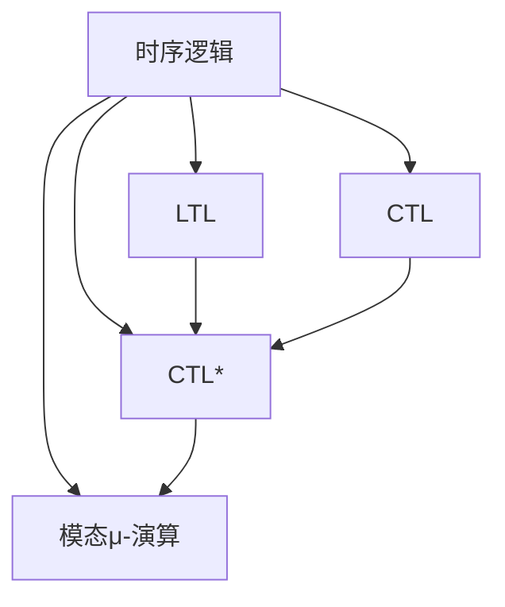
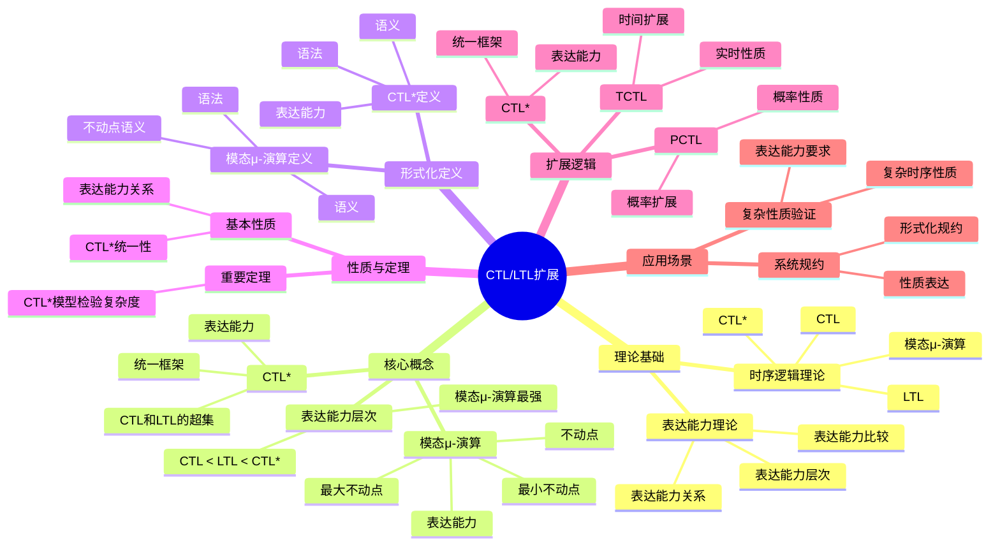
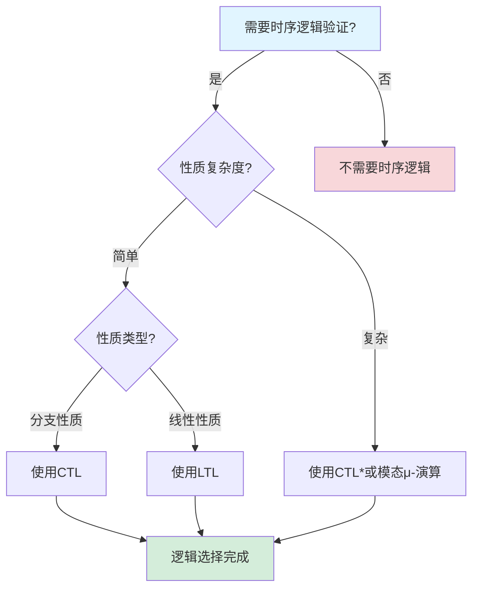
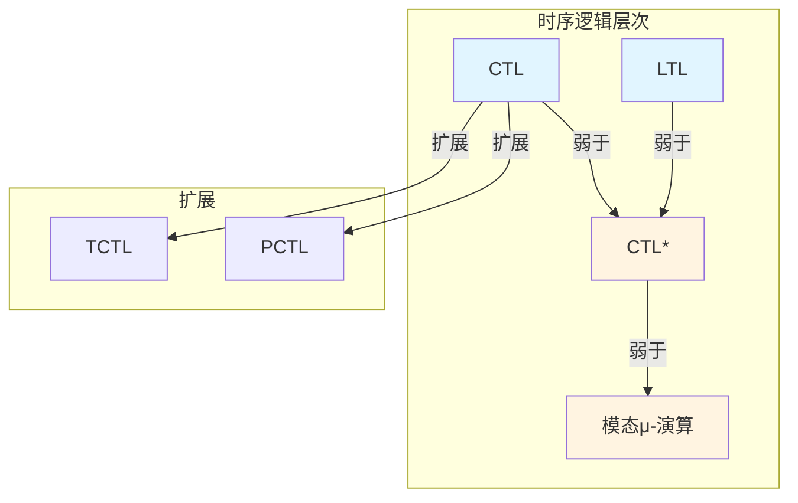

# CTL/LTL扩展专题文档

## 目录

- [CTL/LTL扩展专题文档](#ctlltl扩展专题文档)
  - [目录](#目录)
  - [一、概述](#一概述)
    - [1.1 CTL/LTL扩展简介](#11-ctlltl扩展简介)
    - [1.2 核心思想](#12-核心思想)
    - [1.3 应用领域](#13-应用领域)
    - [1.4 在本项目中的应用](#14-在本项目中的应用)
  - [二、历史背景](#二历史背景)
    - [2.1 发展历史](#21-发展历史)
    - [2.2 重要人物](#22-重要人物)
    - [2.3 重要里程碑](#23-重要里程碑)
  - [三、核心概念](#三核心概念)
    - [3.1 基本概念](#31-基本概念)
      - [概念1：CTL\*](#概念1ctl)
      - [概念2：模态μ-演算（Modal μ-calculus）](#概念2模态μ-演算modal-μ-calculus)
      - [概念3：表达能力层次](#概念3表达能力层次)
    - [3.2 概念关系](#32-概念关系)
  - [四、形式化定义](#四形式化定义)
    - [4.1 数学定义](#41-数学定义)
      - [定义1：CTL\*](#定义1ctl)
      - [定义2：模态μ-演算](#定义2模态μ-演算)
    - [4.2 语法定义](#42-语法定义)
      - [CTL\*语法要素](#ctl语法要素)
      - [模态μ-演算语法要素](#模态μ-演算语法要素)
    - [4.3 语义定义](#43-语义定义)
      - [语义1：CTL\*语义](#语义1ctl语义)
      - [语义2：模态μ-演算语义](#语义2模态μ-演算语义)
  - [五、性质与定理](#五性质与定理)
    - [5.1 基本性质](#51-基本性质)
      - [性质1：表达能力关系](#性质1表达能力关系)
      - [性质2：CTL\*统一性](#性质2ctl统一性)
    - [5.2 重要定理](#52-重要定理)
      - [定理1：CTL\*模型检验复杂度](#定理1ctl模型检验复杂度)
  - [六、扩展逻辑](#六扩展逻辑)
    - [6.1 CTL\*](#61-ctl)
      - [6.1.1 CTL\*语法](#611-ctl语法)
      - [6.1.2 CTL\*表达能力](#612-ctl表达能力)
    - [6.2 模态μ-演算](#62-模态μ-演算)
      - [6.2.1 模态μ-演算语法](#621-模态μ-演算语法)
      - [6.2.2 模态μ-演算表达能力](#622-模态μ-演算表达能力)
    - [6.3 其他扩展](#63-其他扩展)
      - [6.3.1 时间CTL（TCTL）](#631-时间ctltctl)
      - [6.3.2 概率CTL（PCTL）](#632-概率ctlpctl)
  - [七、应用场景](#七应用场景)
    - [7.1 适用场景](#71-适用场景)
      - [场景1：复杂性质验证](#场景1复杂性质验证)
      - [场景2：系统规约](#场景2系统规约)
    - [7.2 不适用场景](#72-不适用场景)
      - [场景1：简单性质](#场景1简单性质)
      - [场景2：性能要求](#场景2性能要求)
  - [八、实践案例](#八实践案例)
    - [8.1 工业界案例](#81-工业界案例)
      - [案例1：复杂系统验证](#案例1复杂系统验证)
    - [8.2 学术界案例](#82-学术界案例)
      - [案例1：扩展逻辑理论研究](#案例1扩展逻辑理论研究)
  - [九、学习资源](#九学习资源)
    - [9.1 推荐阅读](#91-推荐阅读)
      - [经典著作](#经典著作)
      - [原始论文](#原始论文)
    - [9.2 学习路径](#92-学习路径)
      - [入门路径（1-2周）](#入门路径1-2周)
  - [十、参考文献](#十参考文献)
    - [10.1 经典文献](#101-经典文献)
      - [原始论文](#原始论文-1)
    - [10.2 在线资源](#102-在线资源)
      - [Wikipedia](#wikipedia)
      - [经典著作](#经典著作-1)
  - [十一、思维表征](#十一思维表征)
    - [11.1 知识体系思维导图](#111-知识体系思维导图)
    - [11.2 多维知识对比矩阵](#112-多维知识对比矩阵)
      - [矩阵1：时序逻辑表达能力对比矩阵](#矩阵1时序逻辑表达能力对比矩阵)
      - [矩阵2：CTL/LTL扩展对比矩阵](#矩阵2ctlltl扩展对比矩阵)
    - [11.3 论证决策树](#113-论证决策树)
      - [决策树1：时序逻辑选择决策树](#决策树1时序逻辑选择决策树)
    - [11.4 概念属性关系图](#114-概念属性关系图)
    - [11.5 形式化证明流程图](#115-形式化证明流程图)
      - [证明流程图1：CTL\*模型检验复杂度证明](#证明流程图1ctl模型检验复杂度证明)

---

## 一、概述

### 1.1 CTL/LTL扩展简介

**CTL/LTL扩展** 是CTL和LTL的扩展逻辑，包括CTL*、模态μ-演算等。这些扩展逻辑提供了更强的表达能力，用于描述和验证更复杂的系统性质。

**来源**：基于Emerson & Halpern的原始论文和相关理论

**核心特点**：

1. **统一框架**：CTL*统一了CTL和LTL
2. **更强表达**：模态μ-演算提供更强的表达能力
3. **形式化验证**：用于形式化验证系统性质
4. **广泛应用**：广泛应用于形式化验证

### 1.2 核心思想

**核心思想1：CTL*统一框架**

CTL*统一了CTL和LTL：

- **路径公式**：可以表达路径上的性质
- **状态公式**：可以表达状态上的性质
- **统一语法**：统一的语法框架

**核心思想2：模态μ-演算**

模态μ-演算提供更强的表达能力：

- **不动点**：使用不动点算子
- **递归性质**：可以表达递归性质
- **最强表达**：是最强的时序逻辑之一

**核心思想3：表达能力层次**

时序逻辑形成表达能力层次：

- **LTL**：线性时序逻辑
- **CTL**：分支时序逻辑
- **CTL***：统一框架
- **μ-演算**：模态μ-演算

### 1.3 应用领域

**应用领域1：形式化验证**

- 系统性质验证
- 模型检验
- 定理证明

**应用领域2：程序验证**

- 程序正确性验证
- 并发程序验证
- 实时程序验证

**应用领域3：系统设计**

- 系统规约
- 性质描述
- 设计验证

### 1.4 在本项目中的应用

**在本项目中的应用**：

1. **工作流性质验证**：使用扩展逻辑验证工作流的复杂性质
2. **系统规约**：使用扩展逻辑描述系统规约
3. **形式化验证**：进行形式化验证

**相关文档链接**：

- [CTL专题文档](CTL专题文档.md)
- [LTL专题文档](LTL专题文档.md)
- [形式化验证理论](../03-formal-verification/形式化验证理论.md)

---

## 二、历史背景

### 2.1 发展历史

**1986年**：CTL*提出

- **论文**："Characterizing Correctness Properties of Parallel Programs Using Fixpoints" by Emerson & Halpern
- **贡献**：提出了CTL*统一框架

**1980年代**：模态μ-演算

- **提出**：提出模态μ-演算
- **应用**：应用于形式化验证

**1990年代**：理论发展

- **扩展**：提出多种扩展逻辑
- **应用**：广泛应用于形式化验证

**2000年代至今**：持续发展

- **新扩展**：提出新的扩展逻辑
- **工具**：开发支持扩展逻辑的工具

**来源**：Emerson & Halpern的原始论文和相关理论

### 2.2 重要人物

**E. Allen Emerson & Joseph Y. Halpern**

- **身份**：CTL*的共同提出者
- **背景**：美国计算机科学家
- **贡献**：
  - 提出CTL*统一框架
  - 在时序逻辑方面做出重要贡献

**来源**：相关论文和文献

### 2.3 重要里程碑

| 时间 | 里程碑 | 影响 |
|------|--------|------|
| **1986** | CTL*提出 | 统一CTL和LTL |
| **1980** | 模态μ-演算 | 提供更强表达能力 |
| **1990** | 大规模应用 | 证明扩展逻辑实用性 |

---

## 三、核心概念

### 3.1 基本概念

#### 概念1：CTL*

**定义**：CTL*是统一CTL和LTL的时序逻辑框架。

**特点**：

- **路径公式**：可以表达路径上的性质
- **状态公式**：可以表达状态上的性质
- **统一语法**：统一的语法框架

**来源**：Emerson & Halpern, "Characterizing Correctness Properties" (1986)

#### 概念2：模态μ-演算（Modal μ-calculus）

**定义**：模态μ-演算是使用不动点算子的时序逻辑。

**特点**：

- **不动点**：使用最小不动点（μ）和最大不动点（ν）
- **递归性质**：可以表达递归性质
- **最强表达**：是最强的时序逻辑之一

**来源**：相关模态μ-演算理论

#### 概念3：表达能力层次

**定义**：时序逻辑形成表达能力层次。

**层次**：

- **LTL** ⊂ **CTL*** ⊃ **CTL**
- **CTL*** ⊂ **μ-演算**

**来源**：相关时序逻辑理论

### 3.2 概念关系

**概念关系图**：



---

## 四、形式化定义

### 4.1 数学定义

#### 定义1：CTL*

**定义**：CTL*公式的语法定义如下：

**路径公式**：

$$ \phi ::= p | \neg \phi | \phi \land \psi | X\phi | F\phi | G\phi | \phi U \psi $$

**状态公式**：

$$ \psi ::= p | \neg \psi | \psi \land \chi | A\phi | E\phi $$

其中 $\phi$ 是路径公式，$\psi$ 是状态公式。

**来源**：Emerson & Halpern, "Characterizing Correctness Properties" (1986)

#### 定义2：模态μ-演算

**定义**：模态μ-演算的语法定义如下：

$$ \phi ::= p | \neg \phi | \phi \land \psi | [a]\phi | \mu X.\phi | \nu X.\phi $$

其中：

- $[a]\phi$ 表示在所有 $a$ 转换后满足 $\phi$
- $\mu X.\phi$ 表示最小不动点
- $\nu X.\phi$ 表示最大不动点

**来源**：相关模态μ-演算理论

### 4.2 语法定义

#### CTL*语法要素

**1. 路径公式**

```tla
X \phi    -- 下一步
F \phi    -- 最终
G \phi    -- 总是
\phi U \psi  -- 直到
```

**2. 状态公式**

```tla
A \phi    -- 所有路径
E \phi    -- 存在路径
```

#### 模态μ-演算语法要素

**1. 模态运算符**

```tla
[a] \phi    -- 所有a转换后
<a> \phi    -- 存在a转换后
```

**2. 不动点算子**

```tla
\mu X. \phi    -- 最小不动点
\nu X. \phi    -- 最大不动点
```

### 4.3 语义定义

#### 语义1：CTL*语义

**定义**：CTL*公式在Kripke结构和状态/路径上的语义。

**形式化定义**：

- 路径公式在路径上解释
- 状态公式在状态上解释

**来源**：Emerson & Halpern, "Characterizing Correctness Properties" (1986)

#### 语义2：模态μ-演算语义

**定义**：模态μ-演算公式在Kripke结构上的语义。

**形式化定义**：

- 使用不动点语义
- 最小不动点：$\mu X.\phi = \bigcap \{S: \phi(S) \subseteq S\}$
- 最大不动点：$\nu X.\phi = \bigcup \{S: S \subseteq \phi(S)\}$

**来源**：相关模态μ-演算理论

---

## 五、性质与定理

### 5.1 基本性质

#### 性质1：表达能力关系

**表述**：时序逻辑的表达能力关系。

**形式化表述**：

$$ \text{LTL} \subsetneq \text{CTL}^* \supsetneq \text{CTL} $$

$$ \text{CTL}^* \subsetneq \mu\text{-calculus} $$

**来源**：Emerson & Halpern, "Characterizing Correctness Properties" (1986)

#### 性质2：CTL*统一性

**表述**：CTL*统一了CTL和LTL。

**形式化表述**：

$$ \text{CTL} \subseteq \text{CTL}^* \land \text{LTL} \subseteq \text{CTL}^* $$

**来源**：Emerson & Halpern, "Characterizing Correctness Properties" (1986)

### 5.2 重要定理

#### 定理1：CTL*模型检验复杂度

**表述**：CTL*模型检验的时间复杂度是指数级的。

**形式化表述**：

对于CTL*公式 $\phi$ 和Kripke结构 $M$，模型检验的时间复杂度为：

$$ O(|\phi| \times 2^{|\phi|} \times (|S| + |R|)) $$

**来源**：相关CTL*模型检验理论

---

## 六、扩展逻辑

### 6.1 CTL*

#### 6.1.1 CTL*语法

**路径公式**：

$$ \phi ::= p | \neg \phi | \phi \land \psi | X\phi | F\phi | G\phi | \phi U \psi $$

**状态公式**：

$$ \psi ::= p | \neg \psi | \psi \land \chi | A\phi | E\phi $$

**来源**：Emerson & Halpern, "Characterizing Correctness Properties" (1986)

#### 6.1.2 CTL*表达能力

**CTL*可以表达**：

- 所有CTL可表达的性质
- 所有LTL可表达的性质
- 一些CTL和LTL都不能表达的性质

**示例**：

- $E[GF p]$：存在路径，在该路径上最终总是满足 $p$

**来源**：Emerson & Halpern, "Characterizing Correctness Properties" (1986)

### 6.2 模态μ-演算

#### 6.2.1 模态μ-演算语法

**语法**：

$$ \phi ::= p | \neg \phi | \phi \land \psi | [a]\phi | \mu X.\phi | \nu X.\phi $$

**来源**：相关模态μ-演算理论

#### 6.2.2 模态μ-演算表达能力

**模态μ-演算可以表达**：

- 所有CTL*可表达的性质
- 一些CTL*不能表达的性质
- 递归性质

**示例**：

- $\mu X.p \lor [a]X$：最终满足 $p$（使用最小不动点）
- $\nu X.p \land [a]X$：总是满足 $p$（使用最大不动点）

**来源**：相关模态μ-演算理论

### 6.3 其他扩展

#### 6.3.1 时间CTL（TCTL）

**描述**：时间CTL是CTL的时间扩展。

**特点**：

- **时间约束**：支持时间约束
- **实时性质**：可以表达实时性质

**来源**：相关时间CTL理论

#### 6.3.2 概率CTL（PCTL）

**描述**：概率CTL是CTL的概率扩展。

**特点**：

- **概率性质**：支持概率性质
- **概率模型**：可以表达概率模型

**来源**：相关概率CTL理论

---

## 七、应用场景

### 7.1 适用场景

#### 场景1：复杂性质验证

**描述**：使用扩展逻辑验证复杂的系统性质。

**优势**：

- 可以表达更复杂的性质
- 可以验证递归性质
- 提供更强的表达能力

**示例**：复杂系统验证、递归性质验证

#### 场景2：系统规约

**描述**：使用扩展逻辑描述系统规约。

**优势**：

- 可以描述复杂的系统行为
- 可以提供精确的规约
- 支持形式化验证

**示例**：系统规约、性质描述

### 7.2 不适用场景

#### 场景1：简单性质

**描述**：对于简单性质，可能不需要扩展逻辑。

**原因**：

- 简单性质可以使用CTL或LTL
- 扩展逻辑增加复杂性

#### 场景2：性能要求

**描述**：扩展逻辑的模型检验可能较慢。

**原因**：

- 扩展逻辑的模型检验复杂度较高
- 可能不适合实时验证

---

## 八、实践案例

### 8.1 工业界案例

#### 案例1：复杂系统验证

**背景**：使用扩展逻辑验证复杂系统的性质。

**应用**：

- 系统性质验证
- 递归性质验证
- 复杂行为验证

**效果**：

- 验证了复杂的系统性质
- 发现了系统问题
- 提高了系统可靠性

**来源**：相关系统验证案例

### 8.2 学术界案例

#### 案例1：扩展逻辑理论研究

**背景**：Emerson & Halpern等进行扩展逻辑理论研究。

**贡献**：

- 建立了扩展逻辑理论
- 提供了统一框架
- 推动了形式化验证研究

**来源**：Emerson & Halpern的原始论文

---

## 九、学习资源

### 9.1 推荐阅读

#### 经典著作

1. **"Principles of Model Checking"**
   - 作者：Christel Baier, Joost-Pieter Katoen
   - 出版社：MIT Press
   - 出版年份：2008
   - **推荐理由**：包含扩展逻辑的详细讲解

#### 原始论文

1. **"Characterizing Correctness Properties of Parallel Programs Using Fixpoints"**
   - 作者：E. Allen Emerson, Joseph Y. Halpern
   - 年份：1986
   - **推荐理由**：CTL*的原始论文

### 9.2 学习路径

#### 入门路径（1-2周）

1. **Week 1**：
   - 学习CTL和LTL基础
   - 理解CTL*统一框架
   - 学习CTL*语法和语义

2. **Week 2**：
   - 学习模态μ-演算
   - 理解不动点算子
   - 完成实际案例分析

---

## 十、参考文献

### 10.1 经典文献

#### 原始论文

1. **Emerson, E. A., & Halpern, J. Y. (1986). "Characterizing Correctness Properties of Parallel Programs Using Fixpoints"**
   - **重要性**：CTL*的原始论文

### 10.2 在线资源

#### Wikipedia

- [CTL*](https://en.wikipedia.org/wiki/CTL*)
- [Modal μ-calculus](https://en.wikipedia.org/wiki/Modal_μ-calculus)

#### 经典著作

- **"Principles of Model Checking"** by Baier & Katoen (2008)

---

**文档版本**：1.0

**创建时间**：2024年

**维护者**：项目团队

**最后更新**：2024年

**对标资源**：

- ✅ 经典著作: "Principles of Model Checking" by Baier & Katoen (2008)
- ✅ 原始论文: "Characterizing Correctness Properties" by Emerson & Halpern (1986)
- ✅ Wikipedia: [CTL*](https://en.wikipedia.org/wiki/CTL*), [Modal μ-calculus](https://en.wikipedia.org/wiki/Modal_μ-calculus)
- ✅ 大学课程: CMU 15-811, Stanford CS237B

---

## 十一、思维表征

### 11.1 知识体系思维导图

**CTL/LTL扩展知识体系思维导图**：



### 11.2 多维知识对比矩阵

#### 矩阵1：时序逻辑表达能力对比矩阵

| 时序逻辑 | 表达能力 | 复杂度 | 工具支持 | 适用场景 |
|---------|---------|--------|---------|---------|
| **CTL** | ⭐⭐⭐⭐ | ⭐⭐⭐ | ⭐⭐⭐⭐⭐ | 硬件验证 |
| **LTL** | ⭐⭐⭐ | ⭐⭐⭐ | ⭐⭐⭐⭐⭐ | 协议验证 |
| **CTL*** | ⭐⭐⭐⭐⭐ | ⭐⭐⭐⭐ | ⭐⭐⭐ | 复杂性质验证 |
| **模态μ-演算** | ⭐⭐⭐⭐⭐ | ⭐⭐⭐⭐⭐ | ⭐⭐ | 最强表达能力 |

#### 矩阵2：CTL/LTL扩展对比矩阵

| 扩展 | 扩展类型 | 表达能力 | 复杂度 | 适用场景 |
|------|---------|---------|--------|---------|
| **CTL*** | 统一框架 | ⭐⭐⭐⭐⭐ | ⭐⭐⭐⭐ | 复杂性质验证 |
| **TCTL** | 时间扩展 | ⭐⭐⭐⭐ | ⭐⭐⭐⭐ | 实时系统验证 |
| **PCTL** | 概率扩展 | ⭐⭐⭐⭐ | ⭐⭐⭐⭐⭐ | 概率系统验证 |

### 11.3 论证决策树

#### 决策树1：时序逻辑选择决策树



### 11.4 概念属性关系图

**CTL/LTL扩展核心概念属性关系图**：



### 11.5 形式化证明流程图

#### 证明流程图1：CTL*模型检验复杂度证明

```mermaid
flowchart TD
    A[开始证明: CTL*模型检验复杂度] --> B[分析CTL*模型检验算法]
    B --> C[构造CTL*公式的语法树]

    C --> D[对每个子公式]
    D --> E{子公式类型?}

    E -->|路径量词| F[处理路径量词]
    E -->|时序运算符| G[处理时序运算符]

    F --> H[复杂度: O(|S| × |T|)]
    G --> I[复杂度: O(2^|φ|)]

    H --> J[组合复杂度]
    I --> J

    J --> K[结论: O(|S| × |T| × 2^|φ|)]
    K --> L[证明完成]

    style A fill:#e1f5ff
    style L fill:#d4edda
```

---

**思维表征说明**：

- **思维导图**：全面展示CTL/LTL扩展的知识体系结构
- **对比矩阵**：从多个维度对比时序逻辑和扩展
- **决策树**：提供清晰的决策路径，帮助选择合适的时序逻辑
- **关系图**：详细展示时序逻辑层次和扩展之间的关系
- **证明流程图**：可视化CTL*模型检验复杂度证明的步骤和逻辑

**来源**：基于CTL/LTL扩展理论、Baier & Katoen的著作和实际应用经验
